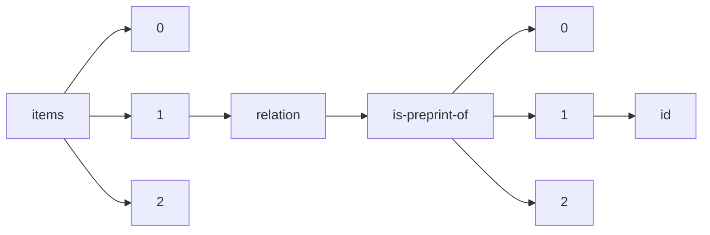

!!! warning "This document is not official Crossref documentation"
# Id
PATH = items/array/relation/is-preprint-of/array/id(1)  
Occurs 353 863 times  
Unique values: > 999  
{ .annotate }

1. A route to an element, for example:  
   The route "items/array/relation/is-preprint-of/array/id" corresponds to navigating through the JSON indices as  
   ["items"][0]["relation"]["is-preprint-of"][0]["id"]  

!!! note "Due to current limitations, only the first 1,000 unique values are counted."

| **Row** | **Value** `String`           | **Count** `Int64` |
|--------:|--------------------------------:|---------------------:|
| **1**   | 10.31237/osf.io/yr86k           | 372                  |
| **2**   | 10.1158/0008-5472.CAN-22-3133   | 60                   |
| **3**   | 10.1158/1055-9965.EPI-22-0928   | 43                   |
| **4**   | 10.1158/0008-5472.CAN-10-0765   | 43                   |
| **5**   | 10.1158/1055-9965.EPI-22-0929   | 42                   |
| **6**   | 10.1158/0008-5472.CAN-22-1826   | 40                   |
| **7**   | 10.31237/osf.io/yex9a           | 38                   |
| **8**   | 10.1158/2767-9764.CRC-22-0403   | 35                   |
| **9**   | 10.1158/0008-5472.CAN-19-1523   | 33                   |
| **10**  | 10.1158/0008-5472.CAN-20-0212   | 32                   |
| **11**  | 10.1158/0008-5472.CAN-22-1433   | 32                   |
| **12**  | 10.1158/0008-5472.CAN-21-0791   | 31                   |
| **13**  | 10.1158/0008-5472.CAN-05-0120   | 29                   |
| **14**  | 10.1158/0008-5472.CAN-21-4222   | 28                   |
| **15**  | 10.1158/0008-5472.CAN-11-1818   | 27                   |
| **16**  | 10.1158/0008-5472.CAN-07-0752   | 27                   |
| **17**  | 10.1158/0008-5472.CAN-19-2268   | 26                   |
| **18**  | 10.1158/0008-5472.CAN-13-0704   | 25                   |
| **19**  | 10.1158/1078-0432.CCR-22-2535   | 25                   |
| **20**  | 10.1158/0008-5472.CAN-07-5725   | 24                   |
| **21**  | 10.1158/0008-5472.CAN-09-4062   | 23                   |
| **22**  | 10.1158/1055-9965.EPI-22-0798   | 23                   |
| **23**  | 10.1158/0008-5472.CAN-14-1327   | 22                   |
| **24**  | 10.1158/0008-5472.CAN-21-1500   | 22                   |
| **25**  | 10.1158/0008-5472.CAN-06-1710   | 22                   |
| **26**  | 10.1158/0008-5472.CAN-09-1577   | 22                   |
| **27**  | 10.1158/0008-5472.CAN-14-3265   | 22                   |
| **28**  | 10.31237/osf.io/ezuw4           | 22                   |
| **29**  | 10.1158/0008-5472.CAN-07-6595   | 21                   |
| **30**  | 10.1158/0008-5472.CAN-19-1363   | 21                   |
| **31**  | 10.1158/0008-5472.CAN-13-2681   | 21                   |
| **32**  | 10.1158/0008-5472.CAN-15-0776   | 21                   |
| **33**  | 10.1158/1078-0432.CCR-22-3886   | 21                   |
| **34**  | 10.1158/0008-5472.CAN-06-3696   | 20                   |
| **35**  | 10.1158/0008-5472.CAN-05-4183   | 20                   |
| **36**  | 10.1158/0008-5472.CAN-06-3754   | 20                   |
| **37**  | 10.1158/0008-5472.CAN-12-1881   | 20                   |
| **38**  | 10.1158/0008-5472.CAN-20-1744   | 20                   |
| **39**  | 10.1158/0008-5472.CAN-07-5590   | 20                   |
| **40**  | 10.1158/0008-5472.CAN-19-0743   | 20                   |
| **41**  | 10.1158/0008-5472.CAN-06-0721   | 19                   |
| **42**  | 10.1158/0008-5472.CAN-07-6353   | 19                   |
| **43**  | 10.1158/0008-5472.CAN-14-3510   | 19                   |
| **44**  | 10.1158/0008-5472.CAN-12-4115   | 19                   |
| **45**  | 10.1158/0008-5472.CAN-12-1389   | 19                   |
| **46**  | 10.1158/0008-5472.CAN-10-3038   | 19                   |
| **47**  | 10.1158/0008-5472.CAN-06-4724   | 18                   |
| **48**  | 10.1158/0008-5472.CAN-13-1606   | 18                   |
| **49**  | 10.1158/0008-5472.CAN-04-2434   | 18                   |
| **50**  | 10.17970/jrem.16.160205.ID      | 18                   |
| **51**  | 10.1158/0008-5472.CAN-09-2008   | 18                   |
| **52**  | 10.1158/0008-5472.CAN-07-5560   | 18                   |
| **53**  | 10.1158/0008-5472.CAN-14-3547   | 18                   |
| **54**  | 10.1158/0008-5472.CAN-14-1645   | 18                   |
| **55**  | 10.1158/0008-5472.CAN-08-4859   | 18                   |
| **56**  | 10.1158/0008-5472.CAN-14-0169   | 18                   |
| **57**  | 10.1158/0008-5472.CAN-03-1850   | 18                   |
| **58**  | 10.1158/0008-5472.CAN-06-0561   | 18                   |
| **59**  | 10.1158/0008-5472.CAN-08-3441   | 17                   |
| **60**  | 10.1158/0008-5472.CAN-05-1531   | 17                   |
| **61**  | 10.1158/0008-5472.CAN-08-3082   | 17                   |
| **62**  | 10.1158/0008-5472.CAN-21-0871   | 17                   |
| **63**  | 10.1158/0008-5472.CAN-10-1749   | 17                   |
| **64**  | 10.1158/0008-5472.CAN-13-0767   | 17                   |
| **65**  | 10.1158/0008-5472.CAN-09-2722   | 17                   |
| **66**  | 10.1158/0008-5472.CAN-20-1750   | 16                   |
| **67**  | 10.1158/0008-5472.CAN-12-0886   | 16                   |
| **68**  | 10.1158/0008-5472.CAN-06-4094   | 16                   |
| **69**  | 10.1158/0008-5472.CAN-20-0754   | 16                   |
| **70**  | 10.1158/0008-5472.CAN-16-3279   | 16                   |
| **71**  | 10.1158/0008-5472.CAN-14-2611   | 16                   |
| **72**  | 10.1158/0008-5472.CAN-13-0837   | 16                   |
| **73**  | 10.1158/0008-5472.CAN-12-0688   | 16                   |
| **74**  | 10.31237/osf.io/f2zda           | 16                   |
| **75**  | 10.1158/0008-5472.CAN-21-1153   | 16                   |
| **76**  | 10.1158/0008-5472.CAN-06-0040   | 16                   |
| **77**  | 10.1158/0008-5472.CAN-09-2544   | 16                   |
| **78**  | 10.1158/0008-5472.CAN-16-2274   | 16                   |
| **79**  | 10.1158/0008-5472.CAN-13-1746   | 16                   |
| **80**  | 10.1158/0008-5472.CAN-04-3506   | 16                   |
| **81**  | 10.1158/0008-5472.CAN-07-6699   | 16                   |
| **82**  | 10.1158/0008-5472.CAN-13-3706   | 15                   |
| **83**  | 10.1158/0008-5472.CAN-11-1803   | 15                   |
| **84**  | 10.1158/1078-0432.CCR-22-3168   | 15                   |
| **85**  | 10.1158/0008-5472.CAN-10-1142   | 15                   |
| **86**  | 10.1158/0008-5472.CAN-16-1646   | 15                   |
| **87**  | 10.1158/0008-5472.CAN-20-3929   | 15                   |
| **88**  | 10.1158/0008-5472.CAN-04-2201   | 15                   |
| **89**  | 10.1158/0008-5472.CAN-09-1677   | 15                   |
| **90**  | 10.1158/0008-5472.CAN-06-4026   | 15                   |
| **91**  | 10.1158/0008-5472.CAN-05-2916   | 14                   |
| **92**  | 10.1158/0008-5472.CAN-06-0283   | 14                   |
| **93**  | 10.1158/0008-5472.CAN-05-0153   | 14                   |
| **94**  | 10.1158/0008-5472.CAN-19-1415   | 14                   |
| **95**  | 10.1158/0008-5472.CAN-12-1906   | 14                   |
| **96**  | 10.1158/0008-5472.CAN-18-1342   | 14                   |
| **97**  | 10.1158/0008-5472.CAN-09-2736   | 14                   |
| **98**  | 10.1158/1055-9965.EPI-22-0948   | 14                   |
| **99**  | 10.1158/0008-5472.CAN-06-1599   | 14                   |
| **100** | 10.1158/0008-5472.CAN-04-2935   | 14                   |
| **101** | 10.1158/2767-9764.CRC-23-0015   | 14                   |
| **102** | 10.1158/0008-5472.CAN-11-1514   | 14                   |
| **103** | 10.1158/0008-5472.BCD-19-0039   | 14                   |
| **104** | 10.1158/0008-5472.CAN-22-2129   | 14                   |
| **105** | 10.1158/0008-5472.CAN-22-1533   | 14                   |
| **106** | 10.1158/0008-5472.CAN-20-0907   | 14                   |
| **107** | 10.1158/0008-5472.CAN-07-2580   | 14                   |
| **108** | 10.1158/0008-5472.CAN-11-0943   | 14                   |
| **109** | 10.1158/0008-5472.CAN-21-0030   | 14                   |
| **110** | 10.1158/0008-5472.CAN-17-0846   | 14                   |
| **111** | 10.1158/1055-9965.EPI-09-1095   | 13                   |
| **112** | 10.1158/0008-5472.CAN-06-1986   | 13                   |
| **113** | 10.1158/0008-5472.CAN-05-1084   | 13                   |
| **114** | 10.1158/0008-5472.CAN-11-2484   | 13                   |
| **115** | 10.1158/0008-5472.CAN-13-2474   | 13                   |
| **116** | 10.1158/2767-9764.CRC-22-0339   | 13                   |
| **117** | 10.1158/0008-5472.CAN-14-1589   | 13                   |
| **118** | 10.1158/0008-5472.CAN-13-0681   | 13                   |
| **119** | 10.1158/0008-5472.CAN-19-2914   | 13                   |
| **120** | 10.1158/0008-5472.CAN-07-0765   | 13                   |
| **121** | 10.1158/0008-5472.CAN-22-0432   | 13                   |
| **122** | 10.1158/0008-5472.CAN-16-1887   | 13                   |
| **123** | 10.1158/0008-5472.CAN-19-0400   | 13                   |
| **124** | 10.1158/0008-5472.CAN-22-1444   | 13                   |
| **125** | 10.1158/0008-5472.CAN-22-3083   | 13                   |
| **126** | 10.1158/0008-5472.CAN-06-3032   | 13                   |
| **127** | 10.1158/0008-5472.CAN-12-2130   | 13                   |
| **128** | 10.1158/0008-5472.CAN-22-0431   | 13                   |
| **129** | 10.1158/0008-5472.CAN-07-0663   | 13                   |
| **130** | 10.1158/0008-5472.CAN-05-0642   | 13                   |
| **131** | 10.1158/0008-5472.CAN-10-0384   | 13                   |
| **132** | 10.1158/0008-5472.CAN-19-0492   | 13                   |
| **133** | 10.1158/0008-5472.CAN-06-3755   | 13                   |
| **134** | 10.1158/0008-5472.CAN-16-1839   | 13                   |
| **135** | 10.1158/0008-5472.CAN-07-1297   | 12                   |
| **136** | 10.31237/osf.io/4envj           | 12                   |
| **137** | 10.1158/0008-5472.CAN-11-3648   | 12                   |
| **138** | 10.1158/0008-5472.CAN-17-1018   | 12                   |
| **139** | 10.1158/0008-5472.CAN-07-2056   | 12                   |
| **140** | 10.1158/0008-5472.CAN-19-0056   | 12                   |
| **141** | 10.1158/0008-5472.CAN-12-0509   | 12                   |
| **142** | 10.1158/0008-5472.CAN-11-0364   | 12                   |
| **143** | 10.1158/0008-5472.CAN-08-4277   | 12                   |
| **144** | 10.1158/0008-5472.CAN-18-3297   | 12                   |
| **145** | 10.1016/j.electacta.2022.140276 | 12                   |
| **146** | 10.1158/0008-5472.CAN-12-3902   | 12                   |
| **147** | 10.1158/0008-5472.CAN-12-3682   | 12                   |
| **148** | 10.1158/1078-0432.CCR-22-2601   | 12                   |
| **149** | 10.1158/0008-5472.CAN-22-2108   | 12                   |
| **150** | 10.1158/0008-5472.CAN-05-1714   | 12                   |
| **151** | 10.1158/0008-5472.CAN-22-0198   | 12                   |
| **152** | 10.1158/0008-5472.CAN-14-1903   | 12                   |
| **153** | 10.1158/0008-5472.CAN-04-3002   | 12                   |
| **154** | 10.1158/0008-5472.CAN-12-1463   | 12                   |
| **155** | 10.1158/0008-5472.CAN-22-1475   | 12                   |
| **156** | 10.1158/0008-5472.CAN-17-1323   | 12                   |
| **157** | 10.1158/0008-5472.CAN-16-0357   | 12                   |
| **158** | 10.1158/0008-5472.CAN-09-0986   | 12                   |
| **159** | 10.1158/2767-9764.CRC-22-0383   | 12                   |
| **160** | 10.1158/0008-5472.CAN-14-3041   | 12                   |
| **161** | 10.1158/0008-5472.CAN-16-3152   | 12                   |
| **162** | 10.1158/0008-5472.CAN-19-2416   | 12                   |
| **163** | 10.1158/0008-5472.CAN-15-0694   | 12                   |
| **164** | 10.1158/0008-5472.CAN-12-2052   | 12                   |
| **165** | 10.1158/0008-5472.CAN-14-1813   | 12                   |
| **166** | 10.1158/0008-5472.CAN-07-5671   | 12                   |
| **167** | 10.1158/0008-5472.CAN-06-2194   | 12                   |
| **168** | 10.1158/0008-5472.CAN-22-2042   | 11                   |
| **169** | 10.1158/0008-5472.CAN-08-0479   | 11                   |
| **170** | 10.1158/0008-5472.CAN-06-4471   | 11                   |
| **171** | 10.1158/0008-5472.CAN-22-1740   | 11                   |
| **172** | 10.1158/0008-5472.CAN-19-1493   | 11                   |
| **173** | 10.1158/0008-5472.CAN-13-1315   | 11                   |
| **174** | 10.1158/0008-5472.CAN-08-4043   | 11                   |
| **175** | 10.1158/0008-5472.CAN-18-0441   | 11                   |
| **176** | 10.1158/0008-5472.CAN-18-4093   | 11                   |
| **177** | 10.1158/0008-5472.CAN-20-1818   | 11                   |
| **178** | 10.1158/0008-5472.CAN-13-0920   | 11                   |
| **179** | 10.1158/0008-5472.CAN-20-2114   | 11                   |
| **180** | 10.1158/0008-5472.CAN-07-0533   | 11                   |
| **181** | 10.1158/0008-5472.CAN-17-2011   | 11                   |
| **182** | 10.1158/0008-5472.CAN-14-0125   | 11                   |
| **183** | 10.1158/0008-5472.CAN-06-2615   | 11                   |
| **184** | 10.1158/0008-5472.CAN-08-2568   | 11                   |
| **185** | 10.1158/0008-5472.CAN-10-1169   | 11                   |
| **186** | 10.1158/0008-5472.CAN-17-0610   | 11                   |
| **187** | 10.1158/0008-5472.CAN-07-0056   | 11                   |
| **188** | 10.1158/0008-5472.CAN-04-3218   | 11                   |
| **189** | 10.1158/0008-5472.CAN-10-1529   | 11                   |
| **190** | 10.1158/0008-5472.CAN-18-0951   | 11                   |
| **191** | 10.1158/0008-5472.CAN-16-3507   | 11                   |
| **192** | 10.1158/0008-5472.CAN-17-1536   | 11                   |
| **193** | 10.1158/0008-5472.CAN-22-1369   | 11                   |
| **194** | 10.1158/0008-5472.CAN-18-3275   | 11                   |
| **195** | 10.1158/0008-5472.CAN-08-2846   | 11                   |
| **196** | 10.1158/0008-5472.CAN-17-1653   | 11                   |
| **197** | 10.1158/0008-5472.CAN-17-1869   | 11                   |
| **198** | 10.1158/0008-5472.CAN-16-2594   | 11                   |
| **199** | 10.1158/0008-5472.CAN-12-4586   | 11                   |
| **200** | 10.1158/0008-5472.CAN-07-5272   | 11                   |
| **201** | 10.1158/0008-5472.CAN-09-4094   | 11                   |
| **202** | 10.1158/0008-5472.CAN-14-1707   | 11                   |
| **203** | 10.1158/0008-5472.CAN-07-6842   | 11                   |
| **204** | 10.1158/0008-5472.CAN-10-0861   | 11                   |
| **205** | 10.1158/0008-5472.CAN-12-2505   | 11                   |
| **206** | 10.1158/0008-5472.CAN-06-1968   | 10                   |
| **207** | 10.1158/0008-5472.CAN-18-2032   | 10                   |
| **208** | 10.1158/0008-5472.CAN-17-1051   | 10                   |
| **209** | 10.1158/0008-5472.CAN-20-1968   | 10                   |
| **210** | 10.1158/0008-5472.CAN-10-2430   | 10                   |
| **211** | 10.1158/0008-5472.CAN-12-0614   | 10                   |
| **212** | 10.1158/1055-9965.EPI-10-1262   | 10                   |
| **213** | 10.1158/0008-5472.CAN-11-2330   | 10                   |
| **214** | 10.1158/0008-5472.CAN-22-0787   | 10                   |
| **215** | 10.1158/0008-5472.CAN-17-1915   | 10                   |
| **216** | 10.1158/0008-5472.CAN-17-2802   | 10                   |
| **217** | 10.1158/0008-5472.CAN-12-4499   | 10                   |
| **218** | 10.1158/0008-5472.CAN-10-2842   | 10                   |
| **219** | 10.1158/0008-5472.CAN-09-4213   | 10                   |
| **220** | 10.1158/0008-5472.CAN-08-3520   | 10                   |
| **221** | 10.1158/0008-5472.CAN-17-0216   | 10                   |
| **222** | 10.1158/0008-5472.CAN-13-0033   | 10                   |
| **223** | 10.1158/0008-5472.CAN-12-4539   | 10                   |
| **224** | 10.1158/0008-5472.CAN-06-3944   | 10                   |
| **225** | 10.1158/0008-5472.CAN-13-1002   | 10                   |
| **226** | 10.1158/0008-5472.CAN-05-3740   | 10                   |
| **227** | 10.31237/osf.io/2y38w           | 10                   |
| **228** | 10.1158/0008-5472.CAN-21-0101   | 10                   |
| **229** | 10.1158/0008-5472.CAN-12-3308   | 10                   |
| **230** | 10.1158/0008-5472.CAN-18-3257   | 10                   |
| **231** | 10.1158/0008-5472.CAN-12-0748   | 10                   |
| **232** | 10.1158/0008-5472.CAN-17-0653   | 10                   |
| **233** | 10.1158/0008-5472.CAN-22-2553   | 10                   |
| **234** | 10.1158/0008-5472.CAN-17-0682   | 10                   |
| **235** | 10.1158/0008-5472.CAN-06-1823   | 10                   |
| **236** | 10.1158/0008-5472.CAN-15-1864   | 10                   |
| **237** | 10.1158/0008-5472.CAN-18-1781   | 10                   |
| **238** | 10.1158/0008-5472.CAN-21-0482   | 10                   |
| **239** | 10.1158/0008-5472.CAN-16-1911   | 10                   |
| **240** | 10.1158/0008-5472.CAN-12-1045   | 10                   |
| **241** | 10.1158/0008-5472.CAN-14-0992   | 10                   |
| **242** | 10.1158/0008-5472.CAN-17-2465   | 10                   |
| **243** | 10.1158/0008-5472.CAN-14-1053   | 10                   |
| **244** | 10.1158/0008-5472.CAN-13-0429   | 10                   |
| **245** | 10.1158/0008-5472.CAN-06-1806   | 10                   |
| **246** | 10.1158/0008-5472.CAN-22-1742   | 10                   |
| **247** | 10.1158/0008-5472.CAN-15-1023   | 10                   |
| **248** | 10.1158/0008-5472.CAN-12-0820   | 10                   |
| **249** | 10.1158/0008-5472.CAN-18-2553   | 10                   |
| **250** | 10.1158/0008-5472.CAN-06-4173   | 10                   |
| **251** | 10.1158/0008-5472.CAN-17-1492   | 10                   |
| **252** | 10.1158/0008-5472.CAN-08-0062   | 10                   |
| **253** | 10.1158/0008-5472.CAN-15-2038   | 10                   |
| **254** | 10.1158/0008-5472.CAN-19-0012   | 10                   |
| **255** | 10.1158/0008-5472.CAN-07-1348   | 10                   |
| **256** | 10.1158/0008-5472.CAN-22-2224   | 9                    |
| **257** | 10.1158/0008-5472.CAN-09-1962   | 9                    |
| **258** | 10.1158/0008-5472.CAN-11-3711   | 9                    |
| **259** | 10.1158/0008-5472.CAN-06-3654   | 9                    |
| **260** | 10.1158/0008-5472.CAN-12-0803   | 9                    |
| **261** | 10.1158/0008-5472.CAN-18-1924   | 9                    |
| **262** | 10.1158/0008-5472.CAN-08-0755   | 9                    |
| **263** | 10.1158/0008-5472.CAN-18-1234   | 9                    |
| **264** | 10.1158/0008-5472.CAN-12-4127   | 9                    |
| **265** | 10.1158/0008-5472.CAN-06-1758   | 9                    |
| **266** | 10.1158/0008-5472.CAN-17-1904   | 9                    |
| **267** | 10.1158/0008-5472.CAN-08-0997   | 9                    |
| **268** | 10.1158/0008-5472.CAN-20-2929   | 9                    |
| **269** | 10.1158/0008-5472.CAN-16-0123   | 9                    |
| **270** | 10.1158/0008-5472.CAN-16-0725   | 9                    |
| **271** | 10.1158/0008-5472.CAN-19-1402   | 9                    |
| **272** | 10.1158/0008-5472.CAN-07-5039   | 9                    |
| **273** | 10.1158/0008-5472.CAN-14-1592   | 9                    |
| **274** | 10.1158/0008-5472.CAN-21-0953   | 9                    |
| **275** | 10.1158/0008-5472.CAN-06-3329   | 9                    |
| **276** | 10.1158/0008-5472.CAN-15-2377   | 9                    |
| **277** | 10.1158/0008-5472.CAN-19-3265   | 9                    |
| **278** | 10.1158/0008-5472.CAN-18-2220   | 9                    |
| **279** | 10.1158/0008-5472.CAN-15-1008   | 9                    |
| **280** | 10.1158/0008-5472.CAN-07-1229   | 9                    |
| **281** | 10.1158/0008-5472.CAN-17-2506   | 9                    |
| **282** | 10.1158/0008-5472.CAN-15-3084   | 9                    |
| **283** | 10.1158/0008-5472.CAN-18-3855   | 9                    |
| **284** | 10.1158/0008-5472.CAN-12-0736   | 9                    |
| **285** | 10.1158/0008-5472.CAN-11-3980   | 9                    |
| **286** | 10.1158/0008-5472.CAN-12-4136   | 9                    |
| **287** | 10.1158/0008-5472.CAN-15-2157   | 9                    |
| **288** | 10.1158/0008-5472.CAN-07-2780   | 9                    |
| **289** | 10.1158/0008-5472.CAN-13-0888   | 9                    |
| **290** | 10.1158/1055-9965.EPI-22-1198   | 9                    |
| **291** | 10.1158/0008-5472.CAN-18-2153   | 9                    |
| **292** | 10.1158/0008-5472.CAN-17-3146   | 9                    |
| **293** | 10.1158/0008-5472.CAN-17-1672   | 9                    |
| **294** | 10.1158/0008-5472.CAN-17-3018   | 9                    |
| **295** | 10.1158/0008-5472.CAN-15-2350   | 9                    |
| **296** | 10.1158/0008-5472.CAN-18-3835   | 9                    |
| **297** | 10.1158/0008-5472.CAN-19-3188   | 9                    |
| **298** | 10.1158/0008-5472.CAN-06-2761   | 9                    |
| **299** | 10.1158/0008-5472.CAN-17-1990   | 9                    |
| **300** | 10.1158/0008-5472.CAN-16-1457   | 9                    |
| **301** | 10.1158/0008-5472.CAN-07-0539   | 9                    |
| **302** | 10.1158/1055-9965.EPI-15-1061   | 9                    |
| **303** | 10.1158/0008-5472.CAN-16-2691   | 9                    |
| **304** | 10.1158/0008-5472.CAN-06-4793   | 9                    |
| **305** | 10.1158/0008-5472.CAN-12-1339-T | 9                    |
| **306** | 10.1158/0008-5472.CAN-08-1290   | 9                    |
| **307** | 10.1158/0008-5472.CAN-06-3348   | 9                    |
| **308** | 10.1158/0008-5472.CAN-15-1015   | 9                    |
| **309** | 10.1158/0008-5472.CAN-15-3486   | 9                    |
| **310** | 10.1158/0008-5472.CAN-09-3082   | 9                    |
| **311** | 10.1158/0008-5472.CAN-07-1198   | 9                    |
| **312** | 10.1158/0008-5472.CAN-08-2428   | 9                    |
| **313** | 10.1158/0008-5472.CAN-21-1785   | 9                    |
| **314** | 10.1158/0008-5472.CAN-16-2503   | 9                    |
| **315** | 10.1158/0008-5472.CAN-08-0237   | 9                    |
| **316** | 10.1158/0008-5472.CAN-17-0930   | 8                    |
| **317** | 10.1158/0008-5472.CAN-16-0881   | 8                    |
| **318** | 10.1158/0008-5472.CAN-13-1423   | 8                    |
| **319** | 10.1158/0008-5472.CAN-04-1150   | 8                    |
| **320** | 10.1158/1055-9965.EPI-11-0250   | 8                    |
| **321** | 10.1158/0008-5472.CAN-10-1960   | 8                    |
| **322** | 10.1158/0008-5472.CAN-17-1397   | 8                    |
| **323** | 10.1158/0008-5472.CAN-12-1155   | 8                    |
| **324** | 10.1158/0008-5472.CAN-05-4196   | 8                    |
| **325** | 10.1158/0008-5472.CAN-13-1198   | 8                    |
| **326** | 10.1158/0008-5472.CAN-17-1636   | 8                    |
| **327** | 10.1158/0008-5472.CAN-16-1982   | 8                    |
| **328** | 10.1158/0008-5472.CAN-06-2369   | 8                    |
| **329** | 10.1158/0008-5472.CAN-13-3581   | 8                    |
| **330** | 10.1158/0008-5472.CAN-09-0541   | 8                    |
| **331** | 10.1158/0008-5472.CAN-13-3455   | 8                    |
| **332** | 10.1158/0008-5472.CAN-13-0002   | 8                    |
| **333** | 10.1158/0008-5472.CAN-16-3236   | 8                    |
| **334** | 10.1158/0008-5472.CAN-21-3230   | 8                    |
| **335** | 10.1158/0008-5472.CAN-06-4807   | 8                    |
| **336** | 10.1158/0008-5472.CAN-21-0950   | 8                    |
| **337** | 10.1158/0008-5472.CAN-07-6814   | 8                    |
| **338** | 10.1158/0008-5472.CAN-15-1519   | 8                    |
| **339** | 10.1158/0008-5472.CAN-15-0816   | 8                    |
| **340** | 10.1158/0008-5472.CAN-15-0708   | 8                    |
| **341** | 10.1158/1055-9965.EPI-10-0555   | 8                    |
| **342** | 10.1158/0008-5472.CAN-11-0176   | 8                    |
| **343** | 10.1158/0008-5472.CAN-21-0371   | 8                    |
| **344** | 10.1158/0008-5472.CAN-14-0392   | 8                    |
| **345** | 10.1158/0008-5472.CAN-07-0293   | 8                    |
| **346** | 10.1158/0008-5472.CAN-09-3092   | 8                    |
| **347** | 10.1158/0008-5472.CAN-13-0368   | 8                    |
| **348** | 10.1158/0008-5472.CAN-17-0910   | 8                    |
| **349** | 10.1158/0008-5472.CAN-08-2457   | 8                    |
| **350** | 10.1158/0008-5472.CAN-22-1638   | 8                    |
| **351** | 10.1158/0008-5472.CAN-08-4147   | 8                    |
| **352** | 10.1158/0008-5472.CAN-06-4296   | 8                    |
| **353** | 10.1158/0008-5472.CAN-07-1161   | 8                    |
| **354** | 10.1158/0008-5472.CAN-05-2119   | 8                    |
| **355** | 10.1158/0008-5472.CAN-16-0593   | 8                    |
| **356** | 10.1158/0008-5472.CAN-13-2620   | 8                    |
| **357** | 10.1158/0008-5472.CAN-17-1076   | 8                    |
| **358** | 10.1158/0008-5472.CAN-07-6216   | 8                    |
| **359** | 10.1158/0008-5472.CAN-12-3150   | 8                    |
| **360** | 10.1158/0008-5472.CAN-18-2086   | 8                    |
| **361** | 10.1158/0008-5472.CAN-07-0922   | 8                    |
| **362** | 10.1158/0008-5472.CAN-16-2976   | 8                    |
| **363** | 10.1158/0008-5472.CAN-22-1812   | 8                    |
| **364** | 10.1158/0008-5472.CAN-13-1506   | 8                    |
| **365** | 10.1158/0008-5472.CAN-17-0883   | 8                    |
| **366** | 10.1158/0008-5472.CAN-20-2251   | 8                    |
| **367** | 10.1158/0008-5472.CAN-13-3663   | 8                    |
| **368** | 10.1158/1055-9965.EPI-10-0719   | 8                    |
| **369** | 10.1158/0008-5472.CAN-08-3338   | 8                    |
| **370** | 10.1158/0008-5472.CAN-18-0601   | 8                    |
| **371** | 10.1158/0008-5472.CAN-14-2394   | 8                    |
| **372** | 10.1158/0008-5472.CAN-13-2444   | 8                    |
| **373** | 10.1158/0008-5472.CAN-07-5727   | 8                    |
| **374** | 10.1158/0008-5472.CAN-10-1534   | 8                    |
| **375** | 10.1158/0008-5472.CAN-09-3871   | 8                    |
| **376** | 10.1158/0008-5472.CAN-06-3767   | 8                    |
| **377** | 10.1158/0008-5472.CAN-15-3125   | 8                    |
| **378** | 10.1158/0008-5472.CAN-11-0412   | 8                    |
| **379** | 10.1158/0008-5472.CAN-16-2571   | 8                    |
| **380** | 10.1158/0008-5472.CAN-21-4141   | 8                    |
| **381** | 10.1158/0008-5472.CAN-17-3629   | 8                    |
| **382** | 10.1158/0008-5472.CAN-13-2329   | 8                    |
| **383** | 10.1158/0008-5472.CAN-12-4213   | 8                    |
| **384** | 10.1158/0008-5472.CAN-06-2760   | 8                    |
| **385** | 10.1158/0008-5472.CAN-18-0363   | 8                    |
| **386** | 10.1158/0008-5472.CAN-11-3990   | 8                    |
| **387** | 10.1158/0008-5472.CAN-13-3382   | 8                    |
| **388** | 10.1158/0008-5472.CAN-19-1558   | 8                    |
| **389** | 10.1158/0008-5472.CAN-10-2769   | 8                    |
| **390** | 10.1158/0008-5472.CAN-06-2574   | 8                    |
| **391** | 10.1158/0008-5472.CAN-17-2316   | 8                    |
| **392** | 10.1158/0008-5472.CAN-18-3211   | 8                    |
| **393** | 10.1158/0008-5472.CAN-15-1697   | 8                    |
| **394** | 10.1158/0008-5472.CAN-16-3453   | 8                    |
| **395** | 10.1158/0008-5472.CAN-06-0916   | 8                    |
| **396** | 10.1158/0008-5472.CAN-07-6226   | 8                    |
| **397** | 10.1158/1055-9965.EPI-10-0437   | 8                    |
| **398** | 10.1158/0008-5472.CAN-09-3791   | 8                    |
| **399** | 10.1158/0008-5472.CAN-07-1515   | 8                    |
| **400** | 10.1158/0008-5472.CAN-17-3006   | 8                    |
| **401** | 10.1158/0008-5472.CAN-09-0342   | 8                    |
| **402** | 10.1158/0008-5472.CAN-16-2012   | 8                    |
| **403** | 10.1158/0008-5472.CAN-17-3810   | 7                    |
| **404** | 10.1158/0008-5472.CAN-18-3066   | 7                    |
| **405** | 10.1158/0008-5472.CAN-14-1218   | 7                    |
| **406** | 10.1158/0008-5472.CAN-07-0718   | 7                    |
| **407** | 10.1158/0008-5472.CAN-16-0655   | 7                    |
| **408** | 10.1158/0008-5472.CAN-14-2814   | 7                    |
| **409** | 10.5117/9789463725125           | 7                    |
| **410** | 10.1158/0008-5472.CAN-15-0888   | 7                    |
| **411** | 10.1158/0008-5472.CAN-14-1643   | 7                    |
| **412** | 10.1158/1940-6207.CAPR-22-0384  | 7                    |
| **413** | 10.1158/0008-5472.CAN-14-0934   | 7                    |
| **414** | 10.1158/0008-5472.CAN-20-2450   | 7                    |
| **415** | 10.1158/0008-5472.CAN-06-4006   | 7                    |
| **416** | 10.1158/0008-5472.CAN-12-2895   | 7                    |
| **417** | 10.1158/0008-5472.CAN-18-2034   | 7                    |
| **418** | 10.1158/0008-5472.CAN-13-0813   | 7                    |
| **419** | 10.1158/0008-5472.CAN-16-2738   | 7                    |
| **420** | 10.1158/0008-5472.CAN-14-0794   | 7                    |
| **421** | 10.1158/0008-5472.CAN-07-5882   | 7                    |
| **422** | 10.1158/0008-5472.CAN-21-0086   | 7                    |
| **423** | 10.1158/0008-5472.CAN-05-2728   | 7                    |
| **424** | 10.1158/0008-5472.CAN-13-1897   | 7                    |
| **425** | 10.1158/0008-5472.CAN-17-2415   | 7                    |
| **426** | 10.1158/0008-5472.CAN-16-2114   | 7                    |
| **427** | 10.1158/0008-5472.CAN-07-0618   | 7                    |
| **428** | 10.1158/0008-5472.CAN-21-0649   | 7                    |
| **429** | 10.1158/0008-5472.CAN-11-3342   | 7                    |
| **430** | 10.1158/0008-5472.CAN-06-0222   | 7                    |
| **431** | 10.1158/0008-5472.CAN-17-2281   | 7                    |
| **432** | 10.1158/0008-5472.CAN-16-1322   | 7                    |
| **433** | 10.1158/0008-5472.CAN-16-2234   | 7                    |
| **434** | 10.1158/0008-5472.CAN-09-1474   | 7                    |
| **435** | 10.1158/0008-5472.CAN-14-0602-T | 7                    |
| **436** | 10.1158/0008-5472.CAN-16-2795   | 7                    |
| **437** | 10.1158/0008-5472.CAN-11-4123   | 7                    |
| **438** | 10.1158/0008-5472.CAN-17-3993   | 7                    |
| **439** | 10.1158/0008-5472.CAN-13-3311-T | 7                    |
| **440** | 10.1158/0008-5472.CAN-19-0811   | 7                    |
| **441** | 10.1158/0008-5472.CAN-08-3062   | 7                    |
| **442** | 10.1158/0008-5472.CAN-08-3198   | 7                    |
| **443** | 10.1158/0008-5472.CAN-12-4196   | 7                    |
| **444** | 10.1158/0008-5472.CAN-14-3816   | 7                    |
| **445** | 10.1158/0008-5472.CAN-17-1411   | 7                    |
| **446** | 10.1158/0008-5472.CAN-13-1981   | 7                    |
| **447** | 10.1158/0008-5472.CAN-17-3464   | 7                    |
| **448** | 10.1158/0008-5472.CAN-08-4327   | 7                    |
| **449** | 10.1158/0008-5472.CAN-17-1710   | 7                    |
| **450** | 10.17605/OSF.IO/M5DWS           | 7                    |
| **451** | 10.1158/0008-5472.CAN-08-4402   | 7                    |
| **452** | 10.1158/0008-5472.CAN-07-0545   | 7                    |
| **453** | 10.1158/0008-5472.CAN-15-1010   | 7                    |
| **454** | 10.1158/0008-5472.CAN-18-2602   | 7                    |
| **455** | 10.1158/0008-5472.CAN-14-1470   | 7                    |
| **456** | 10.1158/0008-5472.CAN-09-2532   | 7                    |
| **457** | 10.1158/0008-5472.CAN-06-1236   | 7                    |
| **458** | 10.1158/0008-5472.CAN-16-2693   | 7                    |
| **459** | 10.1158/0008-5472.CAN-09-4072   | 7                    |
| **460** | 10.1158/0008-5472.CAN-11-3159   | 7                    |
| **461** | 10.1158/0008-5472.CAN-14-0013   | 7                    |
| **462** | 10.1158/0008-5472.CAN-21-4369   | 7                    |
| **463** | 10.1158/0008-5472.CAN-15-2083   | 7                    |
| **464** | 10.1158/0008-5472.CAN-12-4367   | 7                    |
| **465** | 10.1158/0008-5472.CAN-13-1267   | 7                    |
| **466** | 10.1158/0008-5472.CAN-18-0881   | 7                    |
| **467** | 10.1158/0008-5472.CAN-19-3278   | 7                    |
| **468** | 10.1158/0008-5472.CAN-17-0688   | 7                    |
| **469** | 10.1158/0008-5472.CAN-12-1335   | 7                    |
| **470** | 10.1158/0008-5472.CAN-10-4633   | 7                    |
| **471** | 10.1158/0008-5472.CAN-08-2857   | 7                    |
| **472** | 10.1158/0008-5472.CAN-19-2080   | 7                    |
| **473** | 10.1158/0008-5472.CAN-09-2307   | 7                    |
| **474** | 10.1158/0008-5472.CAN-10-4543   | 7                    |
| **475** | 10.1158/0008-5472.CAN-12-0954   | 7                    |
| **476** | 10.1158/0008-5472.CAN-06-2210   | 7                    |
| **477** | 10.1158/0008-5472.CAN-17-2445   | 7                    |
| **478** | 10.1158/0008-5472.CAN-12-0228   | 7                    |
| **479** | 10.1158/0008-5472.CAN-12-1741   | 7                    |
| **480** | 10.1158/0008-5472.CAN-18-3525   | 7                    |
| **481** | 10.1158/0008-5472.CAN-11-3001   | 7                    |
| **482** | 10.1158/0008-5472.CAN-15-0484   | 7                    |
| **483** | 10.1158/0008-5472.CAN-11-1575   | 7                    |
| **484** | 10.1158/0008-5472.CAN-17-1309   | 7                    |
| **485** | 10.1158/0008-5472.CAN-15-1758   | 7                    |
| **486** | 10.1158/0008-5472.CAN-17-2069   | 7                    |
| **487** | 10.1158/0008-5472.CAN-19-2269   | 7                    |
| **488** | 10.1158/0008-5472.CAN-10-1316   | 7                    |
| **489** | 10.1158/0008-5472.CAN-13-0890   | 7                    |
| **490** | 10.1158/0008-5472.CAN-14-0160   | 7                    |
| **491** | 10.1158/0008-5472.CAN-18-0491   | 7                    |
| **492** | 10.1158/0008-5472.CAN-06-0726   | 7                    |
| **493** | 10.1158/0008-5472.CAN-07-1917   | 7                    |
| **494** | 10.1158/0008-5472.CAN-18-2169   | 7                    |
| **495** | 10.1158/0008-5472.CAN-19-0218   | 7                    |
| **496** | 10.1158/0008-5472.CAN-06-3321   | 7                    |
| **497** | 10.1158/0008-5472.CAN-18-4075   | 7                    |
| **498** | 10.1158/0008-5472.CAN-17-0395   | 7                    |
| **499** | 10.1158/0008-5472.CAN-06-4394   | 7                    |
| **500** | 10.1158/0008-5472.CAN-11-3015   | 7                    |
| **501** | 10.1158/0008-5472.CAN-16-0873   | 7                    |
| **502** | 10.1158/0008-5472.CAN-18-3637   | 7                    |
| **503** | 10.1158/0008-5472.CAN-18-2077   | 7                    |
| **504** | 10.31219/osf.io/khbvy           | 7                    |
| **505** | 10.1158/0008-5472.CAN-13-2309   | 7                    |
| **506** | 10.1158/0008-5472.CAN-13-2876   | 7                    |
| **507** | 10.1158/0008-5472.CAN-19-0490   | 7                    |
| **508** | 10.1158/0008-5472.CAN-15-0997   | 7                    |
| **509** | 10.1158/0008-5472.CAN-06-3613   | 6                    |
| **510** | 10.1158/0008-5472.CAN-18-4055   | 6                    |
| **511** | 10.1158/0008-5472.CAN-15-1726   | 6                    |
| **512** | 10.1158/0008-5472.CAN-06-0418   | 6                    |
| **513** | 10.1158/0008-5472.CAN-16-1577   | 6                    |
| **514** | 10.1158/0008-5472.CAN-06-2419   | 6                    |
| **515** | 10.1158/0008-5472.CAN-17-1318   | 6                    |
| **516** | 10.1158/0008-5472.CAN-11-2967   | 6                    |
| **517** | 10.1158/0008-5472.CAN-15-1215   | 6                    |
| **518** | 10.1158/0008-5472.CAN-22-1693   | 6                    |
| **519** | 10.1158/0008-5472.CAN-15-0257   | 6                    |
| **520** | 10.1158/0008-5472.CAN-09-4238   | 6                    |
| **521** | 10.1158/0008-5472.CAN-09-4333   | 6                    |
| **522** | 10.1158/0008-5472.CAN-12-3337   | 6                    |
| **523** | 10.1158/0008-5472.CAN-13-0110   | 6                    |
| **524** | 10.1158/0008-5472.CAN-06-0854   | 6                    |
| **525** | 10.1158/0008-5472.CAN-11-3993   | 6                    |
| **526** | 10.1158/0008-5472.CAN-11-1014   | 6                    |
| **527** | 10.1158/0008-5472.CAN-08-3701   | 6                    |
| **528** | 10.1158/0008-5472.CAN-13-2797   | 6                    |
| **529** | 10.1158/0008-5472.CAN-13-0529   | 6                    |
| **530** | 10.1158/0008-5472.CAN-11-3956   | 6                    |
| **531** | 10.1158/0008-5472.CAN-07-0334   | 6                    |
| **532** | 10.1158/0008-5472.CAN-07-6385   | 6                    |
| **533** | 10.1158/0008-5472.CAN-07-1100   | 6                    |
| **534** | 10.1158/1055-9965.EPI-11-0434   | 6                    |
| **535** | 10.1158/0008-5472.CAN-17-1724   | 6                    |
| **536** | 10.1158/0008-5472.CAN-06-1274   | 6                    |
| **537** | 10.1158/0008-5472.CAN-22-2405   | 6                    |
| **538** | 10.1158/0008-5472.CAN-14-1357   | 6                    |
| **539** | 10.1158/0008-5472.CAN-06-4487   | 6                    |
| **540** | 10.1158/0008-5472.CAN-21-1297   | 6                    |
| **541** | 10.1158/0008-5472.CAN-13-2049   | 6                    |
| **542** | 10.1158/0008-5472.CAN-15-3412   | 6                    |
| **543** | 10.1158/0008-5472.CAN-20-0435   | 6                    |
| **544** | 10.1158/0008-5472.CAN-18-3769   | 6                    |
| **545** | 10.1158/0008-5472.CAN-08-3564   | 6                    |
| **546** | 10.1158/0008-5472.CAN-07-1479   | 6                    |
| **547** | 10.1158/0008-5472.CAN-12-0579   | 6                    |
| **548** | 10.1158/0008-5472.CAN-06-0376   | 6                    |
| **549** | 10.1158/0008-5472.CAN-17-2033   | 6                    |
| **550** | 10.1158/0008-5472.CAN-19-3177   | 6                    |
| **551** | 10.1130/GES02556.1              | 6                    |
| **552** | 10.1158/0008-5472.CAN-14-1306   | 6                    |
| **553** | 10.1158/0008-5472.CAN-12-1043   | 6                    |
| **554** | 10.1158/0008-5472.CAN-17-2063   | 6                    |
| **555** | 10.1158/0008-5472.CAN-05-1455   | 6                    |
| **556** | 10.1158/0008-5472.CAN-22-0209   | 6                    |
| **557** | 10.1158/0008-5472.CAN-14-1996   | 6                    |
| **558** | 10.1158/0008-5472.CAN-16-0438   | 6                    |
| **559** | 10.1158/0008-5472.CAN-20-0458   | 6                    |
| **560** | 10.1158/0008-5472.CAN-08-2308   | 6                    |
| **561** | 10.1158/0008-5472.CAN-12-1916   | 6                    |
| **562** | 10.1158/0008-5472.CAN-06-3456   | 6                    |
| **563** | 10.1158/0008-5472.CAN-18-3501   | 6                    |
| **564** | 10.1158/0008-5472.CAN-18-2807   | 6                    |
| **565** | 10.1158/0008-5472.CAN-13-3451   | 6                    |
| **566** | 10.1158/0008-5472.CAN-13-1550   | 6                    |
| **567** | 10.1158/0008-5472.CAN-16-1966   | 6                    |
| **568** | 10.1158/0008-5472.CAN-17-2426   | 6                    |
| **569** | 10.1158/0008-5472.CAN-17-1933   | 6                    |
| **570** | 10.1158/0008-5472.CAN-19-0325   | 6                    |
| **571** | 10.1158/0008-5472.CAN-18-1733   | 6                    |
| **572** | 10.1158/0008-5472.CAN-13-1955   | 6                    |
| **573** | 10.1158/0008-5472.CAN-15-2745   | 6                    |
| **574** | 10.1158/0008-5472.CAN-17-1416   | 6                    |
| **575** | 10.1158/0008-5472.CAN-13-3293   | 6                    |
| **576** | 10.1158/0008-5472.CAN-17-2101   | 6                    |
| **577** | 10.1158/0008-5472.CAN-15-0338   | 6                    |
| **578** | 10.1158/0008-5472.CAN-07-5428   | 6                    |
| **579** | 10.1158/0008-5472.CAN-16-3088   | 6                    |
| **580** | 10.1158/0008-5472.CAN-17-2195   | 6                    |
| **581** | 10.1158/0008-5472.CAN-17-1280   | 6                    |
| **582** | 10.1158/0008-5472.CAN-19-0116   | 6                    |
| **583** | 10.1158/0008-5472.CAN-18-3464   | 6                    |
| **584** | 10.1158/0008-5472.CAN-17-2683   | 6                    |
| **585** | 10.1158/0008-5472.CAN-22-0883   | 6                    |
| **586** | 10.1158/0008-5472.CAN-21-0356   | 6                    |
| **587** | 10.1158/0008-5472.CAN-09-3730   | 6                    |
| **588** | 10.1158/0008-5472.CAN-14-2921   | 6                    |
| **589** | 10.1158/0008-5472.CAN-07-1906   | 6                    |
| **590** | 10.1158/0008-5472.CAN-09-2356   | 6                    |
| **591** | 10.1158/0008-5472.CAN-21-0774   | 6                    |
| **592** | 10.1158/0008-5472.CAN-17-1236   | 6                    |
| **593** | 10.1158/0008-5472.CAN-16-2374   | 6                    |
| **594** | 10.1158/0008-5472.CAN-11-2263   | 6                    |
| **595** | 10.1158/0008-5472.CAN-14-0819   | 6                    |
| **596** | 10.1158/0008-5472.CAN-15-0751   | 6                    |
| **597** | 10.1158/0008-5472.CAN-21-0628   | 6                    |
| **598** | 10.1158/0008-5472.CAN-17-0833   | 6                    |
| **599** | 10.1158/0008-5472.CAN-17-1435   | 6                    |
| **600** | 10.1158/0008-5472.CAN-15-1566   | 6                    |
| **601** | 10.1158/0008-5472.CAN-13-2420   | 6                    |
| **602** | 10.1158/0008-5472.CAN-06-4592   | 6                    |
| **603** | 10.1158/0008-5472.CAN-20-1920   | 6                    |
| **604** | 10.1158/0008-5472.CAN-17-1473   | 6                    |
| **605** | 10.1158/0008-5472.CAN-07-6398   | 6                    |
| **606** | 10.1158/0008-5472.CAN-12-2066   | 6                    |
| **607** | 10.1158/0008-5472.CAN-21-0340   | 6                    |
| **608** | 10.1158/0008-5472.CAN-17-2649   | 6                    |
| **609** | 10.1158/0008-5472.CAN-19-0789   | 6                    |
| **610** | 10.1158/0008-5472.CAN-17-1662   | 6                    |
| **611** | 10.1158/0008-5472.CAN-08-1189   | 6                    |
| **612** | 10.1158/0008-5472.CAN-08-4711   | 6                    |
| **613** | 10.1158/0008-5472.CAN-10-1223   | 6                    |
| **614** | 10.1158/0008-5472.CAN-20-0384   | 6                    |
| **615** | 10.1158/0008-5472.CAN-05-1204   | 5                    |
| **616** | 10.1158/0008-5472.CAN-10-0148   | 5                    |
| **617** | 10.1158/0008-5472.CAN-15-2317   | 5                    |
| **618** | 10.1158/0008-5472.CAN-10-0447   | 5                    |
| **619** | 10.1158/0008-5472.CAN-09-0418   | 5                    |
| **620** | 10.1158/0008-5472.CAN-15-2926   | 5                    |
| **621** | 10.1158/0008-5472.CAN-14-1428   | 5                    |
| **622** | 10.1158/0008-5472.CAN-09-1145   | 5                    |
| **623** | 10.1158/1055-9965.EPI-14-0199   | 5                    |
| **624** | 10.1158/0008-5472.CAN-10-0605   | 5                    |
| **625** | 10.1158/0008-5472.CAN-10-0704   | 5                    |
| **626** | 10.1158/0008-5472.CAN-08-0552   | 5                    |
| **627** | 10.1158/0008-5472.CAN-18-1976   | 5                    |
| **628** | 10.1158/0008-5472.CAN-07-6552   | 5                    |
| **629** | 10.1158/0008-5472.CAN-07-3212   | 5                    |
| **630** | 10.1158/0008-5472.CAN-17-2459   | 5                    |
| **631** | 10.1158/0008-5472.CAN-09-1266   | 5                    |
| **632** | 10.1158/0008-5472.CAN-16-2486   | 5                    |
| **633** | 10.1158/0008-5472.CAN-17-1223   | 5                    |
| **634** | 10.1158/0008-5472.CAN-13-1720   | 5                    |
| **635** | 10.1158/0008-5472.CAN-09-1507   | 5                    |
| **636** | 10.1158/0008-5472.CAN-06-1185   | 5                    |
| **637** | 10.1158/1055-9965.EPI-10-0156   | 5                    |
| **638** | 10.1158/0008-5472.CAN-05-0259   | 5                    |
| **639** | 10.1158/0008-5472.CAN-22-0094   | 5                    |
| **640** | 10.1158/0008-5472.CAN-19-2296   | 5                    |
| **641** | 10.1158/0008-5472.CAN-18-2932   | 5                    |
| **642** | 10.1158/0008-5472.CAN-11-1646   | 5                    |
| **643** | 10.1158/0008-5472.CAN-07-0931   | 5                    |
| **644** | 10.1158/0008-5472.CAN-22-1029   | 5                    |
| **645** | 10.1158/1055-9965.EPI-11-0520   | 5                    |
| **646** | 10.1158/0008-5472.CAN-07-5960   | 5                    |
| **647** | 10.1158/0008-5472.CAN-14-2896   | 5                    |
| **648** | 10.1158/0008-5472.CAN-14-0844   | 5                    |
| **649** | 10.1158/0008-5472.CAN-05-0824   | 5                    |
| **650** | 10.1158/0008-5472.CAN-16-2822   | 5                    |
| **651** | 10.1158/0008-5472.CAN-15-1742   | 5                    |
| **652** | 10.1158/0008-5472.CAN-16-3431   | 5                    |
| **653** | 10.1158/0008-5472.CAN-08-4710   | 5                    |
| **654** | 10.1158/0008-5472.CAN-20-1161   | 5                    |
| **655** | 10.1158/0008-5472.CAN-17-1463   | 5                    |
| **656** | 10.1158/0008-5472.CAN-15-1962   | 5                    |
| **657** | 10.1158/0008-5472.CAN-20-3555   | 5                    |
| **658** | 10.1158/0008-5472.CAN-04-4281   | 5                    |
| **659** | 10.1158/0008-5472.CAN-17-1924   | 5                    |
| **660** | 10.1158/0008-5472.CAN-17-0150   | 5                    |
| **661** | 10.1158/0008-5472.CAN-17-2001   | 5                    |
| **662** | 10.1158/0008-5472.CAN-13-2712   | 5                    |
| **663** | 10.1158/0008-5472.CAN-07-0418   | 5                    |
| **664** | 10.1158/0008-5472.CAN-12-0861   | 5                    |
| **665** | 10.1158/0008-5472.CAN-19-3803   | 5                    |
| **666** | 10.1158/0008-5472.CAN-15-2073   | 5                    |
| **667** | 10.1158/0008-5472.CAN-15-2900-T | 5                    |
| **668** | 10.1158/0008-5472.CAN-16-2546   | 5                    |
| **669** | 10.1158/0008-5472.CAN-14-3016   | 5                    |
| **670** | 10.1158/0008-5472.CAN-12-4524-T | 5                    |
| **671** | 10.1158/0008-5472.CAN-18-3527   | 5                    |
| **672** | 10.1158/0008-5472.CAN-19-0054   | 5                    |
| **673** | 10.1158/0008-5472.CAN-12-3343   | 5                    |
| **674** | 10.1158/0008-5472.CAN-06-2220   | 5                    |
| **675** | 10.1158/0008-5472.CAN-11-3983   | 5                    |
| **676** | 10.1158/2767-9764.CRC-22-0423   | 5                    |
| **677** | 10.1158/1055-9965.EPI-16-0968   | 5                    |
| **678** | 10.1158/0008-5472.CAN-07-1006   | 5                    |
| **679** | 10.1158/0008-5472.CAN-08-3886   | 5                    |
| **680** | 10.1158/0008-5472.CAN-18-2316   | 5                    |
| **681** | 10.1158/0008-5472.CAN-14-1494   | 5                    |
| **682** | 10.1158/0008-5472.CAN-13-1259   | 5                    |
| **683** | 10.1158/0008-5472.CAN-12-0540   | 5                    |
| **684** | 10.1158/0008-5472.CAN-18-0599   | 5                    |
| **685** | 10.1158/0008-5472.CAN-09-2541   | 5                    |
| **686** | 10.1158/0008-5472.CAN-12-2301   | 5                    |
| **687** | 10.1158/0008-5472.CAN-18-3241   | 5                    |
| **688** | 10.1158/0008-5472.CAN-17-2043   | 5                    |
| **689** | 10.1158/0008-5472.CAN-19-3499   | 5                    |
| **690** | 10.1158/0008-5472.CAN-15-2304   | 5                    |
| **691** | 10.1158/0008-5472.CAN-13-2357-T | 5                    |
| **692** | 10.1158/0008-5472.CAN-06-4531   | 5                    |
| **693** | 10.1158/0008-5472.CAN-16-1627   | 5                    |
| **694** | 10.1158/0008-5472.CAN-17-1865   | 5                    |
| **695** | 10.1158/0008-5472.CAN-17-0570   | 5                    |
| **696** | 10.1158/0008-5472.CAN-10-1506   | 5                    |
| **697** | 10.1158/1055-9965.EPI-12-1000-T | 5                    |
| **698** | 10.1158/0008-5472.CAN-11-0833   | 5                    |
| **699** | 10.1158/0008-5472.CAN-09-4476   | 5                    |
| **700** | 10.1158/0008-5472.CAN-18-2970   | 5                    |
| **701** | 10.1158/0008-5472.CAN-16-3389   | 5                    |
| **702** | 10.1158/0008-5472.CAN-13-1747   | 5                    |
| **703** | 10.1158/0008-5472.CAN-09-0578   | 5                    |
| **704** | 10.1158/0008-5472.CAN-18-3744   | 5                    |
| **705** | 10.1158/0008-5472.CAN-15-1462   | 5                    |
| **706** | 10.1158/0008-5472.CAN-20-0506   | 5                    |
| **707** | 10.1158/0008-5472.CAN-13-2733   | 5                    |
| **708** | 10.1158/0008-5472.CAN-17-1294   | 5                    |
| **709** | 10.1158/0008-5472.CAN-05-2515   | 5                    |
| **710** | 10.1158/0008-5472.CAN-14-3689   | 5                    |
| **711** | 10.1158/0008-5472.CAN-18-2395   | 5                    |
| **712** | 10.1158/0008-5472.CAN-09-2543   | 5                    |
| **713** | 10.1158/2767-9764.CRC-22-0262   | 5                    |
| **714** | 10.1158/0008-5472.CAN-12-3690   | 5                    |
| **715** | 10.1158/0008-5472.CAN-22-0959   | 5                    |
| **716** | 10.1158/0008-5472.CAN-20-0066   | 5                    |
| **717** | 10.1158/0008-5472.CAN-18-2540   | 5                    |
| **718** | 10.1158/1055-9965.EPI-15-0415   | 5                    |
| **719** | 10.1158/0008-5472.CAN-13-2534   | 5                    |
| **720** | 10.1158/0008-5472.CAN-10-1134   | 5                    |
| **721** | 10.1158/0008-5472.CAN-14-2527   | 5                    |
| **722** | 10.1158/0008-5472.CAN-11-0188   | 5                    |
| **723** | 10.1158/0008-5472.CAN-07-6091   | 5                    |
| **724** | 10.1158/0008-5472.CAN-16-2787   | 5                    |
| **725** | 10.1158/0008-5472.CAN-07-6589   | 5                    |
| **726** | 10.1158/0008-5472.CAN-06-3963   | 4                    |
| **727** | 10.1158/0008-5472.CAN-17-0357   | 4                    |
| **728** | 10.1158/0008-5472.CAN-06-2490   | 4                    |
| **729** | 10.1158/0008-5472.CAN-19-0860   | 4                    |
| **730** | 10.1158/0008-5472.CAN-08-2496   | 4                    |
| **731** | 10.1158/0008-5472.CAN-09-4482   | 4                    |
| **732** | 10.1016/j.xinn.2021.100120      | 4                    |
| **733** | 10.1158/0008-5472.CAN-08-1181   | 4                    |
| **734** | 10.1158/0008-5472.CAN-05-4609   | 4                    |
| **735** | 10.1158/0008-5472.CAN-12-0851   | 4                    |
| **736** | 10.1158/0008-5472.CAN-08-1976   | 4                    |
| **737** | 10.1158/0008-5472.CAN-10-3185   | 4                    |
| **738** | 10.1158/0008-5472.CAN-05-0712   | 4                    |
| **739** | 10.1158/0008-5472.CAN-10-0733   | 4                    |
| **740** | 10.1158/0008-5472.CAN-07-5580   | 4                    |
| **741** | 10.1158/0008-5472.CAN-14-1031   | 4                    |
| **742** | 10.1158/0008-5472.CAN-14-2444   | 4                    |
| **743** | 10.1158/0008-5472.CAN-05-2128   | 4                    |
| **744** | 10.1158/0008-5472.CAN-12-1287   | 4                    |
| **745** | 10.1158/0008-5472.CAN-12-1057   | 4                    |
| **746** | 10.1158/0008-5472.CAN-22-0963   | 4                    |
| **747** | 10.1158/0008-5472.CAN-15-3142   | 4                    |
| **748** | 10.1158/0008-5472.CAN-05-3826   | 4                    |
| **749** | 10.1158/0008-5472.CAN-20-1200   | 4                    |
| **750** | 10.1158/0008-5472.CAN-11-2266   | 4                    |
| **751** | 10.1158/0008-5472.CAN-17-1339   | 4                    |
| **752** | 10.1158/0008-5472.CAN-08-1758   | 4                    |
| **753** | 10.1158/0008-5472.CAN-05-3534   | 4                    |
| **754** | 10.1158/1055-9965.EPI-14-0317   | 4                    |
| **755** | 10.1158/0008-5472.CAN-05-0470   | 4                    |
| **756** | 10.1158/0008-5472.CAN-08-0101   | 4                    |
| **757** | 10.1158/0008-5472.CAN-16-1144   | 4                    |
| **758** | 10.1158/0008-5472.CAN-10-2388   | 4                    |
| **759** | 10.1158/0008-5472.CAN-17-1545   | 4                    |
| **760** | 10.1158/0008-5472.CAN-08-4135   | 4                    |
| **761** | 10.1158/0008-5472.CAN-06-0831   | 4                    |
| **762** | 10.1158/0008-5472.CAN-07-1481   | 4                    |
| **763** | 10.1158/0008-5472.CAN-09-1902   | 4                    |
| **764** | 10.1158/0008-5472.CAN-08-1791   | 4                    |
| **765** | 10.1158/0008-5472.CAN-16-0549   | 4                    |
| **766** | 10.1158/0008-5472.CAN-05-0676   | 4                    |
| **767** | 10.1158/0008-5472.CAN-12-3937   | 4                    |
| **768** | 10.1158/0008-5472.CAN-07-1316   | 4                    |
| **769** | 10.3390/math10132212            | 4                    |
| **770** | 10.1158/0008-5472.CAN-07-5282   | 4                    |
| **771** | 10.1158/0008-5472.CAN-07-0941   | 4                    |
| **772** | 10.1158/0008-5472.CAN-07-6302   | 4                    |
| **773** | 10.1158/0008-5472.CAN-07-6710   | 4                    |
| **774** | 10.1158/0008-5472.CAN-06-4217   | 4                    |
| **775** | 10.1158/0008-5472.CAN-11-3917   | 4                    |
| **776** | 10.1158/1055-9965.EPI-09-0767   | 4                    |
| **777** | 10.1158/0008-5472.CAN-07-1983   | 4                    |
| **778** | 10.1186/s12920-020-00792-z      | 4                    |
| **779** | 10.1158/0008-5472.CAN-18-3134   | 4                    |
| **780** | 10.1158/0008-5472.CAN-06-0850   | 4                    |
| **781** | 10.1158/0008-5472.CAN-11-1795   | 4                    |
| **782** | 10.1158/0008-5472.CAN-19-1058   | 4                    |
| **783** | 10.1158/0008-5472.CAN-14-1440   | 4                    |
| **784** | 10.1158/0008-5472.CAN-05-4463   | 4                    |
| **785** | 10.1158/0008-5472.CAN-17-0219   | 4                    |
| **786** | 10.1158/0008-5472.CAN-12-0128   | 4                    |
| **787** | 10.1158/0008-5472.CAN-07-2564   | 4                    |
| **788** | 10.1158/0008-5472.CAN-10-3482   | 4                    |
| **789** | 10.1158/0008-5472.CAN-07-0988   | 4                    |
| **790** | 10.1158/0008-5472.CAN-09-1540   | 4                    |
| **791** | 10.1158/0008-5472.CAN-07-0622   | 4                    |
| **792** | 10.1158/0008-5472.CAN-09-4479   | 4                    |
| **793** | 10.1158/0008-5472.CAN-20-0014   | 4                    |
| **794** | 10.1158/0008-5472.CAN-21-0763   | 4                    |
| **795** | 10.1158/0008-5472.CAN-12-0448   | 4                    |
| **796** | 10.1158/0008-5472.CAN-04-2311   | 4                    |
| **797** | 10.1158/0008-5472.CAN-09-1934   | 4                    |
| **798** | 10.1158/0008-5472.CAN-11-3135   | 4                    |
| **799** | 10.1158/0008-5472.CAN-11-3948   | 4                    |
| **800** | 10.1158/0008-5472.CAN-06-3749   | 4                    |
| **801** | 10.1158/0008-5472.CAN-11-3195   | 4                    |
| **802** | 10.1158/0008-5472.CAN-19-1504   | 4                    |
| **803** | 10.1158/0008-5472.CAN-06-3259   | 4                    |
| **804** | 10.1158/0008-5472.CAN-16-0579   | 4                    |
| **805** | 10.1158/0008-5472.CAN-18-3658   | 4                    |
| **806** | 10.1158/0008-5472.CAN-04-1949   | 4                    |
| **807** | 10.1158/0008-5472.CAN-14-0705   | 4                    |
| **808** | 10.1158/0008-5472.CAN-07-1938   | 4                    |
| **809** | 10.1158/0008-5472.CAN-12-1342   | 4                    |
| **810** | 10.1158/0008-5472.CAN-16-0356   | 4                    |
| **811** | 10.1158/0008-5472.CAN-15-0562   | 4                    |
| **812** | 10.1158/0008-5472.CAN-09-3875   | 4                    |
| **813** | 10.1158/0008-5472.CAN-16-2794   | 4                    |
| **814** | 10.1158/0008-5472.CAN-16-0785   | 4                    |
| **815** | 10.1158/0008-5472.CAN-16-3313   | 4                    |
| **816** | 10.1158/0008-5472.CAN-13-1268   | 4                    |
| **817** | 10.1158/0008-5472.CAN-09-2470   | 4                    |
| **818** | 10.1158/0008-5472.CAN-07-1016   | 4                    |
| **819** | 10.1158/0008-5472.CAN-14-2101   | 4                    |
| **820** | 10.1158/0008-5472.CAN-06-2162   | 4                    |
| **821** | 10.1158/0008-5472.CAN-17-1518   | 4                    |
| **822** | 10.1158/0008-5472.CAN-04-1136   | 4                    |
| **823** | 10.2991/insyma-19.2019.45       | 4                    |
| **824** | 10.1158/0008-5472.CAN-14-0138-T | 4                    |
| **825** | 10.1158/0008-5472.CAN-16-0984   | 4                    |
| **826** | 10.1158/0008-5472.CAN-04-3931   | 4                    |
| **827** | 10.1158/0008-5472.CAN-05-4407   | 4                    |
| **828** | 10.1158/0008-5472.CAN-12-0468   | 4                    |
| **829** | 10.1158/0008-5472.CAN-15-1249   | 4                    |
| **830** | 10.1158/0008-5472.CAN-06-3418   | 4                    |
| **831** | 10.1158/0008-5472.CAN-07-0172   | 4                    |
| **832** | 10.1158/0008-5472.CAN-16-3304   | 4                    |
| **833** | 10.1158/0008-5472.CAN-11-3004   | 4                    |
| **834** | 10.1158/0008-5472.CAN-16-2490   | 4                    |
| **835** | 10.1158/0008-5472.CAN-14-1607   | 4                    |
| **836** | 10.1158/0008-5472.CAN-05-1681   | 4                    |
| **837** | 10.1158/0008-5472.CAN-13-1625   | 4                    |
| **838** | 10.1158/0008-5472.CAN-09-1627   | 4                    |
| **839** | 10.1158/0008-5472.CAN-15-1883   | 4                    |
| **840** | 10.1158/0008-5472.CAN-22-1247   | 4                    |
| **841** | 10.1158/0008-5472.CAN-13-0912   | 4                    |
| **842** | 10.1158/0008-5472.CAN-12-4056   | 4                    |
| **843** | 10.1158/0008-5472.CAN-07-2047   | 4                    |
| **844** | 10.1158/0008-5472.CAN-12-1806   | 4                    |
| **845** | 10.1158/0008-5472.CAN-12-0995   | 4                    |
| **846** | 10.1158/0008-5472.CAN-06-1484   | 4                    |
| **847** | 10.1158/0008-5472.CAN-17-1980   | 4                    |
| **848** | 10.1158/0008-5472.CAN-18-2170   | 4                    |
| **849** | 10.1158/0008-5472.CAN-10-1731   | 4                    |
| **850** | 10.1158/0008-5472.CAN-12-4617   | 4                    |
| **851** | 10.1158/0008-5472.CAN-04-3050   | 4                    |
| **852** | 10.1158/0008-5472.CAN-18-0687   | 4                    |
| **853** | 10.1158/0008-5472.CAN-14-3499   | 4                    |
| **854** | 10.1158/0008-5472.CAN-22-1880   | 4                    |
| **855** | 10.1158/0008-5472.CAN-10-0784   | 4                    |
| **856** | 10.1158/0008-5472.CAN-18-0562   | 4                    |
| **857** | 10.1158/0008-5472.CAN-08-3643   | 4                    |
| **858** | 10.1158/0008-5472.CAN-05-0715   | 4                    |
| **859** | 10.1158/0008-5472.CAN-12-1260   | 4                    |
| **860** | 10.1158/0008-5472.CAN-13-1896   | 4                    |
| **861** | 10.1158/0008-5472.CAN-13-3440   | 4                    |
| **862** | 10.1158/0008-5472.CAN-13-2563   | 4                    |
| **863** | 10.1158/0008-5472.CAN-12-1668   | 4                    |
| **864** | 10.1186/s12874-019-0862-1       | 4                    |
| **865** | 10.1158/0008-5472.CAN-17-1345   | 4                    |
| **866** | 10.1158/0008-5472.CAN-20-1880   | 4                    |
| **867** | 10.1158/0008-5472.CAN-07-6286   | 4                    |
| **868** | 10.1158/0008-5472.CAN-07-2126   | 4                    |
| **869** | 10.1158/0008-5472.CAN-11-2671   | 4                    |
| **870** | 10.1158/0008-5472.CAN-15-1488   | 4                    |
| **871** | 10.1158/0008-5472.CAN-13-0280   | 4                    |
| **872** | 10.1158/0008-5472.CAN-20-0049   | 4                    |
| **873** | 10.13031/jash.15060             | 4                    |
| **874** | 10.1158/0008-5472.CAN-08-1385   | 4                    |
| **875** | 10.1158/0008-5472.CAN-10-3184   | 4                    |
| **876** | 10.1186/s12890-020-01194-8      | 4                    |
| **877** | 10.1158/0008-5472.CAN-10-0408   | 4                    |
| **878** | 10.1158/0008-5472.CAN-09-2218   | 4                    |
| **879** | 10.1158/0008-5472.CAN-15-1879   | 4                    |
| **880** | 10.1158/0008-5472.CAN-14-2397   | 4                    |
| **881** | 10.1158/0008-5472.CAN-12-1343   | 4                    |
| **882** | 10.1158/0008-5472.CAN-16-0061   | 4                    |
| **883** | 10.1158/0008-5472.CAN-07-3050   | 4                    |
| **884** | 10.1158/0008-5472.CAN-07-3245   | 4                    |
| **885** | 10.1158/0008-5472.CAN-19-2910   | 4                    |
| **886** | 10.5194/gmd-10-1261-2017        | 4                    |
| **887** | 10.1158/0008-5472.CAN-19-0515   | 4                    |
| **888** | 10.1158/0008-5472.CAN-19-0708   | 4                    |
| **889** | 10.1158/0008-5472.CAN-17-0829   | 4                    |
| **890** | 10.1158/0008-5472.CAN-06-0400   | 4                    |
| **891** | 10.1158/1055-9965.EPI-14-0295   | 4                    |
| **892** | 10.1158/0008-5472.CAN-06-2644   | 4                    |
| **893** | 10.1158/0008-5472.CAN-04-3717   | 4                    |
| **894** | 10.1158/0008-5472.CAN-19-2115   | 4                    |
| **895** | 10.1158/0008-5472.CAN-17-1721   | 4                    |
| **896** | 10.1158/0008-5472.CAN-05-1024   | 4                    |
| **897** | 10.1158/0008-5472.CAN-15-2616   | 4                    |
| **898** | 10.1158/0008-5472.CAN-09-0259   | 4                    |
| **899** | 10.1158/0008-5472.CAN-20-1011   | 4                    |
| **900** | 10.1158/0008-5472.CAN-20-1390   | 4                    |
| **901** | 10.1158/0008-5472.CAN-08-3031   | 4                    |
| **902** | 10.1158/0008-5472.CAN-16-0899   | 4                    |
| **903** | 10.1158/0008-5472.CAN-14-1331   | 4                    |
| **904** | 10.1158/0008-5472.CAN-07-5805   | 4                    |
| **905** | 10.1158/0008-5472.CAN-10-2958   | 4                    |
| **906** | 10.1158/0008-5472.CAN-12-1681   | 4                    |
| **907** | 10.1158/0008-5472.CAN-18-1086   | 4                    |
| **908** | 10.1158/0008-5472.CAN-15-1796   | 4                    |
| **909** | 10.1158/0008-5472.CAN-17-0484   | 4                    |
| **910** | 10.1158/0008-5472.CAN-10-3782   | 4                    |
| **911** | 10.1158/0008-5472.CAN-17-3703   | 4                    |
| **912** | 10.1158/0008-5472.CAN-14-1223   | 4                    |
| **913** | 10.1158/0008-5472.CAN-03-2602   | 4                    |
| **914** | 10.1158/0008-5472.CAN-19-3870   | 4                    |
| **915** | 10.1158/0008-5472.CAN-07-6028   | 4                    |
| **916** | 10.1158/0008-5472.CAN-17-2464   | 4                    |
| **917** | 10.1158/0008-5472.CAN-14-0184   | 4                    |
| **918** | 10.1158/0008-5472.CAN-08-3263   | 4                    |
| **919** | 10.1158/0008-5472.CAN-22-1570   | 4                    |
| **920** | 10.1158/0008-5472.CAN-05-0414   | 4                    |
| **921** | 10.5194/cp-9-2669-2013          | 4                    |
| **922** | 10.1158/0008-5472.CAN-13-3286   | 4                    |
| **923** | 10.1158/0008-5472.CAN-10-0745   | 4                    |
| **924** | 10.1158/0008-5472.CAN-11-2209   | 4                    |
| **925** | 10.1158/0008-5472.CAN-07-0962   | 4                    |
| **926** | 10.1158/0008-5472.CAN-17-3487   | 4                    |
| **927** | 10.1158/0008-5472.CAN-12-2181   | 4                    |
| **928** | 10.1158/0008-5472.CAN-08-2399   | 4                    |
| **929** | 10.1158/0008-5472.CAN-05-1889   | 4                    |
| **930** | 10.1158/0008-5472.CAN-07-6055   | 4                    |
| **931** | 10.1158/0008-5472.CAN-06-2485   | 4                    |
| **932** | 10.1158/0008-5472.CAN-10-3295   | 4                    |
| **933** | 10.1158/0008-5472.CAN-10-1348   | 4                    |
| **934** | 10.1158/0008-5472.CAN-16-1084   | 4                    |
| **935** | 10.1158/0008-5472.CAN-06-2178   | 4                    |
| **936** | 10.1158/0008-5472.CAN-06-1349   | 4                    |
| **937** | 10.1158/0008-5472.CAN-04-4232   | 4                    |
| **938** | 10.1158/0008-5472.CAN-06-4351   | 4                    |
| **939** | 10.1158/0008-5472.CAN-06-4218   | 4                    |
| **940** | 10.1158/0008-5472.CAN-19-3607   | 4                    |
| **941** | 10.1158/0008-5472.CAN-05-1811   | 4                    |
| **942** | 10.1158/0008-5472.CAN-07-2318   | 4                    |
| **943** | 10.1158/0008-5472.CAN-14-2486   | 3                    |
| **944** | 10.1186/s12891-020-3092-0       | 3                    |
| **945** | 10.1158/0008-5472.CAN-05-3018   | 3                    |
| **946** | 10.1158/0008-5472.CAN-12-1474   | 3                    |
| **947** | 10.1186/s12903-019-0945-8       | 3                    |
| **948** | 10.1158/0008-5472.CAN-16-1615   | 3                    |
| **949** | 10.1158/0008-5472.CAN-03-2957   | 3                    |
| **950** | 10.1158/0008-5472.CAN-07-5206   | 3                    |
| **951** | 10.1158/0008-5472.CAN-21-0688   | 3                    |
| **952** | 10.1109/TVCG.2023.3247062       | 3                    |
| **953** | 10.1158/0008-5472.CAN-08-3767   | 3                    |
| **954** | 10.1186/s12884-019-2715-7       | 3                    |
| **955** | 10.1186/s12885-020-07517-6      | 3                    |
| **956** | 10.1158/0008-5472.CAN-15-2784   | 3                    |
| **957** | 10.1158/0008-5472.CAN-08-4290   | 3                    |
| **958** | 10.1186/s12920-020-00852-4      | 3                    |
| **959** | 10.1186/s12879-020-05017-3      | 3                    |
| **960** | 10.1186/s12885-020-6713-y       | 3                    |
| **961** | 10.1158/1055-9965.EPI-10-0126   | 3                    |
| **962** | 10.1158/0008-5472.CAN-08-3612   | 3                    |
| **963** | 10.1158/0008-5472.CAN-21-2161   | 3                    |
| **964** | 10.1158/0008-5472.CAN-15-2263   | 3                    |
| **965** | 10.1158/0008-5472.CAN-05-2853   | 3                    |
| **966** | 10.1158/0008-5472.CAN-11-3850   | 3                    |
| **967** | 10.1158/0008-5472.CAN-10-2267   | 3                    |
| **968** | 10.1007/s12035-021-02621-5      | 3                    |
| **969** | 10.1158/0008-5472.CAN-16-1755   | 3                    |
| **970** | 10.1158/1055-9965.EPI-10-0332   | 3                    |
| **971** | 10.1158/0008-5472.CAN-16-3229   | 3                    |
| **972** | 10.1158/0008-5472.CAN-06-3187   | 3                    |
| **973** | 10.1158/0008-5472.CAN-19-1339   | 3                    |
| **974** | 10.1158/0008-5472.CAN-03-2430   | 3                    |
| **975** | 10.1158/0008-5472.CAN-18-1377   | 3                    |
| **976** | 10.1158/0008-5472.CAN-05-2177   | 3                    |
| **977** | 10.1158/0008-5472.CAN-09-2582   | 3                    |
| **978** | 10.1158/0008-5472.CAN-07-0484   | 3                    |
| **979** | 10.1158/0008-5472.CAN-07-6622   | 3                    |
| **980** | 10.1158/0008-5472.CAN-09-2021   | 3                    |
| **981** | 10.1186/s13223-020-00491-5      | 3                    |
| **982** | 10.1186/s12884-021-03570-6      | 3                    |
| **983** | 10.1158/0008-5472.CAN-05-2873   | 3                    |
| **984** | 10.1158/0008-5472.CAN-19-0695   | 3                    |
| **985** | 10.1158/0008-5472.CAN-06-1752   | 3                    |
| **986** | 10.1142/S0218271821420104       | 3                    |
| **987** | 10.1158/0008-5472.CAN-15-0471   | 3                    |
| **988** | 10.1158/0008-5472.CAN-10-0012   | 3                    |
| **989** | 10.1158/0008-5472.CAN-09-0685   | 3                    |
| **990** | 10.1158/0008-5472.CAN-15-1364   | 3                    |
| **991** | 10.1158/0008-5472.CAN-18-0614   | 3                    |
| **992** | 10.1158/0008-5472.CAN-19-0773   | 3                    |
| **993** | 10.1158/0008-5472.CAN-22-0074   | 3                    |
| **994** | 10.1158/0008-5472.CAN-06-3960   | 3                    |
| **995** | 10.1158/0008-5472.CAN-12-2838   | 3                    |
| **996** | 10.1158/0008-5472.CAN-08-4673   | 3                    |
| **997** | 10.1158/0008-5472.CAN-05-2082   | 3                    |
| **998** | 10.1158/0008-5472.CAN-12-3082   | 3                    |
| **999** | 10.1186/s12887-020-2013-6       | 3                    |
| ... | ... | ... |

