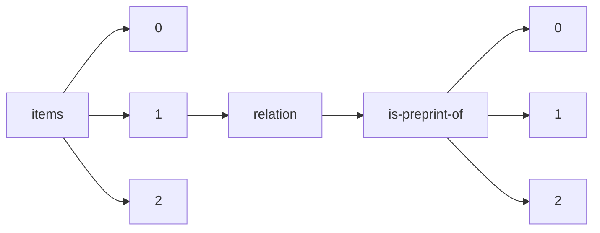

!!! warning "This document is not official Crossref documentation"
# Elements
PATH = items/array/relation/is-preprint-of/array(1)  
Occurs 353 863 times  
{ .annotate }

1. A route to an element, for example:  
   The route "items/array/relation/is-preprint-of/array" corresponds to navigating through the JSON indices as  
   ["items"][0]["relation"]["is-preprint-of"][0]  

## Asserted-by
See more information: [items/array/relation/is-preprint-of/array/asserted-by](asserted-by/index.md)  
Occurs 353 863 timess  
Unique values: 2  

| **Row** | **Value** `String` | **Count** `Int64` |
|--------:|----------------------:|---------------------:|
| **1**   | subject               | 319 977              |
| **2**   | object                | 33 886               |

## Id
See more information: [items/array/relation/is-preprint-of/array/id](id/index.md)  
Occurs 353 863 timess  
Unique values: > 999  

!!! note "Due to current limitations, only the first 1,000 unique values are counted."

| **Row** | **Value** `String`         | **Count** `Int64` |
|--------:|------------------------------:|---------------------:|
| **1**   | 10.31237/osf.io/yr86k         | 372                  |
| **2**   | 10.1158/0008-5472.CAN-22-3133 | 60                   |
| **3**   | 10.1158/1055-9965.EPI-22-0928 | 43                   |
| **4**   | 10.1158/0008-5472.CAN-10-0765 | 43                   |
| **5**   | 10.1158/1055-9965.EPI-22-0929 | 42                   |
| **6**   | 10.1158/0008-5472.CAN-22-1826 | 40                   |
| **7**   | 10.31237/osf.io/yex9a         | 38                   |
| **8**   | 10.1158/2767-9764.CRC-22-0403 | 35                   |
| **9**   | 10.1158/0008-5472.CAN-19-1523 | 33                   |
| **10**  | 10.1158/0008-5472.CAN-20-0212 | 32                   |
| ... | ... | ... |

## Id-type
See more information: [items/array/relation/is-preprint-of/array/id-type](id-type/index.md)  
Occurs 353 863 timess  
Unique values: 4  

| **Row** | **Value** `String` | **Count** `Int64` |
|--------:|----------------------:|---------------------:|
| **1**   | doi                   | 353 849              |
| **2**   | uri                   | 10                   |
| **3**   | isbn                  | 2                    |
| **4**   | arxiv                 | 2                    |

