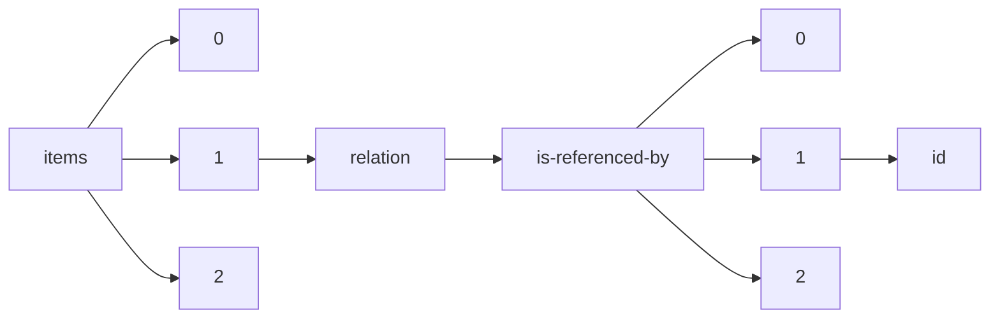

!!! warning "This document is not official Crossref documentation"
# Id
PATH = items/array/relation/is-referenced-by/array/id(1)  
Occurs 35 709 times  
Unique values: > 999  
{ .annotate }

1. A route to an element, for example:  
   The route "items/array/relation/is-referenced-by/array/id" corresponds to navigating through the JSON indices as  
   ["items"][0]["relation"]["is-referenced-by"][0]["id"]  

!!! note "Due to current limitations, only the first 1,000 unique values are counted."

| **Row** | **Value** `String`           | **Count** `Int64` |
|--------:|--------------------------------:|---------------------:|
| **1**   | 10.7554/eLife.03430             | 219                  |
| **2**   | 10.7287/peerj.preprints.27850v1 | 182                  |
| **3**   | 10.7287/peerj.preprints.27850   | 92                   |
| **4**   | 10.7287/peerj.preprints.27756v1 | 86                   |
| **5**   | 10.7287/peerj.preprints.3153v2  | 72                   |
| **6**   | 10.7287/peerj.preprints.3153v1  | 72                   |
| **7**   | 10.7287/peerj.preprints.3461    | 68                   |
| **8**   | 10.7287/peerj.preprints.3461v2  | 66                   |
| **9**   | 10.7287/peerj.preprints.27013v1 | 64                   |
| **10**  | 10.7287/peerj.preprints.27013   | 64                   |
| **11**  | 10.7287/peerj.preprints.28006v1 | 62                   |
| **12**  | 10.7287/peerj.preprints.27339v1 | 58                   |
| **13**  | 10.7287/peerj.preprints.3094v2  | 56                   |
| **14**  | 10.7287/peerj.preprints.27825v1 | 52                   |
| **15**  | 10.7287/peerj.preprints.27801v1 | 48                   |
| **16**  | 10.7287/peerj.preprints.27669v1 | 48                   |
| **17**  | 10.7287/peerj.preprints.4v1     | 48                   |
| **18**  | 10.7287/peerj.preprints.2036v1  | 48                   |
| **19**  | 10.7287/peerj.preprints.27801v2 | 48                   |
| **20**  | 10.7287/peerj.preprints.90v3    | 46                   |
| **21**  | 10.7287/peerj.preprints.90v2    | 46                   |
| **22**  | 10.7287/peerj.preprints.90v1    | 46                   |
| **23**  | 10.7287/peerj.preprints.4       | 46                   |
| **24**  | 10.7554/eLife.02030             | 44                   |
| **25**  | 10.7287/peerj.preprints.2332v1  | 44                   |
| **26**  | 10.7287/peerj.preprints.1514v1  | 44                   |
| **27**  | 10.7287/peerj.preprints.2874v1  | 44                   |
| **28**  | 10.7287/peerj.preprints.729v1   | 44                   |
| **29**  | 10.7287/peerj.preprints.27756   | 43                   |
| **30**  | 10.7287/peerj.preprints.27166v1 | 42                   |
| **31**  | 10.7287/peerj.preprints.2106v1  | 42                   |
| **32**  | 10.7287/peerj.preprints.27909v1 | 42                   |
| **33**  | 10.7287/peerj.preprints.3153    | 41                   |
| **34**  | 10.7287/peerj.preprints.27597v1 | 40                   |
| **35**  | 10.7287/peerj.preprints.2109v1  | 40                   |
| **36**  | 10.7287/peerj.preprints.506     | 40                   |
| **37**  | 10.7287/peerj.preprints.27597   | 40                   |
| **38**  | 10.7287/peerj.preprints.26860v1 | 40                   |
| **39**  | 10.7287/peerj.preprints.2109    | 40                   |
| **40**  | 10.7287/peerj.preprints.27791v1 | 40                   |
| **41**  | 10.7287/peerj.preprints.2106v2  | 40                   |
| **42**  | 10.7287/peerj.preprints.27330v1 | 38                   |
| **43**  | 10.7287/peerj.preprints.26870   | 38                   |
| **44**  | 10.7287/peerj.preprints.26870v1 | 38                   |
| **45**  | 10.7287/peerj.preprints.27929v1 | 38                   |
| **46**  | 10.7287/peerj.preprints.506v2   | 38                   |
| **47**  | 10.7287/peerj.preprints.27361v1 | 38                   |
| **48**  | 10.7287/peerj.preprints.801v1   | 36                   |
| **49**  | 10.7287/peerj.preprints.443v1   | 36                   |
| **50**  | 10.7287/peerj.preprints.260     | 36                   |
| **51**  | 10.7287/peerj.preprints.2740v1  | 36                   |
| **52**  | 10.7287/peerj.preprints.1676v1  | 36                   |
| **53**  | 10.7287/peerj.preprints.260v1   | 36                   |
| **54**  | 10.7287/peerj.preprints.443v2   | 36                   |
| **55**  | 10.7287/peerj.preprints.1797v1  | 36                   |
| **56**  | 10.7287/peerj.preprints.1110v3  | 36                   |
| **57**  | 10.7287/peerj.preprints.403v3   | 36                   |
| **58**  | 10.7287/peerj.preprints.403     | 35                   |
| **59**  | 10.7287/peerj.preprints.1514    | 35                   |
| **60**  | 10.7287/peerj.preprints.325     | 34                   |
| **61**  | 10.7287/peerj.preprints.1676    | 34                   |
| **62**  | 10.7287/peerj.preprints.27974v1 | 34                   |
| **63**  | 10.7287/peerj.preprints.27196v1 | 34                   |
| **64**  | 10.7287/peerj.preprints.403v2   | 34                   |
| **65**  | 10.7287/peerj.preprints.27232v1 | 34                   |
| **66**  | 10.7287/peerj.preprints.403v1   | 34                   |
| **67**  | 10.7287/peerj.preprints.27577v1 | 34                   |
| **68**  | 10.7287/peerj.preprints.27232   | 33                   |
| **69**  | 10.7287/peerj.preprints.2332    | 33                   |
| **70**  | 10.7287/peerj.preprints.27175   | 33                   |
| **71**  | 10.7287/peerj.preprints.3461v1  | 33                   |
| **72**  | 10.7287/peerj.preprints.27557   | 32                   |
| **73**  | 10.7287/peerj.preprints.2944v1  | 32                   |
| **74**  | 10.7287/peerj.preprints.1311v2  | 32                   |
| **75**  | 10.7287/peerj.preprints.27162v1 | 32                   |
| **76**  | 10.7287/peerj.preprints.27243v1 | 32                   |
| **77**  | 10.7287/peerj.preprints.27243   | 32                   |
| **78**  | 10.7287/peerj.preprints.27516v1 | 32                   |
| **79**  | 10.7287/peerj.preprints.325v1   | 32                   |
| **80**  | 10.7287/peerj.preprints.27175v1 | 32                   |
| **81**  | 10.7287/peerj.preprints.1797    | 32                   |
| **82**  | 10.7287/peerj.preprints.557v1   | 32                   |
| **83**  | 10.7287/peerj.preprints.2981v1  | 32                   |
| **84**  | 10.7287/peerj.preprints.2740    | 31                   |
| **85**  | 10.7287/peerj.preprints.27162   | 31                   |
| **86**  | 10.7287/peerj.preprints.28006   | 31                   |
| **87**  | 10.7287/peerj.preprints.1517v1  | 30                   |
| **88**  | 10.7287/peerj.preprints.230     | 30                   |
| **89**  | 10.7287/peerj.preprints.2775v1  | 30                   |
| **90**  | 10.7287/peerj.preprints.1083v1  | 30                   |
| **91**  | 10.7287/peerj.preprints.27740v1 | 30                   |
| **92**  | 10.7287/peerj.preprints.3292v1  | 30                   |
| **93**  | 10.7287/peerj.preprints.230v1   | 30                   |
| **94**  | 10.7287/peerj.preprints.2924v1  | 30                   |
| **95**  | 10.7287/peerj.preprints.27557v1 | 30                   |
| **96**  | 10.7287/peerj.preprints.2473v1  | 30                   |
| **97**  | 10.7287/peerj.preprints.1230v1  | 30                   |
| **98**  | 10.7287/peerj.preprints.557     | 29                   |
| **99**  | 10.7287/peerj.preprints.27339   | 29                   |
| **100** | 10.7287/peerj.preprints.3094    | 29                   |
| **101** | 10.1038/sdata.2014.49           | 29                   |
| **102** | 10.7287/peerj.preprints.2898v1  | 28                   |
| **103** | 10.7287/peerj.preprints.2659v1  | 28                   |
| **104** | 10.7287/peerj.preprints.27851v1 | 28                   |
| **105** | 10.7287/peerj.preprints.2874    | 28                   |
| **106** | 10.7287/peerj.preprints.443v3   | 28                   |
| **107** | 10.7287/peerj.preprints.377v1   | 28                   |
| **108** | 10.7287/peerj.preprints.2561v1  | 28                   |
| **109** | 10.7287/peerj.preprints.3329v2  | 28                   |
| **110** | 10.7287/peerj.preprints.27732v1 | 28                   |
| **111** | 10.7287/peerj.preprints.2044v3  | 28                   |
| **112** | 10.7287/peerj.preprints.2561v3  | 28                   |
| **113** | 10.7287/peerj.preprints.377     | 28                   |
| **114** | 10.7287/peerj.preprints.2561v2  | 28                   |
| **115** | 10.7287/peerj.preprints.27265v1 | 28                   |
| **116** | 10.7287/peerj.preprints.2163v1  | 28                   |
| **117** | 10.7287/peerj.preprints.27992v1 | 28                   |
| **118** | 10.7287/peerj.preprints.27265   | 28                   |
| **119** | 10.7287/peerj.preprints.1482    | 27                   |
| **120** | 10.7287/peerj.preprints.1083    | 27                   |
| **121** | 10.7287/peerj.preprints.27992   | 27                   |
| **122** | 10.13128/ijae -10794            | 26                   |
| **123** | 10.1016/j.acra.2012.03.011      | 26                   |
| **124** | 10.1016/j.acra.2014.05.010      | 26                   |
| **125** | 10.1503/cjs.004513              | 26                   |
| **126** | 10.7287/peerj.preprints.286v1   | 26                   |
| **127** | 10.7287/peerj.preprints.1804v1  | 26                   |
| **128** | 10.7287/peerj.preprints.168v1   | 26                   |
| **129** | 10.1007/s00117-013-2542-1       | 26                   |
| **130** | 10.7287/peerj.preprints.2044v5  | 26                   |
| **131** | 10.7287/peerj.preprints.2044v2  | 26                   |
| **132** | 10.3163/1536-5050.98.3.021      | 26                   |
| **133** | 10.7287/peerj.preprints.27244v5 | 26                   |
| **134** | 10.2214/AJR.09.7210             | 26                   |
| **135** | 10.1007/s00117-017-0279-y       | 26                   |
| **136** | 10.7287/peerj.preprints.27485   | 26                   |
| **137** | 10.7287/peerj.preprints.2759v3  | 26                   |
| **138** | 10.7287/peerj.preprints.27485v1 | 26                   |
| **139** | 10.7287/peerj.preprints.26668v1 | 26                   |
| **140** | 10.7287/peerj.preprints.27273v1 | 26                   |
| **141** | 10.7287/peerj.preprints.27637v1 | 26                   |
| **142** | 10.7287/peerj.preprints.26701v1 | 26                   |
| **143** | 10.7287/peerj.preprints.348     | 26                   |
| **144** | 10.7287/peerj.preprints.26578   | 26                   |
| **145** | 10.7287/peerj.preprints.27693v2 | 26                   |
| **146** | 10.7287/peerj.preprints.27858v1 | 26                   |
| **147** | 10.7287/peerj.preprints.27177v1 | 26                   |
| **148** | 10.7287/peerj.preprints.1482v1  | 26                   |
| **149** | 10.7287/peerj.preprints.2898    | 26                   |
| **150** | 10.7287/peerj.preprints.27833v1 | 26                   |
| **151** | 10.7287/peerj.preprints.2759v2  | 26                   |
| **152** | 10.7287/peerj.preprints.1804    | 26                   |
| **153** | 10.7287/peerj.preprints.3329    | 26                   |
| **154** | 10.7287/peerj.preprints.27858   | 26                   |
| **155** | 10.7287/peerj.preprints.348v1   | 26                   |
| **156** | 10.7287/peerj.preprints.2036    | 25                   |
| **157** | 10.7287/peerj.preprints.90      | 25                   |
| **158** | 10.7287/peerj.preprints.2944    | 25                   |
| **159** | 10.7287/peerj.preprints.2113    | 25                   |
| **160** | 10.7287/peerj.preprints.729     | 24                   |
| **161** | 10.7287/peerj.preprints.1427    | 24                   |
| **162** | 10.7287/peerj.preprints.27221v1 | 24                   |
| **163** | 10.7287/peerj.preprints.27677v1 | 24                   |
| **164** | 10.7287/peerj.preprints.26872   | 24                   |
| **165** | 10.7287/peerj.preprints.2759v1  | 24                   |
| **166** | 10.7287/peerj.preprints.2163    | 24                   |
| **167** | 10.1007/s10278-015-9798-0       | 24                   |
| **168** | 10.7287/peerj.preprints.3057v1  | 24                   |
| **169** | 10.7287/peerj.preprints.3037v2  | 24                   |
| **170** | 10.7287/peerj.preprints.1230    | 24                   |
| **171** | 10.7287/peerj.preprints.27698v1 | 24                   |
| **172** | 10.1016/j.jacr.2013.04.017      | 24                   |
| **173** | 10.1177/0954411919881526        | 24                   |
| **174** | 10.1016/j.acra.2012.09.024      | 24                   |
| **175** | 10.7287/peerj.preprints.27825   | 24                   |
| **176** | 10.1594/essr2012/P-0041         | 24                   |
| **177** | 10.7287/peerj.preprints.27669   | 24                   |
| **178** | 10.1016/S1278-3218(10)70002-0   | 24                   |
| **179** | 10.1016/j.jacr.2012.02.008      | 24                   |
| **180** | 10.7287/peerj.preprints.3426v1  | 24                   |
| **181** | 10.1016/j.ejro.2015.10.001      | 24                   |
| **182** | 10.7287/peerj.preprints.2675v1  | 24                   |
| **183** | 10.1177/2058460119889871        | 24                   |
| **184** | 10.7287/peerj.preprints.2650v1  | 24                   |
| **185** | 10.1016/j.radonc.2017.01.008    | 24                   |
| **186** | 10.1016/j.acra.2014.09.014      | 24                   |
| **187** | 10.7287/peerj.preprints.1246v2  | 24                   |
| **188** | 10.1007/s13244-013-0274-4       | 24                   |
| **189** | 10.4018/978-1-4666-1897-8.ch020 | 24                   |
| **190** | 10.7287/peerj.preprints.1427v1  | 24                   |
| **191** | 10.1016/j.acra.2015.07.007      | 24                   |
| **192** | 10.7287/peerj.preprints.286     | 24                   |
| **193** | 10.7287/peerj.preprints.27422v1 | 24                   |
| **194** | 10.1007/s00261-020-02741-x      | 24                   |
| **195** | 10.7287/peerj.preprints.27637   | 24                   |
| **196** | 10.1016/j.canrad.2009.06.026    | 24                   |
| **197** | 10.1007/s10278-013-9638-z       | 24                   |
| **198** | 10.1016/j.morpho.2018.07.039    | 24                   |
| **199** | 10.1016/j.compedu.2013.07.007   | 24                   |
| **200** | 10.1080/02763869.2015.1052690   | 24                   |
| **201** | 10.1016/j.acra.2019.09.014      | 24                   |
| **202** | 10.7287/peerj.preprints.27992v2 | 24                   |
| **203** | 10.1148/rg.292095013            | 24                   |
| **204** | 10.7287/peerj.preprints.26578v1 | 24                   |
| **205** | 10.7287/peerj.preprints.3329v3  | 24                   |
| **206** | 10.1016/j.jacr.2013.02.007      | 24                   |
| **207** | 10.1071/FP14056                 | 24                   |
| **208** | 10.7287/peerj.preprints.2113v1  | 24                   |
| **209** | 10.7287/peerj.preprints.27801   | 24                   |
| **210** | 10.7287/peerj.preprints.3281v1  | 24                   |
| **211** | 10.7287/peerj.preprints.2197v1  | 24                   |
| **212** | 10.7287/peerj.preprints.27015v1 | 24                   |
| **213** | 10.7287/peerj.preprints.27221   | 23                   |
| **214** | 10.7287/peerj.preprints.27242   | 23                   |
| **215** | 10.7287/peerj.preprints.2924    | 23                   |
| **216** | 10.7287/peerj.preprints.27056   | 23                   |
| **217** | 10.7287/peerj.preprints.168     | 23                   |
| **218** | 10.7287/peerj.preprints.2249v1  | 22                   |
| **219** | 10.7287/peerj.preprints.3298v1  | 22                   |
| **220** | 10.7287/peerj.preprints.26482v1 | 22                   |
| **221** | 10.7287/peerj.preprints.3037v1  | 22                   |
| **222** | 10.7287/peerj.preprints.26667v2 | 22                   |
| **223** | 10.7287/peerj.preprints.2772v2  | 22                   |
| **224** | 10.7287/peerj.preprints.1267v1  | 22                   |
| **225** | 10.7287/peerj.preprints.27101   | 22                   |
| **226** | 10.7287/peerj.preprints.27955v1 | 22                   |
| **227** | 10.7287/peerj.preprints.643v1   | 22                   |
| **228** | 10.7287/peerj.preprints.2404v1  | 22                   |
| **229** | 10.7287/peerj.preprints.2772    | 22                   |
| **230** | 10.7287/peerj.preprints.27056v1 | 22                   |
| **231** | 10.7287/peerj.preprints.2337v1  | 22                   |
| **232** | 10.7287/peerj.preprints.2349v1  | 22                   |
| **233** | 10.7287/peerj.preprints.2833v1  | 22                   |
| **234** | 10.7287/peerj.preprints.2889v1  | 22                   |
| **235** | 10.7287/peerj.preprints.26559   | 22                   |
| **236** | 10.7287/peerj.preprints.3093v1  | 22                   |
| **237** | 10.7287/peerj.preprints.26559v2 | 22                   |
| **238** | 10.7287/peerj.preprints.2643v2  | 22                   |
| **239** | 10.7287/peerj.preprints.27419v1 | 22                   |
| **240** | 10.7287/peerj.preprints.27422   | 22                   |
| **241** | 10.7287/peerj.preprints.27839   | 22                   |
| **242** | 10.7287/peerj.preprints.1875v2  | 22                   |
| **243** | 10.7287/peerj.preprints.26566v1 | 22                   |
| **244** | 10.7287/peerj.preprints.27839v1 | 22                   |
| **245** | 10.7287/peerj.preprints.27446v1 | 22                   |
| **246** | 10.7287/peerj.preprints.27446   | 22                   |
| **247** | 10.7287/peerj.preprints.26872v1 | 22                   |
| **248** | 10.7287/peerj.preprints.27693   | 21                   |
| **249** | 10.7287/peerj.preprints.27513   | 21                   |
| **250** | 10.7287/peerj.preprints.2404    | 21                   |
| **251** | 10.7287/peerj.preprints.2278v3  | 20                   |
| **252** | 10.7287/peerj.preprints.1426v1  | 20                   |
| **253** | 10.7287/peerj.preprints.25v1    | 20                   |
| **254** | 10.7287/peerj.preprints.27630   | 20                   |
| **255** | 10.7287/peerj.preprints.2362    | 20                   |
| **256** | 10.7287/peerj.preprints.472v2   | 20                   |
| **257** | 10.7287/peerj.preprints.1660v1  | 20                   |
| **258** | 10.7287/peerj.preprints.27244   | 20                   |
| **259** | 10.7287/peerj.preprints.26566   | 20                   |
| **260** | 10.7287/peerj.preprints.27771v1 | 20                   |
| **261** | 10.7287/peerj.preprints.3429v1  | 20                   |
| **262** | 10.7287/peerj.preprints.26481v1 | 20                   |
| **263** | 10.7287/peerj.preprints.27366v1 | 20                   |
| **264** | 10.7287/peerj.preprints.27166   | 20                   |
| **265** | 10.7287/peerj.preprints.1751v1  | 20                   |
| **266** | 10.7287/peerj.preprints.26903v1 | 20                   |
| **267** | 10.7287/peerj.preprints.27807v2 | 20                   |
| **268** | 10.7287/peerj.preprints.27329v1 | 20                   |
| **269** | 10.7287/peerj.preprints.3037    | 20                   |
| **270** | 10.7287/peerj.preprints.2956    | 20                   |
| **271** | 10.7287/peerj.preprints.27429v2 | 20                   |
| **272** | 10.7287/peerj.preprints.3491v2  | 20                   |
| **273** | 10.7287/peerj.preprints.2813v2  | 20                   |
| **274** | 10.7287/peerj.preprints.27791   | 20                   |
| **275** | 10.7287/peerj.preprints.1719v1  | 20                   |
| **276** | 10.7287/peerj.preprints.126v3   | 20                   |
| **277** | 10.7287/peerj.preprints.27101v1 | 20                   |
| **278** | 10.7287/peerj.preprints.26494   | 20                   |
| **279** | 10.7287/peerj.preprints.2782v1  | 20                   |
| **280** | 10.7287/peerj.preprints.2592v1  | 20                   |
| **281** | 10.7287/peerj.preprints.2889    | 20                   |
| **282** | 10.7287/peerj.preprints.26494v1 | 20                   |
| **283** | 10.7287/peerj.preprints.2675    | 20                   |
| **284** | 10.7287/peerj.preprints.2646v1  | 20                   |
| **285** | 10.7287/peerj.preprints.27290v1 | 20                   |
| **286** | 10.7287/peerj.preprints.1875v1  | 20                   |
| **287** | 10.7287/peerj.preprints.27242v1 | 20                   |
| **288** | 10.7287/peerj.preprints.2044v4  | 20                   |
| **289** | 10.7287/peerj.preprints.2772v1  | 20                   |
| **290** | 10.7287/peerj.preprints.1764v1  | 20                   |
| **291** | 10.7287/peerj.preprints.3117v1  | 20                   |
| **292** | 10.7287/peerj.preprints.27012v1 | 20                   |
| **293** | 10.7287/peerj.preprints.1660    | 19                   |
| **294** | 10.7287/peerj.preprints.27636   | 19                   |
| **295** | 10.7287/peerj.preprints.2106    | 19                   |
| **296** | 10.7287/peerj.preprints.1426    | 19                   |
| **297** | 10.7287/peerj.preprints.27012   | 19                   |
| **298** | 10.7287/peerj.preprints.27330   | 19                   |
| **299** | 10.7287/peerj.preprints.322     | 19                   |
| **300** | 10.7287/peerj.preprints.27807   | 19                   |
| **301** | 10.7287/peerj.preprints.2395    | 19                   |
| **302** | 10.7287/peerj.preprints.246     | 19                   |
| **303** | 10.7287/peerj.preprints.2981    | 19                   |
| **304** | 10.7287/peerj.preprints.2278v4  | 18                   |
| **305** | 10.7287/peerj.preprints.27193v1 | 18                   |
| **306** | 10.7287/peerj.preprints.3048v1  | 18                   |
| **307** | 10.7287/peerj.preprints.2643    | 18                   |
| **308** | 10.7287/peerj.preprints.27361   | 18                   |
| **309** | 10.7287/peerj.preprints.304v1   | 18                   |
| **310** | 10.7287/peerj.preprints.433v1   | 18                   |
| **311** | 10.7287/peerj.preprints.231v1   | 18                   |
| **312** | 10.7287/peerj.preprints.3146v1  | 18                   |
| **313** | 10.7287/peerj.preprints.500v1   | 18                   |
| **314** | 10.7287/peerj.preprints.26553v1 | 18                   |
| **315** | 10.7287/peerj.preprints.27063v2 | 18                   |
| **316** | 10.7287/peerj.preprints.27196   | 18                   |
| **317** | 10.7287/peerj.preprints.737v1   | 18                   |
| **318** | 10.7287/peerj.preprints.27059   | 18                   |
| **319** | 10.7287/peerj.preprints.27928v1 | 18                   |
| **320** | 10.7287/peerj.preprints.27720v1 | 18                   |
| **321** | 10.7287/peerj.preprints.3269v3  | 18                   |
| **322** | 10.7287/peerj.preprints.2300v1  | 18                   |
| **323** | 10.7287/peerj.preprints.27365v1 | 18                   |
| **324** | 10.7287/peerj.preprints.1110    | 18                   |
| **325** | 10.7287/peerj.preprints.27461v1 | 18                   |
| **326** | 10.7287/peerj.preprints.26860   | 18                   |
| **327** | 10.7287/peerj.preprints.26950v1 | 18                   |
| **328** | 10.7287/peerj.preprints.2662v2  | 18                   |
| **329** | 10.7287/peerj.preprints.2044v1  | 18                   |
| **330** | 10.7287/peerj.preprints.472v1   | 18                   |
| **331** | 10.7287/peerj.preprints.27928   | 18                   |
| **332** | 10.7287/peerj.preprints.26900v1 | 18                   |
| **333** | 10.7287/peerj.preprints.2406v1  | 18                   |
| **334** | 10.7287/peerj.preprints.322v1   | 18                   |
| **335** | 10.7287/peerj.preprints.27418v1 | 18                   |
| **336** | 10.7287/peerj.preprints.27489v1 | 18                   |
| **337** | 10.7287/peerj.preprints.2395v1  | 18                   |
| **338** | 10.7287/peerj.preprints.27063   | 18                   |
| **339** | 10.7287/peerj.preprints.26912v1 | 18                   |
| **340** | 10.7287/peerj.preprints.27059v1 | 18                   |
| **341** | 10.7287/peerj.preprints.26961v1 | 18                   |
| **342** | 10.7287/peerj.preprints.388v1   | 18                   |
| **343** | 10.7287/peerj.preprints.27636v1 | 18                   |
| **344** | 10.7287/peerj.preprints.27513v1 | 18                   |
| **345** | 10.7287/peerj.preprints.3433v1  | 18                   |
| **346** | 10.7287/peerj.preprints.1023v1  | 18                   |
| **347** | 10.7287/peerj.preprints.3094v1  | 18                   |
| **348** | 10.7287/peerj.preprints.3426    | 18                   |
| **349** | 10.7287/peerj.preprints.27854v1 | 18                   |
| **350** | 10.7287/peerj.preprints.27909   | 18                   |
| **351** | 10.7287/peerj.preprints.26674   | 17                   |
| **352** | 10.7287/peerj.preprints.27854   | 17                   |
| **353** | 10.7287/peerj.preprints.26912   | 17                   |
| **354** | 10.7287/peerj.preprints.1517    | 17                   |
| **355** | 10.7287/peerj.preprints.472     | 17                   |
| **356** | 10.7287/peerj.preprints.443     | 17                   |
| **357** | 10.7287/peerj.preprints.801     | 17                   |
| **358** | 10.7287/peerj.preprints.26667   | 17                   |
| **359** | 10.7287/peerj.preprints.26483   | 17                   |
| **360** | 10.7287/peerj.preprints.27577   | 17                   |
| **361** | 10.7287/peerj.preprints.27929   | 17                   |
| **362** | 10.7287/peerj.preprints.27063v1 | 16                   |
| **363** | 10.7287/peerj.preprints.1572v1  | 16                   |
| **364** | 10.7287/peerj.preprints.1157v1  | 16                   |
| **365** | 10.7287/peerj.preprints.27376v1 | 16                   |
| **366** | 10.7287/peerj.preprints.2918v1  | 16                   |
| **367** | 10.7287/peerj.preprints.27728v1 | 16                   |
| **368** | 10.7287/peerj.preprints.2493v1  | 16                   |
| **369** | 10.7287/peerj.preprints.762v1   | 16                   |
| **370** | 10.7287/peerj.preprints.2775    | 16                   |
| **371** | 10.7287/peerj.preprints.1157    | 16                   |
| **372** | 10.7287/peerj.preprints.3488v2  | 16                   |
| **373** | 10.7287/peerj.preprints.1390    | 16                   |
| **374** | 10.7287/peerj.preprints.3003v1  | 16                   |
| **375** | 10.7287/peerj.preprints.2922v1  | 16                   |
| **376** | 10.7287/peerj.preprints.27045   | 16                   |
| **377** | 10.7287/peerj.preprints.2543    | 16                   |
| **378** | 10.7287/peerj.preprints.27200v2 | 16                   |
| **379** | 10.7287/peerj.preprints.2051v1  | 16                   |
| **380** | 10.7287/peerj.preprints.26553   | 16                   |
| **381** | 10.7287/peerj.preprints.2014v1  | 16                   |
| **382** | 10.7287/peerj.preprints.1779v1  | 16                   |
| **383** | 10.7287/peerj.preprints.27045v1 | 16                   |
| **384** | 10.7287/peerj.preprints.27516   | 16                   |
| **385** | 10.7287/peerj.preprints.26512v1 | 16                   |
| **386** | 10.7287/peerj.preprints.2607    | 16                   |
| **387** | 10.7287/peerj.preprints.3525v1  | 16                   |
| **388** | 10.7287/peerj.preprints.176v1   | 16                   |
| **389** | 10.7287/peerj.preprints.26909v1 | 16                   |
| **390** | 10.7287/peerj.preprints.2662v1  | 16                   |
| **391** | 10.7287/peerj.preprints.27429   | 16                   |
| **392** | 10.7287/peerj.preprints.27781v1 | 16                   |
| **393** | 10.7287/peerj.preprints.1899v1  | 16                   |
| **394** | 10.7287/peerj.preprints.27758v1 | 16                   |
| **395** | 10.7287/peerj.preprints.3391v1  | 16                   |
| **396** | 10.7287/peerj.preprints.27356v1 | 16                   |
| **397** | 10.7287/peerj.preprints.2502v1  | 16                   |
| **398** | 10.7287/peerj.preprints.1311    | 16                   |
| **399** | 10.7287/peerj.preprints.27200v1 | 16                   |
| **400** | 10.7287/peerj.preprints.26674v1 | 16                   |
| **401** | 10.7287/peerj.preprints.56v1    | 16                   |
| **402** | 10.7287/peerj.preprints.2543v1  | 16                   |
| **403** | 10.7287/peerj.preprints.27925v1 | 16                   |
| **404** | 10.7287/peerj.preprints.27990v1 | 16                   |
| **405** | 10.7287/peerj.preprints.2741    | 16                   |
| **406** | 10.7287/peerj.preprints.3437v1  | 16                   |
| **407** | 10.7287/peerj.preprints.27609   | 16                   |
| **408** | 10.7287/peerj.preprints.26950v2 | 16                   |
| **409** | 10.7287/peerj.preprints.26893v1 | 16                   |
| **410** | 10.7287/peerj.preprints.26957v1 | 16                   |
| **411** | 10.7287/peerj.preprints.126v1   | 16                   |
| **412** | 10.7287/peerj.preprints.2362v1  | 16                   |
| **413** | 10.7287/peerj.preprints.26893   | 16                   |
| **414** | 10.7287/peerj.preprints.2473    | 15                   |
| **415** | 10.7287/peerj.preprints.27922   | 15                   |
| **416** | 10.7287/peerj.preprints.1764    | 15                   |
| **417** | 10.7287/peerj.preprints.2406    | 15                   |
| **418** | 10.7287/peerj.preprints.26957   | 15                   |
| **419** | 10.1177/0846537120953909        | 15                   |
| **420** | 10.1016/j.ejrad.2021.110131     | 15                   |
| **421** | 10.7287/peerj.preprints.27925   | 15                   |
| **422** | 10.7287/peerj.preprints.3391    | 15                   |
| **423** | 10.7287/peerj.preprints.3292    | 15                   |
| **424** | 10.7287/peerj.preprints.2833    | 15                   |
| **425** | 10.7287/peerj.preprints.225     | 15                   |
| **426** | 10.7287/peerj.preprints.3057    | 15                   |
| **427** | 10.7287/peerj.preprints.1267    | 15                   |
| **428** | 10.7287/peerj.preprints.2782    | 15                   |
| **429** | 10.7287/peerj.preprints.153v1   | 14                   |
| **430** | 10.7287/peerj.preprints.27443v1 | 14                   |
| **431** | 10.7287/peerj.preprints.27047   | 14                   |
| **432** | 10.7287/peerj.preprints.26620v2 | 14                   |
| **433** | 10.7287/peerj.preprints.2809v1  | 14                   |
| **434** | 10.7287/peerj.preprints.27177   | 14                   |
| **435** | 10.7287/peerj.preprints.27987v1 | 14                   |
| **436** | 10.7287/peerj.preprints.2315    | 14                   |
| **437** | 10.7287/peerj.preprints.26997v1 | 14                   |
| **438** | 10.7287/peerj.preprints.1973v1  | 14                   |
| **439** | 10.7287/peerj.preprints.27003   | 14                   |
| **440** | 10.7287/peerj.preprints.420     | 14                   |
| **441** | 10.7287/peerj.preprints.3269v1  | 14                   |
| **442** | 10.7287/peerj.preprints.27923v1 | 14                   |
| **443** | 10.7287/peerj.preprints.27049v1 | 14                   |
| **444** | 10.7287/peerj.preprints.26545   | 14                   |
| **445** | 10.7287/peerj.preprints.26620   | 14                   |
| **446** | 10.7287/peerj.preprints.27612v1 | 14                   |
| **447** | 10.7287/peerj.preprints.27030v1 | 14                   |
| **448** | 10.7287/peerj.preprints.26723   | 14                   |
| **449** | 10.7287/peerj.preprints.2741v1  | 14                   |
| **450** | 10.7287/peerj.preprints.3330v1  | 14                   |
| **451** | 10.7287/peerj.preprints.27611v1 | 14                   |
| **452** | 10.7287/peerj.preprints.2822v1  | 14                   |
| **453** | 10.7287/peerj.preprints.27020v1 | 14                   |
| **454** | 10.7287/peerj.preprints.1535    | 14                   |
| **455** | 10.7287/peerj.preprints.26439v1 | 14                   |
| **456** | 10.7287/peerj.preprints.26903v2 | 14                   |
| **457** | 10.7287/peerj.preprints.27740   | 14                   |
| **458** | 10.7287/peerj.preprints.27960v1 | 14                   |
| **459** | 10.7287/peerj.preprints.26689v1 | 14                   |
| **460** | 10.7287/peerj.preprints.2116v1  | 14                   |
| **461** | 10.7287/peerj.preprints.26962v1 | 14                   |
| **462** | 10.7287/peerj.preprints.27732   | 14                   |
| **463** | 10.7287/peerj.preprints.27807v1 | 14                   |
| **464** | 10.7287/peerj.preprints.26545v1 | 14                   |
| **465** | 10.7287/peerj.preprints.246v1   | 14                   |
| **466** | 10.7287/peerj.preprints.26613v1 | 14                   |
| **467** | 10.7287/peerj.preprints.27047v1 | 14                   |
| **468** | 10.7287/peerj.preprints.27142v1 | 14                   |
| **469** | 10.7287/peerj.preprints.126v2   | 14                   |
| **470** | 10.7287/peerj.preprints.934v2   | 14                   |
| **471** | 10.7287/peerj.preprints.26696   | 14                   |
| **472** | 10.7287/peerj.preprints.26620v1 | 14                   |
| **473** | 10.7287/peerj.preprints.26723v1 | 14                   |
| **474** | 10.7287/peerj.preprints.27848v1 | 14                   |
| **475** | 10.7287/peerj.preprints.27851   | 14                   |
| **476** | 10.7287/peerj.preprints.3269v4  | 14                   |
| **477** | 10.7287/peerj.preprints.2821v1  | 14                   |
| **478** | 10.7287/peerj.preprints.26928v1 | 14                   |
| **479** | 10.7287/peerj.preprints.2522v2  | 14                   |
| **480** | 10.7287/peerj.preprints.3269v2  | 14                   |
| **481** | 10.7287/peerj.preprints.388     | 14                   |
| **482** | 10.7287/peerj.preprints.26665v2 | 14                   |
| **483** | 10.7287/peerj.preprints.27605   | 14                   |
| **484** | 10.7287/peerj.preprints.27630v1 | 14                   |
| **485** | 10.7287/peerj.preprints.500     | 14                   |
| **486** | 10.7287/peerj.preprints.2813v1  | 14                   |
| **487** | 10.7287/peerj.preprints.27429v1 | 14                   |
| **488** | 10.7287/peerj.preprints.3453v1  | 14                   |
| **489** | 10.7287/peerj.preprints.2269v2  | 14                   |
| **490** | 10.7287/peerj.preprints.1390v1  | 14                   |
| **491** | 10.7287/peerj.preprints.2892v1  | 14                   |
| **492** | 10.7287/peerj.preprints.3048    | 14                   |
| **493** | 10.7287/peerj.preprints.27609v1 | 14                   |
| **494** | 10.7287/peerj.preprints.27003v1 | 14                   |
| **495** | 10.7287/peerj.preprints.2123    | 14                   |
| **496** | 10.7287/peerj.preprints.26923v2 | 14                   |
| **497** | 10.7287/peerj.preprints.225v1   | 14                   |
| **498** | 10.7287/peerj.preprints.2116    | 13                   |
| **499** | 10.7287/peerj.preprints.26701   | 13                   |
| **500** | 10.7287/peerj.preprints.1973    | 13                   |
| **501** | 10.7287/peerj.preprints.26668   | 13                   |
| **502** | 10.7287/peerj.preprints.26518   | 13                   |
| **503** | 10.7287/peerj.preprints.27443   | 13                   |
| **504** | 10.7287/peerj.preprints.27424   | 13                   |
| **505** | 10.7287/peerj.preprints.27030   | 13                   |
| **506** | 10.7287/peerj.preprints.27987   | 13                   |
| **507** | 10.1016/j.radi.2021.12.002      | 13                   |
| **508** | 10.7287/peerj.preprints.27142   | 13                   |
| **509** | 10.7287/peerj.preprints.26950   | 13                   |
| **510** | 10.1007/s10278-019-00311-2      | 13                   |
| **511** | 10.7287/peerj.preprints.26903   | 13                   |
| **512** | 10.7287/peerj.preprints.27974   | 13                   |
| **513** | 10.1186/s13014-017-0930-9       | 13                   |
| **514** | 10.7287/peerj.preprints.3146    | 13                   |
| **515** | 10.7287/peerj.preprints.176     | 12                   |
| **516** | 10.7287/peerj.preprints.27833   | 12                   |
| **517** | 10.7287/peerj.preprints.2452    | 12                   |
| **518** | 10.7287/peerj.preprints.1405v1  | 12                   |
| **519** | 10.7287/peerj.preprints.643     | 12                   |
| **520** | 10.7287/peerj.preprints.27273   | 12                   |
| **521** | 10.7287/peerj.preprints.2585v1  | 12                   |
| **522** | 10.7287/peerj.preprints.27244v3 | 12                   |
| **523** | 10.7287/peerj.preprints.3429    | 12                   |
| **524** | 10.7287/peerj.preprints.554v2   | 12                   |
| **525** | 10.7287/peerj.preprints.26451v1 | 12                   |
| **526** | 10.7287/peerj.preprints.3298    | 12                   |
| **527** | 10.7287/peerj.preprints.26561   | 12                   |
| **528** | 10.7287/peerj.preprints.3233v1  | 12                   |
| **529** | 10.7287/peerj.preprints.26996v1 | 12                   |
| **530** | 10.7287/peerj.preprints.27537v1 | 12                   |
| **531** | 10.7287/peerj.preprints.2995v1  | 12                   |
| **532** | 10.7287/peerj.preprints.1911v1  | 12                   |
| **533** | 10.7287/peerj.preprints.26733v1 | 12                   |
| **534** | 10.7287/peerj.preprints.1371v1  | 12                   |
| **535** | 10.7287/peerj.preprints.27297v1 | 12                   |
| **536** | 10.7287/peerj.preprints.27342v1 | 12                   |
| **537** | 10.7287/peerj.preprints.315v1   | 12                   |
| **538** | 10.7287/peerj.preprints.3456v3  | 12                   |
| **539** | 10.7287/peerj.preprints.2986    | 12                   |
| **540** | 10.7287/peerj.preprints.26925v1 | 12                   |
| **541** | 10.7287/peerj.preprints.27695v1 | 12                   |
| **542** | 10.7287/peerj.preprints.27923   | 12                   |
| **543** | 10.7287/peerj.preprints.27402v1 | 12                   |
| **544** | 10.7287/peerj.preprints.27020   | 12                   |
| **545** | 10.7287/peerj.preprints.27195v1 | 12                   |
| **546** | 10.7287/peerj.preprints.27591v1 | 12                   |
| **547** | 10.7287/peerj.preprints.27313v2 | 12                   |
| **548** | 10.7287/peerj.preprints.2257v1  | 12                   |
| **549** | 10.7287/peerj.preprints.2624v2  | 12                   |
| **550** | 10.7287/peerj.preprints.1716v1  | 12                   |
| **551** | 10.7287/peerj.preprints.27591v2 | 12                   |
| **552** | 10.7287/peerj.preprints.3269    | 12                   |
| **553** | 10.7287/peerj.preprints.2803v1  | 12                   |
| **554** | 10.7287/peerj.preprints.27870v1 | 12                   |
| **555** | 10.7287/peerj.preprints.26689   | 12                   |
| **556** | 10.7287/peerj.preprints.27224v1 | 12                   |
| **557** | 10.7287/peerj.preprints.3456v4  | 12                   |
| **558** | 10.7287/peerj.preprints.2624v1  | 12                   |
| **559** | 10.7287/peerj.preprints.26962v2 | 12                   |
| **560** | 10.7287/peerj.preprints.27941v1 | 12                   |
| **561** | 10.7287/peerj.preprints.6570v2  | 12                   |
| **562** | 10.7287/peerj.preprints.26483v1 | 12                   |
| **563** | 10.7287/peerj.preprints.27200   | 12                   |
| **564** | 10.7287/peerj.preprints.2570v1  | 12                   |
| **565** | 10.1016/j.clinimag.2021.05.003  | 12                   |
| **566** | 10.7287/peerj.preprints.3408v3  | 12                   |
| **567** | 10.7287/peerj.preprints.26996   | 12                   |
| **568** | 10.7287/peerj.preprints.26477v1 | 12                   |
| **569** | 10.7287/peerj.preprints.3110v2  | 12                   |
| **570** | 10.7287/peerj.preprints.26995   | 12                   |
| **571** | 10.7287/peerj.preprints.27587   | 12                   |
| **572** | 10.7287/peerj.preprints.27015   | 12                   |
| **573** | 10.7287/peerj.preprints.27815v1 | 12                   |
| **574** | 10.7287/peerj.preprints.2378v1  | 12                   |
| **575** | 10.7287/peerj.preprints.2458v1  | 12                   |
| **576** | 10.7287/peerj.preprints.2014    | 12                   |
| **577** | 10.7287/peerj.preprints.2607v1  | 12                   |
| **578** | 10.7287/peerj.preprints.2241v1  | 12                   |
| **579** | 10.7287/peerj.preprints.27674v1 | 12                   |
| **580** | 10.7287/peerj.preprints.2542v1  | 12                   |
| **581** | 10.7287/peerj.preprints.27950   | 12                   |
| **582** | 10.7287/peerj.preprints.1688v1  | 12                   |
| **583** | 10.7287/peerj.preprints.3233    | 12                   |
| **584** | 10.7287/peerj.preprints.1575v2  | 12                   |
| **585** | 10.7287/peerj.preprints.27605v1 | 12                   |
| **586** | 10.7287/peerj.preprints.3279v1  | 12                   |
| **587** | 10.7287/peerj.preprints.2310v1  | 12                   |
| **588** | 10.7287/peerj.preprints.3109v1  | 12                   |
| **589** | 10.7287/peerj.preprints.2123v1  | 12                   |
| **590** | 10.7287/peerj.preprints.420v1   | 12                   |
| **591** | 10.7287/peerj.preprints.26995v1 | 12                   |
| **592** | 10.7287/peerj.preprints.27202v1 | 12                   |
| **593** | 10.7287/peerj.preprints.26561v1 | 12                   |
| **594** | 10.7287/peerj.preprints.27244v2 | 12                   |
| **595** | 10.7287/peerj.preprints.1544v2  | 12                   |
| **596** | 10.7287/peerj.preprints.3408v2  | 12                   |
| **597** | 10.7287/peerj.preprints.26696v1 | 12                   |
| **598** | 10.7287/peerj.preprints.27698   | 12                   |
| **599** | 10.7287/peerj.preprints.2249    | 12                   |
| **600** | 10.7287/peerj.preprints.6570    | 11                   |
| **601** | 10.7287/peerj.preprints.686     | 11                   |
| **602** | 10.7287/peerj.preprints.2165    | 11                   |
| **603** | 10.7287/peerj.preprints.27329   | 11                   |
| **604** | 10.7287/peerj.preprints.26960   | 11                   |
| **605** | 10.7287/peerj.preprints.315     | 11                   |
| **606** | 10.7287/peerj.preprints.2489    | 11                   |
| **607** | 10.7287/peerj.preprints.2650    | 11                   |
| **608** | 10.7287/peerj.preprints.27537   | 11                   |
| **609** | 10.7287/peerj.preprints.27695   | 11                   |
| **610** | 10.7287/peerj.preprints.737     | 11                   |
| **611** | 10.7287/peerj.preprints.1779    | 11                   |
| **612** | 10.7287/peerj.preprints.2759    | 11                   |
| **613** | 10.7287/peerj.preprints.1246    | 11                   |
| **614** | 10.7287/peerj.preprints.26477   | 11                   |
| **615** | 10.7287/peerj.preprints.2325    | 11                   |
| **616** | 10.7287/peerj.preprints.27189   | 11                   |
| **617** | 10.7287/peerj.preprints.27677   | 11                   |
| **618** | 10.7287/peerj.preprints.1688    | 11                   |
| **619** | 10.7287/peerj.preprints.493     | 10                   |
| **620** | 10.7287/peerj.preprints.130v1   | 10                   |
| **621** | 10.7287/peerj.preprints.1609v1  | 10                   |
| **622** | 10.7287/peerj.preprints.27274v1 | 10                   |
| **623** | 10.7287/peerj.preprints.302v1   | 10                   |
| **624** | 10.7287/peerj.preprints.27459v1 | 10                   |
| **625** | 10.7287/peerj.preprints.2145v1  | 10                   |
| **626** | 10.7287/peerj.preprints.1651v1  | 10                   |
| **627** | 10.7287/peerj.preprints.1487v1  | 10                   |
| **628** | 10.7287/peerj.preprints.27509v2 | 10                   |
| **629** | 10.7287/peerj.preprints.3512v1  | 10                   |
| **630** | 10.7287/peerj.preprints.26468v1 | 10                   |
| **631** | 10.7287/peerj.preprints.27591v4 | 10                   |
| **632** | 10.7287/peerj.preprints.2365v1  | 10                   |
| **633** | 10.7287/peerj.preprints.3022v1  | 10                   |
| **634** | 10.7287/peerj.preprints.26980v1 | 10                   |
| **635** | 10.7287/peerj.preprints.2300    | 10                   |
| **636** | 10.7287/peerj.preprints.27622v1 | 10                   |
| **637** | 10.7287/peerj.preprints.27224   | 10                   |
| **638** | 10.7287/peerj.preprints.27022v2 | 10                   |
| **639** | 10.7287/peerj.preprints.413v1   | 10                   |
| **640** | 10.7287/peerj.preprints.27622   | 10                   |
| **641** | 10.7287/peerj.preprints.26623v1 | 10                   |
| **642** | 10.7287/peerj.preprints.1839v1  | 10                   |
| **643** | 10.7287/peerj.preprints.2032    | 10                   |
| **644** | 10.7287/peerj.preprints.3016    | 10                   |
| **645** | 10.7287/peerj.preprints.2662    | 10                   |
| **646** | 10.7287/peerj.preprints.237v1   | 10                   |
| **647** | 10.7287/peerj.preprints.2676v1  | 10                   |
| **648** | 10.7287/peerj.preprints.2433v1  | 10                   |
| **649** | 10.7287/peerj.preprints.26826   | 10                   |
| **650** | 10.7287/peerj.preprints.1731    | 10                   |
| **651** | 10.7287/peerj.preprints.26516v2 | 10                   |
| **652** | 10.7287/peerj.preprints.1418    | 10                   |
| **653** | 10.7287/peerj.preprints.26873v1 | 10                   |
| **654** | 10.7287/peerj.preprints.2654v1  | 10                   |
| **655** | 10.7287/peerj.preprints.3093    | 10                   |
| **656** | 10.7287/peerj.preprints.3273v2  | 10                   |
| **657** | 10.7287/peerj.preprints.1251v1  | 10                   |
| **658** | 10.7287/peerj.preprints.1251    | 10                   |
| **659** | 10.7287/peerj.preprints.27341   | 10                   |
| **660** | 10.7287/peerj.preprints.499v1   | 10                   |
| **661** | 10.7287/peerj.preprints.3178v1  | 10                   |
| **662** | 10.7287/peerj.preprints.26526   | 10                   |
| **663** | 10.7287/peerj.preprints.27366   | 10                   |
| **664** | 10.7287/peerj.preprints.119v1   | 10                   |
| **665** | 10.7287/peerj.preprints.27986v1 | 10                   |
| **666** | 10.7287/peerj.preprints.1167v3  | 10                   |
| **667** | 10.7287/peerj.preprints.2657v1  | 10                   |
| **668** | 10.7287/peerj.preprints.3014v1  | 10                   |
| **669** | 10.7287/peerj.preprints.1384v3  | 10                   |
| **670** | 10.7287/peerj.preprints.26582   | 10                   |
| **671** | 10.7287/peerj.preprints.1535v1  | 10                   |
| **672** | 10.7287/peerj.preprints.2681    | 10                   |
| **673** | 10.7287/peerj.preprints.1911    | 10                   |
| **674** | 10.7287/peerj.preprints.3343v1  | 10                   |
| **675** | 10.7287/peerj.preprints.1875    | 10                   |
| **676** | 10.7287/peerj.preprints.26460   | 10                   |
| **677** | 10.7287/peerj.preprints.267     | 10                   |
| **678** | 10.7287/peerj.preprints.415v2   | 10                   |
| **679** | 10.7287/peerj.preprints.741v2   | 10                   |
| **680** | 10.7287/peerj.preprints.1575v1  | 10                   |
| **681** | 10.7287/peerj.preprints.26540v1 | 10                   |
| **682** | 10.7287/peerj.preprints.27163   | 10                   |
| **683** | 10.7287/peerj.preprints.2011v1  | 10                   |
| **684** | 10.7287/peerj.preprints.27780v2 | 10                   |
| **685** | 10.7287/peerj.preprints.3456v2  | 10                   |
| **686** | 10.7287/peerj.preprints.318v1   | 10                   |
| **687** | 10.7287/peerj.preprints.1731v1  | 10                   |
| **688** | 10.7287/peerj.preprints.27587v1 | 10                   |
| **689** | 10.7287/peerj.preprints.291v1   | 10                   |
| **690** | 10.7287/peerj.preprints.2882v5  | 10                   |
| **691** | 10.7287/peerj.preprints.1369v3  | 10                   |
| **692** | 10.7287/peerj.preprints.1711v1  | 10                   |
| **693** | 10.7287/peerj.preprints.1023    | 10                   |
| **694** | 10.7287/peerj.preprints.26935v1 | 10                   |
| **695** | 10.7287/peerj.preprints.934v1   | 10                   |
| **696** | 10.7287/peerj.preprints.26923v1 | 10                   |
| **697** | 10.7287/peerj.preprints.27313   | 10                   |
| **698** | 10.7287/peerj.preprints.621v1   | 10                   |
| **699** | 10.7287/peerj.preprints.27001v1 | 10                   |
| **700** | 10.7287/peerj.preprints.27313v1 | 10                   |
| **701** | 10.7287/peerj.preprints.2681v1  | 10                   |
| **702** | 10.7287/peerj.preprints.27148   | 10                   |
| **703** | 10.7287/peerj.preprints.18v1    | 10                   |
| **704** | 10.7287/peerj.preprints.3087v1  | 10                   |
| **705** | 10.7287/peerj.preprints.2977v1  | 10                   |
| **706** | 10.7287/peerj.preprints.153     | 10                   |
| **707** | 10.7287/peerj.preprints.27187v2 | 10                   |
| **708** | 10.7287/peerj.preprints.1246v1  | 10                   |
| **709** | 10.7287/peerj.preprints.2624    | 10                   |
| **710** | 10.7287/peerj.preprints.27806v1 | 10                   |
| **711** | 10.7287/peerj.preprints.26724v1 | 10                   |
| **712** | 10.7287/peerj.preprints.2252v1  | 10                   |
| **713** | 10.7287/peerj.preprints.3450v1  | 10                   |
| **714** | 10.7287/peerj.preprints.27021   | 10                   |
| **715** | 10.7287/peerj.preprints.27583v1 | 10                   |
| **716** | 10.7287/peerj.preprints.27189v1 | 10                   |
| **717** | 10.7287/peerj.preprints.27284v1 | 10                   |
| **718** | 10.7287/peerj.preprints.3238    | 10                   |
| **719** | 10.7287/peerj.preprints.27150   | 10                   |
| **720** | 10.7287/peerj.preprints.26960v1 | 10                   |
| **721** | 10.7287/peerj.preprints.3408v1  | 10                   |
| **722** | 10.7287/peerj.preprints.109v1   | 10                   |
| **723** | 10.7287/peerj.preprints.2882v4  | 10                   |
| **724** | 10.7287/peerj.preprints.2137v1  | 10                   |
| **725** | 10.7287/peerj.preprints.27022   | 10                   |
| **726** | 10.7287/peerj.preprints.27922v1 | 10                   |
| **727** | 10.7287/peerj.preprints.2044    | 10                   |
| **728** | 10.7287/peerj.preprints.26477v3 | 10                   |
| **729** | 10.7287/peerj.preprints.26665v1 | 10                   |
| **730** | 10.7287/peerj.preprints.686v1   | 10                   |
| **731** | 10.7287/peerj.preprints.26584v1 | 10                   |
| **732** | 10.7287/peerj.preprints.27912v1 | 10                   |
| **733** | 10.7287/peerj.preprints.2438v1  | 10                   |
| **734** | 10.7287/peerj.preprints.415v1   | 10                   |
| **735** | 10.7287/peerj.preprints.3514v1  | 10                   |
| **736** | 10.7287/peerj.preprints.1596v3  | 10                   |
| **737** | 10.7287/peerj.preprints.1656v1  | 10                   |
| **738** | 10.7287/peerj.preprints.27290   | 10                   |
| **739** | 10.7287/peerj.preprints.26689v2 | 10                   |
| **740** | 10.7287/peerj.preprints.2315v1  | 10                   |
| **741** | 10.7287/peerj.preprints.1405    | 9                    |
| **742** | 10.7287/peerj.preprints.1416    | 9                    |
| **743** | 10.7287/peerj.preprints.26619   | 9                    |
| **744** | 10.7287/peerj.preprints.2561    | 9                    |
| **745** | 10.7287/peerj.preprints.2025    | 9                    |
| **746** | 10.7287/peerj.preprints.26961   | 9                    |
| **747** | 10.7287/peerj.preprints.304     | 9                    |
| **748** | 10.7287/peerj.preprints.27986   | 9                    |
| **749** | 10.7287/peerj.preprints.3108    | 9                    |
| **750** | 10.7287/peerj.preprints.27618   | 9                    |
| **751** | 10.7287/peerj.preprints.26923   | 9                    |
| **752** | 10.7287/peerj.preprints.26482   | 9                    |
| **753** | 10.7287/peerj.preprints.2145    | 9                    |
| **754** | 10.7287/peerj.preprints.26900   | 9                    |
| **755** | 10.7287/peerj.preprints.27870   | 9                    |
| **756** | 10.7287/peerj.preprints.2011    | 9                    |
| **757** | 10.7287/peerj.preprints.27955   | 9                    |
| **758** | 10.7287/peerj.preprints.2118    | 9                    |
| **759** | 10.7287/peerj.preprints.27356   | 9                    |
| **760** | 10.7287/peerj.preprints.2592    | 9                    |
| **761** | 10.7287/peerj.preprints.27501   | 9                    |
| **762** | 10.7287/peerj.preprints.27167v1 | 8                    |
| **763** | 10.7287/peerj.preprints.27562   | 8                    |
| **764** | 10.7287/peerj.preprints.27920v1 | 8                    |
| **765** | 10.7287/peerj.preprints.27467v1 | 8                    |
| **766** | 10.7287/peerj.preprints.1388v2  | 8                    |
| **767** | 10.7287/peerj.preprints.339v1   | 8                    |
| **768** | 10.7287/peerj.preprints.3108v1  | 8                    |
| **769** | 10.7287/peerj.preprints.26489v1 | 8                    |
| **770** | 10.7287/peerj.preprints.27990   | 8                    |
| **771** | 10.7287/peerj.preprints.27640   | 8                    |
| **772** | 10.7287/peerj.preprints.27183v1 | 8                    |
| **773** | 10.7287/peerj.preprints.187v1   | 8                    |
| **774** | 10.7287/peerj.preprints.258     | 8                    |
| **775** | 10.7287/peerj.preprints.3381v1  | 8                    |
| **776** | 10.7287/peerj.preprints.26763v1 | 8                    |
| **777** | 10.7287/peerj.preprints.27867v1 | 8                    |
| **778** | 10.7287/peerj.preprints.479v1   | 8                    |
| **779** | 10.7287/peerj.preprints.27703v1 | 8                    |
| **780** | 10.7287/peerj.preprints.26667v1 | 8                    |
| **781** | 10.7287/peerj.preprints.123v1   | 8                    |
| **782** | 10.7287/peerj.preprints.3412v1  | 8                    |
| **783** | 10.7287/peerj.preprints.2388v1  | 8                    |
| **784** | 10.7287/peerj.preprints.861v1   | 8                    |
| **785** | 10.7287/peerj.preprints.2433    | 8                    |
| **786** | 10.7287/peerj.preprints.27924v1 | 8                    |
| **787** | 10.7287/peerj.preprints.1989    | 8                    |
| **788** | 10.7287/peerj.preprints.1263    | 8                    |
| **789** | 10.7287/peerj.preprints.27259v1 | 8                    |
| **790** | 10.7287/peerj.preprints.258v1   | 8                    |
| **791** | 10.7287/peerj.preprints.26947v1 | 8                    |
| **792** | 10.7287/peerj.preprints.1947v1  | 8                    |
| **793** | 10.7287/peerj.preprints.27532v1 | 8                    |
| **794** | 10.7287/peerj.preprints.26577v2 | 8                    |
| **795** | 10.7287/peerj.preprints.2289v1  | 8                    |
| **796** | 10.7287/peerj.preprints.27533   | 8                    |
| **797** | 10.7287/peerj.preprints.2930v1  | 8                    |
| **798** | 10.7287/peerj.preprints.282v2   | 8                    |
| **799** | 10.7287/peerj.preprints.1956v1  | 8                    |
| **800** | 10.7287/peerj.preprints.2685v1  | 8                    |
| **801** | 10.7287/peerj.preprints.2530v1  | 8                    |
| **802** | 10.7287/peerj.preprints.27036v1 | 8                    |
| **803** | 10.7287/peerj.preprints.554v1   | 8                    |
| **804** | 10.7287/peerj.preprints.3172v1  | 8                    |
| **805** | 10.7287/peerj.preprints.1707v1  | 8                    |
| **806** | 10.7287/peerj.preprints.3472v1  | 8                    |
| **807** | 10.7287/peerj.preprints.658     | 8                    |
| **808** | 10.7287/peerj.preprints.658v1   | 8                    |
| **809** | 10.7287/peerj.preprints.26708v1 | 8                    |
| **810** | 10.7287/peerj.preprints.2204v4  | 8                    |
| **811** | 10.7287/peerj.preprints.27787v1 | 8                    |
| **812** | 10.7287/peerj.preprints.3272v1  | 8                    |
| **813** | 10.7287/peerj.preprints.26990v1 | 8                    |
| **814** | 10.7287/peerj.preprints.27569v1 | 8                    |
| **815** | 10.7287/peerj.preprints.1110v2  | 8                    |
| **816** | 10.7287/peerj.preprints.26913v2 | 8                    |
| **817** | 10.7287/peerj.preprints.2469v1  | 8                    |
| **818** | 10.7287/peerj.preprints.26946v2 | 8                    |
| **819** | 10.7287/peerj.preprints.3404v1  | 8                    |
| **820** | 10.7287/peerj.preprints.2469v2  | 8                    |
| **821** | 10.7287/peerj.preprints.475v1   | 8                    |
| **822** | 10.7287/peerj.preprints.27380v1 | 8                    |
| **823** | 10.7287/peerj.preprints.3281    | 8                    |
| **824** | 10.7287/peerj.preprints.1717v1  | 8                    |
| **825** | 10.7287/peerj.preprints.2489v1  | 8                    |
| **826** | 10.7287/peerj.preprints.267v1   | 8                    |
| **827** | 10.7287/peerj.preprints.26932v1 | 8                    |
| **828** | 10.7287/peerj.preprints.1443v2  | 8                    |
| **829** | 10.7287/peerj.preprints.26894v1 | 8                    |
| **830** | 10.7287/peerj.preprints.27259   | 8                    |
| **831** | 10.7287/peerj.preprints.2118v1  | 8                    |
| **832** | 10.7287/peerj.preprints.27562v1 | 8                    |
| **833** | 10.7287/peerj.preprints.1441v1  | 8                    |
| **834** | 10.7287/peerj.preprints.1384    | 8                    |
| **835** | 10.7287/peerj.preprints.1596v1  | 8                    |
| **836** | 10.7287/peerj.preprints.27501v1 | 8                    |
| **837** | 10.7287/peerj.preprints.26582v1 | 8                    |
| **838** | 10.7287/peerj.preprints.3107    | 8                    |
| **839** | 10.7287/peerj.preprints.56      | 8                    |
| **840** | 10.7287/peerj.preprints.27845v1 | 8                    |
| **841** | 10.7287/peerj.preprints.1855v1  | 8                    |
| **842** | 10.7287/peerj.preprints.26577v3 | 8                    |
| **843** | 10.7287/peerj.preprints.27424v1 | 8                    |
| **844** | 10.7287/peerj.preprints.27490v1 | 8                    |
| **845** | 10.7287/peerj.preprints.26826v1 | 8                    |
| **846** | 10.7287/peerj.preprints.27183   | 8                    |
| **847** | 10.7287/peerj.preprints.27640v1 | 8                    |
| **848** | 10.7287/peerj.preprints.2593v1  | 8                    |
| **849** | 10.7287/peerj.preprints.2154v1  | 8                    |
| **850** | 10.7287/peerj.preprints.1613v1  | 8                    |
| **851** | 10.7287/peerj.preprints.27244v4 | 8                    |
| **852** | 10.7287/peerj.preprints.1316    | 8                    |
| **853** | 10.7287/peerj.preprints.27591v3 | 8                    |
| **854** | 10.7287/peerj.preprints.2422v1  | 8                    |
| **855** | 10.7287/peerj.preprints.27739v3 | 8                    |
| **856** | 10.7287/peerj.preprints.2058v1  | 8                    |
| **857** | 10.7287/peerj.preprints.27787   | 8                    |
| **858** | 10.7287/peerj.preprints.3016v2  | 8                    |
| **859** | 10.7287/peerj.preprints.186v1   | 8                    |
| **860** | 10.7287/peerj.preprints.102v1   | 8                    |
| **861** | 10.7287/peerj.preprints.27524v1 | 8                    |
| **862** | 10.7287/peerj.preprints.26518v1 | 8                    |
| **863** | 10.7287/peerj.preprints.27587v2 | 8                    |
| **864** | 10.7287/peerj.preprints.27617v1 | 8                    |
| **865** | 10.7287/peerj.preprints.27693v1 | 8                    |
| **866** | 10.7287/peerj.preprints.3483v1  | 8                    |
| **867** | 10.7287/peerj.preprints.3369v1  | 8                    |
| **868** | 10.7287/peerj.preprints.27730v1 | 8                    |
| **869** | 10.7287/peerj.preprints.3456v5  | 8                    |
| **870** | 10.7287/peerj.preprints.2956v1  | 8                    |
| **871** | 10.7287/peerj.preprints.3107v1  | 8                    |
| **872** | 10.7287/peerj.preprints.1600v1  | 8                    |
| **873** | 10.7287/peerj.preprints.21v1    | 8                    |
| **874** | 10.7287/peerj.preprints.3206v1  | 8                    |
| **875** | 10.7287/peerj.preprints.27453v1 | 8                    |
| **876** | 10.7287/peerj.preprints.3456    | 8                    |
| **877** | 10.7287/peerj.preprints.26892v1 | 8                    |
| **878** | 10.7287/peerj.preprints.27814v1 | 8                    |
| **879** | 10.7287/peerj.preprints.27771   | 8                    |
| **880** | 10.7287/peerj.preprints.27021v1 | 8                    |
| **881** | 10.7287/peerj.preprints.2325v1  | 8                    |
| **882** | 10.7287/peerj.preprints.27739   | 8                    |
| **883** | 10.7287/peerj.preprints.27524   | 8                    |
| **884** | 10.7287/peerj.preprints.21      | 7                    |
| **885** | 10.7287/peerj.preprints.2422    | 7                    |
| **886** | 10.7287/peerj.preprints.26439   | 7                    |
| **887** | 10.7287/peerj.preprints.475     | 7                    |
| **888** | 10.7287/peerj.preprints.27593   | 7                    |
| **889** | 10.7287/peerj.preprints.199     | 7                    |
| **890** | 10.7287/peerj.preprints.27365   | 7                    |
| **891** | 10.7287/peerj.preprints.25      | 7                    |
| **892** | 10.7287/peerj.preprints.119     | 7                    |
| **893** | 10.7287/peerj.preprints.26708   | 7                    |
| **894** | 10.7287/peerj.preprints.27758   | 7                    |
| **895** | 10.7287/peerj.preprints.26891   | 7                    |
| **896** | 10.7287/peerj.preprints.1371    | 7                    |
| **897** | 10.7287/peerj.preprints.3450    | 7                    |
| **898** | 10.7287/peerj.preprints.1656    | 7                    |
| **899** | 10.7287/peerj.preprints.1544    | 7                    |
| **900** | 10.7287/peerj.preprints.27461   | 7                    |
| **901** | 10.7287/peerj.preprints.3491    | 7                    |
| **902** | 10.7287/peerj.preprints.27187   | 7                    |
| **903** | 10.7287/peerj.preprints.26990   | 7                    |
| **904** | 10.7287/peerj.preprints.2809    | 7                    |
| **905** | 10.7287/peerj.preprints.102     | 7                    |
| **906** | 10.7287/peerj.preprints.3121v1  | 6                    |
| **907** | 10.7287/peerj.preprints.26613   | 6                    |
| **908** | 10.7287/peerj.preprints.26875v1 | 6                    |
| **909** | 10.7287/peerj.preprints.989v1   | 6                    |
| **910** | 10.7287/peerj.preprints.2077v1  | 6                    |
| **911** | 10.7287/peerj.preprints.27414v1 | 6                    |
| **912** | 10.7287/peerj.preprints.26803v1 | 6                    |
| **913** | 10.7287/peerj.preprints.1045    | 6                    |
| **914** | 10.7287/peerj.preprints.26451   | 6                    |
| **915** | 10.7287/peerj.preprints.531     | 6                    |
| **916** | 10.7287/peerj.preprints.27616v1 | 6                    |
| **917** | 10.7287/peerj.preprints.27563v1 | 6                    |
| **918** | 10.7287/peerj.preprints.26916   | 6                    |
| **919** | 10.7287/peerj.preprints.27710v1 | 6                    |
| **920** | 10.7287/peerj.preprints.2378    | 6                    |
| **921** | 10.7287/peerj.preprints.1183v1  | 6                    |
| **922** | 10.7287/peerj.preprints.27467   | 6                    |
| **923** | 10.7287/peerj.preprints.846v1   | 6                    |
| **924** | 10.7287/peerj.preprints.174v1   | 6                    |
| **925** | 10.7287/peerj.preprints.2870v2  | 6                    |
| **926** | 10.7287/peerj.preprints.2659    | 6                    |
| **927** | 10.7287/peerj.preprints.27167   | 6                    |
| **928** | 10.7287/peerj.preprints.27058v1 | 6                    |
| **929** | 10.7287/peerj.preprints.2080v1  | 6                    |
| **930** | 10.7287/peerj.preprints.2604v1  | 6                    |
| **931** | 10.7287/peerj.preprints.27476v1 | 6                    |
| **932** | 10.7287/peerj.preprints.27354v1 | 6                    |
| **933** | 10.7287/peerj.preprints.27495v1 | 6                    |
| **934** | 10.7287/peerj.preprints.27022v1 | 6                    |
| **935** | 10.7287/peerj.preprints.3227    | 6                    |
| **936** | 10.7287/peerj.preprints.1537v1  | 6                    |
| **937** | 10.7287/peerj.preprints.3203v1  | 6                    |
| **938** | 10.7287/peerj.preprints.2138v1  | 6                    |
| **939** | 10.7287/peerj.preprints.27384   | 6                    |
| **940** | 10.7287/peerj.preprints.27305v1 | 6                    |
| **941** | 10.7287/peerj.preprints.27333   | 6                    |
| **942** | 10.7287/peerj.preprints.3013v1  | 6                    |
| **943** | 10.7287/peerj.preprints.27341v1 | 6                    |
| **944** | 10.7287/peerj.preprints.662v1   | 6                    |
| **945** | 10.7287/peerj.preprints.2883v2  | 6                    |
| **946** | 10.7287/peerj.preprints.1575    | 6                    |
| **947** | 10.7287/peerj.preprints.2813    | 6                    |
| **948** | 10.7287/peerj.preprints.2979v1  | 6                    |
| **949** | 10.7287/peerj.preprints.26460v1 | 6                    |
| **950** | 10.7287/peerj.preprints.27798v1 | 6                    |
| **951** | 10.7287/peerj.preprints.2977    | 6                    |
| **952** | 10.7287/peerj.preprints.3501v1  | 6                    |
| **953** | 10.7287/peerj.preprints.26790v1 | 6                    |
| **954** | 10.7287/peerj.preprints.1001v1  | 6                    |
| **955** | 10.7287/peerj.preprints.3471v2  | 6                    |
| **956** | 10.7287/peerj.preprints.3432    | 6                    |
| **957** | 10.7287/peerj.preprints.2165v1  | 6                    |
| **958** | 10.7287/peerj.preprints.1167v2  | 6                    |
| **959** | 10.7287/peerj.preprints.3430v1  | 6                    |
| **960** | 10.7287/peerj.preprints.26516v1 | 6                    |
| **961** | 10.7287/peerj.preprints.1579v2  | 6                    |
| **962** | 10.7287/peerj.preprints.2274v1  | 6                    |
| **963** | 10.7287/peerj.preprints.27302v1 | 6                    |
| **964** | 10.7287/peerj.preprints.26835   | 6                    |
| **965** | 10.7287/peerj.preprints.26916v1 | 6                    |
| **966** | 10.7287/peerj.preprints.740v1   | 6                    |
| **967** | 10.7287/peerj.preprints.1870v1  | 6                    |
| **968** | 10.7287/peerj.preprints.26448v1 | 6                    |
| **969** | 10.7287/peerj.preprints.2177v1  | 6                    |
| **970** | 10.7287/peerj.preprints.27696v1 | 6                    |
| **971** | 10.7287/peerj.preprints.27256v2 | 6                    |
| **972** | 10.7287/peerj.preprints.27393v1 | 6                    |
| **973** | 10.7287/peerj.preprints.2812v1  | 6                    |
| **974** | 10.7287/peerj.preprints.2257    | 6                    |
| **975** | 10.7287/peerj.preprints.26726v1 | 6                    |
| **976** | 10.7287/peerj.preprints.27390v1 | 6                    |
| **977** | 10.7287/peerj.preprints.27553v1 | 6                    |
| **978** | 10.7287/peerj.preprints.2278    | 6                    |
| **979** | 10.7287/peerj.preprints.26867v1 | 6                    |
| **980** | 10.7287/peerj.preprints.27760v1 | 6                    |
| **981** | 10.7287/peerj.preprints.1127v1  | 6                    |
| **982** | 10.7287/peerj.preprints.1384v2  | 6                    |
| **983** | 10.7287/peerj.preprints.26445v1 | 6                    |
| **984** | 10.7287/peerj.preprints.3095v1  | 6                    |
| **985** | 10.7287/peerj.preprints.26927v1 | 6                    |
| **986** | 10.7287/peerj.preprints.2548v1  | 6                    |
| **987** | 10.7287/peerj.preprints.3352v1  | 6                    |
| **988** | 10.7287/peerj.preprints.2896v1  | 6                    |
| **989** | 10.7287/peerj.preprints.2522    | 6                    |
| **990** | 10.7287/peerj.preprints.1532v1  | 6                    |
| **991** | 10.7287/peerj.preprints.27533v1 | 6                    |
| **992** | 10.7287/peerj.preprints.449     | 6                    |
| **993** | 10.7287/peerj.preprints.26982v1 | 6                    |
| **994** | 10.7287/peerj.preprints.822v1   | 6                    |
| **995** | 10.7287/peerj.preprints.27553   | 6                    |
| **996** | 10.7287/peerj.preprints.292v3   | 6                    |
| **997** | 10.7287/peerj.preprints.27199v1 | 6                    |
| **998** | 10.7287/peerj.preprints.2945v1  | 6                    |
| **999** | 10.7287/peerj.preprints.2508v1  | 6                    |
| ... | ... | ... |

