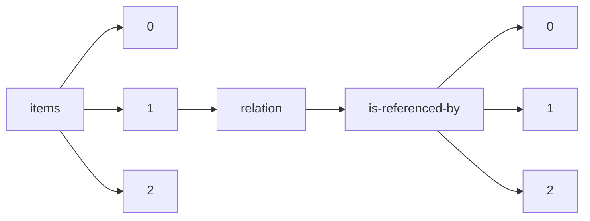

!!! warning "This document is not official Crossref documentation"
# Elements
PATH = items/array/relation/is-referenced-by/array(1)  
Occurs 35 709 times  
{ .annotate }

1. A route to an element, for example:  
   The route "items/array/relation/is-referenced-by/array" corresponds to navigating through the JSON indices as  
   ["items"][0]["relation"]["is-referenced-by"][0]  

## Asserted-by
See more information: [items/array/relation/is-referenced-by/array/asserted-by](asserted-by/index.md)  
Occurs 35 709 timess  
Unique values: 2  

| **Row** | **Value** `String` | **Count** `Int64` |
|--------:|----------------------:|---------------------:|
| **1**   | subject               | 19 559               |
| **2**   | object                | 16 150               |

## Id
See more information: [items/array/relation/is-referenced-by/array/id](id/index.md)  
Occurs 35 709 timess  
Unique values: > 999  

!!! note "Due to current limitations, only the first 1,000 unique values are counted."

| **Row** | **Value** `String`           | **Count** `Int64` |
|--------:|--------------------------------:|---------------------:|
| **1**   | 10.7554/eLife.03430             | 219                  |
| **2**   | 10.7287/peerj.preprints.27850v1 | 182                  |
| **3**   | 10.7287/peerj.preprints.27850   | 92                   |
| **4**   | 10.7287/peerj.preprints.27756v1 | 86                   |
| **5**   | 10.7287/peerj.preprints.3153v2  | 72                   |
| **6**   | 10.7287/peerj.preprints.3153v1  | 72                   |
| **7**   | 10.7287/peerj.preprints.3461    | 68                   |
| **8**   | 10.7287/peerj.preprints.3461v2  | 66                   |
| **9**   | 10.7287/peerj.preprints.27013v1 | 64                   |
| **10**  | 10.7287/peerj.preprints.27013   | 64                   |
| ... | ... | ... |

## Id-type
See more information: [items/array/relation/is-referenced-by/array/id-type](id-type/index.md)  
Occurs 35 709 timess  
Unique values: 5  

| **Row** | **Value** `String` | **Count** `Int64` |
|--------:|----------------------:|---------------------:|
| **1**   | doi                   | 35 678               |
| **2**   | arxiv                 | 28                   |
| **3**   | isbn                  | 1                    |
| **4**   | pmid                  | 1                    |
| **5**   | handle                | 1                    |

