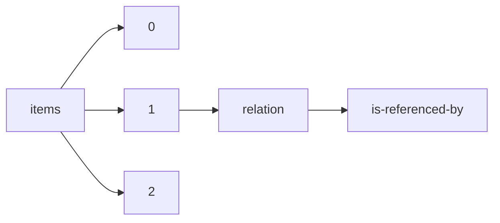

!!! warning "This document is not official Crossref documentation"
# Is-referenced-by
PATH = items/array/relation/is-referenced-by(1)  
Occurs 19 115 times  
{ .annotate }

1. A route to an element, for example:  
   The route "items/array/relation/is-referenced-by" corresponds to navigating through the JSON indices as  
   ["items"][0]["relation"]["is-referenced-by"]  

## Properties of Array
See information about elements: [items/array/relation/is-referenced-by/array](array/index.md)  
Distribution of lengths:  

| **Row** | **Length** `Any` | **Count** `Int64` |
|--------:|--------------------:|---------------------:|
| **1**   | 1                   | 9 097                |
| **2**   | 2                   | 4 292                |
| **3**   | 3                   | 5 697                |
| **4**   | 4                   | 2                    |
| **5**   | 6                   | 1                    |
| **6**   | 32                  | 11                   |
| **7**   | 38                  | 14                   |
| **8**   | 39                  | 1                    |

