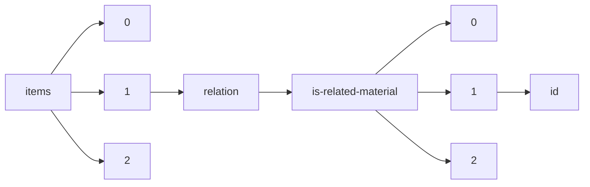

!!! warning "This document is not official Crossref documentation"
# Id
PATH = items/array/relation/is-related-material/array/id(1)  
Occurs 4 292 times  
Unique values: > 999  
{ .annotate }

1. A route to an element, for example:  
   The route "items/array/relation/is-related-material/array/id" corresponds to navigating through the JSON indices as  
   ["items"][0]["relation"]["is-related-material"][0]["id"]  

!!! note "Due to current limitations, only the first 1,000 unique values are counted."

| **Row** | **Value** `String`                                                                         | **Count** `Int64` |
|--------:|----------------------------------------------------------------------------------------------:|---------------------:|
| **1**   |                                                                                               | 286                  |
| **2**   | 10.26419/res.00351.000                                                                        | 275                  |
| **3**   | 10.26419/res.00524.000                                                                        | 158                  |
| **4**   | 10.26419/res.00245.000                                                                        | 87                   |
| **5**   | 10.26419/int.00052.001                                                                        | 78                   |
| **6**   | 10.26419/res.00514.000                                                                        | 73                   |
| **7**   | 10.26419/res.00259.000                                                                        | 63                   |
| **8**   | 10.26419/res.00132.000                                                                        | 58                   |
| **9**   | 10.26419/res.00172.001                                                                        | 55                   |
| **10**  | 10.26419/res.00056.001                                                                        | 53                   |
| **11**  | 10.26419/res.00572.001                                                                        | 52                   |
| **12**  | 10.26419/ppi.00165.000                                                                        | 52                   |
| **13**  | 10.26419/ppi.00164.000                                                                        | 52                   |
| **14**  | 10.26419/res.00137.000                                                                        | 52                   |
| **15**  | 10.26419/res.00254.000                                                                        | 52                   |
| **16**  | 10.26419/res.00171.000                                                                        | 51                   |
| **17**  | 10.26419/int.00044.000                                                                        | 51                   |
| **18**  | 10.26419/res.00550.000                                                                        | 46                   |
| **19**  | 10.26419/res.00228.000                                                                        | 45                   |
| **20**  | 10.26419/res.00054.000                                                                        | 36                   |
| **21**  | 10.26419/res.00401.000                                                                        | 30                   |
| **22**  | 10.26419/ppi.00103.001                                                                        | 21                   |
| **23**  | 10.26419/res.00367.001                                                                        | 19                   |
| **24**  | 10.26419/res.00539.001                                                                        | 18                   |
| **25**  | 10.26419/res.00133.001                                                                        | 17                   |
| **26**  | 10.26419/pia.00101.001                                                                        | 16                   |
| **27**  | 10.26419/res.00168.000                                                                        | 16                   |
| **28**  | 10.26419/res.00298.001                                                                        | 15                   |
| **29**  | 10.26419/res.00493.001                                                                        | 15                   |
| **30**  | 10.26419/res.00420.001                                                                        | 14                   |
| **31**  | 10.26419/res.00349.001                                                                        | 14                   |
| **32**  | 10.26419/res.00289.001                                                                        | 14                   |
| **33**  | 10.26419/res.00277.001                                                                        | 14                   |
| **34**  | 10.26419/res.00554.001                                                                        | 13                   |
| **35**  | 10.26419/res.00505.001                                                                        | 13                   |
| **36**  | 10.26419/res.00076.001                                                                        | 12                   |
| **37**  | 10.26419/res.00163.001                                                                        | 12                   |
| **38**  | 10.26419/pia.00001.001                                                                        | 11                   |
| **39**  | 10.26419/ppi.00178.000                                                                        | 11                   |
| **40**  | 10.26419/res.00484.001                                                                        | 11                   |
| **41**  | 9783952454237                                                                                 | 11                   |
| **42**  | 10.26419/res.00487.001                                                                        | 11                   |
| **43**  | 10.26419/res.00381.001                                                                        | 11                   |
| **44**  | 10.19218/3952454237                                                                           | 11                   |
| **45**  | 10.26419/res.00383.001                                                                        | 10                   |
| **46**  | 10.26419/res.00429.001                                                                        | 9                    |
| **47**  | 10.26419/res.00231.001                                                                        | 9                    |
| **48**  | 10.26419/res.00432.001                                                                        | 9                    |
| **49**  | 10.26419/res.00525.001                                                                        | 8                    |
| **50**  | 10.26419/res.00414.001                                                                        | 8                    |
| **51**  | 10.26419/res.00553.001                                                                        | 8                    |
| **52**  | 10.26419/res.00265.001                                                                        | 8                    |
| **53**  | 10.26419/int.00042.001                                                                        | 8                    |
| **54**  | 10.26419/res.00385.001                                                                        | 8                    |
| **55**  | 10.26419/res.00136.001                                                                        | 8                    |
| **56**  | 10.26419/res.00582.001                                                                        | 7                    |
| **57**  | 10.26419/res.00533.001                                                                        | 7                    |
| **58**  | 10.26419/res.00570.003                                                                        | 7                    |
| **59**  | 10.26419/res.00115.001                                                                        | 7                    |
| **60**  | 10.26419/res.00525.009                                                                        | 7                    |
| **61**  | 10.26419/res.00538.001                                                                        | 7                    |
| **62**  | 10.26419/pia.00014.001                                                                        | 7                    |
| **63**  | 10.26419/res.00543.001                                                                        | 7                    |
| **64**  | 10.26419/pia.00104.001                                                                        | 7                    |
| **65**  | 10.26419/res.00091.000                                                                        | 6                    |
| **66**  | 10.26419/pia.00099.001                                                                        | 6                    |
| **67**  | 10.26419/res.00450.001                                                                        | 6                    |
| **68**  | 10.26419/pia.00037.001                                                                        | 6                    |
| **69**  | 10.26419/res.00119.001                                                                        | 6                    |
| **70**  | 10.26419/pia.00013.001                                                                        | 6                    |
| **71**  | 10.26419/pia.00019.001                                                                        | 6                    |
| **72**  | 10.26419/res.00391.000                                                                        | 6                    |
| **73**  | 10.26419/pia.00103.001                                                                        | 6                    |
| **74**  | 10.26419/pia.00094.001                                                                        | 6                    |
| **75**  | 10.26419/res.00329.001                                                                        | 6                    |
| **76**  | 10.26419/res.00103.001                                                                        | 6                    |
| **77**  | 10.26419/res.00062.001                                                                        | 6                    |
| **78**  | http://sedici.unlp.edu.ar/handle/10915/68547                                                  | 6                    |
| **79**  | 10.26419/res.00328.001                                                                        | 6                    |
| **80**  | 10.26419/res.00135.001                                                                        | 6                    |
| **81**  | 10.26419/pia.00015.001                                                                        | 6                    |
| **82**  | 10.26419/pia.00106.001                                                                        | 6                    |
| **83**  | 10.26419/res.00162.001                                                                        | 6                    |
| **84**  | 10.26419/res.00417.001                                                                        | 6                    |
| **85**  | 10.26419/res.00558.001                                                                        | 6                    |
| **86**  | 10.1002/ecy.1477                                                                              | 6                    |
| **87**  | 10.26419/res.00146.001                                                                        | 6                    |
| **88**  | 10.26419/res.00460.001                                                                        | 6                    |
| **89**  | 10.26419/res.00249.001                                                                        | 6                    |
| **90**  | 10.26419/res.00116.000                                                                        | 5                    |
| **91**  | 10.3354/meps11760                                                                             | 5                    |
| **92**  | 10.26419/res.00581.004                                                                        | 5                    |
| **93**  | 10.26419/res.00335.000                                                                        | 5                    |
| **94**  | 10.26419/res.00515.000                                                                        | 5                    |
| **95**  | 10.26419/res.00446.000                                                                        | 5                    |
| **96**  | 10.26419/res.00368.001                                                                        | 5                    |
| **97**  | 10.1371/journal.pone.0147493                                                                  | 5                    |
| **98**  | 10.26419/res.00497.001                                                                        | 5                    |
| **99**  | 10.26419/res.00364.001                                                                        | 5                    |
| **100** | 10.26419/res.00584.001                                                                        | 5                    |
| **101** | 10.26419/res.00542.001                                                                        | 5                    |
| **102** | 10.26419/res.00562.001                                                                        | 5                    |
| **103** | 10.26419/res.00473.001                                                                        | 5                    |
| **104** | 10.26419/res.00537.001                                                                        | 5                    |
| **105** | 10.26419/res.00423.001                                                                        | 5                    |
| **106** | http://sedici.unlp.edu.ar/handle/10915/31672                                                  | 4                    |
| **107** | 10.1371/journal.pone.0171569                                                                  | 4                    |
| **108** | 10.1126/sciadv.1500328                                                                        | 4                    |
| **109** | 10.26419/res.00545.001                                                                        | 4                    |
| **110** | 10.26419/res.00304.001                                                                        | 4                    |
| **111** | 10.26419/res.00578.001                                                                        | 4                    |
| **112** | 10.26419/res.00217.001                                                                        | 4                    |
| **113** | 10.26419/res.00272.001                                                                        | 4                    |
| **114** | 10.26419/res.00059.001                                                                        | 4                    |
| **115** | 10.1002/2013GL058489                                                                          | 4                    |
| **116** | 10.26419/res.00447.001                                                                        | 4                    |
| **117** | 10.26419/res.00574.001                                                                        | 4                    |
| **118** | 10.26419/res.00531.001                                                                        | 4                    |
| **119** | 10.26419/res.00295.001                                                                        | 4                    |
| **120** | 10.26419/res.00224.001                                                                        | 4                    |
| **121** | https://www.mass.gov/files/documents/2016/08/uv/dmfnq201.pdf                                  | 4                    |
| **122** | 10.26419/res.00111.001                                                                        | 4                    |
| **123** | 10.26419/res.00476.001                                                                        | 4                    |
| **124** | 10.26419/res.00159.001                                                                        | 4                    |
| **125** | 10.1007/s10641-014-0279-y                                                                     | 4                    |
| **126** | https://gateway.pinata.cloud/ipfs/bafybeig3mflumx26u6g6mtrl63ot6vyejdsutfofhuhmsqqa2o7vxh2oy4 | 4                    |
| **127** | 10.1111/maec.12373                                                                            | 4                    |
| **128** | 10.26419/res.00160.001                                                                        | 4                    |
| **129** | 10.26419/res.00478.001                                                                        | 4                    |
| **130** | 10.26419/res.00416.001                                                                        | 4                    |
| **131** | 10.1038/ngeo1918                                                                              | 4                    |
| **132** | 10.26419/res.00455.001                                                                        | 4                    |
| **133** | 10.26419/res.00112.001                                                                        | 3                    |
| **134** | 10.26419/res.00055.025                                                                        | 3                    |
| **135** | 10.26419/res.00055.005                                                                        | 3                    |
| **136** | 10.26419/res.00055.037                                                                        | 3                    |
| **137** | 10.26419/res.00055.013                                                                        | 3                    |
| **138** | 10.26419/res.00530.001                                                                        | 3                    |
| **139** | 10.26419/res.00479.001                                                                        | 3                    |
| **140** | 10.26419/res.00278.001                                                                        | 3                    |
| **141** | 10.1002/lom3.10054                                                                            | 3                    |
| **142** | 10.26419/res.00055.049                                                                        | 3                    |
| **143** | 10.26419/res.00592.001                                                                        | 3                    |
| **144** | 10.26419/res.00343.001                                                                        | 3                    |
| **145** | 10.26419/res.00279.001                                                                        | 3                    |
| **146** | 10.26419/res.00183.001                                                                        | 3                    |
| **147** | 10.26419/res.00331.001                                                                        | 3                    |
| **148** | 10.26419/res.00520.001                                                                        | 3                    |
| **149** | 10.1016/j.jembe.2017.01.003                                                                   | 3                    |
| **150** | 10.26419/res.00284.001                                                                        | 3                    |
| **151** | 10.26419/res.00156.001                                                                        | 3                    |
| **152** | 10.26419/res.00177.000                                                                        | 3                    |
| **153** | 10.3354/meps113147                                                                            | 3                    |
| **154** | 10.26419/ppi.00166.000                                                                        | 3                    |
| **155** | 10.26419/res.00055.053                                                                        | 3                    |
| **156** | 10.1007/s10530-014-0801-3                                                                     | 3                    |
| **157** | 10.26419/res.00246.001                                                                        | 3                    |
| **158** | 10.26419/res.00283.001                                                                        | 3                    |
| **159** | 10.26419/res.00055.029                                                                        | 3                    |
| **160** | 10.26419/res.00068.001                                                                        | 3                    |
| **161** | 10.26419/res.00387.001                                                                        | 3                    |
| **162** | 10.1029/2001JC000811                                                                          | 3                    |
| **163** | 10.26419/res.00345.001                                                                        | 3                    |
| **164** | 10.26419/res.00055.033                                                                        | 3                    |
| **165** | 10.26419/res.00110.001                                                                        | 3                    |
| **166** | 10.26419/res.00346.001                                                                        | 3                    |
| **167** | 10.26419/res.00055.001                                                                        | 3                    |
| **168** | 10.26419/res.00114.001                                                                        | 3                    |
| **169** | 10.26419/res.00552.001                                                                        | 3                    |
| **170** | 10.1371/journal.pone.0066995                                                                  | 3                    |
| **171** | 10.1002/lno.10085                                                                             | 3                    |
| **172** | 10.26419/res.00579.001                                                                        | 3                    |
| **173** | 10.26419/res.00121.001                                                                        | 3                    |
| **174** | 10.1073/pnas.1120794109                                                                       | 3                    |
| **175** | 10.26419/res.00314.001                                                                        | 3                    |
| **176** | 10.26419/res.00092.001                                                                        | 3                    |
| **177** | 10.26419/res.00124.001                                                                        | 3                    |
| **178** | 10.26419/res.00548.001                                                                        | 3                    |
| **179** | 10.26419/res.00365.001                                                                        | 3                    |
| **180** | 10.26419/res.00055.045                                                                        | 3                    |
| **181** | 10.26419/res.00108.001                                                                        | 3                    |
| **182** | 10.1016/j.dsr.2009.08.007                                                                     | 3                    |
| **183** | 10.26419/res.00055.009                                                                        | 3                    |
| **184** | 10.26419/res.00055.021                                                                        | 3                    |
| **185** | 10.26419/res.00569.001                                                                        | 3                    |
| **186** | 10.26419/res.00055.041                                                                        | 3                    |
| **187** | 10.26419/res.00055.017                                                                        | 3                    |
| **188** | 10.1099/acmi.0.000481.v1                                                                      | 2                    |
| **189** | 10.1099/acmi.0.000479.v1                                                                      | 2                    |
| **190** | 10.1099/acmi.0.000543.v1                                                                      | 2                    |
| **191** | 10.1099/acmi.0.000573.v1                                                                      | 2                    |
| **192** | 10.1099/acmi.0.000581.v1                                                                      | 2                    |
| **193** | 10.1038/s41396-017-0032-6                                                                     | 2                    |
| **194** | 10.26419/res.00243.001                                                                        | 2                    |
| **195** | 10.1099/acmi.0.000568.v2                                                                      | 2                    |
| **196** | 10.1038/srep44586                                                                             | 2                    |
| **197** | https://escholarship.org/uc/item/4kr623b2                                                     | 2                    |
| **198** | 10.1007/s12237-008-9034-y                                                                     | 2                    |
| **199** | 0814423035                                                                                    | 2                    |
| **200** | 10.4319/lo.1989.34.6.1097                                                                     | 2                    |
| **201** | 10.26419/res.00337.001                                                                        | 2                    |
| **202** | 10.1099/acmi.0.000467.v2                                                                      | 2                    |
| **203** | 10.26419/res.00502.001                                                                        | 2                    |
| **204** | 10.26419/res.00261.001                                                                        | 2                    |
| **205** | 10.26419/res.00599.001                                                                        | 2                    |
| **206** | 10.1099/acmi.0.000600.v1                                                                      | 2                    |
| **207** | 10.1099/acmi.0.000562.v1                                                                      | 2                    |
| **208** | 9782866013561                                                                                 | 2                    |
| **209** | 10.1890/09-0087.1                                                                             | 2                    |
| **210** | 10.2307/1541442                                                                               | 2                    |
| **211** | 10.1099/acmi.0.000567.v1                                                                      | 2                    |
| **212** | 10.26419/res.00269.001                                                                        | 2                    |
| **213** | 10.26419/res.00495.001                                                                        | 2                    |
| **214** | 10.1016/j.ecss.2015.04.004                                                                    | 2                    |
| **215** | 10.1099/acmi.0.000544.v1                                                                      | 2                    |
| **216** | 10.1099/acmi.0.000474.v2                                                                      | 2                    |
| **217** | 10.1099/acmi.0.000474.v1                                                                      | 2                    |
| **218** | 10.1099/acmi.0.000551.v1                                                                      | 2                    |
| **219** | 10.26419/res.00250.001                                                                        | 2                    |
| **220** | 10.1099/acmi.0.000533.v1                                                                      | 2                    |
| **221** | 10.1099/acmi.0.000518.v2                                                                      | 2                    |
| **222** | 10.1099/acmi.0.000531.v1                                                                      | 2                    |
| **223** | 10.1099/acmi.0.000599.v1                                                                      | 2                    |
| **224** | 10.1099/acmi.0.000559.v1                                                                      | 2                    |
| **225** | 10.26419/res.00480.000                                                                        | 2                    |
| **226** | 10.26419/res.00390.001                                                                        | 2                    |
| **227** | 10.1099/acmi.0.000469.v1                                                                      | 2                    |
| **228** | 10.1099/acmi.0.000519.v1                                                                      | 2                    |
| **229** | 10.1099/acmi.0.000513.v2                                                                      | 2                    |
| **230** | 10.1099/acmi.0.000472.v1                                                                      | 2                    |
| **231** | 10.1099/acmi.0.000504.v1                                                                      | 2                    |
| **232** | 10.1099/acmi.0.000468.v1                                                                      | 2                    |
| **233** | 10.1099/acmi.0.000572.v1                                                                      | 2                    |
| **234** | 10.1099/acmi.0.000470.v2                                                                      | 2                    |
| **235** | 10.3390/w8060229                                                                              | 2                    |
| **236** | 10.1099/acmi.0.000561.v2                                                                      | 2                    |
| **237** | 10.26419/res.00488.001                                                                        | 2                    |
| **238** | 10.26419/res.00506.001                                                                        | 2                    |
| **239** | 10.26419/res.00080.001                                                                        | 2                    |
| **240** | 10.1099/acmi.0.000515.v2                                                                      | 2                    |
| **241** | 10.1099/acmi.0.000530.v1                                                                      | 2                    |
| **242** | 10.1099/acmi.0.000512.v1                                                                      | 2                    |
| **243** | 10.1099/acmi.0.000494.v1                                                                      | 2                    |
| **244** | 10.1099/acmi.0.000505.v1                                                                      | 2                    |
| **245** | 10.1099/acmi.0.000478.v1                                                                      | 2                    |
| **246** | 10.1016/j.dsr2.2008.02.001                                                                    | 2                    |
| **247** | 10.26419/res.00464.001                                                                        | 2                    |
| **248** | 10.26419/res.00494.001                                                                        | 2                    |
| **249** | 10.1099/acmi.0.000571.v1                                                                      | 2                    |
| **250** | 10.1029/2012JC007925                                                                          | 2                    |
| **251** | 10.1099/acmi.0.000487.v1                                                                      | 2                    |
| **252** | 10.1099/acmi.0.000576.v1                                                                      | 2                    |
| **253** | 10.1099/acmi.0.000506.v2                                                                      | 2                    |
| **254** | 10.1099/acmi.0.000561.v1                                                                      | 2                    |
| **255** | 10.1099/acmi.0.000499.v1                                                                      | 2                    |
| **256** | 10.1099/acmi.0.000511.v2                                                                      | 2                    |
| **257** | https://www.ncbi.nlm.nih.gov/pmc/articles/PMC2854820/                                         | 2                    |
| **258** | 10.1099/acmi.0.000537.v2                                                                      | 2                    |
| **259** | 10.1099/acmi.0.000464.v2                                                                      | 2                    |
| **260** | 10.1099/acmi.0.000489.v1                                                                      | 2                    |
| **261** | 10.1099/acmi.0.000508.v1                                                                      | 2                    |
| **262** | 10.26419/res.00529.001                                                                        | 2                    |
| **263** | 10.1099/acmi.0.000525.v1                                                                      | 2                    |
| **264** | 10.1099/acmi.0.000483.v1                                                                      | 2                    |
| **265** | 10.1099/acmi.0.000517.v1                                                                      | 2                    |
| **266** | https://gateway.pinata.cloud/ipfs/bafybeidt56al5akh2z3njyonq4onotq3lk3gojqh4apsze3nqaiscprhfa | 2                    |
| **267** | 10.26419/res.00504.001                                                                        | 2                    |
| **268** | 10.1099/acmi.0.000485.v1                                                                      | 2                    |
| **269** | 10.1099/acmi.0.000595.v1                                                                      | 2                    |
| **270** | 10.1007/s10533-018-0438-x                                                                     | 2                    |
| **271** | 10.1099/acmi.0.000495.v1                                                                      | 2                    |
| **272** | 10.1099/acmi.0.000585.v1                                                                      | 2                    |
| **273** | 10.1099/acmi.0.000541.v1                                                                      | 2                    |
| **274** | 10.26419/res.00342.001                                                                        | 2                    |
| **275** | 10.1099/acmi.0.000518.v1                                                                      | 2                    |
| **276** | 10.1099/acmi.0.000492.v1                                                                      | 2                    |
| **277** | 9780465083428                                                                                 | 2                    |
| **278** | 10.1099/acmi.0.000554.v1                                                                      | 2                    |
| **279** | 10.26419/res.00513.001                                                                        | 2                    |
| **280** | 10.26419/res.00517.001                                                                        | 2                    |
| **281** | 10.1099/acmi.0.000578.v1                                                                      | 2                    |
| **282** | 10.1099/acmi.0.000550.v1                                                                      | 2                    |
| **283** | 10.1099/acmi.0.000490.v2                                                                      | 2                    |
| **284** | 10.1099/acmi.0.000602.v1                                                                      | 2                    |
| **285** | 10.26419/res.00461.001                                                                        | 2                    |
| **286** | 10.1099/acmi.0.000577.v2                                                                      | 2                    |
| **287** | 10.26419/res.00138.001                                                                        | 2                    |
| **288** | 978-0-444-86708-7                                                                             | 2                    |
| **289** | 10.1099/acmi.0.000547.v1                                                                      | 2                    |
| **290** | 10.1099/acmi.0.000476.v1                                                                      | 2                    |
| **291** | 10.1099/acmi.0.000598.v1                                                                      | 2                    |
| **292** | 10.3389/fmicb.2015.01449                                                                      | 2                    |
| **293** | 10.1099/acmi.0.000507.v1                                                                      | 2                    |
| **294** | 10.1007/s12237-012-9547-2                                                                     | 2                    |
| **295** | 10.1099/acmi.0.000563.v1                                                                      | 2                    |
| **296** | 10.1099/acmi.0.000477.v1                                                                      | 2                    |
| **297** | 10.1099/acmi.0.000601.v1                                                                      | 2                    |
| **298** | 10.19218/3906897295                                                                           | 2                    |
| **299** | 10.1099/acmi.0.000593.v1                                                                      | 2                    |
| **300** | 10.1099/acmi.0.000560.v1                                                                      | 2                    |
| **301** | 10.1007/s00338-017-1566-9                                                                     | 2                    |
| **302** | 10.3354/meps016127                                                                            | 2                    |
| **303** | 10.1099/acmi.0.000490.v1                                                                      | 2                    |
| **304** | 10.1099/acmi.0.000570.v1                                                                      | 2                    |
| **305** | 10.1021/acs.est.7b03538                                                                       | 2                    |
| **306** | 10.26419/res.00375.001                                                                        | 2                    |
| **307** | 10.1099/acmi.0.000555.v1                                                                      | 2                    |
| **308** | 10.1099/acmi.0.000540.v1                                                                      | 2                    |
| **309** | 10.1099/acmi.0.000471.v1                                                                      | 2                    |
| **310** | 10.26419/res.00456.001                                                                        | 2                    |
| **311** | 10.37521/ejpps/2501                                                                           | 2                    |
| **312** | 10.26419/res.00318.001                                                                        | 2                    |
| **313** | 10.1099/acmi.0.000466.v1                                                                      | 2                    |
| **314** | 10.1099/acmi.0.000584.v1                                                                      | 2                    |
| **315** | 10.1073/pnas.1307701110                                                                       | 2                    |
| **316** | 10.1099/acmi.0.000564.v1                                                                      | 2                    |
| **317** | 10.26419/res.00489.001                                                                        | 2                    |
| **318** | 10.26419/res.00601.001                                                                        | 2                    |
| **319** | 10.1099/acmi.0.000589.v1                                                                      | 2                    |
| **320** | 10.1099/acmi.0.000588.v1                                                                      | 2                    |
| **321** | 10.1099/acmi.0.000569.v1                                                                      | 2                    |
| **322** | 10.1099/acmi.0.000497.v1                                                                      | 2                    |
| **323** | 10.3389/fmicb.2014.00743                                                                      | 2                    |
| **324** | 10.1099/acmi.0.000582.v1                                                                      | 2                    |
| **325** | 10.26419/res.00412.001                                                                        | 2                    |
| **326** | 10.1099/acmi.0.000501.v1                                                                      | 2                    |
| **327** | https://gateway.pinata.cloud/ipfs/bafybeiaott5emoeqtv6i6bxk2cdg4myvps3ktdw2venai5jxol7g7vqb7y | 2                    |
| **328** | 10.1016/j.ecss.2014.10.013                                                                    | 2                    |
| **329** | 10.1016/j.gca.2017.01.043                                                                     | 2                    |
| **330** | 10.1099/acmi.0.000463.v1                                                                      | 2                    |
| **331** | 10.1201/EBK1420088304                                                                         | 2                    |
| **332** | 10.1099/acmi.0.000524.v1                                                                      | 2                    |
| **333** | 10.1099/acmi.0.000536.v2                                                                      | 2                    |
| **334** | 10.1099/acmi.0.000552.v1                                                                      | 2                    |
| **335** | 10.1007/s12237-014-9773-x                                                                     | 2                    |
| **336** | 10.1099/acmi.0.000485.v2                                                                      | 2                    |
| **337** | 10.1099/acmi.0.000506.v1                                                                      | 2                    |
| **338** | 9783906897295                                                                                 | 2                    |
| **339** | 10.1099/acmi.0.000510.v1                                                                      | 2                    |
| **340** | 10.1099/acmi.0.000522.v1                                                                      | 2                    |
| **341** | 10.1007/s12237-013-9656-6                                                                     | 2                    |
| **342** | 10.1099/acmi.0.000591.v1                                                                      | 2                    |
| **343** | 10.26419/res.00123.001                                                                        | 2                    |
| **344** | 10.1016/j.gca.2018.05.023                                                                     | 2                    |
| **345** | 10.1038/srep23773                                                                             | 2                    |
| **346** | 10.1099/acmi.0.000496.v1                                                                      | 2                    |
| **347** | 0865310351                                                                                    | 2                    |
| **348** | 10.1099/acmi.0.000461.v1                                                                      | 2                    |
| **349** | 10.1099/acmi.0.000497.v2                                                                      | 2                    |
| **350** | 10.26419/res.00580.001                                                                        | 2                    |
| **351** | 10.1099/acmi.0.000532.v1                                                                      | 2                    |
| **352** | 10.1099/acmi.0.000590.v1                                                                      | 2                    |
| **353** | 10.1099/acmi.0.000538.v1                                                                      | 2                    |
| **354** | 10.26419/res.00063.001                                                                        | 2                    |
| **355** | 10.26419/res.00546.001                                                                        | 2                    |
| **356** | 10.1099/acmi.0.000586.v1                                                                      | 2                    |
| **357** | 10.1099/acmi.0.000467.v1                                                                      | 2                    |
| **358** | 10.26419/res.00486.001                                                                        | 2                    |
| **359** | 10.1016/j.dsr2.2010.08.014                                                                    | 2                    |
| **360** | 10.1099/acmi.0.000516.v1                                                                      | 2                    |
| **361** | 10.1099/acmi.0.000534.v1                                                                      | 2                    |
| **362** | 10.1099/acmi.0.000575.v1                                                                      | 2                    |
| **363** | 10.1099/acmi.0.000493.v1                                                                      | 2                    |
| **364** | 978-0139524332                                                                                | 2                    |
| **365** | http://sedici.unlp.edu.ar/handle/10915/55716                                                  | 2                    |
| **366** | 10.1099/acmi.0.000491.v1                                                                      | 2                    |
| **367** | 10.1099/acmi.0.000459.v2                                                                      | 2                    |
| **368** | 10.1002/2017JG004243                                                                          | 2                    |
| **369** | 10.4319/lo.2014.59.5.1651                                                                     | 2                    |
| **370** | 10.1099/acmi.0.000523.v1                                                                      | 2                    |
| **371** | 10.1002/2013GB004690                                                                          | 2                    |
| **372** | 10.1099/acmi.0.000473.v1                                                                      | 2                    |
| **373** | 10.26419/res.00098.001                                                                        | 2                    |
| **374** | 10.1099/acmi.0.000514.v1                                                                      | 2                    |
| **375** | 10.1099/acmi.0.000509.v1                                                                      | 2                    |
| **376** | 10.26419/res.00126.001                                                                        | 2                    |
| **377** | 10.26419/res.00099.001                                                                        | 2                    |
| **378** | 10.1099/acmi.0.000556.v1                                                                      | 2                    |
| **379** | 10.1099/acmi.0.000535.v1                                                                      | 2                    |
| **380** | 10.1099/acmi.0.000537.v1                                                                      | 2                    |
| **381** | 10.1099/acmi.0.000527.v1                                                                      | 2                    |
| **382** | 10.1099/acmi.0.000522.v2                                                                      | 2                    |
| **383** | 10.1099/acmi.0.000592.v1                                                                      | 2                    |
| **384** | 10.1099/acmi.0.000579.v1                                                                      | 2                    |
| **385** | 10.1099/acmi.0.000583.v1                                                                      | 2                    |
| **386** | 10.26419/res.00257.001                                                                        | 2                    |
| **387** | 10.26419/res.00433.001                                                                        | 2                    |
| **388** | 10.1099/acmi.0.000548.v1                                                                      | 2                    |
| **389** | 10.1099/acmi.0.000521.v1                                                                      | 2                    |
| **390** | 10.26419/res.00509.001                                                                        | 2                    |
| **391** | 10.1099/acmi.0.000511.v1                                                                      | 2                    |
| **392** | 10.1099/acmi.0.000462.v3                                                                      | 2                    |
| **393** | 10.1002/lno.10152                                                                             | 2                    |
| **394** | 10.1099/acmi.0.000460.v1                                                                      | 2                    |
| **395** | 10.1099/acmi.0.000539.v1                                                                      | 2                    |
| **396** | 10.26419/res.00496.001                                                                        | 2                    |
| **397** | 10.1099/acmi.0.000459.v1                                                                      | 2                    |
| **398** | 10.1099/acmi.0.000549.v1                                                                      | 2                    |
| **399** | 10.1099/acmi.0.000520.v1                                                                      | 2                    |
| **400** | 10.1029/2010GB003979                                                                          | 2                    |
| **401** | 10.4319/lo.2011.56.2.0627                                                                     | 2                    |
| **402** | 10.26419/res.00462.001                                                                        | 2                    |
| **403** | 10.26419/res.00187.001                                                                        | 2                    |
| **404** | 10.1099/acmi.0.000553.v1                                                                      | 2                    |
| **405** | 10.26419/res.00463.001                                                                        | 2                    |
| **406** | 10.1099/acmi.0.000545.v1                                                                      | 2                    |
| **407** | 10.1099/acmi.0.000536.v1                                                                      | 2                    |
| **408** | 10.1099/acmi.0.000513.v1                                                                      | 2                    |
| **409** | 10.1099/acmi.0.000486.v1                                                                      | 2                    |
| **410** | 10.26419/res.00551.001                                                                        | 2                    |
| **411** | 10.26419/res.00430.001                                                                        | 2                    |
| **412** | 10.1099/acmi.0.000529.v1                                                                      | 2                    |
| **413** | 10.1099/acmi.0.000502.v1                                                                      | 2                    |
| **414** | 10.26419/res.00490.001                                                                        | 2                    |
| **415** | 10.26419/res.00475.001                                                                        | 2                    |
| **416** | 10.1099/acmi.0.000503.v1                                                                      | 2                    |
| **417** | 10.1099/acmi.0.000565.v1                                                                      | 2                    |
| **418** | 10.26419/res.00498.001                                                                        | 2                    |
| **419** | 10.1099/acmi.0.000542.v1                                                                      | 2                    |
| **420** | 10.1099/acmi.0.000574.v1                                                                      | 2                    |
| **421** | 10.1099/acmi.0.000484.v1                                                                      | 2                    |
| **422** | 10.26419/res.00275.001                                                                        | 2                    |
| **423** | 10.1099/acmi.0.000488.v1                                                                      | 2                    |
| **424** | 10.1099/acmi.0.000465.v1                                                                      | 2                    |
| **425** | 10.26419/res.00359.001                                                                        | 2                    |
| **426** | 10.1099/acmi.0.000531.v2                                                                      | 2                    |
| **427** | 10.26419/res.00386.001                                                                        | 2                    |
| **428** | 10.1016/j.watres.2011.08.002                                                                  | 2                    |
| **429** | 10.1099/acmi.0.000462.v1                                                                      | 2                    |
| **430** | 10.1099/acmi.0.000475.v1                                                                      | 2                    |
| **431** | 10.26419/res.00332.001                                                                        | 2                    |
| **432** | 10.1099/acmi.0.000558.v1                                                                      | 2                    |
| **433** | 10.26419/res.00193.001                                                                        | 2                    |
| **434** | 10.26360/2017\_3                                                                              | 2                    |
| **435** | 10.1099/acmi.0.000577.v1                                                                      | 2                    |
| **436** | 10.1099/acmi.0.000506.v3                                                                      | 2                    |
| **437** | 10.26419/res.00604.001                                                                        | 2                    |
| **438** | 10.1099/acmi.0.000594.v1                                                                      | 2                    |
| **439** | 10.1099/acmi.0.000526.v1                                                                      | 2                    |
| **440** | 10.1038/ismej.2017.187                                                                        | 2                    |
| **441** | 10.26419/res.00100.001                                                                        | 2                    |
| **442** | 10.26419/res.00521.001                                                                        | 2                    |
| **443** | 10.1099/acmi.0.000474.v3                                                                      | 2                    |
| **444** | 10.26419/res.00263.001                                                                        | 2                    |
| **445** | 10.1099/acmi.0.000482.v1                                                                      | 2                    |
| **446** | 10.1099/acmi.0.000587.v1                                                                      | 2                    |
| **447** | 10.1099/acmi.0.000506.v4                                                                      | 2                    |
| **448** | 10.1099/acmi.0.000491.v2                                                                      | 2                    |
| **449** | 10.1016/j.ejop.2006.10.001                                                                    | 2                    |
| **450** | 10.4319/lo.1994.39.8.1985                                                                     | 1                    |
| **451** | 978-0471528883                                                                                | 1                    |
| **452** | https://gateway.pinata.cloud/ipfs/bafybeifkqlqusx6t7moapywrzw7lyimaay7bu4yklpwvx3yjtxcfz5qdlm | 1                    |
| **453** | https://gateway.pinata.cloud/ipfs/bafybeigtseedmdcvbajuejcsxp7rhivagdvqfxrwrywjwrj4xezf2lifg4 | 1                    |
| **454** | 10.26419/res.00400.001                                                                        | 1                    |
| **455** | https://gateway.pinata.cloud/ipfs/bafybeicdvzvcxbnnt55vewcx263cyzd7naq35tzouu2f2v6miwzl6bvdiu | 1                    |
| **456** | 10.26419/res.00116.001                                                                        | 1                    |
| **457** | 10.26419/res.00064.001                                                                        | 1                    |
| **458** | https://gateway.pinata.cloud/ipfs/bafybeiesxufus62ueayy6kj244unxogc3rnssdkek3tp4ew4pfx6ipwkv4 | 1                    |
| **459** | https://gateway.pinata.cloud/ipfs/bafybeigmta5oynwkgiohvxfxhd3h6qx2qdeg7sfcjrrt6l2kkan5dhzu24 | 1                    |
| **460** | https://gateway.pinata.cloud/ipfs/bafybeifgh6vrejse4jpvanbvf7wzu7vkemifana4fooe22fi5kxz2xsuda | 1                    |
| **461** | 10.1890/15-1669.1                                                                             | 1                    |
| **462** | 10.26419/res.00086.002                                                                        | 1                    |
| **463** | https://gateway.pinata.cloud/ipfs/bafybeig4pc7tepsjqzrwqhyg47gftiak2jbqyn5fy2bzsuspiige24eqni | 1                    |
| **464** | 978-0932790521                                                                                | 1                    |
| **465** | 10.26419/res.00307.001                                                                        | 1                    |
| **466** | 0-19-829430-1                                                                                 | 1                    |
| **467** | https://gateway.pinata.cloud/ipfs/bafybeiexs6bdqsqzbija3zmotjjhbizy3es3k7x36ngtqndo57pn7sqjjq | 1                    |
| **468** | 10.1111/j.1439-0485.2010.00367.x                                                              | 1                    |
| **469** | 10.26419/res.00319.001                                                                        | 1                    |
| **470** | http://sedici.unlp.edu.ar/handle/10915/53828                                                  | 1                    |
| **471** | https://gateway.pinata.cloud/ipfs/bafybeifoka2qqdc25njyot2o4cv4ul3wo76ykaesl5bc3uow6k5v2p6mry | 1                    |
| **472** | https://gateway.pinata.cloud/ipfs/bafybeia5ysoxhxwnvk7x2o6gvrdmiiq75auqtgbwhz2zdho72v3olaw33y | 1                    |
| **473** | 978-1-904838-02-9                                                                             | 1                    |
| **474** | https://gateway.pinata.cloud/ipfs/bafybeigsimf6vjd62qxahnop6p2qf7ski6qhgztjzbynp3isldsrs7jr7y | 1                    |
| **475** | 10.26419/res.00137.051                                                                        | 1                    |
| **476** | 10.26419/res.00137.005                                                                        | 1                    |
| **477** | https://gateway.pinata.cloud/ipfs/bafybeiarxgrigztrjaxxvbjpom3zdynhut6olmjwskshws2ht6ysxy55ui | 1                    |
| **478** | https://gateway.pinata.cloud/ipfs/bafybeieuhglujhxn77vsho5kgkkxstermhhmvfhnjul5zsh7eq6rf6fbke | 1                    |
| **479** | 10.26419/res.00422.001                                                                        | 1                    |
| **480** | 978-0688129699                                                                                | 1                    |
| **481** | http://sedici.unlp.edu.ar/handle/10915/42219                                                  | 1                    |
| **482** | 10.26419/res.00073.001                                                                        | 1                    |
| **483** | 978-0870944659                                                                                | 1                    |
| **484** | 10.26419/res.00329.008                                                                        | 1                    |
| **485** | 10.17077/conf.005635                                                                          | 1                    |
| **486** | 10.26360/2019\_4                                                                              | 1                    |
| **487** | 10.26419/res.00308.001                                                                        | 1                    |
| **488** | 0-387-97314-1                                                                                 | 1                    |
| **489** | https://gateway.pinata.cloud/ipfs/bafybeicg6eb4emesj5b5ieedtvsoi24hzddvled45yk2ejm6jpfpixzaei | 1                    |
| **490** | 10.26419/res.00189.001                                                                        | 1                    |
| **491** | https://gateway.pinata.cloud/ipfs/bafybeicgwwkwidzu2nkenvdkvjlunhkhr4hu3d4xwijuv4pejli5r2rw5q | 1                    |
| **492** | https://gateway.pinata.cloud/ipfs/bafybeighx2miqoomt7omque4ar6slvox342a46omo4svdjm5zuwg3b7npm | 1                    |
| **493** | 9780861877393                                                                                 | 1                    |
| **494** | 0553202154                                                                                    | 1                    |
| **495** | 10.26419/res.00137.007                                                                        | 1                    |
| **496** | https://gateway.pinata.cloud/ipfs/bafybeiepggqvy3hyalp3qgcmarbddj5cimsifxuc2uarpr5v7xnzxfacam | 1                    |
| **497** | 9780465069422                                                                                 | 1                    |
| **498** | 10.26419/res.00397.001                                                                        | 1                    |
| **499** | https://gateway.pinata.cloud/ipfs/bafybeihl242aqjp6bisagfqhibyosc7r5hdeux6cbd3yderwajkngsylrq | 1                    |
| **500** | 10.26419/res.00522.001                                                                        | 1                    |
| **501** | 978-0140253344                                                                                | 1                    |
| **502** | 10.26419/res.00137.036                                                                        | 1                    |
| **503** | http://sedici.unlp.edu.ar/handle/10915/112224                                                 | 1                    |
| **504** | https://gateway.pinata.cloud/ipfs/bafybeihchpjitktbz7guitrshel3bavcws4h4xwskza74fdtg3rtuoskeq | 1                    |
| **505** | 10.26419/res.00137.025                                                                        | 1                    |
| **506** | 10.26419/res.00226.001                                                                        | 1                    |
| **507** | https://gateway.pinata.cloud/ipfs/bafybeid7lsmwoc3wxre6hbm3carem6aiqucx34v4jh6sc5s7czd2n4qqje | 1                    |
| **508** | 10.1016/j.dsr.2004.06.009                                                                     | 1                    |
| **509** | https://gateway.pinata.cloud/ipfs/bafybeidgy7vukjtct2k5frg4xniysw42z3hjeyltgbon5flhzcxxggxi4i | 1                    |
| **510** | http://sedici.unlp.edu.ar/handle/10915/137643                                                 | 1                    |
| **511** | 10.26419/res.00061.001                                                                        | 1                    |
| **512** | 978-1-4684-8941-5                                                                             | 1                    |
| **513** | 10.1073/pnas.1220680110                                                                       | 1                    |
| **514** | 10.26419/res.00137.032                                                                        | 1                    |
| **515** | https://gateway.pinata.cloud/ipfs/bafybeidzkp4yfnmxrfqfgfy5bkztevg5lojqpmde6w2hts5haiy72gpdya | 1                    |
| **516** | 9780195092400                                                                                 | 1                    |
| **517** | 10.26419/res.00182.001                                                                        | 1                    |
| **518** | 9780060161293                                                                                 | 1                    |
| **519** | https://gateway.pinata.cloud/ipfs/bafybeic6t4rsvhctzofxco53gd22hiqq642muadbpuoseujgwgvcj6qnzy | 1                    |
| **520** | 10.26419/res.00137.052                                                                        | 1                    |
| **521** | http://sedici.unlp.edu.ar/handle/10915/56559                                                  | 1                    |
| **522** | 10.26419/res.00071.001                                                                        | 1                    |
| **523** | 10.1016/j.dsr2.2014.11.017                                                                    | 1                    |
| **524** | 10.1111/maec.12136                                                                            | 1                    |
| **525** | http://sedici.unlp.edu.ar/handle/10915/49067                                                  | 1                    |
| **526** | 10.26419/res.00137.022                                                                        | 1                    |
| **527** | 978-0915299362                                                                                | 1                    |
| **528** | https://gateway.pinata.cloud/ipfs/bafybeia7cqop4awdy5zhiond3cyy5vys3fvvaanpx2o3cu4gb5mdiutrsu | 1                    |
| **529** | 10.26419/res.00421.001                                                                        | 1                    |
| **530** | https://gateway.pinata.cloud/ipfs/bafybeiahkzossp36cqvmwdkyy4n2mfsepmdp35goceq226pvqhopjx6fwq | 1                    |
| **531** | 10.26419/res.00273.001                                                                        | 1                    |
| **532** | https://gateway.pinata.cloud/ipfs/bafybeievlbjzfrq4zmyy5ltqu77axh4tvsw4mm7jgxvfdcvxijlgj4ixva | 1                    |
| **533** | 9783598116308                                                                                 | 1                    |
| **534** | 978-3258032191                                                                                | 1                    |
| **535** | 0-670-03384-7                                                                                 | 1                    |
| **536** | https://gateway.pinata.cloud/ipfs/bafybeidr5hmz4wm3uwj4gt5kizgjgeknd3jw3ogt2kgk7tpnhbmef6isaa | 1                    |
| **537** | http://sedici.unlp.edu.ar/handle/10915/119872                                                 | 1                    |
| **538** | 10.26419/res.00081.001                                                                        | 1                    |
| **539** | https://gateway.pinata.cloud/ipfs/bafybeiawv4zxbcvna2bsp7aldnbmkjgfcosqmkjak6gh76d52yc4zvzs34 | 1                    |
| **540** | 10.26419/res.00137.021                                                                        | 1                    |
| **541** | http://sedici.unlp.edu.ar/handle/10915/137649                                                 | 1                    |
| **542** | 10.26419/res.00137.028                                                                        | 1                    |
| **543** | https://gateway.pinata.cloud/ipfs/bafybeiccc2gbdgpnpknrpohxc4zekhznskhiukrmj6r226ywyxhywi26oa | 1                    |
| **544** | https://unlp.edu.ar/extension/presentacion\_libro\_postales\_de\_la\_memoria-1787             | 1                    |
| **545** | 10.1016/S0005-2728(98)00135-2                                                                 | 1                    |
| **546** | 10.26419/res.00094.001                                                                        | 1                    |
| **547** | https://gateway.pinata.cloud/ipfs/bafybeigoxgxrdlze5a2iyr6dzd4osobxrhf3gelofxncuiiof6az457ipe | 1                    |
| **548** | 978-0080262949                                                                                | 1                    |
| **549** | https://gateway.pinata.cloud/ipfs/bafybeiho2gsfnokql4zrqtkz4vsxfm4pb3sdkd2i6ugth6426iqb663zfi | 1                    |
| **550** | http://sedici.unlp.edu.ar/handle/10915/74309                                                  | 1                    |
| **551** | 10.26419/res.00128.001                                                                        | 1                    |
| **552** | 9780803947436                                                                                 | 1                    |
| **553** | 10.17113/ftb.58.01.20.6351\_corrig.58(3)                                                      | 1                    |
| **554** | 10.26419/res.00078.001                                                                        | 1                    |
| **555** | http://sedici.unlp.edu.ar/handle/10915/1794                                                   | 1                    |
| **556** | https://gateway.pinata.cloud/ipfs/bafybeiaetwdjar6rgnjb555qvxnqpmmwu7fxo53mz3xlwhmafjnoifw4t4 | 1                    |
| **557** | http://sedici.unlp.edu.ar/handle/10915/10027                                                  | 1                    |
| **558** | 978-0803971776                                                                                | 1                    |
| **559** | 10.26419/res.00334.001                                                                        | 1                    |
| **560** | 9780412572401                                                                                 | 1                    |
| **561** | https://gateway.pinata.cloud/ipfs/bafybeihe273dyo4vtwgyk6jmcmtmbumjoyphevahgdzj5iyrovwmmgoxuq | 1                    |
| **562** | 10.26419/res.00347.001                                                                        | 1                    |
| **563** | http://sedici.unlp.edu.ar/handle/10915/123021                                                 | 1                    |
| **564** | 1-4051-1941-1                                                                                 | 1                    |
| **565** | 10.26419/res.00244.001                                                                        | 1                    |
| **566** | 0-415-33194-3                                                                                 | 1                    |
| **567** | 9780070727953                                                                                 | 1                    |
| **568** | http://sedici.unlp.edu.ar/handle/10915/66559                                                  | 1                    |
| **569** | https://gateway.pinata.cloud/ipfs/bafybeihdg4rqoa3ojyvuz47u6sm3r47bhuiyp6yncaiqgruats3kgx2hjm | 1                    |
| **570** | https://gateway.pinata.cloud/ipfs/bafybeidbmhlgi7aklohll6d7byerk32w4prf3j22v5u5ukhev5jlz7wfta | 1                    |
| **571** | https://gateway.pinata.cloud/ipfs/bafybeiah3fcthewktaonss5dxiyrus6fzhopy3hnvfkhezjgdl72dqr2dq | 1                    |
| **572** | 10.26419/res.00286.001                                                                        | 1                    |
| **573** | 10.26419/res.00449.003                                                                        | 1                    |
| **574** | http://sedici.unlp.edu.ar/handle/10915/18803                                                  | 1                    |
| **575** | 978-0813380506                                                                                | 1                    |
| **576** | https://gateway.pinata.cloud/ipfs/bafybeihriyysbjg3vlgay3afkefdykp7be45fnmjduozkohgfpdli4o3mi | 1                    |
| **577** | https://gateway.pinata.cloud/ipfs/bafybeihkiknx2dwbdny3euwpthgqbdstgxdbzynmnphbuwbhfdc6rhtqu4 | 1                    |
| **578** | https://gateway.pinata.cloud/ipfs/bafybeigy4rmdp36y43tungqauxja4j7o62c5aqdh4uiv4qab6bubfec5rq | 1                    |
| **579** | 9780761974055                                                                                 | 1                    |
| **580** | https://gateway.pinata.cloud/ipfs/bafybeifvnvdbivk7sccninyolgks5fpfa3r2d3qqx5vklui2pfutpcxnoe | 1                    |
| **581** | http://sedici.unlp.edu.ar/handle/10915/138093                                                 | 1                    |
| **582** | 9780465032549                                                                                 | 1                    |
| **583** | 978-0521380553                                                                                | 1                    |
| **584** | https://gateway.pinata.cloud/ipfs/bafybeifxf5dqxmt2kmspjm7er32lgkzlix3ft3iivmtzzdqffwdnp3brva | 1                    |
| **585** | 978-0-415-72353-4 978-0-415-72352-7                                                           | 1                    |
| **586** | 10.26419/res.00191.001                                                                        | 1                    |
| **587** | 978-0894950209                                                                                | 1                    |
| **588** | https://gateway.pinata.cloud/ipfs/bafybeigadz6nso43zvabfmaaoqnwifaz2ai2m56gugewqenpk3flpkcedi | 1                    |
| **589** | https://gateway.pinata.cloud/ipfs/bafybeigag6p3dlfcswalzkas4evbs4ozeldvegzbrae7cz2w6cicnji3sq | 1                    |
| **590** | 10.1099/acmi.0.000464.v1                                                                      | 1                    |
| **591** | https://gateway.pinata.cloud/ipfs/bafybeiccen5tl25jumbupqo77dvgzskerngn5e5rjz2an72i2v2v2zec7e | 1                    |
| **592** | https://gateway.pinata.cloud/ipfs/bafybeieo2bcdpeultqhxvcbbk7tm3h5dm2xkyi3yoaevkbedasl7a5l3ge | 1                    |
| **593** | 10.26419/res.00492.001                                                                        | 1                    |
| **594** | 10.26419/res.00451.001                                                                        | 1                    |
| **595** | https://gateway.pinata.cloud/ipfs/bafybeih7opavjrcntyinq2rvixnfhxh3ynmrfk5lofe6yp7euof2uhzmrm | 1                    |
| **596** | https://gateway.pinata.cloud/ipfs/bafybeigu6ammjn3n7dmfa6kzq6lhhvwtjty7eiyauimwhdmatzj5mjmcfu | 1                    |
| **597** | https://gateway.pinata.cloud/ipfs/bafybeibat42xizrkd7gpcwy5zvl4avoqdjkph6cgk353xetml7okcqq5qy | 1                    |
| **598** | 10.26419/res.00271.001                                                                        | 1                    |
| **599** | 10.26419/res.00069.001                                                                        | 1                    |
| **600** | 009189459-X                                                                                   | 1                    |
| **601** | http://sedici.unlp.edu.ar/handle/10915/67739                                                  | 1                    |
| **602** | https://gateway.pinata.cloud/ipfs/bafybeidyx6ocwqv37gxc2igwxz45gqwvimlt4aqnmweoelucth7o6i6kuu | 1                    |
| **603** | https://gateway.pinata.cloud/ipfs/bafybeifebuneuhrog3c2ipckkpkxmfy2ljef66v6cl5milsrnchy5l2mta | 1                    |
| **604** | https://gateway.pinata.cloud/ipfs/bafybeig53u4kzrs2fpt5tmpl5yeujxbm22oqe322o6mvx2slibotwilzkm | 1                    |
| **605** | 10.1099/acmi.0.000597.v1                                                                      | 1                    |
| **606** | https://gateway.pinata.cloud/ipfs/bafybeib6o4nkd32soadle5q5snf4dv6guj5c2wxnby3wfj72y2h5gzdeai | 1                    |
| **607** | https://gateway.pinata.cloud/ipfs/bafybeifxgxxymcgr5w4s6ulxq67hnw3s6ladbf27p2iyjslwmfzlefiz3a | 1                    |
| **608** | https://gateway.pinata.cloud/ipfs/bafybeigo42msqyi277abfgzbk6scpbti3jybilh54eulkn426wnzt4u4n4 | 1                    |
| **609** | https://gateway.pinata.cloud/ipfs/bafybeicmo633lnst62y2wwnmbfz4laiut44u4fkshzcifisngh2ixyav6u | 1                    |
| **610** | 978-0470660812                                                                                | 1                    |
| **611** | http://sedici.unlp.edu.ar/handle/10915/15933                                                  | 1                    |
| **612** | https://gateway.pinata.cloud/ipfs/bafybeigtbqla62575q6q5eniq6r3gdpnrfy34ronxpbcjvhtee4i3vyfbe | 1                    |
| **613** | 1-4-34-g30                                                                                    | 1                    |
| **614** | 978-94-009-9015-9                                                                             | 1                    |
| **615** | https://congresos.unlp.edu.ar/xxiicafqi/                                                      | 1                    |
| **616** | 978-0875896847                                                                                | 1                    |
| **617** | https://gateway.pinata.cloud/ipfs/bafybeibqi3uispzjrl37mxgqhyv7u76pc25pexzxvsnzgb6fl7xqpxh4qq | 1                    |
| **618** | https://gateway.pinata.cloud/ipfs/bafybeiawfblrv7l3fq4w5h26anvrpaodagd3u2mr4nxpku2iflkve7y3ca | 1                    |
| **619** | 10.26419/res.00382.001                                                                        | 1                    |
| **620** | https://gateway.pinata.cloud/ipfs/bafybeiagny5y5375efdeyksnzh2qngmfppusoeujt7kwsd45q2pfqdpyka | 1                    |
| **621** | 978-0029182208                                                                                | 1                    |
| **622** | https://gateway.pinata.cloud/ipfs/bafybeierzy2cp57r45pnykvmv6gjwwsbkitppkqwgllqbdsabdsp2tlpdm | 1                    |
| **623** | 9781541675100                                                                                 | 1                    |
| **624** | 978-0444889997                                                                                | 1                    |
| **625** | https://gateway.pinata.cloud/ipfs/bafybeibv7hfxtcer3djvb67chxcd5hwycicmkf36bjfeijwbyeibtpnddy | 1                    |
| **626** | 10.26419/res.00270.001                                                                        | 1                    |
| **627** | 978-0393957709                                                                                | 1                    |
| **628** | https://gateway.pinata.cloud/ipfs/bafybeig5ic4weu3ytfgv6bmnpuje23gchlbdlqhwbh5hpbxtbu7kvy63py | 1                    |
| **629** | 10.1111/ecog.02618                                                                            | 1                    |
| **630** | 10.26419/res.00116.003                                                                        | 1                    |
| **631** | 0 19 513644 6                                                                                 | 1                    |
| **632** | 9780271004327                                                                                 | 1                    |
| **633** | 9780875843155                                                                                 | 1                    |
| **634** | https://gateway.pinata.cloud/ipfs/bafybeibbqnfavulkv4pmtwwiwaf24nfgkhs5mqhvawsilqgqrvthfc3uji | 1                    |
| **635** | https://gateway.pinata.cloud/ipfs/bafybeidrq22shi3r6yz753kd4rorcu4oq3tvnojtfa6ykpcxjmfs6lk5mq | 1                    |
| **636** | 0471061891                                                                                    | 1                    |
| **637** | 10.26419/res.00137.048                                                                        | 1                    |
| **638** | 9783885850939                                                                                 | 1                    |
| **639** | https://gateway.pinata.cloud/ipfs/bafybeieblnjkfprijv3mym6feyb5lh7ojaxsthjne5rq3bwsxeob6o6ccy | 1                    |
| **640** | 978-0471918790                                                                                | 1                    |
| **641** | https://gateway.pinata.cloud/ipfs/bafybeiee27g75azyczdz2smaeaoub6jvlq7svpoktcb5dv2py2rkucvblm | 1                    |
| **642** | 978-0933931008                                                                                | 1                    |
| **643** | http://sedici.unlp.edu.ar/handle/10915/116585                                                 | 1                    |
| **644** | 978-0-553-34279-6                                                                             | 1                    |
| **645** | https://gateway.pinata.cloud/ipfs/bafybeia43judwn3wocb5gc35fjepqlquf46cjdo6gi2cwisex34fwkleyi | 1                    |
| **646** | 10.26419/res.00120.001                                                                        | 1                    |
| **647** | https://gateway.pinata.cloud/ipfs/bafybeierimh62oy2ag4jznsix2qyhti4cgtjhfsk7d4usfapx2fashuluy | 1                    |
| **648** | 10.26419/res.00309.001                                                                        | 1                    |
| **649** | http://sedici.unlp.edu.ar/handle/10915/42537                                                  | 1                    |
| **650** | 9780520314696                                                                                 | 1                    |
| **651** | 978-0195027259                                                                                | 1                    |
| **652** | 10.26419/res.00137.001                                                                        | 1                    |
| **653** | https://gateway.pinata.cloud/ipfs/bafybeigut5ls3mr2nkkax4urapr5k5bfyrozswmdajdwceyujlepvwgpxu | 1                    |
| **654** | https://gateway.pinata.cloud/ipfs/bafybeihwrs2doz6aiqrismy4cmlfnyb4usndhlayfxa3sahjulyecvjmxy | 1                    |
| **655** | 10.26419/res.00137.050                                                                        | 1                    |
| **656** | 978-0-471-80824-4                                                                             | 1                    |
| **657** | http://sedici.unlp.edu.ar/handle/10915/105821                                                 | 1                    |
| **658** | https://gateway.pinata.cloud/ipfs/bafybeigawov2vrvetlqwhktawtrcdl3irz3tmvynbbuzyr4lphsovx6mja | 1                    |
| **659** | 10.26419/res.00287.001                                                                        | 1                    |
| **660** | https://gateway.pinata.cloud/ipfs/bafybeihcf2td7ilmt7inwjcpczoo2tubx2hnrcqfbu7ljluknpn6ngvkyy | 1                    |
| **661** | http://sedici.unlp.edu.ar/handle/10915/136784                                                 | 1                    |
| **662** | 10.26419/res.00233.001                                                                        | 1                    |
| **663** | 10.1111/ede.12189                                                                             | 1                    |
| **664** | 1861521669                                                                                    | 1                    |
| **665** | 0-201-03667-3                                                                                 | 1                    |
| **666** | http://sedici.unlp.edu.ar/handle/10915/33757                                                  | 1                    |
| **667** | http://sedici.unlp.edu.ar/handle/10915/147974                                                 | 1                    |
| **668** | http://sedici.unlp.edu.ar/handle/10915/3095                                                   | 1                    |
| **669** | http://sedici.unlp.edu.ar/handle/10915/136235                                                 | 1                    |
| **670** | https://gateway.pinata.cloud/ipfs/bafybeibq6go3nuk5ynvitma5sh3bubgw7bs7jpp3fsgnjeewl4nw6spn7e | 1                    |
| **671** | 10.26419/res.00137.026                                                                        | 1                    |
| **672** | https://gateway.pinata.cloud/ipfs/bafybeiclwgcldsr6vk5ealnfvunnlwmnmclrfuljsig22ercugzc4gbyru | 1                    |
| **673** | http://sedici.unlp.edu.ar/handle/10915/62960                                                  | 1                    |
| **674** | 978-0803676268                                                                                | 1                    |
| **675** | 978-0803994645                                                                                | 1                    |
| **676** | https://gateway.pinata.cloud/ipfs/bafybeid3itqz5smsbazurilena7riilk2ef63d3fb3dmpc62v6sb3o3l3e | 1                    |
| **677** | 10.26419/res.00361.001                                                                        | 1                    |
| **678** | https://gateway.pinata.cloud/ipfs/bafybeihravazkzebjuhgtwyzfpapalkxvhip74sqbcvqyydihxlllaqtki | 1                    |
| **679** | 10.26419/res.00137.004                                                                        | 1                    |
| **680** | 10.26419/res.00431.001                                                                        | 1                    |
| **681** | https://gateway.pinata.cloud/ipfs/bafybeidm6wvhizvg6xlzvzhwtnplakd7g5qipzauok7a7vp6hexaei5ixi | 1                    |
| **682** | 978-1-4899-0445-4                                                                             | 1                    |
| **683** | https://gateway.pinata.cloud/ipfs/bafybeieijoohoufrgbdhflbrnd4nrnl2qgovfxeylsfwvt35eagtotutzu | 1                    |
| **684** | 978-0875896663                                                                                | 1                    |
| **685** | 10.1016/j.gca.2016.07.001                                                                     | 1                    |
| **686** | http://sedici.unlp.edu.ar/handle/10915/48218                                                  | 1                    |
| **687** | 10.26419/res.00303.001                                                                        | 1                    |
| **688** | 10.26419/res.00137.024                                                                        | 1                    |
| **689** | https://gateway.pinata.cloud/ipfs/bafybeibj2oh6qxyebon7nqm6adw7ssnwlvll27n6xgtd2pzvda6fkdd4ai | 1                    |
| **690** | 978-0803986558                                                                                | 1                    |
| **691** | http://sedici.unlp.edu.ar/handle/10915/141016                                                 | 1                    |
| **692** | 10.26419/res.00137.019                                                                        | 1                    |
| **693** | https://gateway.pinata.cloud/ipfs/bafybeiau52jspfvgd4fj4hjwj7nwhqcqmt7blizx5qbwni434xcret47m4 | 1                    |
| **694** | https://gateway.pinata.cloud/ipfs/bafybeihrggoeuzywogvh4lpvo4n7em6gofinrifwtjaanookvnsmssd5ge | 1                    |
| **695** | http://sedici.unlp.edu.ar/handle/10915/87136                                                  | 1                    |
| **696** | 10.26419/res.00137.035                                                                        | 1                    |
| **697** | https://gateway.pinata.cloud/ipfs/bafybeidrhxe2bp3xsevfev2qayivdoasixboy476tin3canal7dfx57ceq | 1                    |
| **698** | 10.17077/ra4p-kxo9                                                                            | 1                    |
| **699** | 10.26419/res.00137.016                                                                        | 1                    |
| **700** | 10.26419/res.00116.002                                                                        | 1                    |
| **701** | 10.5339/Fundamentals\_of\_Reservoir\_Rock\_Properties\_2ndEdition                             | 1                    |
| **702** | https://gateway.pinata.cloud/ipfs/bafybeiemmu63irgybpvhgszndqedw3vtzvit5j3ak7yroeuomz3ym7psta | 1                    |
| **703** | http://sedici.unlp.edu.ar/handle/10915/56546                                                  | 1                    |
| **704** | 10.1002/2016JC011809                                                                          | 1                    |
| **705** | https://gateway.pinata.cloud/ipfs/bafybeie2k7ar6j7zyinrgux6imxjv2hvwigwuka23z2x6z6rxtdqrrl3re | 1                    |
| **706** | https://gateway.pinata.cloud/ipfs/bafybeifd6gmierpawzlthwvhvxgwu4jnqfecjs3rfvqzigasu63ucydl2i | 1                    |
| **707** | https://gateway.pinata.cloud/ipfs/bafybeidqnko5giggvp2hvnrijfxjjbz2pgzpronk7f3fihdqbjjh6ceifu | 1                    |
| **708** | 10.26419/res.00065.001                                                                        | 1                    |
| **709** | http://sedici.unlp.edu.ar/handle/10915/134234                                                 | 1                    |
| **710** | 978-0393061321                                                                                | 1                    |
| **711** | http://sedici.unlp.edu.ar/handle/10915/67519                                                  | 1                    |
| **712** | https://gateway.pinata.cloud/ipfs/bafybeicvcup3qi267i4jfmcv4upk4ggc25yeieelt76fxztu6xxhmrg76y | 1                    |
| **713** | 978-0471090090                                                                                | 1                    |
| **714** | 0876635508                                                                                    | 1                    |
| **715** | 10.26419/res.00137.015                                                                        | 1                    |
| **716** | http://sedici.unlp.edu.ar/handle/10915/81658                                                  | 1                    |
| **717** | https://gateway.pinata.cloud/ipfs/bafybeidkbhwqceils6slns5uxhszhe4nf32oy3uxacfwpjsarghbdubam4 | 1                    |
| **718** | 978-0029291009                                                                                | 1                    |
| **719** | http://sedici.unlp.edu.ar/handle/10915/127985                                                 | 1                    |
| **720** | 9780374528492                                                                                 | 1                    |
| **721** | 10.26419/res.00507.002                                                                        | 1                    |
| **722** | 9780415064569                                                                                 | 1                    |
| **723** | 0-415-32784-9                                                                                 | 1                    |
| **724** | https://gateway.pinata.cloud/ipfs/bafybeifajlhqvlfog7ywaldw3mqlocbv3dhtxuz7nk476efhxdozlzk55a | 1                    |
| **725** | https://gateway.pinata.cloud/ipfs/bafybeiga3q5ml2kjflzeloss3ksk5gj6gmje43kx2kjb673fmlqxafczla | 1                    |
| **726** | https://gateway.pinata.cloud/ipfs/bafybeiemfboorqrk3ym6uenux6rpk2wu45nuf52qxactpo5cbwsds76fw4 | 1                    |
| **727** | 10.26419/res.00137.014                                                                        | 1                    |
| **728** | 10.26419/res.00428.001                                                                        | 1                    |
| **729** | http://sedici.unlp.edu.ar/handle/10915/108044                                                 | 1                    |
| **730** | 9780803942929                                                                                 | 1                    |
| **731** | https://gateway.pinata.cloud/ipfs/bafybeic7mt3tuxjvowdcp5jdi4qziiohzsxp2ycvf3sbbaxsmvg4jhkwdy | 1                    |
| **732** | https://doi.org/10.1016/j.dsr.2016.05.005.                                                    | 1                    |
| **733** | https://gateway.pinata.cloud/ipfs/bafybeigoxmgtq5q3vawwsbqbpssmivhf3t5fhllwahcco3rd6vstvafhau | 1                    |
| **734** | https://gateway.pinata.cloud/ipfs/bafybeigdmiyfvciwgh2jsal6lqq7zj3z2qvbem42frs66ljleq52yobm3i | 1                    |
| **735** | https://gateway.pinata.cloud/ipfs/bafybeiahn36rxfk26we6ebhul6ulejag3ndwxgtzbjogi3xsxxj5ntepiy | 1                    |
| **736** | https://gateway.pinata.cloud/ipfs/bafybeiaq6ebgtwez6jaaduwkcthl47gehl3c4n5nbrshtz6f4ojs2rpaii | 1                    |
| **737** | https://gateway.pinata.cloud/ipfs/bafybeigzvs7exy3wz56uvtwnfrglntx3leftehb4bdhwtw7jwl46hmwzvu | 1                    |
| **738** | 10.26419/res.00137.018                                                                        | 1                    |
| **739** | 10.26419/res.00116.004                                                                        | 1                    |
| **740** | https://gateway.pinata.cloud/ipfs/bafybeiekw3vxhyobuylv6r7meo6gnnadthae3gu7ham3hsdosrvypwebdy | 1                    |
| **741** | 978-0020768708                                                                                | 1                    |
| **742** | 9780415223294                                                                                 | 1                    |
| **743** | https://gateway.pinata.cloud/ipfs/bafybeibgivtxvfx3xgr44lqgtoqzk7ub6x7zjjck7i3jahdc7aonpicl5q | 1                    |
| **744** | https://gateway.pinata.cloud/ipfs/bafybeiajfgetucgighee4gjpkxnxbkqtxix63yke7jo2zaqzfbly24sh3i | 1                    |
| **745** | 10.26419/res.00137.043                                                                        | 1                    |
| **746** | 10.26419/res.00137.023                                                                        | 1                    |
| **747** | https://gateway.pinata.cloud/ipfs/bafybeiatf3fgef25jk5fep7lle5vbqo226czfid56zaugac74dblbsyvhe | 1                    |
| **748** | https://gateway.pinata.cloud/ipfs/bafybeiez477sigjddqts2ig7pkfcavsbh2hcmb3gcoaiu74ww7tmqk6tti | 1                    |
| **749** | 978-0471058649                                                                                | 1                    |
| **750** | 9780446530453                                                                                 | 1                    |
| **751** | 9780415004367                                                                                 | 1                    |
| **752** | 10.26419/res.00190.001                                                                        | 1                    |
| **753** | 87 16 13278 5                                                                                 | 1                    |
| **754** | 10.26419/res.00137.038                                                                        | 1                    |
| **755** | https://gateway.pinata.cloud/ipfs/bafybeiavk2thiijbwztsdyzlihoy6pnufkxhc5h7l7tgaedu3bysngtda4 | 1                    |
| **756** | 10.4319/lo.2013.58.4.1387                                                                     | 1                    |
| **757** | https://gateway.pinata.cloud/ipfs/bafybeihle5sx4x2j6iganyy42o7wtunayl2kz2th5rybzjyliqiixygovq | 1                    |
| **758** | 978-0813377520                                                                                | 1                    |
| **759** | 10.1575/1912/bco-dmo.753142.1                                                                 | 1                    |
| **760** | https://doi.org/10.1145/3343413.3378004                                                       | 1                    |
| **761** | http://sedici.unlp.edu.ar/handle/10915/63680                                                  | 1                    |
| **762** | https://gateway.pinata.cloud/ipfs/bafybeihnh47wagmxiwzz4zpfoftqumaynhzjtg7isyqyvrsijr6shryt6u | 1                    |
| **763** | https://gateway.pinata.cloud/ipfs/bafybeiby3p7lelexppkz6v4o3vhwep56eqzrfmpl4naxr6ud355lvbezou | 1                    |
| **764** | https://gateway.pinata.cloud/ipfs/bafybeie4ohdeerffhjufepfjvdeqewazvjlg5bwhui4prw2tcmhghkjqwi | 1                    |
| **765** | 9780538818186                                                                                 | 1                    |
| **766** | 978-0738206363                                                                                | 1                    |
| **767** | https://gateway.pinata.cloud/ipfs/bafybeidpt6aykpag22bjejuslzipl7qkslo44juohm2sfyrorswql4yuse | 1                    |
| **768** | 978-1555420390                                                                                | 1                    |
| **769** | 0942280296                                                                                    | 1                    |
| **770** | 10.1099/acmi.0.000515.v1                                                                      | 1                    |
| **771** | 978-0631144069                                                                                | 1                    |
| **772** | 10.1099/acmi.0.000470.v1                                                                      | 1                    |
| **773** | https://gateway.pinata.cloud/ipfs/bafybeig534ggfyyxjzmnhwsmvnpe7ki4rpi4fducnfl3hmeuuhoewwso4u | 1                    |
| **774** | 10.26419/res.00101.001                                                                        | 1                    |
| **775** | 978-1555420086                                                                                | 1                    |
| **776** | 0-7879-7700-4                                                                                 | 1                    |
| **777** | 10.1099/acmi.0.000498.v1                                                                      | 1                    |
| **778** | 10.1099/acmi.0.000580.v1                                                                      | 1                    |
| **779** | https://gateway.pinata.cloud/ipfs/bafybeifcs5722u4neokjjpvjzhgqbylzap6eqabcpzbsry3v4rfywmopxq | 1                    |
| **780** | 10.26419/res.00178.001                                                                        | 1                    |
| **781** | 10.1099/acmi.0.000480.v1                                                                      | 1                    |
| **782** | 0-939957-08-6                                                                                 | 1                    |
| **783** | 10.26419/res.00325.001                                                                        | 1                    |
| **784** | https://gateway.pinata.cloud/ipfs/bafybeibwhglywp6d4pkwvznuufl437xlhgyn6vdid2vj6zvcjjcc2gcdu4 | 1                    |
| **785** | http://sedici.unlp.edu.ar/handle/10915/1042                                                   | 1                    |
| **786** | 978-0875896724                                                                                | 1                    |
| **787** | https://gateway.pinata.cloud/ipfs/bafybeia7iitodx6mjqytl7zm5oj6lmrcziwscnrkgklla2a4crygzliy6i | 1                    |
| **788** | 978-0275939649                                                                                | 1                    |
| **789** | 978-9291280032                                                                                | 1                    |
| **790** | http://sedici.unlp.edu.ar/handle/10915/118869                                                 | 1                    |
| **791** | 978-0566054563                                                                                | 1                    |
| **792** | 10.26419/res.00137.033                                                                        | 1                    |
| **793** | 10.26419/res.00282.001                                                                        | 1                    |
| **794** | http://sedici.unlp.edu.ar/handle/10915/109992                                                 | 1                    |
| **795** | 0899460224                                                                                    | 1                    |
| **796** | http://sedici.unlp.edu.ar/handle/10915/87830                                                  | 1                    |
| **797** | 10.26419/res.00064.003                                                                        | 1                    |
| **798** | https://gateway.pinata.cloud/ipfs/bafybeifpu643aq5wmd36cxmgktvgwcub5thbd7nf76vegtph4ycfb2gj7q | 1                    |
| **799** | 978-1555424077                                                                                | 1                    |
| **800** | https://gateway.pinata.cloud/ipfs/bafybeiggai2xb7jz6be25hkaxjsgy2kbgejym3svhiu5vpkaornos7rccy | 1                    |
| **801** | 10.26419/res.00143.001                                                                        | 1                    |
| **802** | 10.26419/res.00276.001                                                                        | 1                    |
| **803** | 9780803617261                                                                                 | 1                    |
| **804** | 978-0533068036                                                                                | 1                    |
| **805** | http://sedici.unlp.edu.ar/handle/10915/147927                                                 | 1                    |
| **806** | https://gateway.pinata.cloud/ipfs/bafybeifrzrp75ytcdgocb6hoqkqve3e2if3qhnlk6sun67ad4nzda4pgsm | 1                    |
| **807** | 9780256023268                                                                                 | 1                    |
| **808** | 10.26419/res.00348.001                                                                        | 1                    |
| **809** | 10.1002/2017GL075361                                                                          | 1                    |
| **810** | https://gateway.pinata.cloud/ipfs/bafybeibp3mry73n4w2ujk5z4roanf4nzrpumoe4ih4a5fqzyqf66fbf7yy | 1                    |
| **811** | http://sedici.unlp.edu.ar/handle/10915/101311                                                 | 1                    |
| **812** | https://gateway.pinata.cloud/ipfs/bafybeif7lkf53jmnldlvylrrbcb64ql46esvpwec2gdbhwtn6zsp3wvzze | 1                    |
| **813** | 10.26419/res.00083.001                                                                        | 1                    |
| **814** | 10.1007/s11120-015-0180-3                                                                     | 1                    |
| **815** | http://sedici.unlp.edu.ar/handle/10915/3041                                                   | 1                    |
| **816** | 9780608215099                                                                                 | 1                    |
| **817** | http://sedici.unlp.edu.ar/handle/10915/3309                                                   | 1                    |
| **818** | 0 19 829763 7                                                                                 | 1                    |
| **819** | https://gateway.pinata.cloud/ipfs/bafybeiflcepcbrb7ojxq5ww7dkaqc2ngvpbmy2cybtk64zgpv67jvwhacu | 1                    |
| **820** | https://gateway.pinata.cloud/ipfs/bafybeico5hwz4rx7b63dtzizopabrool3cwctwkzk7yuifitujqf3e4eru | 1                    |
| **821** | 978-0471882138                                                                                | 1                    |
| **822** | 10.26419/res.00362.001                                                                        | 1                    |
| **823** | http://sedici.unlp.edu.ar/handle/10915/67740                                                  | 1                    |
| **824** | 10.26419/res.00113.001                                                                        | 1                    |
| **825** | 0-306-48335-1                                                                                 | 1                    |
| **826** | http://sedici.unlp.edu.ar/handle/10915/88645                                                  | 1                    |
| **827** | 10.1371/journal.pone.0039046                                                                  | 1                    |
| **828** | 978-0875895802                                                                                | 1                    |
| **829** | 10.1021/je60049a019                                                                           | 1                    |
| **830** | 9780670038527                                                                                 | 1                    |
| **831** | https://gateway.pinata.cloud/ipfs/bafybeieem7ngnfpgdynocjptb4ugr3u6746o6e5wyaruip3epo3abmzn6a | 1                    |
| **832** | http://sedici.unlp.edu.ar/handle/10915/105582                                                 | 1                    |
| **833** | 0-333-71792-9                                                                                 | 1                    |
| **834** | 10.26419/res.00096.001                                                                        | 1                    |
| **835** | https://gateway.pinata.cloud/ipfs/bafybeics5awc4iajknxeudefprgr25ytpb5yhebqe6yogm52ii42zynu3i | 1                    |
| **836** | 10.26419/res.00491.001                                                                        | 1                    |
| **837** | https://gateway.pinata.cloud/ipfs/bafybeie4l2fl3h2lmotarzsjkty5ugbp2yng2nh25xsqse2xf5sycqfd7y | 1                    |
| **838** | https://gateway.pinata.cloud/ipfs/bafybeialtmxe3xkh7dion5cqzmm4pxpce6tyfidi573udy5aocxscbbscu | 1                    |
| **839** | https://gateway.pinata.cloud/ipfs/bafybeidy2dzewc7qcjqn6ucjg3beunenni3ti3eg6txai5itjukt3g5dsa | 1                    |
| **840** | 10.26419/res.00137.006                                                                        | 1                    |
| **841** | 10.1099/acmi.0.000472.v2                                                                      | 1                    |
| **842** | https://gateway.pinata.cloud/ipfs/bafybeihi7ddtpdgnmlb2sntrurgz6mr36pthqmzpkdw3ncjuqgu5viawri | 1                    |
| **843** | 978-0892324392                                                                                | 1                    |
| **844** | https://gateway.pinata.cloud/ipfs/bafybeif7wg23hlntifqq5m47feup7yicporl2ryld26drk5yjcjovwpqv4 | 1                    |
| **845** | https://gateway.pinata.cloud/ipfs/bafybeiajeoxmu5pbzebvx6lspqk56xny6uf4e5rcme3pzizdg3y5hwtvuu | 1                    |
| **846** | https://gateway.pinata.cloud/ipfs/bafybeihxuqhw7weuaabwjsc6ybrcaep24c7cojxy527x5khhzv34oiefxy | 1                    |
| **847** | http://sedici.unlp.edu.ar/handle/10915/51062                                                  | 1                    |
| **848** | 0-471-93052-0                                                                                 | 1                    |
| **849** | https://gateway.pinata.cloud/ipfs/bafybeicmpthb4iob5lsyaz42kpikp3bi6cvz2fsebholgksmhozanpwhf4 | 1                    |
| **850** | 10.26419/res.00316.001                                                                        | 1                    |
| **851** | https://gateway.pinata.cloud/ipfs/bafybeiaiucz2hszmmbydm5hnytlutkyle3bsxxd4xl6llutw7rkkardj5q | 1                    |
| **852** | http://sedici.unlp.edu.ar/handle/10915/107521                                                 | 1                    |
| **853** | https://gateway.pinata.cloud/ipfs/bafybeiaivc3gve7ezz6ksbnxvqaga7ukqrtwups6y6xcbe4x4j3smjxozm | 1                    |
| **854** | https://gateway.pinata.cloud/ipfs/bafybeih7xs6p6b6ioprnqxrwfnohk42zh6mlngpjvc5u2hmyhlrrz2ahhu | 1                    |
| **855** | 10.1021/je60076a014                                                                           | 1                    |
| **856** | 978-0-12-716550-9                                                                             | 1                    |
| **857** | https://gateway.pinata.cloud/ipfs/bafybeicfifl5u7zq6buttonyfha7sx2l3okgwyvzscxnkdradcypgtvyaq | 1                    |
| **858** | 10.1016/j.gca.2017.01.009                                                                     | 1                    |
| **859** | https://gateway.pinata.cloud/ipfs/bafybeigofcb5tjnr5taqvrqkketx3yofc3fo24clabpseazzkrl6odwp4e | 1                    |
| **860** | https://gateway.pinata.cloud/ipfs/bafybeihwm4mfnyzrurqlfp547fshiqtyyokiydu4oxnckomevgxcmnkx3y | 1                    |
| **861** | 10.26419/res.00593.001                                                                        | 1                    |
| **862** | 0 521 63162 9                                                                                 | 1                    |
| **863** | 978-94-010-9051-3                                                                             | 1                    |
| **864** | https://gateway.pinata.cloud/ipfs/bafybeidoflnc6vrt4k23prtu6mv6o5yhigidv7dojzxfi7sksc6e77d56a | 1                    |
| **865** | http://sedici.unlp.edu.ar/handle/10915/70962                                                  | 1                    |
| **866** | 978-0-674-02846-3                                                                             | 1                    |
| **867** | 10.26419/res.00547.001                                                                        | 1                    |
| **868** | https://gateway.pinata.cloud/ipfs/bafybeiaqvam7lefexlxnyfukvmjw7urfqprtmxsosct2jbb3psos3oa4ka | 1                    |
| **869** | http://sedici.unlp.edu.ar/handle/10915/27875                                                  | 1                    |
| **870** | 978-973-50-2499-4                                                                             | 1                    |
| **871** | 9781855068711                                                                                 | 1                    |
| **872** | https://doi.org/10.1002/jgt.22544                                                             | 1                    |
| **873** | 10.26419/res.00445.001                                                                        | 1                    |
| **874** | 10.26419/res.00444.001                                                                        | 1                    |
| **875** | https://gateway.pinata.cloud/ipfs/bafybeihawckcd44erkw7ktsgjsn5rrbjfqz7yxqo6yj2r3cop5genhqlei | 1                    |
| **876** | 10.26419/res.00117.001                                                                        | 1                    |
| **877** | 978-0915299140                                                                                | 1                    |
| **878** | 10.26419/res.00095.001                                                                        | 1                    |
| **879** | http://sedici.unlp.edu.ar/handle/10915/97204                                                  | 1                    |
| **880** | https://gateway.pinata.cloud/ipfs/bafybeifoxpxgewdvelh37g6bgfkq75r7rwfsgxryowe3r2osnmwjlxwjxq | 1                    |
| **881** | https://gateway.pinata.cloud/ipfs/bafybeif3h7fywumgykrnw2ftsj3u7p4fglrly5mlbxfyiyhl3j7sfg6osi | 1                    |
| **882** | https://gateway.pinata.cloud/ipfs/bafybeiefwvk5wqyq73al65mj2am6zdieu6hz43yoz3orxw3d4seit5maka | 1                    |
| **883** | 10.1016/j.marchem.2017.03.009                                                                 | 1                    |
| **884** | https://gateway.pinata.cloud/ipfs/bafybeibcqlxxgloqwwkvsd6n6ht5teu77og6vcicpti3bsu4k6pdxb6hoy | 1                    |
| **885** | 1444727923                                                                                    | 1                    |
| **886** | http://sedici.unlp.edu.ar/handle/10915/130185                                                 | 1                    |
| **887** | 0127055509                                                                                    | 1                    |
| **888** | https://gateway.pinata.cloud/ipfs/bafybeidt4gbu6rnzhzf2ofbkxe7rw3uvu373wrgmwxcdorgdzltlsz73rq | 1                    |
| **889** | http://sedici.unlp.edu.ar/handle/10915/12545                                                  | 1                    |
| **890** | 978-0915299553                                                                                | 1                    |
| **891** | 10.26419/res.00075.001                                                                        | 1                    |
| **892** | https://gateway.pinata.cloud/ipfs/bafybeigmm5zdco7enyzgl2us7mspi7ehrdoxfhvcc3dp4cbr232f4rkkei | 1                    |
| **893** | https://gateway.pinata.cloud/ipfs/bafybeieemtyxeziip6qvtds23irssexralb4ejemgcobdaxfor66lopepy | 1                    |
| **894** | http://sedici.unlp.edu.ar/handle/10915/131187                                                 | 1                    |
| **895** | http://sedici.unlp.edu.ar/handle/10915/58795                                                  | 1                    |
| **896** | 10.26419/res.00122.001                                                                        | 1                    |
| **897** | 0 273 65659 7                                                                                 | 1                    |
| **898** | https://gateway.pinata.cloud/ipfs/bafybeiab65tehjlt5j4luaaxi45qu5j4bhiaw5znl7wzbc3sf7puuizp7e | 1                    |
| **899** | 0865311404                                                                                    | 1                    |
| **900** | http://sedici.unlp.edu.ar/handle/10915/65742                                                  | 1                    |
| **901** | 10.3354/meps09664                                                                             | 1                    |
| **902** | 3-598-11630-6                                                                                 | 1                    |
| **903** | 10.26419/res.00251.001                                                                        | 1                    |
| **904** | 0444002391                                                                                    | 1                    |
| **905** | 978-0333678411                                                                                | 1                    |
| **906** | 0-674-0I687-4                                                                                 | 1                    |
| **907** | 978-1138307896                                                                                | 1                    |
| **908** | 0-06-015042-4                                                                                 | 1                    |
| **909** | http://sedici.unlp.edu.ar/handle/10915/24703                                                  | 1                    |
| **910** | 10.26419/res.00212.001                                                                        | 1                    |
| **911** | http://sedici.unlp.edu.ar/handle/10915/147833                                                 | 1                    |
| **912** | https://gateway.pinata.cloud/ipfs/bafybeiftq4ufuleykndvfrpu5itycapqpot7qtgy57zi4anz7rl5yzbepe | 1                    |
| **913** | 978-2221007426                                                                                | 1                    |
| **914** | 9780072397307                                                                                 | 1                    |
| **915** | https://gateway.pinata.cloud/ipfs/bafybeidscpgfn3gt2wfkvh6ztxgwftzkrtn6ad37646chl2nbiocqbju5q | 1                    |
| **916** | 10.26419/res.00425.001                                                                        | 1                    |
| **917** | https://gateway.pinata.cloud/ipfs/bafybeiba5q3ora3d36hpq4ggk2zgs2lkxzvw6k6o7ad4bsoognssym2iuu | 1                    |
| **918** | https://gateway.pinata.cloud/ipfs/bafybeideyjgrbdupaoyrygppbfqs74xyxte4rv3n4a7xqazdjr2smel6ji | 1                    |
| **919** | 10.26419/res.00151.001                                                                        | 1                    |
| **920** | 10.26419/res.00053.001                                                                        | 1                    |
| **921** | https://gateway.pinata.cloud/ipfs/bafybeiblpueqfm262sao25kt6i4mtoxitlkavqqujhio4sf7j4qhvlaoiq | 1                    |
| **922** | 10.1038/nature13698                                                                           | 1                    |
| **923** | 9780415125147                                                                                 | 1                    |
| **924** | https://gateway.pinata.cloud/ipfs/bafybeibvgoeslol67unehpnouk4zdxiv7742qzbydqolyyei6vrisxpwqi | 1                    |
| **925** | https://gateway.pinata.cloud/ipfs/bafybeidhi2vadcmn6gpm7gjmyfuaswc532zz4jxbemlmgitihty7k6xiji | 1                    |
| **926** | 978-3-0348-6300-1                                                                             | 1                    |
| **927** | 10.26419/res.00519.001                                                                        | 1                    |
| **928** | 9780761914235                                                                                 | 1                    |
| **929** | 10.26419/res.00158.001                                                                        | 1                    |
| **930** | 10.26419/res.00500.001                                                                        | 1                    |
| **931** | 978-0-471-98606-5                                                                             | 1                    |
| **932** | https://gateway.pinata.cloud/ipfs/bafybeihyfxiemlkpejhkrse7tygptxsivdvw7agc2qmjtgcgih4rmoxedy | 1                    |
| **933** | https://gateway.pinata.cloud/ipfs/bafybeid7ufqx4rbph5igwp7ymugvwx6csxjbphjdcbi7zhcoh7bgscqqie | 1                    |
| **934** | 10.1016/j.marchem.2014.10.004                                                                 | 1                    |
| **935** | http://sedici.unlp.edu.ar/handle/10915/18569                                                  | 1                    |
| **936** | 10.26419/res.00541.001                                                                        | 1                    |
| **937** | 10.26419/res.00137.047                                                                        | 1                    |
| **938** | 10.17077/wkst-98n7                                                                            | 1                    |
| **939** | 978-0894950100                                                                                | 1                    |
| **940** | 0898381568                                                                                    | 1                    |
| **941** | 978-0802072498                                                                                | 1                    |
| **942** | http://sedici.unlp.edu.ar/handle/10915/47857                                                  | 1                    |
| **943** | https://gateway.pinata.cloud/ipfs/bafybeifka4mgty7d6inxfmloxcd2phad7sowx3vvkevveraqimsgkg2z2e | 1                    |
| **944** | 978-0070505216                                                                                | 1                    |
| **945** | https://gateway.pinata.cloud/ipfs/bafybeihe7nvyk35phjoqvz3thmbv5ojrfhcb47u5iidqv3ixlhbpqc2xnq | 1                    |
| **946** | https://gateway.pinata.cloud/ipfs/bafybeib6dibn2dud6fbjy4s7lqrt4alzcmgh3ylgojhfheozeem5fip5gq | 1                    |
| **947** | https://gateway.pinata.cloud/ipfs/bafybeiggkmdf3phge2e6a5hk5xq5mtla72mk66wwjcvyvbx4aeeyvqg5gm | 1                    |
| **948** | https://gateway.pinata.cloud/ipfs/bafybeia4rl77qslghftpdnliobc3uuzggtwzgfzsrljpxl3nze4rdrb4xm | 1                    |
| **949** | https://gateway.pinata.cloud/ipfs/bafybeiehaduij6dyyskbrpq3vhrfrwcrkqij7llzmytu5bjjlabh7acfri | 1                    |
| **950** | http://sedici.unlp.edu.ar/handle/10915/42046                                                  | 1                    |
| **951** | http://sedici.unlp.edu.ar/handle/10915/3320                                                   | 1                    |
| **952** | 10.26419/res.00313.001                                                                        | 1                    |
| **953** | 10.1002/2017GL075123                                                                          | 1                    |
| **954** | http://sedici.unlp.edu.ar/handle/10915/72342                                                  | 1                    |
| **955** | 9780471121046                                                                                 | 1                    |
| **956** | 9780870715310                                                                                 | 1                    |
| **957** | 10.26419-2Fres.00561.001                                                                      | 1                    |
| **958** | http://sedici.unlp.edu.ar/handle/10915/30064                                                  | 1                    |
| **959** | 10.1038/s41561-019-0524-2                                                                     | 1                    |
| **960** | https://gateway.pinata.cloud/ipfs/bafybeihj557w3wepgvofvmjvezjbusiodtzxxa4k4lya4zju5uon4qexbq | 1                    |
| **961** | http://sedici.unlp.edu.ar/handle/10915/12544                                                  | 1                    |
| **962** | 10.26419/res.00540.001                                                                        | 1                    |
| **963** | https://doi.org/10.1145/3240323.3240373                                                       | 1                    |
| **964** | http://sedici.unlp.edu.ar/handle/10915/27553                                                  | 1                    |
| **965** | https://gateway.pinata.cloud/ipfs/bafybeiedtqsmwpphit6wd5qaafjvqehm56ns5nv2crswepeujmjfzuwcuq | 1                    |
| **966** | 10.26419/res.00399.001                                                                        | 1                    |
| **967** | https://gateway.pinata.cloud/ipfs/bafybeieghbjv2t4cccwr4dmjcrzfxpiheihrdoz6a2w727qxscby6xaqt4 | 1                    |
| **968** | https://gateway.pinata.cloud/ipfs/bafybeietvo4aznxlnybfa7vfimwwm2uoljdlnekqihbymnl5bzh6xdggfy | 1                    |
| **969** | 978-94-009-8412-7                                                                             | 1                    |
| **970** | 9780875896496                                                                                 | 1                    |
| **971** | 10.1371/journal.pone.0004141                                                                  | 1                    |
| **972** | 978-0-13-149050-5                                                                             | 1                    |
| **973** | 978-0803946675                                                                                | 1                    |
| **974** | 10.26419/res.00301.001                                                                        | 1                    |
| **975** | 10.26419/res.00137.003                                                                        | 1                    |
| **976** | https://gateway.pinata.cloud/ipfs/bafybeic53tuzjvvt3dra3sskaotjuhc432siv2jgfsgoqtjh3bwwjalyza | 1                    |
| **977** | 9781138007826                                                                                 | 1                    |
| **978** | 978-0444864925                                                                                | 1                    |
| **979** | https://gateway.pinata.cloud/ipfs/bafybeih6ywpirbyffgwvg344xca5m3arwbnfvt456bktwldblh42xc6lxe | 1                    |
| **980** | https://gateway.pinata.cloud/ipfs/bafybeicdj6cymqozpossyeed3kqa4d5kohomsxplhrmrzmcxfbs2lne2l4 | 1                    |
| **981** | 978-1555420000                                                                                | 1                    |
| **982** | http://sedici.unlp.edu.ar/handle/10915/136782                                                 | 1                    |
| **983** | https://gateway.pinata.cloud/ipfs/bafybeib2pclu2ogbkwfqas5y3cia6zts6xundwgwmkkxjg4e7jqshhjrte | 1                    |
| **984** | 9780471042891                                                                                 | 1                    |
| **985** | 978-0875896090                                                                                | 1                    |
| **986** | https://gateway.pinata.cloud/ipfs/bafybeicinvcw3v7xuls3pdj4shfruhv7lyhjk32jzqmga4q25cpfapr544 | 1                    |
| **987** | 978-0-415-50612-0 978-0-415-50611-3                                                           | 1                    |
| **988** | https://gateway.pinata.cloud/ipfs/bafybeiboc3t4ptspl7um5arx2polg4onleg74az6xb5f3g3gjx6iod3ujq | 1                    |
| **989** | https://gateway.pinata.cloud/ipfs/bafybeid2u7tbz355bu276tji6crbpulaqb25xupew3g37efiizysnvrvly | 1                    |
| **990** | 10.26419/res.00137.044                                                                        | 1                    |
| **991** | 978-0306437403                                                                                | 1                    |
| **992** | http://sedici.unlp.edu.ar/handle/10915/112305                                                 | 1                    |
| **993** | 9780521320368                                                                                 | 1                    |
| **994** | 10.1007/s00338-011-0755-1                                                                     | 1                    |
| **995** | https://gateway.pinata.cloud/ipfs/bafybeidqrqzuzyrtous3dq5o2tdvnl4fllfzhttcic6aqbspfkpmogap4a | 1                    |
| **996** | 10.26419/res.00087.001                                                                        | 1                    |
| **997** | 10.1002/lom3.10041                                                                            | 1                    |
| **998** | https://gateway.pinata.cloud/ipfs/bafybeibqq4gpjt3hlzch4nf5dmdlvl557du7kriiu47ebzwkpudpbtgopm | 1                    |
| **999** | http://sedici.unlp.edu.ar/handle/10915/131189                                                 | 1                    |
| ... | ... | ... |

