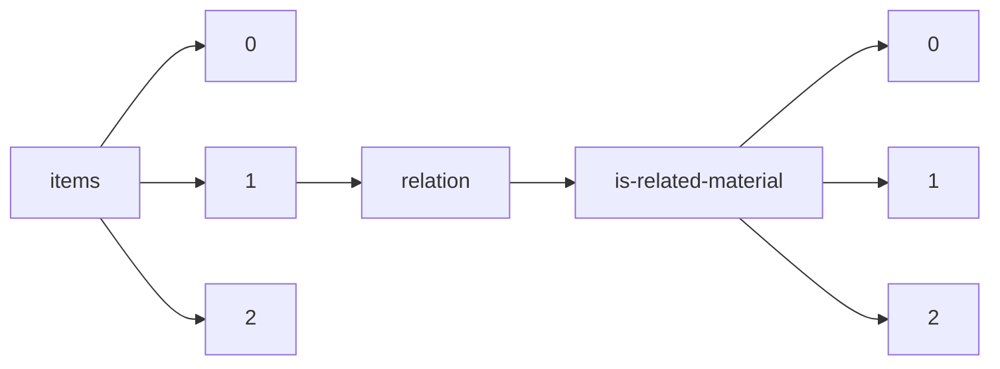

!!! warning "This document is not official Crossref documentation"
# Elements
PATH = items/array/relation/is-related-material/array(1)  
Occurs 4 292 times  
{ .annotate }

1. A route to an element, for example:  
   The route "items/array/relation/is-related-material/array" corresponds to navigating through the JSON indices as  
   ["items"][0]["relation"]["is-related-material"][0]  

## Asserted-by
See more information: [items/array/relation/is-related-material/array/asserted-by](asserted-by/index.md)  
Occurs 4 292 timess  
Unique values: 2  

| **Row** | **Value** `String` | **Count** `Int64` |
|--------:|----------------------:|---------------------:|
| **1**   | subject               | 4 278                |
| **2**   | object                | 14                   |

## Id
See more information: [items/array/relation/is-related-material/array/id](id/index.md)  
Occurs 4 292 timess  
Unique values: > 999  

!!! note "Due to current limitations, only the first 1,000 unique values are counted."

| **Row** | **Value** `String`  | **Count** `Int64` |
|--------:|-----------------------:|---------------------:|
| **1**   |                        | 286                  |
| **2**   | 10.26419/res.00351.000 | 275                  |
| **3**   | 10.26419/res.00524.000 | 158                  |
| **4**   | 10.26419/res.00245.000 | 87                   |
| **5**   | 10.26419/int.00052.001 | 78                   |
| **6**   | 10.26419/res.00514.000 | 73                   |
| **7**   | 10.26419/res.00259.000 | 63                   |
| **8**   | 10.26419/res.00132.000 | 58                   |
| **9**   | 10.26419/res.00172.001 | 55                   |
| **10**  | 10.26419/res.00056.001 | 53                   |
| ... | ... | ... |

## Id-type
See more information: [items/array/relation/is-related-material/array/id-type](id-type/index.md)  
Occurs 4 292 timess  
Unique values: 4  

| **Row** | **Value** `String` | **Count** `Int64` |
|--------:|----------------------:|---------------------:|
| **1**   | doi                   | 3 212                |
| **2**   | uri                   | 794                  |
| **3**   | isbn                  | 285                  |
| **4**   | other                 | 1                    |

