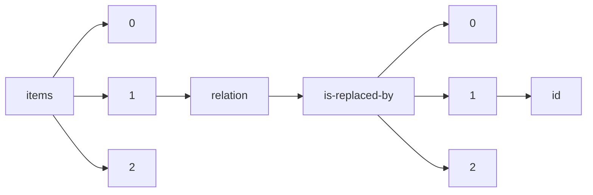

!!! warning "This document is not official Crossref documentation"
# Id
PATH = items/array/relation/is-replaced-by/array/id(1)  
Occurs 1 377 times  
Unique values: > 999  
{ .annotate }

1. A route to an element, for example:  
   The route "items/array/relation/is-replaced-by/array/id" corresponds to navigating through the JSON indices as  
   ["items"][0]["relation"]["is-replaced-by"][0]["id"]  

!!! note "Due to current limitations, only the first 1,000 unique values are counted."

| **Row** | **Value** `String`               | **Count** `Int64` |
|--------:|------------------------------------:|---------------------:|
| **1**   | 10.7287/peerj.preprints.843v2       | 1                    |
| **2**   | 10.7287/peerj.preprints.2882v5      | 1                    |
| **3**   | 10.7287/peerj.preprints.2227v2      | 1                    |
| **4**   | 10.7287/peerj.preprints.3264v2      | 1                    |
| **5**   | 10.7287/peerj.preprints.27834v2     | 1                    |
| **6**   | 10.7287/peerj.preprints.26931v5     | 1                    |
| **7**   | 10.7287/peerj.preprints.2736v3      | 1                    |
| **8**   | 10.7287/peerj.preprints.2238v2      | 1                    |
| **9**   | 10.7287/peerj.preprints.27554v2     | 1                    |
| **10**  | 10.7287/peerj.preprints.2278v4      | 1                    |
| **11**  | 10.7287/peerj.preprints.3462v2      | 1                    |
| **12**  | 10.7287/peerj.preprints.3150v3      | 1                    |
| **13**  | 10.7287/peerj.preprints.1228v2      | 1                    |
| **14**  | 10.7287/peerj.preprints.352v2       | 1                    |
| **15**  | 10.7287/peerj.preprints.1300v2      | 1                    |
| **16**  | 10.7287/peerj.preprints.117v2       | 1                    |
| **17**  | 10.7287/peerj.preprints.1801v2      | 1                    |
| **18**  | 10.7287/peerj.preprints.26449v3     | 1                    |
| **19**  | 10.7287/peerj.preprints.3417v2      | 1                    |
| **20**  | 10.7287/peerj.preprints.28004v3     | 1                    |
| **21**  | 10.7287/peerj.preprints.2044v3      | 1                    |
| **22**  | 10.7287/peerj.preprints.3266v2      | 1                    |
| **23**  | 10.7287/peerj.preprints.292v3       | 1                    |
| **24**  | 10.7287/peerj.preprints.3005v2      | 1                    |
| **25**  | 10.7287/peerj.preprints.26v2        | 1                    |
| **26**  | 10.7287/peerj.preprints.1968v4      | 1                    |
| **27**  | 10.7287/peerj.preprints.967v3       | 1                    |
| **28**  | 10.7287/peerj.preprints.26465v2     | 1                    |
| **29**  | 10.7287/peerj.preprints.1176v2      | 1                    |
| **30**  | 10.7287/peerj.preprints.2857v2      | 1                    |
| **31**  | 10.7287/peerj.preprints.50v4        | 1                    |
| **32**  | 10.7287/peerj.preprints.2278v3      | 1                    |
| **33**  | 10.7287/peerj.preprints.2083v3      | 1                    |
| **34**  | 10.7287/peerj.preprints.3411v3      | 1                    |
| **35**  | 10.7287/peerj.preprints.3255v2      | 1                    |
| **36**  | 10.7287/peerj.preprints.27246v2     | 1                    |
| **37**  | 10.7287/peerj.preprints.3128v2      | 1                    |
| **38**  | 10.7287/peerj.preprints.110v7       | 1                    |
| **39**  | 10.7287/peerj.preprints.2882v3      | 1                    |
| **40**  | 10.7287/peerj.preprints.27275v2     | 1                    |
| **41**  | 10.7287/peerj.preprints.955v3       | 1                    |
| **42**  | 10.7287/peerj.preprints.382v2       | 1                    |
| **43**  | 10.7287/peerj.preprints.1462v2      | 1                    |
| **44**  | 10.7287/peerj.preprints.3103v2      | 1                    |
| **45**  | 10.7287/peerj.preprints.3094v2      | 1                    |
| **46**  | 10.7287/peerj.preprints.7v2         | 1                    |
| **47**  | 10.7287/peerj.preprints.43v2        | 1                    |
| **48**  | 10.7287/peerj.preprints.27378v2     | 1                    |
| **49**  | 10.7287/peerj.preprints.1326v2      | 1                    |
| **50**  | 10.7287/peerj.preprints.1307v2      | 1                    |
| **51**  | 10.7287/peerj.preprints.27441v2     | 1                    |
| **52**  | 10.7287/peerj.preprints.1388v2      | 1                    |
| **53**  | 10.7287/peerj.preprints.2452v2      | 1                    |
| **54**  | 10.7287/peerj.preprints.777v2       | 1                    |
| **55**  | 10.7287/peerj.preprints.2134v2      | 1                    |
| **56**  | 10.7287/peerj.preprints.1049v2      | 1                    |
| **57**  | 10.7287/peerj.preprints.1950v3      | 1                    |
| **58**  | 10.7287/peerj.preprints.3427v2      | 1                    |
| **59**  | 10.7287/peerj.preprints.26889v3     | 1                    |
| **60**  | 10.7287/peerj.preprints.27429v2     | 1                    |
| **61**  | 10.7287/peerj.preprints.27682v2     | 1                    |
| **62**  | 10.7287/peerj.preprints.1475v3      | 1                    |
| **63**  | 10.7287/peerj.preprints.516v2       | 1                    |
| **64**  | 10.7287/peerj.preprints.27556v2     | 1                    |
| **65**  | 10.7287/peerj.preprints.26786v2     | 1                    |
| **66**  | 10.7287/peerj.preprints.27587v3     | 1                    |
| **67**  | 10.7287/peerj.preprints.2127v2      | 1                    |
| **68**  | 10.7287/peerj.preprints.1319v2      | 1                    |
| **69**  | 10.7287/peerj.preprints.1369v3      | 1                    |
| **70**  | 10.7287/peerj.preprints.2419v2      | 1                    |
| **71**  | 10.7287/peerj.preprints.2051v2      | 1                    |
| **72**  | 10.7287/peerj.preprints.26679v2     | 1                    |
| **73**  | 10.7287/peerj.preprints.2102v3      | 1                    |
| **74**  | 10.7287/peerj.preprints.1450v4      | 1                    |
| **75**  | 10.7287/peerj.preprints.1595v3      | 1                    |
| **76**  | 10.7287/peerj.preprints.1770v2      | 1                    |
| **77**  | 10.7287/peerj.preprints.1406v2      | 1                    |
| **78**  | 10.7287/peerj.preprints.2429v2      | 1                    |
| **79**  | 10.7287/peerj.preprints.27228v2     | 1                    |
| **80**  | 10.7287/peerj.preprints.1998v2      | 1                    |
| **81**  | 10.7287/peerj.preprints.91v5        | 1                    |
| **82**  | 10.7287/peerj.preprints.769v2       | 1                    |
| **83**  | 10.7287/peerj.preprints.2320v6      | 1                    |
| **84**  | 10.7287/peerj.preprints.2291v2      | 1                    |
| **85**  | 10.7287/peerj.preprints.1025v2      | 1                    |
| **86**  | 10.7287/peerj.preprints.27300v3     | 1                    |
| **87**  | 10.7287/peerj.preprints.3067v2      | 1                    |
| **88**  | 10.7287/peerj.preprints.1733v2      | 1                    |
| **89**  | 10.7287/peerj.preprints.2727v3      | 1                    |
| **90**  | 10.7287/peerj.preprints.2225v3      | 1                    |
| **91**  | 10.7287/peerj.preprints.349v4       | 1                    |
| **92**  | 10.7287/peerj.preprints.651v2       | 1                    |
| **93**  | 10.7287/peerj.preprints.1741v2      | 1                    |
| **94**  | 10.7287/peerj.preprints.60v3        | 1                    |
| **95**  | 10.7287/peerj.preprints.2818v2      | 1                    |
| **96**  | 10.7287/peerj.preprints.27295v2     | 1                    |
| **97**  | 10.7287/peerj.preprints.2530v2      | 1                    |
| **98**  | 10.7287/peerj.preprints.1471v3      | 1                    |
| **99**  | 10.7287/peerj.preprints.58v2        | 1                    |
| **100** | 10.7287/peerj.preprints.3010v2      | 1                    |
| **101** | 10.7287/peerj.preprints.2789v2      | 1                    |
| **102** | 10.7287/peerj.preprints.326v2       | 1                    |
| **103** | 10.7287/peerj.preprints.1400v3      | 1                    |
| **104** | 10.7287/peerj.preprints.165v2       | 1                    |
| **105** | 10.7287/peerj.preprints.2203v2      | 1                    |
| **106** | 10.7287/peerj.preprints.3523v2      | 1                    |
| **107** | 10.7287/peerj.preprints.359v3       | 1                    |
| **108** | 10.7287/peerj.preprints.3491v2      | 1                    |
| **109** | 10.7287/peerj.preprints.156v2       | 1                    |
| **110** | 10.7287/peerj.preprints.27v3        | 1                    |
| **111** | 10.7287/peerj.preprints.27739v2     | 1                    |
| **112** | 10.7287/peerj.preprints.157v3       | 1                    |
| **113** | 10.7287/peerj.preprints.27096v2     | 1                    |
| **114** | 10.7287/peerj.preprints.885v2       | 1                    |
| **115** | 10.7287/peerj.preprints.26754v2     | 1                    |
| **116** | 10.7287/peerj.preprints.3400v4      | 1                    |
| **117** | 10.7287/peerj.preprints.2139v2      | 1                    |
| **118** | 10.7287/peerj.preprints.27535v2     | 1                    |
| **119** | 10.7287/peerj.preprints.2161v2      | 1                    |
| **120** | 10.7287/peerj.preprints.745v3       | 1                    |
| **121** | 10.7287/peerj.preprints.2880v2      | 1                    |
| **122** | 10.7287/peerj.preprints.2737v2      | 1                    |
| **123** | 10.7287/peerj.preprints.387v2       | 1                    |
| **124** | 10.7287/peerj.preprints.447v2       | 1                    |
| **125** | 10.7287/peerj.preprints.28002v3     | 1                    |
| **126** | 10.7287/peerj.preprints.3113v2      | 1                    |
| **127** | 10.7287/peerj.preprints.1674v2      | 1                    |
| **128** | 10.7287/peerj.preprints.1498v2      | 1                    |
| **129** | 10.7287/peerj.preprints.1818v3      | 1                    |
| **130** | 10.7287/peerj.preprints.26693v3     | 1                    |
| **131** | 10.7287/peerj.preprints.2561v3      | 1                    |
| **132** | 10.7287/peerj.preprints.26620v2     | 1                    |
| **133** | 10.7287/peerj.preprints.27352v2     | 1                    |
| **134** | 10.7287/peerj.preprints.3417v3      | 1                    |
| **135** | 10.7287/peerj.preprints.27651v9     | 1                    |
| **136** | 10.7287/peerj.preprints.432v2       | 1                    |
| **137** | 10.7287/peerj.preprints.3153v2      | 1                    |
| **138** | 10.7287/peerj.preprints.240v2       | 1                    |
| **139** | 10.7287/peerj.preprints.704v2       | 1                    |
| **140** | 10.7287/peerj.preprints.27460v2     | 1                    |
| **141** | 10.7287/peerj.preprints.91v2        | 1                    |
| **142** | 10.7287/peerj.preprints.2496v2      | 1                    |
| **143** | 10.7287/peerj.preprints.469v2       | 1                    |
| **144** | 10.7287/peerj.preprints.27353v2     | 1                    |
| **145** | 10.7287/peerj.preprints.57v3        | 1                    |
| **146** | 10.7287/peerj.preprints.26766v2     | 1                    |
| **147** | 10.7287/peerj.preprints.27876v2     | 1                    |
| **148** | 10.7287/peerj.preprints.1189v2      | 1                    |
| **149** | 10.7287/peerj.preprints.27858v2     | 1                    |
| **150** | 10.7287/peerj.preprints.777v3       | 1                    |
| **151** | 10.7287/peerj.preprints.26963v2     | 1                    |
| **152** | 10.7287/peerj.preprints.2706v2      | 1                    |
| **153** | 10.7287/peerj.preprints.27118v2     | 1                    |
| **154** | 10.7287/peerj.preprints.2155v2      | 1                    |
| **155** | 10.7287/peerj.preprints.27441v3     | 1                    |
| **156** | 10.7287/peerj.preprints.2554v2      | 1                    |
| **157** | 10.7287/peerj.preprints.115v3       | 1                    |
| **158** | 10.7287/peerj.preprints.2152v2      | 1                    |
| **159** | 10.7287/peerj.preprints.29v2        | 1                    |
| **160** | 10.7287/peerj.preprints.1312v7      | 1                    |
| **161** | 10.7287/peerj.preprints.26502v2     | 1                    |
| **162** | 10.7287/peerj.preprints.464v2       | 1                    |
| **163** | 10.7287/peerj.preprints.354v2       | 1                    |
| **164** | 10.7287/peerj.preprints.1820v2      | 1                    |
| **165** | 10.7287/peerj.preprints.2652v3      | 1                    |
| **166** | 10.7287/peerj.preprints.703v2       | 1                    |
| **167** | 10.7287/peerj.preprints.26857v3     | 1                    |
| **168** | 10.7287/peerj.preprints.26488v2     | 1                    |
| **169** | 10.7287/peerj.preprints.463v3       | 1                    |
| **170** | 10.7287/peerj.preprints.27821v4     | 1                    |
| **171** | 10.7287/peerj.preprints.67v2        | 1                    |
| **172** | 10.7287/peerj.preprints.3524v2      | 1                    |
| **173** | 10.7287/peerj.preprints.2813v2      | 1                    |
| **174** | 10.7287/peerj.preprints.2007v2      | 1                    |
| **175** | 10.7287/peerj.preprints.1469v2      | 1                    |
| **176** | 10.7287/peerj.preprints.2840v4      | 1                    |
| **177** | 10.7287/peerj.preprints.2513v2      | 1                    |
| **178** | 10.7287/peerj.preprints.193v3       | 1                    |
| **179** | 10.7287/peerj.preprints.27038v2     | 1                    |
| **180** | 10.7287/peerj.preprints.26496v2     | 1                    |
| **181** | 10.7287/peerj.preprints.1472v2      | 1                    |
| **182** | 10.7287/peerj.preprints.3110v2      | 1                    |
| **183** | 10.7287/peerj.preprints.2917v2      | 1                    |
| **184** | 10.7287/peerj.preprints.2817v2      | 1                    |
| **185** | 10.7287/peerj.preprints.553v2       | 1                    |
| **186** | 10.7287/peerj.preprints.138v3       | 1                    |
| **187** | 10.7287/peerj.preprints.27v2        | 1                    |
| **188** | 10.7287/peerj.preprints.2614v2      | 1                    |
| **189** | 10.7287/peerj.preprints.126v2       | 1                    |
| **190** | 10.7287/peerj.preprints.977v3       | 1                    |
| **191** | 10.7287/peerj.preprints.27509v2     | 1                    |
| **192** | 10.7287/peerj.preprints.818v4       | 1                    |
| **193** | 10.7287/peerj.preprints.27321v2     | 1                    |
| **194** | 10.7287/peerj.preprints.1711v2      | 1                    |
| **195** | 10.7287/peerj.preprints.2345v3      | 1                    |
| **196** | 10.7287/peerj.preprints.3021v2      | 1                    |
| **197** | 10.7287/peerj.preprints.596v3       | 1                    |
| **198** | 10.7287/peerj.preprints.1103v3      | 1                    |
| **199** | 10.7287/peerj.preprints.110v4       | 1                    |
| **200** | 10.7287/peerj.preprints.26577v3     | 1                    |
| **201** | 10.7287/peerj.preprints.297v2       | 1                    |
| **202** | 10.7287/peerj.preprints.2069v2      | 1                    |
| **203** | 10.7287/peerj.preprints.26862v9     | 1                    |
| **204** | 10.7287/peerj.preprints.20v2        | 1                    |
| **205** | 10.7287/peerj.preprints.27878v2     | 1                    |
| **206** | 10.7287/peerj.preprints.3266v3      | 1                    |
| **207** | 10.7287/peerj.preprints.453v2       | 1                    |
| **208** | 10.7287/peerj.preprints.2086v3      | 1                    |
| **209** | 10.7287/peerj.preprints.3206v2      | 1                    |
| **210** | 10.7287/peerj.preprints.934v2       | 1                    |
| **211** | 10.7287/peerj.preprints.655v3       | 1                    |
| **212** | 10.7287/peerj.preprints.1619v2      | 1                    |
| **213** | 10.7287/peerj.preprints.1279v3      | 1                    |
| **214** | 10.7287/peerj.preprints.27354v3     | 1                    |
| **215** | 10.7287/peerj.preprints.3135v2      | 1                    |
| **216** | 10.7287/peerj.preprints.2727v2      | 1                    |
| **217** | 10.7287/peerj.preprints.26577v4     | 1                    |
| **218** | 10.7287/peerj.preprints.1877v2      | 1                    |
| **219** | 10.7287/peerj.preprints.1524v2      | 1                    |
| **220** | 10.7287/peerj.preprints.27658v2     | 1                    |
| **221** | 10.7287/peerj.preprints.1050v2      | 1                    |
| **222** | 10.7287/peerj.preprints.1163v2      | 1                    |
| **223** | 10.7287/peerj.preprints.27519v3     | 1                    |
| **224** | 10.7287/peerj.preprints.186v2       | 1                    |
| **225** | 10.7287/peerj.preprints.2237v3      | 1                    |
| **226** | 10.7287/peerj.preprints.2086v2      | 1                    |
| **227** | 10.7287/peerj.preprints.181v2       | 1                    |
| **228** | 10.53455/re.v2i.6                   | 1                    |
| **229** | 10.7287/peerj.preprints.254v2       | 1                    |
| **230** | 10.7287/peerj.preprints.3217v3      | 1                    |
| **231** | 10.7287/peerj.preprints.2594v2      | 1                    |
| **232** | 10.7287/peerj.preprints.808v2       | 1                    |
| **233** | 10.7287/peerj.preprints.2711v2      | 1                    |
| **234** | 10.7287/peerj.preprints.116v2       | 1                    |
| **235** | 10.7287/peerj.preprints.1308v2      | 1                    |
| **236** | 10.7287/peerj.preprints.1479v3      | 1                    |
| **237** | 10.7287/peerj.preprints.2932v2      | 1                    |
| **238** | 10.7287/peerj.preprints.854v2       | 1                    |
| **239** | 10.7287/peerj.preprints.3139v4      | 1                    |
| **240** | 10.7287/peerj.preprints.26454v3     | 1                    |
| **241** | 10.7287/peerj.preprints.2231v2      | 1                    |
| **242** | 10.7287/peerj.preprints.2712v2      | 1                    |
| **243** | 10.7287/peerj.preprints.1989v2      | 1                    |
| **244** | 10.7287/peerj.preprints.437v2       | 1                    |
| **245** | 10.7287/peerj.preprints.27591v4     | 1                    |
| **246** | 10.7287/peerj.preprints.3488v2      | 1                    |
| **247** | 10.7287/peerj.preprints.27811v3     | 1                    |
| **248** | 10.7287/peerj.preprints.2237v4      | 1                    |
| **249** | 10.7287/peerj.preprints.81v2        | 1                    |
| **250** | 10.7287/peerj.preprints.3496v2      | 1                    |
| **251** | 10.7287/peerj.preprints.2236v3      | 1                    |
| **252** | 10.7287/peerj.preprints.1876v2      | 1                    |
| **253** | 10.7287/peerj.preprints.1319v3      | 1                    |
| **254** | 10.7287/peerj.preprints.146v3       | 1                    |
| **255** | 10.7287/peerj.preprints.2662v2      | 1                    |
| **256** | 10.7287/peerj.preprints.649v2       | 1                    |
| **257** | 10.7287/peerj.preprints.175v2       | 1                    |
| **258** | 10.7287/peerj.preprints.2648v2      | 1                    |
| **259** | 10.7287/peerj.preprints.2098v2      | 1                    |
| **260** | 10.7287/peerj.preprints.290v2       | 1                    |
| **261** | 10.7287/peerj.preprints.113v2       | 1                    |
| **262** | 10.7287/peerj.preprints.2320v5      | 1                    |
| **263** | 10.7287/peerj.preprints.452v2       | 1                    |
| **264** | 10.7287/peerj.preprints.2827v3      | 1                    |
| **265** | 10.7287/peerj.preprints.27213v2     | 1                    |
| **266** | 10.7287/peerj.preprints.259v2       | 1                    |
| **267** | 10.7287/peerj.preprints.224v3       | 1                    |
| **268** | 10.7287/peerj.preprints.27249v3     | 1                    |
| **269** | 10.7287/peerj.preprints.3442v2      | 1                    |
| **270** | 10.7287/peerj.preprints.1558v2      | 1                    |
| **271** | 10.7287/peerj.preprints.1891v2      | 1                    |
| **272** | 10.7287/peerj.preprints.27244v3     | 1                    |
| **273** | 10.7287/peerj.preprints.91v3        | 1                    |
| **274** | 10.7287/peerj.preprints.3451v2      | 1                    |
| **275** | 10.7287/peerj.preprints.952v3       | 1                    |
| **276** | 10.7287/peerj.preprints.1587v2      | 1                    |
| **277** | 10.7287/peerj.preprints.3447v2      | 1                    |
| **278** | 10.7287/peerj.preprints.26454v4     | 1                    |
| **279** | 10.7287/peerj.preprints.1450v3      | 1                    |
| **280** | 10.7287/peerj.preprints.554v2       | 1                    |
| **281** | 10.7287/peerj.preprints.27944v3     | 1                    |
| **282** | 10.7287/peerj.preprints.2908v3      | 1                    |
| **283** | 10.7287/peerj.preprints.1312v4      | 1                    |
| **284** | 10.7287/peerj.preprints.1111v2      | 1                    |
| **285** | 10.7287/peerj.preprints.2102v2      | 1                    |
| **286** | 10.7287/peerj.preprints.3311v2      | 1                    |
| **287** | 10.7287/peerj.preprints.185v3       | 1                    |
| **288** | 10.7287/peerj.preprints.1744v2      | 1                    |
| **289** | 10.7287/peerj.preprints.3400v3      | 1                    |
| **290** | 10.7287/peerj.preprints.1236v2      | 1                    |
| **291** | 10.7287/peerj.preprints.3370v2      | 1                    |
| **292** | 10.7287/peerj.preprints.1718v3      | 1                    |
| **293** | 10.7287/peerj.preprints.1594v3      | 1                    |
| **294** | 10.7287/peerj.preprints.1412v2      | 1                    |
| **295** | 10.7287/peerj.preprints.1407v3      | 1                    |
| **296** | 10.7287/peerj.preprints.2870v2      | 1                    |
| **297** | 10.7287/peerj.preprints.1369v2      | 1                    |
| **298** | 10.7287/peerj.preprints.925v2       | 1                    |
| **299** | 10.7287/peerj.preprints.349v5       | 1                    |
| **300** | 10.7287/peerj.preprints.27283v2     | 1                    |
| **301** | 10.7287/peerj.preprints.1950v2      | 1                    |
| **302** | 10.7287/peerj.preprints.1640v3      | 1                    |
| **303** | 10.7287/peerj.preprints.704v5       | 1                    |
| **304** | 10.7287/peerj.preprints.2785v2      | 1                    |
| **305** | 10.7287/peerj.preprints.2564v2      | 1                    |
| **306** | 10.7287/peerj.preprints.1360v2      | 1                    |
| **307** | 10.7287/peerj.preprints.888v2       | 1                    |
| **308** | 10.7287/peerj.preprints.2258v3      | 1                    |
| **309** | 10.7287/peerj.preprints.1406v5      | 1                    |
| **310** | 10.7287/peerj.preprints.3400v2      | 1                    |
| **311** | 10.7287/peerj.preprints.318v2       | 1                    |
| **312** | 10.7287/peerj.preprints.1246v2      | 1                    |
| **313** | 10.7287/peerj.preprints.2454v2      | 1                    |
| **314** | 10.7287/peerj.preprints.2464v2      | 1                    |
| **315** | 10.7287/peerj.preprints.27717v4     | 1                    |
| **316** | 10.7287/peerj.preprints.1568v6      | 1                    |
| **317** | 10.7287/peerj.preprints.1558v4      | 1                    |
| **318** | 10.7287/peerj.preprints.2047v2      | 1                    |
| **319** | 10.7287/peerj.preprints.2827v2      | 1                    |
| **320** | 10.7287/peerj.preprints.2147v2      | 1                    |
| **321** | 10.7287/peerj.preprints.27621v2     | 1                    |
| **322** | 10.7287/peerj.preprints.3163v2      | 1                    |
| **323** | 10.7287/peerj.preprints.941v2       | 1                    |
| **324** | 10.7287/peerj.preprints.2330v2      | 1                    |
| **325** | 10.7287/peerj.preprints.2415v4      | 1                    |
| **326** | 10.7287/peerj.preprints.587v2       | 1                    |
| **327** | 10.7287/peerj.preprints.626v2       | 1                    |
| **328** | 10.7287/peerj.preprints.1276v2      | 1                    |
| **329** | 10.7287/peerj.preprints.26672v2     | 1                    |
| **330** | 10.7287/peerj.preprints.110v5       | 1                    |
| **331** | 10.7287/peerj.preprints.2694v2      | 1                    |
| **332** | 10.7287/peerj.preprints.537v3       | 1                    |
| **333** | 10.7287/peerj.preprints.3090v2      | 1                    |
| **334** | 10.7287/peerj.preprints.447v3       | 1                    |
| **335** | 10.7287/peerj.preprints.89v2        | 1                    |
| **336** | 10.7287/peerj.preprints.2611v2      | 1                    |
| **337** | 10.7287/peerj.preprints.27406v2     | 1                    |
| **338** | 10.7287/peerj.preprints.2563v3      | 1                    |
| **339** | 10.7287/peerj.preprints.27644v2     | 1                    |
| **340** | 10.7287/peerj.preprints.1968v3      | 1                    |
| **341** | 10.7287/peerj.preprints.2244v2      | 1                    |
| **342** | 10.7287/peerj.preprints.27706v2     | 1                    |
| **343** | 10.7287/peerj.preprints.818v3       | 1                    |
| **344** | 10.7287/peerj.preprints.181v3       | 1                    |
| **345** | 10.7287/peerj.preprints.89v6        | 1                    |
| **346** | 10.7287/peerj.preprints.906v2       | 1                    |
| **347** | 10.7287/peerj.preprints.127v3       | 1                    |
| **348** | 10.7287/peerj.preprints.27164v3     | 1                    |
| **349** | 10.7287/peerj.preprints.27962v2     | 1                    |
| **350** | 10.7287/peerj.preprints.2320v3      | 1                    |
| **351** | 10.7287/peerj.preprints.1137v3      | 1                    |
| **352** | 10.7287/peerj.preprints.27022v2     | 1                    |
| **353** | 10.7287/peerj.preprints.904v2       | 1                    |
| **354** | 10.7287/peerj.preprints.2354v2      | 1                    |
| **355** | 10.7287/peerj.preprints.1049v5      | 1                    |
| **356** | 10.7287/peerj.preprints.2682v2      | 1                    |
| **357** | 10.7287/peerj.preprints.240v3       | 1                    |
| **358** | 10.7287/peerj.preprints.1166v2      | 1                    |
| **359** | 10.7287/peerj.preprints.27029v2     | 1                    |
| **360** | 10.7287/peerj.preprints.1450v2      | 1                    |
| **361** | 10.7287/peerj.preprints.336v2       | 1                    |
| **362** | 10.7287/peerj.preprints.27938v2     | 1                    |
| **363** | 10.7287/peerj.preprints.3158v2      | 1                    |
| **364** | 10.7287/peerj.preprints.27775v2     | 1                    |
| **365** | 10.7287/peerj.preprints.2487v4      | 1                    |
| **366** | 10.7287/peerj.preprints.2376v2      | 1                    |
| **367** | 10.7287/peerj.preprints.1138v2      | 1                    |
| **368** | 10.7287/peerj.preprints.2169v4      | 1                    |
| **369** | 10.7287/peerj.preprints.2223v2      | 1                    |
| **370** | 10.7287/peerj.preprints.2308v2      | 1                    |
| **371** | 10.7287/peerj.preprints.27285v2     | 1                    |
| **372** | 10.7287/peerj.preprints.1407v2      | 1                    |
| **373** | 10.7287/peerj.preprints.2779v2      | 1                    |
| **374** | 10.7287/peerj.preprints.27922v2     | 1                    |
| **375** | 10.7287/peerj.preprints.26721v2     | 1                    |
| **376** | 10.7287/peerj.preprints.2336v2      | 1                    |
| **377** | 10.7287/peerj.preprints.26889v2     | 1                    |
| **378** | 10.7287/peerj.preprints.3208v2      | 1                    |
| **379** | 10.7287/peerj.preprints.765v3       | 1                    |
| **380** | 10.7287/peerj.preprints.26941v2     | 1                    |
| **381** | 10.7287/peerj.preprints.3269v4      | 1                    |
| **382** | 10.7287/peerj.preprints.1406v6      | 1                    |
| **383** | 10.7287/peerj.preprints.26559v2     | 1                    |
| **384** | 10.7287/peerj.preprints.1541v2      | 1                    |
| **385** | 10.7287/peerj.preprints.117v3       | 1                    |
| **386** | 10.7287/peerj.preprints.1839v2      | 1                    |
| **387** | 10.7287/peerj.preprints.1135v2      | 1                    |
| **388** | 10.7287/peerj.preprints.53v2        | 1                    |
| **389** | 10.7287/peerj.preprints.2081v3      | 1                    |
| **390** | 10.7287/peerj.preprints.303v2       | 1                    |
| **391** | 10.7287/peerj.preprints.3054v2      | 1                    |
| **392** | 10.7287/peerj.preprints.1983v2      | 1                    |
| **393** | 10.7287/peerj.preprints.26661v3     | 1                    |
| **394** | 10.7287/peerj.preprints.580v2       | 1                    |
| **395** | 10.7287/peerj.preprints.26661v2     | 1                    |
| **396** | 10.7287/peerj.preprints.1920v2      | 1                    |
| **397** | 10.7287/peerj.preprints.27249v2     | 1                    |
| **398** | 10.7287/peerj.preprints.2877v2      | 1                    |
| **399** | 10.7287/peerj.preprints.1165v3      | 1                    |
| **400** | 10.7287/peerj.preprints.957v2       | 1                    |
| **401** | 10.7287/peerj.preprints.26880v2     | 1                    |
| **402** | 10.7287/peerj.preprints.126v3       | 1                    |
| **403** | 10.7287/peerj.preprints.358v2       | 1                    |
| **404** | 10.7287/peerj.preprints.27039v2     | 1                    |
| **405** | 10.7287/peerj.preprints.26862v2     | 1                    |
| **406** | 10.7287/peerj.preprints.2806v2      | 1                    |
| **407** | 10.7287/peerj.preprints.511v2       | 1                    |
| **408** | 10.7287/peerj.preprints.2447v2      | 1                    |
| **409** | 10.7287/peerj.preprints.1260v2      | 1                    |
| **410** | 10.7287/peerj.preprints.1084v2      | 1                    |
| **411** | 10.7287/peerj.preprints.2165v2      | 1                    |
| **412** | 10.7287/peerj.preprints.2434v2      | 1                    |
| **413** | 10.7287/peerj.preprints.27998v2     | 1                    |
| **414** | 10.7287/peerj.preprints.1219v2      | 1                    |
| **415** | 10.7287/peerj.preprints.1068v2      | 1                    |
| **416** | 10.7287/peerj.preprints.399v2       | 1                    |
| **417** | 10.7287/peerj.preprints.413v2       | 1                    |
| **418** | 10.7287/peerj.preprints.2169v3      | 1                    |
| **419** | 10.7287/peerj.preprints.2274v2      | 1                    |
| **420** | 10.7287/peerj.preprints.266v2       | 1                    |
| **421** | 10.7287/peerj.preprints.27885v2     | 1                    |
| **422** | 10.7287/peerj.preprints.26907v2     | 1                    |
| **423** | 10.7287/peerj.preprints.2631v2      | 1                    |
| **424** | 10.7287/peerj.preprints.3451v4      | 1                    |
| **425** | 10.7287/peerj.preprints.1642v2      | 1                    |
| **426** | 10.7287/peerj.preprints.3167v3      | 1                    |
| **427** | 10.7287/peerj.preprints.443v3       | 1                    |
| **428** | 10.7287/peerj.preprints.2614v3      | 1                    |
| **429** | 10.7287/peerj.preprints.27164v2     | 1                    |
| **430** | 10.7287/peerj.preprints.26847v2     | 1                    |
| **431** | 10.7287/peerj.preprints.27244v4     | 1                    |
| **432** | 10.7287/peerj.preprints.542v2       | 1                    |
| **433** | 10.7287/peerj.preprints.26811v2     | 1                    |
| **434** | 10.7287/peerj.preprints.27271v2     | 1                    |
| **435** | 10.7287/peerj.preprints.1350v2      | 1                    |
| **436** | 10.7287/peerj.preprints.110v6       | 1                    |
| **437** | 10.7287/peerj.preprints.27801v2     | 1                    |
| **438** | 10.7287/peerj.preprints.26630v2     | 1                    |
| **439** | 10.7287/peerj.preprints.3034v2      | 1                    |
| **440** | 10.7287/peerj.preprints.27684v2     | 1                    |
| **441** | 10.7287/peerj.preprints.26507v6     | 1                    |
| **442** | 10.7287/peerj.preprints.26712v4     | 1                    |
| **443** | 10.7287/peerj.preprints.2663v2      | 1                    |
| **444** | 10.7287/peerj.preprints.26890v2     | 1                    |
| **445** | 10.7287/peerj.preprints.1565v2      | 1                    |
| **446** | 10.7287/peerj.preprints.1049v4      | 1                    |
| **447** | 10.7287/peerj.preprints.2196v3      | 1                    |
| **448** | 10.7287/peerj.preprints.13v2        | 1                    |
| **449** | 10.7287/peerj.preprints.569v3       | 1                    |
| **450** | 10.7287/peerj.preprints.1548v2      | 1                    |
| **451** | 10.7287/peerj.preprints.27519v2     | 1                    |
| **452** | 10.7287/peerj.preprints.850v3       | 1                    |
| **453** | 10.7287/peerj.preprints.27651v7     | 1                    |
| **454** | 10.7287/peerj.preprints.1034v2      | 1                    |
| **455** | 10.7287/peerj.preprints.811v2       | 1                    |
| **456** | 10.7287/peerj.preprints.27829v2     | 1                    |
| **457** | 10.7287/peerj.preprints.27860v2     | 1                    |
| **458** | 10.7287/peerj.preprints.1312v3      | 1                    |
| **459** | 10.7287/peerj.preprints.2463v3      | 1                    |
| **460** | 10.7287/peerj.preprints.27811v2     | 1                    |
| **461** | 10.7287/peerj.preprints.872v3       | 1                    |
| **462** | 10.7287/peerj.preprints.537v2       | 1                    |
| **463** | 10.7287/peerj.preprints.27651v8     | 1                    |
| **464** | 10.7287/peerj.preprints.2112v2      | 1                    |
| **465** | 10.7287/peerj.preprints.1982v2      | 1                    |
| **466** | 10.7287/peerj.preprints.27130v3     | 1                    |
| **467** | 10.7287/peerj.preprints.136v2       | 1                    |
| **468** | 10.7287/peerj.preprints.3191v3      | 1                    |
| **469** | 10.7287/peerj.preprints.1721v3      | 1                    |
| **470** | 10.7287/peerj.preprints.2643v2      | 1                    |
| **471** | 10.7287/peerj.preprints.144v3       | 1                    |
| **472** | 10.7287/peerj.preprints.34v2        | 1                    |
| **473** | 10.7287/peerj.preprints.1322v2      | 1                    |
| **474** | 10.7287/peerj.preprints.540v2       | 1                    |
| **475** | 10.7287/peerj.preprints.2258v2      | 1                    |
| **476** | 10.7287/peerj.preprints.429v2       | 1                    |
| **477** | 10.7287/peerj.preprints.2169v2      | 1                    |
| **478** | 10.7287/peerj.preprints.687v2       | 1                    |
| **479** | 10.7287/peerj.preprints.80v2        | 1                    |
| **480** | 10.7287/peerj.preprints.2840v3      | 1                    |
| **481** | 10.7287/peerj.preprints.124v2       | 1                    |
| **482** | 10.7287/peerj.preprints.3150v2      | 1                    |
| **483** | 10.7287/peerj.preprints.3482v3      | 1                    |
| **484** | 10.7287/peerj.preprints.38v2        | 1                    |
| **485** | 10.7287/peerj.preprints.27383v2     | 1                    |
| **486** | 10.7287/peerj.preprints.27638v2     | 1                    |
| **487** | 10.7287/peerj.preprints.27497v2     | 1                    |
| **488** | 10.7287/peerj.preprints.2962v2      | 1                    |
| **489** | 10.7287/peerj.preprints.1400v2      | 1                    |
| **490** | 10.7287/peerj.preprints.57v4        | 1                    |
| **491** | 10.7287/peerj.preprints.72v2        | 1                    |
| **492** | 10.7287/peerj.preprints.27200v2     | 1                    |
| **493** | 10.7287/peerj.preprints.27856v2     | 1                    |
| **494** | 10.7287/peerj.preprints.2921v2      | 1                    |
| **495** | 10.7287/peerj.preprints.472v2       | 1                    |
| **496** | 10.7287/peerj.preprints.27507v2     | 1                    |
| **497** | 10.7287/peerj.preprints.352v3       | 1                    |
| **498** | 10.7287/peerj.preprints.963v2       | 1                    |
| **499** | 10.7287/peerj.preprints.1568v12     | 1                    |
| **500** | 10.7287/peerj.preprints.2690v3      | 1                    |
| **501** | 10.7287/peerj.preprints.2746v2      | 1                    |
| **502** | 10.7287/peerj.preprints.2744v2      | 1                    |
| **503** | 10.7287/peerj.preprints.2522v2      | 1                    |
| **504** | 10.7287/peerj.preprints.1266v3      | 1                    |
| **505** | 10.7287/peerj.preprints.27629v2     | 1                    |
| **506** | 10.7287/peerj.preprints.193v2       | 1                    |
| **507** | 10.7287/peerj.preprints.834v2       | 1                    |
| **508** | 10.7287/peerj.preprints.821v2       | 1                    |
| **509** | 10.7287/peerj.preprints.3186v2      | 1                    |
| **510** | 10.7287/peerj.preprints.26438v2     | 1                    |
| **511** | 10.7287/peerj.preprints.977v2       | 1                    |
| **512** | 10.7287/peerj.preprints.27849v2     | 1                    |
| **513** | 10.7287/peerj.preprints.3340v2      | 1                    |
| **514** | 10.7287/peerj.preprints.26473v2     | 1                    |
| **515** | 10.7287/peerj.preprints.26931v2     | 1                    |
| **516** | 10.7287/peerj.preprints.181v6       | 1                    |
| **517** | 10.7287/peerj.preprints.27090v2     | 1                    |
| **518** | 10.7287/peerj.preprints.26577v2     | 1                    |
| **519** | 10.7287/peerj.preprints.27214v2     | 1                    |
| **520** | 10.7287/peerj.preprints.1299v2      | 1                    |
| **521** | 10.7287/peerj.preprints.872v2       | 1                    |
| **522** | 10.7287/peerj.preprints.814v3       | 1                    |
| **523** | 10.7287/peerj.preprints.432v3       | 1                    |
| **524** | 10.7287/peerj.preprints.2086v4      | 1                    |
| **525** | 10.7287/peerj.preprints.27096v3     | 1                    |
| **526** | 10.7287/peerj.preprints.756v5       | 1                    |
| **527** | 10.7287/peerj.preprints.27228v5     | 1                    |
| **528** | 10.7287/peerj.preprints.400v2       | 1                    |
| **529** | 10.7287/peerj.preprints.2077v2      | 1                    |
| **530** | 10.7287/peerj.preprints.26969v2     | 1                    |
| **531** | 10.7287/peerj.preprints.27460v3     | 1                    |
| **532** | 10.7287/peerj.preprints.1582v2      | 1                    |
| **533** | 10.7287/peerj.preprints.1916v2      | 1                    |
| **534** | 10.7287/peerj.preprints.207v2       | 1                    |
| **535** | 10.7287/peerj.preprints.222v2       | 1                    |
| **536** | 10.7287/peerj.preprints.2380v2      | 1                    |
| **537** | 10.7287/peerj.preprints.26667v2     | 1                    |
| **538** | 10.7287/peerj.preprints.2773v2      | 1                    |
| **539** | 10.7287/peerj.preprints.335v2       | 1                    |
| **540** | 10.7287/peerj.preprints.2772v2      | 1                    |
| **541** | 10.7287/peerj.preprints.632v3       | 1                    |
| **542** | 10.7287/peerj.preprints.3269v2      | 1                    |
| **543** | 10.7287/peerj.preprints.27681v2     | 1                    |
| **544** | 10.7287/peerj.preprints.27685v3     | 1                    |
| **545** | 10.7287/peerj.preprints.2103v2      | 1                    |
| **546** | 10.7287/peerj.preprints.27571v3     | 1                    |
| **547** | 10.7287/peerj.preprints.1288v2      | 1                    |
| **548** | 10.7287/peerj.preprints.1568v4      | 1                    |
| **549** | 10.7287/peerj.preprints.27133v2     | 1                    |
| **550** | 10.7287/peerj.preprints.552v4       | 1                    |
| **551** | 10.7287/peerj.preprints.2882v2      | 1                    |
| **552** | 10.7287/peerj.preprints.2306v2      | 1                    |
| **553** | 10.7287/peerj.preprints.27665v3     | 1                    |
| **554** | 10.7287/peerj.preprints.26931v3     | 1                    |
| **555** | 10.7287/peerj.preprints.471v2       | 1                    |
| **556** | 10.7287/peerj.preprints.2688v2      | 1                    |
| **557** | 10.7287/peerj.preprints.2044v5      | 1                    |
| **558** | 10.7287/peerj.preprints.2367v2      | 1                    |
| **559** | 10.7287/peerj.preprints.27363v3     | 1                    |
| **560** | 10.7287/peerj.preprints.27665v2     | 1                    |
| **561** | 10.7287/peerj.preprints.1299v3      | 1                    |
| **562** | 10.7287/peerj.preprints.156v3       | 1                    |
| **563** | 10.7287/peerj.preprints.2081v2      | 1                    |
| **564** | 10.7287/peerj.preprints.2451v2      | 1                    |
| **565** | 10.7287/peerj.preprints.27591v3     | 1                    |
| **566** | 10.7287/peerj.preprints.2268v2      | 1                    |
| **567** | 10.7287/peerj.preprints.745v4       | 1                    |
| **568** | 10.7287/peerj.preprints.416v2       | 1                    |
| **569** | 10.7287/peerj.preprints.1796v2      | 1                    |
| **570** | 10.7287/peerj.preprints.2241v2      | 1                    |
| **571** | 10.7287/peerj.preprints.2214v2      | 1                    |
| **572** | 10.7287/peerj.preprints.26516v2     | 1                    |
| **573** | 10.7287/peerj.preprints.2413v2      | 1                    |
| **574** | 10.7287/peerj.preprints.27741v2     | 1                    |
| **575** | 10.7287/peerj.preprints.3456v3      | 1                    |
| **576** | 10.7287/peerj.preprints.282v2       | 1                    |
| **577** | 10.7287/peerj.preprints.1192v2      | 1                    |
| **578** | 10.7287/peerj.preprints.1346v2      | 1                    |
| **579** | 10.7287/peerj.preprints.2044v2      | 1                    |
| **580** | 10.7287/peerj.preprints.2452v3      | 1                    |
| **581** | 10.7287/peerj.preprints.596v2       | 1                    |
| **582** | 10.7287/peerj.preprints.3160v2      | 1                    |
| **583** | 10.7287/peerj.preprints.464v3       | 1                    |
| **584** | 10.7287/peerj.preprints.1311v2      | 1                    |
| **585** | 10.7287/peerj.preprints.540v3       | 1                    |
| **586** | 10.7287/peerj.preprints.3128v3      | 1                    |
| **587** | 10.7287/peerj.preprints.2131v4      | 1                    |
| **588** | 10.7287/peerj.preprints.30v2        | 1                    |
| **589** | 10.7287/peerj.preprints.2759v2      | 1                    |
| **590** | 10.7287/peerj.preprints.3482v4      | 1                    |
| **591** | 10.7287/peerj.preprints.3395v2      | 1                    |
| **592** | 10.7287/peerj.preprints.1939v2      | 1                    |
| **593** | 10.7287/peerj.preprints.576v3       | 1                    |
| **594** | 10.7287/peerj.preprints.27187v2     | 1                    |
| **595** | 10.7287/peerj.preprints.27451v2     | 1                    |
| **596** | 10.7287/peerj.preprints.2910v2      | 1                    |
| **597** | 10.7287/peerj.preprints.680v2       | 1                    |
| **598** | 10.7287/peerj.preprints.2155v3      | 1                    |
| **599** | 10.7287/peerj.preprints.365v3       | 1                    |
| **600** | 10.7287/peerj.preprints.26992v2     | 1                    |
| **601** | 10.7287/peerj.preprints.27340v2     | 1                    |
| **602** | 10.7287/peerj.preprints.3139v3      | 1                    |
| **603** | 10.7287/peerj.preprints.2479v2      | 1                    |
| **604** | 10.7287/peerj.preprints.3465v2      | 1                    |
| **605** | 10.7287/peerj.preprints.2026v2      | 1                    |
| **606** | 10.7287/peerj.preprints.2159v2      | 1                    |
| **607** | 10.7287/peerj.preprints.655v2       | 1                    |
| **608** | 10.7287/peerj.preprints.992v2       | 1                    |
| **609** | 10.7287/peerj.preprints.704v4       | 1                    |
| **610** | 10.7287/peerj.preprints.1962v3      | 1                    |
| **611** | 10.7287/peerj.preprints.1120v2      | 1                    |
| **612** | 10.7287/peerj.preprints.26691v2     | 1                    |
| **613** | 10.7287/peerj.preprints.27358v2     | 1                    |
| **614** | 10.7287/peerj.preprints.3439v6      | 1                    |
| **615** | 10.7287/peerj.preprints.2883v2      | 1                    |
| **616** | 10.33910/686-9519-2020-12-2-243-255 | 1                    |
| **617** | 10.7287/peerj.preprints.3200v2      | 1                    |
| **618** | 10.7287/peerj.preprints.27739v3     | 1                    |
| **619** | 10.7287/peerj.preprints.2626v3      | 1                    |
| **620** | 10.7287/peerj.preprints.2656v2      | 1                    |
| **621** | 10.7287/peerj.preprints.75v2        | 1                    |
| **622** | 10.7287/peerj.preprints.3273v2      | 1                    |
| **623** | 10.7287/peerj.preprints.207v3       | 1                    |
| **624** | 10.7287/peerj.preprints.3031v2      | 1                    |
| **625** | 10.7287/peerj.preprints.3439v5      | 1                    |
| **626** | 10.7287/peerj.preprints.26885v2     | 1                    |
| **627** | 10.7287/peerj.preprints.369v3       | 1                    |
| **628** | 10.7287/peerj.preprints.2238v3      | 1                    |
| **629** | 10.7287/peerj.preprints.26665v2     | 1                    |
| **630** | 10.7287/peerj.preprints.27479v2     | 1                    |
| **631** | 10.7287/peerj.preprints.2563v2      | 1                    |
| **632** | 10.7287/peerj.preprints.1884v2      | 1                    |
| **633** | 10.7287/peerj.preprints.28004v2     | 1                    |
| **634** | 10.7287/peerj.preprints.27134v5     | 1                    |
| **635** | 10.7287/peerj.preprints.27437v2     | 1                    |
| **636** | 10.7287/peerj.preprints.27225v2     | 1                    |
| **637** | 10.7287/peerj.preprints.26585v2     | 1                    |
| **638** | 10.7287/peerj.preprints.26857v4     | 1                    |
| **639** | 10.7287/peerj.preprints.3016v2      | 1                    |
| **640** | 10.7287/peerj.preprints.26862v8     | 1                    |
| **641** | 10.7287/peerj.preprints.26547v2     | 1                    |
| **642** | 10.7287/peerj.preprints.198v2       | 1                    |
| **643** | 10.7287/peerj.preprints.57v2        | 1                    |
| **644** | 10.7287/peerj.preprints.3179v2      | 1                    |
| **645** | 10.7287/peerj.preprints.3118v2      | 1                    |
| **646** | 10.7287/peerj.preprints.3167v2      | 1                    |
| **647** | 10.7287/peerj.preprints.27130v2     | 1                    |
| **648** | 10.7287/peerj.preprints.765v2       | 1                    |
| **649** | 10.7287/peerj.preprints.27797v2     | 1                    |
| **650** | 10.7287/peerj.preprints.952v2       | 1                    |
| **651** | 10.7287/peerj.preprints.3380v2      | 1                    |
| **652** | 10.7287/peerj.preprints.2487v2      | 1                    |
| **653** | 10.7287/peerj.preprints.380v2       | 1                    |
| **654** | 10.7287/peerj.preprints.592v2       | 1                    |
| **655** | 10.7287/peerj.preprints.1575v2      | 1                    |
| **656** | 10.7287/peerj.preprints.1802v2      | 1                    |
| **657** | 10.7287/peerj.preprints.680v3       | 1                    |
| **658** | 10.7287/peerj.preprints.3144v2      | 1                    |
| **659** | 10.7287/peerj.preprints.27858v3     | 1                    |
| **660** | 10.7287/peerj.preprints.27244v5     | 1                    |
| **661** | 10.7287/peerj.preprints.1594v2      | 1                    |
| **662** | 10.7287/peerj.preprints.327v2       | 1                    |
| **663** | 10.7287/peerj.preprints.27892v2     | 1                    |
| **664** | 10.7287/peerj.preprints.1019v2      | 1                    |
| **665** | 10.7287/peerj.preprints.91v4        | 1                    |
| **666** | 10.7287/peerj.preprints.2248v4      | 1                    |
| **667** | 10.7287/peerj.preprints.2211v2      | 1                    |
| **668** | 10.7287/peerj.preprints.996v2       | 1                    |
| **669** | 10.7287/peerj.preprints.632v2       | 1                    |
| **670** | 10.7287/peerj.preprints.1439v2      | 1                    |
| **671** | 10.7287/peerj.preprints.1049v6      | 1                    |
| **672** | 10.7287/peerj.preprints.691v2       | 1                    |
| **673** | 10.7287/peerj.preprints.1266v4      | 1                    |
| **674** | 10.7287/peerj.preprints.358v4       | 1                    |
| **675** | 10.7287/peerj.preprints.27571v2     | 1                    |
| **676** | 10.7287/peerj.preprints.27352v3     | 1                    |
| **677** | 10.7287/peerj.preprints.3266v4      | 1                    |
| **678** | 10.7287/peerj.preprints.1533v2      | 1                    |
| **679** | 10.7287/peerj.preprints.2320v2      | 1                    |
| **680** | 10.7287/peerj.preprints.26862v3     | 1                    |
| **681** | 10.7287/peerj.preprints.27879v2     | 1                    |
| **682** | 10.7287/peerj.preprints.27355v2     | 1                    |
| **683** | 10.7287/peerj.preprints.115v2       | 1                    |
| **684** | 10.7287/peerj.preprints.2248v2      | 1                    |
| **685** | 10.7287/peerj.preprints.2238v4      | 1                    |
| **686** | 10.7287/peerj.preprints.26507v4     | 1                    |
| **687** | 10.7287/peerj.preprints.90v3        | 1                    |
| **688** | 10.7287/peerj.preprints.1568v8      | 1                    |
| **689** | 10.7287/peerj.preprints.1196v2      | 1                    |
| **690** | 10.7287/peerj.preprints.3194v2      | 1                    |
| **691** | 10.7287/peerj.preprints.1968v5      | 1                    |
| **692** | 10.7287/peerj.preprints.27988v2     | 1                    |
| **693** | 10.7287/peerj.preprints.1419v2      | 1                    |
| **694** | 10.7287/peerj.preprints.463v2       | 1                    |
| **695** | 10.7287/peerj.preprints.861v2       | 1                    |
| **696** | 10.7287/peerj.preprints.3482v2      | 1                    |
| **697** | 10.7287/peerj.preprints.776v2       | 1                    |
| **698** | 10.7287/peerj.preprints.1937v2      | 1                    |
| **699** | 10.7287/peerj.preprints.2247v2      | 1                    |
| **700** | 10.7287/peerj.preprints.2336v6      | 1                    |
| **701** | 10.7287/peerj.preprints.2225v2      | 1                    |
| **702** | 10.7287/peerj.preprints.756v3       | 1                    |
| **703** | 10.7287/peerj.preprints.2754v2      | 1                    |
| **704** | 10.7287/peerj.preprints.1907v2      | 1                    |
| **705** | 10.7287/peerj.preprints.50v3        | 1                    |
| **706** | 10.7287/peerj.preprints.400v3       | 1                    |
| **707** | 10.7287/peerj.preprints.3367v2      | 1                    |
| **708** | 10.7287/peerj.preprints.2196v2      | 1                    |
| **709** | 10.7287/peerj.preprints.940v2       | 1                    |
| **710** | 10.7287/peerj.preprints.541v3       | 1                    |
| **711** | 10.7287/peerj.preprints.27603v2     | 1                    |
| **712** | 10.7287/peerj.preprints.2234v2      | 1                    |
| **713** | 10.7287/peerj.preprints.1298v2      | 1                    |
| **714** | 10.7287/peerj.preprints.26474v2     | 1                    |
| **715** | 10.7287/peerj.preprints.138v2       | 1                    |
| **716** | 10.7287/peerj.preprints.257v2       | 1                    |
| **717** | 10.7287/peerj.preprints.3267v2      | 1                    |
| **718** | 10.7287/peerj.preprints.2464v3      | 1                    |
| **719** | 10.7287/peerj.preprints.1589v3      | 1                    |
| **720** | 10.7287/peerj.preprints.3443v2      | 1                    |
| **721** | 10.7287/peerj.preprints.27587v2     | 1                    |
| **722** | 10.7287/peerj.preprints.925v3       | 1                    |
| **723** | 10.7287/peerj.preprints.3421v2      | 1                    |
| **724** | 10.7287/peerj.preprints.2908v2      | 1                    |
| **725** | 10.7287/peerj.preprints.2566v2      | 1                    |
| **726** | 10.7287/peerj.preprints.543v2       | 1                    |
| **727** | 10.7287/peerj.preprints.2645v2      | 1                    |
| **728** | 10.7287/peerj.preprints.732v2       | 1                    |
| **729** | 10.7287/peerj.preprints.2859v2      | 1                    |
| **730** | 10.7287/peerj.preprints.349v2       | 1                    |
| **731** | 10.7287/peerj.preprints.492v2       | 1                    |
| **732** | 10.7287/peerj.preprints.1470v2      | 1                    |
| **733** | 10.7287/peerj.preprints.26902v2     | 1                    |
| **734** | 10.7287/peerj.preprints.1968v2      | 1                    |
| **735** | 10.7287/peerj.preprints.27067v2     | 1                    |
| **736** | 10.7287/peerj.preprints.2058v2      | 1                    |
| **737** | 10.7287/peerj.preprints.115v6       | 1                    |
| **738** | 10.7287/peerj.preprints.27063v2     | 1                    |
| **739** | 10.7287/peerj.preprints.382v3       | 1                    |
| **740** | 10.7287/peerj.preprints.27986v2     | 1                    |
| **741** | 10.7287/peerj.preprints.1892v2      | 1                    |
| **742** | 10.7287/peerj.preprints.2133v2      | 1                    |
| **743** | 10.7287/peerj.preprints.26862v6     | 1                    |
| **744** | 10.7287/peerj.preprints.2348v2      | 1                    |
| **745** | 10.7287/peerj.preprints.238v2       | 1                    |
| **746** | 10.7287/peerj.preprints.1715v3      | 1                    |
| **747** | 10.7287/peerj.preprints.3097v2      | 1                    |
| **748** | 10.7287/peerj.preprints.1692v5      | 1                    |
| **749** | 10.7287/peerj.preprints.2997v2      | 1                    |
| **750** | 10.7287/peerj.preprints.3412v2      | 1                    |
| **751** | 10.7287/peerj.preprints.2083v2      | 1                    |
| **752** | 10.7287/peerj.preprints.2415v2      | 1                    |
| **753** | 10.7287/peerj.preprints.534v2       | 1                    |
| **754** | 10.7287/peerj.preprints.596v4       | 1                    |
| **755** | 10.7287/peerj.preprints.27506v2     | 1                    |
| **756** | 10.7287/peerj.preprints.399v3       | 1                    |
| **757** | 10.7287/peerj.preprints.27458v4     | 1                    |
| **758** | 10.7287/peerj.preprints.110v2       | 1                    |
| **759** | 10.7287/peerj.preprints.26719v3     | 1                    |
| **760** | 10.7287/peerj.preprints.3439v4      | 1                    |
| **761** | 10.7287/peerj.preprints.181v5       | 1                    |
| **762** | 10.7287/peerj.preprints.2463v2      | 1                    |
| **763** | 10.7287/peerj.preprints.27584v2     | 1                    |
| **764** | 10.7287/peerj.preprints.2204v4      | 1                    |
| **765** | 10.7287/peerj.preprints.3331v2      | 1                    |
| **766** | 10.7287/peerj.preprints.814v2       | 1                    |
| **767** | 10.7287/peerj.preprints.1974v2      | 1                    |
| **768** | 10.7287/peerj.preprints.2561v2      | 1                    |
| **769** | 10.7287/peerj.preprints.3005v4      | 1                    |
| **770** | 10.7287/peerj.preprints.2345v2      | 1                    |
| **771** | 10.7287/peerj.preprints.27313v2     | 1                    |
| **772** | 10.7287/peerj.preprints.1110v3      | 1                    |
| **773** | 10.7287/peerj.preprints.2222v3      | 1                    |
| **774** | 10.7287/peerj.preprints.1165v2      | 1                    |
| **775** | 10.7287/peerj.preprints.3254v2      | 1                    |
| **776** | 10.7287/peerj.preprints.2230v2      | 1                    |
| **777** | 10.7287/peerj.preprints.1723v2      | 1                    |
| **778** | 10.7287/peerj.preprints.1585v2      | 1                    |
| **779** | 10.7287/peerj.preprints.3461v2      | 1                    |
| **780** | 10.7287/peerj.preprints.27363v2     | 1                    |
| **781** | 10.7287/peerj.preprints.2419v3      | 1                    |
| **782** | 10.7287/peerj.preprints.480v2       | 1                    |
| **783** | 10.7287/peerj.preprints.3139v5      | 1                    |
| **784** | 10.7287/peerj.preprints.1553v2      | 1                    |
| **785** | 10.7287/peerj.preprints.146v4       | 1                    |
| **786** | 10.7287/peerj.preprints.26484v2     | 1                    |
| **787** | 10.7287/peerj.preprints.3191v2      | 1                    |
| **788** | 10.7287/peerj.preprints.27459v2     | 1                    |
| **789** | 10.7287/peerj.preprints.955v2       | 1                    |
| **790** | 10.7287/peerj.preprints.576v2       | 1                    |
| **791** | 10.7287/peerj.preprints.27821v7     | 1                    |
| **792** | 10.7287/peerj.preprints.2336v5      | 1                    |
| **793** | 10.7287/peerj.preprints.2103v3      | 1                    |
| **794** | 10.7287/peerj.preprints.2236v2      | 1                    |
| **795** | 10.7287/peerj.preprints.1494v2      | 1                    |
| **796** | 10.7287/peerj.preprints.27944v2     | 1                    |
| **797** | 10.7287/peerj.preprints.700v4       | 1                    |
| **798** | 10.7287/peerj.preprints.3282v2      | 1                    |
| **799** | 10.7287/peerj.preprints.1823v2      | 1                    |
| **800** | 10.7287/peerj.preprints.2477v2      | 1                    |
| **801** | 10.7287/peerj.preprints.2336v4      | 1                    |
| **802** | 10.7287/peerj.preprints.534v4       | 1                    |
| **803** | 10.7287/peerj.preprints.26850v2     | 1                    |
| **804** | 10.7287/peerj.preprints.1594v4      | 1                    |
| **805** | 10.7287/peerj.preprints.2626v2      | 1                    |
| **806** | 10.7287/peerj.preprints.3471v2      | 1                    |
| **807** | 10.7287/peerj.preprints.26857v2     | 1                    |
| **808** | 10.7287/peerj.preprints.1323v2      | 1                    |
| **809** | 10.7287/peerj.preprints.1167v3      | 1                    |
| **810** | 10.7287/peerj.preprints.2224v2      | 1                    |
| **811** | 10.7287/peerj.preprints.745v5       | 1                    |
| **812** | 10.7287/peerj.preprints.3168v4      | 1                    |
| **813** | 10.7287/peerj.preprints.26585v4     | 1                    |
| **814** | 10.7287/peerj.preprints.2225v5      | 1                    |
| **815** | 10.7287/peerj.preprints.26443v2     | 1                    |
| **816** | 10.7287/peerj.preprints.3510v2      | 1                    |
| **817** | 10.7287/peerj.preprints.1148v4      | 1                    |
| **818** | 10.7287/peerj.preprints.1516v2      | 1                    |
| **819** | 10.7287/peerj.preprints.403v2       | 1                    |
| **820** | 10.7287/peerj.preprints.12v2        | 1                    |
| **821** | 10.7287/peerj.preprints.920v2       | 1                    |
| **822** | 10.7287/peerj.preprints.688v2       | 1                    |
| **823** | 10.7287/peerj.preprints.27269v2     | 1                    |
| **824** | 10.7287/peerj.preprints.2544v2      | 1                    |
| **825** | 10.7287/peerj.preprints.27025v2     | 1                    |
| **826** | 10.7287/peerj.preprints.26659v2     | 1                    |
| **827** | 10.7287/peerj.preprints.2737v3      | 1                    |
| **828** | 10.7287/peerj.preprints.27574v2     | 1                    |
| **829** |                                     | 1                    |
| **830** | 10.7287/peerj.preprints.2152v3      | 1                    |
| **831** | 10.7287/peerj.preprints.2624v2      | 1                    |
| **832** | 10.7287/peerj.preprints.26964v2     | 1                    |
| **833** | 10.7287/peerj.preprints.27790v2     | 1                    |
| **834** | 10.7287/peerj.preprints.27119v2     | 1                    |
| **835** | 10.7287/peerj.preprints.27591v2     | 1                    |
| **836** | 10.7287/peerj.preprints.1467v2      | 1                    |
| **837** | 10.7287/peerj.preprints.1384v3      | 1                    |
| **838** | 10.7287/peerj.preprints.1049v3      | 1                    |
| **839** | 10.7287/peerj.preprints.27472v2     | 1                    |
| **840** | 10.7287/peerj.preprints.1602v2      | 1                    |
| **841** | 10.7287/peerj.preprints.1110v2      | 1                    |
| **842** | 10.7287/peerj.preprints.26457v2     | 1                    |
| **843** | 10.7287/peerj.preprints.534v3       | 1                    |
| **844** | 10.7287/peerj.preprints.3504v2      | 1                    |
| **845** | 10.7287/peerj.preprints.27875v2     | 1                    |
| **846** | 10.7287/peerj.preprints.1167v2      | 1                    |
| **847** | 10.7287/peerj.preprints.599v2       | 1                    |
| **848** | 10.7287/peerj.preprints.1718v2      | 1                    |
| **849** | 10.7287/peerj.preprints.181v4       | 1                    |
| **850** | 10.7287/peerj.preprints.1596v2      | 1                    |
| **851** | 10.7287/peerj.preprints.534v5       | 1                    |
| **852** | 10.7287/peerj.preprints.552v2       | 1                    |
| **853** | 10.7287/peerj.preprints.219v2       | 1                    |
| **854** | 10.7287/peerj.preprints.2204v3      | 1                    |
| **855** | 10.7287/peerj.preprints.1315v2      | 1                    |
| **856** | 10.7287/peerj.preprints.1357v2      | 1                    |
| **857** | 10.7287/peerj.preprints.1577v3      | 1                    |
| **858** | 10.7287/peerj.preprints.437v3       | 1                    |
| **859** | 10.7287/peerj.preprints.26454v2     | 1                    |
| **860** | 10.7287/peerj.preprints.2068v2      | 1                    |
| **861** | 10.7287/peerj.preprints.27353v4     | 1                    |
| **862** | 10.7287/peerj.preprints.2091v2      | 1                    |
| **863** | 10.7287/peerj.preprints.1312v6      | 1                    |
| **864** | 10.7287/peerj.preprints.2954v2      | 1                    |
| **865** | 10.7287/peerj.preprints.2487v3      | 1                    |
| **866** | 10.7287/peerj.preprints.27466v2     | 1                    |
| **867** | 10.7287/peerj.preprints.697v3       | 1                    |
| **868** | 10.7287/peerj.preprints.552v3       | 1                    |
| **869** | 10.7287/peerj.preprints.778v2       | 1                    |
| **870** | 10.7287/peerj.preprints.897v2       | 1                    |
| **871** | 10.7287/peerj.preprints.3211v2      | 1                    |
| **872** | 10.7287/peerj.preprints.2882v4      | 1                    |
| **873** | 10.7287/peerj.preprints.697v4       | 1                    |
| **874** | 10.7287/peerj.preprints.2184v2      | 1                    |
| **875** | 10.7287/peerj.preprints.1582v3      | 1                    |
| **876** | 10.7287/peerj.preprints.27019v2     | 1                    |
| **877** | 10.7287/peerj.preprints.1692v4      | 1                    |
| **878** | 10.7287/peerj.preprints.26447v2     | 1                    |
| **879** | 10.7287/peerj.preprints.26903v2     | 1                    |
| **880** | 10.7287/peerj.preprints.27992v2     | 1                    |
| **881** | 10.7287/peerj.preprints.27821v3     | 1                    |
| **882** | 10.7287/peerj.preprints.337v2       | 1                    |
| **883** | 10.7287/peerj.preprints.2136v2      | 1                    |
| **884** | 10.7287/peerj.preprints.969v2       | 1                    |
| **885** | 10.7287/peerj.preprints.2477v3      | 1                    |
| **886** | 10.7287/peerj.preprints.1568v10     | 1                    |
| **887** | 10.7287/peerj.preprints.27134v3     | 1                    |
| **888** | 10.7287/peerj.preprints.205v2       | 1                    |
| **889** | 10.7287/peerj.preprints.2204v2      | 1                    |
| **890** | 10.7287/peerj.preprints.1579v2      | 1                    |
| **891** | 10.7287/peerj.preprints.1403v2      | 1                    |
| **892** | 10.7287/peerj.preprints.48v2        | 1                    |
| **893** | 10.7287/peerj.preprints.2761v2      | 1                    |
| **894** | 10.7287/peerj.preprints.291v2       | 1                    |
| **895** | 10.7287/peerj.preprints.1254v2      | 1                    |
| **896** | 10.7287/peerj.preprints.1920v3      | 1                    |
| **897** | 10.7287/peerj.preprints.26819v2     | 1                    |
| **898** | 10.7287/peerj.preprints.27717v3     | 1                    |
| **899** | 10.7287/peerj.preprints.26787v2     | 1                    |
| **900** | 10.7287/peerj.preprints.1568v5      | 1                    |
| **901** | 10.7287/peerj.preprints.1346v4      | 1                    |
| **902** | 10.7287/peerj.preprints.1287v3      | 1                    |
| **903** | 10.7287/peerj.preprints.1568v7      | 1                    |
| **904** | 10.7287/peerj.preprints.365v4       | 1                    |
| **905** | 10.7287/peerj.preprints.2401v2      | 1                    |
| **906** | 10.7287/peerj.preprints.2243v2      | 1                    |
| **907** | 10.7287/peerj.preprints.1897v2      | 1                    |
| **908** | 10.7287/peerj.preprints.3456v5      | 1                    |
| **909** | 10.7287/peerj.preprints.26931v4     | 1                    |
| **910** | 10.7287/peerj.preprints.967v2       | 1                    |
| **911** | 10.7287/peerj.preprints.707v2       | 1                    |
| **912** | 10.7287/peerj.preprints.2096v2      | 1                    |
| **913** | 10.7287/peerj.preprints.1875v2      | 1                    |
| **914** | 10.7287/peerj.preprints.26913v2     | 1                    |
| **915** | 10.7287/peerj.preprints.2397v2      | 1                    |
| **916** | 10.7287/peerj.preprints.27465v2     | 1                    |
| **917** | 10.7287/peerj.preprints.2273v2      | 1                    |
| **918** | 10.7287/peerj.preprints.222v3       | 1                    |
| **919** | 10.7287/peerj.preprints.1952v2      | 1                    |
| **920** | 10.7287/peerj.preprints.27697v2     | 1                    |
| **921** | 10.7287/peerj.preprints.27252v2     | 1                    |
| **922** | 10.7287/peerj.preprints.3097v3      | 1                    |
| **923** | http://www.doi.org/10.31356/oers008 | 1                    |
| **924** | 10.7287/peerj.preprints.803v2       | 1                    |
| **925** | 10.7287/peerj.preprints.1749v2      | 1                    |
| **926** | 10.7287/peerj.preprints.27134v2     | 1                    |
| **927** | 10.7287/peerj.preprints.1692v3      | 1                    |
| **928** | 10.7287/peerj.preprints.462v2       | 1                    |
| **929** | 10.7287/peerj.preprints.2765v2      | 1                    |
| **930** | 10.7287/peerj.preprints.157v2       | 1                    |
| **931** | 10.7287/peerj.preprints.1568v9      | 1                    |
| **932** | 10.7287/peerj.preprints.27668v2     | 1                    |
| **933** | 10.7287/peerj.preprints.2474v2      | 1                    |
| **934** | 10.7287/peerj.preprints.3329v2      | 1                    |
| **935** | 10.7287/peerj.preprints.651v3       | 1                    |
| **936** | 10.7287/peerj.preprints.2235v2      | 1                    |
| **937** | 10.7287/peerj.preprints.3439v2      | 1                    |
| **938** | 10.7287/peerj.preprints.756v2       | 1                    |
| **939** | 10.7287/peerj.preprints.2139v5      | 1                    |
| **940** | 10.7287/peerj.preprints.1097v2      | 1                    |
| **941** | 10.7287/peerj.preprints.1437v2      | 1                    |
| **942** | 10.7287/peerj.preprints.2871v2      | 1                    |
| **943** | 10.7287/peerj.preprints.1895v2      | 1                    |
| **944** | 10.7287/peerj.preprints.27033v2     | 1                    |
| **945** | 10.7287/peerj.preprints.469v3       | 1                    |
| **946** | 10.7287/peerj.preprints.671v2       | 1                    |
| **947** | 10.7287/peerj.preprints.307v2       | 1                    |
| **948** | 10.7287/peerj.preprints.2041v2      | 1                    |
| **949** | 10.7287/peerj.preprints.2327v2      | 1                    |
| **950** | 10.7287/peerj.preprints.89v4        | 1                    |
| **951** | 10.7287/peerj.preprints.278v2       | 1                    |
| **952** | 10.7287/peerj.preprints.2682v3      | 1                    |
| **953** | 10.7287/peerj.preprints.2190v2      | 1                    |
| **954** | 10.7287/peerj.preprints.110v3       | 1                    |
| **955** | 10.7287/peerj.preprints.115v5       | 1                    |
| **956** | 10.7287/peerj.preprints.966v2       | 1                    |
| **957** | 10.7287/peerj.preprints.27458v2     | 1                    |
| **958** | 10.7287/peerj.preprints.2101v2      | 1                    |
| **959** | 10.7287/peerj.preprints.26946v2     | 1                    |
| **960** | 10.7287/peerj.preprints.2377v2      | 1                    |
| **961** | 10.7287/peerj.preprints.897v3       | 1                    |
| **962** | 10.7287/peerj.preprints.3329v3      | 1                    |
| **963** | 10.7287/peerj.preprints.2759v3      | 1                    |
| **964** | 10.7287/peerj.preprints.27235v2     | 1                    |
| **965** | 10.7287/peerj.preprints.470v2       | 1                    |
| **966** | 10.7287/peerj.preprints.1297v3      | 1                    |
| **967** | 10.7287/peerj.preprints.27942v2     | 1                    |
| **968** | 10.7287/peerj.preprints.155v2       | 1                    |
| **969** | 10.7287/peerj.preprints.1577v2      | 1                    |
| **970** | 10.7287/peerj.preprints.1548v3      | 1                    |
| **971** | 10.7287/peerj.preprints.1233v2      | 1                    |
| **972** | 10.7287/peerj.preprints.743v2       | 1                    |
| **973** | 10.7287/peerj.preprints.907v2       | 1                    |
| **974** | 10.7287/peerj.preprints.1462v3      | 1                    |
| **975** | 10.7287/peerj.preprints.696v2       | 1                    |
| **976** | 10.7287/peerj.preprints.3114v2      | 1                    |
| **977** | 10.7287/peerj.preprints.1314v4      | 1                    |
| **978** | 10.7287/peerj.preprints.423v2       | 1                    |
| **979** | 10.7287/peerj.preprints.1867v2      | 1                    |
| **980** | 10.7287/peerj.preprints.27717v2     | 1                    |
| **981** | 10.7287/peerj.preprints.26950v2     | 1                    |
| **982** | 10.7287/peerj.preprints.27317v2     | 1                    |
| **983** | 10.7287/peerj.preprints.27651v10    | 1                    |
| **984** | 10.7287/peerj.preprints.3037v2      | 1                    |
| **985** | 10.7287/peerj.preprints.3398v2      | 1                    |
| **986** | 10.7287/peerj.preprints.2237v5      | 1                    |
| **987** | 10.7287/peerj.preprints.27506v3     | 1                    |
| **988** | 10.7287/peerj.preprints.2248v3      | 1                    |
| **989** | 10.7287/peerj.preprints.403v3       | 1                    |
| **990** | 10.7287/peerj.preprints.26862v10    | 1                    |
| **991** | 10.7287/peerj.preprints.27491v2     | 1                    |
| **992** | 10.7287/peerj.preprints.1148v3      | 1                    |
| **993** | 10.7287/peerj.preprints.2108v2      | 1                    |
| **994** | 10.7287/peerj.preprints.2139v3      | 1                    |
| **995** | 10.7287/peerj.preprints.2153v2      | 1                    |
| **996** | 10.7287/peerj.preprints.1314v2      | 1                    |
| **997** | 10.7287/peerj.preprints.26877v2     | 1                    |
| **998** | 10.7287/peerj.preprints.26804v2     | 1                    |
| **999** | 10.7287/peerj.preprints.1140v2      | 1                    |
| ... | ... | ... |

