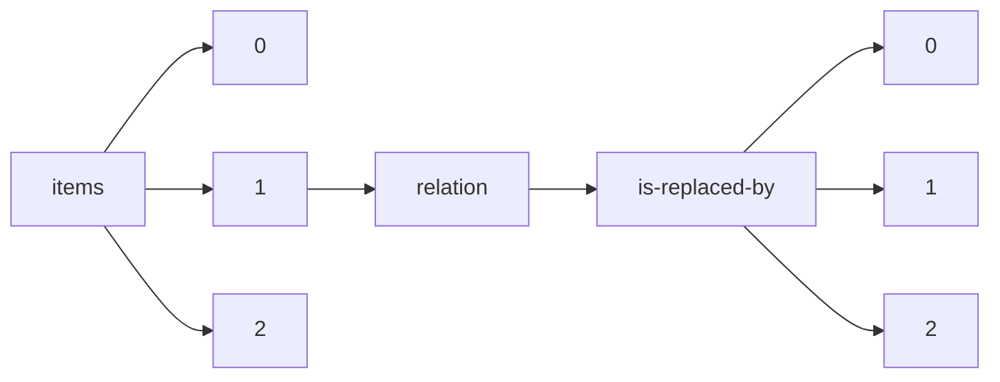

!!! warning "This document is not official Crossref documentation"
# Elements
PATH = items/array/relation/is-replaced-by/array(1)  
Occurs 1 377 times  
{ .annotate }

1. A route to an element, for example:  
   The route "items/array/relation/is-replaced-by/array" corresponds to navigating through the JSON indices as  
   ["items"][0]["relation"]["is-replaced-by"][0]  

## Asserted-by
See more information: [items/array/relation/is-replaced-by/array/asserted-by](asserted-by/index.md)  
Occurs 1 377 timess  
Unique values: 1  

| **Row** | **Value** `String` | **Count** `Int64` |
|--------:|----------------------:|---------------------:|
| **1**   | subject               | 1 377                |

## Id
See more information: [items/array/relation/is-replaced-by/array/id](id/index.md)  
Occurs 1 377 timess  
Unique values: > 999  

!!! note "Due to current limitations, only the first 1,000 unique values are counted."

| **Row** | **Value** `String`           | **Count** `Int64` |
|--------:|--------------------------------:|---------------------:|
| **1**   | 10.7287/peerj.preprints.843v2   | 1                    |
| **2**   | 10.7287/peerj.preprints.2882v5  | 1                    |
| **3**   | 10.7287/peerj.preprints.2227v2  | 1                    |
| **4**   | 10.7287/peerj.preprints.3264v2  | 1                    |
| **5**   | 10.7287/peerj.preprints.27834v2 | 1                    |
| **6**   | 10.7287/peerj.preprints.26931v5 | 1                    |
| **7**   | 10.7287/peerj.preprints.2736v3  | 1                    |
| **8**   | 10.7287/peerj.preprints.2238v2  | 1                    |
| **9**   | 10.7287/peerj.preprints.27554v2 | 1                    |
| **10**  | 10.7287/peerj.preprints.2278v4  | 1                    |
| ... | ... | ... |

## Id-type
See more information: [items/array/relation/is-replaced-by/array/id-type](id-type/index.md)  
Occurs 1 377 timess  
Unique values: 2  

| **Row** | **Value** `String` | **Count** `Int64` |
|--------:|----------------------:|---------------------:|
| **1**   | doi                   | 1 376                |
| **2**   | isbn                  | 1                    |

