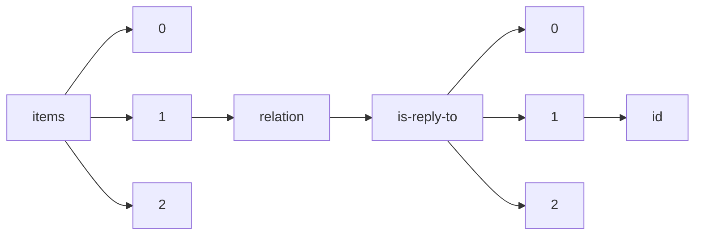

!!! warning "This document is not official Crossref documentation"
# Id
PATH = items/array/relation/is-reply-to/array/id(1)  
Occurs 56 920 times  
Unique values: > 999  
{ .annotate }

1. A route to an element, for example:  
   The route "items/array/relation/is-reply-to/array/id" corresponds to navigating through the JSON indices as  
   ["items"][0]["relation"]["is-reply-to"][0]["id"]  

!!! note "Due to current limitations, only the first 1,000 unique values are counted."

| **Row** | **Value** `String`      | **Count** `Int64` |
|--------:|---------------------------:|---------------------:|
| **1**   | 10.5194/angeo-2019-9-RC1   | 8                    |
| **2**   | 10.5194/bg-2018-147-RC1    | 8                    |
| **3**   | 10.5194/npg-2017-77-RC1    | 8                    |
| **4**   | 10.5194/hess-2017-609-RC1  | 8                    |
| **5**   | 10.5194/nhess-2020-175-RC1 | 8                    |
| **6**   | 10.5194/angeo-2019-82-RC1  | 8                    |
| **7**   | 10.5194/nhess-2020-41-RC1  | 8                    |
| **8**   | 10.5194/acp-2017-812-RC1   | 8                    |
| **9**   | 10.5194/bg-2018-531-RC1    | 8                    |
| **10**  | 10.5194/acp-2018-273-RC1   | 8                    |
| **11**  | 10.5194/nhess-2018-13-RC2  | 6                    |
| **12**  | 10.5194/gmd-2018-130-RC2   | 6                    |
| **13**  | 10.5194/nhess-2020-53-RC1  | 6                    |
| **14**  | 10.5194/angeo-2018-137-RC2 | 6                    |
| **15**  | 10.5194/angeo-2019-135-RC1 | 6                    |
| **16**  | 10.5194/bg-2018-292-RC2    | 6                    |
| **17**  | 10.5194/acp-2016-976-RC1   | 6                    |
| **18**  | 10.5194/acp-2018-828-RC2   | 6                    |
| **19**  | 10.5194/acp-2017-230-AC1   | 6                    |
| **20**  | 10.5194/cp-2020-28-RC1     | 6                    |
| **21**  | 10.5194/cp-2019-69-RC1     | 6                    |
| **22**  | 10.5194/amt-2019-155-RC1   | 6                    |
| **23**  | 10.5194/tc-2017-234-RC1    | 6                    |
| **24**  | 10.5194/acp-2017-867-RC1   | 6                    |
| **25**  | 10.5194/tc-2017-200-RC1    | 6                    |
| **26**  | 10.5194/esurf-2017-48-EC1  | 6                    |
| **27**  | 10.5194/acp-2018-211-RC1   | 6                    |
| **28**  | 10.5194/hess-2017-582-RC2  | 6                    |
| **29**  | 10.5194/nhess-2018-317-RC1 | 6                    |
| **30**  | 10.5194/angeo-2019-5-RC1   | 6                    |
| **31**  | 10.5194/npg-2019-28-RC1    | 6                    |
| **32**  | 10.5194/angeo-2019-124-RC1 | 6                    |
| **33**  | 10.5194/tc-2019-316-RC1    | 6                    |
| **34**  | 10.5194/gmd-2019-80-RC2    | 6                    |
| **35**  | 10.5194/nhess-2018-333-RC2 | 6                    |
| **36**  | 10.5194/bg-2019-248-RC2    | 6                    |
| **37**  | 10.5194/amt-2017-250-RC1   | 6                    |
| **38**  | 10.5194/bg-2018-308-RC1    | 6                    |
| **39**  | 10.5194/bg-2018-249-RC1    | 6                    |
| **40**  | 10.5194/amt-2017-373-RC1   | 6                    |
| **41**  | 10.5194/angeo-2018-92-RC3  | 5                    |
| **42**  | 10.5194/wes-2017-56-RC1    | 4                    |
| **43**  | 10.5194/gchron-2019-10-RC1 | 4                    |
| **44**  | 10.5194/acp-2020-513-RC1   | 4                    |
| **45**  | 10.5194/hess-2018-310-RC2  | 4                    |
| **46**  | 10.5194/angeo-2019-152-RC4 | 4                    |
| **47**  | 10.5194/acp-2017-173-RC2   | 4                    |
| **48**  | 10.5194/gmd-2019-22-RC2    | 4                    |
| **49**  | 10.5194/gi-2018-8-RC1      | 4                    |
| **50**  | 10.5194/amt-2018-145-RC1   | 4                    |
| **51**  | 10.5194/soil-2018-7-RC1    | 4                    |
| **52**  | 10.5194/os-2018-130-RC1    | 4                    |
| **53**  | 10.5194/bg-2020-66-RC1     | 4                    |
| **54**  | 10.5194/nhess-2018-45-RC2  | 4                    |
| **55**  | 10.5194/acp-2019-62-RC1    | 4                    |
| **56**  | 10.5194/bg-2019-29-RC2     | 4                    |
| **57**  | 10.5194/acp-2018-636-RC2   | 4                    |
| **58**  | 10.5194/se-2019-55-RC2     | 4                    |
| **59**  | 10.5194/acp-2018-1056-RC1  | 4                    |
| **60**  | 10.5194/nhess-2017-272-RC2 | 4                    |
| **61**  | 10.5194/cp-2019-20-RC2     | 4                    |
| **62**  | 10.5194/tc-2019-33-RC2     | 4                    |
| **63**  | 10.5194/hess-2017-609-RC2  | 4                    |
| **64**  | 10.5194/hess-2017-97-RC1   | 4                    |
| **65**  | 10.5194/nhess-2018-319-RC2 | 4                    |
| **66**  | 10.5194/hess-2019-228-RC1  | 4                    |
| **67**  | 10.5194/nhess-2016-408-RC2 | 4                    |
| **68**  | 10.5194/nhess-2017-459-RC1 | 4                    |
| **69**  | 10.5194/hess-2020-354-RC1  | 4                    |
| **70**  | 10.5194/se-2019-106-RC1    | 4                    |
| **71**  | 10.5194/essd-2019-145-RC1  | 4                    |
| **72**  | 10.5194/acp-2017-231-RC1   | 4                    |
| **73**  | 10.5194/se-2020-50-RC1     | 4                    |
| **74**  | 10.5194/hess-2020-206-RC1  | 4                    |
| **75**  | 10.5194/cp-2018-97-RC1     | 4                    |
| **76**  | 10.5194/tc-2018-230-RC2    | 4                    |
| **77**  | 10.5194/acp-2017-493-RC1   | 4                    |
| **78**  | 10.5194/acp-2016-1167-RC1  | 4                    |
| **79**  | 10.5194/hess-2018-78-RC3   | 4                    |
| **80**  | 10.5194/nhess-2017-74-RC1  | 4                    |
| **81**  | 10.5194/acp-2019-383-RC1   | 4                    |
| **82**  | 10.5194/acp-2017-741-RC1   | 4                    |
| **83**  | 10.5194/cp-2019-18-RC1     | 4                    |
| **84**  | 10.5194/tc-2019-325-RC2    | 4                    |
| **85**  | 10.5194/cp-2018-40-RC1     | 4                    |
| **86**  | 10.5194/esd-2018-1-RC1     | 4                    |
| **87**  | 10.5194/bg-2019-323-RC2    | 4                    |
| **88**  | 10.5194/acp-2017-1179-RC1  | 4                    |
| **89**  | 10.5194/se-2017-128-SC1    | 4                    |
| **90**  | 10.5194/esurf-2018-63-SC2  | 4                    |
| **91**  | 10.5194/gmd-2017-227-SC1   | 4                    |
| **92**  | 10.5194/amt-2017-136-RC3   | 4                    |
| **93**  | 10.5194/cp-2017-147-RC3    | 4                    |
| **94**  | 10.5194/angeo-2018-24-RC2  | 4                    |
| **95**  | 10.5194/hess-2017-497-SC2  | 4                    |
| **96**  | 10.5194/nhess-2018-187-EC1 | 4                    |
| **97**  | 10.5194/gmd-2017-234-SC1   | 4                    |
| **98**  | 10.5194/hess-2017-617-RC2  | 4                    |
| **99**  | 10.5194/hess-2019-316-RC1  | 4                    |
| **100** | 10.5194/hess-2018-170-RC2  | 4                    |
| **101** | 10.5194/nhess-2017-410-RC2 | 4                    |
| **102** | 10.5194/acp-2018-370-RC1   | 4                    |
| **103** | 10.5194/acp-2020-198-RC2   | 4                    |
| **104** | 10.5194/angeo-2018-40-RC1  | 4                    |
| **105** | 10.5194/angeo-2019-165-RC2 | 4                    |
| **106** | 10.5194/gmd-2018-61-RC1    | 4                    |
| **107** | 10.5194/essd-2017-76-RC1   | 4                    |
| **108** | 10.5194/bg-2019-421-RC1    | 4                    |
| **109** | 10.5194/acp-2018-927-RC1   | 4                    |
| **110** | 10.5194/cp-2018-1-RC2      | 4                    |
| **111** | 10.5194/amt-2017-176-RC2   | 4                    |
| **112** | 10.5194/bg-2017-62-RC2     | 4                    |
| **113** | 10.5194/gmd-2017-56-RC1    | 4                    |
| **114** | 10.5194/gmd-2018-300-RC1   | 4                    |
| **115** | 10.5194/se-2017-59-RC2     | 4                    |
| **116** | 10.5194/angeo-2018-6-RC1   | 4                    |
| **117** | 10.5194/amt-2018-363-RC1   | 4                    |
| **118** | 10.5194/dwes-2020-32-RC1   | 4                    |
| **119** | 10.5194/hess-2018-144-RC3  | 4                    |
| **120** | 10.5194/angeo-2019-41-RC2  | 4                    |
| **121** | 10.5194/se-2019-131-RC1    | 4                    |
| **122** | 10.5194/hess-2017-160-RC1  | 4                    |
| **123** | 10.5194/hess-2018-633-RC1  | 4                    |
| **124** | 10.5194/dwes-2018-40-RC1   | 4                    |
| **125** | 10.5194/bg-2017-197-RC2    | 4                    |
| **126** | 10.5194/amt-2018-77-RC3    | 4                    |
| **127** | 10.5194/acp-2017-182-RC1   | 4                    |
| **128** | 10.5194/gmd-2019-57-SC1    | 4                    |
| **129** | 10.5194/bg-2019-255-RC1    | 4                    |
| **130** | 10.5194/amt-2017-387-RC1   | 4                    |
| **131** | 10.5194/bg-2018-303-RC1    | 4                    |
| **132** | 10.5194/angeo-2019-123-RC2 | 4                    |
| **133** | 10.5194/os-2019-56-RC1     | 4                    |
| **134** | 10.5194/angeo-2018-78-RC1  | 4                    |
| **135** | 10.5194/os-2019-16-RC1     | 4                    |
| **136** | 10.5194/hess-2018-134-RC2  | 4                    |
| **137** | 10.5194/acp-2017-867-RC2   | 4                    |
| **138** | 10.5194/nhess-2018-147-RC2 | 4                    |
| **139** | 10.5194/hess-2018-71-RC1   | 4                    |
| **140** | 10.5194/gmd-2019-80-RC1    | 4                    |
| **141** | 10.5194/bg-2019-245-RC1    | 4                    |
| **142** | 10.5194/bg-2018-499-RC2    | 4                    |
| **143** | 10.5194/gmd-2017-182-RC2   | 4                    |
| **144** | 10.5194/dwes-2019-2-RC2    | 4                    |
| **145** | 10.5194/se-2019-60-RC1     | 4                    |
| **146** | 10.5194/hess-2019-116-RC1  | 4                    |
| **147** | 10.5194/acp-2018-223-RC1   | 4                    |
| **148** | 10.5194/acp-2019-644-RC1   | 4                    |
| **149** | 10.5194/angeo-2018-70-RC1  | 4                    |
| **150** | 10.5194/amt-2020-252-RC2   | 4                    |
| **151** | 10.5194/amt-2017-68-RC2    | 4                    |
| **152** | 10.5194/angeo-2019-24-RC1  | 4                    |
| **153** | 10.5194/hess-2018-405-RC1  | 4                    |
| **154** | 10.5194/os-2020-47-RC2     | 4                    |
| **155** | 10.5194/se-2019-187-RC1    | 4                    |
| **156** | 10.5194/bg-2017-204-RC1    | 4                    |
| **157** | 10.5194/amt-2017-251-RC1   | 4                    |
| **158** | 10.5194/acp-2017-83-RC1    | 4                    |
| **159** | 10.5194/soil-2019-28-RC1   | 4                    |
| **160** | 10.5194/acp-2017-1115-RC2  | 4                    |
| **161** | 10.5194/acp-2019-752-RC1   | 4                    |
| **162** | 10.5194/amt-2018-271-RC3   | 4                    |
| **163** | 10.5194/nhess-2017-252-RC2 | 4                    |
| **164** | 10.5194/gmd-2018-323-RC2   | 4                    |
| **165** | 10.5194/wes-2017-43-RC2    | 4                    |
| **166** | 10.5194/esd-2019-23-RC2    | 4                    |
| **167** | 10.5194/acp-2018-412-RC3   | 4                    |
| **168** | 10.5194/amt-2017-171-RC1   | 4                    |
| **169** | 10.5194/esd-2018-23-RC1    | 4                    |
| **170** | 10.5194/bg-2019-158-RC2    | 4                    |
| **171** | 10.5194/esd-2017-120-RC1   | 4                    |
| **172** | 10.5194/amt-2017-294-RC1   | 4                    |
| **173** | 10.5194/acp-2017-743-RC1   | 4                    |
| **174** | 10.5194/esurf-2019-7-RC1   | 4                    |
| **175** | 10.5194/bg-2017-416-RC1    | 4                    |
| **176** | 10.5194/acp-2017-1032-RC1  | 4                    |
| **177** | 10.5194/os-2018-69-RC2     | 4                    |
| **178** | 10.5194/gmd-2018-252-SC1   | 4                    |
| **179** | 10.5194/nhess-2019-171-RC1 | 4                    |
| **180** | 10.5194/amt-2017-411-RC1   | 4                    |
| **181** | 10.5194/bg-2018-519-RC1    | 4                    |
| **182** | 10.5194/gmd-2020-146-SC1   | 4                    |
| **183** | 10.5194/hess-2017-670-RC2  | 4                    |
| **184** | 10.5194/acp-2017-714-RC1   | 4                    |
| **185** | 10.5194/nhess-2017-410-RC1 | 4                    |
| **186** | 10.5194/hess-2018-492-RC1  | 4                    |
| **187** | 10.5194/os-2017-76-RC1     | 4                    |
| **188** | 10.5194/gchron-2020-14-RC1 | 4                    |
| **189** | 10.5194/cp-2017-145-RC1    | 4                    |
| **190** | 10.5194/bg-2017-417-RC1    | 4                    |
| **191** | 10.5194/acp-2019-303-RC2   | 4                    |
| **192** | 10.5194/bg-2017-568-RC1    | 4                    |
| **193** | 10.5194/hess-2020-4-RC2    | 4                    |
| **194** | 10.5194/os-2018-9-RC2      | 4                    |
| **195** | 10.5194/amt-2018-184-RC1   | 4                    |
| **196** | 10.5194/acp-2019-315-RC2   | 4                    |
| **197** | 10.5194/nhess-2018-286-EC1 | 4                    |
| **198** | 10.5194/acp-2017-254-RC2   | 4                    |
| **199** | 10.5194/os-2017-92-RC2     | 4                    |
| **200** | 10.5194/hess-2018-134-RC1  | 4                    |
| **201** | 10.5194/nhess-2018-133-RC1 | 4                    |
| **202** | 10.5194/hess-2019-210-RC2  | 4                    |
| **203** | 10.5194/hess-2017-385-RC1  | 4                    |
| **204** | 10.5194/tc-2017-140-RC1    | 4                    |
| **205** | 10.5194/soil-2019-18-RC2   | 4                    |
| **206** | 10.5194/cp-2019-8-RC1      | 4                    |
| **207** | 10.5194/se-2017-54-RC1     | 4                    |
| **208** | 10.5194/hess-2017-474-RC1  | 4                    |
| **209** | 10.5194/hess-2018-487-RC1  | 4                    |
| **210** | 10.5194/bg-2018-404-RC1    | 4                    |
| **211** | 10.5194/nhess-2018-131-RC1 | 4                    |
| **212** | 10.5194/cp-2019-28-RC1     | 4                    |
| **213** | 10.5194/amt-2018-231-RC2   | 4                    |
| **214** | 10.5194/hess-2019-210-RC1  | 4                    |
| **215** | 10.5194/hess-2017-650-RC1  | 4                    |
| **216** | 10.5194/acp-2017-397-RC1   | 4                    |
| **217** | 10.5194/acp-2018-688-RC2   | 4                    |
| **218** | 10.5194/nhess-2017-336-RC1 | 4                    |
| **219** | 10.5194/acp-2018-971-RC1   | 4                    |
| **220** | 10.5194/hess-2018-374-RC1  | 4                    |
| **221** | 10.5194/hess-2018-26-RC2   | 4                    |
| **222** | 10.5194/essd-2019-4-SC2    | 4                    |
| **223** | 10.5194/soil-2017-38-RC2   | 4                    |
| **224** | 10.5194/amt-2019-326-RC1   | 4                    |
| **225** | 10.5194/tc-2019-297-RC1    | 4                    |
| **226** | 10.5194/se-2018-50-RC3     | 4                    |
| **227** | 10.5194/amt-2018-8-RC1     | 4                    |
| **228** | 10.5194/bg-2018-399-RC1    | 4                    |
| **229** | 10.5194/amt-2017-488-RC1   | 4                    |
| **230** | 10.5194/acp-2018-828-RC1   | 4                    |
| **231** | 10.5194/bg-2018-510-RC1    | 4                    |
| **232** | 10.5194/acp-2017-87-RC2    | 4                    |
| **233** | 10.5194/bg-2019-191-RC1    | 4                    |
| **234** | 10.5194/acp-2017-126-RC1   | 4                    |
| **235** | 10.5194/gmd-2019-177-RC2   | 4                    |
| **236** | 10.5194/amt-2017-443-RC1   | 4                    |
| **237** | 10.5194/nhess-2017-222-RC1 | 4                    |
| **238** | 10.5194/nhess-2019-339-RC2 | 4                    |
| **239** | 10.5194/hess-2017-758-RC2  | 4                    |
| **240** | 10.5194/acp-2017-256-RC2   | 4                    |
| **241** | 10.5194/hess-2017-604-RC1  | 4                    |
| **242** | 10.5194/os-2016-94-EC1     | 4                    |
| **243** | 10.5194/hess-2020-75-RC2   | 4                    |
| **244** | 10.5194/hess-2019-101-RC3  | 4                    |
| **245** | 10.5194/esd-2018-65-RC1    | 4                    |
| **246** | 10.5194/se-2019-131-SC1    | 4                    |
| **247** | 10.5194/bg-2017-562-RC1    | 4                    |
| **248** | 10.5194/bg-2020-30-RC2     | 4                    |
| **249** | 10.5194/bg-2018-9-RC1      | 4                    |
| **250** | 10.5194/esd-2019-7-RC1     | 4                    |
| **251** | 10.5194/nhess-2018-13-RC1  | 4                    |
| **252** | 10.5194/acp-2017-270-RC1   | 4                    |
| **253** | 10.5194/esd-2017-91-RC1    | 4                    |
| **254** | 10.5194/angeo-2020-15-RC1  | 4                    |
| **255** | 10.5194/angeo-2019-107-RC1 | 4                    |
| **256** | 10.5194/cp-2017-6-RC1      | 4                    |
| **257** | 10.5194/hess-2018-451-RC2  | 4                    |
| **258** | 10.5194/acp-2018-1116-RC2  | 4                    |
| **259** | 10.5194/amt-2019-217-RC1   | 4                    |
| **260** | 10.5194/cp-2020-38-RC3     | 4                    |
| **261** | 10.5194/acp-2017-846-RC1   | 4                    |
| **262** | 10.5194/angeo-2018-105-RC1 | 4                    |
| **263** | 10.5194/hess-2017-592-RC1  | 4                    |
| **264** | 10.5194/acp-2019-735-RC2   | 4                    |
| **265** | 10.5194/npg-2019-28-RC2    | 4                    |
| **266** | 10.5194/bg-2017-147-RC2    | 4                    |
| **267** | 10.5194/cp-2018-85-RC1     | 4                    |
| **268** | 10.5194/nhess-2017-358-RC1 | 4                    |
| **269** | 10.5194/acp-2019-62-RC2    | 4                    |
| **270** | 10.5194/amt-2018-307-RC1   | 4                    |
| **271** | 10.5194/angeo-2020-5-RC1   | 4                    |
| **272** | 10.5194/bg-2018-147-RC2    | 4                    |
| **273** | 10.5194/acp-2018-1270-RC1  | 4                    |
| **274** | 10.5194/bg-2019-420-RC2    | 4                    |
| **275** | 10.5194/nhess-2017-121-RC1 | 4                    |
| **276** | 10.5194/bg-2019-382-RC1    | 4                    |
| **277** | 10.5194/nhess-2017-169-RC1 | 4                    |
| **278** | 10.5194/cp-2017-29-RC2     | 4                    |
| **279** | 10.5194/nhess-2018-133-RC2 | 4                    |
| **280** | 10.5194/angeo-2018-45-AC1  | 4                    |
| **281** | 10.5194/bg-2019-453-RC2    | 4                    |
| **282** | 10.5194/hess-2017-610-RC1  | 4                    |
| **283** | 10.5194/nhess-2019-131-RC2 | 4                    |
| **284** | 10.5194/hess-2018-144-RC4  | 4                    |
| **285** | 10.5194/amt-2018-66-RC1    | 4                    |
| **286** | 10.5194/gmd-2020-13-SC1    | 4                    |
| **287** | 10.5194/bg-2019-252-RC1    | 4                    |
| **288** | 10.5194/amt-2018-271-RC2   | 4                    |
| **289** | 10.5194/amt-2018-8-RC2     | 4                    |
| **290** | 10.5194/acp-2017-67-RC2    | 4                    |
| **291** | 10.5194/amt-2019-335-RC1   | 4                    |
| **292** | 10.5194/nhess-2018-224-RC1 | 4                    |
| **293** | 10.5194/hess-2019-601-RC2  | 4                    |
| **294** | 10.5194/acp-2018-6-SC2     | 4                    |
| **295** | 10.5194/gmd-2019-7-RC1     | 4                    |
| **296** | 10.5194/hess-2019-5-RC2    | 4                    |
| **297** | 10.5194/amt-2019-275-RC1   | 4                    |
| **298** | 10.5194/wes-2018-22-RC1    | 4                    |
| **299** | 10.5194/acp-2017-1203-RC2  | 4                    |
| **300** | 10.5194/se-2019-187-RC2    | 4                    |
| **301** | 10.5194/essd-2017-57-RC1   | 4                    |
| **302** | 10.5194/nhess-2020-118-RC2 | 4                    |
| **303** | 10.5194/wes-2018-23-RC1    | 4                    |
| **304** | 10.5194/hess-2018-82-RC1   | 4                    |
| **305** | 10.5194/amt-2017-17-RC3    | 4                    |
| **306** | 10.5194/acp-2020-182-RC1   | 4                    |
| **307** | 10.5194/tc-2018-184-RC2    | 4                    |
| **308** | 10.5194/acp-2017-627-RC1   | 4                    |
| **309** | 10.5194/amt-2019-230-RC2   | 4                    |
| **310** | 10.5194/nhess-2018-41-RC1  | 4                    |
| **311** | 10.5194/hess-2018-298-SC3  | 4                    |
| **312** | 10.5194/gmd-2020-146-RC1   | 4                    |
| **313** | 10.5194/se-2018-123-RC2    | 4                    |
| **314** | 10.5194/wes-2018-58-RC2    | 4                    |
| **315** | 10.5194/tc-2019-147-RC1    | 4                    |
| **316** | 10.5194/cp-2019-107-AC1    | 4                    |
| **317** | 10.5194/os-2018-49-RC1     | 4                    |
| **318** | 10.5194/acp-2018-1308-RC1  | 4                    |
| **319** | 10.5194/nhess-2018-333-RC1 | 4                    |
| **320** | 10.5194/amt-2019-331-RC1   | 4                    |
| **321** | 10.5194/nhess-2017-454-RC1 | 4                    |
| **322** | 10.5194/hess-2019-233-RC2  | 4                    |
| **323** | 10.5194/cp-2018-71-RC2     | 4                    |
| **324** | 10.5194/amt-2018-45-RC1    | 4                    |
| **325** | 10.5194/gc-2019-13-RC1     | 4                    |
| **326** | 10.5194/amt-2017-460-RC1   | 4                    |
| **327** | 10.5194/gmd-2017-64-RC2    | 4                    |
| **328** | 10.5194/amt-2017-162-RC3   | 4                    |
| **329** | 10.5194/nhess-2019-171-RC2 | 4                    |
| **330** | 10.5194/os-2018-9-RC3      | 4                    |
| **331** | 10.5194/cp-2019-20-RC1     | 4                    |
| **332** | 10.5194/gmd-2017-107-AC1   | 4                    |
| **333** | 10.5194/hess-2019-189-RC1  | 4                    |
| **334** | 10.5194/os-2018-69-RC1     | 4                    |
| **335** | 10.5194/se-2019-150-RC2    | 4                    |
| **336** | 10.5194/amt-2018-84-SC1    | 4                    |
| **337** | 10.5194/acp-2018-596-RC1   | 4                    |
| **338** | 10.5194/tc-2017-151-RC2    | 4                    |
| **339** | 10.5194/cp-2018-44-RC2     | 4                    |
| **340** | 10.5194/cp-2018-132-RC1    | 4                    |
| **341** | 10.5194/angeo-2018-137-RC1 | 4                    |
| **342** | 10.5194/hess-2017-77-RC2   | 4                    |
| **343** | 10.5194/bg-2019-323-RC1    | 4                    |
| **344** | 10.5194/esurf-2018-79-RC1  | 4                    |
| **345** | 10.5194/tc-2019-23-RC1     | 4                    |
| **346** | 10.5194/acp-2017-953-RC2   | 4                    |
| **347** | 10.5194/se-2019-65-RC2     | 4                    |
| **348** | 10.5194/cp-2018-71-RC3     | 4                    |
| **349** | 10.5194/cp-2018-86-RC2     | 4                    |
| **350** | 10.5194/acp-2019-268-RC1   | 4                    |
| **351** | 10.5194/hess-2019-427-RC1  | 4                    |
| **352** | 10.5194/nhess-2018-187-RC1 | 4                    |
| **353** | 10.5194/hess-2019-610-RC3  | 4                    |
| **354** | 10.5194/hess-2018-415-RC2  | 4                    |
| **355** | 10.5194/gmd-2017-136-RC1   | 4                    |
| **356** | 10.5194/cp-2019-172-RC1    | 4                    |
| **357** | 10.5194/acp-2018-282-RC1   | 4                    |
| **358** | 10.5194/cp-2017-149-RC2    | 4                    |
| **359** | 10.5194/gmd-2018-232-RC1   | 4                    |
| **360** | 10.5194/bg-2019-14-RC1     | 4                    |
| **361** | 10.5194/cp-2018-162-RC2    | 4                    |
| **362** | 10.5194/amt-2019-182-RC3   | 4                    |
| **363** | 10.5194/essd-2017-126-RC1  | 4                    |
| **364** | 10.5194/bg-2019-255-RC4    | 4                    |
| **365** | 10.5194/hess-2018-487-RC2  | 4                    |
| **366** | 10.5194/hess-2018-447-RC1  | 4                    |
| **367** | 10.5194/hess-2018-112-RC3  | 4                    |
| **368** | 10.5194/hess-2019-461-RC3  | 4                    |
| **369** | 10.5194/bg-2018-109-SC2    | 4                    |
| **370** | 10.5194/soil-2019-15-RC2   | 4                    |
| **371** | 10.5194/acp-2019-84-RC2    | 4                    |
| **372** | 10.5194/acp-2017-587-RC1   | 4                    |
| **373** | 10.5194/tc-2019-186-RC1    | 4                    |
| **374** | 10.5194/bg-2017-465-RC1    | 4                    |
| **375** | 10.5194/esd-2018-44-RC1    | 4                    |
| **376** | 10.5194/hess-2017-592-RC2  | 4                    |
| **377** | 10.5194/se-2020-56-RC1     | 4                    |
| **378** | 10.5194/bg-2018-481-RC1    | 4                    |
| **379** | 10.5194/bg-2019-143-RC1    | 4                    |
| **380** | 10.5194/bg-2018-72-RC2     | 4                    |
| **381** | 10.5194/os-2019-53-RC1     | 4                    |
| **382** | 10.5194/acp-2017-728-RC2   | 4                    |
| **383** | 10.5194/bg-2018-176-RC2    | 4                    |
| **384** | 10.5194/hess-2017-416-RC1  | 4                    |
| **385** | 10.5194/amt-2019-326-RC2   | 4                    |
| **386** | 10.5194/acp-2018-1070-SC1  | 4                    |
| **387** | 10.5194/os-2018-37-RC2     | 4                    |
| **388** | 10.5194/cp-2017-129-RC1    | 4                    |
| **389** | 10.5194/bg-2018-471-RC1    | 4                    |
| **390** | 10.5194/acp-2018-12-RC1    | 4                    |
| **391** | 10.5194/acp-2018-414-RC2   | 4                    |
| **392** | 10.5194/bg-2018-56-RC1     | 4                    |
| **393** | 10.5194/os-2019-11-RC1     | 4                    |
| **394** | 10.5194/os-2018-88-RC4     | 4                    |
| **395** | 10.5194/bg-2019-347-RC2    | 4                    |
| **396** | 10.5194/esurf-2019-78-RC1  | 4                    |
| **397** | 10.5194/amt-2020-177-RC2   | 4                    |
| **398** | 10.5194/tc-2018-259-RC1    | 4                    |
| **399** | 10.5194/cp-2018-78-RC1     | 4                    |
| **400** | 10.5194/npg-2017-77-RC2    | 4                    |
| **401** | 10.5194/hess-2018-127-RC1  | 4                    |
| **402** | 10.5194/bg-2019-58-RC2     | 4                    |
| **403** | 10.5194/hess-2019-28-SC1   | 4                    |
| **404** | 10.5194/hess-2019-191-RC2  | 4                    |
| **405** | 10.5194/amt-2017-250-RC2   | 4                    |
| **406** | 10.5194/acp-2018-505-RC1   | 4                    |
| **407** | 10.5194/essd-2019-101-RC1  | 4                    |
| **408** | 10.5194/tc-2019-58-RC2     | 4                    |
| **409** | 10.5194/acp-2019-559-RC1   | 4                    |
| **410** | 10.5194/acp-2018-1336-RC1  | 4                    |
| **411** | 10.5194/npg-2018-1-RC1     | 4                    |
| **412** | 10.5194/se-2018-123-RC1    | 4                    |
| **413** | 10.5194/se-2018-26-RC2     | 4                    |
| **414** | 10.5194/esd-2018-65-RC2    | 4                    |
| **415** | 10.5194/nhess-2019-371-RC1 | 4                    |
| **416** | 10.5194/gmd-2018-31-RC1    | 4                    |
| **417** | 10.5194/os-2017-89-RC4     | 4                    |
| **418** | 10.5194/hess-2017-373-RC1  | 4                    |
| **419** | 10.5194/angeo-2019-62-RC2  | 4                    |
| **420** | 10.5194/cp-2017-110-RC1    | 4                    |
| **421** | 10.5194/amt-2017-443-AC2   | 4                    |
| **422** | 10.5194/amt-2018-271-RC1   | 4                    |
| **423** | 10.5194/acp-2018-828-RC3   | 4                    |
| **424** | 10.5194/acp-2017-254-RC1   | 4                    |
| **425** | 10.5194/angeo-2018-34-RC1  | 4                    |
| **426** | 10.5194/nhess-2018-94-RC1  | 4                    |
| **427** | 10.5194/bg-2018-211-RC1    | 4                    |
| **428** | 10.5194/hess-2017-528-RC1  | 4                    |
| **429** | 10.5194/angeo-2019-86-EC1  | 4                    |
| **430** | 10.5194/bg-2018-499-RC1    | 4                    |
| **431** | 10.5194/acp-2018-713-RC1   | 4                    |
| **432** | 10.5194/gmd-2018-112-RC2   | 4                    |
| **433** | 10.5194/se-2019-196-RC2    | 4                    |
| **434** | 10.5194/hess-2020-266-RC1  | 4                    |
| **435** | 10.5194/amt-2017-385-RC1   | 4                    |
| **436** | 10.5194/os-2017-83-RC2     | 4                    |
| **437** | 10.5194/angeo-2018-134-RC1 | 3                    |
| **438** | 10.5194/amt-2017-373-RC2   | 3                    |
| **439** | 10.5194/acp-2018-1182-RC3  | 3                    |
| **440** | 10.5194/tc-2019-134-SC2    | 3                    |
| **441** | 10.5194/se-2018-75-RC2     | 3                    |
| **442** | 10.21428/39829d0b.b4848f39 | 3                    |
| **443** | 10.5194/nhess-2019-404-RC2 | 3                    |
| **444** | 10.5194/os-2017-95-RC2     | 3                    |
| **445** | 10.5194/acp-2019-383-RC2   | 3                    |
| **446** | 10.5194/tc-2017-200-RC3    | 3                    |
| **447** | 10.5194/acp-2019-73-RC2    | 3                    |
| **448** | 10.5194/angeo-2018-70-RC2  | 3                    |
| **449** | 10.21428/39829d0b.b76630b8 | 3                    |
| **450** | 10.5194/cp-2018-177-RC2    | 3                    |
| **451** | 10.5194/nhess-2017-74-RC3  | 3                    |
| **452** | 10.5194/tc-2019-287-RC2    | 3                    |
| **453** | 10.5194/acp-2018-1182-RC2  | 3                    |
| **454** | 10.5194/os-2018-112-RC2    | 3                    |
| **455** | 10.5194/amt-2017-373-RC3   | 3                    |
| **456** | 10.5194/cp-2019-110-RC2    | 3                    |
| **457** | 10.5194/tc-2020-202-RC2    | 3                    |
| **458** | 10.5194/acp-2018-601-RC1   | 3                    |
| **459** | 10.5194/acp-2019-578-RC2   | 3                    |
| **460** | 10.5194/amt-2019-270-RC2   | 3                    |
| **461** | 10.5194/amt-2018-45-RC2    | 3                    |
| **462** | 10.5194/amt-2018-261-RC2   | 3                    |
| **463** | 10.5194/bg-2020-156-RC3    | 3                    |
| **464** | 10.5194/amt-2019-359-RC2   | 3                    |
| **465** | 10.5194/acp-2019-28-RC2    | 3                    |
| **466** | 10.5194/amt-2018-45-RC3    | 3                    |
| **467** | 10.5194/tc-2020-10-RC1     | 3                    |
| **468** | 10.5194/nhess-2018-317-RC2 | 3                    |
| **469** | 10.5194/os-2017-102-RC2    | 3                    |
| **470** | 10.5194/essd-2018-17-RC2   | 3                    |
| **471** | 10.5194/cp-2020-58-RC2     | 3                    |
| **472** | 10.5194/os-2017-11-RC2     | 2                    |
| **473** | 10.5194/soil-2018-7-RC2    | 2                    |
| **474** | 10.5194/hess-2019-656-RC1  | 2                    |
| **475** | 10.5194/soil-2019-43-SC1   | 2                    |
| **476** | 10.5194/bg-2018-199-AC1    | 2                    |
| **477** | 10.5194/amt-2018-108-RC1   | 2                    |
| **478** | 10.5194/acp-2017-109-RC3   | 2                    |
| **479** | 10.5194/wes-2017-8-RC2     | 2                    |
| **480** | 10.5194/hess-2020-66-AC4   | 2                    |
| **481** | 10.5194/bg-2018-446-RC2    | 2                    |
| **482** | 10.5194/acp-2017-1104-RC2  | 2                    |
| **483** | 10.5194/nhess-2019-110-RC2 | 2                    |
| **484** | 10.5194/bg-2019-418-RC2    | 2                    |
| **485** | 10.5194/bg-2017-300-RC2    | 2                    |
| **486** | 10.5194/acp-2018-510-RC2   | 2                    |
| **487** | 10.5194/tc-2018-269-AC3    | 2                    |
| **488** | 10.5194/amt-2018-324-RC3   | 2                    |
| **489** | 10.5194/acp-2017-38-RC1    | 2                    |
| **490** | 10.5194/tc-2018-275-RC1    | 2                    |
| **491** | 10.5194/bg-2016-343-RC1    | 2                    |
| **492** | 10.5194/se-2018-16-RC1     | 2                    |
| **493** | 10.5194/hess-2017-111-SC3  | 2                    |
| **494** | 10.5194/amt-2018-456-RC1   | 2                    |
| **495** | 10.5194/hess-2019-215-RC3  | 2                    |
| **496** | 10.5194/cp-2018-134-RC2    | 2                    |
| **497** | 10.5194/bg-2017-28-RC3     | 2                    |
| **498** | 10.5194/nhess-2018-320-RC1 | 2                    |
| **499** | 10.5194/angeo-2018-97-RC2  | 2                    |
| **500** | 10.5194/bg-2019-351-RC3    | 2                    |
| **501** | 10.5194/amt-2016-412-RC2   | 2                    |
| **502** | 10.5194/acp-2018-1026-RC2  | 2                    |
| **503** | 10.5194/esd-2019-13-RC1    | 2                    |
| **504** | 10.5194/tc-2020-56-RC2     | 2                    |
| **505** | 10.5194/nhess-2017-449-RC3 | 2                    |
| **506** | 10.5194/nhess-2018-142-RC3 | 2                    |
| **507** | 10.5194/acp-2018-881-RC2   | 2                    |
| **508** | 10.5194/essd-2020-164-RC1  | 2                    |
| **509** | 10.5194/acp-2019-110-RC2   | 2                    |
| **510** | 10.5194/gmd-2019-104-RC2   | 2                    |
| **511** | 10.5194/hess-2018-529-RC1  | 2                    |
| **512** | 10.5194/acp-2019-715-RC1   | 2                    |
| **513** | 10.5194/gmd-2019-277-SC1   | 2                    |
| **514** | 10.5194/hess-2018-4-RC1    | 2                    |
| **515** | 10.5194/cp-2019-89-SC1     | 2                    |
| **516** | 10.5194/angeo-2019-111-RC3 | 2                    |
| **517** | 10.5194/gmd-2018-217-RC1   | 2                    |
| **518** | 10.5194/hess-2017-246-RC2  | 2                    |
| **519** | 10.5194/amt-2018-179-RC2   | 2                    |
| **520** | 10.5194/hess-2018-547-RC1  | 2                    |
| **521** | 10.5194/amt-2017-334-RC1   | 2                    |
| **522** | 10.5194/gmd-2018-265-RC2   | 2                    |
| **523** | 10.5194/amt-2018-40-EC1    | 2                    |
| **524** | 10.5194/os-2017-65-RC3     | 2                    |
| **525** | 10.5194/se-2020-12-RC1     | 2                    |
| **526** | 10.5194/gmd-2017-292-RC1   | 2                    |
| **527** | 10.5194/hess-2018-371-AC1  | 2                    |
| **528** | 10.5194/acp-2019-62-AC2    | 2                    |
| **529** | 10.5194/amt-2018-215-RC1   | 2                    |
| **530** | 10.5194/wes-2017-16-RC1    | 2                    |
| **531** | 10.5194/cp-2017-70-RC1     | 2                    |
| **532** | 10.5194/os-2018-53-RC1     | 2                    |
| **533** | 10.5194/essd-2020-40-SC3   | 2                    |
| **534** | 10.5194/se-2019-189-RC2    | 2                    |
| **535** | 10.5194/acp-2017-1043-AC3  | 2                    |
| **536** | 10.5194/bg-2018-157-RC1    | 2                    |
| **537** | 10.5194/hess-2018-299-RC3  | 2                    |
| **538** | 10.5194/cp-2017-31-RC1     | 2                    |
| **539** | 10.5194/soil-2019-24-EC2   | 2                    |
| **540** | 10.5194/se-2019-178-RC2    | 2                    |
| **541** | 10.5194/essd-2019-120-AC1  | 2                    |
| **542** | 10.5194/acp-2018-816-RC2   | 2                    |
| **543** | 10.5194/acp-2018-1098-RC1  | 2                    |
| **544** | 10.5194/nhess-2018-226-RC2 | 2                    |
| **545** | 10.5194/essd-2018-58-RC2   | 2                    |
| **546** | 10.5194/hess-2019-278-RC1  | 2                    |
| **547** | 10.5194/angeo-2018-67-RC2  | 2                    |
| **548** | 10.5194/os-2017-67-RC2     | 2                    |
| **549** | 10.5194/bg-2018-350-RC1    | 2                    |
| **550** | 10.5194/bg-2019-486-RC2    | 2                    |
| **551** | 10.5194/amt-2017-474-RC1   | 2                    |
| **552** | 10.5194/se-2020-40-RC2     | 2                    |
| **553** | 10.5194/bg-2018-61-RC1     | 2                    |
| **554** | 10.5194/amt-2017-98-RC2    | 2                    |
| **555** | 10.5194/hess-2017-532-RC3  | 2                    |
| **556** | 10.5194/se-2017-21-SC1     | 2                    |
| **557** | 10.5194/acp-2018-1307-RC1  | 2                    |
| **558** | 10.5194/mr-2020-2-SC1      | 2                    |
| **559** | 10.5194/acp-2017-30-RC3    | 2                    |
| **560** | 10.5194/amt-2017-179-RC1   | 2                    |
| **561** | 10.5194/os-2018-155-RC1    | 2                    |
| **562** | 10.5194/hess-2018-440-RC1  | 2                    |
| **563** | 10.5194/acp-2017-1104-RC1  | 2                    |
| **564** | 10.5194/amt-2019-448-RC3   | 2                    |
| **565** | 10.5194/tc-2017-117-RC2    | 2                    |
| **566** | 10.5194/gmd-2017-246-RC1   | 2                    |
| **567** | 10.5194/hess-2017-456-RC4  | 2                    |
| **568** | 10.5194/gmd-2017-103-RC2   | 2                    |
| **569** | 10.5194/acp-2017-1184-RC1  | 2                    |
| **570** | 10.5194/hess-2019-356-RC2  | 2                    |
| **571** | 10.5194/bg-2019-373-RC1    | 2                    |
| **572** | 10.5194/amt-2019-149-RC1   | 2                    |
| **573** | 10.5194/se-2020-30-EC3     | 2                    |
| **574** | 10.5194/amt-2020-19-RC1    | 2                    |
| **575** | 10.5194/wes-2018-56-RC1    | 2                    |
| **576** | 10.5194/acp-2018-1194-RC2  | 2                    |
| **577** | 10.5194/acp-2018-1132-SC1  | 2                    |
| **578** | 10.5194/esd-2018-15-RC2    | 2                    |
| **579** | 10.5194/amt-2017-448-RC1   | 2                    |
| **580** | 10.5194/esurf-2017-15-RC1  | 2                    |
| **581** | 10.5194/amt-2019-471-RC2   | 2                    |
| **582** | 10.5194/os-2019-28-RC2     | 2                    |
| **583** | 10.5194/acp-2017-749-RC3   | 2                    |
| **584** | 10.5194/amt-2017-241-RC1   | 2                    |
| **585** | 10.5194/amt-2019-329-RC1   | 2                    |
| **586** | 10.5194/amt-2019-133-RC2   | 2                    |
| **587** | 10.5194/cp-2018-24-RC2     | 2                    |
| **588** | 10.5194/tc-2018-164-RC1    | 2                    |
| **589** | 10.5194/se-2019-125-RC1    | 2                    |
| **590** | 10.5194/os-2018-83-SC1     | 2                    |
| **591** | 10.5194/amt-2019-430-RC1   | 2                    |
| **592** | 10.5194/hess-2018-244-RC3  | 2                    |
| **593** | 10.5194/hess-2017-116-RC1  | 2                    |
| **594** | 10.5194/amt-2019-147-RC1   | 2                    |
| **595** | 10.5194/bg-2019-491-RC2    | 2                    |
| **596** | 10.5194/hess-2017-86-RC3   | 2                    |
| **597** | 10.5194/acp-2019-1042-RC1  | 2                    |
| **598** | 10.5194/gmd-2017-189-SC1   | 2                    |
| **599** | 10.5194/tc-2018-92-RC2     | 2                    |
| **600** | 10.5194/gmd-2017-93-RC2    | 2                    |
| **601** | 10.5194/bg-2018-490-RC1    | 2                    |
| **602** | 10.5194/esd-2019-72-RC1    | 2                    |
| **603** | 10.5194/amt-2017-448-RC2   | 2                    |
| **604** | 10.5194/tc-2018-115-RC2    | 2                    |
| **605** | 10.5194/nhess-2018-16-RC3  | 2                    |
| **606** | 10.5194/os-2017-99-RC2     | 2                    |
| **607** | 10.5194/npg-2017-45-RC1    | 2                    |
| **608** | 10.5194/bg-2018-264-RC2    | 2                    |
| **609** | 10.5194/hess-2019-342-RC3  | 2                    |
| **610** | 10.5194/mr-2020-3-SC4      | 2                    |
| **611** | 10.5194/hess-2018-112-RC2  | 2                    |
| **612** | 10.5194/amt-2018-238-RC2   | 2                    |
| **613** | 10.5194/acp-2019-977-RC2   | 2                    |
| **614** | 10.5194/npg-2017-71-RC1    | 2                    |
| **615** | 10.5194/bg-2019-218-RC2    | 2                    |
| **616** | 10.5194/acp-2020-36-RC1    | 2                    |
| **617** | 10.5194/acp-2019-302-AC3   | 2                    |
| **618** | 10.5194/bg-2019-79-RC4     | 2                    |
| **619** | 10.5194/gmd-2017-124-RC1   | 2                    |
| **620** | 10.5194/nhess-2019-119-AC3 | 2                    |
| **621** | 10.5194/acp-2017-571-RC2   | 2                    |
| **622** | 10.5194/gmd-2016-304-RC1   | 2                    |
| **623** | 10.5194/se-2019-66-RC1     | 2                    |
| **624** | 10.5194/hess-2018-471-RC2  | 2                    |
| **625** | 10.5194/os-2017-48-RC1     | 2                    |
| **626** | 10.5194/hess-2017-42-RC2   | 2                    |
| **627** | 10.5194/dwes-2017-3-SC1    | 2                    |
| **628** | 10.5194/nhess-2017-367-RC2 | 2                    |
| **629** | 10.5194/bg-2018-254-RC1    | 2                    |
| **630** | 10.5194/bg-2019-484-RC2    | 2                    |
| **631** | 10.5194/tc-2017-264-RC1    | 2                    |
| **632** | 10.5194/tc-2020-93-RC1     | 2                    |
| **633** | 10.5194/acp-2017-344-RC2   | 2                    |
| **634** | 10.5194/wcd-2020-7-RC2     | 2                    |
| **635** | 10.5194/hess-2019-147-RC1  | 2                    |
| **636** | 10.5194/hess-2019-24-RC2   | 2                    |
| **637** | 10.5194/nhess-2016-392-RC3 | 2                    |
| **638** | 10.5194/angeo-2018-64-AC5  | 2                    |
| **639** | 10.5194/amt-2019-213-RC1   | 2                    |
| **640** | 10.5194/cp-2018-82-RC2     | 2                    |
| **641** | 10.5194/amt-2019-349-RC2   | 2                    |
| **642** | 10.5194/hess-2018-479-SC5  | 2                    |
| **643** | 10.5194/hess-2018-509-RC3  | 2                    |
| **644** | 10.5194/gmd-2018-48-RC2    | 2                    |
| **645** | 10.5194/hess-2019-242-RC3  | 2                    |
| **646** | 10.5194/amt-2017-214-AC3   | 2                    |
| **647** | 10.5194/amt-2018-351-RC1   | 2                    |
| **648** | 10.5194/soil-2019-69-RC1   | 2                    |
| **649** | 10.5194/nhess-2018-179-RC1 | 2                    |
| **650** | 10.5194/acp-2018-787-RC2   | 2                    |
| **651** | 10.5194/gmd-2020-74-EC1    | 2                    |
| **652** | 10.5194/tc-2019-148-SC1    | 2                    |
| **653** | 10.5194/hess-2017-383-RC2  | 2                    |
| **654** | 10.5194/bg-2016-549-RC3    | 2                    |
| **655** | 10.5194/hess-2019-87-SC1   | 2                    |
| **656** | 10.5194/amt-2019-333-RC3   | 2                    |
| **657** | 10.5194/esd-2017-76-RC3    | 2                    |
| **658** | 10.5194/os-2019-67-EC2     | 2                    |
| **659** | 10.5194/cp-2019-70-RC2     | 2                    |
| **660** | 10.5194/cp-2017-19-SC1     | 2                    |
| **661** | 10.5194/amt-2016-417-RC2   | 2                    |
| **662** | 10.5194/gchron-2019-3-RC2  | 2                    |
| **663** | 10.5194/hess-2018-187-SC4  | 2                    |
| **664** | 10.5194/hess-2018-365-RC2  | 2                    |
| **665** | 10.5194/amt-2018-165-RC1   | 2                    |
| **666** | 10.5194/hess-2018-339-AC4  | 2                    |
| **667** | 10.5194/bg-2017-182-RC2    | 2                    |
| **668** | 10.5194/amt-2018-272-SC1   | 2                    |
| **669** | 10.5194/tc-2017-53-RC1     | 2                    |
| **670** | 10.5194/hess-2017-300-RC1  | 2                    |
| **671** | 10.5194/hess-2019-225-RC1  | 2                    |
| **672** | 10.5194/cp-2018-2-RC1      | 2                    |
| **673** | 10.5194/nhess-2019-215-RC2 | 2                    |
| **674** | 10.5194/dwes-2017-20-RC2   | 2                    |
| **675** | 10.5194/amt-2018-123-RC1   | 2                    |
| **676** | 10.5194/npg-2019-43-RC1    | 2                    |
| **677** | 10.5194/cp-2020-3-RC2      | 2                    |
| **678** | 10.5194/bg-2019-95-RC1     | 2                    |
| **679** | 10.5194/npg-2017-67-RC2    | 2                    |
| **680** | 10.5194/os-2018-40-RC1     | 2                    |
| **681** | 10.5194/acp-2019-125-RC1   | 2                    |
| **682** | 10.5194/acp-2018-1342-RC2  | 2                    |
| **683** | 10.5194/essd-2017-1-RC2    | 2                    |
| **684** | 10.5194/hess-2019-376-RC2  | 2                    |
| **685** | 10.5194/os-2018-79-RC3     | 2                    |
| **686** | 10.5194/os-2019-59-RC1     | 2                    |
| **687** | 10.5194/nhess-2020-127-SC1 | 2                    |
| **688** | 10.5194/acp-2019-743-RC1   | 2                    |
| **689** | 10.5194/os-2018-47-AC4     | 2                    |
| **690** | 10.5194/esurf-2020-23-EC1  | 2                    |
| **691** | 10.5194/amt-2019-64-RC1    | 2                    |
| **692** | 10.5194/acp-2018-288-RC2   | 2                    |
| **693** | 10.5194/acp-2019-256-RC2   | 2                    |
| **694** | 10.5194/esd-2018-19-RC1    | 2                    |
| **695** | 10.5194/angeo-2019-94-RC2  | 2                    |
| **696** | 10.5194/nhess-2018-303-SC1 | 2                    |
| **697** | 10.5194/cp-2017-64-RC1     | 2                    |
| **698** | 10.5194/acp-2017-124-RC2   | 2                    |
| **699** | 10.5194/dwes-2017-16-RC2   | 2                    |
| **700** | 10.5194/nhess-2017-73-RC1  | 2                    |
| **701** | 10.5194/gmd-2018-294-RC1   | 2                    |
| **702** | 10.5194/amt-2019-307-RC2   | 2                    |
| **703** | 10.5194/hess-2018-53-RC2   | 2                    |
| **704** | 10.5194/esd-2017-12-RC2    | 2                    |
| **705** | 10.5194/acp-2017-658-RC1   | 2                    |
| **706** | 10.5194/bg-2018-402-RC1    | 2                    |
| **707** | 10.5194/hess-2018-429-RC3  | 2                    |
| **708** | 10.5194/os-2018-38-RC2     | 2                    |
| **709** | 10.5194/essd-2017-119-RC1  | 2                    |
| **710** | 10.5194/amt-2018-423-RC2   | 2                    |
| **711** | 10.5194/acp-2016-1166-RC2  | 2                    |
| **712** | 10.5194/tc-2018-166-RC2    | 2                    |
| **713** | 10.5194/bg-2017-221-RC2    | 2                    |
| **714** | 10.5194/nhess-2017-420-RC1 | 2                    |
| **715** | 10.5194/bg-2018-380-EC1    | 2                    |
| **716** | 10.5194/cp-2017-134-RC1    | 2                    |
| **717** | 10.5194/os-2018-146-RC1    | 2                    |
| **718** | 10.5194/cp-2017-34-RC2     | 2                    |
| **719** | 10.5194/gmd-2016-306-SC1   | 2                    |
| **720** | 10.5194/essd-2017-63-RC2   | 2                    |
| **721** | 10.5194/nhess-2019-216-RC1 | 2                    |
| **722** | 10.5194/hess-2019-307-RC1  | 2                    |
| **723** | 10.5194/acp-2017-977-RC2   | 2                    |
| **724** | 10.5194/acp-2016-1102-RC1  | 2                    |
| **725** | 10.5194/cp-2019-91-RC2     | 2                    |
| **726** | 10.5194/nhess-2019-341-RC1 | 2                    |
| **727** | 10.5194/cp-2017-88-RC2     | 2                    |
| **728** | 10.5194/bg-2018-167-RC3    | 2                    |
| **729** | 10.5194/bg-2017-195-RC2    | 2                    |
| **730** | 10.5194/gmd-2020-257-AC1   | 2                    |
| **731** | 10.5194/amt-2017-100-RC2   | 2                    |
| **732** | 10.5194/angeo-2019-68-RC2  | 2                    |
| **733** | 10.5194/hess-2017-389-RC3  | 2                    |
| **734** | 10.5194/gmd-2018-211-RC1   | 2                    |
| **735** | 10.5194/gi-2018-46-RC1     | 2                    |
| **736** | 10.5194/acp-2018-850-RC1   | 2                    |
| **737** | 10.5194/amt-2018-157-RC1   | 2                    |
| **738** | 10.5194/cp-2018-33-RC1     | 2                    |
| **739** | 10.5194/amt-2019-475-RC1   | 2                    |
| **740** | 10.5194/essd-2017-41-RC1   | 2                    |
| **741** | 10.5194/acp-2018-1030-RC1  | 2                    |
| **742** | 10.5194/amt-2018-259-RC3   | 2                    |
| **743** | 10.5194/acp-2019-114-RC4   | 2                    |
| **744** | 10.5194/hess-2017-560-RC1  | 2                    |
| **745** | 10.5194/bg-2018-114-SC1    | 2                    |
| **746** | 10.5194/acp-2018-1131-RC1  | 2                    |
| **747** | 10.5194/nhess-2018-14-RC2  | 2                    |
| **748** | 10.5194/bg-2019-384-RC2    | 2                    |
| **749** | 10.5194/npg-2017-38-RC1    | 2                    |
| **750** | 10.5194/acp-2019-411-RC1   | 2                    |
| **751** | 10.5194/cp-2018-114-RC1    | 2                    |
| **752** | 10.5194/nhess-2018-283-RC2 | 2                    |
| **753** | 10.5194/amt-2020-160-RC2   | 2                    |
| **754** | 10.5194/tc-2018-206-RC1    | 2                    |
| **755** | 10.5194/acp-2017-982-RC2   | 2                    |
| **756** | 10.5194/bg-2020-178-RC2    | 2                    |
| **757** | 10.5194/hess-2019-159-AC2  | 2                    |
| **758** | 10.5194/angeo-2020-36-RC2  | 2                    |
| **759** | 10.5194/acp-2017-660-RC2   | 2                    |
| **760** | 10.5194/tc-2019-24-RC2     | 2                    |
| **761** | 10.5194/bg-2018-52-RC2     | 2                    |
| **762** | 10.5194/amt-2019-346-RC3   | 2                    |
| **763** | 10.5194/amt-2019-311-RC1   | 2                    |
| **764** | 10.5194/tc-2019-326-RC1    | 2                    |
| **765** | 10.5194/hess-2017-569-RC3  | 2                    |
| **766** | 10.5194/gmd-2019-336-RC2   | 2                    |
| **767** | 10.5194/acp-2017-185-EC1   | 2                    |
| **768** | 10.5194/dwes-2018-37-RC2   | 2                    |
| **769** | 10.5194/acp-2019-710-RC2   | 2                    |
| **770** | 10.5194/acp-2019-777-RC2   | 2                    |
| **771** | 10.5194/acp-2020-506-RC1   | 2                    |
| **772** | 10.5194/acp-2017-239-RC2   | 2                    |
| **773** | 10.5194/hess-2017-664-RC1  | 2                    |
| **774** | 10.5194/amt-2017-426-RC2   | 2                    |
| **775** | 10.5194/acp-2019-758-RC1   | 2                    |
| **776** | 10.5194/acp-2018-1099-RC1  | 2                    |
| **777** | 10.5194/amt-2019-405-RC3   | 2                    |
| **778** | 10.5194/acp-2019-189-RC3   | 2                    |
| **779** | 10.5194/acp-2017-542-RC2   | 2                    |
| **780** | 10.5194/hess-2017-174-RC1  | 2                    |
| **781** | 10.5194/amt-2018-170-RC1   | 2                    |
| **782** | 10.5194/amt-2018-381-RC3   | 2                    |
| **783** | 10.5194/nhess-2017-7-RC2   | 2                    |
| **784** | 10.5194/essd-2018-28-SC1   | 2                    |
| **785** | 10.5194/tc-2018-51-RC1     | 2                    |
| **786** | 10.5194/cp-2018-35-AC1     | 2                    |
| **787** | 10.5194/bg-2017-1-RC4      | 2                    |
| **788** | 10.5194/tc-2019-40-RC4     | 2                    |
| **789** | 10.5194/gi-2017-7-RC2      | 2                    |
| **790** | 10.5194/se-2018-4-EC1      | 2                    |
| **791** | 10.5194/hess-2019-28-AC2   | 2                    |
| **792** | 10.5194/se-2019-57-RC2     | 2                    |
| **793** | 10.5194/soil-2017-34-RC1   | 2                    |
| **794** | 10.5194/soil-2019-5-RC1    | 2                    |
| **795** | 10.5194/bg-2017-154-RC3    | 2                    |
| **796** | 10.5194/bg-2017-450-RC4    | 2                    |
| **797** | 10.5194/nhess-2017-250-RC1 | 2                    |
| **798** | 10.5194/hess-2018-339-SC1  | 2                    |
| **799** | 10.5194/esd-2019-43-RC2    | 2                    |
| **800** | 10.5194/acp-2018-85-SC1    | 2                    |
| **801** | 10.5194/bg-2018-423-AC1    | 2                    |
| **802** | 10.5194/hess-2018-38-RC2   | 2                    |
| **803** | 10.5194/tc-2017-248-RC2    | 2                    |
| **804** | 10.5194/hess-2019-64-RC2   | 2                    |
| **805** | 10.5194/hess-2019-304-RC1  | 2                    |
| **806** | 10.5194/hess-2017-122-RC2  | 2                    |
| **807** | 10.5194/essd-2019-35-RC1   | 2                    |
| **808** | 10.5194/acp-2017-844-RC2   | 2                    |
| **809** | 10.5194/esd-2019-38-RC1    | 2                    |
| **810** | 10.5194/bg-2018-173-RC2    | 2                    |
| **811** | 10.5194/amt-2019-176-RC3   | 2                    |
| **812** | 10.5194/gi-2018-13-RC1     | 2                    |
| **813** | 10.5194/bg-2017-566-RC1    | 2                    |
| **814** | 10.5194/cp-2017-95-RC1     | 2                    |
| **815** | 10.5194/acp-2018-548-RC1   | 2                    |
| **816** | 10.5194/se-2018-92-AC1     | 2                    |
| **817** | 10.5194/acp-2019-212-RC1   | 2                    |
| **818** | 10.5194/hess-2019-470-RC3  | 2                    |
| **819** | 10.5194/hess-2017-9-RC1    | 2                    |
| **820** | 10.5194/amt-2020-57-RC1    | 2                    |
| **821** | 10.5194/se-2019-58-RC2     | 2                    |
| **822** | 10.5194/amt-2019-119-RC1   | 2                    |
| **823** | 10.5194/amt-2019-41-RC3    | 2                    |
| **824** | 10.5194/acp-2018-104-RC1   | 2                    |
| **825** | 10.5194/acp-2017-414-RC1   | 2                    |
| **826** | 10.5194/hess-2018-333-SC1  | 2                    |
| **827** | 10.5194/amt-2018-90-RC1    | 2                    |
| **828** | 10.5194/bg-2020-257-RC3    | 2                    |
| **829** | 10.5194/bg-2019-92-RC1     | 2                    |
| **830** | 10.5194/acp-2020-96-RC1    | 2                    |
| **831** | 10.5194/bg-2017-304-RC2    | 2                    |
| **832** | 10.5194/amt-2019-346-RC1   | 2                    |
| **833** | 10.5194/bg-2017-522-RC1    | 2                    |
| **834** | 10.5194/esd-2019-18-RC1    | 2                    |
| **835** | 10.5194/hess-2019-110-RC2  | 2                    |
| **836** | 10.5194/nhess-2017-272-RC1 | 2                    |
| **837** | 10.5194/os-2018-138-RC1    | 2                    |
| **838** | 10.5194/acp-2019-909-RC2   | 2                    |
| **839** | 10.5194/os-2018-163-RC2    | 2                    |
| **840** | 10.5194/tc-2018-161-RC2    | 2                    |
| **841** | 10.5194/se-2019-27-RC3     | 2                    |
| **842** | 10.5194/acp-2020-81-RC1    | 2                    |
| **843** | 10.5194/npg-2019-65-RC2    | 2                    |
| **844** | 10.5194/hess-2017-181-RC4  | 2                    |
| **845** | 10.5194/acp-2018-1062-RC1  | 2                    |
| **846** | 10.5194/gmd-2017-72-RC1    | 2                    |
| **847** | 10.5194/gmd-2018-251-RC3   | 2                    |
| **848** | 10.5194/acp-2018-29-RC2    | 2                    |
| **849** | 10.5194/nhess-2019-413-RC3 | 2                    |
| **850** | 10.5194/hess-2020-192-RC1  | 2                    |
| **851** | 10.5194/nhess-2019-165-RC2 | 2                    |
| **852** | 10.5194/angeo-2019-93-RC2  | 2                    |
| **853** | 10.5194/nhess-2020-175-RC4 | 2                    |
| **854** | 10.5194/bg-2019-101-RC1    | 2                    |
| **855** | 10.5194/acp-2017-342-RC1   | 2                    |
| **856** | 10.5194/nhess-2018-366-RC1 | 2                    |
| **857** | 10.5194/acp-2020-71-RC2    | 2                    |
| **858** | 10.5194/gmd-2016-300-RC3   | 2                    |
| **859** | 10.5194/amt-2017-439-RC2   | 2                    |
| **860** | 10.5194/acp-2017-412-RC1   | 2                    |
| **861** | 10.5194/acp-2018-1180-RC2  | 2                    |
| **862** | 10.5194/acp-2019-640-RC1   | 2                    |
| **863** | 10.5194/hess-2018-189-RC1  | 2                    |
| **864** | 10.5194/acp-2016-1117-RC2  | 2                    |
| **865** | 10.5194/cp-2018-76-RC1     | 2                    |
| **866** | 10.5194/nhess-2019-214-RC1 | 2                    |
| **867** | 10.5194/gmd-2018-248-RC1   | 2                    |
| **868** | 10.5194/amt-2017-299-RC2   | 2                    |
| **869** | 10.5194/se-2019-119-RC2    | 2                    |
| **870** | 10.5194/hess-2018-318-SC2  | 2                    |
| **871** | 10.5194/essd-2019-65-SC1   | 2                    |
| **872** | 10.5194/bg-2019-481-RC2    | 2                    |
| **873** | 10.5194/acp-2018-49-RC3    | 2                    |
| **874** | 10.5194/acp-2018-420-RC1   | 2                    |
| **875** | 10.5194/tc-2019-110-RC2    | 2                    |
| **876** | 10.5194/se-2020-54-RC2     | 2                    |
| **877** | 10.5194/tc-2019-1-RC2      | 2                    |
| **878** | 10.5194/gmd-2019-19-RC1    | 2                    |
| **879** | 10.5194/gmd-2018-295-RC2   | 2                    |
| **880** | 10.5194/acp-2018-778-RC2   | 2                    |
| **881** | 10.5194/amt-2019-435-RC1   | 2                    |
| **882** | 10.5194/gmd-2018-92-RC1    | 2                    |
| **883** | 10.5194/acp-2019-450-RC2   | 2                    |
| **884** | 10.5194/amt-2017-185-RC1   | 2                    |
| **885** | 10.5194/bg-2020-308-RC2    | 2                    |
| **886** | 10.5194/gmd-2017-270-RC2   | 2                    |
| **887** | 10.5194/acp-2018-361-RC1   | 2                    |
| **888** | 10.5194/bg-2017-193-RC3    | 2                    |
| **889** | 10.5194/soil-2019-94-RC2   | 2                    |
| **890** | 10.5194/acp-2016-1100-RC2  | 2                    |
| **891** | 10.5194/bg-2017-279-RC1    | 2                    |
| **892** | 10.5194/bg-2020-4-RC1      | 2                    |
| **893** | 10.5194/acp-2017-1097-RC2  | 2                    |
| **894** | 10.5194/hess-2018-370-RC1  | 2                    |
| **895** | 10.5194/cp-2019-9-RC2      | 2                    |
| **896** | 10.5194/gmd-2019-275-RC2   | 2                    |
| **897** | 10.5194/acp-2019-76-RC2    | 2                    |
| **898** | 10.5194/amt-2018-406-RC1   | 2                    |
| **899** | 10.5194/tc-2019-269-RC2    | 2                    |
| **900** | 10.5194/bg-2018-131-RC2    | 2                    |
| **901** | 10.5194/hess-2018-54-RC2   | 2                    |
| **902** | 10.5194/essd-2017-107-RC1  | 2                    |
| **903** | 10.5194/hess-2019-335-RC3  | 2                    |
| **904** | 10.5194/cp-2018-39-RC1     | 2                    |
| **905** | 10.5194/acp-2018-853-RC2   | 2                    |
| **906** | 10.5194/hess-2018-143-RC1  | 2                    |
| **907** | 10.5194/tc-2017-141-RC1    | 2                    |
| **908** | 10.5194/amt-2017-200-EC1   | 2                    |
| **909** | 10.5194/dwes-2018-14-RC2   | 2                    |
| **910** | 10.5194/amt-2018-356-RC1   | 2                    |
| **911** | 10.5194/soil-2017-40-RC2   | 2                    |
| **912** | 10.5194/acp-2019-645-RC1   | 2                    |
| **913** | 10.5194/acp-2018-502-RC1   | 2                    |
| **914** | 10.5194/hess-2017-224-RC1  | 2                    |
| **915** | 10.5194/acp-2017-1001-RC2  | 2                    |
| **916** | 10.5194/amt-2019-11-RC1    | 2                    |
| **917** | 10.5194/hess-2018-468-SC1  | 2                    |
| **918** | 10.5194/tc-2018-32-RC2     | 2                    |
| **919** | 10.5194/hess-2019-329-RC2  | 2                    |
| **920** | 10.5194/os-2018-136-RC2    | 2                    |
| **921** | 10.5194/tc-2020-184-RC2    | 2                    |
| **922** | 10.5194/gmd-2020-146-RC2   | 2                    |
| **923** | 10.5194/esd-2017-46-RC2    | 2                    |
| **924** | 10.5194/cp-2018-120-RC3    | 2                    |
| **925** | 10.5194/essd-2019-75-RC1   | 2                    |
| **926** | 10.5194/angeo-2020-55-RC3  | 2                    |
| **927** | 10.5194/tc-2020-161-RC1    | 2                    |
| **928** | 10.5194/se-2019-181-RC1    | 2                    |
| **929** | 10.5194/amt-2019-226-RC2   | 2                    |
| **930** | 10.5194/acp-2019-1046-RC1  | 2                    |
| **931** | 10.5194/wes-2017-25-RC2    | 2                    |
| **932** | 10.5194/esurf-2020-9-RC2   | 2                    |
| **933** | 10.5194/gmd-2018-184-SC1   | 2                    |
| **934** | 10.5194/cp-2018-71-SC1     | 2                    |
| **935** | 10.5194/bg-2017-249-RC2    | 2                    |
| **936** | 10.5194/nhess-2017-308-RC1 | 2                    |
| **937** | 10.5194/nhess-2017-372-RC2 | 2                    |
| **938** | 10.5194/cp-2017-19-RC2     | 2                    |
| **939** | 10.5194/bg-2017-3-RC2      | 2                    |
| **940** | 10.5194/hess-2017-293-SC1  | 2                    |
| **941** | 10.5194/os-2017-23-RC2     | 2                    |
| **942** | 10.5194/hess-2017-377-RC2  | 2                    |
| **943** | 10.5194/bg-2017-176-RC1    | 2                    |
| **944** | 10.5194/amt-2020-18-RC1    | 2                    |
| **945** | 10.5194/hess-2018-24-RC1   | 2                    |
| **946** | 10.5194/gmd-2017-175-RC2   | 2                    |
| **947** | 10.5194/essd-2019-75-RC2   | 2                    |
| **948** | 10.5194/tc-2020-165-RC1    | 2                    |
| **949** | 10.5194/acp-2020-175-SC1   | 2                    |
| **950** | 10.5194/nhess-2018-8-RC2   | 2                    |
| **951** | 10.5194/nhess-2018-343-RC2 | 2                    |
| **952** | 10.5194/nhess-2019-392-RC2 | 2                    |
| **953** | 10.5194/esurf-2017-63-AC1  | 2                    |
| **954** | 10.5194/esd-2016-75-RC2    | 2                    |
| **955** | 10.5194/nhess-2017-191-RC1 | 2                    |
| **956** | 10.5194/acp-2018-484-RC1   | 2                    |
| **957** | 10.5194/tc-2017-151-RC1    | 2                    |
| **958** | 10.5194/se-2018-87-RC1     | 2                    |
| **959** | 10.5194/acp-2019-96-RC2    | 2                    |
| **960** | 10.5194/acp-2019-874-RC3   | 2                    |
| **961** | 10.5194/acp-2019-136-RC1   | 2                    |
| **962** | 10.5194/hess-2017-301-RC2  | 2                    |
| **963** | 10.5194/bg-2019-246-RC2    | 2                    |
| **964** | 10.5194/essd-2020-224-RC1  | 2                    |
| **965** | 10.5194/acp-2017-30-RC2    | 2                    |
| **966** | 10.5194/gi-2018-17-RC1     | 2                    |
| **967** | 10.5194/amt-2017-89-RC1    | 2                    |
| **968** | 10.5194/os-2018-112-RC4    | 2                    |
| **969** | 10.5194/acp-2018-507-AC2   | 2                    |
| **970** | 10.5194/dwes-2017-15-RC1   | 2                    |
| **971** | 10.5194/acp-2019-703-RC3   | 2                    |
| **972** | 10.5194/hess-2018-391-RC1  | 2                    |
| **973** | 10.5194/nhess-2018-142-RC4 | 2                    |
| **974** | 10.5194/acp-2018-1018-RC1  | 2                    |
| **975** | 10.5194/nhess-2019-338-RC2 | 2                    |
| **976** | 10.5194/amt-2017-300-RC1   | 2                    |
| **977** | 10.5194/essd-2018-31-RC2   | 2                    |
| **978** | 10.5194/gmd-2018-74-RC1    | 2                    |
| **979** | 10.5194/nhess-2017-441-RC2 | 2                    |
| **980** | 10.5194/esd-2017-78-SC1    | 2                    |
| **981** | 10.5194/bg-2019-360-RC3    | 2                    |
| **982** | 10.5194/hess-2018-207-RC1  | 2                    |
| **983** | 10.5194/tc-2020-31-RC1     | 2                    |
| **984** | 10.5194/bg-2017-394-RC1    | 2                    |
| **985** | 10.5194/hess-2017-183-RC1  | 2                    |
| **986** | 10.5194/tc-2017-141-RC2    | 2                    |
| **987** | 10.5194/acp-2018-1310-RC1  | 2                    |
| **988** | 10.5194/bg-2019-178-EC1    | 2                    |
| **989** | 10.5194/dwes-2017-7-AC4    | 2                    |
| **990** | 10.5194/acp-2017-322-SC1   | 2                    |
| **991** | 10.5194/acp-2017-943-RC2   | 2                    |
| **992** | 10.5194/hess-2017-739-RC2  | 2                    |
| **993** | 10.5194/bg-2017-541-RC1    | 2                    |
| **994** | 10.5194/bg-2018-162-RC1    | 2                    |
| **995** | 10.5194/acp-2019-14-RC2    | 2                    |
| **996** | 10.5194/acp-2017-420-RC1   | 2                    |
| **997** | 10.5194/hess-2018-170-RC1  | 2                    |
| **998** | 10.5194/nhess-2017-60-RC1  | 2                    |
| **999** | 10.5194/tc-2018-147-SC1    | 2                    |
| ... | ... | ... |

