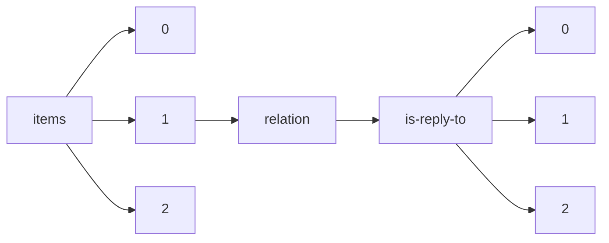

!!! warning "This document is not official Crossref documentation"
# Elements
PATH = items/array/relation/is-reply-to/array(1)  
Occurs 56 920 times  
{ .annotate }

1. A route to an element, for example:  
   The route "items/array/relation/is-reply-to/array" corresponds to navigating through the JSON indices as  
   ["items"][0]["relation"]["is-reply-to"][0]  

## Asserted-by
See more information: [items/array/relation/is-reply-to/array/asserted-by](asserted-by/index.md)  
Occurs 56 920 timess  
Unique values: 2  

| **Row** | **Value** `String` | **Count** `Int64` |
|--------:|----------------------:|---------------------:|
| **1**   | subject               | 28 774               |
| **2**   | object                | 28 146               |

## Id
See more information: [items/array/relation/is-reply-to/array/id](id/index.md)  
Occurs 56 920 timess  
Unique values: > 999  

!!! note "Due to current limitations, only the first 1,000 unique values are counted."

| **Row** | **Value** `String`      | **Count** `Int64` |
|--------:|---------------------------:|---------------------:|
| **1**   | 10.5194/angeo-2019-9-RC1   | 8                    |
| **2**   | 10.5194/bg-2018-147-RC1    | 8                    |
| **3**   | 10.5194/npg-2017-77-RC1    | 8                    |
| **4**   | 10.5194/hess-2017-609-RC1  | 8                    |
| **5**   | 10.5194/nhess-2020-175-RC1 | 8                    |
| **6**   | 10.5194/angeo-2019-82-RC1  | 8                    |
| **7**   | 10.5194/nhess-2020-41-RC1  | 8                    |
| **8**   | 10.5194/acp-2017-812-RC1   | 8                    |
| **9**   | 10.5194/bg-2018-531-RC1    | 8                    |
| **10**  | 10.5194/acp-2018-273-RC1   | 8                    |
| ... | ... | ... |

## Id-type
See more information: [items/array/relation/is-reply-to/array/id-type](id-type/index.md)  
Occurs 56 920 timess  
Unique values: 2  

| **Row** | **Value** `String` | **Count** `Int64` |
|--------:|----------------------:|---------------------:|
| **1**   | doi                   | 56 904               |
| **2**   | uri                   | 16                   |

