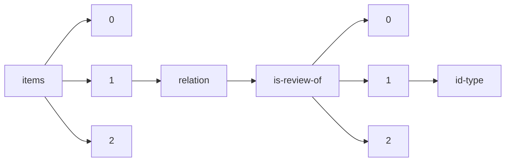

!!! warning "This document is not official Crossref documentation"
# Id-type
PATH = items/array/relation/is-review-of/array/id-type(1)  
Occurs 636 290 times  
Unique values: 7  
{ .annotate }

1. A route to an element, for example:  
   The route "items/array/relation/is-review-of/array/id-type" corresponds to navigating through the JSON indices as  
   ["items"][0]["relation"]["is-review-of"][0]["id-type"]  

| **Row** | **Value** `String` | **Count** `Int64` |
|--------:|----------------------:|---------------------:|
| **1**   | doi                   | 627 998              |
| **2**   | pmid                  | 6 760                |
| **3**   | uri                   | 1 287                |
| **4**   | isbn                  | 108                  |
| **5**   | issn                  | 102                  |
| **6**   | other                 | 24                   |
| **7**   | arxiv                 | 11                   |

