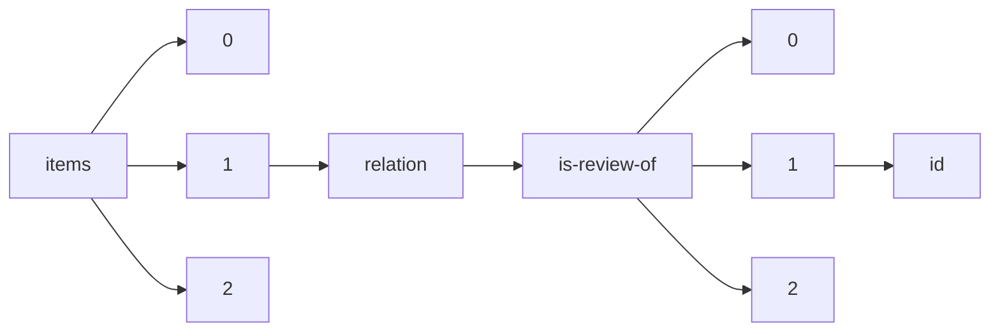

!!! warning "This document is not official Crossref documentation"
# Id
PATH = items/array/relation/is-review-of/array/id(1)  
Occurs 636 290 times  
Unique values: > 999  
{ .annotate }

1. A route to an element, for example:  
   The route "items/array/relation/is-review-of/array/id" corresponds to navigating through the JSON indices as  
   ["items"][0]["relation"]["is-review-of"][0]["id"]  

!!! note "Due to current limitations, only the first 1,000 unique values are counted."

| **Row** | **Value** `String`      | **Count** `Int64` |
|--------:|---------------------------:|---------------------:|
| **1**   |                            | 82                   |
| **2**   | 10.5194/nhess-21-363-2021  | 36                   |
| **3**   | 10.5194/se-2015-134        | 34                   |
| **4**   | 10.5194/soil-8-655-2022    | 32                   |
| **5**   | 10.1002/VMS3.475           | 29                   |
| **6**   | 10.1002/VMS3.763           | 27                   |
| **7**   | 10.5194/esd-7-597-2016     | 26                   |
| **8**   | 10.1002/VMS3.941           | 25                   |
| **9**   | 10.32388/6WOPAL.2          | 24                   |
| **10**  | 10.5194/cp-13-93-2017      | 24                   |
| **11**  | 10.1111/ODI.14358          | 24                   |
| **12**  | 10.1111/ODI.14222          | 24                   |
| **13**  | 10.1111/DOM.14901          | 23                   |
| **14**  | 10.32388/XMJXCE            | 23                   |
| **15**  | 10.1002/VMS3.1119          | 23                   |
| **16**  | 10.1002/2050-7038.12441    | 23                   |
| **17**  | 10.1108/OIR-10-2019-0333   | 22                   |
| **18**  | 10.5194/hess-21-3597-2017  | 20                   |
| **19**  | 10.5194/nhess-21-941-2021  | 20                   |
| **20**  | 10.5194/hess-21-441-2017   | 20                   |
| **21**  | 10.1108/OIR-11-2019-0364   | 20                   |
| **22**  | 10.5194/hess-21-1757-2017  | 20                   |
| **23**  | 10.5194/acp-16-13641-2016  | 20                   |
| **24**  | 10.1111/EJN.15777          | 20                   |
| **25**  | 10.5194/gmd-9-3413-2016    | 20                   |
| **26**  | 10.5194/hess-25-2353-2021  | 20                   |
| **27**  | 10.5194/se-8-83-2017       | 20                   |
| **28**  | 10.1002/2050-7038.12641    | 19                   |
| **29**  | 10.5194/cp-2021-5          | 19                   |
| **30**  | 10.1002/VMS3.404           | 19                   |
| **31**  | 10.5194/wcd-2-181-2021     | 18                   |
| **32**  | 10.5194/hess-21-4495-2017  | 18                   |
| **33**  | 10.1108/ILT-02-2021-0033   | 18                   |
| **34**  | 10.5194/se-13-1755-2022    | 18                   |
| **35**  | 10.1002/VMS3.401           | 18                   |
| **36**  | 10.5194/acp-17-1829-2017   | 18                   |
| **37**  | 10.5194/bg-13-3735-2016    | 18                   |
| **38**  | 10.5194/gmd-9-4185-2016    | 18                   |
| **39**  | 10.5194/gmd-9-3027-2016    | 18                   |
| **40**  | 10.5194/gmd-16-1823-2023   | 18                   |
| **41**  | 10.5194/se-12-1005-2021    | 18                   |
| **42**  | 10.5194/npg-23-159-2016    | 18                   |
| **43**  | 10.1108/OIR-06-2020-0249   | 17                   |
| **44**  | 10.1108/ILT-07-2020-0251   | 17                   |
| **45**  | 10.1017/qpb.2022.11        | 17                   |
| **46**  | 10.1108/ILT-11-2021-0454   | 17                   |
| **47**  | 10.1002/2050-7038.12575    | 17                   |
| **48**  | 10.1108/ILT-11-2020-0392   | 17                   |
| **49**  | 10.5194/gmd-9-2853-2016    | 16                   |
| **50**  | 10.5194/essd-9-149-2017    | 16                   |
| **51**  | 10.1111/JAN.15308          | 16                   |
| **52**  | 10.5194/esd-8-577-2017     | 16                   |
| **53**  | 10.5194/npg-24-1-2017      | 16                   |
| **54**  | 10.5194/tc-10-3091-2016    | 16                   |
| **55**  | 10.5194/tc-10-1631-2016    | 16                   |
| **56**  | 10.5194/bg-14-1739-2017    | 16                   |
| **57**  | 10.1111/ECOG.06025         | 16                   |
| **58**  | 10.1111/DOM.14967          | 16                   |
| **59**  | 10.5194/hess-25-1103-2021  | 16                   |
| **60**  | 10.1002/VMS3.489           | 16                   |
| **61**  | 10.1108/IJSE-02-2022-0084  | 16                   |
| **62**  | 10.1002/CJCE.24757         | 16                   |
| **63**  | 10.1111/DOM.14847          | 16                   |
| **64**  | 10.1002/VMS3.355           | 16                   |
| **65**  | 10.5194/os-12-925-2016     | 16                   |
| **66**  | 10.5194/angeo-39-171-2021  | 16                   |
| **67**  | 10.5194/hess-25-2261-2021  | 16                   |
| **68**  | 10.5194/os-19-269-2023     | 16                   |
| **69**  | 10.1111/JAN.15543          | 15                   |
| **70**  | 10.1111/JAN.15430          | 15                   |
| **71**  | 10.1002/VMS3.590           | 15                   |
| **72**  | 10.1108/ILT-03-2022-0068   | 15                   |
| **73**  | 10.1111/DOM.14956          | 15                   |
| **74**  | 10.1111/JAN.15307          | 15                   |
| **75**  | 10.1002/VMS3.574           | 15                   |
| **76**  | 10.1111/ODI.14533          | 15                   |
| **77**  | 10.1111/ELE.14092          | 15                   |
| **78**  | 10.1111/EVJ.13892          | 15                   |
| **79**  | 10.1111/JOOR.13102         | 15                   |
| **80**  | 10.1111/DOM.14922          | 15                   |
| **81**  | 10.1002/2050-7038.12442    | 15                   |
| **82**  | 10.5194/acp-16-13105-2016  | 14                   |
| **83**  | 10.5194/bg-14-2283-2017    | 14                   |
| **84**  | 10.5194/esurf-5-399-2017   | 14                   |
| **85**  | 10.5194/nhess-16-1449-2016 | 14                   |
| **86**  | 10.5194/acp-17-1571-2017   | 14                   |
| **87**  | 10.1111/EFP.12792          | 14                   |
| **88**  | 10.5194/hess-25-1711-2021  | 14                   |
| **89**  | 10.5194/acp-18-2243-2018   | 14                   |
| **90**  | 10.5194/gmd-14-377-2021    | 14                   |
| **91**  | 10.1111/1440-1681.13393    | 14                   |
| **92**  | 10.5194/cp-12-1591-2016    | 14                   |
| **93**  | 10.1111/IJFS.14810         | 14                   |
| **94**  | 10.1108/ILT-04-2021-0131   | 14                   |
| **95**  | 10.5194/nhess-18-1785-2018 | 14                   |
| **96**  | 10.1111/JAN.15327          | 14                   |
| **97**  | 10.5194/wes-1-115-2016     | 14                   |
| **98**  | 10.5194/gmd-13-6547-2020   | 14                   |
| **99**  | 10.1002/2050-7038.12597    | 14                   |
| **100** | 10.1017/qpb.2022.15        | 14                   |
| **101** | 10.5194/hess-21-3093-2017  | 14                   |
| **102** | 10.1111/ODI.13949          | 14                   |
| **103** | 10.5194/acp-17-385-2017    | 14                   |
| **104** | 10.5194/bg-14-703-2017     | 14                   |
| **105** | 10.1111/EJN.14990          | 13                   |
| **106** | 10.1002/2050-7038.12818    | 13                   |
| **107** | 10.1002/JNR.24720          | 13                   |
| **108** | 10.1111/ELE.14159          | 13                   |
| **109** | 10.1002/2050-7038.12321    | 13                   |
| **110** | 10.1111/IJFS.14692         | 13                   |
| **111** | 10.1111/NYAS.14982         | 13                   |
| **112** | 10.1002/2050-7038.13063    | 13                   |
| **113** | 10.1111/JAV.02703          | 13                   |
| **114** | 10.1002/VMS3.570           | 13                   |
| **115** | 10.1002/VMS3.981           | 13                   |
| **116** | 10.1111/IJFS.15491         | 13                   |
| **117** | 10.1111/IJFS.14799         | 13                   |
| **118** | 10.1002/VMS3.1088          | 13                   |
| **119** | 10.1111/ODI.13683          | 13                   |
| **120** | 10.1002/2050-7038.12643    | 13                   |
| **121** | 10.1002/2050-7038.12499    | 13                   |
| **122** | 10.1088/2515-7655/ACB8DB   | 13                   |
| **123** | 10.1002/VMS3.502           | 13                   |
| **124** | 10.1111/IJFS.14803         | 13                   |
| **125** | 10.1002/JCOP.22884         | 13                   |
| **126** | 10.1002/VMS3.353           | 12                   |
| **127** | 10.5194/gc-4-1-2021        | 12                   |
| **128** | 10.1111/2041-210X.14051    | 12                   |
| **129** | 10.5194/gmd-14-1081-2021   | 12                   |
| **130** | 10.1002/VMS3.622           | 12                   |
| **131** | 10.1111/ODI.14391          | 12                   |
| **132** | 10.5194/acp-23-2613-2023   | 12                   |
| **133** | 10.1111/ODI.14294          | 12                   |
| **134** | 10.1108/OIR-10-2020-0482   | 12                   |
| **135** | 10.1111/IJFS.15551         | 12                   |
| **136** | 10.5194/hess-21-4037-2017  | 12                   |
| **137** | 10.1108/ILT-09-2019-0378   | 12                   |
| **138** | 10.5194/gmd-9-3589-2016    | 12                   |
| **139** | 10.1111/IMIG.12847         | 12                   |
| **140** | 10.5194/amt-14-369-2021    | 12                   |
| **141** | 10.5194/acp-16-13911-2016  | 12                   |
| **142** | 10.1002/BRB3.2136          | 12                   |
| **143** | 10.5194/amt-9-3837-2016    | 12                   |
| **144** | 10.5194/gmd-10-413-2017    | 12                   |
| **145** | 10.5194/acp-17-7127-2017   | 12                   |
| **146** | 10.5194/bg-13-4491-2016    | 12                   |
| **147** | 10.1002/VMS3.503           | 12                   |
| **148** | 10.5194/gi-6-15-2017       | 12                   |
| **149** | 10.1002/WE.2796            | 12                   |
| **150** | 10.1111/EVJ.13876          | 12                   |
| **151** | 10.1111/EVJ.13556          | 12                   |
| **152** | 10.1002/MRC.5292           | 12                   |
| **153** | 10.5194/bg-20-647-2023     | 12                   |
| **154** | 10.1111/ACPS.13231         | 12                   |
| **155** | 10.1111/BRE.12516          | 12                   |
| **156** | 10.1111/1440-1681.13372    | 12                   |
| **157** | 10.1108/OIR-05-2020-0177   | 12                   |
| **158** | 10.1002/BRB3.1847          | 12                   |
| **159** | 10.5194/gmd-9-4521-2016    | 12                   |
| **160** | 10.1111/JAN.15641          | 12                   |
| **161** | 10.5194/cp-12-2195-2016    | 12                   |
| **162** | 10.5194/wes-2-97-2017      | 12                   |
| **163** | 10.5194/hess-20-3183-2016  | 12                   |
| **164** | 10.5194/cp-17-253-2021     | 12                   |
| **165** | 10.5194/hess-2022-379      | 12                   |
| **166** | 10.1002/WE.2776            | 12                   |
| **167** | 10.1111/DOM.14816          | 12                   |
| **168** | 10.5194/esd-8-75-2017      | 12                   |
| **169** | 10.5194/esurf-10-1233-2022 | 12                   |
| **170** | 10.1108/IJSE-11-2020-0757  | 12                   |
| **171** | 10.5194/hess-20-4359-2016  | 12                   |
| **172** | 10.5194/tc-10-1915-2016    | 12                   |
| **173** | 10.5194/se-7-1109-2016     | 12                   |
| **174** | 10.1111/JAN.15599          | 12                   |
| **175** | 10.1002/JNR.24793          | 12                   |
| **176** | 10.1111/DOM.14012          | 12                   |
| **177** | 10.1111/DOM.13959          | 12                   |
| **178** | 10.5194/bg-18-1787-2021    | 12                   |
| **179** | 10.5194/gmd-9-2701-2016    | 12                   |
| **180** | 10.5194/acp-16-13753-2016  | 12                   |
| **181** | 10.5194/cp-12-2107-2016    | 12                   |
| **182** | 10.1002/VMS3.1100          | 12                   |
| **183** | 10.5194/gmd-10-359-2017    | 12                   |
| **184** | 10.1108/ILT-05-2021-0178   | 12                   |
| **185** | 10.5194/os-19-141-2023     | 12                   |
| **186** | 10.5194/nhess-21-629-2021  | 12                   |
| **187** | 10.1108/IJSE-11-2020-0779  | 12                   |
| **188** | 10.5194/os-13-105-2017     | 12                   |
| **189** | 10.1111/INA.12963          | 12                   |
| **190** | 10.5194/gi-5-143-2016      | 12                   |
| **191** | 10.5194/essd-13-1681-2021  | 12                   |
| **192** | 10.5194/nhess-16-2697-2016 | 12                   |
| **193** | 10.5194/gmd-9-2881-2016    | 12                   |
| **194** | 10.1108/OIR-04-2022-0199   | 12                   |
| **195** | 10.1111/JAN.14913          | 11                   |
| **196** | 10.1002/JBMR.4124          | 11                   |
| **197** | 10.1002/2050-7038.12725    | 11                   |
| **198** | 10.1111/JAN.15499          | 11                   |
| **199** | 10.32388/Y8F40K            | 11                   |
| **200** | 10.1002/VMS3.383           | 11                   |
| **201** | 10.1017/cft.2023.5         | 11                   |
| **202** | 10.1108/ILT-04-2021-0130   | 11                   |
| **203** | 10.1111/DOM.14129          | 11                   |
| **204** | 10.1111/ELE.13871          | 11                   |
| **205** | 10.1017/cft.2022.8         | 11                   |
| **206** | 10.1111/EJN.14964          | 11                   |
| **207** | 10.32388/JPKS90            | 11                   |
| **208** | 10.1111/DOM.14328          | 11                   |
| **209** | 10.1111/EJN.15787          | 11                   |
| **210** | 10.1108/ILT-07-2020-0259   | 11                   |
| **211** | 10.1111/DOM.15058          | 11                   |
| **212** | 10.5194/gmd-2016-79        | 11                   |
| **213** | 10.1002/VMS3.842           | 11                   |
| **214** | 10.1002/VMS3.994           | 11                   |
| **215** | 10.1108/ILT-05-2021-0157   | 11                   |
| **216** | 10.1111/ELE.13832          | 11                   |
| **217** | 10.1002/VMS3.998           | 11                   |
| **218** | 10.1108/IJSE-12-2021-0732  | 11                   |
| **219** | 10.1111/ODI.14415          | 11                   |
| **220** | 10.1002/JEZ.B.22996        | 11                   |
| **221** | 10.5194/cp-18-863-2022     | 11                   |
| **222** | 10.1111/ELE.13780          | 11                   |
| **223** | 10.1111/DOM.14955          | 11                   |
| **224** | 10.1111/DOM.13844          | 11                   |
| **225** | 10.1108/ILT-06-2020-0198   | 11                   |
| **226** | 10.1111/DOM.14239          | 11                   |
| **227** | 10.1002/EJI.202249925      | 11                   |
| **228** | 10.1002/2050-7038.12555    | 11                   |
| **229** | 10.1108/ILT-07-2020-0283   | 11                   |
| **230** | 10.1111/1440-1681.13410    | 11                   |
| **231** | 10.1111/ELE.13817          | 11                   |
| **232** | 10.1111/EJN.15486          | 11                   |
| **233** | 10.1108/ILT-12-2022-0353   | 11                   |
| **234** | 10.1002/VMS3.691           | 11                   |
| **235** | 10.1111/ODI.14422          | 11                   |
| **236** | 10.1111/CGE.14205          | 11                   |
| **237** | 10.1111/DOM.14841          | 11                   |
| **238** | 10.1108/ILT-12-2021-0487   | 11                   |
| **239** | 10.1111/DOM.14954          | 11                   |
| **240** | 10.5194/npg-24-307-2017    | 10                   |
| **241** | 10.5194/acp-17-2437-2017   | 10                   |
| **242** | 10.5194/esurf-5-21-2017    | 10                   |
| **243** | 10.5194/hess-25-1347-2021  | 10                   |
| **244** | 10.5194/bg-14-1075-2017    | 10                   |
| **245** | 10.5194/hess-20-3947-2016  | 10                   |
| **246** | 10.1002/VMS3.940           | 10                   |
| **247** | 10.1002/2050-7038.12865    | 10                   |
| **248** | 10.5194/hess-21-1929-2017  | 10                   |
| **249** | 10.1002/HON.2768           | 10                   |
| **250** | 10.5194/gmd-9-2809-2016    | 10                   |
| **251** | 10.5194/acp-17-3423-2017   | 10                   |
| **252** | 10.1108/ILT-06-2021-0214   | 10                   |
| **253** | 10.5194/npg-30-13-2023     | 10                   |
| **254** | 10.5194/hess-25-755-2021   | 10                   |
| **255** | 10.1002/JNR.24667          | 10                   |
| **256** | 10.5194/nhess-16-1897-2016 | 10                   |
| **257** | 10.1002/2050-7038.12733    | 10                   |
| **258** | 10.1002/GJ.4646            | 10                   |
| **259** | 10.5194/acp-16-7523-2016   | 10                   |
| **260** | 10.5194/nhess-16-2021-2016 | 10                   |
| **261** | 10.5194/gmd-9-2999-2016    | 10                   |
| **262** | 10.1111/ODI.14037          | 10                   |
| **263** | 10.5194/cp-12-1421-2016    | 10                   |
| **264** | 10.5194/hess-21-779-2017   | 10                   |
| **265** | 10.1111/DOM.14958          | 10                   |
| **266** | 10.1111/DOM.13725          | 10                   |
| **267** | 10.5194/tc-10-3071-2016    | 10                   |
| **268** | 10.1111/ODI.14501          | 10                   |
| **269** | 10.5194/hess-23-371-2019   | 10                   |
| **270** | 10.5194/acp-16-13697-2016  | 10                   |
| **271** | 10.1111/EJN.15774          | 10                   |
| **272** | 10.5194/gmd-14-1773-2021   | 10                   |
| **273** | 10.5194/cp-12-1339-2016    | 10                   |
| **274** | 10.5194/amt-9-6025-2016    | 10                   |
| **275** | 10.1002/JBMR.4733          | 10                   |
| **276** | 10.1177/17534666221111877  | 10                   |
| **277** | 10.1002/JBMR.4192          | 10                   |
| **278** | 10.1002/1878-0261.13389    | 10                   |
| **279** | 10.1111/EJN.14926          | 10                   |
| **280** | 10.5194/esurf-4-627-2016   | 10                   |
| **281** | 10.5194/hess-26-3965-2022  | 10                   |
| **282** | 10.1111/1440-1681.13755    | 10                   |
| **283** | 10.1111/JOP.13201          | 10                   |
| **284** | 10.1002/VMS3.1024          | 10                   |
| **285** | 10.1111/PEDI.13063         | 10                   |
| **286** | 10.1108/ILT-12-2020-0484   | 10                   |
| **287** | 10.5194/amt-14-2873-2021   | 10                   |
| **288** | 10.5194/nhess-17-1357-2017 | 10                   |
| **289** | 10.5194/hess-20-2827-2016  | 10                   |
| **290** | 10.5194/gmd-14-1987-2021   | 10                   |
| **291** | 10.1108/ILT-12-2021-0471   | 10                   |
| **292** | 10.1111/JAN.15231          | 10                   |
| **293** | 10.5194/gmd-9-2055-2016    | 10                   |
| **294** | 10.1002/2050-7038.12561    | 10                   |
| **295** | 10.1111/ACPS.13226         | 10                   |
| **296** | 10.1002/BTM2.10510         | 10                   |
| **297** | 10.1002/2050-7038.12731    | 10                   |
| **298** | 10.5194/acp-16-11043-2016  | 10                   |
| **299** | 10.5194/gmd-10-1009-2017   | 10                   |
| **300** | 10.1111/ELE.14114          | 10                   |
| **301** | 10.1111/ISSJ.12370         | 10                   |
| **302** | 10.5194/tc-10-1823-2016    | 10                   |
| **303** | 10.5194/mr-2-25-2021       | 10                   |
| **304** | 10.5194/soil-9-141-2023    | 10                   |
| **305** | 10.1002/CNE.24937          | 10                   |
| **306** | 10.1111/JAV.03062          | 10                   |
| **307** | 10.1002/VMS3.429           | 10                   |
| **308** | 10.5194/hess-21-217-2017   | 10                   |
| **309** | 10.5194/hess-20-3739-2016  | 10                   |
| **310** | 10.1111/JAN.15548          | 10                   |
| **311** | 10.1002/VMS3.608           | 10                   |
| **312** | 10.1088/1748-9326/AB9E99   | 10                   |
| **313** | 10.1002/CJCE.24756         | 10                   |
| **314** | 10.5194/acp-16-13149-2016  | 10                   |
| **315** | 10.1111/WRE.12463          | 10                   |
| **316** | 10.1108/ILT-05-2021-0181   | 10                   |
| **317** | 10.5194/gmd-16-1379-2023   | 10                   |
| **318** | 10.1108/IJSE-09-2020-0647  | 10                   |
| **319** | 10.5194/hess-25-603-2021   | 10                   |
| **320** | 10.5194/hess-27-739-2023   | 10                   |
| **321** | 10.5194/bg-18-937-2021     | 10                   |
| **322** | 10.1111/ELE.13994          | 10                   |
| **323** | 10.5194/acp-16-10195-2016  | 10                   |
| **324** | 10.5194/esurf-9-167-2021   | 10                   |
| **325** | 10.1111/ELE.14104          | 10                   |
| **326** | 10.5194/hess-21-1117-2017  | 10                   |
| **327** | 10.5194/bg-14-901-2017     | 10                   |
| **328** | 10.1111/EJN.15480          | 10                   |
| **329** | 10.1177/10732748221131000  | 10                   |
| **330** | 10.5194/amt-14-2891-2021   | 10                   |
| **331** | 10.5194/bg-14-99-2017      | 10                   |
| **332** | 10.1111/JAN.14510          | 10                   |
| **333** | 10.5194/hess-21-495-2017   | 10                   |
| **334** | 10.1111/CGE.13718          | 10                   |
| **335** | 10.5194/amt-14-1319-2021   | 10                   |
| **336** | 10.5194/se-12-299-2021     | 10                   |
| **337** | 10.1111/IJFS.14827         | 10                   |
| **338** | 10.1088/1741-2552/ABB14D   | 10                   |
| **339** | 10.1111/ELE.14087          | 10                   |
| **340** | 10.1177/15330338231161141  | 10                   |
| **341** | 10.5194/bg-13-5661-2016    | 10                   |
| **342** | 10.1111/DDI.13685          | 10                   |
| **343** | 10.5194/se-8-1153-2017     | 10                   |
| **344** | 10.1108/ILT-08-2021-0348   | 10                   |
| **345** | 10.1111/DDI.13649          | 10                   |
| **346** | 10.1111/INA.13164          | 10                   |
| **347** | 10.5194/gmd-16-1537-2023   | 10                   |
| **348** | 10.1002/RCM.9391           | 10                   |
| **349** | 10.1002/2050-7038.12729    | 10                   |
| **350** | 10.1002/BRB3.2287          | 9                    |
| **351** | 10.1111/JAN.15493          | 9                    |
| **352** | 10.1111/CGE.13890          | 9                    |
| **353** | 10.1111/DOM.14081          | 9                    |
| **354** | 10.1108/ILT-05-2020-0155   | 9                    |
| **355** | 10.1002/JNR.24645          | 9                    |
| **356** | 10.1111/JAV.02756          | 9                    |
| **357** | 10.1111/PAI.13769          | 9                    |
| **358** | 10.1002/JEZ.B.23185        | 9                    |
| **359** | 10.1002/VMS3.1028          | 9                    |
| **360** | 10.1111/ELE.13604          | 9                    |
| **361** | 10.1111/JPH.13032          | 9                    |
| **362** | 10.1002/CEM.3317           | 9                    |
| **363** | 10.1111/ODI.14008          | 9                    |
| **364** | 10.1111/1365-2745.13926    | 9                    |
| **365** | 10.1002/JBM4.10485         | 9                    |
| **366** | 10.1111/ACPS.13237         | 9                    |
| **367** | 10.1002/VMS3.886           | 9                    |
| **368** | 10.1111/PEDI.13348         | 9                    |
| **369** | 10.1111/DOM.14777          | 9                    |
| **370** | 10.1111/EJN.15005          | 9                    |
| **371** | 10.1111/IRV.12760          | 9                    |
| **372** | 10.1002/BRB3.2111          | 9                    |
| **373** | 10.1108/ILT-12-2019-0507   | 9                    |
| **374** | 10.1002/JNR.25181          | 9                    |
| **375** | 10.1111/ELE.13828          | 9                    |
| **376** | 10.1111/2041-210X.13643    | 9                    |
| **377** | 10.1108/ILT-05-2022-0166   | 9                    |
| **378** | 10.1111/ELE.13863          | 9                    |
| **379** | 10.1111/JEB.14079          | 9                    |
| **380** | 10.1111/ODI.14206          | 9                    |
| **381** | 10.1111/JAN.15387          | 9                    |
| **382** | 10.7717/peerj.13375        | 9                    |
| **383** | 10.1111/ELE.14086          | 9                    |
| **384** | 10.1111/ELE.13515          | 9                    |
| **385** | 10.7717/peerj.9376         | 9                    |
| **386** | 10.1111/IMIG.12801         | 9                    |
| **387** | 10.1108/ILT-04-2020-0117   | 9                    |
| **388** | 10.1162/QSS\_A\_00146      | 9                    |
| **389** | 10.1002/VMS3.857           | 9                    |
| **390** | 10.1111/ELE.13885          | 9                    |
| **391** | 10.7717/peerj-cs.1062      | 9                    |
| **392** | 10.1088/2053-1591/AC92C9   | 9                    |
| **393** | 10.1111/ODI.13994          | 9                    |
| **394** | 10.1002/RCM.9480           | 9                    |
| **395** | 10.1002/EJI.202149400      | 9                    |
| **396** | 10.7717/peerj.14856        | 9                    |
| **397** | 10.1108/IJSE-06-2022-0419  | 9                    |
| **398** | 10.1002/GGN2.10023         | 9                    |
| **399** | 10.1002/CNE.24994          | 9                    |
| **400** | 10.1002/GJ.3961            | 9                    |
| **401** | 10.1111/EVJ.13914          | 9                    |
| **402** | 10.1111/PEDI.13174         | 9                    |
| **403** | 10.1111/ELE.13821          | 9                    |
| **404** | 10.1111/ELE.14178          | 9                    |
| **405** | 10.1002/BRB3.2937          | 9                    |
| **406** | 10.1002/WE.2560            | 8                    |
| **407** | 10.1111/DDI.13660          | 8                    |
| **408** | 10.5194/gmd-16-1641-2023   | 8                    |
| **409** | 10.5194/gmd-9-3493-2016    | 8                    |
| **410** | 10.1002/JNR.24644          | 8                    |
| **411** | 10.5194/tc-11-1553-2017    | 8                    |
| **412** | 10.5194/amt-15-7337-2022   | 8                    |
| **413** | 10.5194/os-17-181-2021     | 8                    |
| **414** | 10.1108/IJSE-04-2020-0236  | 8                    |
| **415** | 10.5194/gmd-14-1533-2021   | 8                    |
| **416** | 10.1111/ELE.13918          | 8                    |
| **417** | 10.1111/INA.13010          | 8                    |
| **418** | 10.1111/1365-2745.13602    | 8                    |
| **419** | 10.5194/esd-13-1145-2022   | 8                    |
| **420** | 10.5194/acp-17-2401-2017   | 8                    |
| **421** | 10.5194/essd-14-5349-2022  | 8                    |
| **422** | 10.5194/bg-14-2133-2017    | 8                    |
| **423** | 10.5194/gmd-9-2129-2016    | 8                    |
| **424** | 10.5194/tc-11-2033-2017    | 8                    |
| **425** | 10.1111/IJFS.15241         | 8                    |
| **426** | 10.1111/ODI.14319          | 8                    |
| **427** | 10.1002/JNR.25109          | 8                    |
| **428** | 10.5194/hess-21-685-2017   | 8                    |
| **429** | 10.5194/wes-8-401-2023     | 8                    |
| **430** | 10.1088/2053-1591/ACC159   | 8                    |
| **431** | 10.1111/DOM.14865          | 8                    |
| **432** | 10.5194/gmd-10-903-2017    | 8                    |
| **433** | 10.5194/bg-19-5807-2022    | 8                    |
| **434** | 10.1111/PIM.12768          | 8                    |
| **435** | 10.5194/acp-16-7531-2016   | 8                    |
| **436** | 10.1002/VMS3.343           | 8                    |
| **437** | 10.1111/BEER.12474         | 8                    |
| **438** | 10.5194/gmd-9-4273-2016    | 8                    |
| **439** | 10.1111/EJN.15786          | 8                    |
| **440** | 10.1111/2041-210X.13809    | 8                    |
| **441** | 10.5194/acp-16-8963-2016   | 8                    |
| **442** | 10.1111/JAV.02397          | 8                    |
| **443** | 10.1111/OMI.12309          | 8                    |
| **444** | 10.1111/IJFS.15861         | 8                    |
| **445** | 10.5194/acp-17-4585-2017   | 8                    |
| **446** | 10.1002/VMS3.1122          | 8                    |
| **447** | 10.5194/gmd-9-4227-2016    | 8                    |
| **448** | 10.5194/acp-16-15433-2016  | 8                    |
| **449** | 10.5194/amt-9-2207-2016    | 8                    |
| **450** | 10.1111/EFP.12793          | 8                    |
| **451** | 10.1002/JBMR.4694          | 8                    |
| **452** | 10.1111/JOOR.13089         | 8                    |
| **453** | 10.5194/os-13-337-2017     | 8                    |
| **454** | 10.5194/nhess-21-1159-2021 | 8                    |
| **455** | 10.5194/se-8-13-2017       | 8                    |
| **456** | 10.5194/acp-16-12273-2016  | 8                    |
| **457** | 10.5194/gmd-14-2161-2021   | 8                    |
| **458** | 10.5194/wes-2-55-2017      | 8                    |
| **459** | 10.1111/ELE.13916          | 8                    |
| **460** | 10.1002/BTPR.3143          | 8                    |
| **461** | 10.1002/JNR.25148          | 8                    |
| **462** | 10.1111/ODI.14450          | 8                    |
| **463** | 10.5194/essd-15-1133-2023  | 8                    |
| **464** | 10.5194/gmd-10-85-2017     | 8                    |
| **465** | 10.1108/ILT-03-2021-0075   | 8                    |
| **466** | 10.5194/esd-12-197-2021    | 8                    |
| **467** | 10.5194/hess-21-3749-2017  | 8                    |
| **468** | 10.5194/gmd-10-751-2017    | 8                    |
| **469** | 10.5194/bg-14-827-2017     | 8                    |
| **470** | 10.1108/OIR-04-2020-0144   | 8                    |
| **471** | 10.1002/BTM2.10440         | 8                    |
| **472** | 10.5194/essd-15-1269-2023  | 8                    |
| **473** | 10.5194/bg-13-5065-2016    | 8                    |
| **474** | 10.5194/bg-19-5859-2022    | 8                    |
| **475** | 10.1111/ELE.13966          | 8                    |
| **476** | 10.1111/ODI.14217          | 8                    |
| **477** | 10.5194/bg-18-1241-2021    | 8                    |
| **478** | 10.5194/hess-20-4717-2016  | 8                    |
| **479** | 10.5194/gmd-9-3071-2016    | 8                    |
| **480** | 10.5194/hess-27-861-2023   | 8                    |
| **481** | 10.1088/2632-2153/AC7A03   | 8                    |
| **482** | 10.1111/IJFS.15765         | 8                    |
| **483** | 10.1002/JNR.24732          | 8                    |
| **484** | 10.5194/essd-8-663-2016    | 8                    |
| **485** | 10.5194/esurf-9-145-2021   | 8                    |
| **486** | 10.1111/IMIG.13071         | 8                    |
| **487** | 10.1111/ODI.14504          | 8                    |
| **488** | 10.5194/essd-8-279-2016    | 8                    |
| **489** | 10.1002/VMS3.934           | 8                    |
| **490** | 10.5194/hess-21-2053-2017  | 8                    |
| **491** | 10.5194/amt-12-6771-2019   | 8                    |
| **492** | 10.5194/acp-16-8461-2016   | 8                    |
| **493** | 10.1002/JEZ.B.23008        | 8                    |
| **494** | 10.1111/ECOG.05906         | 8                    |
| **495** | 10.5194/wes-6-867-2021     | 8                    |
| **496** | 10.5194/acp-21-5755-2021   | 8                    |
| **497** | 10.1111/ODI.13586          | 8                    |
| **498** | 10.1111/JPH.12964          | 8                    |
| **499** | 10.5194/hess-27-933-2023   | 8                    |
| **500** | 10.5194/hess-21-879-2017   | 8                    |
| **501** | 10.1111/ODI.13809          | 8                    |
| **502** | 10.5194/acp-17-1881-2017   | 8                    |
| **503** | 10.5194/nhess-17-685-2017  | 8                    |
| **504** | 10.1111/BRE.12502          | 8                    |
| **505** | 10.5194/gmd-16-1617-2023   | 8                    |
| **506** | 10.5194/wes-1-255-2016     | 8                    |
| **507** | 10.5194/amt-14-1439-2021   | 8                    |
| **508** | 10.1177/10732748221135441  | 8                    |
| **509** | 10.1088/2515-7655/ABD678   | 8                    |
| **510** | 10.1002/2050-7038.12440    | 8                    |
| **511** | 10.1002/2050-7038.13058    | 8                    |
| **512** | 10.1111/JAN.15446          | 8                    |
| **513** | 10.5194/hess-25-685-2021   | 8                    |
| **514** | 10.1111/CGE.13953          | 8                    |
| **515** | 10.7717/peerj.13548        | 8                    |
| **516** | 10.1111/IJFS.15591         | 8                    |
| **517** | 10.1111/EJN.15910          | 8                    |
| **518** | 10.7717/peerj.7401         | 8                    |
| **519** | 10.5194/gmd-10-1733-2017   | 8                    |
| **520** | 10.7717/peerj.13343        | 8                    |
| **521** | 10.5194/tc-17-827-2023     | 8                    |
| **522** | 10.1002/GJ.4130            | 8                    |
| **523** | 10.1002/BRB3.2591          | 8                    |
| **524** | 10.5194/hess-25-1785-2021  | 8                    |
| **525** | 10.1111/EJN.14881          | 8                    |
| **526** | 10.1111/1440-1681.13334    | 8                    |
| **527** | 10.5194/cp-13-711-2017     | 8                    |
| **528** | 10.5194/gi-6-103-2017      | 8                    |
| **529** | 10.1002/EJI.202048658      | 8                    |
| **530** | 10.1111/ODI.14398          | 8                    |
| **531** | 10.5194/se-12-885-2021     | 8                    |
| **532** | 10.1002/VMS3.1075          | 8                    |
| **533** | 10.5194/hgss-14-43-2023    | 8                    |
| **534** | 10.5194/esurf-4-895-2016   | 8                    |
| **535** | 10.5194/cp-13-411-2017     | 8                    |
| **536** | 10.5194/bg-13-3519-2016    | 8                    |
| **537** | 10.5194/npg-24-515-2017    | 8                    |
| **538** | 10.7717/peerj.7644         | 8                    |
| **539** | 10.5194/acp-16-9047-2016   | 8                    |
| **540** | 10.5194/cp-13-107-2017     | 8                    |
| **541** | 10.1002/2050-7038.12569    | 8                    |
| **542** | 10.5194/acp-16-9951-2016   | 8                    |
| **543** | 10.1002/JBMR.4734          | 8                    |
| **544** | 10.1111/JAN.15175          | 8                    |
| **545** | 10.1111/IJFS.16145         | 8                    |
| **546** | 10.1111/JOOR.13062         | 8                    |
| **547** | 10.1111/DOM.14977          | 8                    |
| **548** | 10.5194/acp-16-6681-2016   | 8                    |
| **549** | 10.5194/essd-15-1357-2023  | 8                    |
| **550** | 10.1002/VMS3.935           | 8                    |
| **551** | 10.1111/JAN.15012          | 8                    |
| **552** | 10.5194/soil-2-459-2016    | 8                    |
| **553** | 10.1002/BRB3.1814          | 8                    |
| **554** | 10.1002/CJCE.24421         | 8                    |
| **555** | 10.5194/hess-21-345-2017   | 8                    |
| **556** | 10.1111/IJFS.15671         | 8                    |
| **557** | 10.5194/se-13-1569-2022    | 8                    |
| **558** | 10.5194/acp-17-2347-2017   | 8                    |
| **559** | 10.5194/hess-27-723-2023   | 8                    |
| **560** | 10.5194/hess-27-1133-2023  | 8                    |
| **561** | 10.1111/PIM.12781          | 8                    |
| **562** | 10.5194/bg-14-575-2017     | 8                    |
| **563** | 10.5194/acp-21-2981-2021   | 8                    |
| **564** | 10.5194/bg-13-3475-2016    | 8                    |
| **565** | 10.7717/peerj.7909         | 8                    |
| **566** | 10.1002/JNR.25169          | 7                    |
| **567** | 10.1111/DOM.14361          | 7                    |
| **568** | 10.7717/peerj.13666        | 7                    |
| **569** | 10.1108/ILT-08-2022-0245   | 7                    |
| **570** | 10.1002/2050-7038.12543    | 7                    |
| **571** | 10.1111/EFP.12770          | 7                    |
| **572** | 10.1111/IJFS.15250         | 7                    |
| **573** | 10.1111/EFP.12736          | 7                    |
| **574** | 10.1111/DOM.14709          | 7                    |
| **575** | 10.1108/ILT-07-2020-0233   | 7                    |
| **576** | 10.1111/JHN.13126          | 7                    |
| **577** | 10.1177/17534666231155745  | 7                    |
| **578** | 10.1111/ECOG.06425         | 7                    |
| **579** | 10.1111/JPH.13090          | 7                    |
| **580** | 10.7717/peerj.14551        | 7                    |
| **581** | 10.1111/IJFS.15920         | 7                    |
| **582** | 10.1111/DOM.14687          | 7                    |
| **583** | 10.1111/JOOR.12947         | 7                    |
| **584** | 10.1111/1440-1681.13305    | 7                    |
| **585** | 10.1002/CJCE.24841         | 7                    |
| **586** | 10.1002/2050-7038.12899    | 7                    |
| **587** | 10.1002/VMS3.955           | 7                    |
| **588** | 10.1111/ODI.13638          | 7                    |
| **589** | 10.1002/JBMR.4503          | 7                    |
| **590** | 10.1111/ELE.13955          | 7                    |
| **591** | 10.1111/ELE.14115          | 7                    |
| **592** | 10.1111/2041-210X.14024    | 7                    |
| **593** | 10.1111/DOM.14636          | 7                    |
| **594** | 10.1111/JAN.15239          | 7                    |
| **595** | 10.1111/JEB.14162          | 7                    |
| **596** | 10.1111/ODI.13578          | 7                    |
| **597** | 10.1002/GJ.3977            | 7                    |
| **598** | 10.1002/1878-0261.13091    | 7                    |
| **599** | 10.1111/BEER.12513         | 7                    |
| **600** | 10.1002/JBMR.4178          | 7                    |
| **601** | 10.5194/acp-21-12909-2021  | 7                    |
| **602** | 10.1111/JAN.14647          | 7                    |
| **603** | 10.1111/EVJ.13337          | 7                    |
| **604** | 10.1002/2050-7038.12662    | 7                    |
| **605** | 10.1111/ODI.14511          | 7                    |
| **606** | 10.1111/IRV.13112          | 7                    |
| **607** | 10.1002/JNR.24736          | 7                    |
| **608** | 10.1002/VMS3.888           | 7                    |
| **609** | 10.7717/peerj.13664        | 7                    |
| **610** | 10.1002/RCM.9423           | 7                    |
| **611** | 10.1002/JBMR.4249          | 7                    |
| **612** | 10.1108/ILT-03-2020-0088   | 7                    |
| **613** | 10.1111/JEB.14080          | 7                    |
| **614** | 10.1108/ILT-09-2021-0392   | 7                    |
| **615** | 10.1111/ELE.14182          | 7                    |
| **616** | 10.1111/JEB.14158          | 7                    |
| **617** | 10.1002/JNR.24629          | 7                    |
| **618** | 10.5194/hess-2016-259      | 7                    |
| **619** | 10.1108/ILT-07-2021-0247   | 7                    |
| **620** | 10.7717/peerj-cs.1034      | 7                    |
| **621** | 10.1111/EJN.15440          | 7                    |
| **622** | 10.1111/CGE.13606          | 7                    |
| **623** | 10.1162/QSS\_A\_00131      | 7                    |
| **624** | 10.1002/GJ.3963            | 7                    |
| **625** | 10.1002/VMS3.1031          | 7                    |
| **626** | 10.1017/qpb.2023.1         | 7                    |
| **627** | 10.7717/peerj.4742         | 7                    |
| **628** | 10.1002/VMS3.399           | 7                    |
| **629** | 10.1002/VMS3.472           | 7                    |
| **630** | 10.1017/cft.2022.11        | 7                    |
| **631** | 10.1002/VMS3.849           | 7                    |
| **632** | 10.1002/RCM.8967           | 7                    |
| **633** | 10.1111/JCAL.12600         | 7                    |
| **634** | 10.1002/RCM.9441           | 7                    |
| **635** | 10.1111/INA.13174          | 7                    |
| **636** | 10.1111/DOM.14106          | 7                    |
| **637** | 10.1111/IMIG.13096         | 7                    |
| **638** | 10.1111/JOP.13185          | 7                    |
| **639** | 10.1111/DOM.14368          | 7                    |
| **640** | 10.1111/cge.13417          | 7                    |
| **641** | 10.1111/ODI.14449          | 7                    |
| **642** | 10.1111/DDI.13667          | 7                    |
| **643** | 10.1111/1365-2745.13677    | 7                    |
| **644** | 10.1111/ELE.14170          | 7                    |
| **645** | 10.1111/ELE.14083          | 7                    |
| **646** | 10.1111/JNE.13198          | 7                    |
| **647** | 10.1002/BRB3.2772          | 7                    |
| **648** | 10.1002/CNE.25257          | 7                    |
| **649** | 10.1111/1365-2745.14035    | 7                    |
| **650** | 10.1002/VMS3.552           | 7                    |
| **651** | 10.1111/EVJ.13444          | 7                    |
| **652** | 10.1111/PEDI.13064         | 7                    |
| **653** | 10.7717/peerj.6409         | 7                    |
| **654** | 10.1111/IMIG.12976         | 7                    |
| **655** | 10.1002/EJI.201948410      | 7                    |
| **656** | 10.1111/PAI.13822          | 7                    |
| **657** | 10.1111/ODI.14350          | 7                    |
| **658** | 10.1111/ARCM.12792         | 7                    |
| **659** | 10.1111/2041-210X.13848    | 7                    |
| **660** | 10.1111/ODI.14121          | 7                    |
| **661** | 10.1002/RFC2.20            | 7                    |
| **662** | 10.1002/GJ.4548            | 7                    |
| **663** | 10.1002/1878-0261.13052    | 7                    |
| **664** | 10.1111/JAN.15642          | 7                    |
| **665** | 10.1111/EJN.15436          | 7                    |
| **666** | 10.1108/OIR-12-2020-0540   | 7                    |
| **667** | 10.1111/JAN.15589          | 7                    |
| **668** | 10.1002/VMS3.916           | 7                    |
| **669** | 10.1002/BTM2.10379         | 7                    |
| **670** | 10.1111/ELE.14130          | 7                    |
| **671** | 10.1111/JAN.14264          | 7                    |
| **672** | 10.1111/EJN.14877          | 7                    |
| **673** | 10.7717/peerj.13448        | 7                    |
| **674** | 10.1002/JNR.24967          | 7                    |
| **675** | 10.1002/BRB3.2863          | 7                    |
| **676** | 10.1111/1365-2745.13584    | 7                    |
| **677** | 10.1111/IJFS.14791         | 7                    |
| **678** | 10.1162/QSS\_A\_00220      | 7                    |
| **679** | 10.1111/JEB.14136          | 7                    |
| **680** | 10.1111/DOM.14934          | 7                    |
| **681** | 10.1111/EVJ.13880          | 7                    |
| **682** | 10.1002/BRB3.2964          | 7                    |
| **683** | 10.1111/DOM.13659          | 7                    |
| **684** | 10.7717/peerj-cs.1075      | 7                    |
| **685** | 10.1111/JAN.14585          | 7                    |
| **686** | 10.1002/JBMR.4736          | 7                    |
| **687** | 10.1111/ODI.14311          | 7                    |
| **688** | 10.1002/BRB3.2635          | 7                    |
| **689** | 10.1111/ODI.14567          | 7                    |
| **690** | 10.1002/RCM.9426           | 7                    |
| **691** | 10.1111/EVJ.13558          | 7                    |
| **692** | 10.1002/JBMR.4691          | 7                    |
| **693** | 10.1111/JEB.13912          | 7                    |
| **694** | 10.1111/IMIG.12767         | 7                    |
| **695** | 10.1002/VMS3.1006          | 7                    |
| **696** | 10.1002/EJI.202149608      | 7                    |
| **697** | 10.1108/ILT-10-2022-0314   | 7                    |
| **698** | 10.1111/NYAS.14899         | 7                    |
| **699** | 10.1111/JNE.13212          | 7                    |
| **700** | 10.1111/IJFS.15891         | 7                    |
| **701** | 10.1111/CGE.13490          | 7                    |
| **702** | 10.1111/DOM.14790          | 7                    |
| **703** | 10.1111/DOM.14864          | 7                    |
| **704** | 10.1111/JNE.13223          | 7                    |
| **705** | 10.1111/DDI.13648          | 7                    |
| **706** | 10.1108/ILT-10-2020-0380   | 7                    |
| **707** | 10.1002/2050-7038.12871    | 7                    |
| **708** | 10.1111/JAN.14489          | 7                    |
| **709** | 10.1111/IJFS.15826         | 7                    |
| **710** | 10.1111/ODI.14292          | 7                    |
| **711** | 10.1111/DOM.13914          | 7                    |
| **712** | 10.1111/2041-210X.14077    | 7                    |
| **713** | 10.1111/ELE.13665          | 7                    |
| **714** | 10.7717/peerj.14335        | 7                    |
| **715** | 10.1111/DOM.13843          | 7                    |
| **716** | 10.1111/ODI.13644          | 7                    |
| **717** | 10.1002/RCM.9485           | 7                    |
| **718** | 10.1111/ARCM.12786         | 7                    |
| **719** | 10.1111/EJN.15866          | 7                    |
| **720** | 10.1111/JAN.15184          | 7                    |
| **721** | 10.1017/cft.2022.7         | 7                    |
| **722** | 10.1111/JOOR.13066         | 7                    |
| **723** | 10.1111/JPH.12946          | 7                    |
| **724** | 10.1111/EVJ.13911          | 7                    |
| **725** | 10.1002/GJ.4644            | 7                    |
| **726** | 10.1111/IJFS.14823         | 7                    |
| **727** | 10.1111/JEB.14102          | 7                    |
| **728** | 10.1002/2050-7038.12576    | 7                    |
| **729** | 10.1111/EFP.12763          | 7                    |
| **730** | 10.1177/10732748231152328  | 7                    |
| **731** | 10.7717/peerj.9087         | 7                    |
| **732** | 10.1111/DOM.14902          | 7                    |
| **733** | 10.1108/IJSE-01-2021-0028  | 7                    |
| **734** | 10.1177/10732748231153775  | 7                    |
| **735** | 10.32388/XCHU6M            | 7                    |
| **736** | 10.1002/WE.2809            | 7                    |
| **737** | 10.1002/VMS3.845           | 7                    |
| **738** | 10.1108/IJSE-07-2021-0376  | 7                    |
| **739** | 10.1111/DOM.14880          | 7                    |
| **740** | 10.1111/ODI.14363          | 7                    |
| **741** | 10.1002/BRB3.2719          | 7                    |
| **742** | 10.1002/BRB3.2109          | 7                    |
| **743** | 10.1002/VMS3.389           | 7                    |
| **744** | 10.1111/IJFS.14818         | 7                    |
| **745** | 10.1111/EJN.15232          | 7                    |
| **746** | 10.1111/JAN.14524          | 7                    |
| **747** | 10.1108/IJSE-03-2022-0164  | 7                    |
| **748** | 10.1177/10732748231159778  | 7                    |
| **749** | 10.1111/ELE.14167          | 7                    |
| **750** | 10.1002/JCOP.22952         | 7                    |
| **751** | 10.1108/ILT-11-2021-0456   | 7                    |
| **752** | 10.1108/ILT-06-2021-0231   | 7                    |
| **753** | 10.1111/JAN.15266          | 7                    |
| **754** | 10.1111/ACPS.13222         | 7                    |
| **755** | 10.1111/ODI.13993          | 7                    |
| **756** | 10.1111/IJFS.15115         | 7                    |
| **757** | 10.1111/IJFS.15779         | 7                    |
| **758** | 10.1002/ENG2.12333         | 7                    |
| **759** | 10.1111/JAN.15418          | 7                    |
| **760** | 10.1111/1365-2745.13998    | 7                    |
| **761** | 10.1111/DOM.14265          | 7                    |
| **762** | 10.1002/HON.2994           | 7                    |
| **763** | 10.1111/JEB.14149          | 7                    |
| **764** | 10.1111/JAN.15317          | 7                    |
| **765** | 10.1177/10732748221142752  | 7                    |
| **766** | 10.1017/qpb.2022.14        | 7                    |
| **767** | 10.1108/ILT-06-2021-0234   | 7                    |
| **768** | 10.1111/ODI.14542          | 7                    |
| **769** | 10.1111/EJN.15812          | 7                    |
| **770** | 10.1111/PEDI.12975         | 7                    |
| **771** | 10.1111/JAV.02985          | 7                    |
| **772** | 10.1111/ELE.13725          | 7                    |
| **773** | 10.1111/IJFS.15674         | 7                    |
| **774** | 10.1108/ILT-03-2022-0107   | 7                    |
| **775** | 10.1002/2050-7038.12685    | 7                    |
| **776** | 10.1111/JPH.13004          | 7                    |
| **777** | 10.1002/VMS3.579           | 7                    |
| **778** | 10.1002/2050-7038.12808    | 7                    |
| **779** | 10.1111/DOM.13771          | 7                    |
| **780** | 10.1002/WE.2785            | 7                    |
| **781** | 10.1002/VMS3.781           | 7                    |
| **782** | 10.7717/peerj.9453         | 7                    |
| **783** | 10.1111/CGE.14109          | 7                    |
| **784** | 10.1002/EJI.202250074      | 7                    |
| **785** | 10.1111/CGE.13616          | 7                    |
| **786** | 10.1111/DOM.14783          | 7                    |
| **787** | 10.1111/JAN.14476          | 7                    |
| **788** | 10.1002/1878-0261.13138    | 7                    |
| **789** | 10.1111/EJN.15720          | 7                    |
| **790** | 10.1111/JAN.14652          | 7                    |
| **791** | 10.1111/ACPS.13197         | 7                    |
| **792** | 10.1111/COA.14021          | 7                    |
| **793** | 10.32388/ZJJ66O            | 7                    |
| **794** | 10.1002/RCM.8966           | 7                    |
| **795** | 10.1111/DOM.13952          | 7                    |
| **796** | 10.1002/2050-7038.12612    | 6                    |
| **797** | 10.1111/EJN.15841          | 6                    |
| **798** | 10.5194/soil-2-583-2016    | 6                    |
| **799** | 10.1002/2050-7038.12533    | 6                    |
| **800** | 10.5194/acp-21-4357-2021   | 6                    |
| **801** | 10.1108/ILT-06-2020-0196   | 6                    |
| **802** | 10.7717/peerj.5012         | 6                    |
| **803** | 10.1111/JAN.15344          | 6                    |
| **804** | 10.5194/bg-14-631-2017     | 6                    |
| **805** | 10.5194/acp-17-1543-2017   | 6                    |
| **806** | 10.1111/JAN.14627          | 6                    |
| **807** | 10.5194/bg-14-2151-2017    | 6                    |
| **808** | 10.5194/acp-21-5173-2021   | 6                    |
| **809** | 10.5194/tc-11-707-2017     | 6                    |
| **810** | 10.5194/soil-3-1-2017      | 6                    |
| **811** | 10.1111/EVJ.13894          | 6                    |
| **812** | 10.7717/peerj.9854         | 6                    |
| **813** | 10.1111/EVJ.13502          | 6                    |
| **814** | 10.5194/nhess-23-809-2023  | 6                    |
| **815** | 10.5194/bg-18-2161-2021    | 6                    |
| **816** | 10.1111/JOOR.12971         | 6                    |
| **817** | 10.5194/acp-23-1941-2023   | 6                    |
| **818** | 10.1002/JBMR.4329          | 6                    |
| **819** | 10.5194/se-8-339-2017      | 6                    |
| **820** | 10.5194/tc-10-3063-2016    | 6                    |
| **821** | 10.1111/ODI.14236          | 6                    |
| **822** | 10.5194/acp-23-1661-2023   | 6                    |
| **823** | 10.5194/npg-24-279-2017    | 6                    |
| **824** | 10.1111/FEBS.16409         | 6                    |
| **825** | 10.1002/VMS3.289           | 6                    |
| **826** | 10.1002/CNE.24949          | 6                    |
| **827** | 10.1111/IJFS.15488         | 6                    |
| **828** | 10.5194/esurf-4-757-2016   | 6                    |
| **829** | 10.1002/JEZ.B.22952        | 6                    |
| **830** | 10.1002/BRB3.2162          | 6                    |
| **831** | 10.1017/pcm.2022.1         | 6                    |
| **832** | 10.1002/2050-7038.12751    | 6                    |
| **833** | 10.5194/gi-9-239-2020      | 6                    |
| **834** | 10.5194/bg-18-535-2021     | 6                    |
| **835** | 10.1111/DOM.14921          | 6                    |
| **836** | 10.1111/ELE.13929          | 6                    |
| **837** | 10.5194/os-18-1431-2022    | 6                    |
| **838** | 10.1111/BEER.12520         | 6                    |
| **839** | 10.5194/amt-14-455-2021    | 6                    |
| **840** | 10.5194/esd-7-525-2016     | 6                    |
| **841** | 10.5194/hess-20-1681-2016  | 6                    |
| **842** | 10.5194/amt-14-1893-2021   | 6                    |
| **843** | 10.1002/JCOP.22778         | 6                    |
| **844** | 10.1108/ILT-04-2022-0122   | 6                    |
| **845** | 10.1111/EJN.14679          | 6                    |
| **846** | 10.5194/tc-10-1331-2016    | 6                    |
| **847** | 10.5194/npg-23-115-2016    | 6                    |
| **848** | 10.1002/PROT.26057         | 6                    |
| **849** | 10.1002/1878-0261.13387    | 6                    |
| **850** | 10.5194/gmd-10-3167-2017   | 6                    |
| **851** | 10.5194/acp-16-14527-2016  | 6                    |
| **852** | 10.1108/ILT-12-2021-0464   | 6                    |
| **853** | 10.5194/dwes-2016-2        | 6                    |
| **854** | 10.1002/BRB3.1868          | 6                    |
| **855** | 10.1002/BTM2.10388         | 6                    |
| **856** | 10.1108/ILT-12-2020-0439   | 6                    |
| **857** | 10.7717/peerj.11669        | 6                    |
| **858** | 10.5194/acp-21-5739-2021   | 6                    |
| **859** | 10.1002/VMS3.909           | 6                    |
| **860** | 10.1111/JAN.15276          | 6                    |
| **861** | 10.1111/ELE.13775          | 6                    |
| **862** | 10.5194/acp-23-3409-2023   | 6                    |
| **863** | 10.5194/essd-13-1189-2021  | 6                    |
| **864** | 10.5194/hess-21-3359-2017  | 6                    |
| **865** | 10.1111/ANE.13653          | 6                    |
| **866** | 10.5194/bg-13-4697-2016    | 6                    |
| **867** | 10.5194/bg-13-6519-2016    | 6                    |
| **868** | 10.1111/EVJ.13573          | 6                    |
| **869** | 10.5194/acp-21-5137-2021   | 6                    |
| **870** | 10.5194/gmd-9-3699-2016    | 6                    |
| **871** | 10.1111/IMIG.12774         | 6                    |
| **872** | 10.1002/BTM2.10435         | 6                    |
| **873** | 10.7717/peerj.5207         | 6                    |
| **874** | 10.5194/hess-25-1569-2021  | 6                    |
| **875** | 10.1108/IJSE-05-2022-0342  | 6                    |
| **876** | 10.1017/qpb.2022.7         | 6                    |
| **877** | 10.5194/hess-21-377-2017   | 6                    |
| **878** | 10.5194/acp-17-7839-2017   | 6                    |
| **879** | 10.1111/EVJ.13878          | 6                    |
| **880** | 10.5194/soil-8-751-2022    | 6                    |
| **881** | 10.5194/gc-4-111-2021      | 6                    |
| **882** | 10.1111/PEDI.13145         | 6                    |
| **883** | 10.5194/gmd-15-8269-2022   | 6                    |
| **884** | 10.5194/amt-9-4803-2016    | 6                    |
| **885** | 10.5194/hess-21-6235-2017  | 6                    |
| **886** | 10.1111/PAI.13513          | 6                    |
| **887** | 10.1111/DOM.14990          | 6                    |
| **888** | 10.7717/peerj-cs.387       | 6                    |
| **889** | 10.5194/bg-14-403-2017     | 6                    |
| **890** | 10.5194/essd-14-5179-2022  | 6                    |
| **891** | 10.5194/acp-21-2363-2021   | 6                    |
| **892** | 10.5194/hess-2016-313      | 6                    |
| **893** | 10.1108/ILT-03-2021-0072   | 6                    |
| **894** | 10.5194/nhess-21-1087-2021 | 6                    |
| **895** | 10.1111/PAI.13492          | 6                    |
| **896** | 10.5194/amt-9-3429-2016    | 6                    |
| **897** | 10.5194/acp-16-13477-2016  | 6                    |
| **898** | 10.7717/peerj.5661         | 6                    |
| **899** | 10.1111/JOP.13296          | 6                    |
| **900** | 10.1002/BTM2.10458         | 6                    |
| **901** | 10.1111/IJFS.14796         | 6                    |
| **902** | 10.5194/acp-17-8313-2017   | 6                    |
| **903** | 10.5194/os-17-455-2021     | 6                    |
| **904** | 10.7717/peerj.4672         | 6                    |
| **905** | 10.5194/tc-15-1931-2021    | 6                    |
| **906** | 10.1111/JAN.15183          | 6                    |
| **907** | 10.5194/nhess-16-2031-2016 | 6                    |
| **908** | 10.5194/acp-16-6949-2016   | 6                    |
| **909** | 10.1002/VMS3.560           | 6                    |
| **910** | 10.1111/DDI.13687          | 6                    |
| **911** | 10.1016/j.cell.2017.10.033 | 6                    |
| **912** | 10.7717/peerj.12480        | 6                    |
| **913** | 10.5194/tc-16-4593-2022    | 6                    |
| **914** | 10.5194/amt-9-5637-2016    | 6                    |
| **915** | 10.5194/acp-17-31-2017     | 6                    |
| **916** | 10.5194/bg-18-2091-2021    | 6                    |
| **917** | 10.5194/hess-21-999-2017   | 6                    |
| **918** | 10.5194/soil-3-95-2017     | 6                    |
| **919** | 10.5194/gmd-11-521-2018    | 6                    |
| **920** | 10.5194/bg-13-6363-2016    | 6                    |
| **921** | 10.5194/acp-16-14891-2016  | 6                    |
| **922** | 10.5194/tc-10-2779-2016    | 6                    |
| **923** | 10.1111/ODI.13929          | 6                    |
| **924** | 10.5194/amt-10-5017-2017   | 6                    |
| **925** | 10.5194/angeo-39-255-2021  | 6                    |
| **926** | 10.1111/DOM.14322          | 6                    |
| **927** | 10.1002/HON.3034           | 6                    |
| **928** | 10.5194/amt-14-869-2021    | 6                    |
| **929** | 10.7717/peerj.7388         | 6                    |
| **930** | 10.1111/ELE.14091          | 6                    |
| **931** | 10.1002/VMS3.640           | 6                    |
| **932** | 10.5194/tc-10-2173-2016    | 6                    |
| **933** | 10.5194/gchron-4-601-2022  | 6                    |
| **934** | 10.7717/peerj.9781         | 6                    |
| **935** | 10.1111/JAN.15612          | 6                    |
| **936** | 10.5194/amt-15-6907-2022   | 6                    |
| **937** | 10.1111/ELE.13834          | 6                    |
| **938** | 10.5194/acp-17-5515-2017   | 6                    |
| **939** | 10.5194/gmd-14-337-2021    | 6                    |
| **940** | 10.1002/2050-7038.13212    | 6                    |
| **941** | 10.1111/ELE.14111          | 6                    |
| **942** | 10.1002/EJI.202048930      | 6                    |
| **943** | 10.5194/dwes-9-37-2016     | 6                    |
| **944** | 10.1108/IJSE-11-2021-0666  | 6                    |
| **945** | 10.1111/ODI.13780          | 6                    |
| **946** | 10.1111/JAN.14650          | 6                    |
| **947** | 10.5194/gmd-14-935-2021    | 6                    |
| **948** | 10.1111/2041-210X.13485    | 6                    |
| **949** | 10.1111/1365-2745.14036    | 6                    |
| **950** | 10.1111/DOM.14767          | 6                    |
| **951** | 10.5194/se-7-1243-2016     | 6                    |
| **952** | 10.1002/GJ.4635            | 6                    |
| **953** | 10.1002/BTPR.3073          | 6                    |
| **954** | 10.1111/ELE.13727          | 6                    |
| **955** | 10.1002/VMS3.1061          | 6                    |
| **956** | 10.1111/ODI.14325          | 6                    |
| **957** | 10.1111/JAN.15214          | 6                    |
| **958** | 10.1108/ILT-09-2021-0366   | 6                    |
| **959** | 10.1002/JNR.24668          | 6                    |
| **960** | 10.5194/acp-21-1191-2021   | 6                    |
| **961** | 10.1002/JNR.24754          | 6                    |
| **962** | 10.5194/essd-13-63-2021    | 6                    |
| **963** | 10.1111/EVJ.13437          | 6                    |
| **964** | 10.1111/COA.13988          | 6                    |
| **965** | 10.5194/esd-8-313-2017     | 6                    |
| **966** | 10.1111/2041-210X.13879    | 6                    |
| **967** | 10.1002/BRB3.2896          | 6                    |
| **968** | 10.1002/EJI.202250011      | 6                    |
| **969** | 10.1111/IJFS.14844         | 6                    |
| **970** | 10.1002/WE.2540            | 6                    |
| **971** | 10.1111/ODI.13500          | 6                    |
| **972** | 10.5194/tc-10-2501-2016    | 6                    |
| **973** | 10.1111/ELE.14198          | 6                    |
| **974** | 10.1177/25152459221106366  | 6                    |
| **975** | 10.1002/JCOP.22963         | 6                    |
| **976** | 10.5194/se-12-1-2021       | 6                    |
| **977** | 10.1002/JCOP.22495         | 6                    |
| **978** | 10.1002/HON.2789           | 6                    |
| **979** | 10.1111/JAN.15519          | 6                    |
| **980** | 10.5194/acp-16-9399-2016   | 6                    |
| **981** | 10.5194/gmd-15-8041-2022   | 6                    |
| **982** | 10.5194/wes-6-287-2021     | 6                    |
| **983** | 10.5194/essd-13-1419-2021  | 6                    |
| **984** | 10.5194/tc-17-673-2023     | 6                    |
| **985** | 10.5194/amt-10-1911-2017   | 6                    |
| **986** | 10.1111/1365-2745.14006    | 6                    |
| **987** | 10.5194/acp-23-2345-2023   | 6                    |
| **988** | 10.1108/ILT-08-2021-0338   | 6                    |
| **989** | 10.1111/JEB.13888          | 6                    |
| **990** | 10.1111/PEDI.13160         | 6                    |
| **991** | 10.1111/ECOG.06378         | 6                    |
| **992** | 10.1111/JAN.14968          | 6                    |
| **993** | 10.7717/peerj.14836        | 6                    |
| **994** | 10.1177/15330338221142160  | 6                    |
| **995** | 10.5194/nhess-21-203-2021  | 6                    |
| **996** | 10.1002/CJCE.24389         | 6                    |
| **997** | 10.5194/acp-16-10021-2016  | 6                    |
| **998** | 10.1108/IJSE-11-2021-0699  | 6                    |
| **999** | 10.5194/nhess-22-3641-2022 | 6                    |
| ... | ... | ... |

