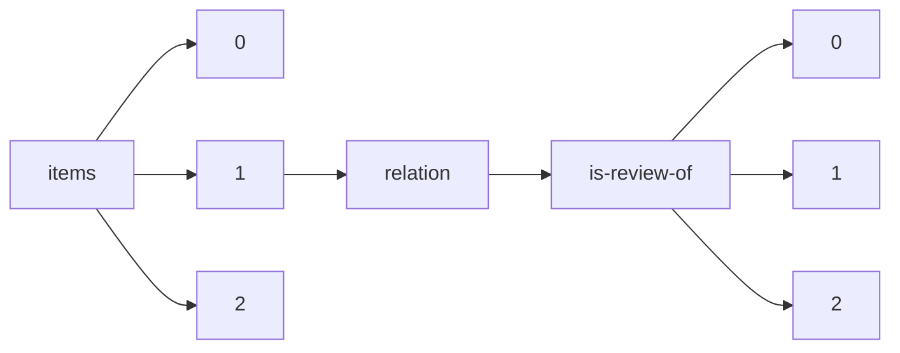

!!! warning "This document is not official Crossref documentation"
# Elements
PATH = items/array/relation/is-review-of/array(1)  
Occurs 636 290 times  
{ .annotate }

1. A route to an element, for example:  
   The route "items/array/relation/is-review-of/array" corresponds to navigating through the JSON indices as  
   ["items"][0]["relation"]["is-review-of"][0]  

## Asserted-by
See more information: [items/array/relation/is-review-of/array/asserted-by](asserted-by/index.md)  
Occurs 636 290 timess  
Unique values: 2  

| **Row** | **Value** `String` | **Count** `Int64` |
|--------:|----------------------:|---------------------:|
| **1**   | subject               | 593 041              |
| **2**   | object                | 43 249               |

## Id
See more information: [items/array/relation/is-review-of/array/id](id/index.md)  
Occurs 636 290 timess  
Unique values: > 999  

!!! note "Due to current limitations, only the first 1,000 unique values are counted."

| **Row** | **Value** `String`     | **Count** `Int64` |
|--------:|--------------------------:|---------------------:|
| **1**   |                           | 82                   |
| **2**   | 10.5194/nhess-21-363-2021 | 36                   |
| **3**   | 10.5194/se-2015-134       | 34                   |
| **4**   | 10.5194/soil-8-655-2022   | 32                   |
| **5**   | 10.1002/VMS3.475          | 29                   |
| **6**   | 10.1002/VMS3.763          | 27                   |
| **7**   | 10.5194/esd-7-597-2016    | 26                   |
| **8**   | 10.1002/VMS3.941          | 25                   |
| **9**   | 10.32388/6WOPAL.2         | 24                   |
| **10**  | 10.5194/cp-13-93-2017     | 24                   |
| ... | ... | ... |

## Id-type
See more information: [items/array/relation/is-review-of/array/id-type](id-type/index.md)  
Occurs 636 290 timess  
Unique values: 7  

| **Row** | **Value** `String` | **Count** `Int64` |
|--------:|----------------------:|---------------------:|
| **1**   | doi                   | 627 998              |
| **2**   | pmid                  | 6 760                |
| **3**   | uri                   | 1 287                |
| **4**   | isbn                  | 108                  |
| **5**   | issn                  | 102                  |
| **6**   | other                 | 24                   |
| **7**   | arxiv                 | 11                   |

