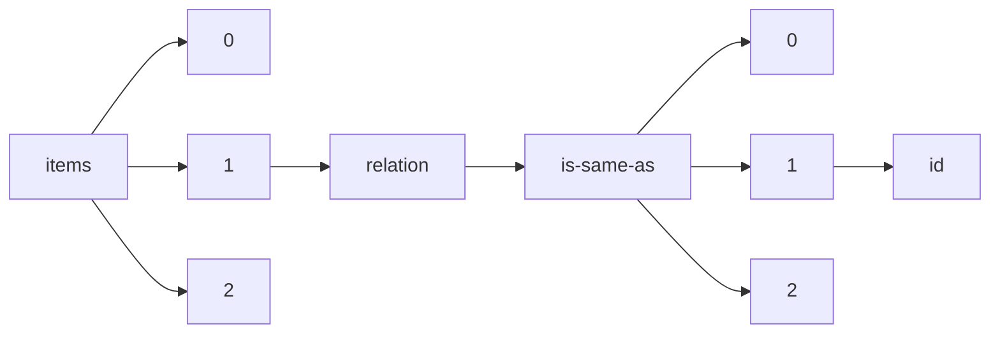

!!! warning "This document is not official Crossref documentation"
# Id
PATH = items/array/relation/is-same-as/array/id(1)  
Occurs 4 564 times  
Unique values: > 999  
{ .annotate }

1. A route to an element, for example:  
   The route "items/array/relation/is-same-as/array/id" corresponds to navigating through the JSON indices as  
   ["items"][0]["relation"]["is-same-as"][0]["id"]  

!!! note "Due to current limitations, only the first 1,000 unique values are counted."

| **Row** | **Value** `String`                           | **Count** `Int64` |
|--------:|------------------------------------------------:|---------------------:|
| **1**   | https://hal.science/hal-01110947v1              | 2                    |
| **2**   | 10.48550/arXiv.2202.04038                       | 2                    |
| **3**   | 2006.05433                                      | 1                    |
| **4**   | 10.48550/arXiv.2205.12264                       | 1                    |
| **5**   | https://hal.science/hal-03178153v1              | 1                    |
| **6**   | https://hal.science/hal-01186285v1              | 1                    |
| **7**   | https://hal.science/hal-03159897v1              | 1                    |
| **8**   | https://hal.science/hal-00961106v1              | 1                    |
| **9**   | 10.48550/arXiv.1610.00754                       | 1                    |
| **10**  | https://hal.science/hal-01349042v1              | 1                    |
| **11**  | https://hal.science/hal-03174084v1              | 1                    |
| **12**  | 10.48550/arXiv.2005.12582                       | 1                    |
| **13**  | https://hal.science/hal-02463141v4              | 1                    |
| **14**  | 2003.05399                                      | 1                    |
| **15**  | https://hal.science/hal-02166056v1              | 1                    |
| **16**  | https://hal.science/hal-01179225v1              | 1                    |
| **17**  | https://hal.science/hal-01337786v1              | 1                    |
| **18**  | https://hal.science/hal-01277779v1              | 1                    |
| **19**  | https://hal.science/hal-03426910v4              | 1                    |
| **20**  | https://hal.science/hal-01283150v1              | 1                    |
| **21**  | https://hal.science/hal-01215094v1              | 1                    |
| **22**  | https://hal.science/hal-01207578v1              | 1                    |
| **23**  | https://hal.science/hal-00130117v2              | 1                    |
| **24**  | https://hal.science/hal-01185602v1              | 1                    |
| **25**  | 10.48550/arXiv.1312.6675                        | 1                    |
| **26**  | https://hal.science/hal-03208519v1              | 1                    |
| **27**  | 10.48550/arXiv.2203.01713                       | 1                    |
| **28**  | 10.48550/arXiv.2106.03231                       | 1                    |
| **29**  | 10.48550/arXiv.1812.00755                       | 1                    |
| **30**  | https://hal.science/hal-03177458v1              | 1                    |
| **31**  | https://hal.science/hal-03181897v1              | 1                    |
| **32**  | https://hal.science/hal-01196846v1              | 1                    |
| **33**  | https://hal.science/hal-03178409v1              | 1                    |
| **34**  | https://hal.science/hal-01185142v1              | 1                    |
| **35**  | 2211.17099                                      | 1                    |
| **36**  | https://hal.science/hal-01184444v1              | 1                    |
| **37**  | https://hal.science/hal-03173669v1              | 1                    |
| **38**  | 2105.14843                                      | 1                    |
| **39**  | https://hal.science/hal-02957425v3              | 1                    |
| **40**  | https://hal.science/hal-01184349v1              | 1                    |
| **41**  | https://hal.science/hal-00961102v1              | 1                    |
| **42**  | https://hal.science/hal-00958944v1              | 1                    |
| **43**  | 10.48550/arXiv.1404.7458                        | 1                    |
| **44**  | https://hal.science/hal-02166330v1              | 1                    |
| **45**  | https://hal.science/hal-01059152v1              | 1                    |
| **46**  | https://hal.science/hal-01186254v1              | 1                    |
| **47**  | https://hal.science/hal-01337810v1              | 1                    |
| **48**  | 2211.16484                                      | 1                    |
| **49**  | 2004.14526                                      | 1                    |
| **50**  | https://hal.science/hal-01183923v1              | 1                    |
| **51**  | arXiv:2102.00859                                | 1                    |
| **52**  | https://hal.science/hal-01337789v1              | 1                    |
| **53**  | https://hal.science/hal-02173390v1              | 1                    |
| **54**  | https://hal.science/hal-02557636v4              | 1                    |
| **55**  | https://hal.archives-ouvertes.fr/hal-02173748v1 | 1                    |
| **56**  | https://hal.science/hal-01272683v1              | 1                    |
| **57**  | 10.48550/arXiv.2210.02708                       | 1                    |
| **58**  | https://hal.science/hal-01184390v1              | 1                    |
| **59**  | https://hal.science/hal-00959037v1              | 1                    |
| **60**  | https://hal.science/hal-03171178v1              | 1                    |
| **61**  | https://hal.science/hal-03565511v9              | 1                    |
| **62**  | https://hal.science/hal-01183335v1              | 1                    |
| **63**  | https://hal.science/hal-01185420v1              | 1                    |
| **64**  | https://hal.science/hal-03494856v1              | 1                    |
| **65**  | https://hal.science/hal-00151979v1              | 1                    |
| **66**  | https://hal.science/hal-00966384v1              | 1                    |
| **67**  | https://hal.science/hal-01184036v1              | 1                    |
| **68**  | https://hal.science/hal-02154122v2              | 1                    |
| **69**  | https://hal.science/hal-02554234v1              | 1                    |
| **70**  | https://hal.science/hal-03178552v1              | 1                    |
| **71**  | 2011.14165                                      | 1                    |
| **72**  | 10.48550/arXiv.2211.08907                       | 1                    |
| **73**  | https://hal.science/hal-01179222v1              | 1                    |
| **74**  | https://hal.science/hal-01183334v1              | 1                    |
| **75**  | https://hal.science/hal-03200129v1              | 1                    |
| **76**  | https://hal.science/hal-01186315v1              | 1                    |
| **77**  | https://hal.science/hal-01286643v1              | 1                    |
| **78**  | https://hal.science/hal-01277924v1              | 1                    |
| **79**  | https://hal.science/hal-01981922v3              | 1                    |
| **80**  | https://hal.science/hal-03178358v1              | 1                    |
| **81**  | https://hal.science/hal-00958956v1              | 1                    |
| **82**  | https://hal.science/hal-01196866v1              | 1                    |
| **83**  | https://hal.science/hal-03183199v1              | 1                    |
| **84**  | 1701.04786                                      | 1                    |
| **85**  | https://hal.science/hal-03710676v1              | 1                    |
| **86**  | https://hal.science/hal-01185601v1              | 1                    |
| **87**  | https://hal.science/hal-01494040v1              | 1                    |
| **88**  | https://hal.science/hal-01352839v1              | 1                    |
| **89**  | 2201.09269                                      | 1                    |
| **90**  | 10.7554/eLife.80494.1                           | 1                    |
| **91**  | https://hal.science/emse-00862800v1             | 1                    |
| **92**  | https://hal.science/hal-01263495v1              | 1                    |
| **93**  | 10.48550/arXiv.2101.04819                       | 1                    |
| **94**  | https://hal.science/hal-01179216v1              | 1                    |
| **95**  | https://hal.science/hal-01811973v2              | 1                    |
| **96**  | 10.48550/arXiv.2211.12318                       | 1                    |
| **97**  | https://hal.science/hal-01185577v1              | 1                    |
| **98**  | 10.48550/arXiv.1810.07822                       | 1                    |
| **99**  | 1612.04206                                      | 1                    |
| **100** | https://hal.science/hal-03220182v1              | 1                    |
| **101** | 2010.08382                                      | 1                    |
| **102** | https://hal.science/hal-01194661v1              | 1                    |
| **103** | https://hal.science/hal-00634186v1              | 1                    |
| **104** | https://hal.science/hal-01194690v1              | 1                    |
| **105** | 10.48550/arXiv.1510.05070                       | 1                    |
| **106** | 2011.14303                                      | 1                    |
| **107** | https://hal.science/hal-02053350v1              | 1                    |
| **108** | https://hal.science/hal-03159768v1              | 1                    |
| **109** | 10.48550/arXiv.2011.15013                       | 1                    |
| **110** | https://hal.science/hal-01263435v1              | 1                    |
| **111** | https://hal.science/hal-00622708v1              | 1                    |
| **112** | https://hal.science/hal-03159165v1              | 1                    |
| **113** | https://hal.science/hal-03098095v5              | 1                    |
| **114** | 2104.02446                                      | 1                    |
| **115** | https://hal.science/hal-01215103v1              | 1                    |
| **116** | 1903.06981                                      | 1                    |
| **117** | https://hal.science/hal-01182979v1              | 1                    |
| **118** | https://hal.science/hal-03710266v1              | 1                    |
| **119** | 2212.06321                                      | 1                    |
| **120** | https://hal.science/hal-01184386v1              | 1                    |
| **121** | 2101.06757                                      | 1                    |
| **122** | 2006.02887                                      | 1                    |
| **123** | https://hal.science/hal-00990609v1              | 1                    |
| **124** | https://hal.science/hal-03175437v1              | 1                    |
| **125** | https://hal.science/hal-01183925v1              | 1                    |
| **126** | https://hal.science/hal-00990608v1              | 1                    |
| **127** | https://hal.science/hal-00958936v1              | 1                    |
| **128** | 10.48550/arXiv.1609.01979                       | 1                    |
| **129** | https://hal.science/hal-01371751v3              | 1                    |
| **130** | https://hal.science/hal-03160359v1              | 1                    |
| **131** | https://hal.science/hal-03170867v1              | 1                    |
| **132** | https://hal.science/hal-03183194v1              | 1                    |
| **133** | https://hal.science/hal-01263434v1              | 1                    |
| **134** | https://hal.science/hal-00988215v1              | 1                    |
| **135** | 1906.04199                                      | 1                    |
| **136** | https://hal.science/hal-02173374v1              | 1                    |
| **137** | https://hal.science/hal-03160024v1              | 1                    |
| **138** | 10.48550/arXiv.1908.10986                       | 1                    |
| **139** | https://hal.science/hal-03181743v1              | 1                    |
| **140** | https://hal.science/hal-01112352v1              | 1                    |
| **141** | https://hal.science/hal-00990427v1              | 1                    |
| **142** | 10.48550/arXiv.1905.12597                       | 1                    |
| **143** | https://hal.science/hal-00990460v1              | 1                    |
| **144** | 2009.13065                                      | 1                    |
| **145** | https://hal.science/hal-01186275v1              | 1                    |
| **146** | https://hal.science/hal-03157155v1              | 1                    |
| **147** | 2101.06732                                      | 1                    |
| **148** | https://hal.science/hal-01986591v1              | 1                    |
| **149** | https://hal.science/hal-03183184v1              | 1                    |
| **150** | https://hal.science/hal-01300088v1              | 1                    |
| **151** | 10.48550/arXiv.2012.04802                       | 1                    |
| **152** | https://hal.science/hal-01184355v1              | 1                    |
| **153** | https://hal.science/hal-00972309v1              | 1                    |
| **154** | https://hal.science/hal-03251270v4              | 1                    |
| **155** | 2210.04636                                      | 1                    |
| **156** | https://hal.science/hal-02173388v1              | 1                    |
| **157** | 2111.08980                                      | 1                    |
| **158** | https://hal.science/hal-01185379v1              | 1                    |
| **159** | https://hal.science/hal-03710428v1              | 1                    |
| **160** | https://hal.science/hal-02166329v1              | 1                    |
| **161** | https://hal.science/hal-01185619v1              | 1                    |
| **162** | https://hal.science/hal-00966381v1              | 1                    |
| **163** | 10.48550/arXiv.2106.06745                       | 1                    |
| **164** | 1306.3193                                       | 1                    |
| **165** | https://hal.science/hal-01300055v1              | 1                    |
| **166** | 1902.02601                                      | 1                    |
| **167** | https://hal.science/hal-01207542v1              | 1                    |
| **168** | https://hal.science/hal-01337788v1              | 1                    |
| **169** | 1511.01076                                      | 1                    |
| **170** | https://hal.science/hal-03181906v1              | 1                    |
| **171** | https://hal.science/hal-01186303v1              | 1                    |
| **172** | https://hal.science/hal-01112083v1              | 1                    |
| **173** | https://hal.science/hal-00990455v1              | 1                    |
| **174** | https://hal.science/hal-01261711v1              | 1                    |
| **175** | https://hal.science/hal-03685992v1              | 1                    |
| **176** | https://hal.science/hal-01444574v2              | 1                    |
| **177** | 10.48550/arXiv.1602.02941                       | 1                    |
| **178** | https://hal.science/hal-00959034v1              | 1                    |
| **179** | 10.48550/arXiv.1804.04861                       | 1                    |
| **180** | https://hal.science/hal-00990458v1              | 1                    |
| **181** | 1807.04892                                      | 1                    |
| **182** | 2104.11123                                      | 1                    |
| **183** | https://hal.science/hal-01196857v1              | 1                    |
| **184** | 10.48550/arXiv.2012.08626                       | 1                    |
| **185** | https://hal.science/hal-01283103v1              | 1                    |
| **186** | https://hal.science/hal-02173378v1              | 1                    |
| **187** | https://hal.science/hal-01109311v1              | 1                    |
| **188** | https://hal.science/hal-01197232v1              | 1                    |
| **189** | https://hal.science/hal-03710584v1              | 1                    |
| **190** | 10.48550/arXiv.1612.07033                       | 1                    |
| **191** | https://hal.science/hal-02166341v1              | 1                    |
| **192** | https://hal.science/hal-01104259v1              | 1                    |
| **193** | https://hal.science/hal-01185388v1              | 1                    |
| **194** | https://hal.science/hal-03705572v1              | 1                    |
| **195** | https://hal.science/hal-01109799v1              | 1                    |
| **196** | 2111.03117                                      | 1                    |
| **197** | 2011.06986                                      | 1                    |
| **198** | https://hal.science/hal-02356180v2              | 1                    |
| **199** | https://hal.science/hal-01185431v1              | 1                    |
| **200** | 2109.15245                                      | 1                    |
| **201** | https://hal.science/hal-00990438v1              | 1                    |
| **202** | 2104.06078                                      | 1                    |
| **203** | 10.48550/arXiv.2109.03025                       | 1                    |
| **204** | https://hal.science/hal-00419982v1              | 1                    |
| **205** | https://hal.science/hal-00958900v1              | 1                    |
| **206** | https://hal.science/hal-02506994v1              | 1                    |
| **207** | https://hal.science/hal-01207596v1              | 1                    |
| **208** | 10.48550/arXiv.2002.02512                       | 1                    |
| **209** | https://hal.science/hal-01185178v1              | 1                    |
| **210** | https://hal.science/hal-01185436v1              | 1                    |
| **211** | https://hal.science/hal-01364442v1              | 1                    |
| **212** | https://hal.science/hal-03182896v1              | 1                    |
| **213** | 2012.01085                                      | 1                    |
| **214** | 10.7554/eLife.85380.1                           | 1                    |
| **215** | https://hal.science/hal-01219299v6              | 1                    |
| **216** | 1812.09987                                      | 1                    |
| **217** | https://hal.science/hal-03697799v1              | 1                    |
| **218** | 10.48550/arXiv.2104.06078                       | 1                    |
| **219** | 10.7554/eLife.84918.1                           | 1                    |
| **220** | https://hal.science/hal-01184681v1              | 1                    |
| **221** | https://hal.science/hal-03322271v5              | 1                    |
| **222** | https://hal.science/hal-03174015v1              | 1                    |
| **223** | 2002.11016                                      | 1                    |
| **224** | https://hal.science/hal-03175741v1              | 1                    |
| **225** | https://hal.science/hal-01697412v3              | 1                    |
| **226** | 10.48550/arXiv.2002.07356                       | 1                    |
| **227** | 1312.4617                                       | 1                    |
| **228** | https://hal.science/hal-01645124v2              | 1                    |
| **229** | https://hal.science/hal-01182958v1              | 1                    |
| **230** | https://hal.science/hal-00959032v1              | 1                    |
| **231** | https://hal.science/hal-01207585v1              | 1                    |
| **232** | https://hal.science/hal-01337840v1              | 1                    |
| **233** | https://hal.science/hal-01184375v1              | 1                    |
| **234** | https://hal.science/hal-01262047v1              | 1                    |
| **235** | https://hal.science/hal-03175413v1              | 1                    |
| **236** | https://hal.science/hal-01185406v1              | 1                    |
| **237** | https://hal.science/hal-01286817v1              | 1                    |
| **238** | 10.48550/arXiv.1511.00080                       | 1                    |
| **239** | https://hal.science/hal-03208199v1              | 1                    |
| **240** | https://hal.science/hal-03704516v1              | 1                    |
| **241** | https://hal.science/emse-00410292v1             | 1                    |
| **242** | https://hal.science/hal-03175203v1              | 1                    |
| **243** | https://hal.science/hal-01112329v1              | 1                    |
| **244** | https://hal.science/hal-03208492v1              | 1                    |
| **245** | 10.48550/arXiv.1601.01602                       | 1                    |
| **246** | 10.48550/arXiv.1909.02579                       | 1                    |
| **247** | https://hal.science/hal-01185440v1              | 1                    |
| **248** | https://hal.science/hal-01184354v1              | 1                    |
| **249** | 2211.15655                                      | 1                    |
| **250** | https://hal.science/hal-03710527v1              | 1                    |
| **251** | https://hal.science/hal-03181726v1              | 1                    |
| **252** | https://hal.science/hal-01320356v1              | 1                    |
| **253** | https://hal.science/hal-03172012v1              | 1                    |
| **254** | 1609.06058                                      | 1                    |
| **255** | https://hal.science/hal-01104228v1              | 1                    |
| **256** | 2101.03402                                      | 1                    |
| **257** | https://hal.science/hal-03173045v2              | 1                    |
| **258** | https://hal.science/hal-03704519v1              | 1                    |
| **259** | 10.48550/arXiv.2302.09428                       | 1                    |
| **260** | https://hal.science/hal-03178396v1              | 1                    |
| **261** | 10.48550/arXiv.2006.11836                       | 1                    |
| **262** | https://hal.science/hal-01185402v1              | 1                    |
| **263** | https://hal.science/hal-03710944v1              | 1                    |
| **264** | https://hal.science/hal-03182979v1              | 1                    |
| **265** | 2108.10718                                      | 1                    |
| **266** | 2101.02994                                      | 1                    |
| **267** | https://hal.science/hal-01283116v1              | 1                    |
| **268** | https://hal.science/hal-03218388v3              | 1                    |
| **269** | https://hal.science/hal-03704562v1              | 1                    |
| **270** | 2012.12638                                      | 1                    |
| **271** | 10.48550/arXiv.1912.05082                       | 1                    |
| **272** | 10.48550/arXiv.2008.11494                       | 1                    |
| **273** | https://hal.science/hal-03180513v1              | 1                    |
| **274** | https://hal.science/hal-03710910v1              | 1                    |
| **275** | 2003.01491                                      | 1                    |
| **276** | 10.48550/arXiv.2109.15245                       | 1                    |
| **277** | https://hal.science/hal-02173749v1              | 1                    |
| **278** | https://hal.science/hal-00990464v1              | 1                    |
| **279** | https://hal.science/hal-01197245v1              | 1                    |
| **280** | https://hal.science/hal-03704571v1              | 1                    |
| **281** | 1708.08058                                      | 1                    |
| **282** | https://hal.science/hal-03160210v1              | 1                    |
| **283** | https://hal.science/hal-03415974v1              | 1                    |
| **284** | https://hal.science/hal-01207613v1              | 1                    |
| **285** | https://hal.science/hal-03721404v1              | 1                    |
| **286** | https://hal.science/hal-00990425v1              | 1                    |
| **287** | 2205.15185                                      | 1                    |
| **288** | https://hal.science/hal-03208204v1              | 1                    |
| **289** | 10.48550/arXiv.2209.05113                       | 1                    |
| **290** | 10.48550/arXiv.1805.02551                       | 1                    |
| **291** | https://hal.science/hal-01215102v1              | 1                    |
| **292** | https://hal.science/hal-01185128v1              | 1                    |
| **293** | https://hal.science/hal-01337797v1              | 1                    |
| **294** | https://hal.science/hal-01184360v1              | 1                    |
| **295** | 10.48550/arXiv.2006.13635                       | 1                    |
| **296** | https://hal.science/hal-03173263v1              | 1                    |
| **297** | 1807.05808                                      | 1                    |
| **298** | https://hal.science/hal-01283127v1              | 1                    |
| **299** | https://hal.science/hal-02166327v1              | 1                    |
| **300** | https://hal.science/hal-01196854v1              | 1                    |
| **301** | 2205.03640                                      | 1                    |
| **302** | 10.48550/arXiv.2003.10774                       | 1                    |
| **303** | 10.48550/arXiv.2211.16484                       | 1                    |
| **304** | https://hal.science/hal-01194667v1              | 1                    |
| **305** | https://hal.science/hal-01186255v1              | 1                    |
| **306** | https://hal.science/hal-03710929v1              | 1                    |
| **307** | 2301.01524                                      | 1                    |
| **308** | https://hal.science/hal-01735705v1              | 1                    |
| **309** | https://hal.science/hal-00713486v1              | 1                    |
| **310** | https://hal.science/hal-01196856v1              | 1                    |
| **311** | https://hal.science/hal-01186298v1              | 1                    |
| **312** | https://hal.science/hal-01186272v1              | 1                    |
| **313** | 2212.06372                                      | 1                    |
| **314** | https://hal.science/hal-01299415v1              | 1                    |
| **315** | 10.18370/2309-4117.2016.29.100-104              | 1                    |
| **316** | 1912.07713                                      | 1                    |
| **317** | https://hal.science/hal-01277777v1              | 1                    |
| **318** | https://hal.science/hal-03710499v1              | 1                    |
| **319** | https://hal.science/hal-00990478v1              | 1                    |
| **320** | https://hal.science/hal-01185376v1              | 1                    |
| **321** | 10.48550/arXiv.2105.10897                       | 1                    |
| **322** | https://hal.science/hal-00959004v1              | 1                    |
| **323** | https://hal.science/hal-03155538v1              | 1                    |
| **324** | https://hal.science/hal-01184029v1              | 1                    |
| **325** | 10.48550/arXiv.2210.12354                       | 1                    |
| **326** | 1505.07437                                      | 1                    |
| **327** | 10.48550/arXiv.2111.11984                       | 1                    |
| **328** | https://hal.science/hal-03159199v1              | 1                    |
| **329** | 2010.00541                                      | 1                    |
| **330** | https://hal.science/hal-01184715v1              | 1                    |
| **331** | https://hal.science/hal-01179214v1              | 1                    |
| **332** | https://hal.science/hal-03710957v1              | 1                    |
| **333** | https://hal.science/hal-03710918v1              | 1                    |
| **334** | 10.48550/arXiv.2106.05473                       | 1                    |
| **335** | 10.48550/arXiv.2006.05433                       | 1                    |
| **336** | 10.17749/2313-7347/ob.gyn.rep.2020.171          | 1                    |
| **337** | https://hal.science/hal-03180770v1              | 1                    |
| **338** | https://hal.science/hal-00823005v2              | 1                    |
| **339** | 1710.10203                                      | 1                    |
| **340** | https://hal.science/hal-01111465v1              | 1                    |
| **341** | https://hal.science/hal-01207541v1              | 1                    |
| **342** | https://hal.science/hal-03414847v1              | 1                    |
| **343** | https://hal.science/hal-01720651v3              | 1                    |
| **344** | https://hal.science/hal-01185565v1              | 1                    |
| **345** | 2205.12308                                      | 1                    |
| **346** | https://hal.science/hal-02584038v1              | 1                    |
| **347** | https://hal.science/hal-01337826v1              | 1                    |
| **348** | https://hal.science/hal-01185373v1              | 1                    |
| **349** | https://hal.science/hal-00990597v1              | 1                    |
| **350** | https://hal.science/hal-01215062v1              | 1                    |
| **351** | 1606.09445                                      | 1                    |
| **352** | 10.7554/eLife.84831.1                           | 1                    |
| **353** | 10.48550/arXiv.1609.05117                       | 1                    |
| **354** | https://hal.science/hal-01184376v1              | 1                    |
| **355** | https://hal.science/hal-03775650v2              | 1                    |
| **356** | https://hal.science/hal-01186294v1              | 1                    |
| **357** | 2102.10828                                      | 1                    |
| **358** | https://hal.science/hal-01215057v1              | 1                    |
| **359** | https://hal.science/hal-01168259v1              | 1                    |
| **360** | 10.48550/arXiv.2112.10426                       | 1                    |
| **361** | https://hal.science/hal-02590558v1              | 1                    |
| **362** | https://hal.science/hal-01184437v1              | 1                    |
| **363** | https://hal.science/hal-00990565v1              | 1                    |
| **364** | https://hal.science/hal-03159215v1              | 1                    |
| **365** | https://hal.science/hal-01184766v1              | 1                    |
| **366** | 2205.03155                                      | 1                    |
| **367** | https://hal.science/hal-00990484v1              | 1                    |
| **368** | 10.48550/arXiv.2211.09278                       | 1                    |
| **369** | https://hal.science/hal-00972319v1              | 1                    |
| **370** | https://hal.science/lirmm-00374066v1            | 1                    |
| **371** | https://hal.science/hal-01058933v1              | 1                    |
| **372** | https://hal.science/hal-03710705v1              | 1                    |
| **373** | https://hal.science/hal-01184384v1              | 1                    |
| **374** | 10.48550/arXiv.2104.13675                       | 1                    |
| **375** | 10.48550/arXiv.2003.01491                       | 1                    |
| **376** | https://hal.science/hal-02168178v1              | 1                    |
| **377** | https://hal.science/hal-03705609v1              | 1                    |
| **378** | https://hal.science/lirmm-00184092v1            | 1                    |
| **379** | https://hal.science/hal-01185399v1              | 1                    |
| **380** | https://hal.science/hal-03704501v1              | 1                    |
| **381** | 2006.11836                                      | 1                    |
| **382** | https://hal.science/hal-01759191v2              | 1                    |
| **383** | https://hal.science/hal-03710454v1              | 1                    |
| **384** | https://hal.science/hal-01184794v1              | 1                    |
| **385** | https://hal.science/hal-01184679v1              | 1                    |
| **386** | https://hal.science/hal-03618012v3              | 1                    |
| **387** | https://hal.science/hal-01184024v1              | 1                    |
| **388** | https://hal.science/hal-01185125v1              | 1                    |
| **389** | 2211.07163                                      | 1                    |
| **390** | 10.48550/arXiv.1703.01890                       | 1                    |
| **391** | https://hal.science/hal-03323283v1              | 1                    |
| **392** | https://hal.science/hal-01104327v1              | 1                    |
| **393** | 2011.13970                                      | 1                    |
| **394** | https://hal.science/hal-00990481v1              | 1                    |
| **395** | https://hal.science/hal-01111461v1              | 1                    |
| **396** | 10.48550/arXiv.2103.10800                       | 1                    |
| **397** | https://hal.science/hal-03652259v2              | 1                    |
| **398** | https://hal.science/hal-01184707v1              | 1                    |
| **399** | https://hal.science/hal-01196847v1              | 1                    |
| **400** | https://hal.science/hal-03180798v1              | 1                    |
| **401** | 2202.04982                                      | 1                    |
| **402** | 1402.2003                                       | 1                    |
| **403** | https://hal.science/hal-03160019v1              | 1                    |
| **404** | https://hal.science/hal-01104704v1              | 1                    |
| **405** | https://hal.science/hal-03151249v2              | 1                    |
| **406** | https://hal.science/hal-00966382v1              | 1                    |
| **407** | 10.48550/arXiv.1804.05578                       | 1                    |
| **408** | https://hal.science/hal-01183920v1              | 1                    |
| **409** | 2009.06463                                      | 1                    |
| **410** | 2211.10468                                      | 1                    |
| **411** | 1712.05310                                      | 1                    |
| **412** | https://hal.science/hal-01913435v3              | 1                    |
| **413** | 10.48550/arXiv.1908.11642                       | 1                    |
| **414** | https://hal.science/hal-00966517v1              | 1                    |
| **415** | https://hal.science/hal-00972316v1              | 1                    |
| **416** | 10.48550/arXiv.2101.08611                       | 1                    |
| **417** | 2006.12465                                      | 1                    |
| **418** | 10.48550/arXiv.2001.01190                       | 1                    |
| **419** | 10.48550/arXiv.1911.02262                       | 1                    |
| **420** | 2106.09147                                      | 1                    |
| **421** | 2211.11532                                      | 1                    |
| **422** | https://hal.science/hal-01352846v1              | 1                    |
| **423** | https://hal.science/hal-00990607v1              | 1                    |
| **424** | https://hal.science/hal-01104764v1              | 1                    |
| **425** | https://hal.science/hal-01330895v2              | 1                    |
| **426** | https://hal.science/hal-03178195v1              | 1                    |
| **427** | https://hal.science/hal-01215096v1              | 1                    |
| **428** | https://hal.science/hal-01184389v1              | 1                    |
| **429** | https://hal.science/hal-01183918v1              | 1                    |
| **430** | https://hal.science/hal-01349052v1              | 1                    |
| **431** | https://hal.science/hal-03912911v1              | 1                    |
| **432** | https://hal.science/hal-01253639v1              | 1                    |
| **433** | 10.48550/arXiv.2106.01734                       | 1                    |
| **434** | https://hal.science/hal-00958953v1              | 1                    |
| **435** | https://hal.science/hal-01730123v3              | 1                    |
| **436** | https://hal.science/hal-01337805v1              | 1                    |
| **437** | https://hal.science/hal-03181639v1              | 1                    |
| **438** | https://hal.science/hal-01186244v1              | 1                    |
| **439** | https://hal.science/hal-01196138v1              | 1                    |
| **440** | 10.48550/arXiv.1907.08115                       | 1                    |
| **441** | https://hal.science/hal-01112596v1              | 1                    |
| **442** | https://hal.science/hal-01185435v1              | 1                    |
| **443** | https://hal.science/hal-01220303v1              | 1                    |
| **444** | https://hal.science/hal-03181890v1              | 1                    |
| **445** | https://hal.science/hal-01185374v1              | 1                    |
| **446** | https://hal.science/hal-02168298v1              | 1                    |
| **447** | https://hal.science/hal-01337835v1              | 1                    |
| **448** | https://hal.science/hal-01562353v6              | 1                    |
| **449** | 1311.5401                                       | 1                    |
| **450** | https://hal.science/hal-01337799v1              | 1                    |
| **451** | 2104.13675                                      | 1                    |
| **452** | https://hal.science/hal-01166903v1              | 1                    |
| **453** | https://hal.science/hal-01283137v1              | 1                    |
| **454** | 10.48550/arXiv.2205.04309                       | 1                    |
| **455** | 10.48550/arXiv.1805.03349                       | 1                    |
| **456** | 10.48550/arXiv.1905.04566                       | 1                    |
| **457** | https://hal.science/hal-01311161v3              | 1                    |
| **458** | https://hal.science/hal-00450763v4              | 1                    |
| **459** | https://hal.science/hal-01352840v1              | 1                    |
| **460** | https://hal.science/hal-01184441v1              | 1                    |
| **461** | https://hal.science/hal-01207587v1              | 1                    |
| **462** | https://hal.science/hal-03175426v1              | 1                    |
| **463** | https://hal.science/hal-03200397v1              | 1                    |
| **464** | https://hal.science/hal-01349056v1              | 1                    |
| **465** | https://hal.science/hal-03160184v1              | 1                    |
| **466** | https://hal.science/hal-01283124v1              | 1                    |
| **467** | 2006.05156                                      | 1                    |
| **468** | 2108.04711                                      | 1                    |
| **469** | https://hal.science/hal-03323215v1              | 1                    |
| **470** | 2008.03688                                      | 1                    |
| **471** | 2211.09994                                      | 1                    |
| **472** | https://hal.science/hal-02428822v2              | 1                    |
| **473** | https://hal.science/hal-01194686v1              | 1                    |
| **474** | 2002.01455                                      | 1                    |
| **475** | https://hal.science/hal-03583412v3              | 1                    |
| **476** | https://hal.science/hal-02562362v3              | 1                    |
| **477** | https://hal.science/hal-01277784v1              | 1                    |
| **478** | https://hal.science/hal-03183181v1              | 1                    |
| **479** | https://hal.science/hal-00990593v1              | 1                    |
| **480** | https://hal.science/hal-01183915v1              | 1                    |
| **481** | 10.48550/arXiv.2001.03811                       | 1                    |
| **482** | https://hal.science/hal-02053370v1              | 1                    |
| **483** | https://hal.science/hal-01263494v1              | 1                    |
| **484** | 2212.09191                                      | 1                    |
| **485** | https://hal.science/hal-03710708v1              | 1                    |
| **486** | 2102.11350                                      | 1                    |
| **487** | 2012.04802                                      | 1                    |
| **488** | https://hal.science/hal-01277840v1              | 1                    |
| **489** | 10.48550/arXiv.1910.06057                       | 1                    |
| **490** | https://hal.science/hal-01194689v1              | 1                    |
| **491** | 10.48550/arXiv.1505.07437                       | 1                    |
| **492** | https://hal.science/hal-03159888v1              | 1                    |
| **493** | https://hal.science/hal-01337787v1              | 1                    |
| **494** | https://hal.science/hal-00958950v1              | 1                    |
| **495** | https://hal.science/hal-01179217v1              | 1                    |
| **496** | 10.48550/arXiv.2001.06272                       | 1                    |
| **497** | https://hal.science/hal-01349049v1              | 1                    |
| **498** | https://hal.science/hal-01182974v1              | 1                    |
| **499** | https://hal.science/hal-03181620v1              | 1                    |
| **500** | https://hal.science/hal-02168299v1              | 1                    |
| **501** | https://hal.science/hal-01182969v1              | 1                    |
| **502** | https://hal.science/hal-02554227v1              | 1                    |
| **503** | https://hal.science/hal-00961120v1              | 1                    |
| **504** | https://hal.science/hal-00958986v1              | 1                    |
| **505** | https://hal.science/hal-03183180v1              | 1                    |
| **506** | https://hal.science/hal-03498190v1              | 1                    |
| **507** | https://hal.science/hal-01983260v1              | 1                    |
| **508** | https://hal.science/hal-01277832v1              | 1                    |
| **509** | 10.48550/arXiv.2009.06463                       | 1                    |
| **510** | https://hal.science/hal-00990600v1              | 1                    |
| **511** | https://hal.science/hal-03498194v1              | 1                    |
| **512** | https://hal.science/hal-01184445v1              | 1                    |
| **513** | 1909.12386                                      | 1                    |
| **514** | https://hal.science/emse-00855034v1             | 1                    |
| **515** | https://hal.science/hal-01184365v1              | 1                    |
| **516** | 2007.07401                                      | 1                    |
| **517** | https://hal.science/hal-01188906v1              | 1                    |
| **518** | 2104.04800                                      | 1                    |
| **519** | https://hal.science/hal-03914261v1              | 1                    |
| **520** | 10.48550/arXiv.2101.07038                       | 1                    |
| **521** | https://hal.science/hal-03156808v1              | 1                    |
| **522** | 2203.09909                                      | 1                    |
| **523** | https://hal.science/hal-01184037v1              | 1                    |
| **524** | 10.48550/arXiv.2112.12840                       | 1                    |
| **525** | 2009.11758                                      | 1                    |
| **526** | https://hal.science/hal-03174433v1              | 1                    |
| **527** | https://hal.science/hal-01331884v2              | 1                    |
| **528** | https://hal.science/hal-01185144v1              | 1                    |
| **529** | 10.48550/arXiv.2009.04679                       | 1                    |
| **530** | https://hal.science/hal-03181637v1              | 1                    |
| **531** | https://hal.science/hal-03180584v1              | 1                    |
| **532** | 10.48550/arXiv.2112.03897                       | 1                    |
| **533** | https://hal.science/hal-01984492v1              | 1                    |
| **534** | 10.48550/arXiv.2212.08177                       | 1                    |
| **535** | https://hal.science/hal-01337828v1              | 1                    |
| **536** | https://hal.science/hal-01456090v2              | 1                    |
| **537** | https://hal.science/hal-01265297v2              | 1                    |
| **538** | https://hal.science/hal-00961104v1              | 1                    |
| **539** | 10.48550/arXiv.1910.08975                       | 1                    |
| **540** | 1907.10816                                      | 1                    |
| **541** | https://hal.science/hal-01184450v1              | 1                    |
| **542** | https://hal.science/hal-01197237v1              | 1                    |
| **543** | 1910.02791                                      | 1                    |
| **544** | 10.48550/arXiv.2012.07807                       | 1                    |
| **545** | https://hal.science/hal-01337753v1              | 1                    |
| **546** | https://hal.science/hal-00980769v1              | 1                    |
| **547** | https://hal.science/hal-03181908v1              | 1                    |
| **548** | https://hal.science/hal-00988210v1              | 1                    |
| **549** | https://hal.science/hal-00579823v1              | 1                    |
| **550** | 10.48550/arXiv.2208.13284                       | 1                    |
| **551** | https://hal.science/hal-00990473v1              | 1                    |
| **552** | https://hal.science/hal-03710677v1              | 1                    |
| **553** | https://hal.science/hal-01522844v1              | 1                    |
| **554** | https://hal.science/hal-00452702v2              | 1                    |
| **555** | 2106.07388                                      | 1                    |
| **556** | https://hal.science/hal-00958962v1              | 1                    |
| **557** | https://hal.science/hal-00988213v1              | 1                    |
| **558** | https://hal.science/hal-01186261v1              | 1                    |
| **559** | 10.48550/arXiv.2211.11897                       | 1                    |
| **560** | https://hal.science/hal-01179219v1              | 1                    |
| **561** | https://hal.science/hal-03182492v1              | 1                    |
| **562** | https://hal.science/hal-03176829v1              | 1                    |
| **563** | 10.48550/arXiv.2011.13970                       | 1                    |
| **564** | https://hal.science/hal-02166349v1              | 1                    |
| **565** | https://hal.science/hal-01184714v1              | 1                    |
| **566** | https://hal.science/hal-00990612v1              | 1                    |
| **567** | https://hal.science/hal-03251104v2              | 1                    |
| **568** | 10.7554/eLife.84537.1                           | 1                    |
| **569** | https://hal.science/hal-03914253v1              | 1                    |
| **570** | https://hal.science/hal-01215072v1              | 1                    |
| **571** | https://hal.science/hal-03159301v1              | 1                    |
| **572** | 10.48550/arXiv.0903.5505                        | 1                    |
| **573** | 1908.05953                                      | 1                    |
| **574** | 2201.10867                                      | 1                    |
| **575** | https://hal.science/hal-02520508v3              | 1                    |
| **576** | https://hal.science/hal-01337771v1              | 1                    |
| **577** | https://hal.science/hal-01207590v1              | 1                    |
| **578** | https://hal.science/hal-03178398v1              | 1                    |
| **579** | 10.48550/arXiv.2004.08732                       | 1                    |
| **580** | 2002.09784                                      | 1                    |
| **581** | https://hal.science/hal-01185567v1              | 1                    |
| **582** | https://hal.science/hal-03323263v1              | 1                    |
| **583** | https://hal.science/hal-01058930v1              | 1                    |
| **584** | https://hal.science/hal-01283167v1              | 1                    |
| **585** | https://hal.science/hal-00999966v2              | 1                    |
| **586** | https://hal.science/hal-03430949v2              | 1                    |
| **587** | https://hal.science/hal-03323279v1              | 1                    |
| **588** | https://hal.science/hal-03169123v3              | 1                    |
| **589** | https://hal.science/hal-01283114v1              | 1                    |
| **590** | https://hal.science/hal-00853123v1              | 1                    |
| **591** | https://hal.science/hal-01444570v2              | 1                    |
| **592** | https://hal.science/hal-00972327v1              | 1                    |
| **593** | https://hal.science/hal-01207576v1              | 1                    |
| **594** | https://hal.science/hal-01235211v2              | 1                    |
| **595** | 10.48550/arXiv.2212.11147                       | 1                    |
| **596** | https://hal.science/hal-01721304v2              | 1                    |
| **597** | https://hal.science/hal-03723418v3              | 1                    |
| **598** | https://hal.science/hal-01277781v1              | 1                    |
| **599** | https://hal.science/hal-01186311v1              | 1                    |
| **600** | https://hal.science/hal-02130655v1              | 1                    |
| **601** | https://hal.science/hal-02926523v2              | 1                    |
| **602** | https://hal.science/hal-01185395v1              | 1                    |
| **603** | 2104.05262                                      | 1                    |
| **604** | https://hal.science/hal-03414823v1              | 1                    |
| **605** | https://hal.science/hal-00958981v1              | 1                    |
| **606** | https://hal.science/hal-01320619v1              | 1                    |
| **607** | 10.48550/arXiv.2205.03640                       | 1                    |
| **608** | 2009.10651                                      | 1                    |
| **609** | https://hal.science/hal-00966383v1              | 1                    |
| **610** | https://hal.science/hal-01283138v1              | 1                    |
| **611** | 10.48550/arXiv.2301.04728                       | 1                    |
| **612** | https://hal.science/hal-01262044v1              | 1                    |
| **613** | https://hal.science/hal-03704529v1              | 1                    |
| **614** | https://hal.science/hal-00691510v1              | 1                    |
| **615** | 1908.10986                                      | 1                    |
| **616** | 10.48550/arXiv.2109.07924                       | 1                    |
| **617** | https://hal.science/hal-01185165v1              | 1                    |
| **618** | https://hal.science/hal-01194666v1              | 1                    |
| **619** | 10.48550/arXiv.1402.2003                        | 1                    |
| **620** | https://hal.science/hal-03155631v1              | 1                    |
| **621** | 1506.03779                                      | 1                    |
| **622** | https://hal.science/hal-03178157v1              | 1                    |
| **623** | https://hal.science/hal-02168300v1              | 1                    |
| **624** | https://hal.science/hal-03171752v1              | 1                    |
| **625** | https://hal.science/hal-03159742v1              | 1                    |
| **626** | https://hal.science/hal-01261701v1              | 1                    |
| **627** | https://hal.science/hal-01112676v1              | 1                    |
| **628** | https://hal.science/hal-01186236v1              | 1                    |
| **629** | https://hal.science/hal-00955689v1              | 1                    |
| **630** | https://hal.science/hal-03178566v1              | 1                    |
| **631** | https://hal.science/hal-01109313v1              | 1                    |
| **632** | https://hal.science/hal-02506928v1              | 1                    |
| **633** | 10.48550/arXiv.2012.13156                       | 1                    |
| **634** | 10.48550/arXiv.1208.3778                        | 1                    |
| **635** | https://hal.science/hal-01184697v1              | 1                    |
| **636** | https://hal.science/hal-03182891v1              | 1                    |
| **637** | https://hal.science/hal-03541619v3              | 1                    |
| **638** | https://hal.science/hal-02461884v4              | 1                    |
| **639** | https://hal.science/hal-01337793v1              | 1                    |
| **640** | https://hal.science/hal-01207604v1              | 1                    |
| **641** | https://hal.science/hal-01320616v1              | 1                    |
| **642** | https://hal.science/hal-03156271v1              | 1                    |
| **643** | 1510.08036                                      | 1                    |
| **644** | https://hal.science/hal-03721417v1              | 1                    |
| **645** | https://hal.science/hal-02679959v1              | 1                    |
| **646** | https://hal.science/hal-03710258v1              | 1                    |
| **647** | https://hal.science/hal-01182963v1              | 1                    |
| **648** | https://hal.science/hal-00990598v1              | 1                    |
| **649** | 10.48550/arXiv.1712.05310                       | 1                    |
| **650** | https://hal.science/hal-03710891v1              | 1                    |
| **651** | https://hal.science/hal-01196142v1              | 1                    |
| **652** | 10.48550/arXiv.1910.14534                       | 1                    |
| **653** | https://hal.science/hal-02927009v3              | 1                    |
| **654** | https://hal.science/hal-03170737v1              | 1                    |
| **655** | https://hal.science/hal-03182701v1              | 1                    |
| **656** | https://hal.science/hal-00994977v1              | 1                    |
| **657** | https://hal.science/hal-03181534v1              | 1                    |
| **658** | 1702.08903                                      | 1                    |
| **659** | https://hal.science/hal-03181601v1              | 1                    |
| **660** | 2002.11494                                      | 1                    |
| **661** | https://hal.science/hal-03177536v1              | 1                    |
| **662** | https://hal.science/hal-00990449v1              | 1                    |
| **663** | https://hal.science/hal-03171166v1              | 1                    |
| **664** | 10.48550/arXiv.2211.11118                       | 1                    |
| **665** | 10.48550/arXiv.2106.12361                       | 1                    |
| **666** | 1512.02171                                      | 1                    |
| **667** | 2012.06530                                      | 1                    |
| **668** | https://hal.science/hal-03704553v1              | 1                    |
| **669** | https://hal.science/hal-01185383v1              | 1                    |
| **670** | https://hal.science/hal-01425555v1              | 1                    |
| **671** | https://hal.science/hal-01185443v1              | 1                    |
| **672** | https://hal.science/hal-00980770v1              | 1                    |
| **673** | 1907.01535                                      | 1                    |
| **674** | https://hal.science/hal-01184042v1              | 1                    |
| **675** | https://hal.science/hal-03175753v1              | 1                    |
| **676** | https://hal.science/hal-00972331v1              | 1                    |
| **677** | https://hal.science/hal-00990431v1              | 1                    |
| **678** | https://hal.science/hal-03704593v1              | 1                    |
| **679** | https://hal.science/hal-00955692v1              | 1                    |
| **680** | https://hal.science/hal-01184213v1              | 1                    |
| **681** | 1609.01979                                      | 1                    |
| **682** | https://hal.science/hal-01263438v1              | 1                    |
| **683** | https://hal.science/hal-01185160v1              | 1                    |
| **684** | 2005.00751                                      | 1                    |
| **685** | 1905.04566                                      | 1                    |
| **686** | https://hal.science/hal-01986722v1              | 1                    |
| **687** | 1908.11642                                      | 1                    |
| **688** | https://hal.science/hal-03110877v3              | 1                    |
| **689** | https://hal.science/hal-00958925v1              | 1                    |
| **690** | 1510.06328                                      | 1                    |
| **691** | https://hal.science/hal-01024985v4              | 1                    |
| **692** | 10.48550/arXiv.1607.08199                       | 1                    |
| **693** | https://hal.science/hal-03183220v1              | 1                    |
| **694** | 2105.06723                                      | 1                    |
| **695** | https://hal.science/hal-01215079v1              | 1                    |
| **696** | https://hal.science/hal-01104695v1              | 1                    |
| **697** | https://hal.science/hal-01283101v1              | 1                    |
| **698** | https://hal.science/hal-00990445v1              | 1                    |
| **699** | 10.48550/arXiv.2008.00583                       | 1                    |
| **700** | 10.48550/arXiv.1903.03874                       | 1                    |
| **701** | 10.48550/arXiv.2101.06825                       | 1                    |
| **702** | 2203.01713                                      | 1                    |
| **703** | 1804.07832                                      | 1                    |
| **704** | https://hal.science/hal-01185138v1              | 1                    |
| **705** | https://hal.science/hal-01190028v1              | 1                    |
| **706** | https://hal.science/hal-00384461v2              | 1                    |
| **707** | https://hal.science/hal-01196143v1              | 1                    |
| **708** | https://hal.science/hal-01263452v1              | 1                    |
| **709** | https://hal.science/hal-02507006v1              | 1                    |
| **710** | https://hal.science/hal-03160174v1              | 1                    |
| **711** | https://hal.science/hal-03181898v1              | 1                    |
| **712** | 2210.13332                                      | 1                    |
| **713** | https://hal.science/hal-01183939v1              | 1                    |
| **714** | https://hal.science/hal-01197246v1              | 1                    |
| **715** | https://hal.science/hal-03182675v1              | 1                    |
| **716** | https://hal.science/hal-02145920v3              | 1                    |
| **717** | https://hal.science/hal-02307784v3              | 1                    |
| **718** | 10.48550/arXiv.2001.03894                       | 1                    |
| **719** | 10.48550/arXiv.2211.15922                       | 1                    |
| **720** | https://hal.science/hal-00972339v1              | 1                    |
| **721** | https://hal.science/hal-00990602v1              | 1                    |
| **722** | https://hal.science/hal-03705525v1              | 1                    |
| **723** | https://hal.science/hal-01183309v1              | 1                    |
| **724** | 2107.00319                                      | 1                    |
| **725** | 10.48550/arXiv.1710.06887                       | 1                    |
| **726** | https://hal.science/hal-02173391v1              | 1                    |
| **727** | 2105.06744                                      | 1                    |
| **728** | https://hal.science/hal-01898173v1              | 1                    |
| **729** | https://hal.science/hal-01692833v1              | 1                    |
| **730** | https://hal.science/hal-03181635v1              | 1                    |
| **731** | 2011.13451                                      | 1                    |
| **732** | https://hal.science/hal-01184801v1              | 1                    |
| **733** | 10.48550/arXiv.2002.11920                       | 1                    |
| **734** | https://hal.science/hal-01185438v1              | 1                    |
| **735** | https://hal.science/hal-02025064v2              | 1                    |
| **736** | https://hal.science/hal-01186237v1              | 1                    |
| **737** | https://hal.science/hal-03720576v2              | 1                    |
| **738** | https://hal.science/hal-03173236v1              | 1                    |
| **739** | https://hal.science/hal-03725352v1              | 1                    |
| **740** | https://hal.science/hal-00990588v1              | 1                    |
| **741** | https://hal.science/hal-00990441v1              | 1                    |
| **742** | https://hal.science/hal-02508997v1              | 1                    |
| **743** | https://hal.science/hal-01111487v1              | 1                    |
| **744** | https://hal.science/hal-02053244v1              | 1                    |
| **745** | https://hal.science/hal-03181794v1              | 1                    |
| **746** | https://hal.science/hal-03704539v1              | 1                    |
| **747** | https://hal.science/hal-03498249v1              | 1                    |
| **748** | 1510.05434                                      | 1                    |
| **749** | https://hal.science/hal-01313942v2              | 1                    |
| **750** | https://hal.science/hal-01337767v1              | 1                    |
| **751** | https://hal.science/hal-03181599v1              | 1                    |
| **752** | 10.48550/arXiv.1811.09513                       | 1                    |
| **753** | 2103.15702                                      | 1                    |
| **754** | https://hal.science/hal-03200436v1              | 1                    |
| **755** | 1903.06143                                      | 1                    |
| **756** | https://hal.science/hal-01349050v1              | 1                    |
| **757** | https://hal.science/hal-01283123v1              | 1                    |
| **758** | https://hal.science/hal-02480654v5              | 1                    |
| **759** | https://hal.science/hal-00988177v1              | 1                    |
| **760** | https://hal.science/hal-03208276v1              | 1                    |
| **761** | 1510.07190                                      | 1                    |
| **762** | https://hal.science/hal-03178333v1              | 1                    |
| **763** | https://hal.science/hal-03710715v1              | 1                    |
| **764** | https://hal.science/hal-03173225v1              | 1                    |
| **765** | https://hal.science/hal-01184435v1              | 1                    |
| **766** | https://hal.science/hal-01184353v1              | 1                    |
| **767** | https://hal.science/hal-01229732v1              | 1                    |
| **768** | 1810.00960                                      | 1                    |
| **769** | https://hal.science/hal-03171212v1              | 1                    |
| **770** | https://hal.science/hal-01184781v1              | 1                    |
| **771** | https://hal.science/hal-01184767v1              | 1                    |
| **772** | https://hal.science/hal-01304735v1              | 1                    |
| **773** | https://hal.science/hal-01184026v1              | 1                    |
| **774** | https://hal.science/hal-01183338v1              | 1                    |
| **775** | https://hal.science/hal-01984688v1              | 1                    |
| **776** | 10.48550/arXiv.2108.00839                       | 1                    |
| **777** | https://hal.science/hal-01104713v1              | 1                    |
| **778** | https://hal.science/hal-02168122v1              | 1                    |
| **779** | https://hal.science/hal-03174302v1              | 1                    |
| **780** | https://hal.science/hal-01352849v1              | 1                    |
| **781** | https://hal.science/hal-01185574v1              | 1                    |
| **782** | https://hal.science/hal-03710990v1              | 1                    |
| **783** | https://hal.science/hal-03334640v2              | 1                    |
| **784** | 2109.15295                                      | 1                    |
| **785** | 1905.08563                                      | 1                    |
| **786** | https://hal.science/hal-02554284v1              | 1                    |
| **787** | 1908.02975                                      | 1                    |
| **788** | https://hal.science/hal-03157145v1              | 1                    |
| **789** | https://hal.science/hal-03686198v1              | 1                    |
| **790** | https://hal.science/hal-01183333v1              | 1                    |
| **791** | https://hal.science/hal-01196844v1              | 1                    |
| **792** | https://hal.science/hal-00966503v1              | 1                    |
| **793** | https://hal.science/hal-01207612v1              | 1                    |
| **794** | https://hal.science/hal-02931309v3              | 1                    |
| **795** | https://hal.science/hal-03419490v4              | 1                    |
| **796** | https://hal.science/hal-01843956v1              | 1                    |
| **797** | https://hal.science/hal-01263441v1              | 1                    |
| **798** | https://hal.science/hal-01229674v1              | 1                    |
| **799** | https://hal.science/hal-03914268v1              | 1                    |
| **800** | 1901.03361                                      | 1                    |
| **801** | https://hal.science/hal-03710716v1              | 1                    |
| **802** | https://hal.science/hal-01186235v1              | 1                    |
| **803** | https://hal.science/hal-03710721v1              | 1                    |
| **804** | 1706.07847                                      | 1                    |
| **805** | 1809.08169                                      | 1                    |
| **806** | 2210.02708                                      | 1                    |
| **807** | https://hal.science/hal-01320624v2              | 1                    |
| **808** | https://hal.science/hal-01194665v1              | 1                    |
| **809** | https://hal.science/hal-01182970v1              | 1                    |
| **810** | https://hal.science/hal-03178051v1              | 1                    |
| **811** | https://hal.science/hal-01197244v1              | 1                    |
| **812** | https://hal.science/hal-01185586v1              | 1                    |
| **813** | https://hal.science/hal-01183936v1              | 1                    |
| **814** | 10.48550/arXiv.2211.14707                       | 1                    |
| **815** | https://hal.science/hal-01337769v1              | 1                    |
| **816** | https://hal.science/hal-01184695v1              | 1                    |
| **817** | https://hal.science/hal-03171190v1              | 1                    |
| **818** | https://hal.science/hal-03710461v1              | 1                    |
| **819** | https://hal.science/hal-03183087v1              | 1                    |
| **820** | 10.48550/arXiv.2211.12317                       | 1                    |
| **821** | https://hal.science/hal-01207556v1              | 1                    |
| **822** | https://hal.science/hal-01196865v1              | 1                    |
| **823** | https://hal.science/hal-03183185v1              | 1                    |
| **824** | https://hal.science/hal-01103883v1              | 1                    |
| **825** | https://hal.science/hal-03546151v3              | 1                    |
| **826** | 10.48550/arXiv.2103.10554                       | 1                    |
| **827** | 10.48550/arXiv.2012.13806                       | 1                    |
| **828** | https://hal.science/hal-01184348v1              | 1                    |
| **829** | https://hal.science/hal-01286644v1              | 1                    |
| **830** | https://hal.science/hal-01286693v1              | 1                    |
| **831** | https://hal.science/hal-01283125v1              | 1                    |
| **832** | https://hal.science/hal-01188911v1              | 1                    |
| **833** | https://hal.science/hal-01318789v3              | 1                    |
| **834** | https://hal.science/hal-01986721v1              | 1                    |
| **835** | https://hal.science/hal-03710876v1              | 1                    |
| **836** | 10.48550/arXiv.1904.08604                       | 1                    |
| **837** | https://hal.science/hal-03171157v1              | 1                    |
| **838** | https://hal.science/hal-01194671v1              | 1                    |
| **839** | https://hal.science/hal-01447297v2              | 1                    |
| **840** | 10.48550/arXiv.2202.00148                       | 1                    |
| **841** | https://hal.science/hal-00990584v1              | 1                    |
| **842** | 2105.10897                                      | 1                    |
| **843** | 2010.08261                                      | 1                    |
| **844** | https://hal.science/inria-00544336v2            | 1                    |
| **845** | https://hal.science/hal-01185593v1              | 1                    |
| **846** | https://hal.science/hal-01898913v3              | 1                    |
| **847** | 2011.03925                                      | 1                    |
| **848** | https://hal.science/hal-01184216v1              | 1                    |
| **849** | 2003.14342                                      | 1                    |
| **850** | https://hal.science/hal-03177119v1              | 1                    |
| **851** | https://hal.science/hal-00965318v1              | 1                    |
| **852** | https://hal.science/hal-02080093v4              | 1                    |
| **853** | https://hal.science/hal-03160012v1              | 1                    |
| **854** | https://hal.science/hal-01207553v1              | 1                    |
| **855** | https://hal.science/hal-01319733v2              | 1                    |
| **856** | https://hal.science/hal-02173750v1              | 1                    |
| **857** | https://hal.science/hal-00959020v1              | 1                    |
| **858** | https://hal.science/hal-02485202v1              | 1                    |
| **859** | 10.48550/arXiv.1709.01314                       | 1                    |
| **860** | 10.48550/arXiv.1807.05808                       | 1                    |
| **861** | 10.48550/arXiv.1405.3539                        | 1                    |
| **862** | https://hal.science/hal-01436803v3              | 1                    |
| **863** | https://hal.science/hal-02920044v3              | 1                    |
| **864** | 2109.00732                                      | 1                    |
| **865** | 2010.02823                                      | 1                    |
| **866** | https://hal.science/hal-03157227v1              | 1                    |
| **867** | https://hal.science/hal-03159694v1              | 1                    |
| **868** | 2102.00859                                      | 1                    |
| **869** | https://hal.science/hal-03710674v1              | 1                    |
| **870** | https://hal.science/hal-03174910v1              | 1                    |
| **871** | arXiv:2107.14161                                | 1                    |
| **872** | 10.48550/arXiv.1710.05264                       | 1                    |
| **873** | 10.48550/arXiv.2112.14303                       | 1                    |
| **874** | https://hal.science/hal-03710701v1              | 1                    |
| **875** | https://hal.science/hal-03710671v1              | 1                    |
| **876** | https://hal.science/hal-02173752v1              | 1                    |
| **877** | https://hal.science/hal-01184706v1              | 1                    |
| **878** | https://hal.science/hal-03174851v1              | 1                    |
| **879** | 10.48550/arXiv.2204.00063                       | 1                    |
| **880** | https://hal.science/hal-01185444v1              | 1                    |
| **881** | https://hal.science/hal-03710933v1              | 1                    |
| **882** | https://hal.science/hal-00990488v1              | 1                    |
| **883** | 10.48550/arXiv.2201.10835                       | 1                    |
| **884** | https://hal.science/hal-02554231v1              | 1                    |
| **885** | https://hal.science/hal-02109972v2              | 1                    |
| **886** | https://hal.science/hal-03705677v1              | 1                    |
| **887** | https://hal.science/hal-01300092v1              | 1                    |
| **888** | https://hal.science/hal-01188914v1              | 1                    |
| **889** | https://hal.science/hal-03592137v3              | 1                    |
| **890** | https://hal.science/hal-03710669v1              | 1                    |
| **891** | https://hal.science/hal-01184222v1              | 1                    |
| **892** | 2201.10835                                      | 1                    |
| **893** | https://hal.science/hal-01869143v1              | 1                    |
| **894** | https://hal.science/hal-01207588v1              | 1                    |
| **895** | https://hal.science/hal-03175435v1              | 1                    |
| **896** | https://hal.science/hal-03208534v1              | 1                    |
| **897** | https://hal.science/hal-01277834v1              | 1                    |
| **898** | 1812.03641                                      | 1                    |
| **899** | https://hal.science/hal-03175746v1              | 1                    |
| **900** | https://hal.science/hal-01197247v1              | 1                    |
| **901** | https://hal.science/hal-01337785v1              | 1                    |
| **902** | https://hal.science/hal-03178230v1              | 1                    |
| **903** | https://hal.science/hal-00990470v1              | 1                    |
| **904** | https://hal.science/hal-03704551v1              | 1                    |
| **905** | https://hal.science/hal-01765881v2              | 1                    |
| **906** | https://hal.science/hal-00980767v1              | 1                    |
| **907** | https://hal.science/hal-01215037v1              | 1                    |
| **908** | https://hal.science/hal-01207595v1              | 1                    |
| **909** | https://hal.science/hal-03721412v1              | 1                    |
| **910** | https://hal.science/hal-01337756v1              | 1                    |
| **911** | https://hal.science/hal-01215046v1              | 1                    |
| **912** | https://hal.science/hal-01263439v1              | 1                    |
| **913** | https://hal.science/hal-01194676v1              | 1                    |
| **914** | 10.48550/arXiv.2212.09477                       | 1                    |
| **915** | https://hal.science/hal-03711066v1              | 1                    |
| **916** | 2211.06186                                      | 1                    |
| **917** | 2111.04793                                      | 1                    |
| **918** | 1507.00691                                      | 1                    |
| **919** | https://hal.science/hal-01207681v1              | 1                    |
| **920** | https://hal.science/hal-03416013v1              | 1                    |
| **921** | https://hal.science/hal-03183088v1              | 1                    |
| **922** | https://hal.science/hal-03175749v1              | 1                    |
| **923** | https://hal.science/hal-03175404v1              | 1                    |
| **924** | https://hal.science/hal-03208314v1              | 1                    |
| **925** | https://hal.science/hal-03251183v2              | 1                    |
| **926** | 10.48550/arXiv.2006.16305                       | 1                    |
| **927** | https://hal.science/hal-02166186v2              | 1                    |
| **928** | https://hal.science/hal-00095370v5              | 1                    |
| **929** | https://hal.science/hal-03704443v1              | 1                    |
| **930** | https://hal.science/hal-03710668v1              | 1                    |
| **931** | https://hal.science/hal-03710408v1              | 1                    |
| **932** | 1907.01241                                      | 1                    |
| **933** | https://hal.science/hal-01279493v2              | 1                    |
| **934** | https://hal.science/hal-01215100v1              | 1                    |
| **935** | 10.48550/arXiv.1702.08903                       | 1                    |
| **936** | https://hal.science/hal-01722568v4              | 1                    |
| **937** | https://hal.science/hal-00990592v1              | 1                    |
| **938** | https://hal.science/hal-02476910v5              | 1                    |
| **939** | https://hal.science/hal-03181051v1              | 1                    |
| **940** | https://hal.science/hal-01283174v1              | 1                    |
| **941** | 10.48550/arXiv.2008.02665                       | 1                    |
| **942** | https://hal.science/hal-03171744v1              | 1                    |
| **943** | 2212.09477                                      | 1                    |
| **944** | https://hal.science/hal-01185432v1              | 1                    |
| **945** | https://hal.science/hal-03710981v1              | 1                    |
| **946** | https://hal.science/hal-03710958v1              | 1                    |
| **947** | https://hal.science/hal-03181422v1              | 1                    |
| **948** | https://hal.science/hal-01306642v3              | 1                    |
| **949** | https://hal.science/hal-03704453v1              | 1                    |
| **950** | https://hal.science/hal-01185498v1              | 1                    |
| **951** | 2206.09547                                      | 1                    |
| **952** | https://hal.science/hal-02168185v1              | 1                    |
| **953** | https://hal.science/hal-00824068v1              | 1                    |
| **954** | https://hal.science/hal-01197226v1              | 1                    |
| **955** | 1511.00157                                      | 1                    |
| **956** | https://hal.science/hal-01184713v1              | 1                    |
| **957** | https://hal.science/hal-01185496v1              | 1                    |
| **958** | https://hal.science/hal-01445817v3              | 1                    |
| **959** | https://hal.science/hal-02779803v3              | 1                    |
| **960** | 2112.09542                                      | 1                    |
| **961** | https://hal.science/hal-01263455v1              | 1                    |
| **962** | https://hal.science/hal-03183196v1              | 1                    |
| **963** | https://hal.science/hal-03175434v1              | 1                    |
| **964** | https://hal.science/hal-03705502v1              | 1                    |
| **965** | https://hal.science/hal-00990566v1              | 1                    |
| **966** | https://hal.science/hal-01197221v1              | 1                    |
| **967** | https://hal.science/hal-03498175v1              | 1                    |
| **968** | https://hal.science/hal-01183921v1              | 1                    |
| **969** | https://hal.science/halshs-01532877v2           | 1                    |
| **970** | https://hal.science/hal-01311153v3              | 1                    |
| **971** | https://hal.science/hal-03172968v1              | 1                    |
| **972** | https://hal.science/hal-03178408v1              | 1                    |
| **973** | 2104.12577                                      | 1                    |
| **974** | https://hal.science/hal-01182976v1              | 1                    |
| **975** | https://hal.science/hal-01112545v1              | 1                    |
| **976** | https://hal.science/hal-03710250v1              | 1                    |
| **977** | 2108.07168                                      | 1                    |
| **978** | https://hal.science/hal-01208327v3              | 1                    |
| **979** | https://hal.science/hal-03704514v1              | 1                    |
| **980** | 10.48550/arXiv.2105.06744                       | 1                    |
| **981** | https://hal.science/hal-01186231v1              | 1                    |
| **982** | https://hal.science/hal-03175391v1              | 1                    |
| **983** | https://hal.science/hal-01762730v5              | 1                    |
| **984** | https://hal.science/hal-03705498v1              | 1                    |
| **985** | https://hal.science/hal-03156910v1              | 1                    |
| **986** | https://hal.science/hal-03347969v3              | 1                    |
| **987** | https://hal.science/hal-01277918v1              | 1                    |
| **988** | 10.48550/arXiv.2109.05660                       | 1                    |
| **989** | https://hal.science/hal-03177474v1              | 1                    |
| **990** | 10.5281/zenodo.6424753                          | 1                    |
| **991** | https://hal.science/hal-01966374v5              | 1                    |
| **992** | 10.48550/arXiv.2212.05549                       | 1                    |
| **993** | https://hal.science/hal-01283159v1              | 1                    |
| **994** | https://hal.science/hal-03704591v1              | 1                    |
| **995** | https://hal.science/hal-03181373v1              | 1                    |
| **996** | https://hal.science/hal-01283132v1              | 1                    |
| **997** | https://hal.science/hal-01300059v1              | 1                    |
| **998** | https://hal.science/hal-01229663v1              | 1                    |
| **999** | https://hal.science/hal-03704512v1              | 1                    |
| ... | ... | ... |

