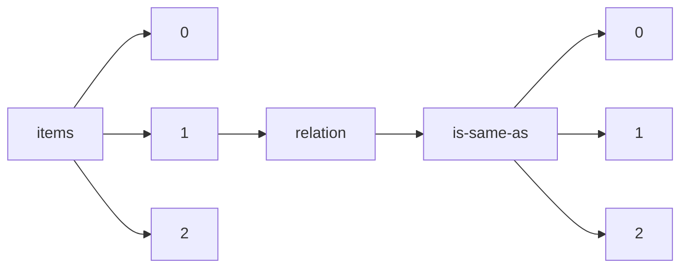

!!! warning "This document is not official Crossref documentation"
# Elements
PATH = items/array/relation/is-same-as/array(1)  
Occurs 4 564 times  
{ .annotate }

1. A route to an element, for example:  
   The route "items/array/relation/is-same-as/array" corresponds to navigating through the JSON indices as  
   ["items"][0]["relation"]["is-same-as"][0]  

## Asserted-by
See more information: [items/array/relation/is-same-as/array/asserted-by](asserted-by/index.md)  
Occurs 4 564 timess  
Unique values: 1  

| **Row** | **Value** `String` | **Count** `Int64` |
|--------:|----------------------:|---------------------:|
| **1**   | subject               | 4 564                |

## Id
See more information: [items/array/relation/is-same-as/array/id](id/index.md)  
Occurs 4 564 timess  
Unique values: > 999  

!!! note "Due to current limitations, only the first 1,000 unique values are counted."

| **Row** | **Value** `String`              | **Count** `Int64` |
|--------:|-----------------------------------:|---------------------:|
| **1**   | https://hal.science/hal-01110947v1 | 2                    |
| **2**   | 10.48550/arXiv.2202.04038          | 2                    |
| **3**   | 2006.05433                         | 1                    |
| **4**   | 10.48550/arXiv.2205.12264          | 1                    |
| **5**   | https://hal.science/hal-03178153v1 | 1                    |
| **6**   | https://hal.science/hal-01186285v1 | 1                    |
| **7**   | https://hal.science/hal-03159897v1 | 1                    |
| **8**   | https://hal.science/hal-00961106v1 | 1                    |
| **9**   | 10.48550/arXiv.1610.00754          | 1                    |
| **10**  | https://hal.science/hal-01349042v1 | 1                    |
| ... | ... | ... |

## Id-type
See more information: [items/array/relation/is-same-as/array/id-type](id-type/index.md)  
Occurs 4 564 timess  
Unique values: 3  

| **Row** | **Value** `String` | **Count** `Int64` |
|--------:|----------------------:|---------------------:|
| **1**   | uri                   | 3 282                |
| **2**   | doi                   | 662                  |
| **3**   | arxiv                 | 620                  |

