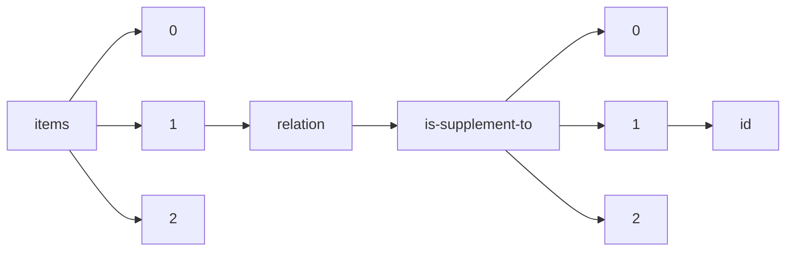

!!! warning "This document is not official Crossref documentation"
# Id
PATH = items/array/relation/is-supplement-to/array/id(1)  
Occurs 35 647 times  
Unique values: > 999  
{ .annotate }

1. A route to an element, for example:  
   The route "items/array/relation/is-supplement-to/array/id" corresponds to navigating through the JSON indices as  
   ["items"][0]["relation"]["is-supplement-to"][0]["id"]  

!!! note "Due to current limitations, only the first 1,000 unique values are counted."

| **Row** | **Value** `String`       | **Count** `Int64` |
|--------:|----------------------------:|---------------------:|
| **1**   | 10.1107/S2053229620001904   | 42                   |
| **2**   | 10.1107/S0108768101013647   | 41                   |
| **3**   | 10.1107/S0108768112026456   | 40                   |
| **4**   | 10.1107/S2053229622009548   | 36                   |
| **5**   | 10.1107/S2052252520016589   | 34                   |
| **6**   | 10.1107/S1600576715007724   | 30                   |
| **7**   | 10.1107/S1600576722005556   | 27                   |
| **8**   | 10.1107/S205979832200612X   | 26                   |
| **9**   | 10.1107/S2056989023001184   | 26                   |
| **10**  | 10.1107/S2052520622011623   | 24                   |
| **11**  | 10.1107/S2052520620002772   | 24                   |
| **12**  | 10.1107/S2052252521010678   | 22                   |
| **13**  | 10.1107/S0108768112015960   | 22                   |
| **14**  | 10.1107/S0108768103005792   | 21                   |
| **15**  | 10.1107/S2053229617017946   | 20                   |
| **16**  | 10.1107/S2053229623000906   | 20                   |
| **17**  | 10.7554/eLife.40613         | 19                   |
| **18**  | 10.1107/S2053229620004143   | 18                   |
| **19**  | 10.1107/S2059798319011938   | 16                   |
| **20**  | 10.1107/S2053229618001183   | 16                   |
| **21**  | 10.1107/S2059798319010684   | 16                   |
| **22**  | 10.1107/S2059798319009574   | 16                   |
| **23**  | 10.1107/S0108768103022018   | 16                   |
| **24**  | 10.1107/S2052252518015786   | 15                   |
| **25**  | 10.1107/S0108768102009102   | 15                   |
| **26**  | 10.1107/S2053229622010130   | 14                   |
| **27**  | 10.1107/S0108768100002056   | 14                   |
| **28**  | 10.1107/S2053229619015687   | 14                   |
| **29**  | 10.1107/S2053229618004394   | 14                   |
| **30**  | 10.1107/S2059798320011341   | 14                   |
| **31**  | 10.1107/S205225251801120X   | 13                   |
| **32**  | 10.1107/S2052252519003956   | 13                   |
| **33**  | 10.1107/S2053229620001503   | 13                   |
| **34**  | 10.1107/S2053229618012585   | 13                   |
| **35**  | 10.1107/S2053229619005540   | 13                   |
| **36**  | 10.1107/S2056989019008442   | 13                   |
| **37**  | 10.1107/S2053229620005082   | 13                   |
| **38**  | 10.1107/S205698902100013X   | 13                   |
| **39**  | 10.1107/S0108768199007740   | 12                   |
| **40**  | 10.1107/S2053229620014916   | 12                   |
| **41**  | 10.1107/S0108768103023255   | 12                   |
| **42**  | 10.1107/S2053229621001455   | 12                   |
| **43**  | 10.1107/S2053229623001432   | 11                   |
| **44**  | 10.1107/S2053229619005631   | 11                   |
| **45**  | 10.1107/S0108768102003348   | 11                   |
| **46**  | 10.1107/S2056989020015649   | 11                   |
| **47**  | 10.1107/S2053229618012287   | 11                   |
| **48**  | 10.1107/S2052520623001282   | 11                   |
| **49**  | 10.1107/S0108768100012805   | 11                   |
| **50**  | 10.1107/S0108768101021607   | 11                   |
| **51**  | 10.1107/S2053229623002036   | 11                   |
| **52**  | 10.1107/S010876810200976X   | 10                   |
| **53**  | 10.1107/S2056989020005113   | 10                   |
| **54**  | 10.1107/S2053229619016073   | 10                   |
| **55**  | 10.1107/S205979832300089X   | 10                   |
| **56**  | 10.1107/S2053229618008355   | 10                   |
| **57**  | 10.1107/S2053229617010403   | 10                   |
| **58**  | 10.1107/S2053229618004072   | 10                   |
| **59**  | 10.1107/S2053229618000657   | 10                   |
| **60**  | 10.1107/S2056989019008375   | 10                   |
| **61**  | 10.1107/S1600576722009888   | 10                   |
| **62**  | 10.1107/S205322961800342X   | 10                   |
| **63**  | 10.1107/S2056989019010491   | 10                   |
| **64**  | 10.1107/S205225251900616X   | 10                   |
| **65**  | 10.1107/S0108768101019632   | 9                    |
| **66**  | 10.1107/S010876810101881X   | 9                    |
| **67**  | 10.1107/S205322962201052X   | 9                    |
| **68**  | 10.1107/S0108768101020006   | 9                    |
| **69**  | 10.1107/S2053229617017326   | 9                    |
| **70**  | 10.1107/S0108768112028972   | 9                    |
| **71**  | 10.1107/S2056989019009344   | 9                    |
| **72**  | 10.1107/S0108768103014484   | 9                    |
| **73**  | 10.1107/S2053229617010841   | 9                    |
| **74**  | 10.1107/S2053230X2001122X   | 9                    |
| **75**  | 10.1107/S2052520620014936   | 9                    |
| **76**  | 10.1107/S0108768103017075   | 9                    |
| **77**  | 10.1107/S2053229619006752   | 9                    |
| **78**  | 10.1107/S2053229617001516   | 9                    |
| **79**  | 10.1107/S010876810402316X   | 9                    |
| **80**  | 10.1107/S2053229620004131   | 9                    |
| **81**  | 10.1107/S0108768103029136   | 9                    |
| **82**  | 10.1107/S2053229618002176   | 9                    |
| **83**  | 10.1107/S2053229618013451   | 9                    |
| **84**  | 10.1107/S0108768102009941   | 8                    |
| **85**  | 10.1107/S2052252517015081   | 8                    |
| **86**  | 10.1107/S2052520619010473   | 8                    |
| **87**  | 10.1107/S2052252519005372   | 8                    |
| **88**  | 10.1107/S205252062000373X   | 8                    |
| **89**  | 10.1107/S2053229620013455   | 8                    |
| **90**  | 10.1107/S0108768104005853   | 8                    |
| **91**  | 10.1107/S205252062001584X   | 8                    |
| **92**  | 10.1107/S0108768199006072   | 8                    |
| **93**  | 10.1107/S2052520620001067   | 8                    |
| **94**  | 10.1107/S2053229619003437   | 8                    |
| **95**  | 10.1107/S2056989018003390   | 8                    |
| **96**  | 10.1107/S2052520620002620   | 8                    |
| **97**  | 10.1107/S205698901800364X   | 8                    |
| **98**  | 10.1107/S2053229617004697   | 8                    |
| **99**  | 10.1162/2e3983f5.f852e5ed   | 8                    |
| **100** | 10.1107/S0108768103002477   | 7                    |
| **101** | 10.1107/S2052520620016108   | 7                    |
| **102** | 10.1107/S2053229619008702   | 7                    |
| **103** | 10.1107/S2053229617013237   | 7                    |
| **104** | 10.1107/S2056989018014020   | 7                    |
| **105** | 10.1107/S2052252519013137   | 7                    |
| **106** | 10.1107/S205322961800832X   | 7                    |
| **107** | 10.1107/S010876810001154X   | 7                    |
| **108** | 10.1107/S2053229616015023   | 7                    |
| **109** | 10.1107/S2053229617012657   | 7                    |
| **110** | 10.1107/S205698902300035X   | 7                    |
| **111** | 10.1107/S2053229620005525   | 7                    |
| **112** | 10.1107/S2053229617013663   | 7                    |
| **113** | 10.1107/S2059798319014116   | 7                    |
| **114** | 10.1107/S2053229617017077   | 7                    |
| **115** | 10.1107/S2053229618012597   | 7                    |
| **116** | 10.1107/S0108768103024856   | 7                    |
| **117** | 10.1107/S0108768102003816   | 7                    |
| **118** | 10.1107/S010876810001853X   | 7                    |
| **119** | 10.1107/S0108768102021237   | 7                    |
| **120** | 10.1107/S2056989023001093   | 7                    |
| **121** | 10.1107/S2056989023001524   | 7                    |
| **122** | 10.1107/S205698901901380X   | 7                    |
| **123** | 10.1107/S205322961701302X   | 7                    |
| **124** | 10.1107/S2053229617013481   | 7                    |
| **125** | 10.1107/S0108768102000642   | 7                    |
| **126** | 10.1107/S2056989018013361   | 6                    |
| **127** | 10.1107/S2056989018017152   | 6                    |
| **128** | 10.1107/S2053229619012038   | 6                    |
| **129** | 10.1107/S0108768104007955   | 6                    |
| **130** | 10.1107/S2056989023002700   | 6                    |
| **131** | 10.1107/S1600577519014309   | 6                    |
| **132** | 10.1107/S2052252521012628   | 6                    |
| **133** | 10.1107/S0108768112015972   | 6                    |
| **134** | 10.1107/S010876811202561X   | 6                    |
| **135** | 10.1107/S2053229617017181   | 6                    |
| **136** | 10.1107/S205322961700314X   | 6                    |
| **137** | 10.1107/S2056989019007503   | 6                    |
| **138** | 10.1107/S2056989020014413   | 6                    |
| **139** | 10.1107/S0108768198003231   | 6                    |
| **140** | 10.1107/S205225251901604X   | 6                    |
| **141** | 10.1107/S2056989020013134   | 6                    |
| **142** | 10.1107/S2056989020001413   | 6                    |
| **143** | 10.1107/S2052520617008617   | 6                    |
| **144** | 10.1107/S2052252519005037   | 6                    |
| **145** | 10.1107/S205698902001021X   | 6                    |
| **146** | 10.1107/S0108768101013568   | 6                    |
| **147** | 10.1107/S0108768100018887   | 6                    |
| **148** | 10.1107/S2053229617005940   | 6                    |
| **149** | 10.1107/S1600577519005599   | 6                    |
| **150** | 10.1107/S205698901900700X   | 6                    |
| **151** | 10.1107/S2052520620003601   | 6                    |
| **152** | 10.1107/S2056989020011111   | 6                    |
| **153** | 10.1107/S2056989020014371   | 5                    |
| **154** | 10.1107/S2056989021002474   | 5                    |
| **155** | 10.1107/S0108768103014708   | 5                    |
| **156** | 10.1107/S0108768199011283   | 5                    |
| **157** | 10.1107/S2056989018015578   | 5                    |
| **158** | 10.1107/S2053229617012979   | 5                    |
| **159** | 10.1107/S205322961901427X   | 5                    |
| **160** | 10.1107/S2056989018014731   | 5                    |
| **161** | 10.1107/S2052252521010563   | 5                    |
| **162** | 10.1107/S2056989020011184   | 5                    |
| **163** | 10.1107/S2052252518006346   | 5                    |
| **164** | 10.1107/S0108768104006391   | 5                    |
| **165** | 10.1107/S2056989020002133   | 5                    |
| **166** | 10.1107/S0108768104012017   | 5                    |
| **167** | 10.1107/S2059798319004169   | 5                    |
| **168** | 10.1107/S2052252518015026   | 5                    |
| **169** | 10.1107/S2053229617012566   | 5                    |
| **170** | 10.1107/S2053229620007123   | 5                    |
| **171** | 10.1107/S2052252519008285   | 5                    |
| **172** | 10.1107/S010876818300275X   | 5                    |
| **173** | 10.1107/S0108768103007754   | 5                    |
| **174** | 10.1107/S0108768103012266   | 5                    |
| **175** | 10.1107/S0108768100008855   | 5                    |
| **176** | 10.1107/S2053229618012706   | 5                    |
| **177** | 10.1107/S2414314620004277   | 5                    |
| **178** | 10.1107/S2053229620001850   | 5                    |
| **179** | 10.1107/S0108768100007564   | 5                    |
| **180** | 10.1107/S2053229622011536   | 5                    |
| **181** | 10.1107/S2053229619005898   | 5                    |
| **182** | 10.1107/S2056989019014245   | 5                    |
| **183** | 10.1107/S0108768199009714   | 5                    |
| **184** | 10.1107/S0108768104003696   | 5                    |
| **185** | 10.1107/S2059798320016344   | 5                    |
| **186** | 10.1107/S2056989019011915   | 5                    |
| **187** | 10.1107/S2056989019012933   | 5                    |
| **188** | 10.1107/S2053229619014256   | 5                    |
| **189** | 10.1107/S0108768104009048   | 5                    |
| **190** | 10.1107/S2056989019016050   | 5                    |
| **191** | 10.1107/S2053229623001468   | 5                    |
| **192** | 10.1107/S2056989022012245   | 5                    |
| **193** | 10.1107/S2053229618013463   | 5                    |
| **194** | 10.1107/S2052252520007411   | 4                    |
| **195** | 10.1107/S2052520620014365   | 4                    |
| **196** | 10.1107/S2053229619007277   | 4                    |
| **197** | 10.1107/S2056989019017018   | 4                    |
| **198** | 10.1107/S2052252517015548   | 4                    |
| **199** | 10.1107/S2053229618001973   | 4                    |
| **200** | 10.1107/S2053229617017442   | 4                    |
| **201** | 10.1107/S0108768103012291   | 4                    |
| **202** | 10.1162/2e3983f5.76911be4   | 4                    |
| **203** | 10.1107/S2053229617017168   | 4                    |
| **204** | 10.1107/S2053229619009082   | 4                    |
| **205** | 10.1107/S2056989018017590   | 4                    |
| **206** | 10.1107/S2053229620005409   | 4                    |
| **207** | 10.1107/S2056989017006272   | 4                    |
| **208** | 10.1107/S0108768104002344   | 4                    |
| **209** | 10.1162/2e3983f5.f143f44c   | 4                    |
| **210** | 10.1107/S2053229617013857   | 4                    |
| **211** | 10.1107/S2052520619013465   | 4                    |
| **212** | 10.1107/S2053229617017260   | 4                    |
| **213** | 10.1107/S2053229619006405   | 4                    |
| **214** | 10.1107/S2056989018013634   | 4                    |
| **215** | 10.1107/S2053229619012087   | 4                    |
| **216** | 10.1107/S2053229620003757   | 4                    |
| **217** | 10.1107/S0108768100010946   | 4                    |
| **218** | 10.1107/S2059798319015055   | 4                    |
| **219** | 10.1107/S010876810402333X   | 4                    |
| **220** | 10.1107/S1600576720009590   | 4                    |
| **221** | 10.1107/S2053229618003522   | 4                    |
| **222** | 10.1107/S205322961800219X   | 4                    |
| **223** | 10.1107/S2053229619016164   | 4                    |
| **224** | 10.1107/S2052520620009695   | 4                    |
| **225** | 10.1107/S2056989021000116   | 4                    |
| **226** | 10.1107/S2052520620009336   | 4                    |
| **227** | 10.1107/S2059798320014540   | 4                    |
| **228** | 10.1107/S2052252523001653   | 4                    |
| **229** | 10.1107/S2053229619015699   | 4                    |
| **230** | 10.1107/S0108768199006199   | 4                    |
| **231** | 10.1107/S2053273319008647   | 4                    |
| **232** | 10.1107/S2053229618013773   | 4                    |
| **233** | 10.1107/S2056989018013087   | 4                    |
| **234** | 10.1107/S205225251900914X   | 4                    |
| **235** | 10.1107/S205225251901114X   | 4                    |
| **236** | 10.1107/S0108768102013782   | 4                    |
| **237** | 10.1107/S2059798319013226   | 4                    |
| **238** | 10.1107/S2053229617014103   | 4                    |
| **239** | 10.1107/S2056989018015645   | 4                    |
| **240** | 10.1162/2e3983f5.948b17e0   | 4                    |
| **241** | 10.1107/S0108768104010912   | 4                    |
| **242** | 10.1107/S2056989019006662   | 4                    |
| **243** | 10.1107/S2052520618012295   | 4                    |
| **244** | 10.1107/S2414314623000251   | 4                    |
| **245** | 10.1107/S2056989021000517   | 4                    |
| **246** | 10.1107/S2053229618001997   | 4                    |
| **247** | 10.1162/2e3983f5.d288a3fe   | 4                    |
| **248** | 10.1162/2e3983f5.2e5ce668   | 4                    |
| **249** | 10.1107/S2053229617010774   | 4                    |
| **250** | 10.1107/S2053229619015560   | 4                    |
| **251** | 10.1107/S205698901900728X   | 4                    |
| **252** | 10.1107/S2053229617009949   | 4                    |
| **253** | 10.1107/S2053229617006738   | 4                    |
| **254** | 10.1107/S0108768104023328   | 4                    |
| **255** | 10.1107/S2053229617012761   | 4                    |
| **256** | 10.1107/S2056989023000695   | 4                    |
| **257** | 10.1107/S0108768104022153   | 4                    |
| **258** | 10.1107/S2053229620010931   | 4                    |
| **259** | 10.1107/S2053230X20001466   | 4                    |
| **260** | 10.1162/2e3983f5.c2c1d10b   | 4                    |
| **261** | 10.1107/S0108768101020845   | 4                    |
| **262** | 10.1107/S2056989019012799   | 3                    |
| **263** | 10.1107/S0108768100010636   | 3                    |
| **264** | 10.1107/S0108768197013414   | 3                    |
| **265** | 10.1107/S2053229617012852   | 3                    |
| **266** | 10.1107/S0108768100005462   | 3                    |
| **267** | 10.1107/S0108768101016238   | 3                    |
| **268** | 10.1107/S2056989020005101   | 3                    |
| **269** | 10.1107/S2053229617013250   | 3                    |
| **270** | 10.1107/S205225251801480X   | 3                    |
| **271** | 10.1107/S0108768100011332   | 3                    |
| **272** | 10.1107/S2052252523001197   | 3                    |
| **273** | 10.1107/S010876810001661X   | 3                    |
| **274** | 10.1107/S2059798319003000   | 3                    |
| **275** | 10.1107/S2052252519001453   | 3                    |
| **276** | 10.1107/S0108768104002770   | 3                    |
| **277** | 10.1107/S2056989019013975   | 3                    |
| **278** | 10.1107/S2052252520015754   | 3                    |
| **279** | 10.1107/S2056989019010429   | 3                    |
| **280** | 10.1107/S0108768102012314   | 3                    |
| **281** | 10.1107/S2052520617005285   | 3                    |
| **282** | 10.1107/S2056989020011135   | 3                    |
| **283** | 10.1107/S2056989019008569   | 3                    |
| **284** | 10.1107/S0108768100003645   | 3                    |
| **285** | 10.1107/S1600576715005889   | 3                    |
| **286** | 10.1107/S2056989019007072   | 3                    |
| **287** | 10.1107/S2052252520001451   | 3                    |
| **288** | 10.1107/S2056989023001226   | 3                    |
| **289** | 10.1107/S2056989023001111   | 3                    |
| **290** | 10.1107/S0108768104010699   | 3                    |
| **291** | 10.1107/S0108768101019334   | 3                    |
| **292** | 10.1107/S2056989019013732   | 3                    |
| **293** | 10.1107/S2056989018014603   | 3                    |
| **294** | 10.1107/S0108768196013183   | 3                    |
| **295** | 10.1107/S2053229617017909   | 3                    |
| **296** | 10.1107/S0108768102004020   | 3                    |
| **297** | 10.1107/S2052252520013238   | 3                    |
| **298** | 10.1107/S2052520623000215   | 3                    |
| **299** | 10.1107/S2053229622011822   | 3                    |
| **300** | 10.1107/S2053229618006666   | 3                    |
| **301** | 10.1107/S0108768101013817   | 3                    |
| **302** | 10.1107/S2056989019006960   | 3                    |
| **303** | 10.1107/S2056989018003717   | 3                    |
| **304** | 10.1107/S2053229619012993   | 3                    |
| **305** | 10.1107/S2059798320012371   | 3                    |
| **306** | 10.1107/S2053229619015523   | 3                    |
| **307** | 10.1107/S2053229620001540   | 3                    |
| **308** | 10.1107/S0108768199011453   | 3                    |
| **309** | 10.1107/S0108768104012881   | 3                    |
| **310** | 10.1107/S2056989023002736   | 3                    |
| **311** | 10.1107/S2053229618002413   | 3                    |
| **312** | 10.1107/S2053229618013591   | 3                    |
| **313** | 10.1107/S2056989020005034   | 3                    |
| **314** | 10.1107/S010876810102167X   | 3                    |
| **315** | 10.1107/S2056989017007277   | 3                    |
| **316** | 10.1107/S2052520619013209   | 3                    |
| **317** | 10.1107/S2053229617011391   | 3                    |
| **318** | 10.1107/S2056989019007679   | 3                    |
| **319** | 10.1107/S2052252519011655   | 3                    |
| **320** | 10.1107/S2053229618002024   | 3                    |
| **321** | 10.1107/S2059798320003903   | 3                    |
| **322** | 10.1107/S2059798319011379   | 3                    |
| **323** | 10.1107/S0108768100003633   | 3                    |
| **324** | 10.1107/S0108768104013564   | 3                    |
| **325** | 10.1107/S2052520617005534   | 3                    |
| **326** | 10.1107/S2053229619006211   | 3                    |
| **327** | 10.1107/S2053229617009111   | 3                    |
| **328** | 10.1107/S2053229620005550   | 3                    |
| **329** | 10.1107/S2053229617008257   | 3                    |
| **330** | 10.1107/S2056989021000955   | 3                    |
| **331** | 10.1107/S2053229619012403   | 3                    |
| **332** | 10.1107/S2053229618011750   | 3                    |
| **333** | 10.1107/S2053229617016461   | 3                    |
| **334** | 10.1107/S1600576722009633   | 3                    |
| **335** | 10.1107/S2056989020006386   | 3                    |
| **336** | 10.1107/S2053229618003595   | 3                    |
| **337** | 10.1107/S2056989018003444   | 3                    |
| **338** | 10.1107/S2056989020006957   | 3                    |
| **339** | 10.1107/S2053229619006004   | 3                    |
| **340** | 10.1107/S2053229619003115   | 3                    |
| **341** | 10.1107/S2056989020001784   | 3                    |
| **342** | 10.1107/S2414314623000652   | 3                    |
| **343** | 10.1107/S2053273323000268   | 3                    |
| **344** | 10.1107/S2053229623002231   | 3                    |
| **345** | 10.1162/2e3983f5.4b34817e   | 3                    |
| **346** | 10.1107/S2053230X21002223   | 3                    |
| **347** | 10.1107/S2053229621000395   | 3                    |
| **348** | 10.1107/S0108768102012624   | 3                    |
| **349** | 10.1107/S205252061901343X   | 3                    |
| **350** | 10.1107/S2056989019007412   | 3                    |
| **351** | 10.1107/S2053229617000870   | 3                    |
| **352** | 10.1107/S2053229618011853   | 3                    |
| **353** | 10.1107/S2053229622010300   | 3                    |
| **354** | 10.1107/S0108768101014288   | 3                    |
| **355** | 10.1107/S205698901900820X   | 3                    |
| **356** | 10.1107/S0108768101019346   | 3                    |
| **357** | 10.1107/S0108768100008302   | 3                    |
| **358** | 10.1107/S1600576722008056   | 3                    |
| **359** | 10.1107/S2053229617012189   | 3                    |
| **360** | 10.1107/S2053229622012256   | 3                    |
| **361** | 10.1162/2e3983f5.92f1a651   | 3                    |
| **362** | 10.1107/S2053229619016619   | 3                    |
| **363** | 10.1162/2e3983f5.3a75cbb9   | 3                    |
| **364** | 10.1107/S160057671701336X   | 3                    |
| **365** | 10.1107/S2056989018013397   | 3                    |
| **366** | 10.1107/S2052252520002973   | 3                    |
| **367** | 10.1107/S205698902201221X   | 3                    |
| **368** | 10.1107/S2056989018014561   | 3                    |
| **369** | 10.1107/S160057751900763X   | 3                    |
| **370** | 10.1107/S2053229619006375   | 3                    |
| **371** | 10.1107/S2059798319001980   | 3                    |
| **372** | 10.1107/S2414314618014499   | 3                    |
| **373** | 10.1107/S2053229617000663   | 3                    |
| **374** | 10.1107/S2056989019007461   | 3                    |
| **375** | 10.1107/S0108768104007475   | 3                    |
| **376** | 10.1107/S0108768101014987   | 3                    |
| **377** | 10.1107/S1600576722005878   | 3                    |
| **378** | 10.1107/S0108768100011496   | 3                    |
| **379** | 10.1107/S1600576719013797   | 3                    |
| **380** | 10.1107/S2053229617008452   | 3                    |
| **381** | 10.1107/S205225252300180X   | 3                    |
| **382** | 10.1107/S2056989023000476   | 3                    |
| **383** | 10.1107/S0108768103026739   | 3                    |
| **384** | 10.1107/S205698901801561X   | 3                    |
| **385** | 10.1107/S2059798319010179   | 3                    |
| **386** | 10.1107/S2053229617011068   | 3                    |
| **387** | 10.1107/S2059798320004027   | 3                    |
| **388** | 10.1107/S0108768103021013   | 3                    |
| **389** | 10.1107/S2052520619012472   | 3                    |
| **390** | 10.1107/S010876810401393X   | 3                    |
| **391** | 10.1107/S2059798320015247   | 3                    |
| **392** | 10.1107/S2056989020006441   | 3                    |
| **393** | 10.1107/S2056989019008673   | 3                    |
| **394** | 10.1107/S2414314619000543   | 3                    |
| **395** | 10.1107/S2053273318013918   | 3                    |
| **396** | 10.1107/S2052520620001304   | 3                    |
| **397** | 10.1107/S2056989018015451   | 3                    |
| **398** | 10.1107/S0108768103011509   | 3                    |
| **399** | 10.1107/S2053229617009044   | 3                    |
| **400** | 10.1107/S2052520617006163   | 3                    |
| **401** | 10.1107/S2053229618014109   | 3                    |
| **402** | 10.1107/S2056989018016316   | 2                    |
| **403** | 10.5194/acp-2019-569        | 2                    |
| **404** | 10.5194/osd-11-2607-2014    | 2                    |
| **405** | 10.5194/acpd-11-23349-2011  | 2                    |
| **406** | 10.5194/acp-2019-1180       | 2                    |
| **407** | 10.5194/nhess-2015-347      | 2                    |
| **408** | 10.5194/bg-2018-447         | 2                    |
| **409** | 10.5194/acp-2019-456        | 2                    |
| **410** | 10.5194/acp-2018-73         | 2                    |
| **411** | 10.5194/acp-2019-861        | 2                    |
| **412** | 10.5194/bg-2016-12          | 2                    |
| **413** | 10.5194/gmdd-6-1527-2013    | 2                    |
| **414** | 10.5194/egusphere-2022-913  | 2                    |
| **415** | 10.5194/tc-2018-143         | 2                    |
| **416** | 10.5194/amt-2019-158        | 2                    |
| **417** | 10.5194/acp-2020-360        | 2                    |
| **418** | 10.5194/acpd-11-25557-2011  | 2                    |
| **419** | 10.5194/acp-2016-160        | 2                    |
| **420** | 10.5194/hess-2020-216       | 2                    |
| **421** | 10.5194/acp-2020-520        | 2                    |
| **422** | 10.5194/acp-2019-1096       | 2                    |
| **423** | 10.5194/hess-2016-92        | 2                    |
| **424** | 10.5194/nhess-2022-193      | 2                    |
| **425** | 10.5194/acpd-15-26959-2015  | 2                    |
| **426** | 10.5194/acpd-10-30171-2010  | 2                    |
| **427** | 10.5194/tc-2018-170         | 2                    |
| **428** | 10.5194/acpd-13-29811-2013  | 2                    |
| **429** | 10.5194/acp-2016-1076       | 2                    |
| **430** | 10.5194/gmd-2017-291        | 2                    |
| **431** | 10.5194/bg-2018-199         | 2                    |
| **432** | 10.5194/acpd-11-27421-2011  | 2                    |
| **433** | 10.5194/gmdd-7-1453-2014    | 2                    |
| **434** | 10.5194/cpd-11-1741-2015    | 2                    |
| **435** | 10.5194/gmdd-6-3033-2013    | 2                    |
| **436** | 10.5194/bg-2018-151         | 2                    |
| **437** | 10.5194/tcd-9-1-2015        | 2                    |
| **438** | 10.5194/essd-2020-39        | 2                    |
| **439** | 10.5194/bgd-12-11751-2015   | 2                    |
| **440** | 10.5194/acp-2017-1043       | 2                    |
| **441** | 10.5194/gmdd-8-4075-2015    | 2                    |
| **442** | 10.5194/hess-2016-161       | 2                    |
| **443** | 10.5194/soil-2020-75        | 2                    |
| **444** | 10.5194/bg-2016-8           | 2                    |
| **445** | 10.5194/esurf-2018-44       | 2                    |
| **446** | 10.5194/bg-2017-547         | 2                    |
| **447** | 10.5194/acp-2018-322        | 2                    |
| **448** | 10.5194/acpd-9-541-2009     | 2                    |
| **449** | 10.1107/S2053230X18017673   | 2                    |
| **450** | 10.1107/S2414314620002035   | 2                    |
| **451** | 10.5194/tc-2017-271         | 2                    |
| **452** | 10.5194/bg-2015-653         | 2                    |
| **453** | 10.5194/bgd-12-7125-2015    | 2                    |
| **454** | 10.5194/bg-2018-513         | 2                    |
| **455** | 10.5194/se-2017-112         | 2                    |
| **456** | 10.5194/bgd-9-3615-2012     | 2                    |
| **457** | 10.5194/egusphere-2022-1160 | 2                    |
| **458** | 10.5194/cp-2018-6           | 2                    |
| **459** | 10.5194/egusphere-2022-682  | 2                    |
| **460** | 10.5194/nhess-2018-391      | 2                    |
| **461** | 10.5194/tc-2020-106         | 2                    |
| **462** | 10.5194/amt-2018-431        | 2                    |
| **463** | 10.5194/acp-2019-869        | 2                    |
| **464** | 10.5194/gmdd-8-2403-2015    | 2                    |
| **465** | 10.5194/acp-2020-910        | 2                    |
| **466** | 10.5194/bgd-11-17255-2014   | 2                    |
| **467** | 10.5194/acpd-11-19443-2011  | 2                    |
| **468** | 10.5194/gmd-2018-198        | 2                    |
| **469** | 10.5194/amt-2019-285        | 2                    |
| **470** | 10.5194/hess-2019-24        | 2                    |
| **471** | 10.5194/cp-2019-96          | 2                    |
| **472** | 10.5194/acp-2017-779        | 2                    |
| **473** | 10.5194/gmdd-7-4153-2014    | 2                    |
| **474** | 10.5194/nhess-2019-209      | 2                    |
| **475** | 10.5194/amtd-7-12449-2014   | 2                    |
| **476** | 10.5194/tc-2018-57          | 2                    |
| **477** | 10.5194/tcd-8-1453-2014     | 2                    |
| **478** | 10.5194/bgd-12-933-2015     | 2                    |
| **479** | 10.5194/acp-2017-363        | 2                    |
| **480** | 10.5194/gmd-2020-306        | 2                    |
| **481** | 10.5194/cp-2020-132         | 2                    |
| **482** | 10.5194/bg-2020-221         | 2                    |
| **483** | 10.5194/acp-2017-91         | 2                    |
| **484** | 10.5194/tc-2019-177         | 2                    |
| **485** | 10.5194/acp-2016-753        | 2                    |
| **486** | 10.5194/acpd-12-33291-2012  | 2                    |
| **487** | 10.5194/bg-2019-328         | 2                    |
| **488** | 10.5194/gmdd-7-9017-2014    | 2                    |
| **489** | 10.5194/se-2020-54          | 2                    |
| **490** | 10.5194/acpd-12-31725-2012  | 2                    |
| **491** | 10.5194/bg-2019-244         | 2                    |
| **492** | 10.5194/acpd-13-11597-2013  | 2                    |
| **493** | 10.1107/S2056989019013380   | 2                    |
| **494** | 10.5194/acp-2020-451        | 2                    |
| **495** | 10.5194/egusphere-2022-49   | 2                    |
| **496** | 10.5194/bgd-11-16993-2014   | 2                    |
| **497** | 10.5194/tc-2016-107         | 2                    |
| **498** | 10.1107/S2056989018016389   | 2                    |
| **499** | 10.5194/acpd-11-485-2011    | 2                    |
| **500** | 10.5194/acp-2020-402        | 2                    |
| **501** | 10.5194/tc-2018-177         | 2                    |
| **502** | 10.5194/acp-2019-526        | 2                    |
| **503** | 10.5194/egusphere-2022-1524 | 2                    |
| **504** | 10.5194/amt-2017-22         | 2                    |
| **505** | 10.5194/os-2017-100         | 2                    |
| **506** | 10.5194/esd-2019-42         | 2                    |
| **507** | 10.5194/nhess-2017-36       | 2                    |
| **508** | 10.5194/acpd-13-26933-2013  | 2                    |
| **509** | 10.5194/acp-2017-435        | 2                    |
| **510** | 10.5194/esd-2016-20         | 2                    |
| **511** | 10.5194/acp-2020-191        | 2                    |
| **512** | 10.5194/acp-2019-1165       | 2                    |
| **513** | 10.5194/gmdd-6-645-2013     | 2                    |
| **514** | 10.5194/hess-2019-213       | 2                    |
| **515** | 10.5194/acp-2017-908        | 2                    |
| **516** | 10.5194/acp-2020-920        | 2                    |
| **517** | 10.5194/hessd-11-8779-2014  | 2                    |
| **518** | 10.5194/bgd-8-11337-2011    | 2                    |
| **519** | 10.5194/gmd-2018-325        | 2                    |
| **520** | 10.5194/essd-2016-31        | 2                    |
| **521** | 10.5194/gmd-2016-295        | 2                    |
| **522** | 10.5194/bg-2016-88          | 2                    |
| **523** | 10.5194/acp-2018-1057       | 2                    |
| **524** | 10.5194/acp-2016-474        | 2                    |
| **525** | 10.1162/2e3983f5.4e25e8ac   | 2                    |
| **526** | 10.5194/bgd-11-12631-2014   | 2                    |
| **527** | 10.5194/acp-2017-925        | 2                    |
| **528** | 10.5194/acp-2019-660        | 2                    |
| **529** | 10.5194/acpd-13-17327-2013  | 2                    |
| **530** | 10.5194/cpd-7-1797-2011     | 2                    |
| **531** | 10.5194/bgd-12-2021-2015    | 2                    |
| **532** | 10.5194/hess-2020-315       | 2                    |
| **533** | 10.5194/bg-2017-107         | 2                    |
| **534** | 10.5194/bg-2019-493         | 2                    |
| **535** | 10.5194/acp-2020-575        | 2                    |
| **536** | 10.5194/bgd-10-9091-2013    | 2                    |
| **537** | 10.5194/se-2019-69          | 2                    |
| **538** | 10.5194/os-2018-169         | 2                    |
| **539** | 10.1107/S2053229617005976   | 2                    |
| **540** | 10.5194/egusphere-2022-1227 | 2                    |
| **541** | 10.5194/cpd-7-3203-2011     | 2                    |
| **542** | 10.5194/tcd-7-3417-2013     | 2                    |
| **543** | 10.5194/hessd-8-1287-2011   | 2                    |
| **544** | 10.5194/egusphere-2023-45   | 2                    |
| **545** | 10.5194/bg-2016-359         | 2                    |
| **546** | 10.5194/amt-2019-405        | 2                    |
| **547** | 10.5194/acpd-11-9217-2011   | 2                    |
| **548** | 10.5194/bgd-11-15693-2014   | 2                    |
| **549** | 10.5194/hessd-12-13149-2015 | 2                    |
| **550** | 10.5194/amt-2016-2          | 2                    |
| **551** | 10.5194/egusphere-2023-22   | 2                    |
| **552** | 10.1107/S205698902300138X   | 2                    |
| **553** | 10.5194/bgd-10-17939-2013   | 2                    |
| **554** | 10.5194/os-2020-9           | 2                    |
| **555** | 10.5194/esd-2019-22         | 2                    |
| **556** | 10.5194/acpd-13-23173-2013  | 2                    |
| **557** | 10.5194/acp-2022-723        | 2                    |
| **558** | 10.5194/sed-7-1119-2015     | 2                    |
| **559** | 10.5194/gmdd-8-5931-2015    | 2                    |
| **560** | 10.5194/wes-2019-63         | 2                    |
| **561** | 10.5194/acp-2018-137        | 2                    |
| **562** | 10.5194/gmd-2016-172        | 2                    |
| **563** | 10.5194/acp-2020-613        | 2                    |
| **564** | 10.5194/gmd-2019-277        | 2                    |
| **565** | 10.5194/acpd-15-13515-2015  | 2                    |
| **566** | 10.5194/acp-2017-929        | 2                    |
| **567** | 10.5194/acpd-15-25739-2015  | 2                    |
| **568** | 10.5194/acp-2018-673        | 2                    |
| **569** | 10.5194/amt-2017-213        | 2                    |
| **570** | 10.5194/essd-2019-78        | 2                    |
| **571** | 10.5194/acp-2017-1239       | 2                    |
| **572** | 10.5194/cp-2016-127         | 2                    |
| **573** | 10.5194/tc-2020-282         | 2                    |
| **574** | 10.5194/bgd-6-9945-2009     | 2                    |
| **575** | 10.5194/acpd-13-12867-2013  | 2                    |
| **576** | 10.5194/bg-2017-308         | 2                    |
| **577** | 10.5194/gmd-2018-62         | 2                    |
| **578** | 10.5194/amt-2019-263        | 2                    |
| **579** | 10.5194/egusphere-2022-1138 | 2                    |
| **580** | 10.5194/gmd-2020-111        | 2                    |
| **581** | 10.5194/tc-2016-172         | 2                    |
| **582** | 10.5194/amt-2018-215        | 2                    |
| **583** | 10.5194/bg-2020-345         | 2                    |
| **584** | 10.5194/bg-2015-661         | 2                    |
| **585** | 10.5194/acp-2017-572        | 2                    |
| **586** | 10.5194/acpd-14-57-2014     | 2                    |
| **587** | 10.5194/amtd-8-6469-2015    | 2                    |
| **588** | 10.5194/acp-2018-970        | 2                    |
| **589** | 10.5194/hess-2017-200       | 2                    |
| **590** | 10.1107/S2052252519007668   | 2                    |
| **591** | 10.5194/cp-2016-112         | 2                    |
| **592** | 10.5194/tc-2018-195         | 2                    |
| **593** | 10.5194/acpd-15-13211-2015  | 2                    |
| **594** | 10.5194/bgd-10-9243-2013    | 2                    |
| **595** | 10.5194/os-2019-79          | 2                    |
| **596** | 10.5194/bg-2020-156         | 2                    |
| **597** | 10.5194/gmd-2017-94         | 2                    |
| **598** | 10.5194/bg-2018-279         | 2                    |
| **599** | 10.5194/acp-2019-808        | 2                    |
| **600** | 10.1107/S205698901801647X   | 2                    |
| **601** | 10.5194/acp-2020-543        | 2                    |
| **602** | 10.5194/bg-2019-430         | 2                    |
| **603** | 10.5194/acpd-11-7375-2011   | 2                    |
| **604** | 10.5194/acpd-15-27449-2015  | 2                    |
| **605** | 10.5194/acpd-15-2997-2015   | 2                    |
| **606** | 10.5194/acp-2016-465        | 2                    |
| **607** | 10.5194/bg-2016-235         | 2                    |
| **608** | 10.5194/bg-2017-478         | 2                    |
| **609** | 10.5194/acpd-14-2087-2014   | 2                    |
| **610** | 10.5194/se-2016-156         | 2                    |
| **611** | 10.1107/S2053229620000637   | 2                    |
| **612** | 10.5194/bg-2017-503         | 2                    |
| **613** | 10.5194/amt-2019-36         | 2                    |
| **614** | 10.5194/hess-2017-242       | 2                    |
| **615** | 10.5194/acpd-12-723-2012    | 2                    |
| **616** | 10.5194/hess-2017-449       | 2                    |
| **617** | 10.5194/hess-2020-604       | 2                    |
| **618** | 10.5194/acpd-12-23829-2012  | 2                    |
| **619** | 10.5194/acpd-14-21223-2014  | 2                    |
| **620** | 10.5194/acp-2017-747        | 2                    |
| **621** | 10.5194/bg-2016-296         | 2                    |
| **622** | 10.5194/nhessd-2-3741-2014  | 2                    |
| **623** | 10.5194/wes-2016-6          | 2                    |
| **624** | 10.5194/nhess-2019-61       | 2                    |
| **625** | 10.5194/bgd-9-6715-2012     | 2                    |
| **626** | 10.5194/hessd-6-2247-2009   | 2                    |
| **627** | 10.5194/cpd-7-2609-2011     | 2                    |
| **628** | 10.5194/bgd-10-335-2013     | 2                    |
| **629** | 10.5194/hessd-9-2959-2012   | 2                    |
| **630** | 10.5194/tc-2018-206         | 2                    |
| **631** | 10.5194/acp-2018-1066       | 2                    |
| **632** | 10.5194/acpd-12-18107-2012  | 2                    |
| **633** | 10.5194/acpd-9-18113-2009   | 2                    |
| **634** | 10.5194/hess-2020-337       | 2                    |
| **635** | 10.5194/gc-2022-15          | 2                    |
| **636** | 10.5194/amt-2018-204        | 2                    |
| **637** | 10.1107/S2053229619005989   | 2                    |
| **638** | 10.5194/hess-2017-69        | 2                    |
| **639** | 10.5194/acp-2018-172        | 2                    |
| **640** | 10.5194/acp-2019-773        | 2                    |
| **641** | 10.5194/bgd-8-7071-2011     | 2                    |
| **642** | 10.5194/essd-2019-242       | 2                    |
| **643** | 10.5194/hess-2016-469       | 2                    |
| **644** | 10.5194/bgd-11-729-2014     | 2                    |
| **645** | 10.5194/dwes-2017-39        | 2                    |
| **646** | 10.5194/amtd-6-5693-2013    | 2                    |
| **647** | 10.5194/bgd-11-14889-2014   | 2                    |
| **648** | 10.5194/acp-2018-116        | 2                    |
| **649** | 10.5194/amt-2017-247        | 2                    |
| **650** | 10.5194/acp-2017-1026       | 2                    |
| **651** | 10.5194/amtd-6-10617-2013   | 2                    |
| **652** | 10.5194/amt-2017-300        | 2                    |
| **653** | 10.5194/hess-2023-31        | 2                    |
| **654** | 10.5194/amtd-8-11401-2015   | 2                    |
| **655** | 10.5194/acp-2018-168        | 2                    |
| **656** | 10.5194/angeo-2019-59       | 2                    |
| **657** | 10.5194/os-2019-132         | 2                    |
| **658** | 10.5194/bgd-9-16705-2012    | 2                    |
| **659** | 10.5194/acpd-8-15375-2008   | 2                    |
| **660** | 10.5194/gmdd-6-3241-2013    | 2                    |
| **661** | 10.5194/hess-2020-143       | 2                    |
| **662** | 10.5194/acp-2019-441        | 2                    |
| **663** | 10.5194/acp-2020-523        | 2                    |
| **664** | 10.5194/acp-2022-743        | 2                    |
| **665** | 10.5194/bg-2016-207         | 2                    |
| **666** | 10.1107/S2056989020010130   | 2                    |
| **667** | 10.1107/S2414314619006679   | 2                    |
| **668** | 10.5194/gmd-2018-236        | 2                    |
| **669** | 10.5194/acpd-13-18489-2013  | 2                    |
| **670** | 10.5194/acp-2020-175        | 2                    |
| **671** | 10.5194/se-2019-41          | 2                    |
| **672** | 10.5194/tc-2016-156         | 2                    |
| **673** | 10.5194/acp-2017-50         | 2                    |
| **674** | 10.5194/esurf-2018-10       | 2                    |
| **675** | 10.5194/gmdd-7-8703-2014    | 2                    |
| **676** | 10.5194/acp-2020-455        | 2                    |
| **677** | 10.5194/angeo-2020-60       | 2                    |
| **678** | 10.5194/cp-2017-40          | 2                    |
| **679** | 10.5194/egusphere-2022-1455 | 2                    |
| **680** | 10.1107/S0108768183003262   | 2                    |
| **681** | 10.5194/bgd-12-13711-2015   | 2                    |
| **682** | 10.5194/acpd-15-6601-2015   | 2                    |
| **683** | 10.5194/mr-2020-15          | 2                    |
| **684** | 10.5194/essd-2020-308       | 2                    |
| **685** | 10.5194/cp-2016-105         | 2                    |
| **686** | 10.5194/bgd-9-10961-2012    | 2                    |
| **687** | 10.5194/acpd-14-26127-2014  | 2                    |
| **688** | 10.5194/acp-2017-315        | 2                    |
| **689** | 10.5194/nhess-2016-81       | 2                    |
| **690** | 10.5194/hessd-10-2955-2013  | 2                    |
| **691** | 10.5194/hess-2019-499       | 2                    |
| **692** | 10.5194/acp-2018-1355       | 2                    |
| **693** | 10.5194/acp-2016-247        | 2                    |
| **694** | 10.5194/cpd-11-3277-2015    | 2                    |
| **695** | 10.5194/gmd-2019-368        | 2                    |
| **696** | 10.5194/tc-2017-121         | 2                    |
| **697** | 10.5194/acp-2019-262        | 2                    |
| **698** | 10.1107/S205322961801183X   | 2                    |
| **699** | 10.5194/gmd-2016-25         | 2                    |
| **700** | 10.5194/acpd-14-26939-2014  | 2                    |
| **701** | 10.5194/bgd-9-14867-2012    | 2                    |
| **702** | 10.5194/hess-2022-65        | 2                    |
| **703** | 10.5194/tc-2017-196         | 2                    |
| **704** | 10.5194/acpd-8-403-2008     | 2                    |
| **705** | 10.5194/essd-2020-101       | 2                    |
| **706** | 10.5194/amt-2018-378        | 2                    |
| **707** | 10.5194/acpd-10-23781-2010  | 2                    |
| **708** | 10.5194/hess-2016-454       | 2                    |
| **709** | 10.5194/acp-2018-1077       | 2                    |
| **710** | 10.5194/acp-2016-864        | 2                    |
| **711** | 10.5194/acp-2016-1054       | 2                    |
| **712** | 10.5194/acp-2019-377        | 2                    |
| **713** | 10.5194/bg-2020-316         | 2                    |
| **714** | 10.5194/bg-2017-259         | 2                    |
| **715** | 10.5194/amt-2017-486        | 2                    |
| **716** | 10.5194/bg-2020-94          | 2                    |
| **717** | 10.5194/amt-2020-497        | 2                    |
| **718** | 10.5194/soil-2015-88        | 2                    |
| **719** | 10.5194/acp-2018-924        | 2                    |
| **720** | 10.5194/acp-2016-634        | 2                    |
| **721** | 10.5194/acp-2020-804        | 2                    |
| **722** | 10.5194/acpd-10-13179-2010  | 2                    |
| **723** | 10.1162/2e3983f5.2f8f9c6e   | 2                    |
| **724** | 10.5194/sed-6-119-2014      | 2                    |
| **725** | 10.5194/acp-2016-187        | 2                    |
| **726** | 10.5194/amtd-6-3931-2013    | 2                    |
| **727** | 10.5194/acpd-7-2857-2007    | 2                    |
| **728** | 10.5194/acpd-12-27173-2012  | 2                    |
| **729** | 10.5194/os-2018-40          | 2                    |
| **730** | 10.5194/acp-2020-961        | 2                    |
| **731** | 10.5194/bg-2017-135         | 2                    |
| **732** | 10.5194/cp-2019-63          | 2                    |
| **733** | 10.5194/acp-2017-1167       | 2                    |
| **734** | 10.1107/S2056989018014871   | 2                    |
| **735** | 10.5194/egusphere-2022-1212 | 2                    |
| **736** | 10.5194/bgd-10-6335-2013    | 2                    |
| **737** | 10.5194/gmd-2018-310        | 2                    |
| **738** | 10.5194/acpd-13-31761-2013  | 2                    |
| **739** | 10.5194/bg-2017-5           | 2                    |
| **740** | 10.5194/tc-2019-331         | 2                    |
| **741** | 10.5194/nhessd-2-5721-2014  | 2                    |
| **742** | 10.5194/hess-2016-661       | 2                    |
| **743** | 10.5194/acpd-12-8823-2012   | 2                    |
| **744** | 10.5194/acpd-15-17283-2015  | 2                    |
| **745** | 10.5194/bgd-9-3645-2012     | 2                    |
| **746** | 10.1107/S2053230X19007209   | 2                    |
| **747** | 10.5194/bg-2019-49          | 2                    |
| **748** | 10.5194/tcd-9-1503-2015     | 2                    |
| **749** | 10.5194/amt-2020-188        | 2                    |
| **750** | 10.5194/gmd-2017-69         | 2                    |
| **751** | 10.5194/bg-2020-27          | 2                    |
| **752** | 10.5194/bgd-11-1413-2014    | 2                    |
| **753** | 10.5194/sed-7-3587-2015     | 2                    |
| **754** | 10.5194/amt-2017-171        | 2                    |
| **755** | 10.5194/amtd-7-7245-2014    | 2                    |
| **756** | 10.5194/amtd-4-1021-2011    | 2                    |
| **757** | 10.5194/acp-2018-969        | 2                    |
| **758** | 10.5194/acpd-12-24287-2012  | 2                    |
| **759** | 10.5194/hess-2016-258       | 2                    |
| **760** | 10.5194/bg-2020-141         | 2                    |
| **761** | 10.5194/angeo-2019-78       | 2                    |
| **762** | 10.5194/acpd-14-25027-2014  | 2                    |
| **763** | 10.5194/nhess-2017-439      | 2                    |
| **764** | 10.5194/gmd-2017-227        | 2                    |
| **765** | 10.5194/cp-2017-98          | 2                    |
| **766** | 10.5194/gmd-2022-237        | 2                    |
| **767** | 10.5194/essd-2018-135       | 2                    |
| **768** | 10.1107/S2056989019005450   | 2                    |
| **769** | 10.5194/acp-2016-123        | 2                    |
| **770** | 10.5194/bgd-9-13857-2012    | 2                    |
| **771** | 10.5194/acp-2018-1008       | 2                    |
| **772** | 10.5194/gmd-2018-115        | 2                    |
| **773** | 10.5194/bgd-12-7209-2015    | 2                    |
| **774** | 10.5194/acpd-15-33675-2015  | 2                    |
| **775** | 10.5194/hess-2018-241       | 2                    |
| **776** | 10.5194/nhess-2019-381      | 2                    |
| **777** | 10.5194/acp-2020-467        | 2                    |
| **778** | 10.5194/tcd-8-1407-2014     | 2                    |
| **779** | 10.5194/cpd-3-693-2007      | 2                    |
| **780** | 10.5194/acp-2018-301        | 2                    |
| **781** | 10.5194/acpd-15-33161-2015  | 2                    |
| **782** | 10.5194/amt-2018-113        | 2                    |
| **783** | 10.5194/acp-2019-442        | 2                    |
| **784** | 10.1107/S2056989020000365   | 2                    |
| **785** | 10.5194/bgd-7-7727-2010     | 2                    |
| **786** | 10.5194/hess-2019-660       | 2                    |
| **787** | 10.5194/acp-2018-475        | 2                    |
| **788** | 10.5194/bgd-5-2923-2008     | 2                    |
| **789** | 10.5194/tc-2019-245         | 2                    |
| **790** | 10.5194/bg-2018-510         | 2                    |
| **791** | 10.5194/acp-2018-882        | 2                    |
| **792** | 10.5194/acp-2020-162        | 2                    |
| **793** | 10.5194/hess-2016-657       | 2                    |
| **794** | 10.5194/esd-2019-83         | 2                    |
| **795** | 10.5194/bg-2019-486         | 2                    |
| **796** | 10.5194/hess-2019-602       | 2                    |
| **797** | 10.1162/2e3983f5.256c5379   | 2                    |
| **798** | 10.5194/cpd-10-809-2014     | 2                    |
| **799** | 10.5194/amt-2019-3          | 2                    |
| **800** | 10.5194/cp-2018-44          | 2                    |
| **801** | 10.5194/acp-2018-306        | 2                    |
| **802** | 10.5194/hess-2019-345       | 2                    |
| **803** | 10.5194/acp-2017-54         | 2                    |
| **804** | 10.5194/os-2017-80          | 2                    |
| **805** | 10.5194/bg-2020-323         | 2                    |
| **806** | 10.5194/hessd-10-12187-2013 | 2                    |
| **807** | 10.5194/acpd-12-6049-2012   | 2                    |
| **808** | 10.5194/cp-2018-59          | 2                    |
| **809** | 10.5194/acp-2019-1147       | 2                    |
| **810** | 10.5194/amt-2019-147        | 2                    |
| **811** | 10.5194/acpd-13-32291-2013  | 2                    |
| **812** | 10.5194/cpd-11-873-2015     | 2                    |
| **813** | 10.5194/tcd-9-4019-2015     | 2                    |
| **814** | 10.5194/acp-2019-972        | 2                    |
| **815** | 10.5194/acp-2020-80         | 2                    |
| **816** | 10.5194/tc-2019-134         | 2                    |
| **817** | 10.5194/acpd-9-991-2009     | 2                    |
| **818** | 10.5194/gmd-2016-250        | 2                    |
| **819** | 10.5194/acpd-13-13285-2013  | 2                    |
| **820** | 10.5194/bg-2017-437         | 2                    |
| **821** | 10.5194/cpd-10-4535-2014    | 2                    |
| **822** | 10.5194/wes-2019-82         | 2                    |
| **823** | 10.5194/bg-2017-60          | 2                    |
| **824** | 10.5194/nhess-2018-254      | 2                    |
| **825** | 10.5194/nhessd-2-6069-2014  | 2                    |
| **826** | 10.5194/hessd-11-8737-2014  | 2                    |
| **827** | 10.5194/acpd-13-22795-2013  | 2                    |
| **828** | 10.5194/acp-2016-1187       | 2                    |
| **829** | 10.5194/hessd-11-8603-2014  | 2                    |
| **830** | 10.5194/gmdd-7-8649-2014    | 2                    |
| **831** | 10.5194/acp-2017-718        | 2                    |
| **832** | 10.5194/bg-2020-392         | 2                    |
| **833** | 10.5194/nhess-2020-2        | 2                    |
| **834** | 10.5194/acp-2020-435        | 2                    |
| **835** | 10.5194/tc-2018-183         | 2                    |
| **836** | 10.1107/S2052520620005715   | 2                    |
| **837** | 10.5194/tc-2018-16          | 2                    |
| **838** | 10.5194/npg-2016-67         | 2                    |
| **839** | 10.5194/egusphere-2023-132  | 2                    |
| **840** | 10.5194/acpd-14-5495-2014   | 2                    |
| **841** | 10.5194/acp-2017-24         | 2                    |
| **842** | 10.5194/acp-2019-1168       | 2                    |
| **843** | 10.5194/bgd-10-787-2013     | 2                    |
| **844** | 10.5194/acpd-12-21211-2012  | 2                    |
| **845** | 10.5194/acpd-10-14095-2010  | 2                    |
| **846** | 10.5194/bg-2018-251         | 2                    |
| **847** | 10.5194/gmd-2019-375        | 2                    |
| **848** | 10.5194/bg-2016-406         | 2                    |
| **849** | 10.5194/bg-2019-200         | 2                    |
| **850** | 10.5194/acp-2018-548        | 2                    |
| **851** | 10.5194/amt-2018-412        | 2                    |
| **852** | 10.5194/acp-2017-366        | 2                    |
| **853** | 10.5194/bg-2019-470         | 2                    |
| **854** | 10.5194/hessd-11-10117-2014 | 2                    |
| **855** | 10.5194/acp-2016-441        | 2                    |
| **856** | 10.5194/hess-2020-122       | 2                    |
| **857** | 10.5194/tcd-9-1209-2015     | 2                    |
| **858** | 10.5194/egusphere-2022-446  | 2                    |
| **859** | 10.5194/nhess-2018-342      | 2                    |
| **860** | 10.5194/amt-2018-140        | 2                    |
| **861** | 10.5194/acpd-10-26961-2010  | 2                    |
| **862** | 10.5194/acpd-12-11415-2012  | 2                    |
| **863** | 10.1107/S2056989020000870   | 2                    |
| **864** | 10.5194/acp-2019-215        | 2                    |
| **865** | 10.5194/bgd-11-8485-2014    | 2                    |
| **866** | 10.5194/essd-2020-122       | 2                    |
| **867** | 10.5194/bgd-12-9729-2015    | 2                    |
| **868** | 10.5194/bgd-12-14175-2015   | 2                    |
| **869** | 10.5194/cpd-3-19-2007       | 2                    |
| **870** | 10.5194/amt-2016-161        | 2                    |
| **871** | 10.5194/tc-2016-105         | 2                    |
| **872** | 10.5194/gmdd-3-1271-2010    | 2                    |
| **873** | 10.5194/bg-2023-23          | 2                    |
| **874** | 10.5194/cp-2015-183         | 2                    |
| **875** | 10.5194/egusphere-2022-510  | 2                    |
| **876** | 10.5194/gmd-2018-285        | 2                    |
| **877** | 10.5194/acp-2020-468        | 2                    |
| **878** | 10.5194/acpd-13-31197-2013  | 2                    |
| **879** | 10.5194/bgd-9-3003-2012     | 2                    |
| **880** | 10.5194/egusphere-2023-202  | 2                    |
| **881** | 10.5194/acp-2018-496        | 2                    |
| **882** | 10.5194/acp-2017-1014       | 2                    |
| **883** | 10.5194/acpd-14-23415-2014  | 2                    |
| **884** | 10.1107/S2056989019017304   | 2                    |
| **885** | 10.5194/bgd-12-4245-2015    | 2                    |
| **886** | 10.5194/egusphere-2022-1080 | 2                    |
| **887** | 10.5194/egusphere-2022-1037 | 2                    |
| **888** | 10.5194/hess-2020-7         | 2                    |
| **889** | 10.5194/egusphere-2022-265  | 2                    |
| **890** | 10.5194/gmd-2018-41         | 2                    |
| **891** | 10.5194/tcd-8-2425-2014     | 2                    |
| **892** | 10.5194/amtd-4-5857-2011    | 2                    |
| **893** | 10.5194/acpd-15-21803-2015  | 2                    |
| **894** | 10.5194/acpd-12-22355-2012  | 2                    |
| **895** | 10.5194/acp-2017-1010       | 2                    |
| **896** | 10.5194/os-2018-146         | 2                    |
| **897** | 10.5194/tcd-6-1405-2012     | 2                    |
| **898** | 10.5194/bg-2017-409         | 2                    |
| **899** | 10.5194/bg-2020-223         | 2                    |
| **900** | 10.5194/acpd-8-4561-2008    | 2                    |
| **901** | 10.5194/bg-2018-516         | 2                    |
| **902** | 10.5194/acpd-15-21671-2015  | 2                    |
| **903** | 10.5194/acpd-15-18609-2015  | 2                    |
| **904** | 10.5194/acpd-12-2167-2012   | 2                    |
| **905** | 10.5194/bgd-8-10487-2011    | 2                    |
| **906** | 10.5194/egusphere-2022-379  | 2                    |
| **907** | 10.5194/acp-2017-1114       | 2                    |
| **908** | 10.5194/bg-2018-406         | 2                    |
| **909** | 10.5194/hess-2020-2         | 2                    |
| **910** | 10.5194/acp-2016-785        | 2                    |
| **911** | 10.5194/acpd-12-11765-2012  | 2                    |
| **912** | 10.5194/acpd-10-22369-2010  | 2                    |
| **913** | 10.5194/acp-2018-683        | 2                    |
| **914** | 10.5194/acpd-12-25389-2012  | 2                    |
| **915** | 10.5194/bg-2020-15          | 2                    |
| **916** | 10.5194/gmdd-7-7823-2014    | 2                    |
| **917** | 10.5194/acp-2015-984        | 2                    |
| **918** | 10.5194/acpd-15-33583-2015  | 2                    |
| **919** | 10.5194/se-2020-104         | 2                    |
| **920** | 10.5194/acp-2019-33         | 2                    |
| **921** | 10.5194/gmd-2017-234        | 2                    |
| **922** | 10.5194/bg-2019-197         | 2                    |
| **923** | 10.5194/acp-2015-967        | 2                    |
| **924** | 10.1107/S2053229618011841   | 2                    |
| **925** | 10.5194/bg-2018-103         | 2                    |
| **926** | 10.5194/bg-2018-47          | 2                    |
| **927** | 10.5194/tc-2020-220         | 2                    |
| **928** | 10.5194/hess-2017-99        | 2                    |
| **929** | 10.5194/tc-2017-262         | 2                    |
| **930** | 10.1107/S205225251900263X   | 2                    |
| **931** | 10.5194/acp-2016-409        | 2                    |
| **932** | 10.5194/acp-2016-743        | 2                    |
| **933** | 10.5194/bg-2018-74          | 2                    |
| **934** | 10.5194/gmd-2019-218        | 2                    |
| **935** | 10.5194/acpd-13-24635-2013  | 2                    |
| **936** | 10.5194/acpd-14-11249-2014  | 2                    |
| **937** | 10.5194/bgd-5-2165-2008     | 2                    |
| **938** | 10.5194/egusphere-2022-882  | 2                    |
| **939** | 10.5194/bgd-6-1267-2009     | 2                    |
| **940** | 10.5194/amt-2018-32         | 2                    |
| **941** | 10.5194/acp-2019-411        | 2                    |
| **942** | 10.5194/acpd-11-2123-2011   | 2                    |
| **943** | 10.5194/mr-2020-16          | 2                    |
| **944** | 10.5194/acp-2017-542        | 2                    |
| **945** | 10.5194/gmd-2017-278        | 2                    |
| **946** | 10.5194/gmdd-3-1549-2010    | 2                    |
| **947** | 10.5194/hess-2017-715       | 2                    |
| **948** | 10.5194/gchron-2020-9       | 2                    |
| **949** | 10.5194/acpd-15-1523-2015   | 2                    |
| **950** | 10.5194/bgd-11-9215-2014    | 2                    |
| **951** | 10.5194/bg-2018-427         | 2                    |
| **952** | 10.5194/bgd-10-6839-2013    | 2                    |
| **953** | 10.1107/S205698901901538X   | 2                    |
| **954** | 10.5194/sed-6-3111-2014     | 2                    |
| **955** | 10.5194/acp-2020-432        | 2                    |
| **956** | 10.5194/cp-2022-98          | 2                    |
| **957** | 10.5194/amt-2020-121        | 2                    |
| **958** | 10.5194/egusphere-2022-183  | 2                    |
| **959** | 10.5194/cp-2019-146         | 2                    |
| **960** | 10.5194/acpd-11-28747-2011  | 2                    |
| **961** | 10.5194/acp-2017-798        | 2                    |
| **962** | 10.5194/bg-2016-102         | 2                    |
| **963** | 10.5194/gi-2015-45          | 2                    |
| **964** | 10.5194/acpd-14-8633-2014   | 2                    |
| **965** | 10.5194/bg-2018-182         | 2                    |
| **966** | 10.5194/tc-2018-212         | 2                    |
| **967** | 10.5194/hessd-10-13707-2013 | 2                    |
| **968** | 10.5194/amt-2018-30         | 2                    |
| **969** | 10.5194/acpd-15-25021-2015  | 2                    |
| **970** | 10.5194/bgd-9-2375-2012     | 2                    |
| **971** | 10.5194/amtd-2-1099-2009    | 2                    |
| **972** | 10.5194/tc-2019-111         | 2                    |
| **973** | 10.5194/bgd-12-18213-2015   | 2                    |
| **974** | 10.5194/cp-2017-31          | 2                    |
| **975** | 10.5194/hess-2017-111       | 2                    |
| **976** | 10.5194/esurf-2018-51       | 2                    |
| **977** | 10.5194/tc-2023-24          | 2                    |
| **978** | 10.5194/gmd-2022-233        | 2                    |
| **979** | 10.5194/egusphere-2022-75   | 2                    |
| **980** | 10.5194/bg-2016-529         | 2                    |
| **981** | 10.5194/bgd-8-11827-2011    | 2                    |
| **982** | 10.5194/amt-2016-210        | 2                    |
| **983** | 10.5194/amtd-6-1461-2013    | 2                    |
| **984** | 10.5194/bgd-9-18331-2012    | 2                    |
| **985** | 10.5194/esurf-2018-9        | 2                    |
| **986** | 10.5194/essd-2018-164       | 2                    |
| **987** | 10.5194/acp-2019-895        | 2                    |
| **988** | 10.5194/acpd-13-6681-2013   | 2                    |
| **989** | 10.1107/S2053229618013815   | 2                    |
| **990** | 10.5194/bgd-12-1613-2015    | 2                    |
| **991** | 10.5194/hess-2016-344       | 2                    |
| **992** | 10.5194/gchron-2022-25      | 2                    |
| **993** | 10.5194/soild-2-955-2015    | 2                    |
| **994** | 10.5194/tcd-7-4937-2013     | 2                    |
| **995** | 10.5194/gmdd-8-8547-2015    | 2                    |
| **996** | 10.5194/angeo-2018-115      | 2                    |
| **997** | 10.5194/mr-2021-22          | 2                    |
| **998** | 10.1107/S2056989019015639   | 2                    |
| **999** | 10.5194/hessd-12-10701-2015 | 2                    |
| ... | ... | ... |

