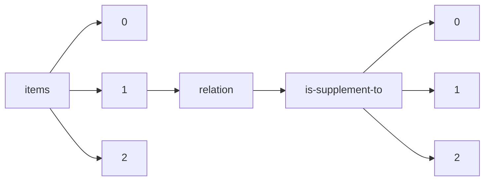

!!! warning "This document is not official Crossref documentation"
# Elements
PATH = items/array/relation/is-supplement-to/array(1)  
Occurs 35 647 times  
{ .annotate }

1. A route to an element, for example:  
   The route "items/array/relation/is-supplement-to/array" corresponds to navigating through the JSON indices as  
   ["items"][0]["relation"]["is-supplement-to"][0]  

## Asserted-by
See more information: [items/array/relation/is-supplement-to/array/asserted-by](asserted-by/index.md)  
Occurs 35 647 timess  
Unique values: 2  

| **Row** | **Value** `String` | **Count** `Int64` |
|--------:|----------------------:|---------------------:|
| **1**   | object                | 20 317               |
| **2**   | subject               | 15 330               |

## Id
See more information: [items/array/relation/is-supplement-to/array/id](id/index.md)  
Occurs 35 647 timess  
Unique values: > 999  

!!! note "Due to current limitations, only the first 1,000 unique values are counted."

| **Row** | **Value** `String`     | **Count** `Int64` |
|--------:|--------------------------:|---------------------:|
| **1**   | 10.1107/S2053229620001904 | 42                   |
| **2**   | 10.1107/S0108768101013647 | 41                   |
| **3**   | 10.1107/S0108768112026456 | 40                   |
| **4**   | 10.1107/S2053229622009548 | 36                   |
| **5**   | 10.1107/S2052252520016589 | 34                   |
| **6**   | 10.1107/S1600576715007724 | 30                   |
| **7**   | 10.1107/S1600576722005556 | 27                   |
| **8**   | 10.1107/S205979832200612X | 26                   |
| **9**   | 10.1107/S2056989023001184 | 26                   |
| **10**  | 10.1107/S2052520622011623 | 24                   |
| ... | ... | ... |

## Id-type
See more information: [items/array/relation/is-supplement-to/array/id-type](id-type/index.md)  
Occurs 35 647 timess  
Unique values: 4  

| **Row** | **Value** `String` | **Count** `Int64` |
|--------:|----------------------:|---------------------:|
| **1**   | doi                   | 35 614               |
| **2**   | uri                   | 30                   |
| **3**   | purl                  | 2                    |
| **4**   | isbn                  | 1                    |

