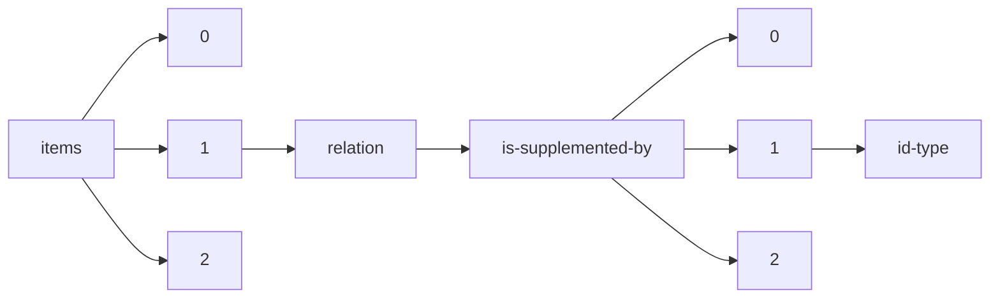

!!! warning "This document is not official Crossref documentation"
# Id-type
PATH = items/array/relation/is-supplemented-by/array/id-type(1)  
Occurs 79 134 times  
Unique values: 6  
{ .annotate }

1. A route to an element, for example:  
   The route "items/array/relation/is-supplemented-by/array/id-type" corresponds to navigating through the JSON indices as  
   ["items"][0]["relation"]["is-supplemented-by"][0]["id-type"]  

| **Row** | **Value** `String` | **Count** `Int64` |
|--------:|----------------------:|---------------------:|
| **1**   | doi                   | 69 048               |
| **2**   | accession             | 5 265                |
| **3**   | uri                   | 4 799                |
| **4**   | handle                | 18                   |
| **5**   | long-doi              | 2                    |
| **6**   | other                 | 2                    |

