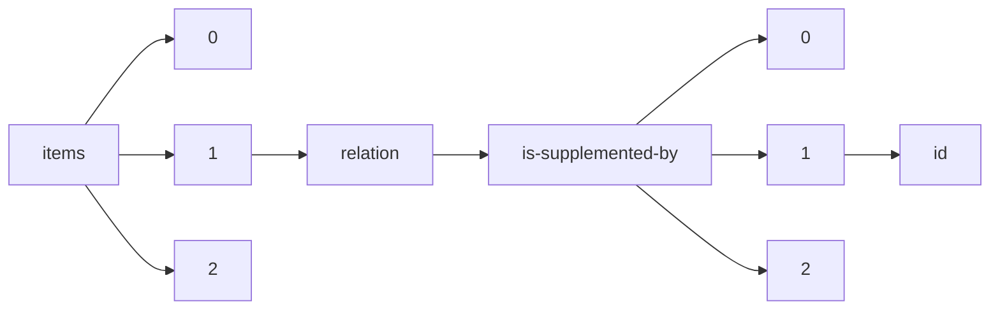

!!! warning "This document is not official Crossref documentation"
# Id
PATH = items/array/relation/is-supplemented-by/array/id(1)  
Occurs 79 134 times  
Unique values: > 999  
{ .annotate }

1. A route to an element, for example:  
   The route "items/array/relation/is-supplemented-by/array/id" corresponds to navigating through the JSON indices as  
   ["items"][0]["relation"]["is-supplemented-by"][0]["id"]  

!!! note "Due to current limitations, only the first 1,000 unique values are counted."

| **Row** | **Value** `String`                                                | **Count** `Int64` |
|--------:|---------------------------------------------------------------------:|---------------------:|
| **1**   | http://www.ncbi.nlm.nih.gov/geo/query/acc.cgi?acc=GSE52914           | 12                   |
| **2**   | https://roucoulab.com/p/downloads                                    | 9                    |
| **3**   | 10.21428/cbd17b20.e8104259/81ff44d9                                  | 8                    |
| **4**   | GitHub                                                               | 7                    |
| **5**   | 10.1056/EVIDdo000005                                                 | 5                    |
| **6**   | 10.7488/ds/188                                                       | 5                    |
| **7**   | https://solgenomics.net/                                             | 5                    |
| **8**   | 10.5066/F78051VM                                                     | 5                    |
| **9**   | http://neuromorpho.org/neuroMorpho/index.jsp                         | 4                    |
| **10**  | https://www.ncbi.nlm.nih.gov/geo/query/acc.cgi?acc=GSE104761         | 4                    |
| **11**  | 10.5066/F7P55KJN                                                     | 3                    |
| **12**  | 10.1056/EVIDdo000007                                                 | 3                    |
| **13**  | http://msviewer.ucsf.edu/prospector/cgi-bin/msform.cgi?form=msviewer | 3                    |
| **14**  | Table SD1                                                            | 3                    |
| **15**  | GSE58293                                                             | 3                    |
| **16**  | Supplementary Material                                               | 3                    |
| **17**  | http://esa.un.org/unpd/wpp/Excel-Data/mortality.htm                  | 3                    |
| **18**  | 10.1056/EVIDdo000003                                                 | 3                    |
| **19**  | 10.5194/egusphere-2022-230-supplement                                | 2                    |
| **20**  | 10.5194/acpd-15-965-2015-supplement                                  | 2                    |
| **21**  | 10.5194/bgd-10-6335-2013-supplement                                  | 2                    |
| **22**  | 10.5194/bg-2022-197-supplement                                       | 2                    |
| **23**  | 10.5194/acpd-13-25741-2013-supplement                                | 2                    |
| **24**  | 10.5194/acp-2018-262-supplement                                      | 2                    |
| **25**  | 10.5194/acp-2018-46-supplement                                       | 2                    |
| **26**  | 10.5194/se-2016-72-supplement                                        | 2                    |
| **27**  | 10.5194/acp-2022-780-supplement                                      | 2                    |
| **28**  | 10.5194/cpd-8-5083-2012-supplement                                   | 2                    |
| **29**  | 10.5194/bg-2018-415-supplement                                       | 2                    |
| **30**  | 10.5194/bgd-11-7853-2014-supplement                                  | 2                    |
| **31**  | 10.5194/gmd-2017-246-supplement                                      | 2                    |
| **32**  | 10.5194/acp-2018-752-supplement                                      | 2                    |
| **33**  | 10.5194/acp-2017-1128-supplement                                     | 2                    |
| **34**  | 10.5194/egusphere-2022-1258-supplement                               | 2                    |
| **35**  | 10.5194/acp-2019-539-supplement                                      | 2                    |
| **36**  | 10.5194/sed-2-195-2010-supplement                                    | 2                    |
| **37**  | 10.5194/acp-2017-793-supplement                                      | 2                    |
| **38**  | 10.5194/gmdd-8-3905-2015-supplement                                  | 2                    |
| **39**  | 10.5194/acp-2020-253-supplement                                      | 2                    |
| **40**  | 10.5194/egusphere-2022-1212-supplement                               | 2                    |
| **41**  | 10.5194/acpd-10-6301-2010-supplement                                 | 2                    |
| **42**  | 10.5194/hess-2018-35-supplement                                      | 2                    |
| **43**  | 10.5194/cp-2019-5-supplement                                         | 2                    |
| **44**  | 10.5194/amt-2019-419-supplement                                      | 2                    |
| **45**  | 10.5194/se-2017-45-supplement                                        | 2                    |
| **46**  | 10.5194/gchron-2019-15-supplement                                    | 2                    |
| **47**  | 10.5194/acp-2018-538-supplement                                      | 2                    |
| **48**  | 10.5194/acp-2018-483-supplement                                      | 2                    |
| **49**  | 10.5194/acp-2017-590-supplement                                      | 2                    |
| **50**  | 10.5194/bg-2020-180-supplement                                       | 2                    |
| **51**  | 10.5194/hess-2020-379-supplement                                     | 2                    |
| **52**  | 10.5194/acpd-12-15801-2012-supplement                                | 2                    |
| **53**  | 10.5194/bg-2018-396-supplement                                       | 2                    |
| **54**  | 10.5194/tc-2018-146-supplement                                       | 2                    |
| **55**  | 10.5194/se-2017-138-supplement                                       | 2                    |
| **56**  | 10.5194/acp-2020-326-supplement                                      | 2                    |
| **57**  | 10.5194/acp-2016-44-supplement                                       | 2                    |
| **58**  | 10.5194/gmd-2019-361-supplement                                      | 2                    |
| **59**  | 10.5194/soil-2018-5-supplement                                       | 2                    |
| **60**  | 10.5194/amt-2019-1-supplement                                        | 2                    |
| **61**  | 10.5194/tcd-8-1453-2014-supplement                                   | 2                    |
| **62**  | 10.5194/acp-2019-334-supplement                                      | 2                    |
| **63**  | 10.5194/essd-2017-137-supplement                                     | 2                    |
| **64**  | 10.5194/bg-2016-434-supplement                                       | 2                    |
| **65**  | 10.5194/acp-2019-498-supplement                                      | 2                    |
| **66**  | 10.5194/bg-2018-526-supplement                                       | 2                    |
| **67**  | 10.5194/gmdd-4-1359-2011-supplement                                  | 2                    |
| **68**  | 10.5194/egusphere-2022-163-supplement                                | 2                    |
| **69**  | 10.5194/tc-2019-98-supplement                                        | 2                    |
| **70**  | 10.5194/gmdd-8-10411-2015-supplement                                 | 2                    |
| **71**  | 10.5194/bgd-12-481-2015-supplement                                   | 2                    |
| **72**  | 10.5194/acpd-13-8261-2013-supplement                                 | 2                    |
| **73**  | 10.5194/bg-2015-610-supplement                                       | 2                    |
| **74**  | 10.5194/tcd-8-3237-2014-supplement                                   | 2                    |
| **75**  | 10.5194/tc-2017-67-supplement                                        | 2                    |
| **76**  | 10.5194/acp-2021-96-supplement                                       | 2                    |
| **77**  | 10.5194/cpd-3-435-2007-supplement                                    | 2                    |
| **78**  | 10.5194/acpd-13-18779-2013-supplement                                | 2                    |
| **79**  | 10.5194/acpd-10-22109-2010-supplement                                | 2                    |
| **80**  | 10.5194/cp-2017-88-supplement                                        | 2                    |
| **81**  | 10.5194/amt-2016-315-supplement                                      | 2                    |
| **82**  | 10.5194/cp-2017-153-supplement                                       | 2                    |
| **83**  | 10.5194/hess-2020-297-supplement                                     | 2                    |
| **84**  | 10.5194/cp-2019-78-supplement                                        | 2                    |
| **85**  | 10.5194/acp-2020-201-supplement                                      | 2                    |
| **86**  | 10.5194/tc-2018-169-supplement                                       | 2                    |
| **87**  | 10.5194/amtd-8-3803-2015-supplement                                  | 2                    |
| **88**  | 10.5194/acp-2018-852-supplement                                      | 2                    |
| **89**  | 10.5194/gmd-2023-14-supplement                                       | 2                    |
| **90**  | 10.5194/gc-2018-13-supplement                                        | 2                    |
| **91**  | 10.5194/amt-2019-394-supplement                                      | 2                    |
| **92**  | 10.5194/egusphere-2022-26-supplement                                 | 2                    |
| **93**  | 10.5194/bgd-9-9945-2012-supplement                                   | 2                    |
| **94**  | 10.5194/acpd-14-17857-2014-supplement                                | 2                    |
| **95**  | 10.5194/amt-2017-357-supplement                                      | 2                    |
| **96**  | 10.5194/bgd-9-17619-2012-supplement                                  | 2                    |
| **97**  | 10.5194/acpd-10-30405-2010-supplement                                | 2                    |
| **98**  | 10.5194/amtd-7-6385-2014-supplement                                  | 2                    |
| **99**  | 10.5194/acp-2016-797-supplement                                      | 2                    |
| **100** | 10.5194/bg-2022-241-supplement                                       | 2                    |
| **101** | 10.5194/hess-2018-524-supplement                                     | 2                    |
| **102** | 10.5194/egusphere-2022-1490-supplement                               | 2                    |
| **103** | 10.5194/gmd-2016-293-supplement                                      | 2                    |
| **104** | 10.5194/bg-2018-479-supplement                                       | 2                    |
| **105** | 10.5194/bg-2016-244-supplement                                       | 2                    |
| **106** | 10.5194/hessd-9-9577-2012-supplement                                 | 2                    |
| **107** | 10.5194/essd-2017-4-supplement                                       | 2                    |
| **108** | 10.5194/amtd-6-7593-2013-supplement                                  | 2                    |
| **109** | 10.5194/acp-2018-868-supplement                                      | 2                    |
| **110** | 10.5194/os-2018-71-supplement                                        | 2                    |
| **111** | 10.5194/gmdd-6-3241-2013-supplement                                  | 2                    |
| **112** | 10.5194/hessd-12-7821-2015-supplement                                | 2                    |
| **113** | 10.5194/gmdd-8-5809-2015-supplement                                  | 2                    |
| **114** | 10.5194/tcd-5-2799-2011-supplement                                   | 2                    |
| **115** | 10.5194/osd-9-2273-2012-supplement                                   | 2                    |
| **116** | 10.5194/acp-2017-777-supplement                                      | 2                    |
| **117** | 10.5194/bgd-11-17757-2014-supplement                                 | 2                    |
| **118** | 10.5194/hess-2020-315-supplement                                     | 2                    |
| **119** | 10.5194/hess-2016-404-supplement                                     | 2                    |
| **120** | 10.5194/acpd-15-4973-2015-supplement                                 | 2                    |
| **121** | 10.5194/amt-2016-119-supplement                                      | 2                    |
| **122** | 10.5194/acp-2019-689-supplement                                      | 2                    |
| **123** | 10.5194/bg-2018-407-supplement                                       | 2                    |
| **124** | 10.5194/se-2018-100-supplement                                       | 2                    |
| **125** | 10.5194/cpd-9-5183-2013-supplement                                   | 2                    |
| **126** | 10.5194/essd-2017-132-supplement                                     | 2                    |
| **127** | 10.5194/cpd-1-231-2005-supplement                                    | 2                    |
| **128** | 10.5194/gmd-2020-189-supplement                                      | 2                    |
| **129** | 10.5194/gmdd-6-5475-2013-supplement                                  | 2                    |
| **130** | 10.5194/acp-2017-339-supplement                                      | 2                    |
| **131** | 10.5194/essd-2018-30-supplement                                      | 2                    |
| **132** | 10.5194/soil-2021-127-supplement                                     | 2                    |
| **133** | 10.5194/acp-2018-233-supplement                                      | 2                    |
| **134** | 10.5194/acp-2020-530-supplement                                      | 2                    |
| **135** | 10.5194/hess-2017-626-supplement                                     | 2                    |
| **136** | 10.5194/acpd-15-28317-2015-supplement                                | 2                    |
| **137** | 10.5194/bg-2016-199-supplement                                       | 2                    |
| **138** | 10.5194/tc-2019-199-supplement                                       | 2                    |
| **139** | 10.5194/hess-2020-479-supplement                                     | 2                    |
| **140** | 10.5194/essd-2020-49-supplement                                      | 2                    |
| **141** | 10.5194/nhess-2016-285-supplement                                    | 2                    |
| **142** | 10.5194/gmdd-8-9373-2015-supplement                                  | 2                    |
| **143** | 10.5194/acp-2023-51-supplement                                       | 2                    |
| **144** | 10.5194/acpd-15-21983-2015-supplement                                | 2                    |
| **145** | 10.5194/osd-12-1511-2015-supplement                                  | 2                    |
| **146** | 10.5194/acp-2019-1156-supplement                                     | 2                    |
| **147** | 10.5194/acp-2018-60-supplement                                       | 2                    |
| **148** | 10.5194/cp-2016-49-supplement                                        | 2                    |
| **149** | 10.5194/gmd-2018-94-supplement                                       | 2                    |
| **150** | 10.5194/acpd-15-30081-2015-supplement                                | 2                    |
| **151** | 10.5194/cp-2020-104-supplement                                       | 2                    |
| **152** | 10.5194/acp-2022-615-supplement                                      | 2                    |
| **153** | 10.5194/amt-2015-388-supplement                                      | 2                    |
| **154** | 10.5194/acp-2020-553-supplement                                      | 2                    |
| **155** | 10.5194/gmd-2016-273-supplement                                      | 2                    |
| **156** | 10.5194/gmdd-7-8433-2014-supplement                                  | 2                    |
| **157** | 10.5194/acp-2019-511-supplement                                      | 2                    |
| **158** | 10.5194/amt-2015-339-supplement                                      | 2                    |
| **159** | 10.5194/bg-2022-216-supplement                                       | 2                    |
| **160** | 10.5194/acpd-11-9217-2011-supplement                                 | 2                    |
| **161** | 10.5194/gmd-2019-252-supplement                                      | 2                    |
| **162** | 10.5194/acpd-14-9067-2014-supplement                                 | 2                    |
| **163** | 10.5194/acp-2018-921-supplement                                      | 2                    |
| **164** | 10.5194/bg-2018-202-supplement                                       | 2                    |
| **165** | 10.5194/essd-2019-42-supplement                                      | 2                    |
| **166** | 10.5194/acp-2015-971-supplement                                      | 2                    |
| **167** | 10.5194/hess-2018-12-supplement                                      | 2                    |
| **168** | 10.5194/tcd-6-1037-2012-supplement                                   | 2                    |
| **169** | 10.5194/bgd-12-12455-2015-supplement                                 | 2                    |
| **170** | 10.5194/bg-2016-283-supplement                                       | 2                    |
| **171** | 10.5194/acp-2019-364-supplement                                      | 2                    |
| **172** | 10.5194/bg-2018-246-supplement                                       | 2                    |
| **173** | 10.5194/acp-2020-783-supplement                                      | 2                    |
| **174** | 10.5194/bg-2016-488-supplement                                       | 2                    |
| **175** | 10.5194/acpd-13-8831-2013-supplement                                 | 2                    |
| **176** | 10.5194/amt-2020-361-supplement                                      | 2                    |
| **177** | 10.5194/acp-2019-775-supplement                                      | 2                    |
| **178** | 10.5194/acpd-13-22757-2013-supplement                                | 2                    |
| **179** | 10.5194/acp-2016-646-supplement                                      | 2                    |
| **180** | 10.5194/acp-2016-19-supplement                                       | 2                    |
| **181** | 10.5194/hess-2016-469-supplement                                     | 2                    |
| **182** | 10.5194/gmd-2018-213-supplement                                      | 2                    |
| **183** | 10.5194/gmdd-4-971-2011-supplement                                   | 2                    |
| **184** | 10.5194/hess-2016-586-supplement                                     | 2                    |
| **185** | 10.5194/cpd-8-4625-2012-supplement                                   | 2                    |
| **186** | 10.5194/acp-2017-20-supplement                                       | 2                    |
| **187** | 10.5194/egusphere-2022-949-supplement                                | 2                    |
| **188** | 10.5194/acpd-12-14247-2012-supplement                                | 2                    |
| **189** | 10.5194/nhess-2019-424-supplement                                    | 2                    |
| **190** | 10.5194/acp-2016-154-supplement                                      | 2                    |
| **191** | 10.5194/esd-2016-35-supplement                                       | 2                    |
| **192** | 10.21428/a680be9a.0b7b143a                                           | 2                    |
| **193** | 10.5194/acpd-13-22893-2013-supplement                                | 2                    |
| **194** | 10.5194/tc-2018-215-supplement                                       | 2                    |
| **195** | 10.5194/bg-2019-103-supplement                                       | 2                    |
| **196** | 10.5194/acp-2019-641-supplement                                      | 2                    |
| **197** | 10.5194/bg-2017-270-supplement                                       | 2                    |
| **198** | 10.5194/acpd-13-9355-2013-supplement                                 | 2                    |
| **199** | 10.5194/bgd-9-15011-2012-supplement                                  | 2                    |
| **200** | 10.5194/se-2016-25-supplement                                        | 2                    |
| **201** | 10.5194/acp-2020-114-supplement                                      | 2                    |
| **202** | 10.5194/egusphere-2022-250-supplement                                | 2                    |
| **203** | 10.5194/bg-2018-454-supplement                                       | 2                    |
| **204** | 10.5194/acpd-15-17051-2015-supplement                                | 2                    |
| **205** | 10.5194/hess-2017-745-supplement                                     | 2                    |
| **206** | 10.5194/acp-2017-161-supplement                                      | 2                    |
| **207** | 10.5194/bg-2018-83-supplement                                        | 2                    |
| **208** | 10.5194/esd-2020-25-supplement                                       | 2                    |
| **209** | 10.5194/hess-2018-212-supplement                                     | 2                    |
| **210** | 10.5194/acpd-15-3493-2015-supplement                                 | 2                    |
| **211** | 10.5194/gmdd-6-2585-2013-supplement                                  | 2                    |
| **212** | 10.5194/bg-2016-79-supplement                                        | 2                    |
| **213** | 10.5194/hess-2017-744-supplement                                     | 2                    |
| **214** | 10.5194/acp-2018-345-supplement                                      | 2                    |
| **215** | 10.5194/acp-2017-1104-supplement                                     | 2                    |
| **216** | 10.5194/acp-2020-660-supplement                                      | 2                    |
| **217** | 10.5194/hess-2019-418-supplement                                     | 2                    |
| **218** | 10.5194/essd-2020-309-supplement                                     | 2                    |
| **219** | 10.5194/acpd-10-14513-2010-supplement                                | 2                    |
| **220** | 10.5194/acpd-12-28343-2012-supplement                                | 2                    |
| **221** | 10.5194/nhess-2020-158-supplement                                    | 2                    |
| **222** | 10.5194/acp-2020-742-supplement                                      | 2                    |
| **223** | 10.5194/bgd-7-3019-2010-supplement                                   | 2                    |
| **224** | 10.5194/acp-2018-1244-supplement                                     | 2                    |
| **225** | 10.5194/amt-2020-221-supplement                                      | 2                    |
| **226** | 10.5194/tc-2020-337-supplement                                       | 2                    |
| **227** | 10.5194/gmdd-8-2949-2015-supplement                                  | 2                    |
| **228** | 10.5194/se-2017-117-supplement                                       | 2                    |
| **229** | 10.5194/esurf-2016-38-supplement                                     | 2                    |
| **230** | 10.5194/acp-2019-225-supplement                                      | 2                    |
| **231** | 10.5194/acpd-14-1073-2014-supplement                                 | 2                    |
| **232** | 10.5194/mr-2020-8-supplement                                         | 2                    |
| **233** | 10.5194/essdd-5-491-2012-supplement                                  | 2                    |
| **234** | 10.5194/acpd-13-19085-2013-supplement                                | 2                    |
| **235** | 10.5194/acp-2020-1047-supplement                                     | 2                    |
| **236** | 10.5194/amtd-8-8113-2015-supplement                                  | 2                    |
| **237** | 10.5194/bg-2016-449-supplement                                       | 2                    |
| **238** | 10.5194/amt-2016-66-supplement                                       | 2                    |
| **239** | 10.5194/osd-7-251-2010-supplement                                    | 2                    |
| **240** | 10.5194/tc-2020-57-supplement                                        | 2                    |
| **241** | 10.5194/egusphere-2023-512-supplement                                | 2                    |
| **242** | 10.5194/bg-2018-172-supplement                                       | 2                    |
| **243** | 10.5194/se-2018-128-supplement                                       | 2                    |
| **244** | 10.5194/tcd-8-5539-2014-supplement                                   | 2                    |
| **245** | 10.5194/acpd-14-871-2014-supplement                                  | 2                    |
| **246** | 10.5194/acp-2018-716-supplement                                      | 2                    |
| **247** | 10.5194/essd-2023-47-supplement                                      | 2                    |
| **248** | 10.5194/acp-2017-361-supplement                                      | 2                    |
| **249** | 10.5194/acpd-12-27255-2012-supplement                                | 2                    |
| **250** | 10.5194/hess-2020-67-supplement                                      | 2                    |
| **251** | 10.5194/bg-2016-137-supplement                                       | 2                    |
| **252** | 10.5194/acp-2022-682-supplement                                      | 2                    |
| **253** | 10.5194/acp-2017-565-supplement                                      | 2                    |
| **254** | 10.5194/essd-2020-96-supplement                                      | 2                    |
| **255** | 10.5194/tc-2018-267-supplement                                       | 2                    |
| **256** | 10.5194/amtd-2-1837-2009-supplement                                  | 2                    |
| **257** | 10.5194/bg-2017-279-supplement                                       | 2                    |
| **258** | 10.5194/hess-2017-359-supplement                                     | 2                    |
| **259** | 10.5194/acp-2017-983-supplement                                      | 2                    |
| **260** | 10.5194/bg-2020-160-supplement                                       | 2                    |
| **261** | 10.5194/acp-2017-868-supplement                                      | 2                    |
| **262** | 10.5194/bgd-10-2269-2013-supplement                                  | 2                    |
| **263** | 10.5194/tc-2016-105-supplement                                       | 2                    |
| **264** | 10.5194/esd-2019-36-supplement                                       | 2                    |
| **265** | 10.5194/bg-2018-361-supplement                                       | 2                    |
| **266** | 10.5194/acpd-13-28017-2013-supplement                                | 2                    |
| **267** | 10.5194/nhess-2019-91-supplement                                     | 2                    |
| **268** | 10.5194/gmdd-7-9079-2014-supplement                                  | 2                    |
| **269** | 10.5194/amt-2017-338-supplement                                      | 2                    |
| **270** | 10.5194/acpd-11-3579-2011-supplement                                 | 2                    |
| **271** | 10.5194/acpd-13-10345-2013-supplement                                | 2                    |
| **272** | 10.5194/cpd-6-767-2010-supplement                                    | 2                    |
| **273** | 10.5194/acp-2020-1060-supplement                                     | 2                    |
| **274** | 10.5194/esurf-2022-71-supplement                                     | 2                    |
| **275** | 10.5194/acp-2016-1074-supplement                                     | 2                    |
| **276** | 10.5194/acp-2017-1109-supplement                                     | 2                    |
| **277** | 10.5194/acpd-12-11079-2012-supplement                                | 2                    |
| **278** | 10.5194/nhess-2018-88-supplement                                     | 2                    |
| **279** | 10.5194/amtd-6-5835-2013-supplement                                  | 2                    |
| **280** | 10.5194/bg-2020-111-supplement                                       | 2                    |
| **281** | 10.5194/gmd-2019-287-supplement                                      | 2                    |
| **282** | 10.5194/hess-2018-458-supplement                                     | 2                    |
| **283** | 10.5194/os-2020-9-supplement                                         | 2                    |
| **284** | 10.5194/essd-2020-36-supplement                                      | 2                    |
| **285** | 10.5194/acp-2016-924-supplement                                      | 2                    |
| **286** | 10.5194/nhessd-2-167-2014-supplement                                 | 2                    |
| **287** | 10.5194/egusphere-2023-197-supplement                                | 2                    |
| **288** | 10.5194/amtd-6-949-2013-supplement                                   | 2                    |
| **289** | 10.5194/cp-2020-35-supplement                                        | 2                    |
| **290** | 10.5194/tcd-9-1593-2015-supplement                                   | 2                    |
| **291** | 10.5194/hessd-12-8853-2015-supplement                                | 2                    |
| **292** | 10.5194/esurfd-1-93-2013-supplement                                  | 2                    |
| **293** | 10.5194/esd-2019-38-supplement                                       | 2                    |
| **294** | 10.5194/bg-2020-222-supplement                                       | 2                    |
| **295** | 10.5194/amt-2016-360-supplement                                      | 2                    |
| **296** | 10.5194/nhess-2016-397-supplement                                    | 2                    |
| **297** | 10.5194/tc-2020-63-supplement                                        | 2                    |
| **298** | 10.5194/nhess-2018-62-supplement                                     | 2                    |
| **299** | 10.5194/bgd-12-14693-2015-supplement                                 | 2                    |
| **300** | 10.5061/dryad.t0m6p                                                  | 2                    |
| **301** | 10.5194/gmd-2018-67-supplement                                       | 2                    |
| **302** | 10.5194/amtd-8-6119-2015-supplement                                  | 2                    |
| **303** | 10.5194/acp-2017-231-supplement                                      | 2                    |
| **304** | 10.5194/acp-2016-785-supplement                                      | 2                    |
| **305** | 10.5194/nhess-2019-144-supplement                                    | 2                    |
| **306** | 10.5194/gmd-2020-31-supplement                                       | 2                    |
| **307** | 10.5194/egusphere-2022-128-supplement                                | 2                    |
| **308** | 10.5194/amt-2018-198-supplement                                      | 2                    |
| **309** | 10.5194/acp-2017-1097-supplement                                     | 2                    |
| **310** | 10.5194/essd-2018-164-supplement                                     | 2                    |
| **311** | 10.5194/acp-2018-699-supplement                                      | 2                    |
| **312** | 10.5194/bgd-11-10015-2014-supplement                                 | 2                    |
| **313** | 10.5194/esurf-2019-54-supplement                                     | 2                    |
| **314** | 10.5194/egusphere-2022-1210-supplement                               | 2                    |
| **315** | 10.5194/gmd-2018-264-supplement                                      | 2                    |
| **316** | 10.5194/gmd-2022-233-supplement                                      | 2                    |
| **317** | 10.5194/gmdd-7-4527-2014-supplement                                  | 2                    |
| **318** | 10.5194/cp-2016-125-supplement                                       | 2                    |
| **319** | 10.5194/cpd-7-3287-2011-supplement                                   | 2                    |
| **320** | 10.5194/tc-2019-274-supplement                                       | 2                    |
| **321** | 10.5194/acp-2016-469-supplement                                      | 2                    |
| **322** | 10.5194/gmd-2017-27-supplement                                       | 2                    |
| **323** | 10.5194/hessd-11-9589-2014-supplement                                | 2                    |
| **324** | 10.5194/acp-2016-1095-supplement                                     | 2                    |
| **325** | 10.5194/bg-2017-3-supplement                                         | 2                    |
| **326** | 10.5194/sed-6-559-2014-supplement                                    | 2                    |
| **327** | 10.5194/gmd-2019-367-supplement                                      | 2                    |
| **328** | 10.5194/tc-2016-39-supplement                                        | 2                    |
| **329** | 10.5194/amt-2019-96-supplement                                       | 2                    |
| **330** | 10.5194/acp-2019-1212-supplement                                     | 2                    |
| **331** | 10.5194/cpd-7-521-2011-supplement                                    | 2                    |
| **332** | 10.5194/tc-2017-266-supplement                                       | 2                    |
| **333** | 10.5194/amt-2017-112-supplement                                      | 2                    |
| **334** | 10.5194/gmd-2016-57-supplement                                       | 2                    |
| **335** | 10.5194/nhess-2019-1-supplement                                      | 2                    |
| **336** | 10.5194/acp-2020-548-supplement                                      | 2                    |
| **337** | 10.5194/acp-2017-847-supplement                                      | 2                    |
| **338** | 10.5194/hessd-12-2799-2015-supplement                                | 2                    |
| **339** | 10.5194/essdd-5-29-2012-supplement                                   | 2                    |
| **340** | 10.5194/acpd-14-6261-2014-supplement                                 | 2                    |
| **341** | 10.5194/acpd-7-13035-2007-supplement                                 | 2                    |
| **342** | 10.5194/bg-2019-68-supplement                                        | 2                    |
| **343** | 10.5194/amt-2021-247-supplement                                      | 2                    |
| **344** | 10.5194/egusphere-2023-372-supplement                                | 2                    |
| **345** | 10.5194/acp-2017-743-supplement                                      | 2                    |
| **346** | 10.5194/bgd-11-15945-2014-supplement                                 | 2                    |
| **347** | 10.5194/acp-2018-1269-supplement                                     | 2                    |
| **348** | 10.5194/acp-2015-986-supplement                                      | 2                    |
| **349** | 10.5194/cp-2017-28-supplement                                        | 2                    |
| **350** | 10.5194/bg-2015-660-supplement                                       | 2                    |
| **351** | 10.5194/acp-2016-516-supplement                                      | 2                    |
| **352** | 10.5194/amtd-7-11653-2014-supplement                                 | 2                    |
| **353** | 10.5194/bg-2017-226-supplement                                       | 2                    |
| **354** | 10.5194/esurf-2017-1-supplement                                      | 2                    |
| **355** | 10.5194/amtd-8-2683-2015-supplement                                  | 2                    |
| **356** | 10.5194/hess-2019-249-supplement                                     | 2                    |
| **357** | 10.5194/bg-2019-126-supplement                                       | 2                    |
| **358** | 10.5194/acpd-10-17113-2010-supplement                                | 2                    |
| **359** | 10.5194/bgd-12-2357-2015-supplement                                  | 2                    |
| **360** | 10.5194/esd-2020-11-supplement                                       | 2                    |
| **361** | 10.5194/hessd-8-9435-2011-supplement                                 | 2                    |
| **362** | 10.5194/acpd-15-9573-2015-supplement                                 | 2                    |
| **363** | 10.5194/se-2020-56-supplement                                        | 2                    |
| **364** | 10.5194/gmd-2017-52-supplement                                       | 2                    |
| **365** | 10.5194/acp-2018-1071-supplement                                     | 2                    |
| **366** | 10.5194/gmdd-8-9451-2015-supplement                                  | 2                    |
| **367** | 10.5194/acp-2020-603-supplement                                      | 2                    |
| **368** | 10.5194/cpd-5-1645-2009-supplement                                   | 2                    |
| **369** | 10.5194/acpd-15-33253-2015-supplement                                | 2                    |
| **370** | 10.5194/bg-2019-316-supplement                                       | 2                    |
| **371** | 10.5194/acp-2023-29-supplement                                       | 2                    |
| **372** | 10.5194/esd-2019-92-supplement                                       | 2                    |
| **373** | 10.5194/amt-2016-300-supplement                                      | 2                    |
| **374** | 10.5194/bg-2017-307-supplement                                       | 2                    |
| **375** | 10.5194/acpd-11-11611-2011-supplement                                | 2                    |
| **376** | 10.5194/bgd-9-5471-2012-supplement                                   | 2                    |
| **377** | 10.5194/nhessd-2-6775-2014-supplement                                | 2                    |
| **378** | 10.5194/amtd-7-5829-2014-supplement                                  | 2                    |
| **379** | 10.5194/bg-2018-190-supplement                                       | 2                    |
| **380** | 10.5194/cp-2018-156-supplement                                       | 2                    |
| **381** | 10.5194/acp-2019-1142-supplement                                     | 2                    |
| **382** | 10.5194/gmdd-8-10339-2015-supplement                                 | 2                    |
| **383** | 10.5194/hess-2019-388-supplement                                     | 2                    |
| **384** | 10.5194/bg-2020-243-supplement                                       | 2                    |
| **385** | 10.5194/amt-2019-505-supplement                                      | 2                    |
| **386** | 10.5194/soil-2016-13-supplement                                      | 2                    |
| **387** | 10.5194/gmd-2017-244-supplement                                      | 2                    |
| **388** | 10.5194/hessd-12-12215-2015-supplement                               | 2                    |
| **389** | 10.5194/amt-2017-169-supplement                                      | 2                    |
| **390** | 10.5194/bgd-7-2601-2010-supplement                                   | 2                    |
| **391** | 10.5194/acp-2019-28-supplement                                       | 2                    |
| **392** | 10.5194/acp-2017-384-supplement                                      | 2                    |
| **393** | 10.5194/acp-2020-539-supplement                                      | 2                    |
| **394** | 10.5194/acp-2017-95-supplement                                       | 2                    |
| **395** | 10.5194/acpd-6-9877-2006-supplement                                  | 2                    |
| **396** | 10.5194/gmd-2019-355-supplement                                      | 2                    |
| **397** | 10.5194/acp-2020-636-supplement                                      | 2                    |
| **398** | 10.5194/amt-2020-101-supplement                                      | 2                    |
| **399** | 10.5194/bg-2020-57-supplement                                        | 2                    |
| **400** | 10.5194/acpd-11-26849-2011-supplement                                | 2                    |
| **401** | 10.5194/bg-2019-289-supplement                                       | 2                    |
| **402** | 10.5194/acp-2017-516-supplement                                      | 2                    |
| **403** | 10.5194/acp-2017-928-supplement                                      | 2                    |
| **404** | 10.5194/acpd-12-26245-2012-supplement                                | 2                    |
| **405** | 10.5194/acp-2018-952-supplement                                      | 2                    |
| **406** | 10.5194/bg-2020-204-supplement                                       | 2                    |
| **407** | 10.5194/osd-11-1-2014-supplement                                     | 2                    |
| **408** | 10.5194/hess-2016-271-supplement                                     | 2                    |
| **409** | 10.5194/amtd-7-9137-2014-supplement                                  | 2                    |
| **410** | 10.5194/acpd-11-3117-2011-supplement                                 | 2                    |
| **411** | 10.5194/nhess-2019-413-supplement                                    | 2                    |
| **412** | 10.5194/acpd-11-10875-2011-supplement                                | 2                    |
| **413** | 10.5194/acp-2017-1121-supplement                                     | 2                    |
| **414** | 10.5194/esurf-2019-12-supplement                                     | 2                    |
| **415** | 10.5194/acp-2019-1205-supplement                                     | 2                    |
| **416** | 10.5194/hess-2019-335-supplement                                     | 2                    |
| **417** | 10.5194/acp-2016-1044-supplement                                     | 2                    |
| **418** | 10.5194/cpd-11-831-2015-supplement                                   | 2                    |
| **419** | 10.5194/bg-2020-149-supplement                                       | 2                    |
| **420** | 10.5194/bg-2016-119-supplement                                       | 2                    |
| **421** | 10.5194/acpd-13-17375-2013-supplement                                | 2                    |
| **422** | 10.5194/acp-2018-969-supplement                                      | 2                    |
| **423** | 10.5194/tc-2019-134-supplement                                       | 2                    |
| **424** | 10.1162/2e3983f5.5b33ba44                                            | 2                    |
| **425** | 10.5194/bgd-8-1309-2011-supplement                                   | 2                    |
| **426** | 10.5194/acp-2019-600-supplement                                      | 2                    |
| **427** | 10.5194/bg-2018-327-supplement                                       | 2                    |
| **428** | 10.5194/bgd-11-10271-2014-supplement                                 | 2                    |
| **429** | 10.5194/npgd-2-709-2015-supplement                                   | 2                    |
| **430** | 10.5194/bg-2020-264-supplement                                       | 2                    |
| **431** | 10.5194/gmd-2018-194-supplement                                      | 2                    |
| **432** | 10.5194/acpd-12-3983-2012-supplement                                 | 2                    |
| **433** | 10.5194/gmd-2020-281-supplement                                      | 2                    |
| **434** | 10.5194/acp-2018-82-supplement                                       | 2                    |
| **435** | 10.5194/bg-2018-397-supplement                                       | 2                    |
| **436** | 10.5194/cp-2017-152-supplement                                       | 2                    |
| **437** | 10.5194/amtd-8-3321-2015-supplement                                  | 2                    |
| **438** | 10.5194/bgd-12-19115-2015-supplement                                 | 2                    |
| **439** | 10.5194/hess-2015-545-supplement                                     | 2                    |
| **440** | 10.5194/tc-2023-33-supplement                                        | 2                    |
| **441** | 10.5194/hess-2018-379-supplement                                     | 2                    |
| **442** | 10.5194/acp-2020-285-supplement                                      | 2                    |
| **443** | 10.5194/amt-2022-246-supplement                                      | 2                    |
| **444** | 10.5194/acpd-14-10393-2014-supplement                                | 2                    |
| **445** | 10.5194/bg-2020-329-supplement                                       | 2                    |
| **446** | 10.5194/acp-2020-1080-supplement                                     | 2                    |
| **447** | 10.5194/bg-2019-493-supplement                                       | 2                    |
| **448** | 10.5194/bg-2016-236-supplement                                       | 2                    |
| **449** | 10.5194/acp-2016-349-supplement                                      | 2                    |
| **450** | 10.5194/acp-2019-121-supplement                                      | 2                    |
| **451** | 10.5194/acp-2017-731-supplement                                      | 2                    |
| **452** | 10.5194/acp-2019-89-supplement                                       | 2                    |
| **453** | 10.5194/acpd-8-403-2008-supplement                                   | 2                    |
| **454** | 10.5194/acp-2016-912-supplement                                      | 2                    |
| **455** | 10.5194/hess-2018-31-supplement                                      | 2                    |
| **456** | 10.5194/acp-2019-931-supplement                                      | 2                    |
| **457** | 10.5194/tc-2016-179-supplement                                       | 2                    |
| **458** | 10.5194/bg-2016-73-supplement                                        | 2                    |
| **459** | 10.5194/bg-2023-42-supplement                                        | 2                    |
| **460** | 10.5194/hess-2019-360-supplement                                     | 2                    |
| **461** | 10.5194/acpd-12-13299-2012-supplement                                | 2                    |
| **462** | 10.5194/gmd-2020-49-supplement                                       | 2                    |
| **463** | 10.5194/bgd-12-135-2015-supplement                                   | 2                    |
| **464** | 10.5194/acp-2018-1359-supplement                                     | 2                    |
| **465** | 10.1162/2e3983f5.c7f1c79a                                            | 2                    |
| **466** | 10.5194/acpd-13-16151-2013-supplement                                | 2                    |
| **467** | 10.5194/soild-1-585-2014-supplement                                  | 2                    |
| **468** | 10.5194/acp-2019-971-supplement                                      | 2                    |
| **469** | 10.5194/bgd-12-5435-2015-supplement                                  | 2                    |
| **470** | 10.5194/acp-2017-535-supplement                                      | 2                    |
| **471** | 10.5194/egusphere-2022-415-supplement                                | 2                    |
| **472** | 10.5194/bgd-12-5015-2015-supplement                                  | 2                    |
| **473** | 10.5194/amt-2017-183-supplement                                      | 2                    |
| **474** | 10.5194/essd-2017-113-supplement                                     | 2                    |
| **475** | 10.5194/acpd-13-1399-2013-supplement                                 | 2                    |
| **476** | 10.5194/acp-2019-185-supplement                                      | 2                    |
| **477** | 10.5194/gmd-2020-166-supplement                                      | 2                    |
| **478** | 10.5194/acp-2019-199-supplement                                      | 2                    |
| **479** | 10.5194/acpd-10-13969-2010-supplement                                | 2                    |
| **480** | 10.5194/gmd-2019-370-supplement                                      | 2                    |
| **481** | 10.5194/egusphere-2022-734-supplement                                | 2                    |
| **482** | 10.5194/acpd-15-6077-2015-supplement                                 | 2                    |
| **483** | 10.5194/amt-2019-234-supplement                                      | 2                    |
| **484** | 10.5194/amt-2019-150-supplement                                      | 2                    |
| **485** | 10.5194/acp-2018-984-supplement                                      | 2                    |
| **486** | 10.5194/tc-2019-243-supplement                                       | 2                    |
| **487** | 10.5194/egusphere-2022-838-supplement                                | 2                    |
| **488** | 10.5194/acpd-13-11071-2013-supplement                                | 2                    |
| **489** | 10.5194/acpd-14-137-2014-supplement                                  | 2                    |
| **490** | 10.5194/bgd-12-13159-2015-supplement                                 | 2                    |
| **491** | 10.5194/tc-2018-229-supplement                                       | 2                    |
| **492** | 10.5194/esurf-2022-54-supplement                                     | 2                    |
| **493** | 10.5194/acp-2019-1178-supplement                                     | 2                    |
| **494** | 10.5194/cpd-8-2969-2012-supplement                                   | 2                    |
| **495** | 10.5194/bg-2018-213-supplement                                       | 2                    |
| **496** | 10.5194/acp-2016-465-supplement                                      | 2                    |
| **497** | 10.5194/hess-2018-8-supplement                                       | 2                    |
| **498** | 10.5194/os-2017-71-supplement                                        | 2                    |
| **499** | 10.5194/acp-2017-430-supplement                                      | 2                    |
| **500** | 10.5194/cpd-6-257-2010-supplement                                    | 2                    |
| **501** | 10.5194/tc-2020-18-supplement                                        | 2                    |
| **502** | 10.5194/amt-2018-127-supplement                                      | 2                    |
| **503** | 10.5194/acp-2019-538-supplement                                      | 2                    |
| **504** | 10.5194/cp-2016-24-supplement                                        | 2                    |
| **505** | 10.5194/acp-2016-434-supplement                                      | 2                    |
| **506** | 10.5194/tc-2020-91-supplement                                        | 2                    |
| **507** | 10.5194/hess-2019-683-supplement                                     | 2                    |
| **508** | 10.5194/gmd-2019-246-supplement                                      | 2                    |
| **509** | 10.5194/bg-2017-51-supplement                                        | 2                    |
| **510** | 10.5194/bg-2020-66-supplement                                        | 2                    |
| **511** | 10.5194/acp-2016-430-supplement                                      | 2                    |
| **512** | 10.5194/tc-2018-197-supplement                                       | 2                    |
| **513** | 10.5194/soil-2017-14-supplement                                      | 2                    |
| **514** | 10.5194/acp-2019-1154-supplement                                     | 2                    |
| **515** | 10.5194/acp-2018-372-supplement                                      | 2                    |
| **516** | 10.5194/esdd-3-999-2012-supplement                                   | 2                    |
| **517** | 10.5194/bgd-8-5379-2011-supplement                                   | 2                    |
| **518** | 10.5194/gmdd-4-2687-2011-supplement                                  | 2                    |
| **519** | 10.5194/esd-2019-24-supplement                                       | 2                    |
| **520** | 10.5194/acp-2019-453-supplement                                      | 2                    |
| **521** | 10.5194/tc-2020-96-supplement                                        | 2                    |
| **522** | 10.5194/acp-2018-307-supplement                                      | 2                    |
| **523** | 10.5194/acpd-5-2973-2005-supplement                                  | 2                    |
| **524** | 10.5194/gmd-2018-307-supplement                                      | 2                    |
| **525** | 10.5194/hessd-8-1287-2011-supplement                                 | 2                    |
| **526** | 10.5194/bgd-12-6637-2015-supplement                                  | 2                    |
| **527** | 10.5194/acp-2018-215-supplement                                      | 2                    |
| **528** | 10.5194/acp-2019-1020-supplement                                     | 2                    |
| **529** | 10.5194/acp-2017-1171-supplement                                     | 2                    |
| **530** | 10.5194/gmd-2020-82-supplement                                       | 2                    |
| **531** | 10.5194/gmd-2016-144-supplement                                      | 2                    |
| **532** | 10.5194/hess-2017-57-supplement                                      | 2                    |
| **533** | 10.5194/bgd-11-7901-2014-supplement                                  | 2                    |
| **534** | 10.1162/2e3983f5.c13af903                                            | 2                    |
| **535** | 10.5194/acp-2017-943-supplement                                      | 2                    |
| **536** | 10.5194/acp-2018-727-supplement                                      | 2                    |
| **537** | 10.5194/acpd-15-23407-2015-supplement                                | 2                    |
| **538** | 10.5194/bgd-9-6987-2012-supplement                                   | 2                    |
| **539** | 10.5194/bgd-6-10381-2009-supplement                                  | 2                    |
| **540** | 10.5194/hessd-11-4579-2014-supplement                                | 2                    |
| **541** | 10.5194/acp-2018-300-supplement                                      | 2                    |
| **542** | 10.5194/amtd-8-905-2015-supplement                                   | 2                    |
| **543** | 10.5194/gmd-2019-374-supplement                                      | 2                    |
| **544** | 10.5194/amt-2019-289-supplement                                      | 2                    |
| **545** | 10.5194/tc-2018-69-supplement                                        | 2                    |
| **546** | 10.5194/gmd-2018-10-supplement                                       | 2                    |
| **547** | 10.5194/gmdd-8-5535-2015-supplement                                  | 2                    |
| **548** | 10.5194/bg-2017-127-supplement                                       | 2                    |
| **549** | 10.5194/tc-2017-257-supplement                                       | 2                    |
| **550** | 10.5194/gmd-2022-305-supplement                                      | 2                    |
| **551** | 10.5194/gmd-2018-161-supplement                                      | 2                    |
| **552** | 10.5194/se-2018-91-supplement                                        | 2                    |
| **553** | 10.5194/cpd-7-1631-2011-supplement                                   | 2                    |
| **554** | 10.5194/acp-2022-700-supplement                                      | 2                    |
| **555** | 10.5194/gmd-2016-180-supplement                                      | 2                    |
| **556** | 10.5194/bg-2018-187-supplement                                       | 2                    |
| **557** | 10.5194/amtd-8-13377-2015-supplement                                 | 2                    |
| **558** | 10.5194/acp-2017-571-supplement                                      | 2                    |
| **559** | 10.5194/gmdd-8-645-2015-supplement                                   | 2                    |
| **560** | 10.5194/acpd-15-28939-2015-supplement                                | 2                    |
| **561** | 10.5194/amt-2017-279-supplement                                      | 2                    |
| **562** | 10.5194/acp-2017-198-supplement                                      | 2                    |
| **563** | 10.5194/bg-2016-254-supplement                                       | 2                    |
| **564** | 10.5194/bg-2019-319-supplement                                       | 2                    |
| **565** | 10.5194/acp-2017-335-supplement                                      | 2                    |
| **566** | 10.5194/acp-2019-433-supplement                                      | 2                    |
| **567** | 10.5194/acp-2018-798-supplement                                      | 2                    |
| **568** | 10.5194/esd-2018-62-supplement                                       | 2                    |
| **569** | 10.5194/hess-2023-59-supplement                                      | 2                    |
| **570** | 10.5194/acpd-12-17657-2012-supplement                                | 2                    |
| **571** | 10.5194/acp-2017-1187-supplement                                     | 2                    |
| **572** | 10.5194/cp-2020-38-supplement                                        | 2                    |
| **573** | 10.5194/acp-2016-1118-supplement                                     | 2                    |
| **574** | 10.5194/bg-2017-389-supplement                                       | 2                    |
| **575** | 10.5194/nhess-2018-294-supplement                                    | 2                    |
| **576** | 10.5194/wcd-2022-62-supplement                                       | 2                    |
| **577** | 10.5194/gi-2018-44-supplement                                        | 2                    |
| **578** | 10.5194/esd-2015-90-supplement                                       | 2                    |
| **579** | 10.5194/osd-8-723-2011-supplement                                    | 2                    |
| **580** | 10.5194/bg-2020-313-supplement                                       | 2                    |
| **581** | 10.5194/egusphere-2022-1309-supplement                               | 2                    |
| **582** | 10.5194/nhessd-3-3789-2015-supplement                                | 2                    |
| **583** | 10.5194/essd-2018-103-supplement                                     | 2                    |
| **584** | 10.5194/bg-2020-156-supplement                                       | 2                    |
| **585** | 10.5194/cp-2020-29-supplement                                        | 2                    |
| **586** | https://www.ncbi.nlm.nih.gov/geo/query/acc.cgi?acc=GSE98282          | 2                    |
| **587** | 10.5194/se-2020-134-supplement                                       | 2                    |
| **588** | 10.5194/amt-2018-123-supplement                                      | 2                    |
| **589** | 10.5194/bgd-9-16705-2012-supplement                                  | 2                    |
| **590** | 10.5194/hess-2017-349-supplement                                     | 2                    |
| **591** | 10.5194/acpd-13-10809-2013-supplement                                | 2                    |
| **592** | 10.5194/egusphere-2023-161-supplement                                | 2                    |
| **593** | 10.5194/acp-2018-850-supplement                                      | 2                    |
| **594** | 10.5194/gmd-2019-236-supplement                                      | 2                    |
| **595** | 10.5194/hessd-12-7179-2015-supplement                                | 2                    |
| **596** | 10.5194/cpd-10-4469-2014-supplement                                  | 2                    |
| **597** | 10.5194/tc-2019-45-supplement                                        | 2                    |
| **598** | 10.5194/gmd-2018-166-supplement                                      | 2                    |
| **599** | 10.5194/amt-2018-223-supplement                                      | 2                    |
| **600** | 10.5194/bgd-11-2227-2014-supplement                                  | 2                    |
| **601** | 10.5194/acpd-15-17599-2015-supplement                                | 2                    |
| **602** | 10.5194/amtd-7-4529-2014-supplement                                  | 2                    |
| **603** | 10.5194/egusphere-2022-1440-supplement                               | 2                    |
| **604** | 10.5194/bgd-12-12091-2015-supplement                                 | 2                    |
| **605** | 10.5194/nhess-2020-82-supplement                                     | 2                    |
| **606** | 10.5194/amt-2019-486-supplement                                      | 2                    |
| **607** | 10.5194/gmdd-8-2101-2015-supplement                                  | 2                    |
| **608** | 10.5194/amt-2020-122-supplement                                      | 2                    |
| **609** | 10.5194/nhess-2018-119-supplement                                    | 2                    |
| **610** | 10.5194/amt-2017-282-supplement                                      | 2                    |
| **611** | 10.5194/acp-2020-472-supplement                                      | 2                    |
| **612** | 10.5194/cp-2018-50-supplement                                        | 2                    |
| **613** | 10.5194/gmd-2020-101-supplement                                      | 2                    |
| **614** | 10.5194/gmd-2019-138-supplement                                      | 2                    |
| **615** | 10.5194/acp-2019-493-supplement                                      | 2                    |
| **616** | 10.5194/egusphere-2022-1138-supplement                               | 2                    |
| **617** | 10.5194/bgd-10-15181-2013-supplement                                 | 2                    |
| **618** | 10.5194/bg-2019-377-supplement                                       | 2                    |
| **619** | 10.5194/bgd-6-6983-2009-supplement                                   | 2                    |
| **620** | 10.5194/essd-2020-37-supplement                                      | 2                    |
| **621** | 10.5194/angeo-2019-7-supplement                                      | 2                    |
| **622** | 10.5194/essd-2016-58-supplement                                      | 2                    |
| **623** | 10.5194/acpd-7-6459-2007-supplement                                  | 2                    |
| **624** | 10.5194/bg-2018-439-supplement                                       | 2                    |
| **625** | 10.5194/amt-2022-313-supplement                                      | 2                    |
| **626** | 10.5194/bgd-12-10939-2015-supplement                                 | 2                    |
| **627** | 10.5194/acp-2017-1220-supplement                                     | 2                    |
| **628** | 10.5194/acpd-11-11579-2011-supplement                                | 2                    |
| **629** | 10.5194/amt-2017-410-supplement                                      | 2                    |
| **630** | 10.5194/acp-2020-1255-supplement                                     | 2                    |
| **631** | 10.5194/bg-2016-102-supplement                                       | 2                    |
| **632** | 10.5194/nhess-2018-155-supplement                                    | 2                    |
| **633** | 10.5194/amtd-6-5345-2013-supplement                                  | 2                    |
| **634** | 10.5194/cp-2018-152-supplement                                       | 2                    |
| **635** | 10.5194/gmd-2018-260-supplement                                      | 2                    |
| **636** | 10.5194/hess-2018-550-supplement                                     | 2                    |
| **637** | 10.5194/acp-2020-198-supplement                                      | 2                    |
| **638** | 10.5194/hess-2016-603-supplement                                     | 2                    |
| **639** | 10.5194/bgd-12-10359-2015-supplement                                 | 2                    |
| **640** | 10.5194/acp-2016-805-supplement                                      | 2                    |
| **641** | 10.5194/acp-2019-553-supplement                                      | 2                    |
| **642** | 10.5194/soil-2018-3-supplement                                       | 2                    |
| **643** | 10.5194/bg-2019-29-supplement                                        | 2                    |
| **644** | 10.5194/acp-2018-475-supplement                                      | 2                    |
| **645** | 10.5194/bg-2016-386-supplement                                       | 2                    |
| **646** | 10.5194/amt-2020-328-supplement                                      | 2                    |
| **647** | 10.5194/acp-2016-57-supplement                                       | 2                    |
| **648** | 10.5194/cpd-10-4033-2014-supplement                                  | 2                    |
| **649** | 10.5194/acpd-12-15541-2012-supplement                                | 2                    |
| **650** | 10.5194/amtd-5-7815-2012-supplement                                  | 2                    |
| **651** | 10.1162/2e3983f5.5973605d                                            | 2                    |
| **652** | 10.5194/amt-2018-224-supplement                                      | 2                    |
| **653** | 10.5194/bg-2016-503-supplement                                       | 2                    |
| **654** | 10.5194/acp-2022-704-supplement                                      | 2                    |
| **655** | 10.5194/acpd-14-25787-2014-supplement                                | 2                    |
| **656** | 10.5194/acp-2020-574-supplement                                      | 2                    |
| **657** | 10.5194/acp-2022-645-supplement                                      | 2                    |
| **658** | 10.5194/acp-2019-389-supplement                                      | 2                    |
| **659** | 10.5194/amt-2018-46-supplement                                       | 2                    |
| **660** | 10.5194/acp-2016-553-supplement                                      | 2                    |
| **661** | 10.5194/nhess-2019-313-supplement                                    | 2                    |
| **662** | 10.5194/acpd-15-8329-2015-supplement                                 | 2                    |
| **663** | 10.5194/hess-2016-218-supplement                                     | 2                    |
| **664** | 10.5194/gmdd-8-7767-2015-supplement                                  | 2                    |
| **665** | 10.5194/acp-2017-463-supplement                                      | 2                    |
| **666** | 10.5194/gmdd-8-9281-2015-supplement                                  | 2                    |
| **667** | 10.5194/acp-2019-46-supplement                                       | 2                    |
| **668** | 10.5194/gmd-2016-41-supplement                                       | 2                    |
| **669** | 10.5194/cp-2018-70-supplement                                        | 2                    |
| **670** | 10.5194/acp-2019-1170-supplement                                     | 2                    |
| **671** | 10.5194/tc-2017-102-supplement                                       | 2                    |
| **672** | 10.5194/acpd-13-25537-2013-supplement                                | 2                    |
| **673** | 10.5194/acp-2016-33-supplement                                       | 2                    |
| **674** | 10.5194/acp-2020-976-supplement                                      | 2                    |
| **675** | 10.5194/acpd-8-10021-2008-supplement                                 | 2                    |
| **676** | 10.5194/bg-2020-118-supplement                                       | 2                    |
| **677** | 10.5194/tc-2023-36-supplement                                        | 2                    |
| **678** | 10.5194/esd-2017-111-supplement                                      | 2                    |
| **679** | 10.5194/acpd-11-15975-2011-supplement                                | 2                    |
| **680** | 10.5194/amt-2018-258-supplement                                      | 2                    |
| **681** | 10.5194/acpd-10-13219-2010-supplement                                | 2                    |
| **682** | 10.5194/acpd-13-4687-2013-supplement                                 | 2                    |
| **683** | 10.5194/bg-2016-186-supplement                                       | 2                    |
| **684** | 10.5194/osd-11-979-2014-supplement                                   | 2                    |
| **685** | 10.5194/amt-2017-407-supplement                                      | 2                    |
| **686** | 10.5194/bg-2017-409-supplement                                       | 2                    |
| **687** | 10.5194/bgd-6-5959-2009-supplement                                   | 2                    |
| **688** | 10.5194/hess-2016-119-supplement                                     | 2                    |
| **689** | 10.5194/acpd-15-17743-2015-supplement                                | 2                    |
| **690** | 10.5194/se-2016-18-supplement                                        | 2                    |
| **691** | 10.5194/bgd-12-19941-2015-supplement                                 | 2                    |
| **692** | 10.5194/amt-2017-22-supplement                                       | 2                    |
| **693** | 10.5194/acpd-11-25937-2011-supplement                                | 2                    |
| **694** | 10.5194/se-2017-3-supplement                                         | 2                    |
| **695** | 10.5194/amt-2016-384-supplement                                      | 2                    |
| **696** | 10.5194/nhess-2016-56-supplement                                     | 2                    |
| **697** | 10.5194/acpd-12-5939-2012-supplement                                 | 2                    |
| **698** | 10.5194/acpd-14-20197-2014-supplement                                | 2                    |
| **699** | 10.5194/gmd-2019-41-supplement                                       | 2                    |
| **700** | 10.5194/hess-2017-278-supplement                                     | 2                    |
| **701** | 10.5194/egusphere-2023-105-supplement                                | 2                    |
| **702** | 10.5194/acp-2020-109-supplement                                      | 2                    |
| **703** | 10.5194/bg-2020-348-supplement                                       | 2                    |
| **704** | 10.5194/egusphere-2022-216-supplement                                | 2                    |
| **705** | 10.5194/acp-2017-906-supplement                                      | 2                    |
| **706** | 10.5194/gmdd-8-10677-2015-supplement                                 | 2                    |
| **707** | 10.5194/os-2019-41-supplement                                        | 2                    |
| **708** | 10.5194/acp-2020-282-supplement                                      | 2                    |
| **709** | 10.5194/bg-2016-291-supplement                                       | 2                    |
| **710** | 10.5194/egusphere-2022-401-supplement                                | 2                    |
| **711** | 10.5194/acp-2018-1099-supplement                                     | 2                    |
| **712** | 10.5194/acpd-12-18419-2012-supplement                                | 2                    |
| **713** | 10.5194/acp-2019-949-supplement                                      | 2                    |
| **714** | 10.5194/tc-2015-224-supplement                                       | 2                    |
| **715** | 10.5194/cpd-7-1049-2011-supplement                                   | 2                    |
| **716** | 10.5194/bg-2019-94-supplement                                        | 2                    |
| **717** | 10.5194/amtd-7-5491-2014-supplement                                  | 2                    |
| **718** | 10.5194/acp-2018-112-supplement                                      | 2                    |
| **719** | 10.5194/acp-2019-594-supplement                                      | 2                    |
| **720** | 10.5194/hess-2022-205-supplement                                     | 2                    |
| **721** | 10.5194/essd-2022-162-supplement                                     | 2                    |
| **722** | 10.5194/bg-2020-292-supplement                                       | 2                    |
| **723** | 10.5194/acp-2016-673-supplement                                      | 2                    |
| **724** | 10.5194/bg-2019-474-supplement                                       | 2                    |
| **725** | 10.5194/hess-2019-305-supplement                                     | 2                    |
| **726** | 10.5194/cpd-10-3097-2014-supplement                                  | 2                    |
| **727** | 10.5194/bg-2016-226-supplement                                       | 2                    |
| **728** | 10.5194/acpd-14-27797-2014-supplement                                | 2                    |
| **729** | 10.5194/acp-2016-762-supplement                                      | 2                    |
| **730** | 10.5194/acp-2017-1053-supplement                                     | 2                    |
| **731** | 10.5194/amt-2020-129-supplement                                      | 2                    |
| **732** | 10.5194/acp-2016-423-supplement                                      | 2                    |
| **733** | 10.5194/gmd-2019-110-supplement                                      | 2                    |
| **734** | 10.5194/bg-2020-296-supplement                                       | 2                    |
| **735** | 10.5194/hess-2019-692-supplement                                     | 2                    |
| **736** | 10.5194/essd-2017-138-supplement                                     | 2                    |
| **737** | 10.5194/essd-2022-384-supplement                                     | 2                    |
| **738** | 10.5194/gmd-2023-41-supplement                                       | 2                    |
| **739** | 10.5194/tcd-8-5857-2014-supplement                                   | 2                    |
| **740** | 10.5194/acp-2018-387-supplement                                      | 2                    |
| **741** | 10.5194/acp-2019-1190-supplement                                     | 2                    |
| **742** | 10.5194/acp-2022-490-supplement                                      | 2                    |
| **743** | 10.5194/bgd-10-14239-2013-supplement                                 | 2                    |
| **744** | 10.5194/gmdd-8-5367-2015-supplement                                  | 2                    |
| **745** | 10.5194/bg-2020-291-supplement                                       | 2                    |
| **746** | 10.5194/acp-2020-339-supplement                                      | 2                    |
| **747** | 10.5194/cp-2018-18-supplement                                        | 2                    |
| **748** | 10.5194/tc-2020-36-supplement                                        | 2                    |
| **749** | 10.5194/acp-2019-12-supplement                                       | 2                    |
| **750** | 10.5194/essd-2022-245-supplement                                     | 2                    |
| **751** | 10.5194/esd-2018-66-supplement                                       | 2                    |
| **752** | 10.5194/acp-2017-977-supplement                                      | 2                    |
| **753** | 10.5194/esd-2022-48-supplement                                       | 2                    |
| **754** | 10.5194/amt-2019-201-supplement                                      | 2                    |
| **755** | 10.5194/tc-2019-20-supplement                                        | 2                    |
| **756** | 10.5194/bg-2017-338-supplement                                       | 2                    |
| **757** | 10.5194/tcd-8-5035-2014-supplement                                   | 2                    |
| **758** | 10.5194/bg-2019-87-supplement                                        | 2                    |
| **759** | 10.5194/acp-2022-455-supplement                                      | 2                    |
| **760** | 10.5194/bg-2019-489-supplement                                       | 2                    |
| **761** | 10.5194/esd-2019-42-supplement                                       | 2                    |
| **762** | 10.5194/acpd-9-7033-2009-supplement                                  | 2                    |
| **763** | 10.5194/gmd-2020-144-supplement                                      | 2                    |
| **764** | 10.5194/acpd-13-19921-2013-supplement                                | 2                    |
| **765** | 10.5194/gmd-2021-3-supplement                                        | 2                    |
| **766** | 10.5194/gmd-2017-79-supplement                                       | 2                    |
| **767** | 10.5194/bg-2017-472-supplement                                       | 2                    |
| **768** | 10.5194/gmd-2016-261-supplement                                      | 2                    |
| **769** | 10.5194/bg-2017-185-supplement                                       | 2                    |
| **770** | 10.5194/hessd-12-11173-2015-supplement                               | 2                    |
| **771** | 10.5194/bgd-11-11179-2014-supplement                                 | 2                    |
| **772** | 10.5194/hessd-6-4919-2009-supplement                                 | 2                    |
| **773** | 10.5194/hess-2019-471-supplement                                     | 2                    |
| **774** | 10.5194/hess-2020-304-supplement                                     | 2                    |
| **775** | 10.5194/acp-2018-1218-supplement                                     | 2                    |
| **776** | 10.5194/nhess-2019-227-supplement                                    | 2                    |
| **777** | 10.5194/cp-2018-97-supplement                                        | 2                    |
| **778** | 10.5194/bgd-11-4909-2014-supplement                                  | 2                    |
| **779** | 10.5194/gmdd-8-9817-2015-supplement                                  | 2                    |
| **780** | 10.5194/acp-2017-639-supplement                                      | 2                    |
| **781** | 10.5194/acp-2016-651-supplement                                      | 2                    |
| **782** | 10.5194/tcd-9-441-2015-supplement                                    | 2                    |
| **783** | 10.5194/bg-2018-191-supplement                                       | 2                    |
| **784** | 10.5194/acpd-15-31153-2015-supplement                                | 2                    |
| **785** | 10.5194/acp-2019-523-supplement                                      | 2                    |
| **786** | 10.5194/acp-2016-639-supplement                                      | 2                    |
| **787** | 10.5194/acpd-13-23599-2013-supplement                                | 2                    |
| **788** | 10.5194/amtd-7-3321-2014-supplement                                  | 2                    |
| **789** | 10.5194/hess-2016-92-supplement                                      | 2                    |
| **790** | 10.5194/esd-2018-80-supplement                                       | 2                    |
| **791** | 10.5194/egusphere-2022-1261-supplement                               | 2                    |
| **792** | 10.5194/acpd-9-1561-2009-supplement                                  | 2                    |
| **793** | 10.5194/esd-2020-9-supplement                                        | 2                    |
| **794** | 10.5194/hess-2020-438-supplement                                     | 2                    |
| **795** | 10.5194/bg-2018-357-supplement                                       | 2                    |
| **796** | 10.5194/hess-2019-163-supplement                                     | 2                    |
| **797** | 10.5194/acp-2019-639-supplement                                      | 2                    |
| **798** | 10.5194/bg-2020-478-supplement                                       | 2                    |
| **799** | 10.5194/acp-2018-782-supplement                                      | 2                    |
| **800** | 10.5194/acpd-14-7965-2014-supplement                                 | 2                    |
| **801** | 10.5194/amtd-6-6409-2013-supplement                                  | 2                    |
| **802** | 10.5194/acpd-15-30609-2015-supplement                                | 2                    |
| **803** | 10.5194/soil-2016-34-supplement                                      | 2                    |
| **804** | 10.5194/tcd-7-4065-2013-supplement                                   | 2                    |
| **805** | 10.5194/wes-2019-82-supplement                                       | 2                    |
| **806** | 10.5194/acp-2020-895-supplement                                      | 2                    |
| **807** | 10.5194/acp-2017-127-supplement                                      | 2                    |
| **808** | 10.5194/essd-2017-27-supplement                                      | 2                    |
| **809** | 10.5194/bg-2016-486-supplement                                       | 2                    |
| **810** | 10.5194/acp-2016-326-supplement                                      | 2                    |
| **811** | 10.5194/acp-2016-85-supplement                                       | 2                    |
| **812** | 10.5194/hess-2017-579-supplement                                     | 2                    |
| **813** | 10.5194/acpd-9-26013-2009-supplement                                 | 2                    |
| **814** | 10.5194/acpd-14-2403-2014-supplement                                 | 2                    |
| **815** | 10.5194/hess-2020-22-supplement                                      | 2                    |
| **816** | 10.5194/gmd-2017-46-supplement                                       | 2                    |
| **817** | 10.5194/acpd-13-12743-2013-supplement                                | 2                    |
| **818** | 10.5194/acp-2020-41-supplement                                       | 2                    |
| **819** | 10.5194/tc-2016-248-supplement                                       | 2                    |
| **820** | 10.5194/gmd-2018-41-supplement                                       | 2                    |
| **821** | 10.5194/acp-2018-676-supplement                                      | 2                    |
| **822** | 10.5194/bgd-12-12061-2015-supplement                                 | 2                    |
| **823** | 10.5194/bg-2019-426-supplement                                       | 2                    |
| **824** | 10.5194/acpd-13-3203-2013-supplement                                 | 2                    |
| **825** | 10.5194/bgd-9-15603-2012-supplement                                  | 2                    |
| **826** | 10.5194/acp-2017-1242-supplement                                     | 2                    |
| **827** | 10.5194/gmd-2018-109-supplement                                      | 2                    |
| **828** | 10.5194/acp-2017-1038-supplement                                     | 2                    |
| **829** | 10.5194/acp-2017-891-supplement                                      | 2                    |
| **830** | 10.5194/os-2020-16-supplement                                        | 2                    |
| **831** | 10.5194/amt-2019-4-supplement                                        | 2                    |
| **832** | 10.5194/tc-2019-289-supplement                                       | 2                    |
| **833** | 10.5194/bg-2017-493-supplement                                       | 2                    |
| **834** | 10.5194/egusphere-2022-555-supplement                                | 2                    |
| **835** | 10.5194/os-2018-60-supplement                                        | 2                    |
| **836** | 10.5194/hess-2019-98-supplement                                      | 2                    |
| **837** | 10.5194/cpd-9-2471-2013-supplement                                   | 2                    |
| **838** | 10.5194/bg-2018-312-supplement                                       | 2                    |
| **839** | 10.5194/hess-2020-364-supplement                                     | 2                    |
| **840** | 10.5194/amtd-8-12025-2015-supplement                                 | 2                    |
| **841** | 10.5194/acp-2017-1217-supplement                                     | 2                    |
| **842** | 10.5194/nhess-2020-110-supplement                                    | 2                    |
| **843** | 10.5194/bg-2017-335-supplement                                       | 2                    |
| **844** | 10.5194/tc-2017-135-supplement                                       | 2                    |
| **845** | 10.5194/bgd-10-6861-2013-supplement                                  | 2                    |
| **846** | 10.5194/osd-11-1243-2014-supplement                                  | 2                    |
| **847** | 10.5194/essd-2020-81-supplement                                      | 2                    |
| **848** | 10.5194/acp-2017-19-supplement                                       | 2                    |
| **849** | 10.5194/nhess-2023-22-supplement                                     | 2                    |
| **850** | 10.5194/acp-2019-1180-supplement                                     | 2                    |
| **851** | 10.5194/acpd-9-1489-2009-supplement                                  | 2                    |
| **852** | 10.5194/cp-2020-15-supplement                                        | 2                    |
| **853** | 10.5194/cp-2018-104-supplement                                       | 2                    |
| **854** | 10.5194/bgd-10-3559-2013-supplement                                  | 2                    |
| **855** | 10.5194/acp-2017-485-supplement                                      | 2                    |
| **856** | 10.5194/tc-2016-277-supplement                                       | 2                    |
| **857** | 10.5194/acp-2019-944-supplement                                      | 2                    |
| **858** | 10.5194/essd-2019-134-supplement                                     | 2                    |
| **859** | 10.5194/acp-2018-1083-supplement                                     | 2                    |
| **860** | 10.5194/tcd-6-821-2012-supplement                                    | 2                    |
| **861** | 10.5194/acp-2019-33-supplement                                       | 2                    |
| **862** | 10.5194/amt-2016-308-supplement                                      | 2                    |
| **863** | 10.5194/gmdd-5-3993-2012-supplement                                  | 2                    |
| **864** | 10.6084/m9.figshare.21317238.v1                                      | 2                    |
| **865** | 10.5194/acpd-10-24345-2010-supplement                                | 2                    |
| **866** | 10.5194/acp-2020-946-supplement                                      | 2                    |
| **867** | 10.5194/bgd-12-10985-2015-supplement                                 | 2                    |
| **868** | 10.5194/bg-2017-147-supplement                                       | 2                    |
| **869** | 10.5194/egusphere-2023-70-supplement                                 | 2                    |
| **870** | 10.5194/gmd-2017-311-supplement                                      | 2                    |
| **871** | 10.5194/bgd-12-3943-2015-supplement                                  | 2                    |
| **872** | 10.5194/egusphere-2023-470-supplement                                | 2                    |
| **873** | 10.5194/acp-2018-254-supplement                                      | 2                    |
| **874** | 10.5194/acpd-11-29561-2011-supplement                                | 2                    |
| **875** | 10.5194/hess-2019-173-supplement                                     | 2                    |
| **876** | 10.5194/acp-2020-521-supplement                                      | 2                    |
| **877** | 10.5194/essd-2017-92-supplement                                      | 2                    |
| **878** | 10.5194/bgd-10-12773-2013-supplement                                 | 2                    |
| **879** | 10.5194/gmdd-8-5481-2015-supplement                                  | 2                    |
| **880** | 10.5194/tc-2018-144-supplement                                       | 2                    |
| **881** | 10.5194/bg-2019-63-supplement                                        | 2                    |
| **882** | 10.5194/egusphere-2022-1062-supplement                               | 2                    |
| **883** | 10.5194/bgd-12-637-2015-supplement                                   | 2                    |
| **884** | 10.5194/acp-2016-885-supplement                                      | 2                    |
| **885** | 10.5194/acpd-9-5289-2009-supplement                                  | 2                    |
| **886** | 10.5194/gmdd-7-5965-2014-supplement                                  | 2                    |
| **887** | 10.5194/hess-2023-62-supplement                                      | 2                    |
| **888** | 10.5194/bgd-7-6749-2010-supplement                                   | 2                    |
| **889** | 10.5194/gmd-2019-175-supplement                                      | 2                    |
| **890** | 10.5194/bg-2017-154-supplement                                       | 2                    |
| **891** | 10.5194/bgd-10-6563-2013-supplement                                  | 2                    |
| **892** | 10.5194/soil-2016-33-supplement                                      | 2                    |
| **893** | 10.5194/bg-2016-465-supplement                                       | 2                    |
| **894** | 10.5194/gchron-2022-3-supplement                                     | 2                    |
| **895** | 10.5194/hessd-4-407-2007-supplement                                  | 2                    |
| **896** | 10.5194/bg-2018-332-supplement                                       | 2                    |
| **897** | 10.5194/acp-2017-787-supplement                                      | 2                    |
| **898** | 10.5194/acpd-13-17451-2013-supplement                                | 2                    |
| **899** | 10.5194/acp-2022-565-supplement                                      | 2                    |
| **900** | 10.5194/essd-2019-118-supplement                                     | 2                    |
| **901** | 10.5194/hessd-11-2441-2014-supplement                                | 2                    |
| **902** | 10.5194/bgd-7-1935-2010-supplement                                   | 2                    |
| **903** | 10.5194/tcd-8-2425-2014-supplement                                   | 2                    |
| **904** | 10.5194/acpd-13-32229-2013-supplement                                | 2                    |
| **905** | 10.5194/tc-2023-1-supplement                                         | 2                    |
| **906** | 10.5194/soil-2018-35-supplement                                      | 2                    |
| **907** | 10.5194/bg-2017-272-supplement                                       | 2                    |
| **908** | 10.5194/acp-2016-940-supplement                                      | 2                    |
| **909** | 10.5194/cpd-10-4425-2014-supplement                                  | 2                    |
| **910** | 10.5194/bg-2019-347-supplement                                       | 2                    |
| **911** | 10.5194/hess-2020-377-supplement                                     | 2                    |
| **912** | 10.5194/acpd-9-20721-2009-supplement                                 | 2                    |
| **913** | 10.5194/acp-2020-1012-supplement                                     | 2                    |
| **914** | 10.5194/cp-2019-99-supplement                                        | 2                    |
| **915** | 10.5194/gmd-2020-196-supplement                                      | 2                    |
| **916** | 10.5194/tcd-9-567-2015-supplement                                    | 2                    |
| **917** | 10.5194/acpd-13-1367-2013-supplement                                 | 2                    |
| **918** | 10.5194/acp-2017-173-supplement                                      | 2                    |
| **919** | 10.5194/bg-2018-227-supplement                                       | 2                    |
| **920** | 10.5194/gmd-2017-254-supplement                                      | 2                    |
| **921** | 10.5194/hess-2016-428-supplement                                     | 2                    |
| **922** | 10.5194/bg-2020-139-supplement                                       | 2                    |
| **923** | 10.5194/acpd-8-21201-2008-supplement                                 | 2                    |
| **924** | 10.5194/acpd-14-15591-2014-supplement                                | 2                    |
| **925** | 10.5194/acpd-13-23217-2013-supplement                                | 2                    |
| **926** | 10.5194/cp-2018-89-supplement                                        | 2                    |
| **927** | 10.5194/amt-2020-322-supplement                                      | 2                    |
| **928** | 10.5194/essd-2017-74-supplement                                      | 2                    |
| **929** | 10.5194/nhess-2019-205-supplement                                    | 2                    |
| **930** | 10.5194/angeo-2020-30-supplement                                     | 2                    |
| **931** | 10.5194/hess-2016-263-supplement                                     | 2                    |
| **932** | 10.5194/acp-2022-127-supplement                                      | 2                    |
| **933** | 10.5194/hess-2017-99-supplement                                      | 2                    |
| **934** | 10.5194/bg-2019-260-supplement                                       | 2                    |
| **935** | 10.5194/acp-2019-1176-supplement                                     | 2                    |
| **936** | 10.5194/bgd-9-6191-2012-supplement                                   | 2                    |
| **937** | 10.5194/cpd-11-2977-2015-supplement                                  | 2                    |
| **938** | 10.5194/acp-2019-481-supplement                                      | 2                    |
| **939** | 10.5194/acpd-9-27267-2009-supplement                                 | 2                    |
| **940** | 10.5194/acpd-15-23005-2015-supplement                                | 2                    |
| **941** | 10.5194/egusphere-2022-1166-supplement                               | 2                    |
| **942** | 10.5194/se-2016-135-supplement                                       | 2                    |
| **943** | 10.5194/nhess-2021-46-supplement                                     | 2                    |
| **944** | 10.5194/gmd-2019-212-supplement                                      | 2                    |
| **945** | 10.5194/sed-2-375-2010-supplement                                    | 2                    |
| **946** | 10.5194/bgd-9-2921-2012-supplement                                   | 2                    |
| **947** | 10.5194/gmdd-6-2429-2013-supplement                                  | 2                    |
| **948** | 10.5194/acpd-14-22437-2014-supplement                                | 2                    |
| **949** | 10.5194/gmd-2017-84-supplement                                       | 2                    |
| **950** | 10.5194/acp-2018-529-supplement                                      | 2                    |
| **951** | 10.5194/cp-2017-108-supplement                                       | 2                    |
| **952** | 10.5194/esd-2018-19-supplement                                       | 2                    |
| **953** | 10.5194/essd-2020-317-supplement                                     | 2                    |
| **954** | 10.5194/acp-2017-667-supplement                                      | 2                    |
| **955** | 10.5194/amt-2016-2-supplement                                        | 2                    |
| **956** | 10.5194/egusphere-2022-867-supplement                                | 2                    |
| **957** | 10.5194/bgd-9-2233-2012-supplement                                   | 2                    |
| **958** | 10.5194/acpd-15-20059-2015-supplement                                | 2                    |
| **959** | 10.5194/sed-7-3053-2015-supplement                                   | 2                    |
| **960** | 10.5194/acp-2017-378-supplement                                      | 2                    |
| **961** | 10.5194/bgd-12-16953-2015-supplement                                 | 2                    |
| **962** | 10.5194/acp-2017-147-supplement                                      | 2                    |
| **963** | 10.5194/acp-2019-135-supplement                                      | 2                    |
| **964** | 10.5194/bgd-6-27-2009-supplement                                     | 2                    |
| **965** | 10.5194/acp-2017-92-supplement                                       | 2                    |
| **966** | 10.5194/gmd-2017-95-supplement                                       | 2                    |
| **967** | 10.5194/acp-2019-16-supplement                                       | 2                    |
| **968** | 10.5194/egusphere-2023-278-supplement                                | 2                    |
| **969** | 10.5194/bg-2017-176-supplement                                       | 2                    |
| **970** | 10.5194/acpd-13-29137-2013-supplement                                | 2                    |
| **971** | 10.5194/amtd-5-163-2012-supplement                                   | 2                    |
| **972** | 10.5194/bgd-12-13311-2015-supplement                                 | 2                    |
| **973** | 10.5194/acp-2016-87-supplement                                       | 2                    |
| **974** | 10.5194/bg-2018-399-supplement                                       | 2                    |
| **975** | 10.5194/bg-2019-245-supplement                                       | 2                    |
| **976** | 10.5194/acp-2017-448-supplement                                      | 2                    |
| **977** | 10.5194/acp-2016-90-supplement                                       | 2                    |
| **978** | 10.5194/hess-2019-461-supplement                                     | 2                    |
| **979** | 10.5194/sed-4-1281-2012-supplement                                   | 2                    |
| **980** | 10.5194/cpd-10-1783-2014-supplement                                  | 2                    |
| **981** | 10.5194/acp-2018-604-supplement                                      | 2                    |
| **982** | 10.5194/acp-2018-902-supplement                                      | 2                    |
| **983** | 10.5194/gmd-2016-194-supplement                                      | 2                    |
| **984** | 10.5194/acp-2016-1143-supplement                                     | 2                    |
| **985** | 10.5194/bgd-11-4451-2014-supplement                                  | 2                    |
| **986** | 10.5194/acpd-15-28133-2015-supplement                                | 2                    |
| **987** | 10.5194/tc-2017-243-supplement                                       | 2                    |
| **988** | 10.5194/amt-2019-3-supplement                                        | 2                    |
| **989** | 10.5194/acpd-15-16715-2015-supplement                                | 2                    |
| **990** | 10.5194/acpd-7-3763-2007-supplement                                  | 2                    |
| **991** | 10.5194/egusphere-2022-1006-supplement                               | 2                    |
| **992** | 10.5194/hess-2019-41-supplement                                      | 2                    |
| **993** | 10.5194/hess-2017-668-supplement                                     | 2                    |
| **994** | 10.5194/acp-2017-287-supplement                                      | 2                    |
| **995** | 10.5194/cpd-7-3745-2011-supplement                                   | 2                    |
| **996** | 10.5194/amt-2017-286-supplement                                      | 2                    |
| **997** | 10.5194/cpd-8-557-2012-supplement                                    | 2                    |
| **998** | 10.5194/acpd-13-983-2013-supplement                                  | 2                    |
| **999** | 10.5194/bg-2022-249-supplement                                       | 2                    |
| ... | ... | ... |

