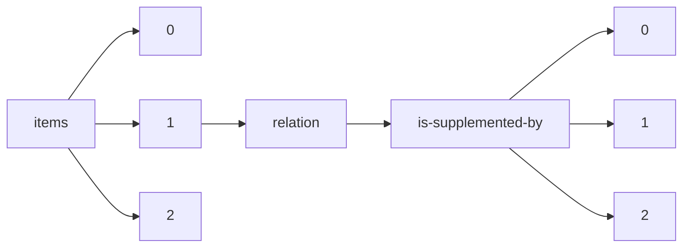

!!! warning "This document is not official Crossref documentation"
# Elements
PATH = items/array/relation/is-supplemented-by/array(1)  
Occurs 79 134 times  
{ .annotate }

1. A route to an element, for example:  
   The route "items/array/relation/is-supplemented-by/array" corresponds to navigating through the JSON indices as  
   ["items"][0]["relation"]["is-supplemented-by"][0]  

## Asserted-by
See more information: [items/array/relation/is-supplemented-by/array/asserted-by](asserted-by/index.md)  
Occurs 79 134 timess  
Unique values: 2  

| **Row** | **Value** `String` | **Count** `Int64` |
|--------:|----------------------:|---------------------:|
| **1**   | subject               | 66 989               |
| **2**   | object                | 12 145               |

## Id
See more information: [items/array/relation/is-supplemented-by/array/id](id/index.md)  
Occurs 79 134 timess  
Unique values: > 999  

!!! note "Due to current limitations, only the first 1,000 unique values are counted."

| **Row** | **Value** `String`                                        | **Count** `Int64` |
|--------:|-------------------------------------------------------------:|---------------------:|
| **1**   | http://www.ncbi.nlm.nih.gov/geo/query/acc.cgi?acc=GSE52914   | 12                   |
| **2**   | https://roucoulab.com/p/downloads                            | 9                    |
| **3**   | 10.21428/cbd17b20.e8104259/81ff44d9                          | 8                    |
| **4**   | GitHub                                                       | 7                    |
| **5**   | 10.1056/EVIDdo000005                                         | 5                    |
| **6**   | 10.7488/ds/188                                               | 5                    |
| **7**   | https://solgenomics.net/                                     | 5                    |
| **8**   | 10.5066/F78051VM                                             | 5                    |
| **9**   | http://neuromorpho.org/neuroMorpho/index.jsp                 | 4                    |
| **10**  | https://www.ncbi.nlm.nih.gov/geo/query/acc.cgi?acc=GSE104761 | 4                    |
| ... | ... | ... |

## Id-type
See more information: [items/array/relation/is-supplemented-by/array/id-type](id-type/index.md)  
Occurs 79 134 timess  
Unique values: 6  

| **Row** | **Value** `String` | **Count** `Int64` |
|--------:|----------------------:|---------------------:|
| **1**   | doi                   | 69 048               |
| **2**   | accession             | 5 265                |
| **3**   | uri                   | 4 799                |
| **4**   | handle                | 18                   |
| **5**   | long-doi              | 2                    |
| **6**   | other                 | 2                    |

