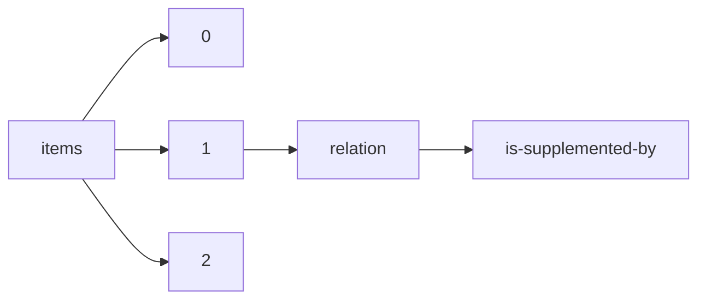

!!! warning "This document is not official Crossref documentation"
# Is-supplemented-by
PATH = items/array/relation/is-supplemented-by(1)  
Occurs 43 005 times  
{ .annotate }

1. A route to an element, for example:  
   The route "items/array/relation/is-supplemented-by" corresponds to navigating through the JSON indices as  
   ["items"][0]["relation"]["is-supplemented-by"]  

## Properties of Array
See information about elements: [items/array/relation/is-supplemented-by/array](array/index.md)  
Distribution of lengths:  

| **Row** | **Length** `Any` | **Count** `Int64` |
|--------:|--------------------:|---------------------:|
| **1**   | 1                   | 23 944               |
| **2**   | 2                   | 13 704               |
| **3**   | 3                   | 2 429                |
| **4**   | 4                   | 1 004                |
| **5**   | 5                   | 585                  |
| **6**   | 6                   | 321                  |
| **7**   | 7                   | 270                  |
| **8**   | 8                   | 175                  |
| **9**   | 9                   | 109                  |
| **10**  | 10                  | 86                   |
| ... | ... | ... |

