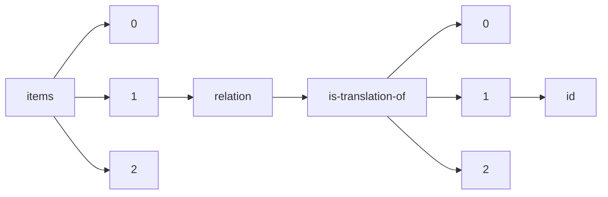

!!! warning "This document is not official Crossref documentation"
# Id
PATH = items/array/relation/is-translation-of/array/id(1)  
Occurs 10 912 times  
Unique values: > 999  
{ .annotate }

1. A route to an element, for example:  
   The route "items/array/relation/is-translation-of/array/id" corresponds to navigating through the JSON indices as  
   ["items"][0]["relation"]["is-translation-of"][0]["id"]  

!!! note "Due to current limitations, only the first 1,000 unique values are counted."

| **Row** | **Value** `String`                                        | **Count** `Int64` |
|--------:|-------------------------------------------------------------:|---------------------:|
| **1**   | 10.37019/e-anatomy/49577                                     | 16                   |
| **2**   | 10.6028/NIST.CSWP.6                                          | 14                   |
| **3**   | PropPIDdifferentlang                                         | 5                    |
| **4**   | 10.38126/JSPG180303                                          | 5                    |
| **5**   | 10.6028/NIST.CSWP.10                                         | 5                    |
| **6**   | 10.37019/e-anatomy/940479                                    | 4                    |
| **7**   | 10.1590/0103-11042022e500i                                   | 4                    |
| **8**   | 10.37019/e-anatomy/580429                                    | 4                    |
| **9**   | 10.37019/vet-anatomy/927205                                  | 3                    |
| **10**  | 10.24135/link2021.v2i1.77                                    | 3                    |
| **11**  | 10.21428/cbd17b20.b955b312                                   | 3                    |
| **12**  | 10.21428/cbd17b20.57e620a4/a02cb3b7                          | 3                    |
| **13**  | 10.37019/e-anatomy/410042                                    | 3                    |
| **14**  | 10.6028/NIST.IR.8115                                         | 3                    |
| **15**  | 10.24135/link2021.v2i1.132                                   | 3                    |
| **16**  | 10.1590/1982-7849rac2023220008.en                            | 2                    |
| **17**  | 10.24135/link2021.v2i1.102                                   | 2                    |
| **18**  | 10.1590/1809-2950/22008629042022en                           | 2                    |
| **19**  | 10.1590/1518-8345.6488.3877                                  | 2                    |
| **20**  | 10.4467/27204383TER.23.004.17444                             | 2                    |
| **21**  | 10.1590/0102-311xen228122                                    | 2                    |
| **22**  | 10.4467/2543702XSHS.17.021.7722                              | 2                    |
| **23**  | 10.1590/1980-220x-reeusp-2021-0442pt                         | 2                    |
| **24**  | 10.1590/ce.v28i0.88967                                       | 2                    |
| **25**  | 10.1590/0103-11042022e610i                                   | 2                    |
| **26**  | 10.1590/1518-8345.6488.3876                                  | 2                    |
| **27**  | 10.1590/1982-0259.2023e92542                                 | 2                    |
| **28**  | 10.4467/27204383TER.22.020.16340                             | 2                    |
| **29**  | 10.1590/2175-35392022226330t                                 | 2                    |
| **30**  | 10.1590/1809-58442022105en                                   | 2                    |
| **31**  | 10.17537/2012.7.676                                          | 2                    |
| **32**  | 10.1590/1981-22562022025.220097.en                           | 2                    |
| **33**  | 10.1590/1984-92302023v30n0000pt                              | 2                    |
| **34**  | 10.1590/1982-7849rac2022210166.en                            | 2                    |
| **35**  | 10.1590/0102-4698237523-t                                    | 2                    |
| **36**  | 10.1590/s1413-24782022270069                                 | 2                    |
| **37**  | 10.18485/aida.2023.24.ch4                                    | 2                    |
| **38**  | 10.53855/bjt.v25i3.464\_pt                                   | 2                    |
| **39**  | 10.1590/1983-80422022304578es                                | 2                    |
| **40**  | 10.1590/2236-9996.2023-5712.e                                | 2                    |
| **41**  | 10.1590/1983-1447.2022.20220222.pt                           | 2                    |
| **42**  | 10.24075/vrgmu.2020.029                                      | 2                    |
| **43**  | 10.1590/1983-80422022303556es                                | 2                    |
| **44**  | 10.4467/27204383TER.22.004.15420                             | 2                    |
| **45**  | 10.46856/grp.27.e153                                         | 2                    |
| **46**  | 10.24135/link2021.v2i1.91                                    | 2                    |
| **47**  | 10.1590/0103-11042022e619i                                   | 2                    |
| **48**  | 10.24135/link2021.v2i1.146                                   | 2                    |
| **49**  | 10.1590/0102-311xes009523                                    | 2                    |
| **50**  | 10.1590/1983-80422022304565es                                | 2                    |
| **51**  | 10.1590/1518-8345.6224.3863                                  | 2                    |
| **52**  | 10.46856/grp.22.e103                                         | 2                    |
| **53**  | 10.1590/0034-7167-2022-0096pt                                | 2                    |
| **54**  | 10.24075/vrgmu.2019.090                                      | 2                    |
| **55**  | 10.1590/0103-11042022e612i                                   | 2                    |
| **56**  | 10.1590/1981-22562022025.220131.en                           | 2                    |
| **57**  | 10.1590/1983-80422022304576en                                | 2                    |
| **58**  | 10.1590/0034-7167-2022-0191pt                                | 2                    |
| **59**  | 10.5380/ce.v27i0.84798                                       | 2                    |
| **60**  | 10.24135/link2021.v2i1.142                                   | 2                    |
| **61**  | 10.1590/0103-11042022e410i                                   | 2                    |
| **62**  | 10.1590/1518-8345.6123.3832                                  | 2                    |
| **63**  | 10.1590/0100-6991e-20233425                                  | 2                    |
| **64**  | 10.1590/0102-469838402t                                      | 2                    |
| **65**  | 10.1590/1981-22562022025.220129.en                           | 2                    |
| **66**  | 10.53855/bjt.v25i4.474\_PT                                   | 2                    |
| **67**  | 10.1590/0102-469840451t                                      | 2                    |
| **68**  | 10.4467/27204383TER.23.007.17447                             | 2                    |
| **69**  | 10.1590/2177-9465-ean-2022-0194en                            | 2                    |
| **70**  | 10.15372/FTPRPI20200501                                      | 2                    |
| **71**  | 10.5380/ce.v27i0.84427                                       | 2                    |
| **72**  | 10.17537/2016.11.170                                         | 2                    |
| **73**  | 10.52351/00260827\_2022\_06\_11                              | 2                    |
| **74**  | 10.24075/vrgmu.2020.040                                      | 2                    |
| **75**  | 10.1590/0103-11042022e318i                                   | 2                    |
| **76**  | 10.1590/2176-4573e54994                                      | 2                    |
| **77**  | 10.33273/2663-9726-2020-53-2-102-109                         | 2                    |
| **78**  | 10.1590/1983-80422022304569es                                | 2                    |
| **79**  | 10.1590/1518-8345.6220.3826                                  | 2                    |
| **80**  | 10.1590/2177-9465-ean-2022-0274en                            | 2                    |
| **81**  | 10.1590/0103-11042022e617i                                   | 2                    |
| **82**  | 10.1590/0034-7167-2021-0648pt                                | 2                    |
| **83**  | 10.4467/27204383TER.23.005.17445                             | 2                    |
| **84**  | 10.1590/1806-9304202300000074                                | 2                    |
| **85**  | 10.37019/e-anatomy/901113                                    | 2                    |
| **86**  | 10.31857/S0044460X21020050                                   | 2                    |
| **87**  | 10.4467/2543702XSHS.18.002.9322                              | 2                    |
| **88**  | 10.1590/1413-81232023283.12802022en                          | 2                    |
| **89**  | 10.1590/2175-35392022236195t                                 | 2                    |
| **90**  | 10.1590/0103-11042022e306i                                   | 2                    |
| **91**  | 10.5380/ce.v27i0.81118                                       | 2                    |
| **92**  | 10.1590/0103-11042022e308i                                   | 2                    |
| **93**  | 10.1590/1983-1447.2022.20220150.pt                           | 2                    |
| **94**  | 10.24075/vrgmu.2020.007                                      | 2                    |
| **95**  | 10.1590/0100-6991e-20223320                                  | 2                    |
| **96**  | 10.24075/vrgmu.2020.049                                      | 2                    |
| **97**  | 10.17537/2020.15.148                                         | 2                    |
| **98**  | 10.46856/grp.27.e130                                         | 2                    |
| **99**  | 10.1590/1518-8345.6224.3865                                  | 2                    |
| **100** | 10.1590/1981-22562022025.220127.en                           | 2                    |
| **101** | 10.5380/ce.v27i0.81759                                       | 2                    |
| **102** | 10.1590/1980-5764-dn-2022-s102en                             | 2                    |
| **103** | 10.33273/2663-4570-2020-88-1-23-41                           | 2                    |
| **104** | 10.1590/0103-11042022e614i                                   | 2                    |
| **105** | 10.1590/1518-8345.6214.3820                                  | 2                    |
| **106** | 10.24075/vrgmu.2019.076                                      | 2                    |
| **107** | 10.1590/1677-5449.202000532                                  | 2                    |
| **108** | 10.1590/1518-8345.5653.3564                                  | 2                    |
| **109** | 10.1590/1983-1447.2022.20210088.pt                           | 2                    |
| **110** | 10.1590/0102-469836627t                                      | 2                    |
| **111** | 10.4467/27204383TER.22.023.16343                             | 2                    |
| **112** | 10.1590/0034-7167-2022-0193pt                                | 2                    |
| **113** | 10.1590/2176-4573e56079                                      | 2                    |
| **114** | 10.1590/1983-1447.2022.20210071.pt                           | 2                    |
| **115** | 10.46856/grp.26.e127                                         | 2                    |
| **116** | 10.37019/e-anatomy/901093                                    | 2                    |
| **117** | 10.1590/0100-3984.2022.0062-en                               | 2                    |
| **118** | 10.1590/1518-8345.6057.3817                                  | 2                    |
| **119** | 10.5380/ce.v27i0.84081                                       | 2                    |
| **120** | 10.46856/grp.22.e126                                         | 2                    |
| **121** | 10.1590/0103-11042022e409i                                   | 2                    |
| **122** | 10.17537/2012.7.611                                          | 2                    |
| **123** | 10.1590/1518-8345.6107.3766                                  | 2                    |
| **124** | 10.1590/1983-1447.2022.20200425.pt                           | 2                    |
| **125** | 10.1590/0102-469826784t                                      | 2                    |
| **126** | 10.1590/s0034-759020230205x                                  | 2                    |
| **127** | 10.53855/bjt.v25i2.452\_pt                                   | 2                    |
| **128** | 10.1590/1809-6891v24e-73611p                                 | 2                    |
| **129** | 10.5380/ce.v27i0.82791                                       | 2                    |
| **130** | 10.1590/2526-8910.ctoao256333432                             | 2                    |
| **131** | 10.1590/2177-9465-ean-2022-0279en                            | 2                    |
| **132** | 10.1590/1983-1447.2022.20220050.pt                           | 2                    |
| **133** | 10.1590/1809-2950/21016629042022en                           | 2                    |
| **134** | 10.1590/s0103-4014.2023.37107.006en                          | 2                    |
| **135** | 10.17537/2018.13.208                                         | 2                    |
| **136** | 10.1590/0034-7167.2022750301                                 | 2                    |
| **137** | 10.1590/1677-5449.202200012                                  | 2                    |
| **138** | 10.1590/1677-5449.202101932                                  | 2                    |
| **139** | 10.1590/0102-469837755-t                                     | 2                    |
| **140** | 10.1590/2236-9996.2022-5513.e                                | 2                    |
| **141** | 10.1590/2175-8239-jbn-2022-0036pt                            | 2                    |
| **142** | 10.1590/0103-11042022e404i                                   | 2                    |
| **143** | 10.1590/1983-80422022302539es                                | 2                    |
| **144** | 10.1590/1518-8345.6309.3799                                  | 2                    |
| **145** | 10.1590/1983-1447.2022.20220213.pt                           | 2                    |
| **146** | 10.1590/1518-8345.5928.3691                                  | 2                    |
| **147** | 10.1590/1980-549720230016.2                                  | 2                    |
| **148** | 10.1590/2317-6431-2022-2745en                                | 2                    |
| **149** | 10.24075/vrgmu.2020.032                                      | 2                    |
| **150** | 10.5380/ce.v27i0.80960                                       | 2                    |
| **151** | 10.1590/2236-9996.2022-5505.e                                | 2                    |
| **152** | 10.1590/1679-395120220076x                                   | 2                    |
| **153** | 10.1590/1518-8345.5937.3763                                  | 2                    |
| **154** | 10.1590/2317-6369/06220en2020v47e9                           | 2                    |
| **155** | 10.1590/1980-6248-2021-0033en                                | 2                    |
| **156** | 10.1590/1982-7849rac2022210251.en                            | 2                    |
| **157** | 10.1590/1809-6891v24e-73159p                                 | 2                    |
| **158** | 10.1590/0103-1104202213419i                                  | 2                    |
| **159** | 10.1590/0034-7167-2022-0308pt                                | 2                    |
| **160** | 10.1590/1413-81232023283.10552022en                          | 2                    |
| **161** | 10.1590/1982-7849rac2023220017.en                            | 2                    |
| **162** | 10.1590/1808-057x20221582.pt                                 | 2                    |
| **163** | 10.1590/1983-80422022304579es                                | 2                    |
| **164** | 10.1590/2177-9465-ean-2022-0330en                            | 2                    |
| **165** | 10.1590/0100-6991e-20233398                                  | 2                    |
| **166** | 10.1590/1413-81232023283.11782022en                          | 2                    |
| **167** | 10.1590/1679-395120220049x                                   | 2                    |
| **168** | 10.7250/IAV.2020.005                                         | 2                    |
| **169** | 10.1590/1518-8345.6309.3797                                  | 2                    |
| **170** | 10.1590/1981-5271v47.1-20220206.ing                          | 2                    |
| **171** | 10.7250/IAV.2018.008                                         | 2                    |
| **172** | 10.17537/2015.10.116                                         | 2                    |
| **173** | 10.1590/ce.v28i0.89003                                       | 2                    |
| **174** | 10.1590/0103-11042022e606i                                   | 2                    |
| **175** | 10.1590/1808-057x20221667.pt                                 | 2                    |
| **176** | 10.1590/1983-80422022303556en                                | 2                    |
| **177** | 10.1590/1983-1447.2022.20200491.pt                           | 2                    |
| **178** | 10.4467/2543702XSHS.17.002.7703                              | 2                    |
| **179** | 10.24135/link2021.v2i1.166                                   | 2                    |
| **180** | 10.1590/0102-311xen009523                                    | 2                    |
| **181** | 10.17537/2019.14.500                                         | 2                    |
| **182** | 10.30886/estima.v18.867\_IN                                  | 2                    |
| **183** | 10.1590/1982-7849rac2022220014.por                           | 2                    |
| **184** | 10.1590/1413-81232022279.05352022en                          | 2                    |
| **185** | 10.1590/0034-7167-2022-0067pt                                | 2                    |
| **186** | 10.1590/1983-1447.2022.20210163.pt                           | 2                    |
| **187** | 10.1590/1984-92302023v30n0001pt                              | 2                    |
| **188** | 10.1590/1983-80422022304568es                                | 2                    |
| **189** | 10.1590/1518-8345.6101.3827                                  | 2                    |
| **190** | 10.24075/vrgmu.2020.038                                      | 2                    |
| **191** | 10.17537/2011.6.53                                           | 2                    |
| **192** | 10.1590/0103-11042022e402i                                   | 2                    |
| **193** | 10.1590/1517-8692202329022022\_0539p                         | 2                    |
| **194** | 10.1590/1413-812320222710.07732022en                         | 2                    |
| **195** | 10.1590/1983-80422022304579en                                | 2                    |
| **196** | 10.17537/2020.15.394                                         | 2                    |
| **197** | 10.1590/1517-8692202329022022\_0146p                         | 2                    |
| **198** | 10.1590/0103-11042022e609i                                   | 2                    |
| **199** | 10.1590/0103-11042022e406i                                   | 2                    |
| **200** | 10.24135/link2021.v2i1.82                                    | 2                    |
| **201** | 10.24135/link2021.v2i1.127                                   | 2                    |
| **202** | 10.1590/1983-80422022304566en                                | 2                    |
| **203** | 10.1590/1517-8692202329022021\_0413p                         | 2                    |
| **204** | 10.1590/1413-81232023283.02892022en                          | 2                    |
| **205** | 10.53855/bjt.v25i4.483\_PT                                   | 2                    |
| **206** | 10.1590/s0104-12902022200853en                               | 2                    |
| **207** | 10.1590/1980-549720230012.2                                  | 2                    |
| **208** | 10.1590/0034-7167-2021-0961pt                                | 2                    |
| **209** | 10.1590/1413-81232023283.11762022en                          | 2                    |
| **210** | 10.1590/1982-7849rac2023220078.en                            | 2                    |
| **211** | 10.7250/IAV.2020.003                                         | 2                    |
| **212** | 10.1590/1518-8345.6214.3818                                  | 2                    |
| **213** | 10.4467/27204383TER.22.022.16342                             | 2                    |
| **214** | 10.1590/s0034-759020230109x                                  | 2                    |
| **215** | 10.24135/link2021.v2i1.65                                    | 2                    |
| **216** | 10.1590/0100-6991e-20233442                                  | 2                    |
| **217** | 10.1590/1981-5271v46.1-20210286                              | 2                    |
| **218** | 10.1590/0102-311xen021723                                    | 2                    |
| **219** | 10.1590/1517-8692202329022022\_0144p                         | 2                    |
| **220** | 10.1590/ce.v28i0.89206                                       | 2                    |
| **221** | 10.7250/IAV.2018.011                                         | 2                    |
| **222** | 10.1590/1518-8345.6149.3769                                  | 2                    |
| **223** | 10.1590/1518-8345.6231.3836                                  | 2                    |
| **224** | 10.1590/0034-7167-2022-0272pt                                | 2                    |
| **225** | 10.1590/1983-1447.2022.20220174.pt                           | 2                    |
| **226** | 10.53855/bjt.v25i3.458\_pt                                   | 2                    |
| **227** | 10.1590/18070337-125405                                      | 2                    |
| **228** | 10.1590/1980-265x-tce-2022-0026pt                            | 2                    |
| **229** | 10.1590/1518-8345.6039.3823                                  | 2                    |
| **230** | 10.1590/1984-92302023v30n0003pt                              | 2                    |
| **231** | 10.1590/0102-469836571-t                                     | 2                    |
| **232** | 10.1590/0103-11042022e313i                                   | 2                    |
| **233** | 10.1590/0100-6991e-20233431                                  | 2                    |
| **234** | 10.46856/grp.26.e105                                         | 2                    |
| **235** | 10.1590/0034-7167-2022-0301pt                                | 2                    |
| **236** | 10.37019/e-anatomy/181                                       | 2                    |
| **237** | 10.1590/1413-81232023283.07032022en                          | 2                    |
| **238** | 10.1590/2176-4573e56046                                      | 2                    |
| **239** | 10.1590/1982-7849rac2023210298.en                            | 2                    |
| **240** | 10.1590/1809-6891v24e-73623p                                 | 2                    |
| **241** | 10.1590/0102-469825306t                                      | 2                    |
| **242** | 10.1590/1807-0310/2022v34258310-en                           | 2                    |
| **243** | 10.1590/0100-3984.2022.55.3e1                                | 2                    |
| **244** | 10.17537/2018.13.533                                         | 2                    |
| **245** | 10.1590/0034-7167-2022-0265pt                                | 2                    |
| **246** | 10.1590/1413-81232023283.12992022en                          | 2                    |
| **247** | 10.1590/1982-0216/20222426921s                               | 2                    |
| **248** | 10.5380/ce.v27i0.82680                                       | 2                    |
| **249** | 10.1590/2237-2660123084                                      | 2                    |
| **250** | 10.1590/2236-9996.2022-5515.e                                | 2                    |
| **251** | 10.1590/s0034-759020230107x                                  | 2                    |
| **252** | 10.24135/link2021.v2i1.89                                    | 2                    |
| **253** | 10.1590/1809-2950/22016129042022en                           | 2                    |
| **254** | 10.1590/1518-8345.6202.3854                                  | 2                    |
| **255** | 10.1590/1518-8345.6220.3824                                  | 2                    |
| **256** | 10.1590/1983-80422022304567en                                | 2                    |
| **257** | 10.1590/0103-11042022e413i                                   | 2                    |
| **258** | 10.1590/1983-1447.2022.20210257.pt                           | 2                    |
| **259** | 10.1590/1518-8345.5552.3725                                  | 2                    |
| **260** | 10.24135/link2021.v2i1.122                                   | 2                    |
| **261** | 10.1590/2317-6431-2022-2627en                                | 2                    |
| **262** | 10.37019/e-anatomy/826011                                    | 2                    |
| **263** | 10.1590/s0034-759020230108x                                  | 2                    |
| **264** | 10.1590/1983-80422022304573en                                | 2                    |
| **265** | 10.1590/1983-1447.2022.20210045.pt                           | 2                    |
| **266** | 10.1590/1983-1447.2022.20200179.pt                           | 2                    |
| **267** | 10.4467/23921749SHS.16.022.6165                              | 2                    |
| **268** | 10.1590/1983-80422022304563en                                | 2                    |
| **269** | 10.1590/2176-4573e57769                                      | 2                    |
| **270** | 10.1590/s0103-4014.2023.37107.020en                          | 2                    |
| **271** | 10.33273/2663-4570-2020-89-2-40-47                           | 2                    |
| **272** | 10.24075/vrgmu.2020.012                                      | 2                    |
| **273** | 10.1590/1413-81232022277.19432021en                          | 2                    |
| **274** | 10.53855/bjt.v25i2.445\_pt                                   | 2                    |
| **275** | 10.1590/1983-1447.2022.20210151.pt                           | 2                    |
| **276** | 10.24135/link2021.v2i1.94                                    | 2                    |
| **277** | 10.1590/0100-6991e-20233429                                  | 2                    |
| **278** | 10.31857/S0033831122050021                                   | 2                    |
| **279** | 10.1590/1518-8345.5552.3727                                  | 2                    |
| **280** | 10.1590/1980-220x-reeusp-2021-0233pt                         | 2                    |
| **281** | 10.17537/2017.12.102                                         | 2                    |
| **282** | 10.5380/ce.v27i0.81354                                       | 2                    |
| **283** | 10.17537/2019.14.635                                         | 2                    |
| **284** | 10.1590/1983-80422022304577en                                | 2                    |
| **285** | 10.1590/0100-3984.2022.0083                                  | 2                    |
| **286** | 10.1590/0100-3984.2023.56.1e1-en                             | 2                    |
| **287** | 10.24075/vrgmu.2020.034                                      | 2                    |
| **288** | 10.1590/1980-220x-reeusp-2022-0168pt                         | 2                    |
| **289** | 10.1590/0103-11042022e310i                                   | 2                    |
| **290** | 10.1590/s1678-4634202349241907eng                            | 2                    |
| **291** | 10.1590/1808-057x20221618.pt                                 | 2                    |
| **292** | 10.24075/vrgmu.2020.014                                      | 2                    |
| **293** | 10.1590/2317-6431-2022-2725en                                | 2                    |
| **294** | 10.1590/1983-80422022304568en                                | 2                    |
| **295** | 10.1590/1980-549720230011.2                                  | 2                    |
| **296** | 10.17537/2014.9.543                                          | 2                    |
| **297** | 10.1590/1809-6891v24e-74134p                                 | 2                    |
| **298** | 10.1590/1983-21172022240137t                                 | 2                    |
| **299** | 10.1590/1809-58442022106en                                   | 2                    |
| **300** | 10.1590/1980-220x-reeusp-2022-0339pt                         | 2                    |
| **301** | 10.1590/1980-265x-tce-2021-0287pt                            | 2                    |
| **302** | 10.24075/vrgmu.2020.033                                      | 2                    |
| **303** | 10.1590/0102-311xen145722                                    | 2                    |
| **304** | 10.1590/1983-80422022304575es                                | 2                    |
| **305** | 10.1590/2176-4573e56675                                      | 2                    |
| **306** | 10.1590/1980-549720230018.2                                  | 2                    |
| **307** | 10.1590/1983-1447.2022.20210038.pt                           | 2                    |
| **308** | 10.1590/2175-8239-jbn-2022-0107pt                            | 2                    |
| **309** | 10.1590/0034-7167-2022-0644pt                                | 2                    |
| **310** | 10.1590/s1413-24782023280013                                 | 2                    |
| **311** | 10.1590/1981-22562022025.220183.en                           | 2                    |
| **312** | 10.1590/0034-7167-2022-0161pt                                | 2                    |
| **313** | 10.17537/2013.8.553                                          | 2                    |
| **314** | 10.1590/0034-7167-2022-0172pt                                | 2                    |
| **315** | 10.1590/1980-549720230013.2                                  | 2                    |
| **316** | 10.1590/2526-8910.ctoao246732282                             | 2                    |
| **317** | 10.1590/s1678-4634202349248484en                             | 2                    |
| **318** | 10.1590/1809-6891v23e72352p                                  | 2                    |
| **319** | 10.1590/0034-7167-2021-0482pt                                | 2                    |
| **320** | 10.1590/1983-21172022240137tt                                | 2                    |
| **321** | 10.1590/2236-9996.2022-5514.e                                | 2                    |
| **322** | 10.54394/AQOF1491                                            | 2                    |
| **323** | 10.1590/s0034-759020220205x                                  | 2                    |
| **324** | 10.1590/1983-80422022302529es                                | 2                    |
| **325** | 10.1590/1983-80422022304572en                                | 2                    |
| **326** | 10.1590/2526-8910.ctoao253733152                             | 2                    |
| **327** | 10.24135/link2021.v2i1.79                                    | 2                    |
| **328** | 10.1590/0103-11042022e400i                                   | 2                    |
| **329** | 10.53855/bjt.v25i4.481\_PT                                   | 2                    |
| **330** | 10.1590/1980-220x-reeusp-2021-0476es                         | 2                    |
| **331** | 10.1590/1518-8345.6230.3737                                  | 2                    |
| **332** | 10.46856/grp.233.e120                                        | 2                    |
| **333** | 10.1590/0034-7167-2022-0209pt                                | 2                    |
| **334** | 10.1590/2317-6431-2022-2685en                                | 2                    |
| **335** | 10.1590/1809-2950/22008129042022en                           | 2                    |
| **336** | 10.1590/1984-92302023v30n0005pt                              | 2                    |
| **337** | 10.4467/27204383TER.23.006.17446                             | 2                    |
| **338** | 10.1590/ce.v28i0.89002                                       | 2                    |
| **339** | 10.1590/1983-80422022302529en                                | 2                    |
| **340** | 10.1590/ce.v28i0.89207                                       | 2                    |
| **341** | 10.1590/1983-1447.2022.20220205.pt                           | 2                    |
| **342** | 10.1590/1809-6891v23e-71763p                                 | 2                    |
| **343** | 10.1590/1518-8345.0000.3907                                  | 2                    |
| **344** | 10.1590/s0103-73312022320403-en                              | 2                    |
| **345** | 10.1590/0102-469825019t                                      | 2                    |
| **346** | 10.1590/1981-22562021024.210144.en                           | 2                    |
| **347** | 10.1590/1981-22562022025.210234.en                           | 2                    |
| **348** | 10.1590/1518-8345.6215.3740                                  | 2                    |
| **349** | 10.1590/0034-7167-2022-0181pt                                | 2                    |
| **350** | 10.33273/2663-9726-2020-53-2-39-48                           | 2                    |
| **351** | 10.1590/1517-8692202329022022\_0139p                         | 2                    |
| **352** | 10.30841/2708-8731.7.2022.272463                             | 2                    |
| **353** | 10.1590/1677-5449.202200812                                  | 2                    |
| **354** | 10.1590/s0034-759020230206x                                  | 2                    |
| **355** | 10.1590/s0034-759020230201x                                  | 2                    |
| **356** | 10.7250/IAV.2018.009                                         | 2                    |
| **357** | 10.1590/0102-311xen148222                                    | 2                    |
| **358** | 10.1590/1980-549720230015.2                                  | 2                    |
| **359** | 10.1590/2177-9465-ean-2022-0229en                            | 2                    |
| **360** | 10.1590/2176-4573e58496                                      | 2                    |
| **361** | 10.1590/0103-11042022e407i                                   | 2                    |
| **362** | 10.17537/2017.12.398                                         | 2                    |
| **363** | 10.5380/ce.v27i0.82948                                       | 2                    |
| **364** | 10.53855/bjt.v25i3.468\_pt                                   | 2                    |
| **365** | 10.17537/2015.10.508                                         | 2                    |
| **366** | 10.1590/1518-8345.5998.3721                                  | 2                    |
| **367** | 10.24075/vrgmu.2019.079                                      | 2                    |
| **368** | 10.5380/ce.v27i0.82388                                       | 2                    |
| **369** | 10.7250/IAV.2020.004                                         | 2                    |
| **370** | 10.1590/1983-80422022304562en                                | 2                    |
| **371** | 10.1590/1808-057x20221578.pt                                 | 2                    |
| **372** | 10.1590/0103-11042022e415i                                   | 2                    |
| **373** | 10.33273/2663-4570-2020-88-1-79-90                           | 2                    |
| **374** | 10.1590/1518-8345.6032.3889                                  | 2                    |
| **375** | 10.4467/20801335PBW.22.047.16938                             | 2                    |
| **376** | 10.1590/2237-2660125702vs02                                  | 2                    |
| **377** | 10.1590/0100-6991e-20223264                                  | 2                    |
| **378** | 10.1590/0100-6991e-20233403                                  | 2                    |
| **379** | 10.1590/0103-11042022e305i                                   | 2                    |
| **380** | 10.1590/1984-0411.82903-t                                    | 2                    |
| **381** | 10.1590/1983-80422022304580en                                | 2                    |
| **382** | 10.1590/1678-6971/eramr220239.pt                             | 2                    |
| **383** | 10.17537/2019.14.683                                         | 2                    |
| **384** | 10.1590/2176-4573e55664                                      | 2                    |
| **385** | 10.1590/1518-8345.6057.3815                                  | 2                    |
| **386** | 10.1590/2237-2660126011vs02                                  | 2                    |
| **387** | 10.1590/1983-80422022304000es                                | 2                    |
| **388** | 10.1590/s0104-12902023220121en                               | 2                    |
| **389** | 10.1590/1980-220x-reeusp-2022-0082pt                         | 2                    |
| **390** | 10.24135/link2021.v2i1.68                                    | 2                    |
| **391** | 10.24075/vrgmu.2020.015                                      | 2                    |
| **392** | 10.7250/IAV.2018.006                                         | 2                    |
| **393** | 10.24135/link2021.v2i1.131                                   | 2                    |
| **394** | 10.1590/1980-220x-reeusp-2022-0188pt                         | 2                    |
| **395** | 10.1590/1809-2950/22004029042022en                           | 2                    |
| **396** | 10.1590/1980-265x-tce-2021-0444pt                            | 2                    |
| **397** | 10.1590/1983-80422022304569en                                | 2                    |
| **398** | 10.1590/0103-11042022e314i                                   | 2                    |
| **399** | 10.1590/1983-21172022240109t                                 | 2                    |
| **400** | 10.1590/1677-5449.202201512                                  | 2                    |
| **401** | 10.1590/1982-7849rac2023230017.en                            | 2                    |
| **402** | 10.17537/2020.15.73                                          | 2                    |
| **403** | 10.1590/1809-2950/220130311022en                             | 2                    |
| **404** | 10.1590/1517-8692202329022021\_0328p                         | 2                    |
| **405** | 10.1590/1809-2950/200258011022en                             | 2                    |
| **406** | 10.1590/1677-5449.202101512                                  | 2                    |
| **407** | 10.1590/1983-80422022302521en                                | 2                    |
| **408** | 10.24135/link2021.v2i1.123                                   | 2                    |
| **409** | 10.1590/ce.v28i0.88970                                       | 2                    |
| **410** | 10.1590/1518-8345.6149.3767                                  | 2                    |
| **411** | 10.1590/1677-5449.202200272                                  | 2                    |
| **412** | 10.1590/1808-057x20221563.pt                                 | 2                    |
| **413** | 10.33273/2663-9726-2020-53-2-88-95                           | 2                    |
| **414** | 10.24075/vrgmu.2020.016                                      | 2                    |
| **415** | 10.1590/1413-81232023283.13042022en                          | 2                    |
| **416** | 10.21428/cbd17b20.e8104259                                   | 2                    |
| **417** | 10.1590/0034-7167-2021-0939pt                                | 2                    |
| **418** | 10.31857/S020595920013341-1                                  | 2                    |
| **419** | 10.1590/1413-81232023283.13822022en                          | 2                    |
| **420** | 10.1590/2177-9465-ean-2022-0291en                            | 2                    |
| **421** | 10.1590/0034-7167-2022-0302pt                                | 2                    |
| **422** | 10.1590/2237-2660126307vs02                                  | 2                    |
| **423** | 10.1590/0034-7167-2021-0244pt                                | 2                    |
| **424** | 10.24075/vrgmu.2020.027                                      | 2                    |
| **425** | 10.1590/1518-8345.6071.3746                                  | 2                    |
| **426** | 10.1590/1518-8345.6128.3812                                  | 2                    |
| **427** | 10.1590/0100-6991e-20233405                                  | 2                    |
| **428** | 10.1590/2236-9996.2022-5512.e                                | 2                    |
| **429** | 10.24075/vrgmu.2020.008                                      | 2                    |
| **430** | 10.1590/1413-81232022279.01882022en                          | 2                    |
| **431** | 10.1590/2317-1782/20212022208en                              | 2                    |
| **432** | 10.1590/0103-11042022e412i                                   | 2                    |
| **433** | 10.1590/1983-80422022304563es                                | 2                    |
| **434** | 10.5380/ce.v27i0.84473                                       | 2                    |
| **435** | 10.1590/1983-1447.2022.20210044.pt                           | 2                    |
| **436** | 10.1590/0103-11042022e405i                                   | 2                    |
| **437** | 10.1590/0103-11042022e302i                                   | 2                    |
| **438** | 10.1590/1980-265x-tce-2022-e001-pt                           | 2                    |
| **439** | 10.24075/vrgmu.2020.001                                      | 2                    |
| **440** | 10.1590/1413-81232023283.10182022en                          | 2                    |
| **441** | 10.1590/1981-5271v47.1-20220185.ing                          | 2                    |
| **442** | 10.1590/0102-46926188t                                       | 2                    |
| **443** | 10.1590/1982-7849rac2022210279.en                            | 2                    |
| **444** | 10.1590/0034-7167.2023760201pt                               | 2                    |
| **445** | 10.1590/0103-11042022e603i                                   | 2                    |
| **446** | 10.1590/s1413-24782023280009                                 | 2                    |
| **447** | 10.17537/2013.8.480                                          | 2                    |
| **448** | 10.1590/1983-80422022302534en                                | 2                    |
| **449** | 10.1590/1981-22562022025.220111.en                           | 2                    |
| **450** | 10.1590/0102-311xen023223                                    | 2                    |
| **451** | 10.24075/vrgmu.2019.059                                      | 2                    |
| **452** | 10.5380/ce.v27i0.83996                                       | 2                    |
| **453** | 10.1590/1983-80422022304575en                                | 2                    |
| **454** | 10.1590/0103-11042022e622i                                   | 2                    |
| **455** | 10.1590/1679-395120230003x                                   | 2                    |
| **456** | 10.24135/link2021.v2i1.156                                   | 2                    |
| **457** | 10.1590/0034-7167-2022-0020pt                                | 2                    |
| **458** | 10.1590/1518-8345.5866.3635                                  | 2                    |
| **459** | 10.1590/2176-4573e55416                                      | 2                    |
| **460** | 10.1590/1980-220x-reeusp-2022-0265pt                         | 2                    |
| **461** | 10.4467/20801335PBW.22.048.16939                             | 2                    |
| **462** | 10.24135/link2021.v2i1.106                                   | 2                    |
| **463** | 10.1590/2177-9465-ean-2022-0246en                            | 2                    |
| **464** | 10.1590/0103-11042022e403i                                   | 2                    |
| **465** | 10.24135/link2021.v2i1.103                                   | 2                    |
| **466** | 10.1590/0034-7167-2022-0201pt                                | 2                    |
| **467** | 10.1590/1518-8345.6123.3830                                  | 2                    |
| **468** | 10.1590/0034-7167-2022-0101pt                                | 2                    |
| **469** | 10.24075/vrgmu.2019.074                                      | 2                    |
| **470** | 10.1590/1981-22562021024.210229.en                           | 2                    |
| **471** | 10.1590/s0034-759020230203x                                  | 2                    |
| **472** | 10.1590/0034-7167-2022-0396pt                                | 2                    |
| **473** | 10.24075/vrgmu.2020.024                                      | 2                    |
| **474** | 10.1590/1413-81232022279.01472022en                          | 2                    |
| **475** | 10.1590/1983-80422022304571en                                | 2                    |
| **476** | 10.1590/1518-8345.5653.3523                                  | 2                    |
| **477** | 10.1590/0102-469838419t                                      | 2                    |
| **478** | 10.1590/2237-2660117151vs02                                  | 2                    |
| **479** | 10.17537/2015.10.154                                         | 2                    |
| **480** | 10.4467/20801335PBW.22.049.16940                             | 2                    |
| **481** | 10.4467/27204383TER.22.021.16341                             | 2                    |
| **482** | 10.1590/1518-8345.5928.3689                                  | 2                    |
| **483** | 10.1590/0102-469826629t                                      | 2                    |
| **484** | 10.24075/vrgmu.2020.031                                      | 2                    |
| **485** | 10.1590/0102-311xen163222                                    | 2                    |
| **486** | 10.1590/1809-6891v24e-73661p                                 | 2                    |
| **487** | 10.1590/1413-81232023283.19952022en                          | 2                    |
| **488** | 10.24135/link2021.v2i1.88                                    | 2                    |
| **489** | 10.46856/grp.27.e135                                         | 2                    |
| **490** | 10.24075/vrgmu.2020.035                                      | 2                    |
| **491** | 10.1590/2175-35392022233762t                                 | 2                    |
| **492** | 10.1590/1983-1447.2022.20220228.pt                           | 2                    |
| **493** | 10.1590/1983-80422022304573es                                | 2                    |
| **494** | 10.1590/1518-8345.6202.3856                                  | 2                    |
| **495** | 10.1590/1809-58442022107en                                   | 2                    |
| **496** | 10.1590/1980-265x-tce-2022-e001-es                           | 2                    |
| **497** | 10.17537/2015.10.245                                         | 2                    |
| **498** | 10.7250/IAV.2020.010                                         | 2                    |
| **499** | 10.1590/1517-8692202329022022\_0115p                         | 2                    |
| **500** | 10.1590/s1413-24782023280015                                 | 2                    |
| **501** | 10.1590/1518-8345.6032.3887                                  | 2                    |
| **502** | 10.24075/vrgmu.2019.060                                      | 2                    |
| **503** | 10.1590/0103-11042022e611i                                   | 2                    |
| **504** | 10.1590/1984-92302023v30n0004pt                              | 2                    |
| **505** | 10.4467/2543702XSHS.18.020.9340                              | 2                    |
| **506** | 10.17537/2017.12.521                                         | 2                    |
| **507** | 10.1590/1981-22562022025.220102.en                           | 2                    |
| **508** | 10.1590/0102-311xen066322                                    | 2                    |
| **509** | 10.1590/1809-6891v22e-70836p                                 | 2                    |
| **510** | 10.1590/1808-057x20221636.pt                                 | 2                    |
| **511** | 10.1590/1983-80422022304565en                                | 2                    |
| **512** | 10.1590/0034-7167-2022-0144pt                                | 2                    |
| **513** | 10.1590/1809-2950/22007429042022en                           | 2                    |
| **514** | 10.1590/0100-3984.2021.0149                                  | 2                    |
| **515** | 10.4467/2543702XSHS.16.001.6144                              | 2                    |
| **516** | 10.1590/0102-311xes228122                                    | 2                    |
| **517** | 10.5380/ce.v27i0.80194                                       | 2                    |
| **518** | 10.1590/2177-9465-ean-2021-0334en                            | 2                    |
| **519** | 10.1590/0103-11042022e315i                                   | 2                    |
| **520** | 10.1590/1518-8345.6039.3821                                  | 2                    |
| **521** | 10.1590/1518-8345.6215.3742                                  | 2                    |
| **522** | 10.1590/0100-6991e-20223238                                  | 2                    |
| **523** | 10.1590/1413-81232023283.05722022en                          | 2                    |
| **524** | 10.1590/0100-6991e-20222991                                  | 2                    |
| **525** | 10.1590/1413-81232022279.07092022en                          | 2                    |
| **526** | 10.24135/link2021.v2i1.97                                    | 2                    |
| **527** | 10.1590/1808-057x20211391.pt                                 | 2                    |
| **528** | 10.1590/s1413-24782023280002                                 | 2                    |
| **529** | 10.1590/2237-2660126218vs02                                  | 2                    |
| **530** | 10.1590/1678-6971/eramg220145.pt                             | 2                    |
| **531** | 10.1590/1518-8345.6107.3764                                  | 2                    |
| **532** | 10.1590/0103-11042022e300i                                   | 2                    |
| **533** | 10.1590/s1413-24782023280007                                 | 2                    |
| **534** | 10.1590/0034-7167-2022-0306pt                                | 2                    |
| **535** | 10.18485/aida.2023.24.ch8                                    | 2                    |
| **536** | 10.1590/0034-7167-2022-0028pt                                | 2                    |
| **537** | 10.1590/0103-11042022e717i                                   | 2                    |
| **538** | 10.1590/0034-7167-2022-0280pt                                | 2                    |
| **539** | 10.24135/link2021.v2i1.134                                   | 2                    |
| **540** | 10.1590/1518-8345.5998.3719                                  | 2                    |
| **541** | 10.5380/ce.v27i0.83977                                       | 2                    |
| **542** | 10.1590/1983-80422022302534es                                | 2                    |
| **543** | 10.1590/1679-395120220039                                    | 2                    |
| **544** | 10.1590/1809-2950/22012229042022en                           | 2                    |
| **545** | 10.1590/1983-80422022304564es                                | 2                    |
| **546** | 10.1590/0103-11042021e213i                                   | 2                    |
| **547** | 10.1590/2317-1782/20212021198en                              | 2                    |
| **548** | 10.56373/2023-2-5                                            | 2                    |
| **549** | 10.56373/2023-2-3                                            | 2                    |
| **550** | 10.1590/0034-7167-2022-0530pt                                | 2                    |
| **551** | 10.1590/1983-1447.2022.20200374.pt                           | 2                    |
| **552** | 10.1590/1983-80422022304577es                                | 2                    |
| **553** | 10.1590/0103-1104202213402i                                  | 2                    |
| **554** | 10.1590/1678-6971/eramg220210.pt                             | 2                    |
| **555** | 10.1590/1980-6248-2020-0045en                                | 2                    |
| **556** | 10.7250/IAV.2020.001                                         | 2                    |
| **557** | 10.1590/1517-8692202329022022\_0010p                         | 2                    |
| **558** | 10.7250/IAV.2020.007                                         | 2                    |
| **559** | 10.1590/1807-0310/2022v34262363-en                           | 2                    |
| **560** | 10.1590/1983-1447.2023.20210334.pt                           | 2                    |
| **561** | 10.1590/1983-1447.2022.20210100.pt                           | 2                    |
| **562** | 10.1590/1980-549720230020                                    | 2                    |
| **563** | 10.1590/1983-80422022302521es                                | 2                    |
| **564** | 10.1590/1518-8345.5866.3637                                  | 2                    |
| **565** | 10.1590/1809-58442022104en                                   | 2                    |
| **566** | 10.24075/vrgmu.2020.013                                      | 2                    |
| **567** | 10.1590/1516-73132023000b                                    | 2                    |
| **568** | 10.1590/0103-11042022e304i                                   | 2                    |
| **569** | 10.1590/1677-5449.202101982                                  | 2                    |
| **570** | 10.1590/s1678-4634202349250586eng                            | 2                    |
| **571** | 10.1590/1984-0411.85976-t                                    | 2                    |
| **572** | 10.24135/link2021.v2i1.130                                   | 2                    |
| **573** | 10.1590/1518-8345.6017.3840                                  | 2                    |
| **574** | 10.24075/vrgmu.2019.073                                      | 2                    |
| **575** | 10.1590/1809-6891v24e-73923p                                 | 2                    |
| **576** | 10.1590/1980-6248-2020-0075en                                | 2                    |
| **577** | 10.1590/ce.v28i0.88966                                       | 2                    |
| **578** | 10.1590/1518-8345.6231.3838                                  | 2                    |
| **579** | 10.1590/1518-8345.6017.3841                                  | 2                    |
| **580** | 10.24075/vrgmu.2019.058                                      | 2                    |
| **581** | 10.1590/0103-11042022e720i                                   | 2                    |
| **582** | 10.1590/2177-9465-ean-2022-0236en                            | 2                    |
| **583** | 10.1590/2236-9996.2022-5501.e                                | 2                    |
| **584** | 10.1590/1518-8345.6101.3829                                  | 2                    |
| **585** | 10.4467/27204383TER.22.017.16337                             | 2                    |
| **586** | 10.5380/ce.v27i0.82601                                       | 2                    |
| **587** | 10.1590/1983-80422022304578en                                | 2                    |
| **588** | 10.1590/ce.v28i0.88190                                       | 2                    |
| **589** | 10.1590/0103-11042022e411i                                   | 2                    |
| **590** | 10.1590/0034-7167.202376suppl201pt                           | 2                    |
| **591** | 10.1590/0102-469836778-t                                     | 2                    |
| **592** | 10.1590/0103-11042022e316i                                   | 2                    |
| **593** | 10.53855/bjt.v25i1.451\_pt                                   | 2                    |
| **594** | 10.7250/IAV.2020.006                                         | 2                    |
| **595** | 10.1590/0103-11042022e615i                                   | 2                    |
| **596** | 10.1590/1982-0216/20222425621s                               | 2                    |
| **597** | 10.1590/0103-11042022e408i                                   | 2                    |
| **598** | 10.24075/vrgmu.2020.039                                      | 2                    |
| **599** | 10.1590/0034-7167-2021-0741pt                                | 2                    |
| **600** | 10.1590/1413-81232022279.02662022en                          | 2                    |
| **601** | 10.1590/1518-8345.0000.3732                                  | 2                    |
| **602** | 10.1590/1809-6891v24e-73851p                                 | 2                    |
| **603** | 10.1590/0102-469839321t                                      | 2                    |
| **604** | 10.1590/0034-7167-2021-0755pt                                | 2                    |
| **605** | 10.24135/link2021.v2i1.118                                   | 2                    |
| **606** | 10.1590/1809-6891v24e-74213p                                 | 2                    |
| **607** | 10.1590/0103-11042022e700i                                   | 2                    |
| **608** | 10.24075/vrgmu.2020.004                                      | 2                    |
| **609** | 10.1590/0034-7167-2022-0439pt                                | 2                    |
| **610** | 10.1590/s0034-759020230202x                                  | 2                    |
| **611** | 10.1590/0034-7167-2021-0535pt                                | 2                    |
| **612** | 10.17537/2015.10.88                                          | 2                    |
| **613** | 10.24075/vrgmu.2020.037                                      | 2                    |
| **614** | 10.17537/2014.9.563                                          | 2                    |
| **615** | 10.24075/vrgmu.2020.046                                      | 2                    |
| **616** | 10.7250/IAV.2018.002                                         | 2                    |
| **617** | 10.19218/3906897431                                          | 2                    |
| **618** | 10.1590/1982-7849rac2023210318.en                            | 2                    |
| **619** | 10.18485/aida.2023.24.ch20                                   | 2                    |
| **620** | 10.1590/1980-549720230014.2                                  | 2                    |
| **621** | 10.1590/0102-469825173t                                      | 2                    |
| **622** | 10.1590/ce.v28i0.89208                                       | 2                    |
| **623** | 10.24135/link2021.v2i1.60                                    | 2                    |
| **624** | 10.1590/s0103-4014.2023.37107.004en                          | 2                    |
| **625** | 10.24135/link2021.v2i1.139                                   | 2                    |
| **626** | 10.1590/0034-7167-2021-0645pt                                | 2                    |
| **627** | 10.24135/link2021.v2i1.157                                   | 2                    |
| **628** | 10.1590/s1678-4634202349249650eng                            | 2                    |
| **629** | 10.1590/0102-469839408t                                      | 2                    |
| **630** | 10.1590/0102-311xes023223                                    | 2                    |
| **631** | 10.33273/2663-4570-2021-90-1-60-69                           | 2                    |
| **632** | 10.1590/0034-7167-2022-0008pt                                | 2                    |
| **633** | 10.5380/ce.v27i0.82868                                       | 2                    |
| **634** | 10.5380/ce.v27i0.81985                                       | 2                    |
| **635** | 10.1590/1983-80422022304574es                                | 2                    |
| **636** | 10.1590/s1413-24782023280018                                 | 2                    |
| **637** | 10.1590/1518-8345.6043.3796                                  | 2                    |
| **638** | 10.1590/1518-8345.6071.3748                                  | 2                    |
| **639** | 10.24135/link2021.v2i1.161                                   | 2                    |
| **640** | 10.1590/1518-8345.6102.3883                                  | 2                    |
| **641** | 10.1590/s1678-4634202248243440eng                            | 2                    |
| **642** | 10.1590/0034-7167-2022-0180pt                                | 2                    |
| **643** | 10.1590/0100-3984.2022.0032-en                               | 2                    |
| **644** | 10.1590/1518-8345.6102.3882                                  | 2                    |
| **645** | 10.7250/IAV.2018.007                                         | 2                    |
| **646** | 10.1590/1981-22562021024.220025.en                           | 2                    |
| **647** | 10.1590/1679-395120220022x                                   | 2                    |
| **648** | 10.1590/1413-81232022279.04622022en                          | 2                    |
| **649** | 10.1590/0034-7167-2022-0177pt                                | 2                    |
| **650** | 10.1590/1983-80422022304561en                                | 2                    |
| **651** | 10.1590/0100-3984.2021.0169-en                               | 2                    |
| **652** | 10.46856/grp.22.e140                                         | 2                    |
| **653** | 10.1590/s0034-759020230204x                                  | 2                    |
| **654** | 10.1590/1983-80422022302539en                                | 2                    |
| **655** | 10.1590/2175-8239-jbn-2021-0250pt                            | 2                    |
| **656** | 10.1590/0034-7167-2021-0377pt                                | 2                    |
| **657** | 10.4467/27204383TER.23.003.17443                             | 2                    |
| **658** | 10.24075/brsmu.2018.082                                      | 2                    |
| **659** | 10.1590/0102-469838459t                                      | 2                    |
| **660** | 10.1590/1984-92302022v30n0006pt                              | 2                    |
| **661** | 10.1590/1809-6891v24e-72745p                                 | 2                    |
| **662** | 10.1590/1983-1447.2022.20220129.pt                           | 2                    |
| **663** | 10.4467/2543702XSHS.17.004.7705                              | 2                    |
| **664** | 10.1590/1809-6891v24e-73917p                                 | 2                    |
| **665** | 10.1590/1983-1447.2022.20220188.pt                           | 2                    |
| **666** | 10.1590/1809-6891v24e-74091p                                 | 2                    |
| **667** | 10.4467/27204383TER.22.019.16339                             | 2                    |
| **668** | 10.1590/1983-80422022304576es                                | 2                    |
| **669** | 10.1590/1678-6971/eramr220110.pt                             | 2                    |
| **670** | 10.1590/0103-11042022e301i                                   | 2                    |
| **671** | 10.1590/1980-220x-reeusp-2021-0447pt                         | 2                    |
| **672** | 10.1590/1981-5271v46.2-20210427.ing                          | 2                    |
| **673** | 10.1590/0102-469839705t                                      | 2                    |
| **674** | 10.1590/1984-92302023v30n0002pt                              | 2                    |
| **675** | 10.1590/1518-8345.6043.3794                                  | 2                    |
| **676** | 10.1590/0100-6991e-20233422                                  | 2                    |
| **677** | 10.1590/2317-1782/20212021025en                              | 2                    |
| **678** | 10.1590/1518-8345.5937.3762                                  | 2                    |
| **679** | 10.24135/link2021.v2i1.155                                   | 2                    |
| **680** | 10.56373/2023-2-8                                            | 2                    |
| **681** | 10.1590/0103-11042022e303i                                   | 2                    |
| **682** | 10.1590/0100-6991e-20233414                                  | 2                    |
| **683** | 10.1590/1980-265x-tce-2021-0332pt                            | 2                    |
| **684** | 10.1590/1983-80422022304566es                                | 2                    |
| **685** | 10.46856/grp.27.e134                                         | 2                    |
| **686** | 10.1590/0034-7167-2022-0522pt                                | 2                    |
| **687** | 10.24075/vrgmu.2020.023                                      | 2                    |
| **688** | 10.24075/vrgmu.2019.075                                      | 2                    |
| **689** | 10.7250/IAV.2020.008                                         | 2                    |
| **690** | 10.1590/1983-80422022304570es                                | 2                    |
| **691** | 10.1590/0100-3984.2023.56.1e3-en                             | 2                    |
| **692** | 10.18485/aida.2023.24.ch10                                   | 2                    |
| **693** | 10.1590/0103-11042022e309i                                   | 2                    |
| **694** | 10.1590/1809-6891v24e-72583p                                 | 2                    |
| **695** | 10.1590/2526-8910.ctoao238931182                             | 2                    |
| **696** | 10.1590/dados.2024.67.1.307x                                 | 2                    |
| **697** | 10.1590/1983-80422022304570en                                | 2                    |
| **698** | 10.17537/2020.15.57                                          | 2                    |
| **699** | 10.1590/1983-80422022304561es                                | 2                    |
| **700** | 10.1590/1518-8345.0000.3908                                  | 2                    |
| **701** | 10.1590/1809-2950/21028229042022en                           | 2                    |
| **702** | 10.1590/2236-9996.2022-5510.e                                | 2                    |
| **703** | 10.1590/s1413-24782023280004                                 | 2                    |
| **704** | 10.1590/0034-7167-2022-0152pt                                | 2                    |
| **705** | 10.1590/0100-6991e-20233468                                  | 2                    |
| **706** | 10.1590/1981-22562022025.210204.en                           | 2                    |
| **707** | 10.1590/ce.v28i0.89190                                       | 2                    |
| **708** | 10.17537/2020.15.195                                         | 2                    |
| **709** | 10.1590/ce.v28i0.88192                                       | 2                    |
| **710** | 10.1590/0103-11042022e414i                                   | 2                    |
| **711** | 10.1590/1983-80422022304562es                                | 2                    |
| **712** | 10.5380/ce.v27i0.83824                                       | 2                    |
| **713** | 10.4467/27204383TER.23.001.17441                             | 2                    |
| **714** | 10.1590/2526-8910.ctoao251232802                             | 2                    |
| **715** | 10.1590/1983-80422022304572es                                | 2                    |
| **716** | 10.1590/1518-8345.6128.3814                                  | 2                    |
| **717** | 10.33273/2663-9726-2020-53-2-17-28                           | 2                    |
| **718** | 10.24075/vrgmu.2020.021                                      | 2                    |
| **719** | 10.46856/grp.22.e146                                         | 2                    |
| **720** | 10.1590/1980-220x-reeusp-2022-0150pt                         | 2                    |
| **721** | 10.1590/1679-395188776x                                      | 2                    |
| **722** | 10.7250/IAV.2018.003                                         | 2                    |
| **723** | 10.1590/2177-9465-ean-2022-0233en                            | 2                    |
| **724** | 10.1590/0103-11042022e616i                                   | 2                    |
| **725** | 10.1590/0103-11042022e607i                                   | 2                    |
| **726** | 10.24075/vrgmu.2020.028                                      | 2                    |
| **727** | 10.1590/1518-8345.6230.3739                                  | 2                    |
| **728** | 10.1590/1413-81232023283.09862022en                          | 2                    |
| **729** | 10.1590/fm.2022.35602.0                                      | 2                    |
| **730** | 10.1590/2175-8239-jbn-2023-e006pt                            | 2                    |
| **731** | 10.1590/0100-6991e-20223150                                  | 2                    |
| **732** | 10.30841/2708-8731.8.2022.273296                             | 2                    |
| **733** | 10.1590/1983-80422022304574en                                | 2                    |
| **734** | 10.1590/1983-80422022304580es                                | 2                    |
| **735** | 10.46856/grp.22.e114                                         | 2                    |
| **736** | 10.1590/0103-11042022e307i                                   | 2                    |
| **737** | 10.1590/0034-7167.2023760201esp                              | 2                    |
| **738** | 10.1590/1809-4422asoc20200224r1vu2022l3ao                    | 2                    |
| **739** | 10.1590/0034-7167-2022-0247pt                                | 2                    |
| **740** | 10.1590/1518-8345.5594.3779                                  | 2                    |
| **741** | 10.1590/1677-5449.202101662                                  | 2                    |
| **742** | 10.1590/1413-81232022279.04652022en                          | 2                    |
| **743** | 10.1590/1518-8345.0000.3731                                  | 2                    |
| **744** | 10.1590/0034-7167-2021-0930pt                                | 2                    |
| **745** | 10.1590/1809-6891v24e-73825p                                 | 2                    |
| **746** | 10.17537/2018.13.1                                           | 2                    |
| **747** | 10.1590/1518-8345.5935.3658                                  | 2                    |
| **748** | 10.5380/ce.v27i0.83942                                       | 2                    |
| **749** | 10.4467/23921749SHS.16.020.6163                              | 2                    |
| **750** | 10.1590/0102-469839258t                                      | 2                    |
| **751** | 10.17537/2017.12.83                                          | 2                    |
| **752** | 10.7250/IAV.2018.005                                         | 2                    |
| **753** | 10.5380/ce.v27i0.82224                                       | 2                    |
| **754** | 10.1590/0103-11042022e312i                                   | 2                    |
| **755** | 10.1590/1981-5271v47.1-20220074.ing                          | 2                    |
| **756** | 10.1590/0100-6991e-20223177                                  | 2                    |
| **757** | 10.1590/0103-11042022e623i                                   | 2                    |
| **758** | 10.1590/ce.v28i0.88971                                       | 2                    |
| **759** | 10.1590/0103-11042022e311i                                   | 2                    |
| **760** | 10.1590/1983-80422022304567es                                | 2                    |
| **761** | 10.1590/1518-8345.5935.3656                                  | 2                    |
| **762** | 10.1590/2236-9996.2023-5707.e                                | 2                    |
| **763** | 10.1590/1413-81232022279.19972021en                          | 2                    |
| **764** | 10.1590/1679-395120220073x                                   | 2                    |
| **765** | 10.21428/cbd17b20.14b3041f                                   | 2                    |
| **766** | 10.24135/link2021.v2i1.124                                   | 2                    |
| **767** | 10.1590/1983-1447.2022.20210213.pt                           | 2                    |
| **768** | 10.1590/0034-7167.202376suppl201es                           | 2                    |
| **769** | 10.1590/1983-1447.2022.20210177.pt                           | 2                    |
| **770** | 10.1590/1983-80422022304571es                                | 2                    |
| **771** | 10.1590/1413-81232022279.04492022en                          | 2                    |
| **772** | 10.1590/1983-80422022304564en                                | 2                    |
| **773** | 10.1590/1980-220x-reeusp-2022-0421pt                         | 2                    |
| **774** | 10.1590/1809-6891v24e-74190p                                 | 2                    |
| **775** | 10.1590/0034-7167-2022-0185pt                                | 2                    |
| **776** | 10.1590/2177-9465-ean-2021-0326en                            | 2                    |
| **777** | 10.24075/vrgmu.2020.036                                      | 2                    |
| **778** | 10.1590/interface.220381                                     | 2                    |
| **779** | 10.4467/27204383TER.23.002.17442                             | 2                    |
| **780** | 10.1590/1980-265x-tce-2021-0418pt                            | 2                    |
| **781** | 10.1590/0102-469839408e                                      | 2                    |
| **782** | 10.1590/1518-8345.5694.3781                                  | 2                    |
| **783** | 10.24135/link2021.v2i1.158                                   | 2                    |
| **784** | 10.53855/bjt.v25i3.455\_pt                                   | 2                    |
| **785** | 10.46856/grp.11.e141                                         | 2                    |
| **786** | 10.1590/2176-4573e57464                                      | 2                    |
| **787** | 10.1590/1809-6891v24e-73410p                                 | 2                    |
| **788** | 10.1590/1413-812320222710.06602022en                         | 2                    |
| **789** | 10.1590/1517-869220232902194805p                             | 2                    |
| **790** | 10.5380/ce.v27i0.84227                                       | 2                    |
| **791** | 10.1590/2177-9465-ean-2022-0293en                            | 2                    |
| **792** | 10.1590/0103-11042022e317i                                   | 2                    |
| **793** | 10.1590/1679-395120210123x                                   | 2                    |
| **794** | 10.1590/1517-8692202329022022\_0117p                         | 2                    |
| **795** | 10.1590/1980-220x-reeusp-2021-0553pt                         | 2                    |
| **796** | 10.1590/1413-81232022279.08112022en                          | 2                    |
| **797** | 10.1590/2526-8910.ctoar245432122                             | 2                    |
| **798** | 10.53855/bjt.v25i2.461\_pt                                   | 2                    |
| **799** | 10.53855/bjt.v25i2.454\_pt                                   | 2                    |
| **800** | 10.1590/1983-80422022304000en                                | 2                    |
| **801** | 10.1590/1980-549720220011                                    | 2                    |
| **802** | 10.1590/2175-8239-jbn-2023-e002pt                            | 2                    |
| **803** | 10.1590/1413-81232022279.00642022en                          | 2                    |
| **804** | 10.1590/0103-1104202213404i                                  | 2                    |
| **805** | 10.1590/0101-6628.302                                        | 2                    |
| **806** | 10.7250/IAV.2020.002                                         | 2                    |
| **807** | 10.1590/1981-22562022025.220120.en                           | 2                    |
| **808** | 10.26902/JSC\_id80783                                        | 1                    |
| **809** | 10.37019/e-anatomy/688472.cn                                 | 1                    |
| **810** | 10.1590/1518-8345.6285.3803                                  | 1                    |
| **811** | 10.4213/tmf10208                                             | 1                    |
| **812** | 10.46856/grp.27.e152                                         | 1                    |
| **813** | 10.15372/FTPRPI20210213                                      | 1                    |
| **814** | 10.31857/S0514749222110155                                   | 1                    |
| **815** | 10.1590/2526-8910.ctoen239631282                             | 1                    |
| **816** | 10.1590/2177-9465-ean-2021-0375en                            | 1                    |
| **817** | 10.4213/mzm12790                                             | 1                    |
| **818** | 10.4213/tm4182                                               | 1                    |
| **819** | 10.1590/1983-1447.2022.20210018.pt                           | 1                    |
| **820** | 10.22364/mkm.58.6.10                                         | 1                    |
| **821** | 10.1590/2177-9465-ean-2021-0457en                            | 1                    |
| **822** | 10.37019/e-anatomy/410042.zh                                 | 1                    |
| **823** | 10.1590/0103-11042021e200i                                   | 1                    |
| **824** | 10.47612/0514-7506-2022-89-5-632-637                         | 1                    |
| **825** | 10.26902/JSC\_id80820                                        | 1                    |
| **826** | 10.1590/1980-220x-reeusp-2021-0398pt                         | 1                    |
| **827** | 10.31857/S0514749222100044                                   | 1                    |
| **828** | 10.37019/e-anatomy/166969.jp                                 | 1                    |
| **829** | 10.37019/e-anatomy/206436.cn                                 | 1                    |
| **830** | 10.31857/S0514749221090135                                   | 1                    |
| **831** | 10.15372/FTPRPI20200508                                      | 1                    |
| **832** | 10.1590/1983-1447.2022.20220029.pt                           | 1                    |
| **833** | 10.1590/s0104-12902022220450en                               | 1                    |
| **834** | 10.37019/e-anatomy/580429.es                                 | 1                    |
| **835** | 10.1590/1518-8345.5923.3640                                  | 1                    |
| **836** | 10.15372/FGV20230112                                         | 1                    |
| **837** | 10.33048/smzh.2023.64.114                                    | 1                    |
| **838** | 10.22364/mkm.58.4.04                                         | 1                    |
| **839** | 10.37019/e-anatomy/185.br                                    | 1                    |
| **840** | 10.4213/mzm13202                                             | 1                    |
| **841** | 10.52002/0130-2906-2021-2-67-79                              | 1                    |
| **842** | 10.1590/0034-7167-2021-0724pt                                | 1                    |
| **843** | 10.33048/smzh.2022.63.607                                    | 1                    |
| **844** | 10.1590/1413-812320222712.08642022en                         | 1                    |
| **845** | 10.1590/1983-80422022303542en                                | 1                    |
| **846** | 10.31857/S051474922301007X                                   | 1                    |
| **847** | 10.37019/e-anatomy/867141.cn                                 | 1                    |
| **848** | 10.4467/23537094KMMUJ.20.020.13206                           | 1                    |
| **849** | 10.15372/PMTF20220504                                        | 1                    |
| **850** | 10.1590/1413-81232023281.09612022en                          | 1                    |
| **851** | 10.1590/0034-7167-2021-0872pt                                | 1                    |
| **852** | 10.37019/e-anatomy/49566.br                                  | 1                    |
| **853** | 10.4213/tm4257                                               | 1                    |
| **854** | 10.1590/1983-1447.2022.20210299.pt                           | 1                    |
| **855** | 10.37019/e-anatomy/826056.de                                 | 1                    |
| **856** | 10.21119/anamps.11.1-2/original\_language                    | 1                    |
| **857** | 10.15372/FGV20220103                                         | 1                    |
| **858** | 10.37019/vet-anatomy/649760.br                               | 1                    |
| **859** | 10.4213/tm4184                                               | 1                    |
| **860** | 10.3327/jaesjb.58.7\_408                                     | 1                    |
| **861** | 10.4213/mzm12942                                             | 1                    |
| **862** | 10.30886/estima.v19.1014\_IN                                 | 1                    |
| **863** | 10.24075/vrgmu.2023.001                                      | 1                    |
| **864** | 10.1590/2177-9465-ean-2022-0074en                            | 1                    |
| **865** | 10.15372/SJNM20220401                                        | 1                    |
| **866** | 10.31857/S0514749221070156                                   | 1                    |
| **867** | 10.46819/TN.2.1.122-134                                      | 1                    |
| **868** | 10.1590/1809-4422asoc20200207r1vu2021l5aoer                  | 1                    |
| **869** | 10.1590/1980-265x-tce-2021-0167pt                            | 1                    |
| **870** | 10.4213/mzm13559                                             | 1                    |
| **871** | 10.4213/mzm13773                                             | 1                    |
| **872** | 10.4220/Sykepleienf.2018.73845                               | 1                    |
| **873** | 10.1590/1980-549720220005.supl.1.1                           | 1                    |
| **874** | 10.1590/1413-812320222712.10162022en                         | 1                    |
| **875** | 10.1590/1981-22562021024.210240.en                           | 1                    |
| **876** | 10.31857/S0514749221120028                                   | 1                    |
| **877** | 10.1590/1981-5271v46.3-20220106.ing                          | 1                    |
| **878** | 10.31857/S0044461822030021                                   | 1                    |
| **879** | 10.52351/00260827\_2022\_02\_20                              | 1                    |
| **880** | 10.4213/tmf10323                                             | 1                    |
| **881** | 10.4213/tmf10128                                             | 1                    |
| **882** | 10.1590/2177-9465-ean-2021-0466en                            | 1                    |
| **883** | 10.34831/EP.2022.1087.2.008                                  | 1                    |
| **884** | 10.1590/s1678-4634202248254836eng                            | 1                    |
| **885** | 10.1590/1518-8345.6239.3844                                  | 1                    |
| **886** | 10.37019/e-anatomy/536306.fr                                 | 1                    |
| **887** | 10.31857/S051474922102004X                                   | 1                    |
| **888** | 10.37019/e-anatomy/30125.ru                                  | 1                    |
| **889** | 10.52351/00260827\_2022\_04\_31                              | 1                    |
| **890** | 10.31857/S0033831121030035                                   | 1                    |
| **891** | prepr-2019-149                                               | 1                    |
| **892** | 10.17684/i14A201ro                                           | 1                    |
| **893** | 10.1590/1983-1447.2022.20210103.pt                           | 1                    |
| **894** | 10.4213/mzm13063                                             | 1                    |
| **895** | 10.4213/mzm13336                                             | 1                    |
| **896** | 10.1590/0102-311xen115122                                    | 1                    |
| **897** | 10.30886/estima.v19.1087\_IN                                 | 1                    |
| **898** | 10.1590/1809-58442022103en                                   | 1                    |
| **899** | 10.37019/vet-anatomy/726635.de                               | 1                    |
| **900** | 10.5380/ce.v27i0.83371                                       | 1                    |
| **901** | 10.31857/S0044461822040089                                   | 1                    |
| **902** | 10.52002/0130-2906-2022-3-47-54                              | 1                    |
| **903** | 10.1590/01031813v61n220228668799                             | 1                    |
| **904** | 10.17684/i6A81ro                                             | 1                    |
| **905** | 10.30886/estima.v18.942\_IN                                  | 1                    |
| **906** | 10.1590/1518-8345.5648.3527                                  | 1                    |
| **907** | 10.15372/PMTF20210310                                        | 1                    |
| **908** | 10.31857/S0044461821040022                                   | 1                    |
| **909** | 10.1590/1518-8345.5638.3552                                  | 1                    |
| **910** | 10.30886/estima.v18.829\_IN                                  | 1                    |
| **911** | 10.1590/1518-8345.6269.3702                                  | 1                    |
| **912** | 10.1590/2175-6236118193vs02                                  | 1                    |
| **913** | 10.4213/tmf10113                                             | 1                    |
| **914** | 10.14393/SN-v34-2022-64770                                   | 1                    |
| **915** | 10.37019/vet-anatomy/429705.ru                               | 1                    |
| **916** | 10.1590/1809-4422asoc20200243r1r2vu2022l3ao                  | 1                    |
| **917** | 10.33048/smzh.2021.62.413                                    | 1                    |
| **918** | 10.33048/alglog.2022.61.306                                  | 1                    |
| **919** | 10.52351/00260827\_2022\_05\_25                              | 1                    |
| **920** | 10.1590/1983-80422022303543es                                | 1                    |
| **921** | 10.1590/1980-549720220007.supl.1.1                           | 1                    |
| **922** | 10.1590/1983-80422022301508es                                | 1                    |
| **923** | 10.1590/1413-812320222712.12622022en                         | 1                    |
| **924** | 10.52351/00260827\_2021\_11\_43                              | 1                    |
| **925** | 10.52351/00260827\_2022\_06\_85                              | 1                    |
| **926** | 10.37019/e-anatomy/49576.jp                                  | 1                    |
| **927** | 10.26902/JSC\_id68338                                        | 1                    |
| **928** | 10.31857/S0044461822030082                                   | 1                    |
| **929** | 10.4213/mzm13885                                             | 1                    |
| **930** | 10.33048/smzh.2022.63.211                                    | 1                    |
| **931** | 10.17684/i3A35ro                                             | 1                    |
| **932** | 10.37019/e-anatomy/940479.ja                                 | 1                    |
| **933** | 10.1590/1983-21172022240112tt                                | 1                    |
| **934** | 10.17684/i1A10ro                                             | 1                    |
| **935** | 10.1590/0034-7167-2022-0118pt                                | 1                    |
| **936** | 10.4213/tmf10050                                             | 1                    |
| **937** | 10.31857/S0044460X21030021                                   | 1                    |
| **938** | 10.1590/1809-2950/20030829012022en                           | 1                    |
| **939** | 10.21538/0134-4889-2021-27-3-59-70                           | 1                    |
| **940** | 10.1590/1808-057x20221436.pt                                 | 1                    |
| **941** | 10.15372/FTPRPI20210108                                      | 1                    |
| **942** | 10.31857/S0044461821090036                                   | 1                    |
| **943** | 10.4213/faa4013                                              | 1                    |
| **944** | 10.26902/JSC\_id74431                                        | 1                    |
| **945** | 10.4213/mzm13237                                             | 1                    |
| **946** | 10.1590/0102-469826615t                                      | 1                    |
| **947** | 10.4213/mzm12985                                             | 1                    |
| **948** | 10.1590/1806-9304202200040017                                | 1                    |
| **949** | 10.15372/FTPRPI20200611                                      | 1                    |
| **950** | 10.1590/1984-0411.85999-t                                    | 1                    |
| **951** | 10.31857/S0028242121060058                                   | 1                    |
| **952** | 10.4213/tm4133                                               | 1                    |
| **953** | 10.17684/i1A16ro                                             | 1                    |
| **954** | 10.1590/0034-761220220078                                    | 1                    |
| **955** | 10.26902/JSC\_id88710                                        | 1                    |
| **956** | 10.17684/i7A97ro                                             | 1                    |
| **957** | https://doi.org/10.34831/EP.2021.1081.8.006                  | 1                    |
| **958** | 10.1590/2175-6236120674vs02                                  | 1                    |
| **959** | 10.37019/vet-anatomy/522241.br                               | 1                    |
| **960** | 10.31857/S002824212105005X                                   | 1                    |
| **961** | 10.34831/EP.2021.62.74.005                                   | 1                    |
| **962** | 10.1590/2175-35392022230929t                                 | 1                    |
| **963** | 10.3327/jaesjb.58.7\_424                                     | 1                    |
| **964** | 10.37019/e-anatomy/867620.ru                                 | 1                    |
| **965** | 10.52452/00213462\_2021\_64\_10\_739                         | 1                    |
| **966** | 10.1590/0103-11042022e111i                                   | 1                    |
| **967** | 10.31857/S0514749222050081                                   | 1                    |
| **968** | 10.1590/0102-311xen022421                                    | 1                    |
| **969** | 10.1590/1678-6971/eramr220093.pt                             | 1                    |
| **970** | 10.4213/tm4207                                               | 1                    |
| **971** | 10.31857/S0367144521020131                                   | 1                    |
| **972** | 10.37019/e-anatomy/278225.es                                 | 1                    |
| **973** | 10.31857/S0514749221070120                                   | 1                    |
| **974** | 10.37019/e-anatomy/825842.de                                 | 1                    |
| **975** | 10.1590/1980-5764-dn-2022-s107en                             | 1                    |
| **976** | 10.15372/FGV20220412                                         | 1                    |
| **977** | 10.1590/0034-7167-2021-0769pt                                | 1                    |
| **978** | 10.26902/JSC\_id84479                                        | 1                    |
| **979** | 10.1590/1807-0310/2022v34250709en                            | 1                    |
| **980** | 10.33048/smzh.2023.64.111                                    | 1                    |
| **981** | 10.1590/s1413-24782022270121                                 | 1                    |
| **982** | 10.37019/e-anatomy/520279.de                                 | 1                    |
| **983** | 10.15372/FTPRPI20210402                                      | 1                    |
| **984** | 10.1590/1809-6891v23e-71625p                                 | 1                    |
| **985** | 10.15372/FGV20220204                                         | 1                    |
| **986** | 10.4213/mzm12978                                             | 1                    |
| **987** | 10.46819/TN.3.2.165-168                                      | 1                    |
| **988** | 10.1590/0034-7167.202275suppl201pt                           | 1                    |
| **989** | 10.34831/EP.2022.1087.2.007                                  | 1                    |
| **990** | 10.1590/1806-9304202200030011                                | 1                    |
| **991** | 10.37019/e-anatomy/901113.cn                                 | 1                    |
| **992** | 10.31857/S0514749221080085                                   | 1                    |
| **993** | 10.31176/apertura.2021.17.1.6                                | 1                    |
| **994** | 10.1590/0034-761220220103x                                   | 1                    |
| **995** | 10.1590/1983-80422022301519es                                | 1                    |
| **996** | 10.31857/S0044461821080132                                   | 1                    |
| **997** | 10.4213/tmf10281                                             | 1                    |
| **998** | 10.1590/0103-11042021e209i                                   | 1                    |
| **999** | 10.37019/vet-anatomy/e5c37bf8-9682-4d68-a3cc-739e2557e962.de | 1                    |
| ... | ... | ... |

