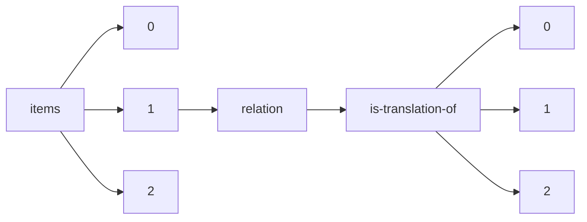

!!! warning "This document is not official Crossref documentation"
# Elements
PATH = items/array/relation/is-translation-of/array(1)  
Occurs 10 912 times  
{ .annotate }

1. A route to an element, for example:  
   The route "items/array/relation/is-translation-of/array" corresponds to navigating through the JSON indices as  
   ["items"][0]["relation"]["is-translation-of"][0]  

## Asserted-by
See more information: [items/array/relation/is-translation-of/array/asserted-by](asserted-by/index.md)  
Occurs 10 912 timess  
Unique values: 2  

| **Row** | **Value** `String` | **Count** `Int64` |
|--------:|----------------------:|---------------------:|
| **1**   | subject               | 10 071               |
| **2**   | object                | 841                  |

## Id
See more information: [items/array/relation/is-translation-of/array/id](id/index.md)  
Occurs 10 912 timess  
Unique values: > 999  

!!! note "Due to current limitations, only the first 1,000 unique values are counted."

| **Row** | **Value** `String`       | **Count** `Int64` |
|--------:|----------------------------:|---------------------:|
| **1**   | 10.37019/e-anatomy/49577    | 16                   |
| **2**   | 10.6028/NIST.CSWP.6         | 14                   |
| **3**   | PropPIDdifferentlang        | 5                    |
| **4**   | 10.38126/JSPG180303         | 5                    |
| **5**   | 10.6028/NIST.CSWP.10        | 5                    |
| **6**   | 10.37019/e-anatomy/940479   | 4                    |
| **7**   | 10.1590/0103-11042022e500i  | 4                    |
| **8**   | 10.37019/e-anatomy/580429   | 4                    |
| **9**   | 10.37019/vet-anatomy/927205 | 3                    |
| **10**  | 10.24135/link2021.v2i1.77   | 3                    |
| ... | ... | ... |

## Id-type
See more information: [items/array/relation/is-translation-of/array/id-type](id-type/index.md)  
Occurs 10 912 timess  
Unique values: 5  

| **Row** | **Value** `String` | **Count** `Int64` |
|--------:|----------------------:|---------------------:|
| **1**   | doi                   | 10 878               |
| **2**   | uri                   | 25                   |
| **3**   | other                 | 6                    |
| **4**   | isbn                  | 2                    |
| **5**   | issn                  | 1                    |

