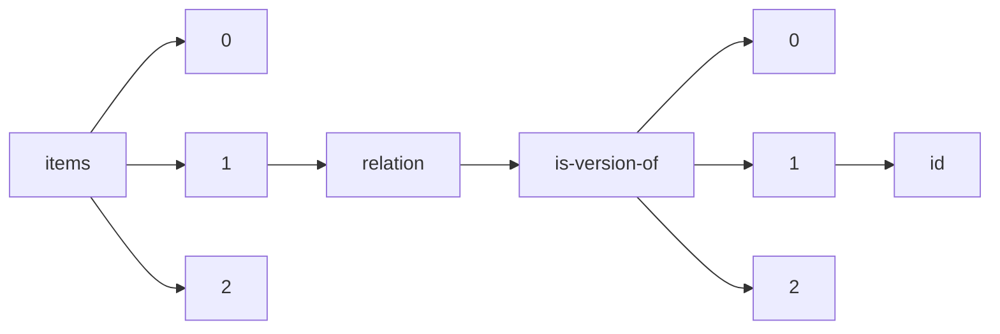

!!! warning "This document is not official Crossref documentation"
# Id
PATH = items/array/relation/is-version-of/array/id(1)  
Occurs 54 433 times  
Unique values: > 999  
{ .annotate }

1. A route to an element, for example:  
   The route "items/array/relation/is-version-of/array/id" corresponds to navigating through the JSON indices as  
   ["items"][0]["relation"]["is-version-of"][0]["id"]  

!!! note "Due to current limitations, only the first 1,000 unique values are counted."

| **Row** | **Value** `String`                                                                                        | **Count** `Int64` |
|--------:|-------------------------------------------------------------------------------------------------------------:|---------------------:|
| **1**   |                                                                                                              | 420                  |
| **2**   | 10.26434/chemrxiv.13102877.v22                                                                               | 39                   |
| **3**   | 10.26434/chemrxiv.13102877.v18                                                                               | 39                   |
| **4**   | 10.26434/chemrxiv.13102877.v28                                                                               | 39                   |
| **5**   | 10.26434/chemrxiv.13102877.v32                                                                               | 39                   |
| **6**   | 10.26434/chemrxiv.13102877.v4                                                                                | 39                   |
| **7**   | 10.26434/chemrxiv.13102877.v6                                                                                | 39                   |
| **8**   | 10.26434/chemrxiv.13102877.v10                                                                               | 39                   |
| **9**   | 10.26434/chemrxiv.13102877.v2                                                                                | 38                   |
| **10**  | 10.26434/chemrxiv.13102877.v8                                                                                | 38                   |
| **11**  | 10.26434/chemrxiv.13102877.v5                                                                                | 38                   |
| **12**  | 10.26434/chemrxiv.13102877.v13                                                                               | 38                   |
| **13**  | 10.26434/chemrxiv.13102877.v23                                                                               | 38                   |
| **14**  | 10.26434/chemrxiv.13102877.v21                                                                               | 38                   |
| **15**  | 10.26434/chemrxiv.13102877.v30                                                                               | 38                   |
| **16**  | 10.26434/chemrxiv.13102877.v7                                                                                | 38                   |
| **17**  | 10.26434/chemrxiv.13102877.v26                                                                               | 38                   |
| **18**  | 10.26434/chemrxiv.13102877.v25                                                                               | 38                   |
| **19**  | 10.26434/chemrxiv.13102877.v11                                                                               | 38                   |
| **20**  | 10.26434/chemrxiv.13102877.v27                                                                               | 38                   |
| **21**  | 10.26434/chemrxiv.13102877.v20                                                                               | 38                   |
| **22**  | 10.26434/chemrxiv.13102877.v17                                                                               | 38                   |
| **23**  | 10.26434/chemrxiv.13102877.v12                                                                               | 38                   |
| **24**  | 10.26434/chemrxiv.13102877.v19                                                                               | 38                   |
| **25**  | 10.26434/chemrxiv.13102877.v15                                                                               | 38                   |
| **26**  | 10.26434/chemrxiv.13102877.v14                                                                               | 38                   |
| **27**  | 10.26434/chemrxiv.13102877.v16                                                                               | 38                   |
| **28**  | 10.26434/chemrxiv.13102877.v24                                                                               | 38                   |
| **29**  | 10.26434/chemrxiv.13102877.v1                                                                                | 38                   |
| **30**  | 10.26434/chemrxiv.13102877.v9                                                                                | 37                   |
| **31**  | 10.26434/chemrxiv.13102877.v3                                                                                | 37                   |
| **32**  | 10.26434/chemrxiv.13102877.v31                                                                               | 37                   |
| **33**  | 10.26434/chemrxiv.13102877.v29                                                                               | 37                   |
| **34**  | 10.33774/chemrxiv-2021-l393t-v34                                                                             | 34                   |
| **35**  | 10.33774/chemrxiv-2021-l393t-v33                                                                             | 34                   |
| **36**  | 10.26434/chemrxiv.13262660.v1                                                                                | 31                   |
| **37**  | 10.26434/chemrxiv.13262660.v9                                                                                | 31                   |
| **38**  | 10.26434/chemrxiv.13262660.v10                                                                               | 31                   |
| **39**  | 10.26434/chemrxiv.13262660.v7                                                                                | 31                   |
| **40**  | 10.26434/chemrxiv.13262660.v13                                                                               | 31                   |
| **41**  | 10.26434/chemrxiv.13262660.v3                                                                                | 31                   |
| **42**  | 10.26434/chemrxiv.13262660.v8                                                                                | 30                   |
| **43**  | 10.26434/chemrxiv.13262660.v11                                                                               | 30                   |
| **44**  | 10.26434/chemrxiv.13262660.v2                                                                                | 29                   |
| **45**  | 10.26434/chemrxiv.13262660.v14                                                                               | 29                   |
| **46**  | 10.26434/chemrxiv.13262660.v6                                                                                | 29                   |
| **47**  | 10.26434/chemrxiv.13262660.v4                                                                                | 29                   |
| **48**  | 10.26434/chemrxiv.13262660.v12                                                                               | 28                   |
| **49**  | 10.20944/preprints202207.0399.v27                                                                            | 27                   |
| **50**  | 10.20944/preprints202207.0399.v25                                                                            | 27                   |
| **51**  | 10.26434/chemrxiv.13262660.v5                                                                                | 27                   |
| **52**  | 10.21203/rs.3.rs-708548/v27                                                                                  | 26                   |
| **53**  | 10.21203/rs.3.rs-708548/v16                                                                                  | 26                   |
| **54**  | 10.21203/rs.3.rs-708548/v10                                                                                  | 26                   |
| **55**  | 10.20944/preprints202207.0399.v10                                                                            | 26                   |
| **56**  | 10.20944/preprints202207.0399.v5                                                                             | 26                   |
| **57**  | 10.20944/preprints202207.0399.v8                                                                             | 26                   |
| **58**  | 10.21203/rs.3.rs-708548/v3                                                                                   | 24                   |
| **59**  | 10.21203/rs.3.rs-708548/v2                                                                                   | 24                   |
| **60**  | 10.1257/rct.2614                                                                                             | 23                   |
| **61**  | 10.20944/preprints202108.0146.v12                                                                            | 22                   |
| **62**  | 10.1257/rct.1308                                                                                             | 22                   |
| **63**  | 10.20944/preprints202108.0146.v17                                                                            | 21                   |
| **64**  | 10.33774/chemrxiv-2021-k812v-v19                                                                             | 21                   |
| **65**  | 10.20944/preprints202207.0399.v20                                                                            | 21                   |
| **66**  | 10.1257/rct.505                                                                                              | 21                   |
| **67**  | 10.20944/preprints202207.0399.v15                                                                            | 21                   |
| **68**  | 10.20944/preprints202207.0399.v11                                                                            | 20                   |
| **69**  | 10.20944/preprints202207.0399.v9                                                                             | 20                   |
| **70**  | 10.33774/chemrxiv-2021-k812v-v20                                                                             | 20                   |
| **71**  | 10.33774/chemrxiv-2021-k812v-v21                                                                             | 20                   |
| **72**  | 10.21203/rs.3.rs-708548/v4                                                                                   | 20                   |
| **73**  | 10.21203/rs.3.rs-708548/v21                                                                                  | 20                   |
| **74**  | 10.21203/rs.3.rs-708548/v22                                                                                  | 20                   |
| **75**  | 10.33774/chemrxiv-2021-k812v-v18                                                                             | 20                   |
| **76**  | 10.20944/preprints202108.0146.v1                                                                             | 20                   |
| **77**  | 10.33774/chemrxiv-2021-k812v-v23                                                                             | 20                   |
| **78**  | 10.20944/preprints202207.0399.v6                                                                             | 20                   |
| **79**  | 10.20944/preprints202108.0146.v16                                                                            | 20                   |
| **80**  | 10.1257/rct.2963                                                                                             | 20                   |
| **81**  | 10.33774/chemrxiv-2021-k812v-v15                                                                             | 20                   |
| **82**  | 10.33774/chemrxiv-2021-k812v-v22                                                                             | 20                   |
| **83**  | 10.1257/rct.3475                                                                                             | 19                   |
| **84**  | 10.21203/rs.3.rs-708548/v9                                                                                   | 19                   |
| **85**  | 10.33774/chemrxiv-2021-k812v-v16                                                                             | 19                   |
| **86**  | 10.21203/rs.3.rs-708548/v13                                                                                  | 19                   |
| **87**  | 10.20944/preprints202108.0146.v7                                                                             | 19                   |
| **88**  | 10.21203/rs.3.rs-708548/v15                                                                                  | 19                   |
| **89**  | 10.21203/rs.3.rs-708548/v26                                                                                  | 19                   |
| **90**  | 10.20944/preprints202108.0146.v14                                                                            | 19                   |
| **91**  | 10.21203/rs.3.rs-708548/v23                                                                                  | 19                   |
| **92**  | 10.21203/rs.3.rs-708548/v7                                                                                   | 19                   |
| **93**  | 10.21203/rs.3.rs-708548/v17                                                                                  | 19                   |
| **94**  | 10.21203/rs.3.rs-708548/v8                                                                                   | 19                   |
| **95**  | 10.20944/preprints202108.0146.v5                                                                             | 19                   |
| **96**  | 10.20944/preprints202207.0399.v26                                                                            | 19                   |
| **97**  | 10.33774/chemrxiv-2021-k812v-v17                                                                             | 19                   |
| **98**  | 10.20944/preprints202108.0146.v21                                                                            | 18                   |
| **99**  | 10.20944/preprints202108.0146.v13                                                                            | 18                   |
| **100** | 10.1257/rct.2571                                                                                             | 18                   |
| **101** | 10.20944/preprints202207.0399.v24                                                                            | 18                   |
| **102** | 10.21203/rs.3.rs-708548/v14                                                                                  | 18                   |
| **103** | 10.21203/rs.3.rs-708548/v18                                                                                  | 18                   |
| **104** | 10.1257/rct.2139                                                                                             | 18                   |
| **105** | 10.21203/rs.3.rs-708548/v24                                                                                  | 18                   |
| **106** | 10.20944/preprints202108.0146.v6                                                                             | 18                   |
| **107** | 10.20944/preprints202207.0399.v19                                                                            | 18                   |
| **108** | 10.21203/rs.3.rs-708548/v19                                                                                  | 18                   |
| **109** | 10.33774/coe-2020-l173k-v9                                                                                   | 17                   |
| **110** | 10.20944/preprints202207.0399.v17                                                                            | 17                   |
| **111** | 10.20944/preprints202207.0399.v7                                                                             | 17                   |
| **112** | 10.20944/preprints202207.0399.v23                                                                            | 17                   |
| **113** | 10.33774/coe-2020-l173k-v8                                                                                   | 17                   |
| **114** | 10.20944/preprints202108.0146.v3                                                                             | 17                   |
| **115** | 10.20944/preprints202108.0146.v8                                                                             | 17                   |
| **116** | 10.21203/rs.3.rs-708548/v11                                                                                  | 17                   |
| **117** | 10.21203/rs.3.rs-708548/v12                                                                                  | 17                   |
| **118** | 10.21203/rs.3.rs-708548/v5                                                                                   | 17                   |
| **119** | 10.33774/coe-2022-pnx53                                                                                      | 17                   |
| **120** | 10.33774/coe-2022-pnx53-v2                                                                                   | 17                   |
| **121** | 10.21203/rs.3.rs-708548/v20                                                                                  | 17                   |
| **122** | 10.21203/rs.3.rs-708548/v25                                                                                  | 17                   |
| **123** | 10.21203/rs.3.rs-708548/v6                                                                                   | 17                   |
| **124** | 10.33774/coe-2022-pnx53-v5                                                                                   | 16                   |
| **125** | 10.33774/coe-2022-pnx53-v4                                                                                   | 16                   |
| **126** | 10.20944/preprints202207.0399.v14                                                                            | 16                   |
| **127** | 10.20944/preprints202207.0399.v22                                                                            | 16                   |
| **128** | 10.33774/coe-2020-l173k-v5                                                                                   | 16                   |
| **129** | 10.33774/coe-2020-l173k-v3                                                                                   | 16                   |
| **130** | 10.33774/coe-2020-l173k                                                                                      | 16                   |
| **131** | 10.33774/coe-2022-pnx53-v3                                                                                   | 16                   |
| **132** | 10.33774/coe-2020-l173k-v7                                                                                   | 16                   |
| **133** | 10.33774/coe-2020-l173k-v4                                                                                   | 16                   |
| **134** | 10.20944/preprints202207.0399.v1                                                                             | 16                   |
| **135** | 10.1257/rct.4435                                                                                             | 16                   |
| **136** | 10.33774/coe-2020-l173k-v12                                                                                  | 16                   |
| **137** | 10.20944/preprints202108.0146.v20                                                                            | 16                   |
| **138** | 10.33774/coe-2020-l173k-v14                                                                                  | 16                   |
| **139** | 10.33774/coe-2020-l173k-v13                                                                                  | 16                   |
| **140** | 10.33774/coe-2022-pnx53-v6                                                                                   | 15                   |
| **141** | 10.1257/rct.2534                                                                                             | 15                   |
| **142** | 10.20944/preprints202207.0399.v3                                                                             | 15                   |
| **143** | 10.1257/rct.2692                                                                                             | 15                   |
| **144** | 10.20944/preprints202108.0146.v4                                                                             | 15                   |
| **145** | 10.33774/coe-2020-l173k-v15                                                                                  | 15                   |
| **146** | 10.33774/coe-2020-l173k-v11                                                                                  | 15                   |
| **147** | 10.20944/preprints202207.0399.v2                                                                             | 15                   |
| **148** | 10.1257/rct.1554                                                                                             | 15                   |
| **149** | 10.20944/preprints202207.0399.v12                                                                            | 15                   |
| **150** | 10.33774/coe-2020-l173k-v6                                                                                   | 15                   |
| **151** | 10.33774/coe-2020-l173k-v2                                                                                   | 15                   |
| **152** | 10.33774/coe-2020-l173k-v18                                                                                  | 15                   |
| **153** | 10.20944/preprints202108.0146.v2                                                                             | 15                   |
| **154** | 10.33774/coe-2020-l173k-v16                                                                                  | 15                   |
| **155** | 10.21203/rs.3.rs-708548/v1                                                                                   | 15                   |
| **156** | 10.20944/preprints202108.0146.v23                                                                            | 15                   |
| **157** | 10.20944/preprints202108.0146.v19                                                                            | 15                   |
| **158** | 10.33774/coe-2020-l173k-v17                                                                                  | 15                   |
| **159** | 10.33774/coe-2020-l173k-v10                                                                                  | 15                   |
| **160** | 10.20944/preprints202108.0146.v15                                                                            | 15                   |
| **161** | 10.33774/coe-2021-n3vv9-v10                                                                                  | 14                   |
| **162** | 10.33774/coe-2021-n3vv9-v5                                                                                   | 14                   |
| **163** | 10.20944/preprints202207.0399.v18                                                                            | 14                   |
| **164** | 10.33774/coe-2021-n3vv9-v8                                                                                   | 14                   |
| **165** | 10.20944/preprints202108.0146.v11                                                                            | 14                   |
| **166** | 10.20944/preprints202108.0146.v9                                                                             | 14                   |
| **167** | 10.20944/preprints202108.0146.v10                                                                            | 14                   |
| **168** | 10.20944/preprints202108.0146.v18                                                                            | 14                   |
| **169** | 10.20944/preprints202108.0146.v22                                                                            | 14                   |
| **170** | 10.20944/preprints202207.0399.v13                                                                            | 14                   |
| **171** | 10.20944/preprints202207.0399.v21                                                                            | 14                   |
| **172** | 10.20944/preprints202207.0399.v16                                                                            | 14                   |
| **173** | 10.20944/preprints202110.0087.v3                                                                             | 13                   |
| **174** | 10.33774/coe-2022-pnx53-v7                                                                                   | 13                   |
| **175** | 10.20944/preprints202204.0263.v11                                                                            | 12                   |
| **176** | 10.33774/coe-2020-tj30r-v3                                                                                   | 12                   |
| **177** | 10.26434/chemrxiv.9971285.v1                                                                                 | 12                   |
| **178** | 10.26434/chemrxiv.11938173.v6                                                                                | 12                   |
| **179** | 10.1257/rct.996                                                                                              | 12                   |
| **180** | 10.20944/preprints202110.0087.v5                                                                             | 12                   |
| **181** | 10.20944/preprints202210.0207.v7                                                                             | 12                   |
| **182** | 10.20944/preprints202204.0263.v12                                                                            | 12                   |
| **183** | 10.26434/chemrxiv.9971285.v3                                                                                 | 12                   |
| **184** | 10.1257/rct.1870                                                                                             | 12                   |
| **185** | 10.20944/preprints202201.0301.v12                                                                            | 12                   |
| **186** | 10.33774/coe-2021-n3vv9-v9                                                                                   | 12                   |
| **187** | 10.20944/preprints202110.0087.v12                                                                            | 12                   |
| **188** | 10.20944/preprints202110.0087.v13                                                                            | 12                   |
| **189** | 10.20944/preprints202207.0399.v4                                                                             | 12                   |
| **190** | 10.20944/preprints201701.0028.v9                                                                             | 12                   |
| **191** | 10.1257/rct.28                                                                                               | 12                   |
| **192** | 10.20944/preprints201701.0028.v1                                                                             | 11                   |
| **193** | 10.20944/preprints202110.0087.v4                                                                             | 11                   |
| **194** | 10.20944/preprints202208.0309.v8                                                                             | 11                   |
| **195** | 10.20944/preprints202110.0087.v11                                                                            | 11                   |
| **196** | 10.20944/preprints202210.0091.v8                                                                             | 11                   |
| **197** | 10.20944/preprints201701.0028.v11                                                                            | 11                   |
| **198** | 10.1257/rct.2685                                                                                             | 11                   |
| **199** | 10.20944/preprints202210.0091.v3                                                                             | 11                   |
| **200** | 10.33774/coe-2021-n3vv9-v4                                                                                   | 11                   |
| **201** | 10.1257/rct.3678                                                                                             | 11                   |
| **202** | 10.33774/coe-2021-n3vv9-v7                                                                                   | 11                   |
| **203** | 10.20944/preprints201701.0028.v6                                                                             | 11                   |
| **204** | 10.20944/preprints202210.0091.v6                                                                             | 11                   |
| **205** | 10.33774/coe-2021-5dwz2-v5                                                                                   | 10                   |
| **206** | 10.33774/coe-2021-5dwz2-v3                                                                                   | 10                   |
| **207** | 10.33774/coe-2022-b6mks-v2                                                                                   | 10                   |
| **208** | 10.26434/chemrxiv.12052512.v8                                                                                | 10                   |
| **209** | 10.20944/preprints202208.0309.v1                                                                             | 10                   |
| **210** | 10.20944/preprints202208.0309.v2                                                                             | 10                   |
| **211** | 10.20944/preprints201701.0028.v14                                                                            | 10                   |
| **212** | 10.26434/chemrxiv.11663337.v2                                                                                | 10                   |
| **213** | 10.20944/preprints201701.0028.v8                                                                             | 10                   |
| **214** | 10.1257/rct.1014                                                                                             | 10                   |
| **215** | 10.20944/preprints202110.0087.v8                                                                             | 10                   |
| **216** | 10.20944/preprints202208.0309.v10                                                                            | 10                   |
| **217** | 10.1257/rct.1191                                                                                             | 10                   |
| **218** | 10.20944/preprints201701.0028.v7                                                                             | 10                   |
| **219** | 10.20944/preprints201701.0028.v3                                                                             | 10                   |
| **220** | 10.20944/preprints202201.0301.v11                                                                            | 10                   |
| **221** | 10.26434/chemrxiv.12543140.v5                                                                                | 10                   |
| **222** | 10.20944/preprints201701.0028.v5                                                                             | 10                   |
| **223** | 10.20944/preprints201701.0028.v2                                                                             | 10                   |
| **224** | 10.20944/preprints201701.0028.v12                                                                            | 10                   |
| **225** | 10.1257/rct.7841                                                                                             | 10                   |
| **226** | 10.20944/preprints202210.0207.v1                                                                             | 10                   |
| **227** | 10.1257/rct.5                                                                                                | 9                    |
| **228** | 10.26434/chemrxiv.12275603.v2                                                                                | 9                    |
| **229** | 10.33774/coe-2022-r1vjx-v5                                                                                   | 9                    |
| **230** | 10.1257/rct.3270                                                                                             | 9                    |
| **231** | 10.26434/chemrxiv.12275603.v6                                                                                | 9                    |
| **232** | 10.20944/preprints202005.0250.v3                                                                             | 9                    |
| **233** | 10.17504/protocols.io.fnebmbe                                                                                | 9                    |
| **234** | 10.20944/preprints202206.0221.v8                                                                             | 9                    |
| **235** | 10.1257/rct.72                                                                                               | 9                    |
| **236** | 10.33774/coe-2021-n3vv9-v2                                                                                   | 9                    |
| **237** | 10.20944/preprints202204.0263.v8                                                                             | 9                    |
| **238** | 10.20944/preprints202210.0207.v12                                                                            | 9                    |
| **239** | 10.26434/chemrxiv.12003930.v1                                                                                | 9                    |
| **240** | 10.20944/preprints202208.0309.v12                                                                            | 9                    |
| **241** | 10.20944/preprints202206.0221.v6                                                                             | 9                    |
| **242** | 10.33774/coe-2021-n3vv9-v3                                                                                   | 9                    |
| **243** | 10.26434/chemrxiv.12543140.v2                                                                                | 9                    |
| **244** | 10.26434/chemrxiv.6940379.v9                                                                                 | 9                    |
| **245** | 10.20944/preprints202110.0087.v16                                                                            | 9                    |
| **246** | 10.1257/rct.491                                                                                              | 9                    |
| **247** | 10.33774/coe-2020-tj30r-v5                                                                                   | 9                    |
| **248** | 10.20944/preprints202208.0309.v9                                                                             | 9                    |
| **249** | 10.1257/rct.27                                                                                               | 9                    |
| **250** | 10.20944/preprints201701.0028.v13                                                                            | 9                    |
| **251** | 10.33774/coe-2022-pnx53-v8                                                                                   | 9                    |
| **252** | 10.20944/preprints202210.0207.v13                                                                            | 9                    |
| **253** | 10.20944/preprints202110.0087.v7                                                                             | 9                    |
| **254** | 10.26434/chemrxiv.12543140.v3                                                                                | 9                    |
| **255** | 10.20944/preprints201801.0036.v15                                                                            | 9                    |
| **256** | 10.20944/preprints201701.0028.v4                                                                             | 9                    |
| **257** | 10.1257/rct.1624                                                                                             | 9                    |
| **258** | 10.20944/preprints202208.0309.v4                                                                             | 9                    |
| **259** | 10.26434/chemrxiv-2021-k812v-v19                                                                             | 8                    |
| **260** | 10.1257/rct.634                                                                                              | 8                    |
| **261** | 10.26434/chemrxiv.11553057.v2                                                                                | 8                    |
| **262** | 10.17504/protocols.io.g3ebyje                                                                                | 8                    |
| **263** | 10.26434/chemrxiv-2021-k812v-v22                                                                             | 8                    |
| **264** | 10.21203/rs.3.rs-979554/v8                                                                                   | 8                    |
| **265** | 10.33774/coe-2022-kxpg8-v2                                                                                   | 8                    |
| **266** | 10.20944/preprints202301.0023.v7                                                                             | 8                    |
| **267** | 10.26434/chemrxiv.6940379.v6                                                                                 | 8                    |
| **268** | 10.1257/rct.3055                                                                                             | 8                    |
| **269** | 10.20944/preprints202206.0221.v3                                                                             | 8                    |
| **270** | 10.20944/preprints202206.0221.v1                                                                             | 8                    |
| **271** | 10.1257/rct.350                                                                                              | 8                    |
| **272** | 10.20944/preprints202206.0221.v7                                                                             | 8                    |
| **273** | 10.33774/coe-2021-n3vv9-v6                                                                                   | 8                    |
| **274** | 10.20944/preprints202204.0263.v9                                                                             | 8                    |
| **275** | 10.20944/preprints202210.0207.v6                                                                             | 8                    |
| **276** | 10.26434/chemrxiv.13332458.v3                                                                                | 8                    |
| **277** | 10.20944/preprints202002.0379.v7                                                                             | 8                    |
| **278** | 10.20944/preprints202109.0379.v5                                                                             | 8                    |
| **279** | 10.20944/preprints202212.0045.v1                                                                             | 8                    |
| **280** | 10.20944/preprints202208.0309.v7                                                                             | 8                    |
| **281** | 10.20944/preprints202210.0207.v2                                                                             | 8                    |
| **282** | 10.1257/rct.1039                                                                                             | 8                    |
| **283** | 10.20944/preprints201801.0036.v8                                                                             | 8                    |
| **284** | 10.20944/preprints202204.0263.v10                                                                            | 8                    |
| **285** | 10.20944/preprints202110.0087.v14                                                                            | 8                    |
| **286** | 10.26434/chemrxiv.12543140.v6                                                                                | 8                    |
| **287** | 10.1257/rct.2402                                                                                             | 8                    |
| **288** | 10.20944/preprints202210.0207.v5                                                                             | 8                    |
| **289** | 10.33774/coe-2020-tj30r-v6                                                                                   | 8                    |
| **290** | 10.1257/rct.1501                                                                                             | 8                    |
| **291** | 10.20944/preprints202208.0309.v6                                                                             | 8                    |
| **292** | 10.33774/apsa-2020-5vg8w-v8                                                                                  | 8                    |
| **293** | 10.1257/rct.4010                                                                                             | 8                    |
| **294** | 10.26434/chemrxiv.11938173.v5                                                                                | 8                    |
| **295** | 10.33774/coe-2022-pnx53-v9                                                                                   | 8                    |
| **296** | 10.20944/preprints202204.0263.v6                                                                             | 8                    |
| **297** | 10.1257/rct.697                                                                                              | 8                    |
| **298** | 10.20944/preprints202204.0263.v7                                                                             | 8                    |
| **299** | 10.20944/preprints202210.0207.v3                                                                             | 8                    |
| **300** | 10.33774/coe-2022-pnx53-v10                                                                                  | 8                    |
| **301** | 10.1257/rct.10499                                                                                            | 8                    |
| **302** | 10.20944/preprints201801.0036.v11                                                                            | 8                    |
| **303** | 10.1257/rct.1368                                                                                             | 8                    |
| **304** | 10.1257/rct.277                                                                                              | 7                    |
| **305** | 10.20944/preprints201802.0040.v1                                                                             | 7                    |
| **306** | 10.26434/chemrxiv.13735084.v7                                                                                | 7                    |
| **307** | 10.26434/chemrxiv.11846943.v2                                                                                | 7                    |
| **308** | 10.20944/preprints202003.0419.v4                                                                             | 7                    |
| **309** | 10.33774/coe-2022-r1vjx                                                                                      | 7                    |
| **310** | 10.26434/chemrxiv.12543140.v7                                                                                | 7                    |
| **311** | 10.26434/chemrxiv.11938173.v7                                                                                | 7                    |
| **312** | 10.33774/coe-2022-b6mks-v4                                                                                   | 7                    |
| **313** | 10.1257/rct.2646                                                                                             | 7                    |
| **314** | 10.1257/rct.610                                                                                              | 7                    |
| **315** | 10.33774/coe-2022-b6mks                                                                                      | 7                    |
| **316** | 10.33774/coe-2022-n954s-v2                                                                                   | 7                    |
| **317** | 10.33774/apsa-2020-5vg8w-v2                                                                                  | 7                    |
| **318** | 10.33774/apsa-2021-td3zm-v2                                                                                  | 7                    |
| **319** | 10.33774/coe-2020-vntk7                                                                                      | 7                    |
| **320** | 10.20944/preprints201802.0040.v7                                                                             | 7                    |
| **321** | 10.26434/chemrxiv.11401347.v10                                                                               | 7                    |
| **322** | 10.1257/rct.7383                                                                                             | 7                    |
| **323** | 10.26434/chemrxiv.11846943.v3                                                                                | 7                    |
| **324** | 10.33774/coe-2022-r1vjx-v2                                                                                   | 7                    |
| **325** | 10.17504/protocols.io.dm749m                                                                                 | 7                    |
| **326** | 10.33774/chemrxiv-2021-dtpv3-v10                                                                             | 7                    |
| **327** | 10.20944/preprints201904.0076.v6                                                                             | 7                    |
| **328** | 10.20944/preprints202210.0091.v12                                                                            | 7                    |
| **329** | 10.33774/coe-2022-pnx53-v11                                                                                  | 7                    |
| **330** | 10.20944/preprints202206.0221.v10                                                                            | 7                    |
| **331** | 10.26434/chemrxiv.11663337.v3                                                                                | 7                    |
| **332** | 10.20944/preprints202110.0087.v1                                                                             | 7                    |
| **333** | 10.26434/chemrxiv.12543140.v9                                                                                | 7                    |
| **334** | 10.20944/preprints202210.0207.v9                                                                             | 7                    |
| **335** | 10.20944/preprints202208.0309.v5                                                                             | 7                    |
| **336** | 10.20944/preprints202210.0207.v4                                                                             | 7                    |
| **337** | 10.26434/chemrxiv.12543140.v4                                                                                | 7                    |
| **338** | 10.20944/preprints202204.0263.v13                                                                            | 7                    |
| **339** | 10.1257/rct.1809                                                                                             | 7                    |
| **340** | 10.17504/protocols.io.g3sbyne                                                                                | 7                    |
| **341** | 10.20944/preprints202003.0419.v7                                                                             | 7                    |
| **342** | 10.26434/chemrxiv.11401347.v5                                                                                | 7                    |
| **343** | 10.1257/rct.172                                                                                              | 7                    |
| **344** | 10.26434/chemrxiv.11938173.v9                                                                                | 7                    |
| **345** | 10.20944/preprints201801.0036.v12                                                                            | 7                    |
| **346** | 10.1257/rct.5214                                                                                             | 7                    |
| **347** | 10.33774/coe-2020-tj30r                                                                                      | 7                    |
| **348** | 10.33774/coe-2020-tj30r-v2                                                                                   | 7                    |
| **349** | 10.1257/rct.1937                                                                                             | 7                    |
| **350** | 10.26434/chemrxiv.11938173.v1                                                                                | 7                    |
| **351** | 10.33774/coe-2021-n3vv9                                                                                      | 7                    |
| **352** | 10.26434/chemrxiv.12543140.v8                                                                                | 7                    |
| **353** | 10.26434/chemrxiv.6940379.v5                                                                                 | 7                    |
| **354** | 10.33774/apsa-2020-5vg8w-v3                                                                                  | 7                    |
| **355** | 10.20944/preprints202204.0263.v5                                                                             | 7                    |
| **356** | 10.1257/rct.1759                                                                                             | 7                    |
| **357** | 10.20944/preprints202206.0221.v5                                                                             | 7                    |
| **358** | 10.17504/protocols.io.smuec6w                                                                                | 7                    |
| **359** | 10.1257/rct.1934                                                                                             | 7                    |
| **360** | 10.20944/preprints202208.0309.v11                                                                            | 7                    |
| **361** | 10.20944/preprints202110.0087.v17                                                                            | 7                    |
| **362** | 10.26434/chemrxiv.12543140.v1                                                                                | 7                    |
| **363** | 10.20944/preprints202110.0087.v2                                                                             | 7                    |
| **364** | 10.1257/rct.525                                                                                              | 7                    |
| **365** | 10.20944/preprints202210.0207.v10                                                                            | 7                    |
| **366** | 10.26434/chemrxiv.11938173.v3                                                                                | 7                    |
| **367** | 10.1257/rct.3494                                                                                             | 6                    |
| **368** | 10.26434/chemrxiv.9759581.v1                                                                                 | 6                    |
| **369** | 10.21203/rs.3.rs-1772821/v5                                                                                  | 6                    |
| **370** | 10.26434/chemrxiv.8233475.v7                                                                                 | 6                    |
| **371** | 10.26434/chemrxiv.11846943.v9                                                                                | 6                    |
| **372** | 10.26434/chemrxiv.12275603.v9                                                                                | 6                    |
| **373** | 10.20944/preprints202201.0301.v5                                                                             | 6                    |
| **374** | 10.20944/preprints202201.0301.v14                                                                            | 6                    |
| **375** | 10.1257/rct.528                                                                                              | 6                    |
| **376** | 10.20944/preprints202210.0091.v5                                                                             | 6                    |
| **377** | 10.1257/rct.6874                                                                                             | 6                    |
| **378** | 10.26434/chemrxiv.12275603.v7                                                                                | 6                    |
| **379** | 10.33774/coe-2022-r1vjx-v3                                                                                   | 6                    |
| **380** | 10.20944/preprints202003.0419.v8                                                                             | 6                    |
| **381** | 10.1257/rct.607                                                                                              | 6                    |
| **382** | 10.20944/preprints202201.0301.v9                                                                             | 6                    |
| **383** | 10.20944/preprints202010.0004.v1                                                                             | 6                    |
| **384** | 10.20944/preprints202005.0250.v11                                                                            | 6                    |
| **385** | 10.20944/preprints202201.0301.v1                                                                             | 6                    |
| **386** | 10.1257/rct.8201                                                                                             | 6                    |
| **387** | 10.20944/preprints202005.0250.v9                                                                             | 6                    |
| **388** | 10.1257/rct.3593                                                                                             | 6                    |
| **389** | 10.1257/rct.792                                                                                              | 6                    |
| **390** | 10.1257/rct.7100                                                                                             | 6                    |
| **391** | 10.20944/preprints201908.0037.v3                                                                             | 6                    |
| **392** | 10.33774/coe-2022-r1vjx-v8                                                                                   | 6                    |
| **393** | 10.1257/rct.6141                                                                                             | 6                    |
| **394** | 10.26434/chemrxiv-2022-n13d1                                                                                 | 6                    |
| **395** | 10.21203/rs.3.rs-1159792/v8                                                                                  | 6                    |
| **396** | 10.26434/chemrxiv.12228362.v1                                                                                | 6                    |
| **397** | 10.1257/rct.1854                                                                                             | 6                    |
| **398** | 10.20944/preprints202010.0004.v8                                                                             | 6                    |
| **399** | 10.26434/chemrxiv.6940379.v2                                                                                 | 6                    |
| **400** | 10.33774/coe-2020-vntk7-v2                                                                                   | 6                    |
| **401** | 10.20944/preprints202210.0091.v4                                                                             | 6                    |
| **402** | 10.20944/preprints202206.0221.v4                                                                             | 6                    |
| **403** | 10.26434/chemrxiv.11938173.v4                                                                                | 6                    |
| **404** | 10.20944/preprints202210.0207.v11                                                                            | 6                    |
| **405** | 10.26434/chemrxiv.12275603.v8                                                                                | 6                    |
| **406** | 10.20944/preprints202003.0419.v2                                                                             | 6                    |
| **407** | 10.1257/rct.1454                                                                                             | 6                    |
| **408** | 10.20944/preprints202003.0419.v1                                                                             | 6                    |
| **409** | 10.20944/preprints202010.0004.v3                                                                             | 6                    |
| **410** | 10.26434/chemrxiv.14744202.v2                                                                                | 6                    |
| **411** | 10.20944/preprints202003.0419.v9                                                                             | 6                    |
| **412** | 10.1257/rct.1072                                                                                             | 6                    |
| **413** | 10.26434/chemrxiv.12696020.v1                                                                                | 6                    |
| **414** | 10.20944/preprints202204.0263.v1                                                                             | 6                    |
| **415** | 10.1257/rct.632                                                                                              | 6                    |
| **416** | 10.26434/chemrxiv.11938173.v2                                                                                | 6                    |
| **417** | 10.20944/preprints202210.0207.v8                                                                             | 6                    |
| **418** | 10.1257/rct.1631                                                                                             | 6                    |
| **419** | 10.1257/rct.686                                                                                              | 6                    |
| **420** | 10.17504/protocols.io.evmbe46                                                                                | 6                    |
| **421** | 10.20944/preprints202109.0379.v3                                                                             | 6                    |
| **422** | 10.1257/rct.5933                                                                                             | 6                    |
| **423** | 10.26434/chemrxiv.11401347.v9                                                                                | 6                    |
| **424** | 10.26434/chemrxiv.9971285.v13                                                                                | 6                    |
| **425** | 10.26434/chemrxiv.6940379.v7                                                                                 | 6                    |
| **426** | 10.26434/chemrxiv.11401347.v2                                                                                | 6                    |
| **427** | 10.1257/rct.4194                                                                                             | 6                    |
| **428** | 10.1257/rct.4000                                                                                             | 6                    |
| **429** | 10.20944/preprints202003.0419.v3                                                                             | 6                    |
| **430** | 10.1257/rct.3819                                                                                             | 5                    |
| **431** | 10.33774/chemrxiv-2021-66w4j-v6                                                                              | 5                    |
| **432** | 10.20944/preprints202302.0051.v4                                                                             | 5                    |
| **433** | 10.26434/chemrxiv-2021-r3lqh-v4                                                                              | 5                    |
| **434** | 10.21203/rs.3.rs-958444/v4                                                                                   | 5                    |
| **435** | 10.26434/chemrxiv.13096736.v1                                                                                | 5                    |
| **436** | 10.1257/rct.10577                                                                                            | 5                    |
| **437** | 10.1257/rct.488                                                                                              | 5                    |
| **438** | 10.26434/chemrxiv.9759551.v2                                                                                 | 5                    |
| **439** | 10.26434/chemrxiv.9759581.v4                                                                                 | 5                    |
| **440** | 10.26434/chemrxiv.9759551.v3                                                                                 | 5                    |
| **441** | 10.1257/rct.10767                                                                                            | 5                    |
| **442** | 10.1257/rct.8164                                                                                             | 5                    |
| **443** | 10.26434/chemrxiv.12228362.v3                                                                                | 5                    |
| **444** | 10.1257/rct.2769                                                                                             | 5                    |
| **445** | 10.1257/rct.502                                                                                              | 5                    |
| **446** | 10.26434/chemrxiv.12696020.v4                                                                                | 5                    |
| **447** | 10.1257/rct.2355                                                                                             | 5                    |
| **448** | 10.17504/protocols.io.e5jbg4n                                                                                | 5                    |
| **449** | 10.1257/rct.21                                                                                               | 5                    |
| **450** | 10.20944/preprints202301.0204.v5                                                                             | 5                    |
| **451** | 10.33774/coe-2020-tj30r-v4                                                                                   | 5                    |
| **452** | 10.1257/rct.2966                                                                                             | 5                    |
| **453** | 10.20944/preprints202004.0368.v1                                                                             | 5                    |
| **454** | 10.20944/preprints202003.0419.v5                                                                             | 5                    |
| **455** | 10.21203/rs.3.rs-88120/v2                                                                                    | 5                    |
| **456** | 10.1257/rct.729                                                                                              | 5                    |
| **457** | 10.20944/preprints202301.0204.v1                                                                             | 5                    |
| **458** | 10.1257/rct.515                                                                                              | 5                    |
| **459** | 10.1257/rct.5615                                                                                             | 5                    |
| **460** | 10.20944/preprints202009.0215.v3                                                                             | 5                    |
| **461** | 10.1257/rct.3665                                                                                             | 5                    |
| **462** | 10.26434/chemrxiv.7257182.v1                                                                                 | 5                    |
| **463** | 10.1257/rct.851                                                                                              | 5                    |
| **464** | 10.33774/coe-2021-5dwz2                                                                                      | 5                    |
| **465** | 10.1257/rct.1164                                                                                             | 5                    |
| **466** | 10.1257/rct.7361                                                                                             | 5                    |
| **467** | 10.33774/apsa-2020-5vg8w-v7                                                                                  | 5                    |
| **468** | 10.20944/preprints202003.0419.v10                                                                            | 5                    |
| **469** | 10.26434/chemrxiv-2021-k812v-v21                                                                             | 5                    |
| **470** | 10.20944/preprints202201.0301.v6                                                                             | 5                    |
| **471** | 10.1257/rct.492                                                                                              | 5                    |
| **472** | 10.20944/preprints202201.0301.v2                                                                             | 5                    |
| **473** | 10.20944/preprints202201.0301.v8                                                                             | 5                    |
| **474** | 10.1257/rct.7063                                                                                             | 5                    |
| **475** | 10.1257/rct.1832                                                                                             | 5                    |
| **476** | 10.1257/rct.2918                                                                                             | 5                    |
| **477** | 10.21203/rs.3.rs-979554/v7                                                                                   | 5                    |
| **478** | 10.21203/rs.3.rs-590186/v6                                                                                   | 5                    |
| **479** | 10.21203/rs.3.rs-590186/v8                                                                                   | 5                    |
| **480** | 10.20944/preprints202005.0250.v2                                                                             | 5                    |
| **481** | 10.1257/rct.3506                                                                                             | 5                    |
| **482** | 10.21203/rs.3.rs-979554/v6                                                                                   | 5                    |
| **483** | 10.26434/chemrxiv.9971285.v9                                                                                 | 5                    |
| **484** | 10.26434/chemrxiv.9971285.v7                                                                                 | 5                    |
| **485** | 10.20944/preprints202206.0221.v2                                                                             | 5                    |
| **486** | 10.1257/rct.179                                                                                              | 5                    |
| **487** | 10.33774/coe-2021-5dwz2-v4                                                                                   | 5                    |
| **488** | 10.26434/chemrxiv.11846943.v1                                                                                | 5                    |
| **489** | 10.1257/rct.6396                                                                                             | 5                    |
| **490** | 10.20944/preprints202210.0091.v11                                                                            | 5                    |
| **491** | 10.1257/rct.2130                                                                                             | 5                    |
| **492** | 10.33774/coe-2021-5dwz2-v9                                                                                   | 5                    |
| **493** | 10.20944/preprints202110.0087.v9                                                                             | 5                    |
| **494** | 10.1257/rct.7905                                                                                             | 5                    |
| **495** | 10.21203/rs.3.rs-306991/v6                                                                                   | 5                    |
| **496** | 10.21203/rs.3.rs-2039443/v2                                                                                  | 5                    |
| **497** | 10.33774/apsa-2020-5vg8w                                                                                     | 5                    |
| **498** | 10.33774/coe-2022-pnx53-v12                                                                                  | 5                    |
| **499** | 10.17504/protocols.io.u9yez7w                                                                                | 5                    |
| **500** | 10.20944/preprints202210.0091.v1                                                                             | 5                    |
| **501** | 10.20944/preprints202110.0087.v10                                                                            | 5                    |
| **502** | 10.1257/rct.3972                                                                                             | 5                    |
| **503** | 10.1257/rct.19                                                                                               | 5                    |
| **504** | 10.26434/chemrxiv.11401347.v1                                                                                | 5                    |
| **505** | 10.1257/rct.171                                                                                              | 5                    |
| **506** | 10.33774/coe-2021-5dwz2-v2                                                                                   | 5                    |
| **507** | 10.26434/chemrxiv.11401347.v4                                                                                | 5                    |
| **508** | 10.20944/preprints202210.0091.v10                                                                            | 5                    |
| **509** | 10.20944/preprints202210.0091.v9                                                                             | 5                    |
| **510** | 10.26434/chemrxiv.11401347.v7                                                                                | 5                    |
| **511** | 10.1257/rct.433                                                                                              | 5                    |
| **512** | 10.26434/chemrxiv.11401347.v3                                                                                | 5                    |
| **513** | 10.33774/apsa-2020-5vg8w-v4                                                                                  | 5                    |
| **514** | 10.17504/protocols.io.hwpb7dn                                                                                | 5                    |
| **515** | 10.33774/coe-2022-3vgzg                                                                                      | 5                    |
| **516** | 10.33774/apsa-2020-5vg8w-v6                                                                                  | 5                    |
| **517** | 10.1257/rct.4336                                                                                             | 4                    |
| **518** | 10.21203/rs.3.rs-2129511/v5                                                                                  | 4                    |
| **519** | 10.1257/rct.6370                                                                                             | 4                    |
| **520** | 10.1257/rct.3105                                                                                             | 4                    |
| **521** | 10.1257/rct.2259                                                                                             | 4                    |
| **522** | 10.20944/preprints201901.0113.v4                                                                             | 4                    |
| **523** | 10.1257/rct.4873                                                                                             | 4                    |
| **524** | 10.20944/preprints202207.0121.v4                                                                             | 4                    |
| **525** | 10.1257/rct.3357                                                                                             | 4                    |
| **526** | 10.1257/rct.4809                                                                                             | 4                    |
| **527** | 10.1257/rct.3047                                                                                             | 4                    |
| **528** | 10.1257/rct.1115                                                                                             | 4                    |
| **529** | 10.1257/rct.7478                                                                                             | 4                    |
| **530** | 10.26434/chemrxiv.10000232.v3                                                                                | 4                    |
| **531** | 10.1257/rct.7948                                                                                             | 4                    |
| **532** | 10.1257/rct.340                                                                                              | 4                    |
| **533** | 10.26434/chemrxiv.12346823.v3                                                                                | 4                    |
| **534** | 10.20944/preprints202301.0163.v3                                                                             | 4                    |
| **535** | 10.1257/rct.2632                                                                                             | 4                    |
| **536** | 10.1257/rct.7672                                                                                             | 4                    |
| **537** | 10.1257/rct.2865                                                                                             | 4                    |
| **538** | 10.26434/chemrxiv.7357052.v2                                                                                 | 4                    |
| **539** | 10.1257/rct.485                                                                                              | 4                    |
| **540** | 10.21203/rs.3.rs-1159792/v2                                                                                  | 4                    |
| **541** | 10.26434/chemrxiv.11495811.v6                                                                                | 4                    |
| **542** | 10.1257/rct.2484                                                                                             | 4                    |
| **543** | 10.21203/rs.3.rs-979554/v3                                                                                   | 4                    |
| **544** | 10.1257/rct.1288                                                                                             | 4                    |
| **545** | 10.1257/rct.3222                                                                                             | 4                    |
| **546** | 10.20944/preprints202005.0250.v8                                                                             | 4                    |
| **547** | 10.1257/rct.333                                                                                              | 4                    |
| **548** | 10.20944/preprints202004.0277.v5                                                                             | 4                    |
| **549** | 10.26434/chemrxiv.12275603.v5                                                                                | 4                    |
| **550** | 10.21203/rs.3.rs-306991/v4                                                                                   | 4                    |
| **551** | 10.26434/chemrxiv.9971285.v6                                                                                 | 4                    |
| **552** | 10.20944/preprints202108.0087.v3                                                                             | 4                    |
| **553** | 10.20944/preprints202003.0419.v6                                                                             | 4                    |
| **554** | 10.26434/chemrxiv.12275603.v10                                                                               | 4                    |
| **555** | 10.17504/protocols.io.g3bbyin                                                                                | 4                    |
| **556** | 10.17504/protocols.io.nf9dbr6                                                                                | 4                    |
| **557** | 10.1257/rct.392                                                                                              | 4                    |
| **558** | 10.21203/rs.3.rs-1159792/v6                                                                                  | 4                    |
| **559** | 10.1257/rct.1305                                                                                             | 4                    |
| **560** | 10.20944/preprints202004.0368.v5                                                                             | 4                    |
| **561** | 10.21203/rs.3.rs-1772821/v4                                                                                  | 4                    |
| **562** | 10.21203/rs.3.rs-2132462/v2                                                                                  | 4                    |
| **563** | 10.17504/protocols.io.m36c8re                                                                                | 4                    |
| **564** | 10.33774/coe-2022-r1vjx-v4                                                                                   | 4                    |
| **565** | 10.20944/preprints201805.0173.v5                                                                             | 4                    |
| **566** | 10.1257/rct.586                                                                                              | 4                    |
| **567** | 10.26434/chemrxiv.14781837.v1                                                                                | 4                    |
| **568** | 10.33774/apsa-2021-l8k5x-v3                                                                                  | 4                    |
| **569** | 10.20944/preprints201607.0028.v3                                                                             | 4                    |
| **570** | 10.33774/coe-2021-wd17h                                                                                      | 4                    |
| **571** | 10.1257/rct.679                                                                                              | 4                    |
| **572** | 10.1257/rct.3401                                                                                             | 4                    |
| **573** | 10.20944/preprints202001.0360.v2                                                                             | 4                    |
| **574** | 10.20944/preprints201905.0352.v5                                                                             | 4                    |
| **575** | 10.20944/preprints202103.0230.v3                                                                             | 4                    |
| **576** | 10.20944/preprints202101.0076.v3                                                                             | 4                    |
| **577** | 10.26434/chemrxiv.11336852.v4                                                                                | 4                    |
| **578** | 10.1257/rct.5941                                                                                             | 4                    |
| **579** | 10.20944/preprints202010.0320.v1                                                                             | 4                    |
| **580** | 10.1257/rct.3656                                                                                             | 4                    |
| **581** | 10.21203/rs.3.rs-590186/v5                                                                                   | 4                    |
| **582** | 10.26434/chemrxiv-2021-k812v-v16                                                                             | 4                    |
| **583** | 10.20944/preprints202109.0379.v2                                                                             | 4                    |
| **584** | 10.20944/preprints201908.0037.v6                                                                             | 4                    |
| **585** | 10.1257/rct.1145                                                                                             | 4                    |
| **586** | 10.20944/preprints202004.0277.v6                                                                             | 4                    |
| **587** | 10.21203/rs.3.rs-1159792/v7                                                                                  | 4                    |
| **588** | 10.20944/preprints202212.0045.v2                                                                             | 4                    |
| **589** | 10.1257/rct.2602                                                                                             | 4                    |
| **590** | 10.20944/preprints202005.0250.v6                                                                             | 4                    |
| **591** | 10.20944/preprints202212.0045.v5                                                                             | 4                    |
| **592** | 10.20944/preprints202201.0301.v10                                                                            | 4                    |
| **593** | 10.21203/rs.3.rs-1159792/v1                                                                                  | 4                    |
| **594** | 10.26434/chemrxiv.9971285.v10                                                                                | 4                    |
| **595** | 10.33774/chemrxiv-2021-2blsb-v3                                                                              | 4                    |
| **596** | 10.1257/rct.509                                                                                              | 4                    |
| **597** | 10.20944/preprints202010.0004.v11                                                                            | 4                    |
| **598** | 10.20944/preprints201711.0157.v6                                                                             | 4                    |
| **599** | 10.1257/rct.1643                                                                                             | 4                    |
| **600** | 10.1257/rct.8556                                                                                             | 4                    |
| **601** | 10.1257/rct.403                                                                                              | 4                    |
| **602** | 10.20944/preprints202004.0512.v2                                                                             | 4                    |
| **603** | 10.33774/apsa-2020-5vg8w-v5                                                                                  | 4                    |
| **604** | 10.26434/chemrxiv.11401347.v6                                                                                | 4                    |
| **605** | 10.26434/chemrxiv.12228362.v7                                                                                | 4                    |
| **606** | 10.1257/rct.2768                                                                                             | 4                    |
| **607** | 10.1257/rct.6599                                                                                             | 4                    |
| **608** | 10.33774/coe-2021-5dwz2-v7                                                                                   | 4                    |
| **609** | 10.1257/rct.781                                                                                              | 4                    |
| **610** | 10.1257/rct.2351                                                                                             | 4                    |
| **611** | 10.26434/chemrxiv.13347248.v1                                                                                | 4                    |
| **612** | 10.26434/chemrxiv.9759581.v6                                                                                 | 4                    |
| **613** | 10.1257/rct.5863                                                                                             | 4                    |
| **614** | 10.17504/protocols.io.quvdww6                                                                                | 4                    |
| **615** | 10.1257/rct.2273                                                                                             | 4                    |
| **616** | 10.20944/preprints202204.0263.v2                                                                             | 4                    |
| **617** | 10.21203/rs.3.rs-590186/v1                                                                                   | 4                    |
| **618** | 10.1257/rct.633                                                                                              | 4                    |
| **619** | 10.21203/rs.3.rs-2039443/v1                                                                                  | 4                    |
| **620** | 10.26434/chemrxiv.13347248.v2                                                                                | 4                    |
| **621** | 10.21203/rs.3.rs-2039443/v3                                                                                  | 4                    |
| **622** | 10.1257/rct.6364                                                                                             | 4                    |
| **623** | 10.1257/rct.367                                                                                              | 4                    |
| **624** | 10.1257/rct.3188                                                                                             | 4                    |
| **625** | 10.1257/rct.1146                                                                                             | 4                    |
| **626** | 10.1257/rct.7599                                                                                             | 4                    |
| **627** | 10.21203/rs.3.rs-1159792/v3                                                                                  | 4                    |
| **628** | 10.33774/coe-2022-rskdp-v2                                                                                   | 4                    |
| **629** | 10.33774/coe-2022-pnx53-v13                                                                                  | 4                    |
| **630** | 10.20944/preprints202109.0379.v6                                                                             | 4                    |
| **631** | 10.26434/chemrxiv.9759581.v3                                                                                 | 4                    |
| **632** | 10.1257/rct.402                                                                                              | 4                    |
| **633** | 10.33774/chemrxiv-2021-2blsb-v2                                                                              | 4                    |
| **634** | 10.20944/preprints202204.0263.v4                                                                             | 4                    |
| **635** | 10.1257/rct.788                                                                                              | 4                    |
| **636** | 10.20944/preprints202004.0277.v1                                                                             | 4                    |
| **637** | 10.1257/rct.692                                                                                              | 4                    |
| **638** | 10.20944/preprints201711.0157.v2                                                                             | 4                    |
| **639** | 10.1257/rct.2765                                                                                             | 4                    |
| **640** | 10.20944/preprints202204.0263.v3                                                                             | 4                    |
| **641** | 10.1257/rct.2100                                                                                             | 4                    |
| **642** | 10.21203/rs.3.rs-590186/v4                                                                                   | 4                    |
| **643** | 10.1257/rct.2643                                                                                             | 4                    |
| **644** | 10.21203/rs.3.rs-1159792/v4                                                                                  | 4                    |
| **645** | 10.1257/rct.1078                                                                                             | 4                    |
| **646** | 10.21203/rs.3.rs-1159792/v9                                                                                  | 4                    |
| **647** | 10.26434/chemrxiv.11938173.v8                                                                                | 4                    |
| **648** | 10.17504/protocols.io.f7mbrk6                                                                                | 4                    |
| **649** | 10.1257/rct.853                                                                                              | 4                    |
| **650** | 10.1257/rct.2894                                                                                             | 3                    |
| **651** | 10.33774/coe-2021-m6v73                                                                                      | 3                    |
| **652** | 10.1257/rct.1095                                                                                             | 3                    |
| **653** | 10.20944/preprints202009.0307.v5                                                                             | 3                    |
| **654** | 10.20944/preprints202105.0147.v2                                                                             | 3                    |
| **655** | 10.1257/rct.2718                                                                                             | 3                    |
| **656** | 10.22541/au.165703184.46153208/v1                                                                            | 3                    |
| **657** | 10.33774/chemrxiv-2021-2blsb-v5                                                                              | 3                    |
| **658** | 10.1257/rct.5700                                                                                             | 3                    |
| **659** | 10.1257/rct.7166                                                                                             | 3                    |
| **660** | 10.1257/rct.738                                                                                              | 3                    |
| **661** | 10.33774/coe-2020-k7gt1-v2                                                                                   | 3                    |
| **662** | 10.26434/chemrxiv.12100968.v1                                                                                | 3                    |
| **663** | 10.1257/rct.1793                                                                                             | 3                    |
| **664** | 10.26434/chemrxiv.7865168.v4                                                                                 | 3                    |
| **665** | 10.20944/preprints202007.0415.v3                                                                             | 3                    |
| **666** | 10.26434/chemrxiv.5877555.v1                                                                                 | 3                    |
| **667** | 10.26434/chemrxiv-2021-38xnd-v2                                                                              | 3                    |
| **668** | 10.1257/rct.3232                                                                                             | 3                    |
| **669** | 10.26434/chemrxiv.12346823.v5                                                                                | 3                    |
| **670** | 10.1257/rct.5922                                                                                             | 3                    |
| **671** | 10.26434/chemrxiv-2022-fdt7c                                                                                 | 3                    |
| **672** | 10.21203/rs.3.rs-958444/v7                                                                                   | 3                    |
| **673** | 10.17504/protocols.io.j8tcrwn                                                                                | 3                    |
| **674** | 10.20944/preprints202012.0703.v2                                                                             | 3                    |
| **675** | 10.1257/rct.5383                                                                                             | 3                    |
| **676** | 10.26434/chemrxiv.8982338.v2                                                                                 | 3                    |
| **677** | 10.26434/chemrxiv.5519041.v1                                                                                 | 3                    |
| **678** | 10.1257/rct.43                                                                                               | 3                    |
| **679** | 10.1257/rct.1195                                                                                             | 3                    |
| **680** | 10.20944/preprints201711.0157.v3                                                                             | 3                    |
| **681** | 10.17504/protocols.io.ntideke                                                                                | 3                    |
| **682** | 10.26434/chemrxiv.14460249.v2                                                                                | 3                    |
| **683** | 10.1257/rct.5952                                                                                             | 3                    |
| **684** | 10.20944/preprints201802.0131.v7                                                                             | 3                    |
| **685** | 10.1257/rct.1061                                                                                             | 3                    |
| **686** | 10.20944/preprints202004.0368.v8                                                                             | 3                    |
| **687** | 10.26434/chemrxiv-2022-n13d1-v2                                                                              | 3                    |
| **688** | 10.21203/rs.3.rs-88120/v3                                                                                    | 3                    |
| **689** | 10.17504/protocols.io.kb8csrw                                                                                | 3                    |
| **690** | 10.1257/rct.7102                                                                                             | 3                    |
| **691** | 10.21203/rs.3.rs-2244327/v1                                                                                  | 3                    |
| **692** | 10.1257/rct.3198                                                                                             | 3                    |
| **693** | 10.20944/preprints201703.0079.v2                                                                             | 3                    |
| **694** | 10.20944/preprints201802.0040.v6                                                                             | 3                    |
| **695** | 10.21203/rs.3.rs-2039443/v5                                                                                  | 3                    |
| **696** | 10.20944/preprints201711.0157.v4                                                                             | 3                    |
| **697** | 10.20944/preprints201802.0131.v8                                                                             | 3                    |
| **698** | 10.20944/preprints201802.0040.v4                                                                             | 3                    |
| **699** | 10.21203/rs.3.rs-2062759/v4                                                                                  | 3                    |
| **700** | 10.21203/rs.3.rs-590186/v7                                                                                   | 3                    |
| **701** | 10.1257/rct.2435                                                                                             | 3                    |
| **702** | 10.1257/rct.7741                                                                                             | 3                    |
| **703** | 10.21203/rs.3.rs-306991/v7                                                                                   | 3                    |
| **704** | 10.1257/rct.7659                                                                                             | 3                    |
| **705** | 10.20944/preprints201610.0033.v5                                                                             | 3                    |
| **706** | 10.17504/protocols.io.ygyftxw                                                                                | 3                    |
| **707** | 10.1257/rct.774                                                                                              | 3                    |
| **708** | 10.20944/preprints202105.0488.v6                                                                             | 3                    |
| **709** | 10.26434/chemrxiv.13003166.v6                                                                                | 3                    |
| **710** | 10.1257/rct.1208                                                                                             | 3                    |
| **711** | 10.1257/rct.895                                                                                              | 3                    |
| **712** | 10.20944/preprints202105.0488.v7                                                                             | 3                    |
| **713** | 10.33774/chemrxiv-2021-2blsb                                                                                 | 3                    |
| **714** | 10.1257/rct.5811                                                                                             | 3                    |
| **715** | 10.26434/chemrxiv-2021-2blsb-v3                                                                              | 3                    |
| **716** | 10.1257/rct.410                                                                                              | 3                    |
| **717** | 10.26434/chemrxiv.13489896.v1                                                                                | 3                    |
| **718** | 10.1257/rct.9455                                                                                             | 3                    |
| **719** | 10.20944/preprints201811.0189.v3                                                                             | 3                    |
| **720** | 10.20944/preprints202109.0323.v1                                                                             | 3                    |
| **721** | 10.20944/preprints202101.0474.v5                                                                             | 3                    |
| **722** | 10.1257/rct.4823                                                                                             | 3                    |
| **723** | 10.17504/protocols.io.zqyf5xw                                                                                | 3                    |
| **724** | 10.21203/rs.3.rs-140997/v1                                                                                   | 3                    |
| **725** | 10.20944/preprints202004.0512.v4                                                                             | 3                    |
| **726** | 10.17504/protocols.io.exrbfm6                                                                                | 3                    |
| **727** | 10.22541/au.160278502.24333489/v1                                                                            | 3                    |
| **728** | 10.26434/chemrxiv-2021-l393t-v36                                                                             | 3                    |
| **729** | 10.21203/rs.3.rs-1352724/v4                                                                                  | 3                    |
| **730** | 10.22541/au.161714005.59824414/v1                                                                            | 3                    |
| **731** | 10.1257/rct.9445                                                                                             | 3                    |
| **732** | 10.26434/chemrxiv.11516967.v4                                                                                | 3                    |
| **733** | 10.1257/rct.10348                                                                                            | 3                    |
| **734** | 10.1257/rct.6138                                                                                             | 3                    |
| **735** | 10.1257/rct.419                                                                                              | 3                    |
| **736** | 10.26434/chemrxiv.10000232.v1                                                                                | 3                    |
| **737** | 10.1257/rct.3237                                                                                             | 3                    |
| **738** | 10.1257/rct.6881                                                                                             | 3                    |
| **739** | 10.26434/chemrxiv.12857678.v2                                                                                | 3                    |
| **740** | 10.1257/rct.105                                                                                              | 3                    |
| **741** | 10.20944/preprints201711.0157.v1                                                                             | 3                    |
| **742** | 10.21203/rs.3.rs-751261/v5                                                                                   | 3                    |
| **743** | 10.1257/rct.1909                                                                                             | 3                    |
| **744** | 10.20944/preprints202108.0087.v6                                                                             | 3                    |
| **745** | 10.1257/rct.5377                                                                                             | 3                    |
| **746** | 10.1257/rct.4868                                                                                             | 3                    |
| **747** | 10.1257/rct.905                                                                                              | 3                    |
| **748** | 10.1257/rct.537                                                                                              | 3                    |
| **749** | 10.20944/preprints202105.0488.v3                                                                             | 3                    |
| **750** | 10.20944/preprints202104.0034.v4                                                                             | 3                    |
| **751** | 10.33774/chemrxiv-2021-2blsb-v4                                                                              | 3                    |
| **752** | 10.1257/rct.5982                                                                                             | 3                    |
| **753** | 10.26434/chemrxiv-2021-k812v-v20                                                                             | 3                    |
| **754** | 10.26434/chemrxiv.11516967.v1                                                                                | 3                    |
| **755** | 10.26434/chemrxiv-2021-k812v-v17                                                                             | 3                    |
| **756** | 10.20944/preprints202201.0301.v3                                                                             | 3                    |
| **757** | 10.1257/rct.4094                                                                                             | 3                    |
| **758** | 10.17504/protocols.io.krqcv5w                                                                                | 3                    |
| **759** | 10.1257/rct.10479                                                                                            | 3                    |
| **760** | 10.26434/chemrxiv-2021-k812v-v23                                                                             | 3                    |
| **761** | 10.1257/rct.4317                                                                                             | 3                    |
| **762** | 10.33774/chemrxiv-2021-pk3k7-v4                                                                              | 3                    |
| **763** | 10.17504/protocols.io.jp6cmre                                                                                | 3                    |
| **764** | 10.21203/rs.3.rs-590186/v9                                                                                   | 3                    |
| **765** | 10.20944/preprints202005.0250.v4                                                                             | 3                    |
| **766** | 10.20944/preprints201908.0037.v1                                                                             | 3                    |
| **767** | 10.17504/protocols.io.fspbndn                                                                                | 3                    |
| **768** | 10.21203/rs.3.rs-2267847/v4                                                                                  | 3                    |
| **769** | 10.1257/rct.3422                                                                                             | 3                    |
| **770** | 10.1257/rct.8555                                                                                             | 3                    |
| **771** | 10.21203/rs.3.rs-1352724/v1                                                                                  | 3                    |
| **772** | 10.1257/rct.1030                                                                                             | 3                    |
| **773** | 10.20944/preprints201901.0038.v4                                                                             | 3                    |
| **774** | 10.26434/chemrxiv.11553057.v1                                                                                | 3                    |
| **775** | 10.1257/rct.977                                                                                              | 3                    |
| **776** | 10.17504/protocols.io.xpqfmmw                                                                                | 3                    |
| **777** | 10.1257/rct.2389                                                                                             | 3                    |
| **778** | 10.33774/coe-2022-kxpg8                                                                                      | 3                    |
| **779** | 10.20944/preprints202210.0091.v2                                                                             | 3                    |
| **780** | 10.1257/rct.3184                                                                                             | 3                    |
| **781** | 10.20944/preprints202206.0068.v4                                                                             | 3                    |
| **782** | 10.1257/rct.7153                                                                                             | 3                    |
| **783** | 10.26434/chemrxiv.11401347.v8                                                                                | 3                    |
| **784** | 10.1257/rct.906                                                                                              | 3                    |
| **785** | 10.1257/rct.8071                                                                                             | 3                    |
| **786** | 10.1257/rct.342                                                                                              | 3                    |
| **787** | 10.26434/chemrxiv.13003166.v5                                                                                | 3                    |
| **788** | 10.20944/preprints201904.0076.v9                                                                             | 3                    |
| **789** | 10.20944/preprints201805.0173.v1                                                                             | 3                    |
| **790** | 10.1257/rct.4111                                                                                             | 3                    |
| **791** | 10.1257/rct.10865                                                                                            | 3                    |
| **792** | 10.1257/rct.5929                                                                                             | 3                    |
| **793** | 10.21203/rs.3.rs-88120/v5                                                                                    | 3                    |
| **794** | 10.20944/preprints202210.0091.v7                                                                             | 3                    |
| **795** | 10.33774/chemrxiv-2021-pk3k7-v3                                                                              | 3                    |
| **796** | 10.20944/preprints201805.0173.v6                                                                             | 3                    |
| **797** | 10.21203/rs.3.rs-590186/v2                                                                                   | 3                    |
| **798** | 10.17504/protocols.io.ftsbnne                                                                                | 3                    |
| **799** | 10.26434/chemrxiv-2021-k812v-v15                                                                             | 3                    |
| **800** | 10.1257/rct.317                                                                                              | 3                    |
| **801** | 10.26434/chemrxiv.14460249.v1                                                                                | 3                    |
| **802** | 10.1257/rct.2734                                                                                             | 3                    |
| **803** | 10.26434/chemrxiv.12275603.v4                                                                                | 3                    |
| **804** | 10.1257/rct.6252                                                                                             | 3                    |
| **805** | 10.1257/rct.3169                                                                                             | 3                    |
| **806** | 10.21203/rs.3.rs-958444/v5                                                                                   | 3                    |
| **807** | 10.26434/chemrxiv.12275603.v3                                                                                | 3                    |
| **808** | 10.21203/rs.3.rs-2639206/v4                                                                                  | 3                    |
| **809** | 10.1257/rct.6                                                                                                | 3                    |
| **810** | 10.21203/rs.3.rs-590186/v3                                                                                   | 3                    |
| **811** | 10.21203/rs.3.rs-306991/v3                                                                                   | 3                    |
| **812** | 10.33774/coe-2022-pnx53-v14                                                                                  | 3                    |
| **813** | 10.33774/coe-2021-5dwz2-v6                                                                                   | 3                    |
| **814** | 10.1257/rct.3594                                                                                             | 3                    |
| **815** | 10.20944/preprints202004.0368.v3                                                                             | 3                    |
| **816** | 10.21203/rs.3.rs-88120/v4                                                                                    | 3                    |
| **817** | 10.1257/rct.329                                                                                              | 3                    |
| **818** | 10.1257/rct.1248                                                                                             | 3                    |
| **819** | 10.20944/preprints202104.0034.v5                                                                             | 3                    |
| **820** | 10.1257/rct.7307                                                                                             | 3                    |
| **821** | 10.1257/rct.7876                                                                                             | 3                    |
| **822** | 10.20944/preprints202206.0221.v9                                                                             | 3                    |
| **823** | 10.1257/rct.766                                                                                              | 3                    |
| **824** | 10.21203/rs.3.rs-2039443/v4                                                                                  | 3                    |
| **825** | 10.1257/rct.1816                                                                                             | 3                    |
| **826** | 10.20944/preprints201805.0173.v4                                                                             | 3                    |
| **827** | 10.33774/coe-2022-kxpg8-v3                                                                                   | 3                    |
| **828** | 10.26434/chemrxiv.14737443.v1                                                                                | 3                    |
| **829** | 10.26434/chemrxiv.13003166.v4                                                                                | 3                    |
| **830** | 10.1257/rct.2347                                                                                             | 3                    |
| **831** | 10.1257/rct.6719                                                                                             | 3                    |
| **832** | 10.1257/rct.1836                                                                                             | 3                    |
| **833** | 10.20944/preprints202208.0309.v3                                                                             | 3                    |
| **834** | 10.20944/preprints202105.0488.v8                                                                             | 3                    |
| **835** | 10.33774/coe-2022-kxpg8-v4                                                                                   | 3                    |
| **836** | 10.20944/preprints202004.0368.v7                                                                             | 3                    |
| **837** | 10.17504/protocols.io.bhv7j69n                                                                               | 3                    |
| **838** | 10.21203/rs.3.rs-306991/v5                                                                                   | 3                    |
| **839** | 10.21203/rs.3.rs-1159792/v5                                                                                  | 3                    |
| **840** | 10.1257/rct.2644                                                                                             | 3                    |
| **841** | 10.1257/rct.4723                                                                                             | 3                    |
| **842** | 10.1257/rct.3595                                                                                             | 3                    |
| **843** | 10.1257/rct.7435                                                                                             | 3                    |
| **844** | 10.1257/rct.323                                                                                              | 2                    |
| **845** | 10.17504/protocols.io.bs2rngd6                                                                               | 2                    |
| **846** | 10.20944/preprints201909.0038.v2                                                                             | 2                    |
| **847** | 10.21203/rs.3.rs-1491953/v3                                                                                  | 2                    |
| **848** | 10.1257/rct.933                                                                                              | 2                    |
| **849** | 10.1257/rct.566                                                                                              | 2                    |
| **850** | 10.1257/rct.8678                                                                                             | 2                    |
| **851** | 10.21203/rs.3.rs-2210484/v1                                                                                  | 2                    |
| **852** | 10.26434/chemrxiv.12277868.v3                                                                                | 2                    |
| **853** | 10.1257/rct.7652                                                                                             | 2                    |
| **854** | 10.26434/chemrxiv-2022-8zlg4                                                                                 | 2                    |
| **855** | 10.21203/rs.3.rs-2526010/v2                                                                                  | 2                    |
| **856** | 10.26434/chemrxiv-2021-jn28g-v3                                                                              | 2                    |
| **857** | 10.26434/chemrxiv-2022-q5zgx                                                                                 | 2                    |
| **858** | 10.20944/preprints201911.0314.v3                                                                             | 2                    |
| **859** | 10.26434/chemrxiv.12525656.v2                                                                                | 2                    |
| **860** | 10.1257/rct.7560                                                                                             | 2                    |
| **861** | 10.1257/rct.2277                                                                                             | 2                    |
| **862** | 10.1257/rct.10614                                                                                            | 2                    |
| **863** | 10.20944/preprints202007.0328.v1                                                                             | 2                    |
| **864** | 10.1257/rct.334                                                                                              | 2                    |
| **865** | 10.1257/rct.3339                                                                                             | 2                    |
| **866** | 10.1257/rct.6714                                                                                             | 2                    |
| **867** | 10.1257/rct.3505                                                                                             | 2                    |
| **868** | 10.20944/preprints202208.0313.v1                                                                             | 2                    |
| **869** | 10.20944/preprints202208.0207.v3                                                                             | 2                    |
| **870** | 10.1257/rct.5690                                                                                             | 2                    |
| **871** | 10.26434/chemrxiv.7269506.v1                                                                                 | 2                    |
| **872** | 10.20944/preprints201712.0077.v4                                                                             | 2                    |
| **873** | 10.33774/chemrxiv-2021-g6j4d-v5                                                                              | 2                    |
| **874** | 10.21203/rs.3.rs-2006868/v3                                                                                  | 2                    |
| **875** | 10.20944/preprints202208.0313.v3                                                                             | 2                    |
| **876** | 10.21203/rs.3.rs-1106615/v1                                                                                  | 2                    |
| **877** | 10.20944/preprints201909.0166.v2                                                                             | 2                    |
| **878** | 10.1257/rct.6124                                                                                             | 2                    |
| **879** | 10.20944/preprints202111.0491.v2                                                                             | 2                    |
| **880** | 10.26434/chemrxiv.13502571.v3                                                                                | 2                    |
| **881** | 10.21203/rs.3.rs-1098955/v4                                                                                  | 2                    |
| **882** | 10.1257/rct.404                                                                                              | 2                    |
| **883** | 10.1257/rct.7401                                                                                             | 2                    |
| **884** | 10.33774/chemrxiv-2021-vsd4j-v2                                                                              | 2                    |
| **885** | 10.33774/chemrxiv-2021-dd56w-v3                                                                              | 2                    |
| **886** | 10.20944/preprints201904.0043.v3                                                                             | 2                    |
| **887** | 10.1257/rct.6451                                                                                             | 2                    |
| **888** | 10.20944/preprints202301.0377.v1                                                                             | 2                    |
| **889** | 10.21203/rs.3.rs-2182259/v3                                                                                  | 2                    |
| **890** | 10.17504/protocols.io.gtibwke                                                                                | 2                    |
| **891** | 10.26434/chemrxiv.13372574.v2                                                                                | 2                    |
| **892** | 10.26434/chemrxiv.13204064.v2                                                                                | 2                    |
| **893** | 10.26434/chemrxiv.14248550.v3                                                                                | 2                    |
| **894** | 10.21203/rs.3.rs-1456664/v1                                                                                  | 2                    |
| **895** | 10.1257/rct.3942                                                                                             | 2                    |
| **896** | 10.1257/rct.3405                                                                                             | 2                    |
| **897** | 10.1257/rct.5876                                                                                             | 2                    |
| **898** | 10.26434/chemrxiv.7965152.v3                                                                                 | 2                    |
| **899** | 10.1257/rct.4888                                                                                             | 2                    |
| **900** | 10.20944/preprints202203.0290.v2                                                                             | 2                    |
| **901** | 10.21203/rs.3.rs-1628874/v3                                                                                  | 2                    |
| **902** | 10.33774/chemrxiv-2021-pjvv1                                                                                 | 2                    |
| **903** | 10.21203/rs.3.rs-1508291/v1                                                                                  | 2                    |
| **904** | 10.1257/rct.8609                                                                                             | 2                    |
| **905** | 10.1257/rct.447                                                                                              | 2                    |
| **906** | 10.26434/chemrxiv.9775910.v1                                                                                 | 2                    |
| **907** | 10.20944/preprints202301.0023.v5                                                                             | 2                    |
| **908** | 10.26434/chemrxiv.12271508.v5                                                                                | 2                    |
| **909** | 10.20944/preprints201712.0001.v2                                                                             | 2                    |
| **910** | 10.1257/rct.3620                                                                                             | 2                    |
| **911** | 10.26434/chemrxiv.14377361.v3                                                                                | 2                    |
| **912** | 10.21203/rs.3.rs-83304/v4                                                                                    | 2                    |
| **913** | 10.1257/rct.684                                                                                              | 2                    |
| **914** | 10.1257/rct.1299                                                                                             | 2                    |
| **915** | 10.17504/protocols.io.bctkiwkw                                                                               | 2                    |
| **916** | 10.20944/preprints202202.0073.v1                                                                             | 2                    |
| **917** | 10.26434/chemrxiv.8068193.v3                                                                                 | 2                    |
| **918** | 10.1257/rct.314                                                                                              | 2                    |
| **919** | 10.26434/chemrxiv.7791146.v3                                                                                 | 2                    |
| **920** | 10.26434/chemrxiv.7067687.v3                                                                                 | 2                    |
| **921** | 10.1257/rct.4288                                                                                             | 2                    |
| **922** | 10.1257/rct.2024                                                                                             | 2                    |
| **923** | 10.1257/rct.2233                                                                                             | 2                    |
| **924** | 10.1257/rct.2334                                                                                             | 2                    |
| **925** | 10.21203/rs.3.rs-88120/v7                                                                                    | 2                    |
| **926** | 10.20944/preprints202007.0422.v1                                                                             | 2                    |
| **927** | 10.21203/rs.3.rs-1230801/v2                                                                                  | 2                    |
| **928** | 10.1257/rct.5446                                                                                             | 2                    |
| **929** | 10.20944/preprints202212.0045.v3                                                                             | 2                    |
| **930** | 10.1257/rct.234                                                                                              | 2                    |
| **931** | 10.1257/rct.5382                                                                                             | 2                    |
| **932** | 10.26434/chemrxiv-2021-59nd6-v3                                                                              | 2                    |
| **933** | 10.21203/rs.3.rs-2577298/v4                                                                                  | 2                    |
| **934** | 10.1257/rct.45                                                                                               | 2                    |
| **935** | 10.21428/88de04a1.e17dd06f                                                                                   | 2                    |
| **936** | 10.1257/rct.4383                                                                                             | 2                    |
| **937** | 10.33774/coe-2022-68929-v3                                                                                   | 2                    |
| **938** | 10.1257/rct.5541                                                                                             | 2                    |
| **939** | 10.1257/rct.222                                                                                              | 2                    |
| **940** | 10.1257/rct.2604                                                                                             | 2                    |
| **941** | 10.26434/chemrxiv.12366623.v1                                                                                | 2                    |
| **942** | 10.1257/rct.5715                                                                                             | 2                    |
| **943** | 10.33774/coe-2021-d6cpp-v3                                                                                   | 2                    |
| **944** | 10.1257/rct.4739                                                                                             | 2                    |
| **945** | 10.26434/chemrxiv.9246971.v2                                                                                 | 2                    |
| **946** | 10.1257/rct.4648                                                                                             | 2                    |
| **947** | 10.1257/rct.2537                                                                                             | 2                    |
| **948** | 10.26434/chemrxiv.7889993.v3                                                                                 | 2                    |
| **949** | 10.17504/protocols.io.vwue7ew                                                                                | 2                    |
| **950** | 10.26434/chemrxiv.12271508.v4                                                                                | 2                    |
| **951** | 10.26434/chemrxiv.13116866.v1                                                                                | 2                    |
| **952** | 10.1257/rct.7475                                                                                             | 2                    |
| **953** | 10.1257/rct.3930                                                                                             | 2                    |
| **954** | 10.26434/chemrxiv-2022-2dbzj-v2                                                                              | 2                    |
| **955** | 10.20944/preprints202301.0163.v2                                                                             | 2                    |
| **956** | 10.1257/rct.8445                                                                                             | 2                    |
| **957** | 10.1257/rct.2338                                                                                             | 2                    |
| **958** | 10.26434/chemrxiv.14054033.v3                                                                                | 2                    |
| **959** | 10.1257/rct.2787                                                                                             | 2                    |
| **960** | 10.20944/preprints202105.0320.v4                                                                             | 2                    |
| **961** | https://johnjayrec.nyc/2020/06/25/mapupdate5/                                                                | 2                    |
| **962** | 10.26434/chemrxiv.13372574.v3                                                                                | 2                    |
| **963** | 10.26434/chemrxiv.7357052.v3                                                                                 | 2                    |
| **964** | 10.21203/rs.3.rs-2162915/v1                                                                                  | 2                    |
| **965** | 10.1257/rct.1752                                                                                             | 2                    |
| **966** | 10.26434/chemrxiv.14377016.v1                                                                                | 2                    |
| **967** | 10.33774/coe-2022-68929-v2                                                                                   | 2                    |
| **968** | 10.1257/rct.51                                                                                               | 2                    |
| **969** | 10.21203/rs.3.rs-1743077/v4                                                                                  | 2                    |
| **970** | 10.1257/rct.529                                                                                              | 2                    |
| **971** | 10.20944/preprints202012.0808.v3                                                                             | 2                    |
| **972** | https://www.researchgate.net/publication/343459828\_A\_Man's\_world\_Comparing\_the\_structural\_positions\_ | 2                    |
| **973** | 10.1257/rct.2180                                                                                             | 2                    |
| **974** | 10.20944/preprints201902.0215.v4                                                                             | 2                    |
| **975** | 10.1257/rct.2106                                                                                             | 2                    |
| **976** | 10.26434/chemrxiv.12531314.v1                                                                                | 2                    |
| **977** | 10.26434/chemrxiv-2021-t8k0j-v2                                                                              | 2                    |
| **978** | 10.26434/chemrxiv.11961123.v2                                                                                | 2                    |
| **979** | 10.26434/chemrxiv.13332458.v2                                                                                | 2                    |
| **980** | 10.21203/rs.3.rs-979554/v1                                                                                   | 2                    |
| **981** | 10.1257/rct.1371                                                                                             | 2                    |
| **982** | 10.1257/rct.1316                                                                                             | 2                    |
| **983** | 10.26434/chemrxiv-2021-2blsb-v2                                                                              | 2                    |
| **984** | 10.26434/chemrxiv.12052512.v6                                                                                | 2                    |
| **985** | 10.26434/chemrxiv.10062365.v4                                                                                | 2                    |
| **986** | 10.17504/protocols.io.bhfej3je                                                                               | 2                    |
| **987** | 10.20944/preprints202005.0250.v1                                                                             | 2                    |
| **988** | 10.1257/rct.3379                                                                                             | 2                    |
| **989** | 10.1257/rct.8162                                                                                             | 2                    |
| **990** | 10.1257/rct.4814                                                                                             | 2                    |
| **991** | 10.20944/preprints202302.0051.v2                                                                             | 2                    |
| **992** | 10.1257/rct.10557                                                                                            | 2                    |
| **993** | 10.26434/chemrxiv.5877555.v3                                                                                 | 2                    |
| **994** | 10.1257/rct.3086                                                                                             | 2                    |
| **995** | 10.26434/chemrxiv.9971285.v2                                                                                 | 2                    |
| **996** | 10.20944/preprints202208.0313.v2                                                                             | 2                    |
| **997** | 10.20944/preprints201902.0215.v2                                                                             | 2                    |
| **998** | 10.26434/chemrxiv.9640814.v4                                                                                 | 2                    |
| **999** | 10.20944/preprints202101.0524.v4                                                                             | 2                    |
| ... | ... | ... |

