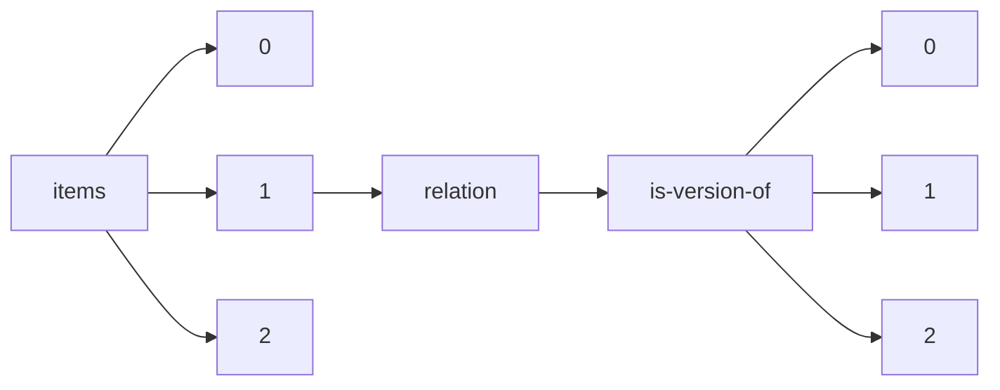

!!! warning "This document is not official Crossref documentation"
# Elements
PATH = items/array/relation/is-version-of/array(1)  
Occurs 54 433 times  
{ .annotate }

1. A route to an element, for example:  
   The route "items/array/relation/is-version-of/array" corresponds to navigating through the JSON indices as  
   ["items"][0]["relation"]["is-version-of"][0]  

## Asserted-by
See more information: [items/array/relation/is-version-of/array/asserted-by](asserted-by/index.md)  
Occurs 54 433 timess  
Unique values: 2  

| **Row** | **Value** `String` | **Count** `Int64` |
|--------:|----------------------:|---------------------:|
| **1**   | subject               | 54 331               |
| **2**   | object                | 102                  |

## Id
See more information: [items/array/relation/is-version-of/array/id](id/index.md)  
Occurs 54 433 timess  
Unique values: > 999  

!!! note "Due to current limitations, only the first 1,000 unique values are counted."

| **Row** | **Value** `String`          | **Count** `Int64` |
|--------:|-------------------------------:|---------------------:|
| **1**   |                                | 420                  |
| **2**   | 10.26434/chemrxiv.13102877.v22 | 39                   |
| **3**   | 10.26434/chemrxiv.13102877.v18 | 39                   |
| **4**   | 10.26434/chemrxiv.13102877.v28 | 39                   |
| **5**   | 10.26434/chemrxiv.13102877.v32 | 39                   |
| **6**   | 10.26434/chemrxiv.13102877.v4  | 39                   |
| **7**   | 10.26434/chemrxiv.13102877.v6  | 39                   |
| **8**   | 10.26434/chemrxiv.13102877.v10 | 39                   |
| **9**   | 10.26434/chemrxiv.13102877.v2  | 38                   |
| **10**  | 10.26434/chemrxiv.13102877.v8  | 38                   |
| ... | ... | ... |

## Id-type
See more information: [items/array/relation/is-version-of/array/id-type](id-type/index.md)  
Occurs 54 433 timess  
Unique values: 5  

| **Row** | **Value** `String` | **Count** `Int64` |
|--------:|----------------------:|---------------------:|
| **1**   | doi                   | 52 938               |
| **2**   | uri                   | 1 481                |
| **3**   | isbn                  | 6                    |
| **4**   | handle                | 6                    |
| **5**   | other                 | 2                    |

