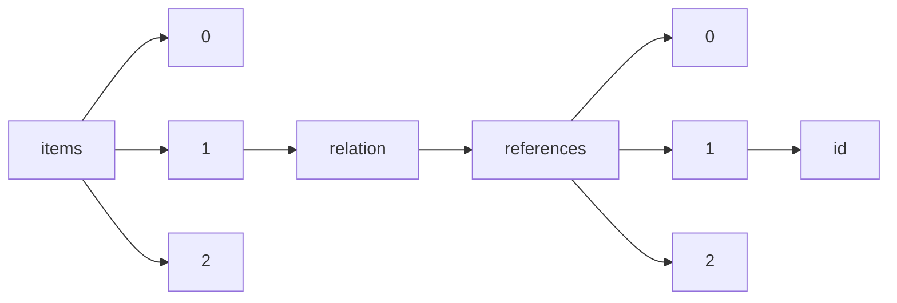

!!! warning "This document is not official Crossref documentation"
# Id
PATH = items/array/relation/references/array/id(1)  
Occurs 42 851 times  
Unique values: > 999  
{ .annotate }

1. A route to an element, for example:  
   The route "items/array/relation/references/array/id" corresponds to navigating through the JSON indices as  
   ["items"][0]["relation"]["references"][0]["id"]  

!!! note "Due to current limitations, only the first 1,000 unique values are counted."

| **Row** | **Value** `String`                                                            | **Count** `Int64` |
|--------:|---------------------------------------------------------------------------------:|---------------------:|
| **1**   |                                                                                  | 2 274                |
| **2**   | 10.6084/m9.figshare.c.4300919                                                    | 10                   |
| **3**   | http://identifiers.org/ncbi/insdc.sra:SRP187756                                  | 8                    |
| **4**   | https://researchdata.reading.ac.uk/256/                                          | 8                    |
| **5**   | https://www.ncdc.noaa.gov/paleo/study/14188                                      | 7                    |
| **6**   | 10.6080/K09G5JRZ                                                                 | 7                    |
| **7**   | https://www.oncomine.com                                                         | 7                    |
| **8**   | 10.6080/K0862DC5                                                                 | 6                    |
| **9**   | http://www.ebi.ac.uk/ena/data/view/PRJEB2888                                     | 6                    |
| **10**  | http://identifiers.org/metabolights:MTBLS528                                     | 5                    |
| **11**  | http://hgdownload.cse.ucsc.edu/goldenPath/hg19/encodeDCC/wgEncodeAwgTfbsUniform/ | 5                    |
| **12**  | http://neuromorpho.org/neuroMorpho/index.jsp                                     | 4                    |
| **13**  | 10.5281/zenodo.5541624                                                           | 3                    |
| **14**  | phs000424.v8.p2                                                                  | 3                    |
| **15**  | GSE36552                                                                         | 3                    |
| **16**  | http://www.ncbi.nlm.nih.gov/geo/query/acc.cgi?                                   | 3                    |
| **17**  | https://identifiers.org/ena.embl:PRJNA310230                                     | 3                    |
| **18**  | 10.21335/NMDC-273201156                                                          | 3                    |
| **19**  | 10.7287/peerj.preprints.3094v2/supp-14                                           | 2                    |
| **20**  | 10.5524/100060                                                                   | 2                    |
| **21**  | 10.7287/peerj.preprints.27825v1/supp-15                                          | 2                    |
| **22**  | 10.7287/peerj.preprints.3475v1/supp-1                                            | 2                    |
| **23**  | 10.7287/peerj.preprints.26629v1/supp-2                                           | 2                    |
| **24**  | 10.7287/peerj.preprints.784v1/supp-2                                             | 2                    |
| **25**  | 10.7287/peerj.preprints.2585v1/supp-6                                            | 2                    |
| **26**  | 10.7287/peerj.preprints.1937v2/supp-3                                            | 2                    |
| **27**  | 10.7287/peerj.preprints.27530v1/supp-1                                           | 2                    |
| **28**  | 10.7287/peerj.preprints.1230v1/supp-1                                            | 2                    |
| **29**  | 10.7287/peerj.preprints.801v1/supp-12                                            | 2                    |
| **30**  | 10.7287/peerj.preprints.26578v1/supp-5                                           | 2                    |
| **31**  | 10.7287/peerj.preprints.27422v1/supp-12                                          | 2                    |
| **32**  | 10.7287/peerj.preprints.1710v1/supp-1                                            | 2                    |
| **33**  | 10.7287/peerj.preprints.790v1/supp-1                                             | 2                    |
| **34**  | 10.7287/peerj.preprints.2325v1/supp-2                                            | 2                    |
| **35**  | 10.7287/peerj.preprints.26481v1/supp-9                                           | 2                    |
| **36**  | 10.7287/peerj.preprints.3135v1/supp-2                                            | 2                    |
| **37**  | 10.7287/peerj.preprints.26667v2/supp-11                                          | 2                    |
| **38**  | 10.7287/peerj.preprints.27924v1/supp-4                                           | 2                    |
| **39**  | 10.7287/peerj.preprints.2452v4/supp-7                                            | 2                    |
| **40**  | 10.7287/peerj.preprints.3269v3/supp-8                                            | 2                    |
| **41**  | 10.7287/peerj.preprints.27790v2/supp-1                                           | 2                    |
| **42**  | 10.7287/peerj.preprints.27287v1/supp-3                                           | 2                    |
| **43**  | 10.7287/peerj.preprints.2782v1/supp-13                                           | 2                    |
| **44**  | 10.7287/peerj.preprints.1652v1/supp-1                                            | 2                    |
| **45**  | 10.7287/peerj.preprints.26777v1/supp-1                                           | 2                    |
| **46**  | 10.7287/peerj.preprints.2249v1/supp-2                                            | 2                    |
| **47**  | 10.7287/peerj.preprints.262v1/supp-5                                             | 2                    |
| **48**  | 10.7287/peerj.preprints.27366v1/supp-8                                           | 2                    |
| **49**  | 10.7287/peerj.preprints.971v1/supp-1                                             | 2                    |
| **50**  | 10.7287/peerj.preprints.2874v1/supp-2                                            | 2                    |
| **51**  | 10.7287/peerj.preprints.27038v2/supp-5                                           | 2                    |
| **52**  | 10.7287/peerj.preprints.26957v1/supp-1                                           | 2                    |
| **53**  | 10.7287/peerj.preprints.2947v1/supp-1                                            | 2                    |
| **54**  | 10.7287/peerj.preprints.723v1/supp-1                                             | 2                    |
| **55**  | 10.7287/peerj.preprints.27960v1/supp-7                                           | 2                    |
| **56**  | 10.7287/peerj.preprints.27801v2/supp-14                                          | 2                    |
| **57**  | 10.7287/peerj.preprints.713v1/supp-3                                             | 2                    |
| **58**  | 10.7287/peerj.preprints.3153v2/supp-23                                           | 2                    |
| **59**  | 10.7287/peerj.preprints.2036v1/supp-9                                            | 2                    |
| **60**  | 10.7287/peerj.preprints.27801v1/supp-2                                           | 2                    |
| **61**  | 10.7287/peerj.preprints.3456v2/supp-5                                            | 2                    |
| **62**  | 10.7287/peerj.preprints.4v1/supp-12                                              | 2                    |
| **63**  | 10.7287/peerj.preprints.807v1/supp-1                                             | 2                    |
| **64**  | 10.7287/peerj.preprints.3347v1/supp-3                                            | 2                    |
| **65**  | 10.7287/peerj.preprints.26733v1/supp-1                                           | 2                    |
| **66**  | 10.7287/peerj.preprints.1779v1/supp-10                                           | 2                    |
| **67**  | 10.7287/peerj.preprints.2645v1/supp-4                                            | 2                    |
| **68**  | 10.7287/peerj.preprints.27751v1/supp-1                                           | 2                    |
| **69**  | 10.7287/peerj.preprints.3319v1/supp-1                                            | 2                    |
| **70**  | 10.7287/peerj.preprints.4v1/supp-7                                               | 2                    |
| **71**  | 10.57760/sciencedb.06669                                                         | 2                    |
| **72**  | 10.7287/peerj.preprints.2300v1/supp-9                                            | 2                    |
| **73**  | 10.7287/peerj.preprints.27829v2/supp-1                                           | 2                    |
| **74**  | 10.7287/peerj.preprints.230v1/supp-2                                             | 2                    |
| **75**  | 10.7287/peerj.preprints.26950v2/supp-5                                           | 2                    |
| **76**  | 10.7287/peerj.preprints.3414v1/supp-3                                            | 2                    |
| **77**  | 10.7287/peerj.preprints.1346v3/supp-1                                            | 2                    |
| **78**  | 10.7287/peerj.preprints.3281v1/supp-10                                           | 2                    |
| **79**  | 10.7287/peerj.preprints.2310v1/supp-7                                            | 2                    |
| **80**  | 10.7287/peerj.preprints.27022v1/supp-4                                           | 2                    |
| **81**  | 10.7287/peerj.preprints.443v1/supp-17                                            | 2                    |
| **82**  | 10.7287/peerj.preprints.3113v1/supp-1                                            | 2                    |
| **83**  | 10.7287/peerj.preprints.2044v4/supp-14                                           | 2                    |
| **84**  | 10.7287/peerj.preprints.2692v1/supp-1                                            | 2                    |
| **85**  | 10.7287/peerj.preprints.443v2/supp-1                                             | 2                    |
| **86**  | 10.7287/peerj.preprints.2944v1/supp-1                                            | 2                    |
| **87**  | 10.7287/peerj.preprints.3408v2/supp-1                                            | 2                    |
| **88**  | 10.7287/peerj.preprints.3087v1/supp-1                                            | 2                    |
| **89**  | 10.7287/peerj.preprints.2561v3/supp-13                                           | 2                    |
| **90**  | 10.7287/peerj.preprints.286v1/supp-8                                             | 2                    |
| **91**  | 10.7287/peerj.preprints.2638v2/supp-1                                            | 2                    |
| **92**  | 10.7287/peerj.preprints.2543v1/supp-10                                           | 2                    |
| **93**  | 10.7287/peerj.preprints.3403v1/supp-3                                            | 2                    |
| **94**  | 10.7287/peerj.preprints.2116v1/supp-4                                            | 2                    |
| **95**  | 10.7287/peerj.preprints.1719v1/supp-7                                            | 2                    |
| **96**  | 10.7287/peerj.preprints.90v3/supp-20                                             | 2                    |
| **97**  | 10.7287/peerj.preprints.1751v1/supp-6                                            | 2                    |
| **98**  | 10.7287/peerj.preprints.1045v1/supp-3                                            | 2                    |
| **99**  | 10.7287/peerj.preprints.168v1/supp-11                                            | 2                    |
| **100** | 10.7287/peerj.preprints.26510v1/supp-1                                           | 2                    |
| **101** | 10.7287/peerj.preprints.788v1/supp-4                                             | 2                    |
| **102** | 10.7287/peerj.preprints.27865v1/supp-2                                           | 2                    |
| **103** | 10.7287/peerj.preprints.26577v3/supp-4                                           | 2                    |
| **104** | 10.7287/peerj.preprints.2269v2/supp-3                                            | 2                    |
| **105** | 10.7287/peerj.preprints.1797v1/supp-16                                           | 2                    |
| **106** | 10.7287/peerj.preprints.1754v1/supp-2                                            | 2                    |
| **107** | 10.7287/peerj.preprints.27232v1/supp-3                                           | 2                    |
| **108** | 10.7287/peerj.preprints.1906v1/supp-6                                            | 2                    |
| **109** | 10.7287/peerj.preprints.27224v1/supp-2                                           | 2                    |
| **110** | 10.7287/peerj.preprints.1899v1/supp-4                                            | 2                    |
| **111** | 10.7287/peerj.preprints.1267v1/supp-1                                            | 2                    |
| **112** | 10.7287/peerj.preprints.2667v1/supp-1                                            | 2                    |
| **113** | 10.7287/peerj.preprints.3094v1/supp-12                                           | 2                    |
| **114** | 10.7287/peerj.preprints.457v2/supp-1                                             | 2                    |
| **115** | 10.7287/peerj.preprints.27780v2/supp-3                                           | 2                    |
| **116** | 10.7287/peerj.preprints.27909v1/supp-20                                          | 2                    |
| **117** | 10.7287/peerj.preprints.3019v1/supp-1                                            | 2                    |
| **118** | 10.7287/peerj.preprints.26514v1/supp-1                                           | 2                    |
| **119** | 10.7287/peerj.preprints.1779v1/supp-1                                            | 2                    |
| **120** | 10.7287/peerj.preprints.1110v3/supp-2                                            | 2                    |
| **121** | 10.7287/peerj.preprints.834v2/supp-1                                             | 2                    |
| **122** | 10.7287/peerj.preprints.27928v1/supp-9                                           | 2                    |
| **123** | 10.7287/peerj.preprints.1409v1/supp-1                                            | 2                    |
| **124** | 10.7287/peerj.preprints.26860v1/supp-7                                           | 2                    |
| **125** | 10.7287/peerj.preprints.1596v1/supp-1                                            | 2                    |
| **126** | 10.7287/peerj.preprints.2225v4/supp-1                                            | 2                    |
| **127** | 10.7287/peerj.preprints.27422v1/supp-3                                           | 2                    |
| **128** | 10.7287/peerj.preprints.94v1/supp-2                                              | 2                    |
| **129** | 10.7287/peerj.preprints.1311v2/supp-8                                            | 2                    |
| **130** | 10.7287/peerj.preprints.126v2/supp-11                                            | 2                    |
| **131** | 10.7287/peerj.preprints.1947v1/supp-2                                            | 2                    |
| **132** | 10.7287/peerj.preprints.2803v1/supp-4                                            | 2                    |
| **133** | 10.7287/peerj.preprints.27302v1/supp-1                                           | 2                    |
| **134** | 10.7287/peerj.preprints.643v1/supp-10                                            | 2                    |
| **135** | 10.7287/peerj.preprints.90v2/supp-17                                             | 2                    |
| **136** | 10.7287/peerj.preprints.963v1/supp-2                                             | 2                    |
| **137** | 10.7287/peerj.preprints.3093v1/supp-3                                            | 2                    |
| **138** | 10.7287/peerj.preprints.3037v2/supp-3                                            | 2                    |
| **139** | 10.7287/peerj.preprints.1419v2/supp-5                                            | 2                    |
| **140** | 10.7287/peerj.preprints.27923v1/supp-1                                           | 2                    |
| **141** | 10.7287/peerj.preprints.27839v1/supp-7                                           | 2                    |
| **142** | 10.7287/peerj.preprints.1384v2/supp-1                                            | 2                    |
| **143** | 10.7287/peerj.preprints.4v1/supp-19                                              | 2                    |
| **144** | 10.7287/peerj.preprints.3329v2/supp-5                                            | 2                    |
| **145** | 10.7287/peerj.preprints.1752v1/supp-2                                            | 2                    |
| **146** | 10.7287/peerj.preprints.186v1/supp-5                                             | 2                    |
| **147** | 10.7287/peerj.preprints.27791v1/supp-20                                          | 2                    |
| **148** | 10.7287/peerj.preprints.27651v8/supp-1                                           | 2                    |
| **149** | 10.7287/peerj.preprints.1875v1/supp-12                                           | 2                    |
| **150** | 10.7287/peerj.preprints.26623v1/supp-3                                           | 2                    |
| **151** | 10.7287/peerj.preprints.725v1/supp-1                                             | 2                    |
| **152** | 10.7287/peerj.preprints.27758v1/supp-5                                           | 2                    |
| **153** | 10.7287/peerj.preprints.27941v1/supp-3                                           | 2                    |
| **154** | 10.7287/peerj.preprints.1390v1/supp-4                                            | 2                    |
| **155** | 10.7287/peerj.preprints.27193v1/supp-4                                           | 2                    |
| **156** | 10.7287/peerj.preprints.2903v1/supp-2                                            | 2                    |
| **157** | 10.7287/peerj.preprints.3412v2/supp-3                                            | 2                    |
| **158** | 10.7287/peerj.preprints.795v1/supp-2                                             | 2                    |
| **159** | 10.7287/peerj.preprints.27289v1/supp-1                                           | 2                    |
| **160** | 10.7287/peerj.preprints.27461v1/supp-5                                           | 2                    |
| **161** | 10.7287/peerj.preprints.1300v1/supp-2                                            | 2                    |
| **162** | 10.7287/peerj.preprints.246v1/supp-7                                             | 2                    |
| **163** | 10.7287/peerj.preprints.291v3/supp-5                                             | 2                    |
| **164** | 10.7287/peerj.preprints.2044v3/supp-5                                            | 2                    |
| **165** | 10.7287/peerj.preprints.447v3/supp-1                                             | 2                    |
| **166** | 10.7287/peerj.preprints.3273v1/supp-1                                            | 2                    |
| **167** | 10.7287/peerj.preprints.27669v1/supp-2                                           | 2                    |
| **168** | 10.7287/peerj.preprints.28006v1/supp-7                                           | 2                    |
| **169** | 10.7287/peerj.preprints.26540v2/supp-1                                           | 2                    |
| **170** | 10.7287/peerj.preprints.3488v1/supp-7                                            | 2                    |
| **171** | 10.7287/peerj.preprints.1914v1/supp-1                                            | 2                    |
| **172** | 10.7287/peerj.preprints.3057v1/supp-2                                            | 2                    |
| **173** | 10.7287/peerj.preprints.2952v1/supp-2                                            | 2                    |
| **174** | 10.7287/peerj.preprints.376v2/supp-1                                             | 2                    |
| **175** | 10.7287/peerj.preprints.1514v1/supp-10                                           | 2                    |
| **176** | 10.7287/peerj.preprints.2372v1/supp-1                                            | 2                    |
| **177** | 10.7287/peerj.preprints.1316v2/supp-3                                            | 2                    |
| **178** | 10.7287/peerj.preprints.3465v1/supp-3                                            | 2                    |
| **179** | 10.7287/peerj.preprints.1660v1/supp-3                                            | 2                    |
| **180** | 10.7287/peerj.preprints.27974v1/supp-15                                          | 2                    |
| **181** | 10.7287/peerj.preprints.3444v1/supp-4                                            | 2                    |
| **182** | 10.7287/peerj.preprints.3461v1/supp-5                                            | 2                    |
| **183** | 10.7287/peerj.preprints.322v1/supp-8                                             | 2                    |
| **184** | 10.7287/peerj.preprints.26903v2/supp-2                                           | 2                    |
| **185** | 10.7287/peerj.preprints.26459v1/supp-1                                           | 2                    |
| **186** | 10.7287/peerj.preprints.26925v1/supp-2                                           | 2                    |
| **187** | 10.7287/peerj.preprints.3078v1/supp-2                                            | 2                    |
| **188** | 10.7287/peerj.preprints.27393v1/supp-4                                           | 2                    |
| **189** | 10.7287/peerj.preprints.1732v1/supp-1                                            | 2                    |
| **190** | 10.7287/peerj.preprints.27451v1/supp-1                                           | 2                    |
| **191** | 10.7287/peerj.preprints.26566v1/supp-10                                          | 2                    |
| **192** | 10.7287/peerj.preprints.1596v3/supp-1                                            | 2                    |
| **193** | 10.7287/peerj.preprints.3037v1/supp-11                                           | 2                    |
| **194** | 10.7287/peerj.preprints.339v1/supp-4                                             | 2                    |
| **195** | 10.7287/peerj.preprints.230v1/supp-6                                             | 2                    |
| **196** | 10.7287/peerj.preprints.1530v1/supp-3                                            | 2                    |
| **197** | 10.7287/peerj.preprints.27330v1/supp-11                                          | 2                    |
| **198** | 10.7287/peerj.preprints.3438v1/supp-1                                            | 2                    |
| **199** | 10.7287/peerj.preprints.909v1/supp-1                                             | 2                    |
| **200** | 10.7287/peerj.preprints.27909v1/supp-15                                          | 2                    |
| **201** | 10.7287/peerj.preprints.2870v1/supp-3                                            | 2                    |
| **202** | http://www.rcsb.org/pdb/explore/explore.do?structureId=1JFF                      | 2                    |
| **203** | 10.7287/peerj.preprints.27851v1/supp-5                                           | 2                    |
| **204** | 10.7287/peerj.preprints.27643v1/supp-1                                           | 2                    |
| **205** | 10.7287/peerj.preprints.2343v1/supp-3                                            | 2                    |
| **206** | 10.7287/peerj.preprints.1311v2/supp-4                                            | 2                    |
| **207** | 10.7287/peerj.preprints.2741v1/supp-4                                            | 2                    |
| **208** | 10.7287/peerj.preprints.2813v1/supp-5                                            | 2                    |
| **209** | 10.7287/peerj.preprints.3459v1/supp-2                                            | 2                    |
| **210** | 10.7287/peerj.preprints.82v1/supp-1                                              | 2                    |
| **211** | 10.7287/peerj.preprints.157v1/supp-1                                             | 2                    |
| **212** | 10.7287/peerj.preprints.27992v2/supp-14                                          | 2                    |
| **213** | 10.7287/peerj.preprints.1457v1/supp-1                                            | 2                    |
| **214** | 10.7287/peerj.preprints.264v1/supp-1                                             | 2                    |
| **215** | 10.7287/peerj.preprints.3381v1/supp-2                                            | 2                    |
| **216** | 10.7287/peerj.preprints.1246v2/supp-9                                            | 2                    |
| **217** | 10.7287/peerj.preprints.27696v1/supp-1                                           | 2                    |
| **218** | 10.7287/peerj.preprints.2113v1/supp-3                                            | 2                    |
| **219** | 10.7287/peerj.preprints.1530v1/supp-1                                            | 2                    |
| **220** | 10.7287/peerj.preprints.1751v1/supp-10                                           | 2                    |
| **221** | 10.7287/peerj.preprints.218v2/supp-2                                             | 2                    |
| **222** | GSE45719                                                                         | 2                    |
| **223** | 10.7287/peerj.preprints.27861v1/supp-2                                           | 2                    |
| **224** | 10.7287/peerj.preprints.1636v1/supp-1                                            | 2                    |
| **225** | 10.7287/peerj.preprints.27056v1/supp-9                                           | 2                    |
| **226** | 10.7287/peerj.preprints.2036v1/supp-22                                           | 2                    |
| **227** | 10.7287/peerj.preprints.27022v2/supp-1                                           | 2                    |
| **228** | 10.7287/peerj.preprints.26620v2/supp-8                                           | 2                    |
| **229** | 10.7287/peerj.preprints.904v1/supp-3                                             | 2                    |
| **230** | 10.7287/peerj.preprints.260v1/supp-9                                             | 2                    |
| **231** | 10.7287/peerj.preprints.27509v2/supp-1                                           | 2                    |
| **232** | 10.7287/peerj.preprints.377v1/supp-6                                             | 2                    |
| **233** | 10.7287/peerj.preprints.3110v2/supp-5                                            | 2                    |
| **234** | 10.7287/peerj.preprints.2874v1/supp-21                                           | 2                    |
| **235** | 10.7287/peerj.preprints.3226v1/supp-2                                            | 2                    |
| **236** | 10.7287/peerj.preprints.27717v3/supp-1                                           | 2                    |
| **237** | 10.7287/peerj.preprints.27850v1/supp-83                                          | 2                    |
| **238** | 10.7287/peerj.preprints.578v1/supp-1                                             | 2                    |
| **239** | 10.7287/peerj.preprints.27436v1/supp-1                                           | 2                    |
| **240** | 10.7287/peerj.preprints.2548v1/supp-5                                            | 2                    |
| **241** | 10.7287/peerj.preprints.2014v1/supp-2                                            | 2                    |
| **242** | 10.7287/peerj.preprints.27801v2/supp-12                                          | 2                    |
| **243** | 10.7287/peerj.preprints.27202v1/supp-9                                           | 2                    |
| **244** | 10.7287/peerj.preprints.26917v1/supp-1                                           | 2                    |
| **245** | 10.7287/peerj.preprints.667v1/supp-1                                             | 2                    |
| **246** | 10.7287/peerj.preprints.643v1/supp-5                                             | 2                    |
| **247** | 10.7287/peerj.preprints.27756v1/supp-12                                          | 2                    |
| **248** | 10.7287/peerj.preprints.286v1/supp-11                                            | 2                    |
| **249** | 10.7287/peerj.preprints.836v1/supp-2                                             | 2                    |
| **250** | 10.7287/peerj.preprints.176v1/supp-1                                             | 2                    |
| **251** | 10.7287/peerj.preprints.2740v1/supp-3                                            | 2                    |
| **252** | 10.7287/peerj.preprints.26903v2/supp-8                                           | 2                    |
| **253** | 10.7287/peerj.preprints.27484v1/supp-1                                           | 2                    |
| **254** | 10.7287/peerj.preprints.2779v1/supp-1                                            | 2                    |
| **255** | 10.7287/peerj.preprints.403v2/supp-7                                             | 2                    |
| **256** | 10.7287/peerj.preprints.2592v1/supp-1                                            | 2                    |
| **257** | 10.7287/peerj.preprints.27851v1/supp-12                                          | 2                    |
| **258** | 10.7287/peerj.preprints.1754v1/supp-1                                            | 2                    |
| **259** | 10.7287/peerj.preprints.2332v1/supp-22                                           | 2                    |
| **260** | 10.7287/peerj.preprints.1544v1/supp-3                                            | 2                    |
| **261** | 10.7287/peerj.preprints.2924v1/supp-13                                           | 2                    |
| **262** | 10.7287/peerj.preprints.3014v1/supp-1                                            | 2                    |
| **263** | 10.7287/peerj.preprints.3153v1/supp-32                                           | 2                    |
| **264** | 10.7287/peerj.preprints.27604v1/supp-2                                           | 2                    |
| **265** | 10.7287/peerj.preprints.2763v1/supp-1                                            | 2                    |
| **266** | 10.7287/peerj.preprints.26774v1/supp-2                                           | 2                    |
| **267** | 10.7287/peerj.preprints.26786v1/supp-1                                           | 2                    |
| **268** | 10.7287/peerj.preprints.27424v1/supp-6                                           | 2                    |
| **269** | 10.7287/peerj.preprints.27645v1/supp-2                                           | 2                    |
| **270** | 10.7287/peerj.preprints.1190v1/supp-2                                            | 2                    |
| **271** | 10.7287/peerj.preprints.2933v1/supp-1                                            | 2                    |
| **272** | 10.7287/peerj.preprints.433v1/supp-5                                             | 2                    |
| **273** | 10.7287/peerj.preprints.1117v1/supp-1                                            | 2                    |
| **274** | 10.7287/peerj.preprints.3432v1/supp-4                                            | 2                    |
| **275** | 10.7287/peerj.preprints.2882v4/supp-1                                            | 2                    |
| **276** | 10.7287/peerj.preprints.3330v1/supp-3                                            | 2                    |
| **277** | 10.7287/peerj.preprints.26553v1/supp-7                                           | 2                    |
| **278** | 10.7287/peerj.preprints.3461v2/supp-24                                           | 2                    |
| **279** | 10.7287/peerj.preprints.2813v1/supp-8                                            | 2                    |
| **280** | 10.7287/peerj.preprints.403v1/supp-9                                             | 2                    |
| **281** | 10.7287/peerj.preprints.26488v1/supp-1                                           | 2                    |
| **282** | 10.7287/peerj.preprints.27797v1/supp-2                                           | 2                    |
| **283** | 10.7287/peerj.preprints.26995v1/supp-4                                           | 2                    |
| **284** | 10.7287/peerj.preprints.2763v2/supp-1                                            | 2                    |
| **285** | 10.7287/peerj.preprints.27049v1/supp-2                                           | 2                    |
| **286** | 10.7287/peerj.preprints.3456v4/supp-5                                            | 2                    |
| **287** | 10.7287/peerj.preprints.1390v1/supp-8                                            | 2                    |
| **288** | 10.7287/peerj.preprints.2962v2/supp-4                                            | 2                    |
| **289** | 10.7287/peerj.preprints.2822v1/supp-3                                            | 2                    |
| **290** | 10.7287/peerj.preprints.260v1/supp-3                                             | 2                    |
| **291** | 10.7287/peerj.preprints.2675v1/supp-4                                            | 2                    |
| **292** | 10.7287/peerj.preprints.904v2/supp-4                                             | 2                    |
| **293** | 10.7287/peerj.preprints.2293v1/supp-1                                            | 2                    |
| **294** | 10.7287/peerj.preprints.192v1/supp-1                                             | 2                    |
| **295** | 10.7287/peerj.preprints.26594v1/supp-1                                           | 2                    |
| **296** | 10.7287/peerj.preprints.1371v1/supp-2                                            | 2                    |
| **297** | 10.7287/peerj.preprints.2535v1/supp-1                                            | 2                    |
| **298** | 10.7287/peerj.preprints.2123v1/supp-6                                            | 2                    |
| **299** | 10.7287/peerj.preprints.3233v1/supp-2                                            | 2                    |
| **300** | 10.7287/peerj.preprints.728v1/supp-2                                             | 2                    |
| **301** | 10.7287/peerj.preprints.199v1/supp-5                                             | 2                    |
| **302** | 10.7287/peerj.preprints.27422v1/supp-11                                          | 2                    |
| **303** | 10.7287/peerj.preprints.27929v1/supp-4                                           | 2                    |
| **304** | 10.7287/peerj.preprints.3478v1/supp-2                                            | 2                    |
| **305** | 10.7287/peerj.preprints.27049v1/supp-3                                           | 2                    |
| **306** | 10.7287/peerj.preprints.2772v2/supp-4                                            | 2                    |
| **307** | 10.7287/peerj.preprints.3488v1/supp-2                                            | 2                    |
| **308** | 10.7287/peerj.preprints.27404v1/supp-1                                           | 2                    |
| **309** | 10.7287/peerj.preprints.2187v1/supp-2                                            | 2                    |
| **310** | 10.7287/peerj.preprints.27801v1/supp-22                                          | 2                    |
| **311** | 10.7287/peerj.preprints.3148v1/supp-1                                            | 2                    |
| **312** | 10.7287/peerj.preprints.90v2/supp-7                                              | 2                    |
| **313** | 10.7287/peerj.preprints.1001v1/supp-2                                            | 2                    |
| **314** | 10.7287/peerj.preprints.3487v1/supp-3                                            | 2                    |
| **315** | 10.7287/peerj.preprints.1780v1/supp-4                                            | 2                    |
| **316** | 10.7287/peerj.preprints.2681v1/supp-3                                            | 2                    |
| **317** | 10.7287/peerj.preprints.110v5/supp-1                                             | 2                    |
| **318** | 10.7287/peerj.preprints.27695v1/supp-1                                           | 2                    |
| **319** | 10.7287/peerj.preprints.27461v1/supp-2                                           | 2                    |
| **320** | 10.7287/peerj.preprints.27356v1/supp-10                                          | 2                    |
| **321** | 10.7287/peerj.preprints.1157v1/supp-3                                            | 2                    |
| **322** | 10.7287/peerj.preprints.2338v1/supp-3                                            | 2                    |
| **323** | 10.7287/peerj.preprints.27909v1/supp-1                                           | 2                    |
| **324** | 10.7287/peerj.preprints.27000v1/supp-1                                           | 2                    |
| **325** | 10.7287/peerj.preprints.1932v1/supp-1                                            | 2                    |
| **326** | 10.7287/peerj.preprints.27164v1/supp-1                                           | 2                    |
| **327** | 10.7287/peerj.preprints.27909v1/supp-14                                          | 2                    |
| **328** | 10.7287/peerj.preprints.2561v1/supp-4                                            | 2                    |
| **329** | 10.7287/peerj.preprints.27499v1/supp-1                                           | 2                    |
| **330** | 10.7287/peerj.preprints.1223v1/supp-4                                            | 2                    |
| **331** | 10.7287/peerj.preprints.26438v1/supp-2                                           | 2                    |
| **332** | 10.7287/peerj.preprints.123v1/supp-2                                             | 2                    |
| **333** | 10.7287/peerj.preprints.1441v1/supp-5                                            | 2                    |
| **334** | 10.7287/peerj.preprints.2058v1/supp-4                                            | 2                    |
| **335** | 10.7287/peerj.preprints.3153v1/supp-7                                            | 2                    |
| **336** | 10.7287/peerj.preprints.2102v2/supp-1                                            | 2                    |
| **337** | 10.7287/peerj.preprints.27944v3/supp-1                                           | 2                    |
| **338** | 10.7287/peerj.preprints.27244v4/supp-2                                           | 2                    |
| **339** | 10.7287/peerj.preprints.2882v5/supp-4                                            | 2                    |
| **340** | 10.7287/peerj.preprints.27012v1/supp-1                                           | 2                    |
| **341** | 10.7287/peerj.preprints.27530v2/supp-1                                           | 2                    |
| **342** | 10.7287/peerj.preprints.27917v1/supp-1                                           | 2                    |
| **343** | 10.7287/peerj.preprints.27015v1/supp-1                                           | 2                    |
| **344** | 10.7287/peerj.preprints.27669v1/supp-12                                          | 2                    |
| **345** | 10.7287/peerj.preprints.2198v1/supp-2                                            | 2                    |
| **346** | 10.7287/peerj.preprints.27425v1/supp-1                                           | 2                    |
| **347** | 10.7287/peerj.preprints.27611v1/supp-4                                           | 2                    |
| **348** | 10.7287/peerj.preprints.26708v1/supp-2                                           | 2                    |
| **349** | 10.7287/peerj.preprints.621v1/supp-2                                             | 2                    |
| **350** | 10.7287/peerj.preprints.26723v1/supp-3                                           | 2                    |
| **351** | 10.7287/peerj.preprints.2154v1/supp-2                                            | 2                    |
| **352** | 10.7287/peerj.preprints.420v1/supp-1                                             | 2                    |
| **353** | 10.7287/peerj.preprints.318v1/supp-3                                             | 2                    |
| **354** | 10.7287/peerj.preprints.1804v1/supp-16                                           | 2                    |
| **355** | 10.7287/peerj.preprints.3484v1/supp-2                                            | 2                    |
| **356** | 10.7287/peerj.preprints.3146v1/supp-6                                            | 2                    |
| **357** | 10.7287/peerj.preprints.27610v1/supp-1                                           | 2                    |
| **358** | 10.7287/peerj.preprints.27453v1/supp-4                                           | 2                    |
| **359** | 10.7287/peerj.preprints.27622v1/supp-1                                           | 2                    |
| **360** | 10.7287/peerj.preprints.26477v3/supp-1                                           | 2                    |
| **361** | 10.7287/peerj.preprints.27001v1/supp-3                                           | 2                    |
| **362** | 10.7287/peerj.preprints.686v1/supp-10                                            | 2                    |
| **363** | 10.7287/peerj.preprints.527v1/supp-4                                             | 2                    |
| **364** | 10.7287/peerj.preprints.26438v2/supp-1                                           | 2                    |
| **365** | 10.7287/peerj.preprints.640v1/supp-2                                             | 2                    |
| **366** | 10.7287/peerj.preprints.2740v1/supp-18                                           | 2                    |
| **367** | 10.7287/peerj.preprints.2372v1/supp-4                                            | 2                    |
| **368** | 10.7287/peerj.preprints.27424v1/supp-5                                           | 2                    |
| **369** | 10.7287/peerj.preprints.27403v1/supp-2                                           | 2                    |
| **370** | 10.7287/peerj.preprints.3005v4/supp-4                                            | 2                    |
| **371** | 10.7287/peerj.preprints.801v1/supp-15                                            | 2                    |
| **372** | 10.7287/peerj.preprints.27354v1/supp-1                                           | 2                    |
| **373** | 10.7287/peerj.preprints.3172v1/supp-3                                            | 2                    |
| **374** | 10.7287/peerj.preprints.1970v1/supp-2                                            | 2                    |
| **375** | 10.7287/peerj.preprints.27674v1/supp-1                                           | 2                    |
| **376** | 10.7287/peerj.preprints.3075v1/supp-2                                            | 2                    |
| **377** | 10.7287/peerj.preprints.2662v1/supp-6                                            | 2                    |
| **378** | 10.7287/peerj.preprints.2058v1/supp-1                                            | 2                    |
| **379** | 10.7287/peerj.preprints.27771v1/supp-6                                           | 2                    |
| **380** | 10.7287/peerj.preprints.3525v1/supp-13                                           | 2                    |
| **381** | 10.7287/peerj.preprints.27242v1/supp-5                                           | 2                    |
| **382** | 10.7287/peerj.preprints.27244v2/supp-8                                           | 2                    |
| **383** | 10.7287/peerj.preprints.27262v1/supp-2                                           | 2                    |
| **384** | 10.7287/peerj.preprints.27505v1/supp-1                                           | 2                    |
| **385** | 10.7287/peerj.preprints.3370v2/supp-1                                            | 2                    |
| **386** | 10.7287/peerj.preprints.981v1/supp-1                                             | 2                    |
| **387** | 10.7287/peerj.preprints.3184v1/supp-4                                            | 2                    |
| **388** | 10.7287/peerj.preprints.27557v1/supp-11                                          | 2                    |
| **389** | 10.7287/peerj.preprints.3348v1/supp-1                                            | 2                    |
| **390** | 10.7287/peerj.preprints.27676v1/supp-2                                           | 2                    |
| **391** | 10.7287/peerj.preprints.1462v3/supp-4                                            | 2                    |
| **392** | 10.7287/peerj.preprints.1860v1/supp-4                                            | 2                    |
| **393** | 10.7287/peerj.preprints.3061v1/supp-1                                            | 2                    |
| **394** | 10.7287/peerj.preprints.1715v1/supp-5                                            | 2                    |
| **395** | 10.7287/peerj.preprints.1167v2/supp-1                                            | 2                    |
| **396** | 10.7287/peerj.preprints.27929v1/supp-13                                          | 2                    |
| **397** | 10.7287/peerj.preprints.3514v1/supp-9                                            | 2                    |
| **398** | 10.7287/peerj.preprints.27388v1/supp-1                                           | 2                    |
| **399** | 10.7287/peerj.preprints.27242v1/supp-8                                           | 2                    |
| **400** | 10.7287/peerj.preprints.3153v1/supp-6                                            | 2                    |
| **401** | 10.7287/peerj.preprints.26632v1/supp-4                                           | 2                    |
| **402** | 10.7287/peerj.preprints.2111v1/supp-1                                            | 2                    |
| **403** | 10.7287/peerj.preprints.3376v1/supp-1                                            | 2                    |
| **404** | 10.7287/peerj.preprints.27850v1/supp-11                                          | 2                    |
| **405** | 10.7287/peerj.preprints.27429v1/supp-8                                           | 2                    |
| **406** | 10.7287/peerj.preprints.3419v1/supp-1                                            | 2                    |
| **407** | 10.7287/peerj.preprints.2278v3/supp-4                                            | 2                    |
| **408** | 10.7287/peerj.preprints.292v1/supp-3                                             | 2                    |
| **409** | 10.7287/peerj.preprints.3298v1/supp-8                                            | 2                    |
| **410** | 10.7287/peerj.preprints.2643v2/supp-6                                            | 2                    |
| **411** | 10.7287/peerj.preprints.2404v1/supp-7                                            | 2                    |
| **412** | 10.7287/peerj.preprints.53v2/supp-3                                              | 2                    |
| **413** | 10.7287/peerj.preprints.27847v2/supp-1                                           | 2                    |
| **414** | 10.7287/peerj.preprints.589v1/supp-3                                             | 2                    |
| **415** | 10.7287/peerj.preprints.2106v2/supp-4                                            | 2                    |
| **416** | 10.7287/peerj.preprints.1321v1/supp-1                                            | 2                    |
| **417** | 10.7287/peerj.preprints.26584v1/supp-5                                           | 2                    |
| **418** | 10.7287/peerj.preprints.2593v1/supp-5                                            | 2                    |
| **419** | 10.7287/peerj.preprints.3082v1/supp-2                                            | 2                    |
| **420** | 10.7287/peerj.preprints.1753v1/supp-2                                            | 2                    |
| **421** | 10.7287/peerj.preprints.1873v1/supp-1                                            | 2                    |
| **422** | 10.7287/peerj.preprints.2410v1/supp-1                                            | 2                    |
| **423** | 10.7287/peerj.preprints.2014v1/supp-5                                            | 2                    |
| **424** | 10.7287/peerj.preprints.2703v1/supp-4                                            | 2                    |
| **425** | 10.7287/peerj.preprints.2607v1/supp-3                                            | 2                    |
| **426** | 10.7287/peerj.preprints.27200v2/supp-8                                           | 2                    |
| **427** | 10.7287/peerj.preprints.26783v1/supp-2                                           | 2                    |
| **428** | 10.7287/peerj.preprints.27814v1/supp-3                                           | 2                    |
| **429** | 10.7287/peerj.preprints.940v2/supp-1                                             | 2                    |
| **430** | 10.7287/peerj.preprints.26923v1/supp-7                                           | 2                    |
| **431** | 10.7287/peerj.preprints.27609v1/supp-1                                           | 2                    |
| **432** | 10.7287/peerj.preprints.1532v1/supp-4                                            | 2                    |
| **433** | 10.7287/peerj.preprints.26674v1/supp-9                                           | 2                    |
| **434** | 10.7287/peerj.preprints.472v1/supp-8                                             | 2                    |
| **435** | 10.7287/peerj.preprints.27869v1/supp-1                                           | 2                    |
| **436** | 10.7287/peerj.preprints.1576v4/supp-1                                            | 2                    |
| **437** | 10.7287/peerj.preprints.3408v2/supp-7                                            | 2                    |
| **438** | 10.7287/peerj.preprints.1461v1/supp-1                                            | 2                    |
| **439** | 10.7287/peerj.preprints.2013v1/supp-1                                            | 2                    |
| **440** | 10.7287/peerj.preprints.621v1/supp-3                                             | 2                    |
| **441** | 10.7287/peerj.preprints.1249v1/supp-1                                            | 2                    |
| **442** | 10.7287/peerj.preprints.1764v1/supp-5                                            | 2                    |
| **443** | 10.7287/peerj.preprints.27013v1/supp-29                                          | 2                    |
| **444** | 10.7287/peerj.preprints.545v1/supp-2                                             | 2                    |
| **445** | 10.7287/peerj.preprints.27038v2/supp-4                                           | 2                    |
| **446** | 10.7287/peerj.preprints.27200v1/supp-5                                           | 2                    |
| **447** | 10.7287/peerj.preprints.27443v1/supp-6                                           | 2                    |
| **448** | 10.7287/peerj.preprints.27801v2/supp-13                                          | 2                    |
| **449** | 10.7287/peerj.preprints.1266v4/supp-1                                            | 2                    |
| **450** | 10.7287/peerj.preprints.90v3/supp-17                                             | 2                    |
| **451** | 10.7287/peerj.preprints.2484v1/supp-2                                            | 2                    |
| **452** | 10.7287/peerj.preprints.788v1/supp-2                                             | 2                    |
| **453** | 10.7287/peerj.preprints.554v1/supp-6                                             | 2                    |
| **454** | 10.7287/peerj.preprints.27541v1/supp-2                                           | 2                    |
| **455** | 10.7287/peerj.preprints.2956v1/supp-5                                            | 2                    |
| **456** | 10.7287/peerj.preprints.388v1/supp-8                                             | 2                    |
| **457** | 10.7287/peerj.preprints.27164v2/supp-1                                           | 2                    |
| **458** | 10.7287/peerj.preprints.27557v1/supp-1                                           | 2                    |
| **459** | 10.7287/peerj.preprints.2561v2/supp-14                                           | 2                    |
| **460** | 10.7287/peerj.preprints.2643v2/supp-8                                            | 2                    |
| **461** | 10.7287/peerj.preprints.2422v1/supp-3                                            | 2                    |
| **462** | 10.7287/peerj.preprints.2123v1/supp-5                                            | 2                    |
| **463** | 10.7287/peerj.preprints.3488v2/supp-2                                            | 2                    |
| **464** | 10.7287/peerj.preprints.27944v2/supp-1                                           | 2                    |
| **465** | 10.7287/peerj.preprints.1751v1/supp-5                                            | 2                    |
| **466** | 10.7287/peerj.preprints.2624v2/supp-4                                            | 2                    |
| **467** | 10.7287/peerj.preprints.1609v1/supp-5                                            | 2                    |
| **468** | 10.7287/peerj.preprints.1001v1/supp-1                                            | 2                    |
| **469** | 10.7287/peerj.preprints.2222v2/supp-1                                            | 2                    |
| **470** | 10.7287/peerj.preprints.109v1/supp-4                                             | 2                    |
| **471** | 10.7287/peerj.preprints.90v3/supp-21                                             | 2                    |
| **472** | 10.7287/peerj.preprints.3334v2/supp-2                                            | 2                    |
| **473** | 10.7287/peerj.preprints.836v1/supp-1                                             | 2                    |
| **474** | 10.7287/peerj.preprints.3456v3/supp-2                                            | 2                    |
| **475** | 10.7287/peerj.preprints.280v2/supp-3                                             | 2                    |
| **476** | 10.7287/peerj.preprints.27756v1/supp-4                                           | 2                    |
| **477** | 10.7287/peerj.preprints.2078v1/supp-1                                            | 2                    |
| **478** | 10.7287/peerj.preprints.27591v2/supp-2                                           | 2                    |
| **479** | 10.7287/peerj.preprints.2320v6/supp-1                                            | 2                    |
| **480** | 10.7287/peerj.preprints.26482v1/supp-2                                           | 2                    |
| **481** | 10.7287/peerj.preprints.27162v1/supp-15                                          | 2                    |
| **482** | 10.7287/peerj.preprints.575v1/supp-2                                             | 2                    |
| **483** | 10.7287/peerj.preprints.27355v1/supp-1                                           | 2                    |
| **484** | 10.7287/peerj.preprints.2458v1/supp-9                                            | 2                    |
| **485** | 10.7287/peerj.preprints.2146v1/supp-1                                            | 2                    |
| **486** | 10.7287/peerj.preprints.26674v1/supp-4                                           | 2                    |
| **487** | 10.7287/peerj.preprints.27047v1/supp-1                                           | 2                    |
| **488** | 10.7287/peerj.preprints.26962v1/supp-7                                           | 2                    |
| **489** | 10.7287/peerj.preprints.4v1/supp-1                                               | 2                    |
| **490** | 10.7287/peerj.preprints.745v3/supp-1                                             | 2                    |
| **491** | 10.7287/peerj.preprints.1568v13/supp-1                                           | 2                    |
| **492** | 10.7287/peerj.preprints.2813v1/supp-1                                            | 2                    |
| **493** | 10.7287/peerj.preprints.2644v1/supp-1                                            | 2                    |
| **494** | 10.7287/peerj.preprints.1283v1/supp-4                                            | 2                    |
| **495** | 10.7287/peerj.preprints.27467v1/supp-4                                           | 2                    |
| **496** | 10.7287/peerj.preprints.2325v1/supp-6                                            | 2                    |
| **497** | 10.7287/peerj.preprints.1438v1/supp-1                                            | 2                    |
| **498** | 10.7287/peerj.preprints.27858v1/supp-2                                           | 2                    |
| **499** | 10.7287/peerj.preprints.27739v3/supp-5                                           | 2                    |
| **500** | 10.7287/peerj.preprints.27858v1/supp-10                                          | 2                    |
| **501** | 10.7287/peerj.preprints.2458v1/supp-6                                            | 2                    |
| **502** | 10.7287/peerj.preprints.27421v2/supp-1                                           | 2                    |
| **503** | 10.7287/peerj.preprints.2241v1/supp-2                                            | 2                    |
| **504** | 10.7287/peerj.preprints.2113v1/supp-9                                            | 2                    |
| **505** | 10.7287/peerj.preprints.506v2/supp-4                                             | 2                    |
| **506** | 10.7287/peerj.preprints.27929v1/supp-19                                          | 2                    |
| **507** | 10.7287/peerj.preprints.2944v1/supp-12                                           | 2                    |
| **508** | 10.7287/peerj.preprints.449v1/supp-1                                             | 2                    |
| **509** | 10.7287/peerj.preprints.3491v2/supp-8                                            | 2                    |
| **510** | 10.7287/peerj.preprints.315v1/supp-2                                             | 2                    |
| **511** | 10.7287/peerj.preprints.2882v4/supp-4                                            | 2                    |
| **512** | 10.7287/peerj.preprints.1796v1/supp-1                                            | 2                    |
| **513** | 10.7287/peerj.preprints.1083v1/supp-14                                           | 2                    |
| **514** | 10.7287/peerj.preprints.27453v1/supp-5                                           | 2                    |
| **515** | 10.7287/peerj.preprints.26860v1/supp-1                                           | 2                    |
| **516** | 10.7287/peerj.preprints.27243v1/supp-15                                          | 2                    |
| **517** | 10.7287/peerj.preprints.651v3/supp-2                                             | 2                    |
| **518** | 10.7287/peerj.preprints.1596v2/supp-4                                            | 2                    |
| **519** | 10.7287/peerj.preprints.3329v3/supp-11                                           | 2                    |
| **520** | 10.7287/peerj.preprints.2618v1/supp-1                                            | 2                    |
| **521** | 10.7287/peerj.preprints.27612v1/supp-5                                           | 2                    |
| **522** | 10.7287/peerj.preprints.27244v5/supp-7                                           | 2                    |
| **523** | 10.23664/AHRI.PIP.RD03-99.WGH.ALL.202007                                         | 2                    |
| **524** | 10.7287/peerj.preprints.2935v2/supp-2                                            | 2                    |
| **525** | 10.7287/peerj.preprints.2315v1/supp-5                                            | 2                    |
| **526** | 10.7287/peerj.preprints.27049v1/supp-7                                           | 2                    |
| **527** | 10.7287/peerj.preprints.2106v1/supp-1                                            | 2                    |
| **528** | 10.7287/peerj.preprints.1416v1/supp-1                                            | 2                    |
| **529** | 10.7287/peerj.preprints.1711v2/supp-6                                            | 2                    |
| **530** | 10.7287/peerj.preprints.90v1/supp-9                                              | 2                    |
| **531** | 10.7287/peerj.preprints.420v1/supp-7                                             | 2                    |
| **532** | 10.7287/peerj.preprints.26837v1/supp-1                                           | 2                    |
| **533** | 10.7287/peerj.preprints.403v2/supp-12                                            | 2                    |
| **534** | 10.7287/peerj.preprints.2332v1/supp-2                                            | 2                    |
| **535** | 10.7287/peerj.preprints.1747v1/supp-2                                            | 2                    |
| **536** | 10.7287/peerj.preprints.2724v1/supp-1                                            | 2                    |
| **537** | 10.7287/peerj.preprints.1796v2/supp-1                                            | 2                    |
| **538** | 10.7287/peerj.preprints.2995v1/supp-6                                            | 2                    |
| **539** | 10.7287/peerj.preprints.26773v1/supp-1                                           | 2                    |
| **540** | 10.15485/1712447                                                                 | 2                    |
| **541** | 10.7287/peerj.preprints.2772v1/supp-1                                            | 2                    |
| **542** | 10.7287/peerj.preprints.1461v1/supp-3                                            | 2                    |
| **543** | 10.7287/peerj.preprints.26519v1/supp-1                                           | 2                    |
| **544** | 10.7287/peerj.preprints.26903v1/supp-9                                           | 2                    |
| **545** | 10.7287/peerj.preprints.1795v1/supp-1                                            | 2                    |
| **546** | 10.7287/peerj.preprints.26547v1/supp-1                                           | 2                    |
| **547** | 10.7287/peerj.preprints.2591v1/supp-2                                            | 2                    |
| **548** | 10.7287/peerj.preprints.27163v1/supp-1                                           | 2                    |
| **549** | 10.7287/peerj.preprints.1764v1/supp-4                                            | 2                    |
| **550** | 10.7287/peerj.preprints.1874v1/supp-2                                            | 2                    |
| **551** | 10.7287/peerj.preprints.3021v2/supp-3                                            | 2                    |
| **552** | 10.7287/peerj.preprints.2461v1/supp-1                                            | 2                    |
| **553** | 10.7287/peerj.preprints.1688v1/supp-6                                            | 2                    |
| **554** | 10.7287/peerj.preprints.3238v1/supp-8                                            | 2                    |
| **555** | 10.7287/peerj.preprints.686v1/supp-2                                             | 2                    |
| **556** | 10.7287/peerj.preprints.26872v1/supp-10                                          | 2                    |
| **557** | 10.7287/peerj.preprints.26582v1/supp-5                                           | 2                    |
| **558** | 10.7287/peerj.preprints.2740v1/supp-5                                            | 2                    |
| **559** | 10.7287/peerj.preprints.762v1/supp-8                                             | 2                    |
| **560** | 10.7287/peerj.preprints.1120v2/supp-1                                            | 2                    |
| **561** | 10.7287/peerj.preprints.27100v1/supp-1                                           | 2                    |
| **562** | 10.7287/peerj.preprints.113v2/supp-1                                             | 2                    |
| **563** | 10.7287/peerj.preprints.27929v1/supp-16                                          | 2                    |
| **564** | 10.7287/peerj.preprints.26912v1/supp-9                                           | 2                    |
| **565** | 10.7287/peerj.preprints.2110v1/supp-1                                            | 2                    |
| **566** | 10.7287/peerj.preprints.26972v1/supp-1                                           | 2                    |
| **567** | 10.7287/peerj.preprints.27653v1/supp-1                                           | 2                    |
| **568** | 10.7287/peerj.preprints.27162v1/supp-6                                           | 2                    |
| **569** | 10.7287/peerj.preprints.1681v1/supp-1                                            | 2                    |
| **570** | 10.7287/peerj.preprints.3219v1/supp-1                                            | 2                    |
| **571** | 10.7287/peerj.preprints.472v2/supp-9                                             | 2                    |
| **572** | 10.7287/peerj.preprints.2289v1/supp-4                                            | 2                    |
| **573** | 10.7287/peerj.preprints.126v1/supp-9                                             | 2                    |
| **574** | 10.7287/peerj.preprints.3461v1/supp-15                                           | 2                    |
| **575** | 10.7287/peerj.preprints.2976v1/supp-2                                            | 2                    |
| **576** | 10.7287/peerj.preprints.776v2/supp-1                                             | 2                    |
| **577** | 10.7287/peerj.preprints.3110v2/supp-8                                            | 2                    |
| **578** | 10.7287/peerj.preprints.27992v2/supp-4                                           | 2                    |
| **579** | 10.7287/peerj.preprints.27339v1/supp-2                                           | 2                    |
| **580** | 10.7287/peerj.preprints.3472v1/supp-1                                            | 2                    |
| **581** | 10.7287/peerj.preprints.662v1/supp-3                                             | 2                    |
| **582** | 10.7287/peerj.preprints.1210v1/supp-1                                            | 2                    |
| **583** | 10.7287/peerj.preprints.27941v1/supp-2                                           | 2                    |
| **584** | 10.7287/peerj.preprints.2481v1/supp-1                                            | 2                    |
| **585** | 10.7287/peerj.preprints.640v1/supp-3                                             | 2                    |
| **586** | 10.7287/peerj.preprints.403v1/supp-18                                            | 2                    |
| **587** | 10.7287/peerj.preprints.3048v1/supp-8                                            | 2                    |
| **588** | 10.7287/peerj.preprints.1419v1/supp-4                                            | 2                    |
| **589** | 10.7287/peerj.preprints.2924v1/supp-8                                            | 2                    |
| **590** | 10.7287/peerj.preprints.2522v2/supp-4                                            | 2                    |
| **591** | 10.7287/peerj.preprints.3292v1/supp-15                                           | 2                    |
| **592** | 10.7287/peerj.preprints.2106v1/supp-15                                           | 2                    |
| **593** | 10.7287/peerj.preprints.3212v1/supp-1                                            | 2                    |
| **594** | 10.7287/peerj.preprints.3109v1/supp-1                                            | 2                    |
| **595** | 10.7287/peerj.preprints.762v1/supp-4                                             | 2                    |
| **596** | 10.7287/peerj.preprints.6570v2/supp-3                                            | 2                    |
| **597** | 10.7287/peerj.preprints.1204v1/supp-1                                            | 2                    |
| **598** | 10.7287/peerj.preprints.27807v1/supp-2                                           | 2                    |
| **599** | 10.7287/peerj.preprints.26481v1/supp-10                                          | 2                    |
| **600** | 10.7287/peerj.preprints.26516v1/supp-3                                           | 2                    |
| **601** | 10.7287/peerj.preprints.685v1/supp-4                                             | 2                    |
| **602** | 10.7287/peerj.preprints.27848v1/supp-1                                           | 2                    |
| **603** | 10.7287/peerj.preprints.2968v1/supp-1                                            | 2                    |
| **604** | 10.7287/peerj.preprints.1407v3/supp-2                                            | 2                    |
| **605** | 10.7287/peerj.preprints.3433v1/supp-7                                            | 2                    |
| **606** | 10.7287/peerj.preprints.27825v1/supp-5                                           | 2                    |
| **607** | 10.7287/peerj.preprints.2744v1/supp-1                                            | 2                    |
| **608** | 10.7287/peerj.preprints.26523v1/supp-3                                           | 2                    |
| **609** | 10.7287/peerj.preprints.28006v1/supp-19                                          | 2                    |
| **610** | 10.7287/peerj.preprints.27158v1/supp-2                                           | 2                    |
| **611** | 10.7287/peerj.preprints.26577v3/supp-1                                           | 2                    |
| **612** | 10.7287/peerj.preprints.26489v1/supp-1                                           | 2                    |
| **613** | 10.7287/peerj.preprints.26903v1/supp-3                                           | 2                    |
| **614** | 10.7287/peerj.preprints.224v1/supp-2                                             | 2                    |
| **615** | 10.7287/peerj.preprints.2480v1/supp-2                                            | 2                    |
| **616** | 10.7287/peerj.preprints.2986v1/supp-3                                            | 2                    |
| **617** | 10.7287/peerj.preprints.1623v1/supp-4                                            | 2                    |
| **618** | 10.7287/peerj.preprints.27491v2/supp-1                                           | 2                    |
| **619** | 10.7287/peerj.preprints.2156v1/supp-1                                            | 2                    |
| **620** | 10.7287/peerj.preprints.27850v1/supp-68                                          | 2                    |
| **621** | 10.7287/peerj.preprints.1870v1/supp-6                                            | 2                    |
| **622** | 10.7287/peerj.preprints.27010v1/supp-3                                           | 2                    |
| **623** | 10.7287/peerj.preprints.630v1/supp-2                                             | 2                    |
| **624** | 10.5066/F7TX3DN0                                                                 | 2                    |
| **625** | 10.7287/peerj.preprints.27175v1/supp-2                                           | 2                    |
| **626** | 10.7287/peerj.preprints.26566v1/supp-7                                           | 2                    |
| **627** | 10.7287/peerj.preprints.27047v1/supp-5                                           | 2                    |
| **628** | 10.7287/peerj.preprints.443v3/supp-2                                             | 2                    |
| **629** | 10.7287/peerj.preprints.1796v2/supp-2                                            | 2                    |
| **630** | 10.7287/peerj.preprints.26468v1/supp-3                                           | 2                    |
| **631** | 10.7287/peerj.preprints.2156v1/supp-2                                            | 2                    |
| **632** | 10.7287/peerj.preprints.1575v1/supp-5                                            | 2                    |
| **633** | 10.7287/peerj.preprints.27288v1/supp-3                                           | 2                    |
| **634** | 10.7287/peerj.preprints.168v1/supp-6                                             | 2                    |
| **635** | 10.7287/peerj.preprints.26494v1/supp-7                                           | 2                    |
| **636** | 10.7287/peerj.preprints.2163v1/supp-10                                           | 2                    |
| **637** | 10.7287/peerj.preprints.26853v1/supp-1                                           | 2                    |
| **638** | 10.7287/peerj.preprints.1369v3/supp-4                                            | 2                    |
| **639** | 10.7287/peerj.preprints.27845v1/supp-3                                           | 2                    |
| **640** | 10.7287/peerj.preprints.2949v1/supp-4                                            | 2                    |
| **641** | 10.7287/peerj.preprints.27933v1/supp-2                                           | 2                    |
| **642** | 10.7287/peerj.preprints.27693v2/supp-8                                           | 2                    |
| **643** | 10.7287/peerj.preprints.27674v1/supp-4                                           | 2                    |
| **644** | 10.7287/peerj.preprints.27022v2/supp-2                                           | 2                    |
| **645** | 10.7287/peerj.preprints.3330v1/supp-1                                            | 2                    |
| **646** | 10.7287/peerj.preprints.27516v1/supp-12                                          | 2                    |
| **647** | 10.7287/peerj.preprints.27597v1/supp-6                                           | 2                    |
| **648** | 10.7287/peerj.preprints.223v1/supp-3                                             | 2                    |
| **649** | 10.7287/peerj.preprints.2878v1/supp-2                                            | 2                    |
| **650** | 10.7287/peerj.preprints.2979v1/supp-3                                            | 2                    |
| **651** | 10.7287/peerj.preprints.3006v1/supp-2                                            | 2                    |
| **652** | 10.7287/peerj.preprints.3515v1/supp-3                                            | 2                    |
| **653** | 10.7287/peerj.preprints.3070v1/supp-1                                            | 2                    |
| **654** | 10.7287/peerj.preprints.2866v1/supp-1                                            | 2                    |
| **655** | 10.7287/peerj.preprints.27063v1/supp-8                                           | 2                    |
| **656** | 10.7287/peerj.preprints.26451v1/supp-1                                           | 2                    |
| **657** | 10.7287/peerj.preprints.27183v2/supp-2                                           | 2                    |
| **658** | 10.7287/peerj.preprints.26566v1/supp-8                                           | 2                    |
| **659** | 10.7287/peerj.preprints.3269v1/supp-8                                            | 2                    |
| **660** | 10.7287/peerj.preprints.437v2/supp-3                                             | 2                    |
| **661** | 10.7287/peerj.preprints.318v1/supp-6                                             | 2                    |
| **662** | 10.7287/peerj.preprints.1804v1/supp-10                                           | 2                    |
| **663** | 10.7287/peerj.preprints.27419v1/supp-6                                           | 2                    |
| **664** | 10.7287/peerj.preprints.260v1/supp-4                                             | 2                    |
| **665** | 10.7287/peerj.preprints.2151v1/supp-1                                            | 2                    |
| **666** | 10.7287/peerj.preprints.26783v1/supp-1                                           | 2                    |
| **667** | 10.7287/peerj.preprints.212v1/supp-1                                             | 2                    |
| **668** | 10.7287/peerj.preprints.27429v2/supp-4                                           | 2                    |
| **669** | 10.7287/peerj.preprints.239v2/supp-1                                             | 2                    |
| **670** | 10.7287/peerj.preprints.2036v1/supp-7                                            | 2                    |
| **671** | 10.7287/peerj.preprints.27361v1/supp-12                                          | 2                    |
| **672** | 10.7287/peerj.preprints.26715v1/supp-1                                           | 2                    |
| **673** | 10.7287/peerj.preprints.2278v4/supp-5                                            | 2                    |
| **674** | 10.7287/peerj.preprints.1544v2/supp-3                                            | 2                    |
| **675** | 10.7287/peerj.preprints.3281v1/supp-5                                            | 2                    |
| **676** | 10.7287/peerj.preprints.26889v3/supp-1                                           | 2                    |
| **677** | 10.7287/peerj.preprints.932v1/supp-1                                             | 2                    |
| **678** | 10.7287/peerj.preprints.3480v1/supp-1                                            | 2                    |
| **679** | 10.7287/peerj.preprints.3391v1/supp-4                                            | 2                    |
| **680** | 10.7287/peerj.preprints.2481v2/supp-4                                            | 2                    |
| **681** | 10.7287/peerj.preprints.27808v1/supp-3                                           | 2                    |
| **682** | 10.7287/peerj.preprints.27577v1/supp-3                                           | 2                    |
| **683** | 10.7287/peerj.preprints.989v1/supp-1                                             | 2                    |
| **684** | 10.7287/peerj.preprints.26470v1/supp-4                                           | 2                    |
| **685** | 10.7287/peerj.preprints.2624v1/supp-7                                            | 2                    |
| **686** | 10.7287/peerj.preprints.2709v1/supp-1                                            | 2                    |
| **687** | 10.7287/peerj.preprints.1544v1/supp-2                                            | 2                    |
| **688** | 10.7287/peerj.preprints.3466v1/supp-1                                            | 2                    |
| **689** | 10.7287/peerj.preprints.26833v1/supp-1                                           | 2                    |
| **690** | 10.7287/peerj.preprints.490v2/supp-3                                             | 2                    |
| **691** | 10.7287/peerj.preprints.246v1/supp-5                                             | 2                    |
| **692** | 10.7287/peerj.preprints.26928v1/supp-5                                           | 2                    |
| **693** | 10.7287/peerj.preprints.3109v1/supp-3                                            | 2                    |
| **694** | 10.7287/peerj.preprints.1513v1/supp-6                                            | 2                    |
| **695** | 10.7287/peerj.preprints.1769v1/supp-6                                            | 2                    |
| **696** | 10.7287/peerj.preprints.1622v1/supp-4                                            | 2                    |
| **697** | http://www.rcsb.org/pdb/explore/explore.do?structureId=4B6W                      | 2                    |
| **698** | 10.7287/peerj.preprints.3483v1/supp-3                                            | 2                    |
| **699** | 10.7287/peerj.preprints.2044v1/supp-4                                            | 2                    |
| **700** | 10.7287/peerj.preprints.1652v1/supp-4                                            | 2                    |
| **701** | 10.7287/peerj.preprints.3457v1/supp-2                                            | 2                    |
| **702** | 10.7287/peerj.preprints.2654v1/supp-6                                            | 2                    |
| **703** | 10.7287/peerj.preprints.3453v1/supp-5                                            | 2                    |
| **704** | 10.7287/peerj.preprints.3153v2/supp-13                                           | 2                    |
| **705** | 10.7287/peerj.preprints.2607v1/supp-6                                            | 2                    |
| **706** | 10.7287/peerj.preprints.2782v1/supp-10                                           | 2                    |
| **707** | 10.7287/peerj.preprints.2759v3/supp-7                                            | 2                    |
| **708** | 10.7287/peerj.preprints.3461v2/supp-3                                            | 2                    |
| **709** | 10.7287/peerj.preprints.27636v1/supp-3                                           | 2                    |
| **710** | 10.7287/peerj.preprints.26661v3/supp-1                                           | 2                    |
| **711** | 10.7287/peerj.preprints.27196v1/supp-16                                          | 2                    |
| **712** | 10.7287/peerj.preprints.3497v1/supp-2                                            | 2                    |
| **713** | 10.7287/peerj.preprints.27276v1/supp-1                                           | 2                    |
| **714** | 10.7287/peerj.preprints.457v1/supp-1                                             | 2                    |
| **715** | 10.7287/peerj.preprints.443v3/supp-13                                            | 2                    |
| **716** | 10.7287/peerj.preprints.260v1/supp-11                                            | 2                    |
| **717** | 10.7287/peerj.preprints.27825v1/supp-14                                          | 2                    |
| **718** | 10.7287/peerj.preprints.27354v3/supp-4                                           | 2                    |
| **719** | 10.7287/peerj.preprints.27200v2/supp-5                                           | 2                    |
| **720** | 10.7287/peerj.preprints.27942v2/supp-1                                           | 2                    |
| **721** | 10.7287/peerj.preprints.27524v1/supp-3                                           | 2                    |
| **722** | 10.7287/peerj.preprints.1502v1/supp-1                                            | 2                    |
| **723** | 10.7287/peerj.preprints.1084v2/supp-2                                            | 2                    |
| **724** | 10.7287/peerj.preprints.3420v1/supp-1                                            | 2                    |
| **725** | 10.7287/peerj.preprints.28006v1/supp-29                                          | 2                    |
| **726** | 10.7287/peerj.preprints.27756v1/supp-27                                          | 2                    |
| **727** | 10.7287/peerj.preprints.26619v1/supp-3                                           | 2                    |
| **728** | 10.7287/peerj.preprints.1283v1/supp-5                                            | 2                    |
| **729** | 10.7287/peerj.preprints.1839v1/supp-3                                            | 2                    |
| **730** | 10.7287/peerj.preprints.27825v1/supp-3                                           | 2                    |
| **731** | 10.7287/peerj.preprints.3515v1/supp-2                                            | 2                    |
| **732** | 10.7287/peerj.preprints.27361v1/supp-5                                           | 2                    |
| **733** | 10.7287/peerj.preprints.26558v1/supp-1                                           | 2                    |
| **734** | 10.7287/peerj.preprints.27850v1/supp-18                                          | 2                    |
| **735** | 10.7287/peerj.preprints.26481v1/supp-4                                           | 2                    |
| **736** | 10.7287/peerj.preprints.1246v2/supp-2                                            | 2                    |
| **737** | 10.7287/peerj.preprints.1676v1/supp-11                                           | 2                    |
| **738** | 10.7287/peerj.preprints.2200v1/supp-1                                            | 2                    |
| **739** | 10.7287/peerj.preprints.1589v4/supp-1                                            | 2                    |
| **740** | 10.7287/peerj.preprints.27801v2/supp-2                                           | 2                    |
| **741** | 10.7287/peerj.preprints.3240v1/supp-1                                            | 2                    |
| **742** | 10.7287/peerj.preprints.1693v1/supp-2                                            | 2                    |
| **743** | 10.7287/peerj.preprints.1911v1/supp-6                                            | 2                    |
| **744** | 10.7287/peerj.preprints.2809v1/supp-2                                            | 2                    |
| **745** | 10.7287/peerj.preprints.3408v1/supp-8                                            | 2                    |
| **746** | 10.7287/peerj.preprints.3153v2/supp-25                                           | 2                    |
| **747** | 10.7287/peerj.preprints.27013v1/supp-32                                          | 2                    |
| **748** | 10.7287/peerj.preprints.27339v1/supp-4                                           | 2                    |
| **749** | 10.7287/peerj.preprints.27339v1/supp-6                                           | 2                    |
| **750** | 10.7287/peerj.preprints.3329v2/supp-7                                            | 2                    |
| **751** | 10.7287/peerj.preprints.27476v1/supp-1                                           | 2                    |
| **752** | 10.7287/peerj.preprints.3006v1/supp-5                                            | 2                    |
| **753** | 10.7287/peerj.preprints.1556v1/supp-1                                            | 2                    |
| **754** | 10.7287/peerj.preprints.1264v1/supp-1                                            | 2                    |
| **755** | 10.7287/peerj.preprints.26578v1/supp-7                                           | 2                    |
| **756** | 10.7287/peerj.preprints.2593v1/supp-7                                            | 2                    |
| **757** | 10.7287/peerj.preprints.2083v2/supp-2                                            | 2                    |
| **758** | 10.7287/peerj.preprints.888v2/supp-2                                             | 2                    |
| **759** | 10.7287/peerj.preprints.27904v1/supp-3                                           | 2                    |
| **760** | 10.7287/peerj.preprints.2257v1/supp-3                                            | 2                    |
| **761** | 10.7287/peerj.preprints.27651v4/supp-1                                           | 2                    |
| **762** | 10.7287/peerj.preprints.1246v1/supp-1                                            | 2                    |
| **763** | 10.7287/peerj.preprints.2968v1/supp-6                                            | 2                    |
| **764** | 10.7287/peerj.preprints.2975v1/supp-1                                            | 2                    |
| **765** | 10.7287/peerj.preprints.3426v1/supp-2                                            | 2                    |
| **766** | 10.7287/peerj.preprints.1804v1/supp-3                                            | 2                    |
| **767** | 10.7287/peerj.preprints.1743v1/supp-2                                            | 2                    |
| **768** | 10.7287/peerj.preprints.291v2/supp-3                                             | 2                    |
| **769** | 10.7287/peerj.preprints.2874v1/supp-7                                            | 2                    |
| **770** | 10.7287/peerj.preprints.554v1/supp-4                                             | 2                    |
| **771** | 10.7287/peerj.preprints.2534v1/supp-1                                            | 2                    |
| **772** | 10.7287/peerj.preprints.292v3/supp-2                                             | 2                    |
| **773** | 10.7287/peerj.preprints.2411v1/supp-1                                            | 2                    |
| **774** | 10.7287/peerj.preprints.26516v2/supp-2                                           | 2                    |
| **775** | 10.7287/peerj.preprints.276v1/supp-2                                             | 2                    |
| **776** | 10.7287/peerj.preprints.2331v1/supp-3                                            | 2                    |
| **777** | 10.7287/peerj.preprints.1716v1/supp-3                                            | 2                    |
| **778** | 10.7287/peerj.preprints.2679v1/supp-1                                            | 2                    |
| **779** | 10.7287/peerj.preprints.2420v1/supp-2                                            | 2                    |
| **780** | 10.7287/peerj.preprints.304v1/supp-9                                             | 2                    |
| **781** | 10.7287/peerj.preprints.2704v1/supp-2                                            | 2                    |
| **782** | 10.7287/peerj.preprints.2681v1/supp-4                                            | 2                    |
| **783** | 10.7287/peerj.preprints.2645v1/supp-3                                            | 2                    |
| **784** | 10.7287/peerj.preprints.1412v1/supp-1                                            | 2                    |
| **785** | 10.7287/peerj.preprints.27574v1/supp-1                                           | 2                    |
| **786** | 10.7287/peerj.preprints.26701v1/supp-11                                          | 2                    |
| **787** | 10.7287/peerj.preprints.2138v1/supp-1                                            | 2                    |
| **788** | 10.7287/peerj.preprints.3048v1/supp-9                                            | 2                    |
| **789** | 10.7287/peerj.preprints.2304v1/supp-3                                            | 2                    |
| **790** | 10.7287/peerj.preprints.1703v1/supp-8                                            | 2                    |
| **791** | 10.7287/peerj.preprints.3432v1/supp-2                                            | 2                    |
| **792** | 10.7287/peerj.preprints.1937v2/supp-1                                            | 2                    |
| **793** | 10.7287/peerj.preprints.2051v1/supp-7                                            | 2                    |
| **794** | 10.7287/peerj.preprints.2262v1/supp-4                                            | 2                    |
| **795** | 10.7287/peerj.preprints.2772v1/supp-5                                            | 2                    |
| **796** | 10.7287/peerj.preprints.27693v2/supp-9                                           | 2                    |
| **797** | 10.7287/peerj.preprints.2924v1/supp-5                                            | 2                    |
| **798** | 10.7287/peerj.preprints.27909v1/supp-17                                          | 2                    |
| **799** | 10.7287/peerj.preprints.3057v1/supp-11                                           | 2                    |
| **800** | 10.7287/peerj.preprints.2337v1/supp-2                                            | 2                    |
| **801** | 10.7287/peerj.preprints.27974v1/supp-4                                           | 2                    |
| **802** | 10.7287/peerj.preprints.3353v1/supp-1                                            | 2                    |
| **803** | 10.7287/peerj.preprints.2386v1/supp-1                                            | 2                    |
| **804** | 10.7287/peerj.preprints.3428v1/supp-3                                            | 2                    |
| **805** | 10.7287/peerj.preprints.2084v1/supp-4                                            | 2                    |
| **806** | 10.7287/peerj.preprints.3292v1/supp-14                                           | 2                    |
| **807** | 10.7287/peerj.preprints.27922v1/supp-5                                           | 2                    |
| **808** | 10.7287/peerj.preprints.2922v1/supp-6                                            | 2                    |
| **809** | 10.7287/peerj.preprints.90v1/supp-21                                             | 2                    |
| **810** | 10.7287/peerj.preprints.3288v1/supp-3                                            | 2                    |
| **811** | 10.7287/peerj.preprints.27175v1/supp-5                                           | 2                    |
| **812** | 10.7287/peerj.preprints.2361v1/supp-1                                            | 2                    |
| **813** | 10.7287/peerj.preprints.26566v1/supp-5                                           | 2                    |
| **814** | 10.7287/peerj.preprints.1743v1/supp-1                                            | 2                    |
| **815** | 10.7287/peerj.preprints.2772v2/supp-5                                            | 2                    |
| **816** | 10.7287/peerj.preprints.27583v1/supp-2                                           | 2                    |
| **817** | 10.7287/peerj.preprints.27033v1/supp-1                                           | 2                    |
| **818** | 10.7287/peerj.preprints.53v1/supp-1                                              | 2                    |
| **819** | 10.7287/peerj.preprints.2779v1/supp-2                                            | 2                    |
| **820** | 10.7287/peerj.preprints.2444v1/supp-4                                            | 2                    |
| **821** | 10.7287/peerj.preprints.499v1/supp-4                                             | 2                    |
| **822** | 10.7287/peerj.preprints.27630v1/supp-5                                           | 2                    |
| **823** | 10.7287/peerj.preprints.2882v2/supp-3                                            | 2                    |
| **824** | 10.7287/peerj.preprints.1263v1/supp-1                                            | 2                    |
| **825** | 10.7287/peerj.preprints.27544v1/supp-1                                           | 2                    |
| **826** | 10.7287/peerj.preprints.2137v1/supp-6                                            | 2                    |
| **827** | 10.7287/peerj.preprints.1742v1/supp-1                                            | 2                    |
| **828** | 10.7287/peerj.preprints.1899v1/supp-1                                            | 2                    |
| **829** | 10.7287/peerj.preprints.26516v1/supp-2                                           | 2                    |
| **830** | 10.7287/peerj.preprints.560v1/supp-1                                             | 2                    |
| **831** | 10.7287/peerj.preprints.2772v2/supp-6                                            | 2                    |
| **832** | 10.7287/peerj.preprints.2562v1/supp-3                                            | 2                    |
| **833** | 10.7287/peerj.preprints.3057v1/supp-5                                            | 2                    |
| **834** | 10.7287/peerj.preprints.27801v1/supp-18                                          | 2                    |
| **835** | 10.7287/peerj.preprints.26584v1/supp-7                                           | 2                    |
| **836** | 10.7287/peerj.preprints.3273v2/supp-3                                            | 2                    |
| **837** | 10.7287/peerj.preprints.187v1/supp-4                                             | 2                    |
| **838** | 10.7287/peerj.preprints.27780v1/supp-1                                           | 2                    |
| **839** | 10.7287/peerj.preprints.1968v5/supp-1                                            | 2                    |
| **840** | 10.7287/peerj.preprints.3412v1/supp-5                                            | 2                    |
| **841** | 10.7287/peerj.preprints.1600v1/supp-3                                            | 2                    |
| **842** | 10.7287/peerj.preprints.2812v1/supp-1                                            | 2                    |
| **843** | 10.7287/peerj.preprints.647v1/supp-1                                             | 2                    |
| **844** | 10.7287/peerj.preprints.291v2/supp-2                                             | 2                    |
| **845** | 10.7287/peerj.preprints.27175v1/supp-14                                          | 2                    |
| **846** | 10.7287/peerj.preprints.27801v1/supp-16                                          | 2                    |
| **847** | 10.7287/peerj.preprints.27528v1/supp-1                                           | 2                    |
| **848** | 10.7287/peerj.preprints.27273v1/supp-10                                          | 2                    |
| **849** | 10.6084/m9.figshare.4806559                                                      | 2                    |
| **850** | 10.7287/peerj.preprints.27461v1/supp-11                                          | 2                    |
| **851** | 10.7287/peerj.preprints.27780v1/supp-6                                           | 2                    |
| **852** | 10.7287/peerj.preprints.27544v1/supp-2                                           | 2                    |
| **853** | 10.7287/peerj.preprints.27630v1/supp-2                                           | 2                    |
| **854** | 10.7287/peerj.preprints.27243v1/supp-14                                          | 2                    |
| **855** | 10.7287/peerj.preprints.2829v1/supp-1                                            | 2                    |
| **856** | 10.7287/peerj.preprints.2918v1/supp-5                                            | 2                    |
| **857** | 10.7287/peerj.preprints.53v2/supp-4                                              | 2                    |
| **858** | 10.7287/peerj.preprints.1971v1/supp-1                                            | 2                    |
| **859** | 10.7287/peerj.preprints.1246v2/supp-8                                            | 2                    |
| **860** | 10.7287/peerj.preprints.3013v1/supp-5                                            | 2                    |
| **861** | 10.7287/peerj.preprints.27020v1/supp-1                                           | 2                    |
| **862** | 10.7287/peerj.preprints.1717v1/supp-2                                            | 2                    |
| **863** | 10.7287/peerj.preprints.27920v1/supp-1                                           | 2                    |
| **864** | 10.7287/peerj.preprints.1616v1/supp-1                                            | 2                    |
| **865** | 10.7287/peerj.preprints.304v1/supp-8                                             | 2                    |
| **866** | 10.7287/peerj.preprints.2937v1/supp-3                                            | 2                    |
| **867** | 10.7287/peerj.preprints.661v1/supp-1                                             | 2                    |
| **868** | 10.7287/peerj.preprints.1907v1/supp-3                                            | 2                    |
| **869** | 10.7287/peerj.preprints.2803v1/supp-1                                            | 2                    |
| **870** | 10.7287/peerj.preprints.3153v1/supp-2                                            | 2                    |
| **871** | 10.7287/peerj.preprints.214v1/supp-1                                             | 2                    |
| **872** | 10.7287/peerj.preprints.648v1/supp-1                                             | 2                    |
| **873** | 10.7287/peerj.preprints.2278v3/supp-2                                            | 2                    |
| **874** | 10.7287/peerj.preprints.2558v1/supp-1                                            | 2                    |
| **875** | 10.7287/peerj.preprints.468v1/supp-3                                             | 2                    |
| **876** | 10.7287/peerj.preprints.3430v1/supp-4                                            | 2                    |
| **877** | 10.7287/peerj.preprints.2775v1/supp-13                                           | 2                    |
| **878** | 10.7287/peerj.preprints.2659v1/supp-14                                           | 2                    |
| **879** | 10.7287/peerj.preprints.2759v3/supp-4                                            | 2                    |
| **880** | 10.7287/peerj.preprints.403v2/supp-1                                             | 2                    |
| **881** | 10.7287/peerj.preprints.975v1/supp-2                                             | 2                    |
| **882** | 10.7287/peerj.preprints.27992v2/supp-7                                           | 2                    |
| **883** | 10.7287/peerj.preprints.27909v1/supp-5                                           | 2                    |
| **884** | 10.7287/peerj.preprints.26957v1/supp-6                                           | 2                    |
| **885** | 10.7287/peerj.preprints.1600v1/supp-5                                            | 2                    |
| **886** | 10.7287/peerj.preprints.27976v1/supp-2                                           | 2                    |
| **887** | 10.7287/peerj.preprints.1045v1/supp-1                                            | 2                    |
| **888** | 10.7287/peerj.preprints.26960v1/supp-6                                           | 2                    |
| **889** | 10.7287/peerj.preprints.2397v1/supp-1                                            | 2                    |
| **890** | 10.7287/peerj.preprints.177v1/supp-4                                             | 2                    |
| **891** | 10.7287/peerj.preprints.3307v1/supp-1                                            | 2                    |
| **892** | 10.7287/peerj.preprints.2106v2/supp-14                                           | 2                    |
| **893** | 10.7287/peerj.preprints.3441v1/supp-1                                            | 2                    |
| **894** | 10.7287/peerj.preprints.2177v1/supp-1                                            | 2                    |
| **895** | 10.7287/peerj.preprints.2479v1/supp-1                                            | 2                    |
| **896** | 10.7287/peerj.preprints.3298v1/supp-1                                            | 2                    |
| **897** | 10.7287/peerj.preprints.27609v1/supp-5                                           | 2                    |
| **898** | 10.7287/peerj.preprints.2687v1/supp-1                                            | 2                    |
| **899** | 10.7287/peerj.preprints.1715v1/supp-4                                            | 2                    |
| **900** | 10.7287/peerj.preprints.1639v1/supp-3                                            | 2                    |
| **901** | 10.7287/peerj.preprints.2922v1/supp-8                                            | 2                    |
| **902** | 10.7287/peerj.preprints.2325v1/supp-7                                            | 2                    |
| **903** | 10.7287/peerj.preprints.1980v1/supp-1                                            | 2                    |
| **904** | 10.7287/peerj.preprints.21v1/supp-3                                              | 2                    |
| **905** | 10.7287/peerj.preprints.2336v3/supp-2                                            | 2                    |
| **906** | 10.7287/peerj.preprints.1419v2/supp-3                                            | 2                    |
| **907** | 10.7287/peerj.preprints.154v1/supp-1                                             | 2                    |
| **908** | 10.7287/peerj.preprints.2291v2/supp-4                                            | 2                    |
| **909** | 10.7287/peerj.preprints.3155v1/supp-1                                            | 2                    |
| **910** | 10.7287/peerj.preprints.2663v2/supp-1                                            | 2                    |
| **911** | 10.7287/peerj.preprints.1441v1/supp-3                                            | 2                    |
| **912** | 10.7287/peerj.preprints.1553v2/supp-1                                            | 2                    |
| **913** | 10.7287/peerj.preprints.2106v2/supp-7                                            | 2                    |
| **914** | 10.7287/peerj.preprints.27306v1/supp-1                                           | 2                    |
| **915** | 10.7287/peerj.preprints.2197v1/supp-10                                           | 2                    |
| **916** | 10.7287/peerj.preprints.262v1/supp-6                                             | 2                    |
| **917** | 10.7287/peerj.preprints.2252v1/supp-9                                            | 2                    |
| **918** | 10.7287/peerj.preprints.2892v1/supp-1                                            | 2                    |
| **919** | 10.7287/peerj.preprints.27705v1/supp-1                                           | 2                    |
| **920** | 10.7287/peerj.preprints.2871v3/supp-1                                            | 2                    |
| **921** | 10.7287/peerj.preprints.1083v1/supp-7                                            | 2                    |
| **922** | 10.7287/peerj.preprints.1875v1/supp-4                                            | 2                    |
| **923** | 10.7287/peerj.preprints.2813v2/supp-8                                            | 2                    |
| **924** | 10.7287/peerj.preprints.2467v1/supp-1                                            | 2                    |
| **925** | 10.7287/peerj.preprints.119v1/supp-4                                             | 2                    |
| **926** | 10.7287/peerj.preprints.27103v1/supp-1                                           | 2                    |
| **927** | 10.7287/peerj.preprints.2612v1/supp-1                                            | 2                    |
| **928** | 10.7287/peerj.preprints.94v1/supp-1                                              | 2                    |
| **929** | 10.7287/peerj.preprints.27273v1/supp-13                                          | 2                    |
| **930** | 10.7287/peerj.preprints.2262v1/supp-2                                            | 2                    |
| **931** | 10.7287/peerj.preprints.2395v1/supp-10                                           | 2                    |
| **932** | 10.7287/peerj.preprints.231v1/supp-9                                             | 2                    |
| **933** | 10.7287/peerj.preprints.2262v1/supp-3                                            | 2                    |
| **934** | 10.5281/zenodo.5153305                                                           | 2                    |
| **935** | 10.7287/peerj.preprints.292v1/supp-2                                             | 2                    |
| **936** | 10.7287/peerj.preprints.27168v1/supp-4                                           | 2                    |
| **937** | 10.7287/peerj.preprints.546v1/supp-1                                             | 2                    |
| **938** | 10.7287/peerj.preprints.3041v1/supp-1                                            | 2                    |
| **939** | 10.7287/peerj.preprints.2388v1/supp-2                                            | 2                    |
| **940** | 10.7287/peerj.preprints.2548v1/supp-2                                            | 2                    |
| **941** | 10.7287/peerj.preprints.3117v1/supp-9                                            | 2                    |
| **942** | 10.7287/peerj.preprints.934v1/supp-7                                             | 2                    |
| **943** | 10.7287/peerj.preprints.2051v1/supp-4                                            | 2                    |
| **944** | 10.7287/peerj.preprints.2349v1/supp-7                                            | 2                    |
| **945** | 10.7287/peerj.preprints.27239v1/supp-1                                           | 2                    |
| **946** | 10.7287/peerj.preprints.27583v1/supp-3                                           | 2                    |
| **947** | 10.7287/peerj.preprints.2628v1/supp-1                                            | 2                    |
| **948** | 10.7287/peerj.preprints.2896v1/supp-4                                            | 2                    |
| **949** | 10.7287/peerj.preprints.2526v1/supp-2                                            | 2                    |
| **950** | 10.7287/peerj.preprints.3343v1/supp-4                                            | 2                    |
| **951** | 10.7287/peerj.preprints.403v2/supp-6                                             | 2                    |
| **952** | 10.7287/peerj.preprints.1660v1/supp-8                                            | 2                    |
| **953** | 10.7287/peerj.preprints.27557v1/supp-10                                          | 2                    |
| **954** | 10.7287/peerj.preprints.1737v1/supp-5                                            | 2                    |
| **955** | 10.7287/peerj.preprints.2404v1/supp-1                                            | 2                    |
| **956** | 10.7287/peerj.preprints.3292v1/supp-1                                            | 2                    |
| **957** | https://www.encodeproject.org/experiments/ENCSR765JPC/                           | 2                    |
| **958** | 10.7287/peerj.preprints.3297v1/supp-2                                            | 2                    |
| **959** | 10.7287/peerj.preprints.2481v2/supp-2                                            | 2                    |
| **960** | 10.7287/peerj.preprints.27929v1/supp-15                                          | 2                    |
| **961** | 10.7287/peerj.preprints.3093v1/supp-6                                            | 2                    |
| **962** | 10.7287/peerj.preprints.26870v1/supp-7                                           | 2                    |
| **963** | 10.7287/peerj.preprints.27421v3/supp-2                                           | 2                    |
| **964** | 10.7287/peerj.preprints.2434v1/supp-1                                            | 2                    |
| **965** | 10.7287/peerj.preprints.2109v1/supp-16                                           | 2                    |
| **966** | 10.7287/peerj.preprints.26962v2/supp-6                                           | 2                    |
| **967** | 10.7287/peerj.preprints.2772v1/supp-10                                           | 2                    |
| **968** | 10.7287/peerj.preprints.2759v2/supp-13                                           | 2                    |
| **969** | 10.7287/peerj.preprints.1083v1/supp-10                                           | 2                    |
| **970** | 10.7287/peerj.preprints.2058v1/supp-2                                            | 2                    |
| **971** | 10.7287/peerj.preprints.3319v1/supp-3                                            | 2                    |
| **972** | 10.7287/peerj.preprints.3037v2/supp-10                                           | 2                    |
| **973** | 10.7287/peerj.preprints.2110v1/supp-3                                            | 2                    |
| **974** | 10.7287/peerj.preprints.2404v1/supp-9                                            | 2                    |
| **975** | 10.7287/peerj.preprints.2763v3/supp-1                                            | 2                    |
| **976** | 10.7287/peerj.preprints.13v1/supp-1                                              | 2                    |
| **977** | 10.7287/peerj.preprints.2645v1/supp-2                                            | 2                    |
| **978** | 10.7287/peerj.preprints.27637v1/supp-14                                          | 2                    |
| **979** | 10.7287/peerj.preprints.1676v1/supp-13                                           | 2                    |
| **980** | 10.7287/peerj.preprints.1576v3/supp-2                                            | 2                    |
| **981** | 10.7287/peerj.preprints.1594v3/supp-1                                            | 2                    |
| **982** | 10.7287/peerj.preprints.2278v3/supp-10                                           | 2                    |
| **983** | 10.7287/peerj.preprints.2775v1/supp-11                                           | 2                    |
| **984** | 10.7287/peerj.preprints.26765v1/supp-3                                           | 2                    |
| **985** | 10.7287/peerj.preprints.1676v1/supp-7                                            | 2                    |
| **986** | 10.7287/peerj.preprints.1278v1/supp-4                                            | 2                    |
| **987** | 10.7287/peerj.preprints.1360v2/supp-1                                            | 2                    |
| **988** | 10.7287/peerj.preprints.3093v1/supp-11                                           | 2                    |
| **989** | 10.7287/peerj.preprints.1167v1/supp-1                                            | 2                    |
| **990** | 10.7287/peerj.preprints.126v2/supp-8                                             | 2                    |
| **991** | 10.7287/peerj.preprints.2962v1/supp-5                                            | 2                    |
| **992** | 10.7287/peerj.preprints.3093v1/supp-8                                            | 2                    |
| **993** | 10.7287/peerj.preprints.3488v2/supp-6                                            | 2                    |
| **994** | 10.7287/peerj.preprints.3446v1/supp-1                                            | 2                    |
| **995** | 10.7287/peerj.preprints.2349v1/supp-3                                            | 2                    |
| **996** | 10.7287/peerj.preprints.1731v1/supp-2                                            | 2                    |
| **997** | 10.7287/peerj.preprints.2095v1/supp-1                                            | 2                    |
| **998** | 10.7287/peerj.preprints.27528v1/supp-2                                           | 2                    |
| **999** | 10.7287/peerj.preprints.3214v2/supp-1                                            | 2                    |
| ... | ... | ... |

