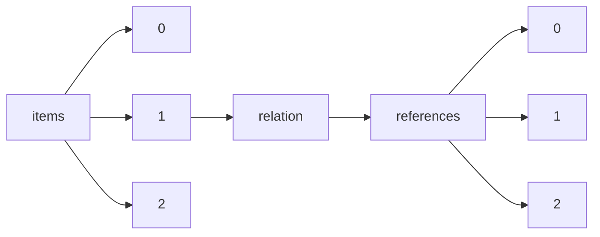

!!! warning "This document is not official Crossref documentation"
# Elements
PATH = items/array/relation/references/array(1)  
Occurs 42 851 times  
{ .annotate }

1. A route to an element, for example:  
   The route "items/array/relation/references/array" corresponds to navigating through the JSON indices as  
   ["items"][0]["relation"]["references"][0]  

## Asserted-by
See more information: [items/array/relation/references/array/asserted-by](asserted-by/index.md)  
Occurs 42 851 timess  
Unique values: 2  

| **Row** | **Value** `String` | **Count** `Int64` |
|--------:|----------------------:|---------------------:|
| **1**   | subject               | 32 550               |
| **2**   | object                | 10 301               |

## Id
See more information: [items/array/relation/references/array/id](id/index.md)  
Occurs 42 851 timess  
Unique values: > 999  

!!! note "Due to current limitations, only the first 1,000 unique values are counted."

| **Row** | **Value** `String`                           | **Count** `Int64` |
|--------:|------------------------------------------------:|---------------------:|
| **1**   |                                                 | 2 274                |
| **2**   | 10.6084/m9.figshare.c.4300919                   | 10                   |
| **3**   | http://identifiers.org/ncbi/insdc.sra:SRP187756 | 8                    |
| **4**   | https://researchdata.reading.ac.uk/256/         | 8                    |
| **5**   | https://www.ncdc.noaa.gov/paleo/study/14188     | 7                    |
| **6**   | 10.6080/K09G5JRZ                                | 7                    |
| **7**   | https://www.oncomine.com                        | 7                    |
| **8**   | 10.6080/K0862DC5                                | 6                    |
| **9**   | http://www.ebi.ac.uk/ena/data/view/PRJEB2888    | 6                    |
| **10**  | http://identifiers.org/metabolights:MTBLS528    | 5                    |
| ... | ... | ... |

## Id-type
See more information: [items/array/relation/references/array/id-type](id-type/index.md)  
Occurs 42 851 timess  
Unique values: 8  

| **Row** | **Value** `String` | **Count** `Int64` |
|--------:|----------------------:|---------------------:|
| **1**   | doi                   | 29 688               |
| **2**   | uri                   | 9 507                |
| **3**   | accession             | 3 633                |
| **4**   | arxiv                 | 17                   |
| **5**   | isbn                  | 2                    |
| **6**   | purl                  | 2                    |
| **7**   | pmid                  | 1                    |
| **8**   | other                 | 1                    |

