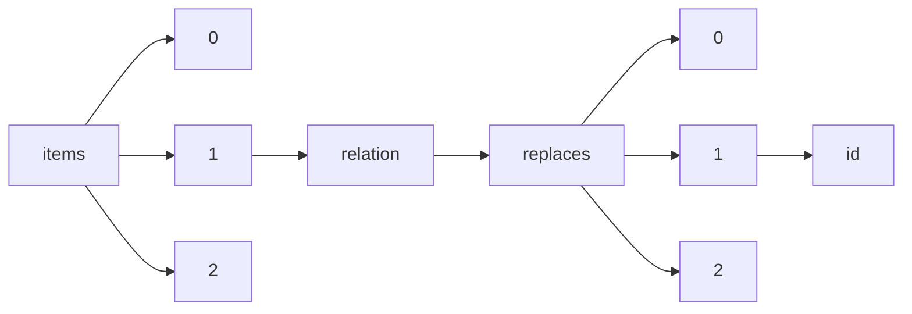

!!! warning "This document is not official Crossref documentation"
# Id
PATH = items/array/relation/replaces/array/id(1)  
Occurs 1 381 times  
Unique values: > 999  
{ .annotate }

1. A route to an element, for example:  
   The route "items/array/relation/replaces/array/id" corresponds to navigating through the JSON indices as  
   ["items"][0]["relation"]["replaces"][0]["id"]  

!!! note "Due to current limitations, only the first 1,000 unique values are counted."

| **Row** | **Value** `String`                               | **Count** `Int64` |
|--------:|----------------------------------------------------:|---------------------:|
| **1**   | 10.7287/peerj.preprints.352v2                       | 1                    |
| **2**   | 10.7287/peerj.preprints.1558v1                      | 1                    |
| **3**   | 10.7287/peerj.preprints.2236v1                      | 1                    |
| **4**   | 10.7287/peerj.preprints.3054v1                      | 1                    |
| **5**   | 10.7287/peerj.preprints.26507v1                     | 1                    |
| **6**   | 10.7287/peerj.preprints.27063v1                     | 1                    |
| **7**   | 10.7287/peerj.preprints.207v1                       | 1                    |
| **8**   | 10.7287/peerj.preprints.977v1                       | 1                    |
| **9**   | 10.7287/peerj.preprints.27663v1                     | 1                    |
| **10**  | 10.7287/peerj.preprints.2238v2                      | 1                    |
| **11**  | 10.7287/peerj.preprints.2083v1                      | 1                    |
| **12**  | 10.7287/peerj.preprints.27807v1                     | 1                    |
| **13**  | 10.7287/peerj.preprints.26963v1                     | 1                    |
| **14**  | 10.6028/NIST.IR.8282                                | 1                    |
| **15**  | 10.7287/peerj.preprints.3462v2                      | 1                    |
| **16**  | 10.7287/peerj.preprints.117v2                       | 1                    |
| **17**  | 10.7287/peerj.preprints.1596v1                      | 1                    |
| **18**  | 10.7287/peerj.preprints.3417v2                      | 1                    |
| **19**  | 10.7287/peerj.preprints.2044v3                      | 1                    |
| **20**  | 10.7287/peerj.preprints.3005v2                      | 1                    |
| **21**  | 10.7287/peerj.preprints.3090v1                      | 1                    |
| **22**  | 10.7287/peerj.preprints.3266v2                      | 1                    |
| **23**  | 10.6028/NIST.IR.8178                                | 1                    |
| **24**  | 10.7287/peerj.preprints.27314v1                     | 1                    |
| **25**  | 10.7287/peerj.preprints.2818v1                      | 1                    |
| **26**  | 10.7287/peerj.preprints.1968v4                      | 1                    |
| **27**  | 10.7287/peerj.preprints.1920v1                      | 1                    |
| **28**  | 10.7287/peerj.preprints.2484v1                      | 1                    |
| **29**  | 10.7287/peerj.preprints.3080v1                      | 1                    |
| **30**  | 10.7287/peerj.preprints.2278v3                      | 1                    |
| **31**  | 10.7287/peerj.preprints.2415v1                      | 1                    |
| **32**  | 10.7287/peerj.preprints.26931v1                     | 1                    |
| **33**  | 10.7287/peerj.preprints.138v1                       | 1                    |
| **34**  | 10.7287/peerj.preprints.2785v1                      | 1                    |
| **35**  | 10.7287/peerj.preprints.1721v1                      | 1                    |
| **36**  | 10.7287/peerj.preprints.27858v1                     | 1                    |
| **37**  | 10.7287/peerj.preprints.2882v3                      | 1                    |
| **38**  | 10.7287/peerj.preprints.1498v1                      | 1                    |
| **39**  | 10.7287/peerj.preprints.382v2                       | 1                    |
| **40**  | 10.7287/peerj.preprints.3128v2                      | 1                    |
| **41**  | 10.7287/peerj.preprints.3447v1                      | 1                    |
| **42**  | 10.7287/peerj.preprints.1462v2                      | 1                    |
| **43**  | 10.7287/peerj.preprints.1195v1                      | 1                    |
| **44**  | 10.7287/peerj.preprints.2068v1                      | 1                    |
| **45**  | 10.6028/NIST.HB.150-17; 10.6028/NIST.HB.150-17-2020 | 1                    |
| **46**  | 10.7287/peerj.preprints.26766v1                     | 1                    |
| **47**  | 10.7287/peerj.preprints.3153v1                      | 1                    |
| **48**  | 10.7287/peerj.preprints.651v1                       | 1                    |
| **49**  | 10.7287/peerj.preprints.1541v1                      | 1                    |
| **50**  | 10.7287/peerj.preprints.27383v1                     | 1                    |
| **51**  | 10.7287/peerj.preprints.1610v1                      | 1                    |
| **52**  | 10.7287/peerj.preprints.27441v2                     | 1                    |
| **53**  | 10.7287/peerj.preprints.2452v2                      | 1                    |
| **54**  | 10.7287/peerj.preprints.777v2                       | 1                    |
| **55**  | 10.7287/peerj.preprints.1049v2                      | 1                    |
| **56**  | 10.7287/peerj.preprints.2291v1                      | 1                    |
| **57**  | 10.7287/peerj.preprints.2935v1                      | 1                    |
| **58**  | 10.7287/peerj.preprints.27378v1                     | 1                    |
| **59**  | 10.7287/peerj.preprints.302v1                       | 1                    |
| **60**  | 10.7287/peerj.preprints.26587v1                     | 1                    |
| **61**  | 10.7287/peerj.preprints.3100v1                      | 1                    |
| **62**  | 10.7287/peerj.preprints.1103v1                      | 1                    |
| **63**  | 10.7287/peerj.preprints.1319v2                      | 1                    |
| **64**  | 10.7287/peerj.preprints.2419v2                      | 1                    |
| **65**  | 10.7287/peerj.preprints.27459v1                     | 1                    |
| **66**  | 10.7287/peerj.preprints.27130v1                     | 1                    |
| **67**  | 10.7287/peerj.preprints.1299v1                      | 1                    |
| **68**  | 10.7287/peerj.preprints.3260v1                      | 1                    |
| **69**  | 10.7287/peerj.preprints.462v1                       | 1                    |
| **70**  | 10.7287/peerj.preprints.303v1                       | 1                    |
| **71**  | 10.7287/peerj.preprints.27201v1                     | 1                    |
| **72**  | 10.7287/peerj.preprints.1749v1                      | 1                    |
| **73**  | 10.7287/peerj.preprints.2954v1                      | 1                    |
| **74**  | 10.7287/peerj.preprints.2998v1                      | 1                    |
| **75**  | 10.7287/peerj.preprints.27228v2                     | 1                    |
| **76**  | 10.7287/peerj.preprints.1998v2                      | 1                    |
| **77**  | 10.7287/peerj.preprints.254v1                       | 1                    |
| **78**  | 10.7287/peerj.preprints.1419v1                      | 1                    |
| **79**  | 10.7287/peerj.preprints.1406v2                      | 1                    |
| **80**  | 10.7287/peerj.preprints.1533v1                      | 1                    |
| **81**  | 10.7287/peerj.preprints.26782v1                     | 1                    |
| **82**  | 10.7287/peerj.preprints.432v1                       | 1                    |
| **83**  | 10.7287/peerj.preprints.463v1                       | 1                    |
| **84**  | 10.7287/peerj.preprints.1565v1                      | 1                    |
| **85**  | 10.7287/peerj.preprints.2225v3                      | 1                    |
| **86**  | 10.7287/peerj.preprints.1553v1                      | 1                    |
| **87**  | 10.7287/peerj.preprints.349v4                       | 1                    |
| **88**  | 10.7287/peerj.preprints.1196v1                      | 1                    |
| **89**  | 10.7287/peerj.preprints.26533v1                     | 1                    |
| **90**  | 10.7287/peerj.preprints.27256v1                     | 1                    |
| **91**  | 10.6028/NIST.IR.8118                                | 1                    |
| **92**  | 10.7287/peerj.preprints.27875v1                     | 1                    |
| **93**  | 10.7287/peerj.preprints.651v2                       | 1                    |
| **94**  | 10.7287/peerj.preprints.326v2                       | 1                    |
| **95**  | 10.7287/peerj.preprints.2643v1                      | 1                    |
| **96**  | 10.7287/peerj.preprints.2447v1                      | 1                    |
| **97**  | 10.7287/peerj.preprints.26969v1                     | 1                    |
| **98**  | 10.7287/peerj.preprints.1733v1                      | 1                    |
| **99**  | 10.7287/peerj.preprints.27709v1                     | 1                    |
| **100** | 10.7287/peerj.preprints.247v1                       | 1                    |
| **101** | 10.7287/peerj.preprints.3421v1                      | 1                    |
| **102** | 10.7287/peerj.preprints.1711v1                      | 1                    |
| **103** | 10.7287/peerj.preprints.1582v1                      | 1                    |
| **104** | 10.7287/peerj.preprints.3370v1                      | 1                    |
| **105** | 10.7287/peerj.preprints.156v2                       | 1                    |
| **106** | 10.7287/peerj.preprints.2077v1                      | 1                    |
| **107** | 10.7287/peerj.preprints.27739v2                     | 1                    |
| **108** | 10.7287/peerj.preprints.26473v1                     | 1                    |
| **109** | 10.7287/peerj.preprints.27096v2                     | 1                    |
| **110** | 10.7287/peerj.preprints.2139v2                      | 1                    |
| **111** | 10.7287/peerj.preprints.2377v1                      | 1                    |
| **112** | 10.7287/peerj.preprints.26880v1                     | 1                    |
| **113** | 10.7287/peerj.preprints.27183v1                     | 1                    |
| **114** | 10.7287/peerj.preprints.2380v1                      | 1                    |
| **115** | 10.7287/peerj.preprints.1576v1                      | 1                    |
| **116** | 10.7287/peerj.preprints.745v3                       | 1                    |
| **117** | 10.7287/peerj.preprints.335v1                       | 1                    |
| **118** | 10.7287/peerj.preprints.447v2                       | 1                    |
| **119** | 10.7287/peerj.preprints.2224v1                      | 1                    |
| **120** | 10.7287/peerj.preprints.2737v2                      | 1                    |
| **121** | 10.7287/peerj.preprints.1068v1                      | 1                    |
| **122** | 10.7287/peerj.preprints.2152v1                      | 1                    |
| **123** | 10.7287/peerj.preprints.2479v1                      | 1                    |
| **124** | 10.7287/peerj.preprints.2652v1                      | 1                    |
| **125** | 10.7287/peerj.preprints.310v1                       | 1                    |
| **126** | 10.7287/peerj.preprints.259v1                       | 1                    |
| **127** | 10.7287/peerj.preprints.27515v1                     | 1                    |
| **128** | 10.7287/peerj.preprints.1111v1                      | 1                    |
| **129** | 10.7287/peerj.preprints.127v1                       | 1                    |
| **130** | 10.7287/peerj.preprints.27352v2                     | 1                    |
| **131** | 10.7287/peerj.preprints.26443v1                     | 1                    |
| **132** | 10.7287/peerj.preprints.27651v9                     | 1                    |
| **133** | 10.7287/peerj.preprints.432v2                       | 1                    |
| **134** | 10.7287/peerj.preprints.219v1                       | 1                    |
| **135** | 10.7287/peerj.preprints.193v1                       | 1                    |
| **136** | 10.7287/peerj.preprints.240v2                       | 1                    |
| **137** | 10.7287/peerj.preprints.1300v1                      | 1                    |
| **138** | 10.7287/peerj.preprints.2563v1                      | 1                    |
| **139** | 10.7287/peerj.preprints.27067v1                     | 1                    |
| **140** | 10.7287/peerj.preprints.704v2                       | 1                    |
| **141** | 10.7287/peerj.preprints.27460v2                     | 1                    |
| **142** | 10.7287/peerj.preprints.91v2                        | 1                    |
| **143** | 10.7287/peerj.preprints.700v1                       | 1                    |
| **144** | 10.7287/peerj.preprints.224v1                       | 1                    |
| **145** | 10.7287/peerj.preprints.27353v2                     | 1                    |
| **146** | 10.7287/peerj.preprints.469v2                       | 1                    |
| **147** | 10.7287/peerj.preprints.57v3                        | 1                    |
| **148** | 10.7287/peerj.preprints.27228v1                     | 1                    |
| **149** | 10.7287/peerj.preprints.27876v2                     | 1                    |
| **150** | 10.7287/peerj.preprints.124v1                       | 1                    |
| **151** | 10.7287/peerj.preprints.27858v2                     | 1                    |
| **152** | 10.7287/peerj.preprints.2155v2                      | 1                    |
| **153** | 10.7287/peerj.preprints.3067v1                      | 1                    |
| **154** | 10.7287/peerj.preprints.26488v1                     | 1                    |
| **155** | 10.7287/peerj.preprints.480v1                       | 1                    |
| **156** | 10.7287/peerj.preprints.2961v1                      | 1                    |
| **157** | 10.7287/peerj.preprints.115v3                       | 1                    |
| **158** | 10.7287/peerj.preprints.2152v2                      | 1                    |
| **159** | 10.7287/peerj.preprints.1312v7                      | 1                    |
| **160** | 10.7287/peerj.preprints.2638v1                      | 1                    |
| **161** | 10.7287/peerj.preprints.1468v1                      | 1                    |
| **162** | 10.7287/peerj.preprints.464v2                       | 1                    |
| **163** | 10.7287/peerj.preprints.27187v1                     | 1                    |
| **164** | 10.7287/peerj.preprints.393v1                       | 1                    |
| **165** | 10.7287/peerj.preprints.43v1                        | 1                    |
| **166** | 10.7287/peerj.preprints.2225v1                      | 1                    |
| **167** | 10.7287/peerj.preprints.2127v1                      | 1                    |
| **168** | 10.7287/peerj.preprints.257v1                       | 1                    |
| **169** | 10.7287/peerj.preprints.2153v1                      | 1                    |
| **170** | 10.7287/peerj.preprints.2345v1                      | 1                    |
| **171** | 10.7287/peerj.preprints.26857v3                     | 1                    |
| **172** | 10.7287/peerj.preprints.854v1                       | 1                    |
| **173** | 10.7287/peerj.preprints.204v1                       | 1                    |
| **174** | 10.7287/peerj.preprints.27406v1                     | 1                    |
| **175** | 10.7287/peerj.preprints.2069v1                      | 1                    |
| **176** | 10.7287/peerj.preprints.672v1                       | 1                    |
| **177** | 10.7287/peerj.preprints.27v1                        | 1                    |
| **178** | 10.7287/peerj.preprints.27821v4                     | 1                    |
| **179** | 10.7287/peerj.preprints.26477v1                     | 1                    |
| **180** | 10.7287/peerj.preprints.1494v1                      | 1                    |
| **181** | 10.7287/peerj.preprints.1469v2                      | 1                    |
| **182** | 10.7287/peerj.preprints.2997v1                      | 1                    |
| **183** | 10.7287/peerj.preprints.1189v1                      | 1                    |
| **184** | 10.7287/peerj.preprints.1516v1                      | 1                    |
| **185** | 10.7287/peerj.preprints.26517v1                     | 1                    |
| **186** | 10.7287/peerj.preprints.3451v1                      | 1                    |
| **187** | 10.7287/peerj.preprints.2250v1                      | 1                    |
| **188** | 10.7287/peerj.preprints.1477v1                      | 1                    |
| **189** | 10.7287/peerj.preprints.2101v1                      | 1                    |
| **190** | 10.7287/peerj.preprints.811v1                       | 1                    |
| **191** | 10.7287/peerj.preprints.1437v1                      | 1                    |
| **192** | 10.7287/peerj.preprints.3523v1                      | 1                    |
| **193** | 10.7287/peerj.preprints.671v1                       | 1                    |
| **194** | 10.7287/peerj.preprints.2614v2                      | 1                    |
| **195** | 10.7287/peerj.preprints.3192v1                      | 1                    |
| **196** | 10.7287/peerj.preprints.126v2                       | 1                    |
| **197** | 10.7287/peerj.preprints.26484v1                     | 1                    |
| **198** | 10.7287/peerj.preprints.27v2                        | 1                    |
| **199** | 10.7287/peerj.preprints.1350v1                      | 1                    |
| **200** | 10.7287/peerj.preprints.27355v1                     | 1                    |
| **201** | 10.7287/peerj.preprints.934v1                       | 1                    |
| **202** | 10.7287/peerj.preprints.2108v1                      | 1                    |
| **203** | 10.7287/peerj.preprints.1025v1                      | 1                    |
| **204** | 10.7287/peerj.preprints.26447v1                     | 1                    |
| **205** | 10.7287/peerj.preprints.453v1                       | 1                    |
| **206** | 10.7287/peerj.preprints.470v1                       | 1                    |
| **207** | 10.7287/peerj.preprints.2345v3                      | 1                    |
| **208** | 10.7287/peerj.preprints.27244v1                     | 1                    |
| **209** | 10.7287/peerj.preprints.110v4                       | 1                    |
| **210** | 10.7287/peerj.preprints.596v3                       | 1                    |
| **211** | 10.7287/peerj.preprints.3266v3                      | 1                    |
| **212** | 10.7287/peerj.preprints.2086v3                      | 1                    |
| **213** | 10.7287/peerj.preprints.117v1                       | 1                    |
| **214** | 10.7287/peerj.preprints.26577v3                     | 1                    |
| **215** | 10.7287/peerj.preprints.26923v1                     | 1                    |
| **216** | 10.7287/peerj.preprints.26862v9                     | 1                    |
| **217** | 10.7287/peerj.preprints.2477v1                      | 1                    |
| **218** | 10.7287/peerj.preprints.553v1                       | 1                    |
| **219** | 10.7287/peerj.preprints.297v2                       | 1                    |
| **220** | 10.7287/peerj.preprints.3005v1                      | 1                    |
| **221** | 10.7287/peerj.preprints.2367v1                      | 1                    |
| **222** | 10.7287/peerj.preprints.1298v1                      | 1                    |
| **223** | 10.7287/peerj.preprints.327v1                       | 1                    |
| **224** | 10.7287/peerj.preprints.2727v2                      | 1                    |
| **225** | 10.7287/peerj.preprints.2761v1                      | 1                    |
| **226** | 10.7287/peerj.preprints.621v1                       | 1                    |
| **227** | 10.7287/peerj.preprints.1000v1                      | 1                    |
| **228** | 10.7287/peerj.preprints.26620v1                     | 1                    |
| **229** | 10.7287/peerj.preprints.1579v1                      | 1                    |
| **230** | 10.7287/peerj.preprints.2446v1                      | 1                    |
| **231** | 10.7287/peerj.preprints.2827v1                      | 1                    |
| **232** | 10.7287/peerj.preprints.2744v1                      | 1                    |
| **233** | 10.7287/peerj.preprints.1744v1                      | 1                    |
| **234** | 10.7287/peerj.preprints.27770v1                     | 1                    |
| **235** | 10.7287/peerj.preprints.27651v3                     | 1                    |
| **236** | 10.7287/peerj.preprints.925v1                       | 1                    |
| **237** | 10.7287/peerj.preprints.2245v1                      | 1                    |
| **238** | 10.7287/peerj.preprints.27039v1                     | 1                    |
| **239** | 10.7287/peerj.preprints.2401v1                      | 1                    |
| **240** | 10.7287/peerj.preprints.2086v2                      | 1                    |
| **241** | 10.7287/peerj.preprints.2237v3                      | 1                    |
| **242** | 10.7287/peerj.preprints.181v2                       | 1                    |
| **243** | 10.7287/peerj.preprints.27249v1                     | 1                    |
| **244** | 10.7287/peerj.preprints.26950v1                     | 1                    |
| **245** | 10.7287/peerj.preprints.3114v1                      | 1                    |
| **246** | 10.7287/peerj.preprints.3186v1                      | 1                    |
| **247** | 10.7287/peerj.preprints.26667v1                     | 1                    |
| **248** | 10.7287/peerj.preprints.157v1                       | 1                    |
| **249** | 10.7287/peerj.preprints.2454v1                      | 1                    |
| **250** | 10.7287/peerj.preprints.2711v2                      | 1                    |
| **251** | 10.7287/peerj.preprints.1479v3                      | 1                    |
| **252** | 10.7287/peerj.preprints.27962v1                     | 1                    |
| **253** | 10.7287/peerj.preprints.2237v1                      | 1                    |
| **254** | 10.7287/peerj.preprints.821v1                       | 1                    |
| **255** | 10.7287/peerj.preprints.3139v4                      | 1                    |
| **256** | 10.7287/peerj.preprints.26454v3                     | 1                    |
| **257** | 10.7287/peerj.preprints.966v1                       | 1                    |
| **258** | 10.7287/peerj.preprints.27353v1                     | 1                    |
| **259** | 10.7287/peerj.preprints.437v2                       | 1                    |
| **260** | 10.7287/peerj.preprints.1119v1                      | 1                    |
| **261** | 10.7287/peerj.preprints.26630v1                     | 1                    |
| **262** | 10.7287/peerj.preprints.27811v3                     | 1                    |
| **263** | 10.7287/peerj.preprints.2237v4                      | 1                    |
| **264** | 10.7287/peerj.preprints.2007v1                      | 1                    |
| **265** | 10.7287/peerj.preprints.89v1                        | 1                    |
| **266** | 10.7287/peerj.preprints.3496v2                      | 1                    |
| **267** | 10.7287/peerj.preprints.2910v1                      | 1                    |
| **268** | 10.7287/peerj.preprints.146v3                       | 1                    |
| **269** | 10.7287/peerj.preprints.2487v1                      | 1                    |
| **270** | 10.7287/peerj.preprints.3027v1                      | 1                    |
| **271** | 10.7287/peerj.preprints.1939v1                      | 1                    |
| **272** | 10.7287/peerj.preprints.27574v1                     | 1                    |
| **273** | 10.7287/peerj.preprints.30v1                        | 1                    |
| **274** | 10.7287/peerj.preprints.541v1                       | 1                    |
| **275** | 10.7287/peerj.preprints.2320v5                      | 1                    |
| **276** | 10.7287/peerj.preprints.680v1                       | 1                    |
| **277** | 10.7287/peerj.preprints.534v1                       | 1                    |
| **278** | 10.7287/peerj.preprints.27235v1                     | 1                    |
| **279** | 10.7287/peerj.preprints.290v1                       | 1                    |
| **280** | 10.7287/peerj.preprints.27741v1                     | 1                    |
| **281** | 10.7287/peerj.preprints.27300v1                     | 1                    |
| **282** | 10.7287/peerj.preprints.452v2                       | 1                    |
| **283** | 10.7287/peerj.preprints.1143v1                      | 1                    |
| **284** | 10.7287/peerj.preprints.1595v1                      | 1                    |
| **285** | 10.7287/peerj.preprints.2827v3                      | 1                    |
| **286** | 10.7287/peerj.preprints.2044v1                      | 1                    |
| **287** | 10.7287/peerj.preprints.3451v2                      | 1                    |
| **288** | 10.7287/peerj.preprints.27665v1                     | 1                    |
| **289** | 10.7287/peerj.preprints.27244v3                     | 1                    |
| **290** | 10.7287/peerj.preprints.941v1                       | 1                    |
| **291** | 10.7287/peerj.preprints.2762v1                      | 1                    |
| **292** | 10.7287/peerj.preprints.123v1                       | 1                    |
| **293** | 10.7287/peerj.preprints.1558v2                      | 1                    |
| **294** | 10.7287/peerj.preprints.91v3                        | 1                    |
| **295** | 10.7287/peerj.preprints.1450v3                      | 1                    |
| **296** | 10.7287/peerj.preprints.26811v1                     | 1                    |
| **297** | 10.7287/peerj.preprints.1323v1                      | 1                    |
| **298** | 10.7287/peerj.preprints.1137v1                      | 1                    |
| **299** | 10.7287/peerj.preprints.307v1                       | 1                    |
| **300** | 10.7287/peerj.preprints.27215v1                     | 1                    |
| **301** | 10.7287/peerj.preprints.1312v4                      | 1                    |
| **302** | 10.7287/peerj.preprints.27629v1                     | 1                    |
| **303** | 10.7287/peerj.preprints.472v1                       | 1                    |
| **304** | 10.7287/peerj.preprints.27127v1                     | 1                    |
| **305** | 10.7287/peerj.preprints.2102v2                      | 1                    |
| **306** | 10.7287/peerj.preprints.27801v1                     | 1                    |
| **307** | 10.7287/peerj.preprints.80v1                        | 1                    |
| **308** | 10.7287/peerj.preprints.27509v1                     | 1                    |
| **309** | 10.7287/peerj.preprints.1360v1                      | 1                    |
| **310** | 10.7287/peerj.preprints.696v1                       | 1                    |
| **311** | 10.7287/peerj.preprints.380v1                       | 1                    |
| **312** | 10.7287/peerj.preprints.1176v1                      | 1                    |
| **313** | 10.7287/peerj.preprints.3016v1                      | 1                    |
| **314** | 10.7287/peerj.preprints.26992v1                     | 1                    |
| **315** | 10.7287/peerj.preprints.58v1                        | 1                    |
| **316** | 10.7287/peerj.preprints.1470v1                      | 1                    |
| **317** | 10.7287/peerj.preprints.3400v3                      | 1                    |
| **318** | 10.7287/peerj.preprints.834v1                       | 1                    |
| **319** | 10.7287/peerj.preprints.1217v1                      | 1                    |
| **320** | 10.7287/peerj.preprints.3010v1                      | 1                    |
| **321** | 10.7287/peerj.preprints.3097v1                      | 1                    |
| **322** | 10.7287/peerj.preprints.48v1                        | 1                    |
| **323** | 10.7287/peerj.preprints.1594v3                      | 1                    |
| **324** | 10.7287/peerj.preprints.552v1                       | 1                    |
| **325** | 10.7287/peerj.preprints.906v1                       | 1                    |
| **326** | 10.7287/peerj.preprints.2513v1                      | 1                    |
| **327** | 10.7287/peerj.preprints.1369v2                      | 1                    |
| **328** | 10.7287/peerj.preprints.925v2                       | 1                    |
| **329** | 10.7287/peerj.preprints.1465v1                      | 1                    |
| **330** | 10.7287/peerj.preprints.27658v1                     | 1                    |
| **331** | 10.7287/peerj.preprints.399v1                       | 1                    |
| **332** | 10.7287/peerj.preprints.1297v1                      | 1                    |
| **333** | 10.7287/peerj.preprints.349v5                       | 1                    |
| **334** | 10.7287/peerj.preprints.1950v2                      | 1                    |
| **335** | 10.7287/peerj.preprints.3031v1                      | 1                    |
| **336** | 10.7287/peerj.preprints.2830v1                      | 1                    |
| **337** | 10.7287/peerj.preprints.26496v1                     | 1                    |
| **338** | 10.7287/peerj.preprints.2232v1                      | 1                    |
| **339** | 10.6028/NIST.SP.800-172-draft                       | 1                    |
| **340** | 10.7287/peerj.preprints.1406v5                      | 1                    |
| **341** | 10.7287/peerj.preprints.3400v2                      | 1                    |
| **342** | 10.7287/peerj.preprints.27313v1                     | 1                    |
| **343** | 10.7287/peerj.preprints.2155v1                      | 1                    |
| **344** | 10.7287/peerj.preprints.2464v2                      | 1                    |
| **345** | 10.7287/peerj.preprints.1568v6                      | 1                    |
| **346** | 10.7287/peerj.preprints.2711v1                      | 1                    |
| **347** | 10.7287/peerj.preprints.27662v1                     | 1                    |
| **348** | 10.7287/peerj.preprints.2806v1                      | 1                    |
| **349** | 10.7287/peerj.preprints.2827v2                      | 1                    |
| **350** | 10.7287/peerj.preprints.1469v1                      | 1                    |
| **351** | 10.7287/peerj.preprints.2308v1                      | 1                    |
| **352** | 10.7287/peerj.preprints.78v1                        | 1                    |
| **353** | 10.7287/peerj.preprints.3183v1                      | 1                    |
| **354** | 10.7287/peerj.preprints.22v1                        | 1                    |
| **355** | 10.7287/peerj.preprints.3412v1                      | 1                    |
| **356** | 10.7287/peerj.preprints.897v1                       | 1                    |
| **357** | 10.7287/peerj.preprints.3167v1                      | 1                    |
| **358** | 10.7287/peerj.preprints.27988v1                     | 1                    |
| **359** | 10.6028/NIST.AMS.300-8; 10.6028/NIST.AMS.300-8r1    | 1                    |
| **360** | 10.7287/peerj.preprints.1891v1                      | 1                    |
| **361** | 10.7287/peerj.preprints.2763v1                      | 1                    |
| **362** | 10.7287/peerj.preprints.27879v1                     | 1                    |
| **363** | 10.7287/peerj.preprints.411v1                       | 1                    |
| **364** | 10.7287/peerj.preprints.2268v1                      | 1                    |
| **365** | 10.7287/peerj.preprints.27519v1                     | 1                    |
| **366** | 10.7287/peerj.preprints.27797v1                     | 1                    |
| **367** | 10.7287/peerj.preprints.27165v1                     | 1                    |
| **368** | 10.7287/peerj.preprints.3194v1                      | 1                    |
| **369** | 10.7287/peerj.preprints.110v5                       | 1                    |
| **370** | 10.7287/peerj.preprints.2265v1                      | 1                    |
| **371** | 10.7287/peerj.preprints.1992v1                      | 1                    |
| **372** | 10.7287/peerj.preprints.2727v1                      | 1                    |
| **373** | 10.7287/peerj.preprints.447v3                       | 1                    |
| **374** | 10.7287/peerj.preprints.89v2                        | 1                    |
| **375** | 10.7287/peerj.preprints.850v1                       | 1                    |
| **376** | 10.7287/peerj.preprints.1968v3                      | 1                    |
| **377** | 10.7287/peerj.preprints.1520v1                      | 1                    |
| **378** | 10.7287/peerj.preprints.26885v1                     | 1                    |
| **379** | 10.7287/peerj.preprints.2330v1                      | 1                    |
| **380** | 10.7287/peerj.preprints.861v1                       | 1                    |
| **381** | 10.7287/peerj.preprints.29v1                        | 1                    |
| **382** | 10.7287/peerj.preprints.818v3                       | 1                    |
| **383** | 10.7287/peerj.preprints.181v3                       | 1                    |
| **384** | 10.7287/peerj.preprints.1406v1                      | 1                    |
| **385** | 10.7287/peerj.preprints.537v1                       | 1                    |
| **386** | 10.7287/peerj.preprints.649v1                       | 1                    |
| **387** | 10.7287/peerj.preprints.2320v3                      | 1                    |
| **388** | 10.7287/peerj.preprints.26734v1                     | 1                    |
| **389** | 10.7287/peerj.preprints.2248v1                      | 1                    |
| **390** | 10.7287/peerj.preprints.1602v1                      | 1                    |
| **391** | 10.7287/peerj.preprints.1049v5                      | 1                    |
| **392** | 10.7287/peerj.preprints.2682v2                      | 1                    |
| **393** | 10.7287/peerj.preprints.1450v2                      | 1                    |
| **394** | 10.7287/peerj.preprints.3282v1                      | 1                    |
| **395** | 10.7287/peerj.preprints.2211v1                      | 1                    |
| **396** | 10.7287/peerj.preprints.27354v1                     | 1                    |
| **397** | 10.7287/peerj.preprints.2859v1                      | 1                    |
| **398** | 10.7287/peerj.preprints.2496v1                      | 1                    |
| **399** | 10.7287/peerj.preprints.1968v1                      | 1                    |
| **400** | 10.7287/peerj.preprints.3158v1                      | 1                    |
| **401** | 10.7287/peerj.preprints.3113v1                      | 1                    |
| **402** | 10.7287/peerj.preprints.368v1                       | 1                    |
| **403** | 10.7287/peerj.preprints.27317v1                     | 1                    |
| **404** | 10.7287/peerj.preprints.27022v1                     | 1                    |
| **405** | 10.7287/peerj.preprints.3214v1                      | 1                    |
| **406** | 10.7287/peerj.preprints.1796v1                      | 1                    |
| **407** | 10.7287/peerj.preprints.1407v2                      | 1                    |
| **408** | 10.7287/peerj.preprints.27922v2                     | 1                    |
| **409** | 10.7287/peerj.preprints.3208v1                      | 1                    |
| **410** | 10.7287/peerj.preprints.27780v1                     | 1                    |
| **411** | 10.7287/peerj.preprints.26889v2                     | 1                    |
| **412** | 10.7287/peerj.preprints.1877v1                      | 1                    |
| **413** | 10.7287/peerj.preprints.1619v1                      | 1                    |
| **414** | 10.7287/peerj.preprints.2098v1                      | 1                    |
| **415** | 10.7287/peerj.preprints.2336v2                      | 1                    |
| **416** | 10.7287/peerj.preprints.904v1                       | 1                    |
| **417** | 10.7287/peerj.preprints.1233v1                      | 1                    |
| **418** | 10.7287/peerj.preprints.1642v1                      | 1                    |
| **419** | 10.7287/peerj.preprints.1148v1                      | 1                    |
| **420** | 10.7287/peerj.preprints.872v1                       | 1                    |
| **421** | 10.7287/peerj.preprints.38v1                        | 1                    |
| **422** | 10.7287/peerj.preprints.117v3                       | 1                    |
| **423** | 10.7287/peerj.preprints.1541v2                      | 1                    |
| **424** | 10.7287/peerj.preprints.3168v1                      | 1                    |
| **425** | 10.7287/peerj.preprints.26754v1                     | 1                    |
| **426** | 10.7287/peerj.preprints.27491v1                     | 1                    |
| **427** | 10.7287/peerj.preprints.580v2                       | 1                    |
| **428** | 10.7287/peerj.preprints.647v1                       | 1                    |
| **429** | 10.7287/peerj.preprints.1443v1                      | 1                    |
| **430** | 10.7287/peerj.preprints.26661v2                     | 1                    |
| **431** | 10.7287/peerj.preprints.1920v2                      | 1                    |
| **432** | 10.7287/peerj.preprints.27249v2                     | 1                    |
| **433** | 10.7287/peerj.preprints.3269v1                      | 1                    |
| **434** | 10.7287/peerj.preprints.27998v1                     | 1                    |
| **435** | 10.7287/peerj.preprints.26v1                        | 1                    |
| **436** | 10.7287/peerj.preprints.3160v1                      | 1                    |
| **437** | 10.7287/peerj.preprints.358v2                       | 1                    |
| **438** | 10.7287/peerj.preprints.2817v1                      | 1                    |
| **439** | 10.7287/peerj.preprints.26862v2                     | 1                    |
| **440** | 10.7287/peerj.preprints.27283v1                     | 1                    |
| **441** | 10.7287/peerj.preprints.413v1                       | 1                    |
| **442** | 10.7287/peerj.preprints.2880v1                      | 1                    |
| **443** | 10.7287/peerj.preprints.1034v1                      | 1                    |
| **444** | 10.35935/11.3622                                    | 1                    |
| **445** | 10.7287/peerj.preprints.27460v1                     | 1                    |
| **446** | 10.7287/peerj.preprints.26786v1                     | 1                    |
| **447** | 10.7287/peerj.preprints.399v2                       | 1                    |
| **448** | 10.7287/peerj.preprints.2169v3                      | 1                    |
| **449** | 10.7287/peerj.preprints.27885v2                     | 1                    |
| **450** | 10.7287/peerj.preprints.3273v1                      | 1                    |
| **451** | 10.7287/peerj.preprints.8v1                         | 1                    |
| **452** | 10.7287/peerj.preprints.1637v1                      | 1                    |
| **453** | 10.7287/peerj.preprints.27164v2                     | 1                    |
| **454** | 10.7287/peerj.preprints.27244v4                     | 1                    |
| **455** | 10.7287/peerj.preprints.3037v1                      | 1                    |
| **456** | 10.7287/peerj.preprints.27684v2                     | 1                    |
| **457** | 10.7287/peerj.preprints.27363v1                     | 1                    |
| **458** | 10.7287/peerj.preprints.110v6                       | 1                    |
| **459** | 10.7287/peerj.preprints.27151v1                     | 1                    |
| **460** | 10.7287/peerj.preprints.542v1                       | 1                    |
| **461** | 10.7287/peerj.preprints.1049v4                      | 1                    |
| **462** | 10.7287/peerj.preprints.26457v1                     | 1                    |
| **463** | 10.7287/peerj.preprints.2147v1                      | 1                    |
| **464** | 10.7287/peerj.preprints.3159v1                      | 1                    |
| **465** | 10.7287/peerj.preprints.1548v2                      | 1                    |
| **466** | 10.7287/peerj.preprints.27519v2                     | 1                    |
| **467** | 10.7287/peerj.preprints.27651v7                     | 1                    |
| **468** | 10.7287/peerj.preprints.2611v1                      | 1                    |
| **469** | 10.7287/peerj.preprints.1718v1                      | 1                    |
| **470** | 10.7287/peerj.preprints.27471v1                     | 1                    |
| **471** | 10.7287/peerj.preprints.2656v1                      | 1                    |
| **472** | 10.7287/peerj.preprints.1312v3                      | 1                    |
| **473** | 10.7287/peerj.preprints.27200v1                     | 1                    |
| **474** | 10.7287/peerj.preprints.2047v1                      | 1                    |
| **475** | 10.7287/peerj.preprints.27349v1                     | 1                    |
| **476** | 10.7287/peerj.preprints.26585v1                     | 1                    |
| **477** | 10.7287/peerj.preprints.282v1                       | 1                    |
| **478** | 10.7287/peerj.preprints.27811v2                     | 1                    |
| **479** | 10.7287/peerj.preprints.2320v1                      | 1                    |
| **480** | 10.7287/peerj.preprints.537v2                       | 1                    |
| **481** | 10.7287/peerj.preprints.2759v1                      | 1                    |
| **482** | 10.7287/peerj.preprints.1451v1                      | 1                    |
| **483** | 10.7287/peerj.preprints.26804v1                     | 1                    |
| **484** | 10.7287/peerj.preprints.222v1                       | 1                    |
| **485** | 10.7287/peerj.preprints.27651v8                     | 1                    |
| **486** | 10.7287/peerj.preprints.2871v1                      | 1                    |
| **487** | 10.7287/peerj.preprints.1839v1                      | 1                    |
| **488** | 10.7287/peerj.preprints.27465v1                     | 1                    |
| **489** | 10.7287/peerj.preprints.1260v1                      | 1                    |
| **490** | 10.7287/peerj.preprints.3191v1                      | 1                    |
| **491** | 10.7287/peerj.preprints.2883v1                      | 1                    |
| **492** | 10.7287/peerj.preprints.26691v1                     | 1                    |
| **493** | 10.7287/peerj.preprints.27011v1                     | 1                    |
| **494** | 10.7287/peerj.preprints.969v1                       | 1                    |
| **495** | 10.7287/peerj.preprints.1307v1                      | 1                    |
| **496** | 10.7287/peerj.preprints.732v1                       | 1                    |
| **497** | 10.7287/peerj.preprints.1524v1                      | 1                    |
| **498** | 10.7287/peerj.preprints.27458v1                     | 1                    |
| **499** | 10.7287/peerj.preprints.1989v1                      | 1                    |
| **500** | 10.7287/peerj.preprints.576v1                       | 1                    |
| **501** | 10.7287/peerj.preprints.540v2                       | 1                    |
| **502** | 10.7287/peerj.preprints.2258v2                      | 1                    |
| **503** | 10.7287/peerj.preprints.1069v1                      | 1                    |
| **504** | 10.6028/NIST.IR.8115r1                              | 1                    |
| **505** | 10.7287/peerj.preprints.540v1                       | 1                    |
| **506** | 10.7287/peerj.preprints.886v1                       | 1                    |
| **507** | 10.7287/peerj.preprints.920v1                       | 1                    |
| **508** | 10.7287/peerj.preprints.2169v2                      | 1                    |
| **509** | 10.7287/peerj.preprints.999v1                       | 1                    |
| **510** | 10.7287/peerj.preprints.1674v1                      | 1                    |
| **511** | 10.7287/peerj.preprints.2840v3                      | 1                    |
| **512** | 10.7287/peerj.preprints.27944v1                     | 1                    |
| **513** | 10.7287/peerj.preprints.3482v3                      | 1                    |
| **514** | 10.7287/peerj.preprints.336v1                       | 1                    |
| **515** | 10.7287/peerj.preprints.3150v2                      | 1                    |
| **516** | 10.7287/peerj.preprints.3267v1                      | 1                    |
| **517** | 10.7287/peerj.preprints.2235v1                      | 1                    |
| **518** | 10.7287/peerj.preprints.1400v2                      | 1                    |
| **519** | 10.7287/peerj.preprints.2203v1                      | 1                    |
| **520** | 10.7287/peerj.preprints.1138v1                      | 1                    |
| **521** | 10.7287/peerj.preprints.26719v1                     | 1                    |
| **522** | 10.7287/peerj.preprints.27507v2                     | 1                    |
| **523** | 10.7287/peerj.preprints.1568v12                     | 1                    |
| **524** | 10.7287/peerj.preprints.349v1                       | 1                    |
| **525** | 10.7287/peerj.preprints.1266v3                      | 1                    |
| **526** | 10.7287/peerj.preprints.546v1                       | 1                    |
| **527** | 10.7287/peerj.preprints.1741v1                      | 1                    |
| **528** | 10.7287/peerj.preprints.2241v1                      | 1                    |
| **529** | 10.7287/peerj.preprints.2564v1                      | 1                    |
| **530** | 10.7287/peerj.preprints.193v2                       | 1                    |
| **531** | 10.7287/peerj.preprints.583v1                       | 1                    |
| **532** | 10.7287/peerj.preprints.27133v1                     | 1                    |
| **533** | 10.7287/peerj.preprints.90v1                        | 1                    |
| **534** | 10.7287/peerj.preprints.977v2                       | 1                    |
| **535** | 10.7287/peerj.preprints.3034v1                      | 1                    |
| **536** | 10.7287/peerj.preprints.594v1                       | 1                    |
| **537** | 10.7287/peerj.preprints.155v1                       | 1                    |
| **538** | 10.7287/peerj.preprints.26931v2                     | 1                    |
| **539** | 10.7287/peerj.preprints.27878v1                     | 1                    |
| **540** | 10.7287/peerj.preprints.26462v1                     | 1                    |
| **541** | 10.7287/peerj.preprints.1254v1                      | 1                    |
| **542** | 10.7287/peerj.preprints.1228v1                      | 1                    |
| **543** | 10.7287/peerj.preprints.112v1                       | 1                    |
| **544** | 10.7287/peerj.preprints.1299v2                      | 1                    |
| **545** | 10.7287/peerj.preprints.26577v2                     | 1                    |
| **546** | 10.7287/peerj.preprints.3029v1                      | 1                    |
| **547** | 10.7287/peerj.preprints.872v2                       | 1                    |
| **548** | 10.7287/peerj.preprints.2238v1                      | 1                    |
| **549** | 10.7287/peerj.preprints.688v1                       | 1                    |
| **550** | 10.7287/peerj.preprints.1403v1                      | 1                    |
| **551** | 10.7287/peerj.preprints.27584v1                     | 1                    |
| **552** | 10.7287/peerj.preprints.26907v1                     | 1                    |
| **553** | 10.7287/peerj.preprints.1163v1                      | 1                    |
| **554** | 10.7287/peerj.preprints.67v1                        | 1                    |
| **555** | 10.7287/peerj.preprints.400v2                       | 1                    |
| **556** | 10.7287/peerj.preprints.983v1                       | 1                    |
| **557** | 10.7287/peerj.preprints.2857v1                      | 1                    |
| **558** | 10.7287/peerj.preprints.2222v1                      | 1                    |
| **559** | 10.7287/peerj.preprints.1582v2                      | 1                    |
| **560** | 10.7287/peerj.preprints.3334v1                      | 1                    |
| **561** | 10.7287/peerj.preprints.2882v1                      | 1                    |
| **562** | 10.7287/peerj.preprints.222v2                       | 1                    |
| **563** | 10.7287/peerj.preprints.207v2                       | 1                    |
| **564** | 10.7287/peerj.preprints.588v1                       | 1                    |
| **565** | 10.7287/peerj.preprints.2376v1                      | 1                    |
| **566** | 10.7287/peerj.preprints.382v1                       | 1                    |
| **567** | 10.7287/peerj.preprints.2139v1                      | 1                    |
| **568** | 10.7287/peerj.preprints.632v3                       | 1                    |
| **569** | 10.7287/peerj.preprints.3269v2                      | 1                    |
| **570** | 10.7287/peerj.preprints.26941v1                     | 1                    |
| **571** | 10.7287/peerj.preprints.1554v1                      | 1                    |
| **572** | 10.7287/peerj.preprints.365v1                       | 1                    |
| **573** | 10.7287/peerj.preprints.57v1                        | 1                    |
| **574** | 10.7287/peerj.preprints.2694v1                      | 1                    |
| **575** | 10.7287/peerj.preprints.2103v2                      | 1                    |
| **576** | 10.7287/peerj.preprints.1860v1                      | 1                    |
| **577** | 10.7287/peerj.preprints.3442v1                      | 1                    |
| **578** | 10.7287/peerj.preprints.1568v4                      | 1                    |
| **579** | 10.7287/peerj.preprints.2882v2                      | 1                    |
| **580** | 10.7287/peerj.preprints.1916v1                      | 1                    |
| **581** | 10.7287/peerj.preprints.3264v1                      | 1                    |
| **582** | 10.7287/peerj.preprints.552v4                       | 1                    |
| **583** | 10.7287/peerj.preprints.113v1                       | 1                    |
| **584** | 10.7287/peerj.preprints.2306v2                      | 1                    |
| **585** | 10.7287/peerj.preprints.2688v2                      | 1                    |
| **586** | 10.7287/peerj.preprints.26931v3                     | 1                    |
| **587** | 10.7287/peerj.preprints.2133v1                      | 1                    |
| **588** | 10.7287/peerj.preprints.27530v1                     | 1                    |
| **589** | 10.7287/peerj.preprints.27665v2                     | 1                    |
| **590** | 10.7287/peerj.preprints.741v1                       | 1                    |
| **591** | 10.6028/NIST.IR.8118r1                              | 1                    |
| **592** | 10.7287/peerj.preprints.1400v1                      | 1                    |
| **593** | 10.7287/peerj.preprints.27847v1                     | 1                    |
| **594** | 10.7287/peerj.preprints.2081v2                      | 1                    |
| **595** | 10.7287/peerj.preprints.1817v1                      | 1                    |
| **596** | 10.7287/peerj.preprints.1874v1                      | 1                    |
| **597** | 10.7287/peerj.preprints.1097v1                      | 1                    |
| **598** | 10.7287/peerj.preprints.60v1                        | 1                    |
| **599** | 10.7287/peerj.preprints.27591v3                     | 1                    |
| **600** | 10.7287/peerj.preprints.443v1                       | 1                    |
| **601** | 10.7287/peerj.preprints.592v1                       | 1                    |
| **602** | 10.7287/peerj.preprints.745v4                       | 1                    |
| **603** | 10.7287/peerj.preprints.1802v1                      | 1                    |
| **604** | 10.7287/peerj.preprints.26672v1                     | 1                    |
| **605** | 10.7287/peerj.preprints.34v1                        | 1                    |
| **606** | 10.7287/peerj.preprints.632v1                       | 1                    |
| **607** | 10.7287/peerj.preprints.27437v1                     | 1                    |
| **608** | 10.7287/peerj.preprints.2051v1                      | 1                    |
| **609** | 10.7287/peerj.preprints.3456v3                      | 1                    |
| **610** | 10.7287/peerj.preprints.3227v1                      | 1                    |
| **611** | 10.7287/peerj.preprints.144v1                       | 1                    |
| **612** | 10.7287/peerj.preprints.2044v2                      | 1                    |
| **613** | 10.7287/peerj.preprints.885v1                       | 1                    |
| **614** | 10.7287/peerj.preprints.596v2                       | 1                    |
| **615** | 10.7287/peerj.preprints.2452v3                      | 1                    |
| **616** | 10.7287/peerj.preprints.1346v2                      | 1                    |
| **617** | 10.7287/peerj.preprints.26913v1                     | 1                    |
| **618** | 10.7287/peerj.preprints.280v1                       | 1                    |
| **619** | 10.7287/peerj.preprints.213v1                       | 1                    |
| **620** | 10.7287/peerj.preprints.2223v1                      | 1                    |
| **621** | 10.7287/peerj.preprints.27717v1                     | 1                    |
| **622** | 10.7287/peerj.preprints.2759v2                      | 1                    |
| **623** | 10.7287/peerj.preprints.1236v1                      | 1                    |
| **624** | 10.7287/peerj.preprints.629v1                       | 1                    |
| **625** | 10.7287/peerj.preprints.765v1                       | 1                    |
| **626** | 10.7287/peerj.preprints.27090v1                     | 1                    |
| **627** | 10.7287/peerj.preprints.240v1                       | 1                    |
| **628** | 10.7287/peerj.preprints.27644v1                     | 1                    |
| **629** | 10.7287/peerj.preprints.1105v1                      | 1                    |
| **630** | 10.7287/peerj.preprints.1907v1                      | 1                    |
| **631** | 10.7287/peerj.preprints.1246v1                      | 1                    |
| **632** | 10.7287/peerj.preprints.400v1                       | 1                    |
| **633** | 10.7287/peerj.preprints.680v2                       | 1                    |
| **634** | 10.7287/peerj.preprints.365v3                       | 1                    |
| **635** | 10.7287/peerj.preprints.3139v3                      | 1                    |
| **636** | 10.7287/peerj.preprints.27621v1                     | 1                    |
| **637** | 10.7287/peerj.preprints.704v4                       | 1                    |
| **638** | 10.7287/peerj.preprints.1587v1                      | 1                    |
| **639** | 10.7287/peerj.preprints.655v2                       | 1                    |
| **640** | 10.7287/peerj.preprints.506v1                       | 1                    |
| **641** | 10.7287/peerj.preprints.27358v2                     | 1                    |
| **642** | 10.7287/peerj.preprints.1655v1                      | 1                    |
| **643** | 10.7287/peerj.preprints.996v1                       | 1                    |
| **644** | 10.7287/peerj.preprints.2058v1                      | 1                    |
| **645** | 10.7287/peerj.preprints.3439v5                      | 1                    |
| **646** | 10.7287/peerj.preprints.3200v1                      | 1                    |
| **647** | 10.7287/peerj.preprints.2238v3                      | 1                    |
| **648** | 10.7287/peerj.preprints.2452v1                      | 1                    |
| **649** | 10.7287/peerj.preprints.704v1                       | 1                    |
| **650** | 10.7287/peerj.preprints.2519v1                      | 1                    |
| **651** | 10.7287/peerj.preprints.2563v2                      | 1                    |
| **652** | 10.7287/peerj.preprints.28004v2                     | 1                    |
| **653** | 10.7287/peerj.preprints.1472v1                      | 1                    |
| **654** | 10.7287/peerj.preprints.2184v1                      | 1                    |
| **655** | 10.7287/peerj.preprints.818v1                       | 1                    |
| **656** | 10.7287/peerj.preprints.2168v1                      | 1                    |
| **657** | 10.7287/peerj.preprints.26585v2                     | 1                    |
| **658** | 10.7287/peerj.preprints.26964v1                     | 1                    |
| **659** | 10.7287/peerj.preprints.2561v1                      | 1                    |
| **660** | 10.7287/peerj.preprints.2530v1                      | 1                    |
| **661** | 10.7287/peerj.preprints.1884v1                      | 1                    |
| **662** | 10.7287/peerj.preprints.27212v1                     | 1                    |
| **663** | 10.7287/peerj.preprints.554v1                       | 1                    |
| **664** | 10.7287/peerj.preprints.27298v1                     | 1                    |
| **665** | 10.7287/peerj.preprints.27295v1                     | 1                    |
| **666** | 10.7287/peerj.preprints.26862v8                     | 1                    |
| **667** | 10.7287/peerj.preprints.3254v1                      | 1                    |
| **668** | 10.7287/peerj.preprints.186v1                       | 1                    |
| **669** | 10.7287/peerj.preprints.2348v1                      | 1                    |
| **670** | 10.7287/peerj.preprints.27025v1                     | 1                    |
| **671** | 10.7287/peerj.preprints.3167v2                      | 1                    |
| **672** | 10.7287/peerj.preprints.198v2                       | 1                    |
| **673** | 10.7287/peerj.preprints.57v2                        | 1                    |
| **674** | 10.7287/peerj.preprints.1407v1                      | 1                    |
| **675** | 10.7287/peerj.preprints.27130v2                     | 1                    |
| **676** | 10.7287/peerj.preprints.743v1                       | 1                    |
| **677** | 10.7287/peerj.preprints.765v2                       | 1                    |
| **678** | 10.7287/peerj.preprints.3144v1                      | 1                    |
| **679** | 10.7287/peerj.preprints.952v1                       | 1                    |
| **680** | 10.7287/peerj.preprints.1952v1                      | 1                    |
| **681** | 10.7287/peerj.preprints.952v2                       | 1                    |
| **682** | 10.7287/peerj.preprints.2234v1                      | 1                    |
| **683** | 10.7287/peerj.preprints.2487v2                      | 1                    |
| **684** | 10.7287/peerj.preprints.2258v1                      | 1                    |
| **685** | 10.7287/peerj.preprints.27391v1                     | 1                    |
| **686** | 10.7287/peerj.preprints.2264v1                      | 1                    |
| **687** | 10.7287/peerj.preprints.2214v1                      | 1                    |
| **688** | 10.7287/peerj.preprints.3179v1                      | 1                    |
| **689** | 10.7287/peerj.preprints.3139v1                      | 1                    |
| **690** | 10.7287/peerj.preprints.907v1                       | 1                    |
| **691** | 10.7287/peerj.preprints.172v1                       | 1                    |
| **692** | 10.7287/peerj.preprints.26502v1                     | 1                    |
| **693** | 10.7287/peerj.preprints.27029v1                     | 1                    |
| **694** | 10.7287/peerj.preprints.1594v2                      | 1                    |
| **695** | 10.7287/peerj.preprints.2269v1                      | 1                    |
| **696** | 10.7287/peerj.preprints.27096v1                     | 1                    |
| **697** | 10.7287/peerj.preprints.91v4                        | 1                    |
| **698** | 10.7287/peerj.preprints.1357v1                      | 1                    |
| **699** | 10.7287/peerj.preprints.26449v1                     | 1                    |
| **700** | 10.7287/peerj.preprints.632v2                       | 1                    |
| **701** | 10.7287/peerj.preprints.26465v1                     | 1                    |
| **702** | 10.7287/peerj.preprints.72v1                        | 1                    |
| **703** | 10.7287/peerj.preprints.3417v1                      | 1                    |
| **704** | 10.7287/peerj.preprints.27571v2                     | 1                    |
| **705** | 10.7287/peerj.preprints.2840v1                      | 1                    |
| **706** | 10.7287/peerj.preprints.110v1                       | 1                    |
| **707** | 10.7287/peerj.preprints.2190v1                      | 1                    |
| **708** | 10.7287/peerj.preprints.3439v1                      | 1                    |
| **709** | 10.7287/peerj.preprints.238v1                       | 1                    |
| **710** | 10.7287/peerj.preprints.26454v1                     | 1                    |
| **711** | 10.7287/peerj.preprints.2320v2                      | 1                    |
| **712** | 10.7287/peerj.preprints.26862v3                     | 1                    |
| **713** | 10.7287/peerj.preprints.1268v1                      | 1                    |
| **714** | 10.6028/NIST.SP.800-133                             | 1                    |
| **715** | 10.7287/peerj.preprints.26712v1                     | 1                    |
| **716** | 10.7287/peerj.preprints.115v2                       | 1                    |
| **717** | 10.7287/peerj.preprints.2248v2                      | 1                    |
| **718** | 10.7287/peerj.preprints.1544v1                      | 1                    |
| **719** | 10.7287/peerj.preprints.2238v4                      | 1                    |
| **720** | 10.7287/peerj.preprints.1462v1                      | 1                    |
| **721** | 10.7287/peerj.preprints.1568v8                      | 1                    |
| **722** | 10.7287/peerj.preprints.463v2                       | 1                    |
| **723** | 10.7287/peerj.preprints.1818v1                      | 1                    |
| **724** | 10.7287/peerj.preprints.26507v4                     | 1                    |
| **725** | 10.7287/peerj.preprints.27214v1                     | 1                    |
| **726** | 10.7287/peerj.preprints.3211v1                      | 1                    |
| **727** | 10.7287/peerj.preprints.3482v2                      | 1                    |
| **728** | 10.7287/peerj.preprints.27986v1                     | 1                    |
| **729** | 10.7287/peerj.preprints.1050v1                      | 1                    |
| **730** | 10.7287/peerj.preprints.626v1                       | 1                    |
| **731** | 10.7287/peerj.preprints.1577v1                      | 1                    |
| **732** | 10.7287/peerj.preprints.599v1                       | 1                    |
| **733** | 10.7287/peerj.preprints.2225v2                      | 1                    |
| **734** | 10.7287/peerj.preprints.2474v1                      | 1                    |
| **735** | 10.7287/peerj.preprints.2247v2                      | 1                    |
| **736** | 10.7287/peerj.preprints.756v3                       | 1                    |
| **737** | 10.7287/peerj.preprints.27497v1                     | 1                    |
| **738** | 10.7287/peerj.preprints.1110v1                      | 1                    |
| **739** | 10.7287/peerj.preprints.75v1                        | 1                    |
| **740** | 10.7287/peerj.preprints.1167v1                      | 1                    |
| **741** | 10.7287/peerj.preprints.50v3                        | 1                    |
| **742** | 10.7287/peerj.preprints.2209v1                      | 1                    |
| **743** | 10.7287/peerj.preprints.2196v2                      | 1                    |
| **744** | 10.7287/peerj.preprints.6570v1                      | 1                    |
| **745** | 10.7287/peerj.preprints.138v2                       | 1                    |
| **746** | 10.7287/peerj.preprints.2645v1                      | 1                    |
| **747** | 10.7287/peerj.preprints.492v1                       | 1                    |
| **748** | 10.7287/peerj.preprints.2136v1                      | 1                    |
| **749** | 10.7287/peerj.preprints.1589v3                      | 1                    |
| **750** | 10.7287/peerj.preprints.27587v2                     | 1                    |
| **751** | 10.7287/peerj.preprints.2534v1                      | 1                    |
| **752** | 10.7287/peerj.preprints.3329v1                      | 1                    |
| **753** | 10.7287/peerj.preprints.27147v1                     | 1                    |
| **754** | 10.7287/peerj.preprints.2908v2                      | 1                    |
| **755** | 10.7287/peerj.preprints.516v1                       | 1                    |
| **756** | 10.7287/peerj.preprints.1120v1                      | 1                    |
| **757** | 10.7287/peerj.preprints.543v1                       | 1                    |
| **758** | 10.7287/peerj.preprints.2765v1                      | 1                    |
| **759** | 10.7287/peerj.preprints.1589v1                      | 1                    |
| **760** | 10.7287/peerj.preprints.359v1                       | 1                    |
| **761** | 10.7287/peerj.preprints.352v1                       | 1                    |
| **762** | 10.7287/peerj.preprints.349v2                       | 1                    |
| **763** | 10.7287/peerj.preprints.27275v1                     | 1                    |
| **764** | 10.7287/peerj.preprints.3400v1                      | 1                    |
| **765** | 10.7287/peerj.preprints.2204v1                      | 1                    |
| **766** | 10.7287/peerj.preprints.1968v2                      | 1                    |
| **767** | 10.7287/peerj.preprints.1876v1                      | 1                    |
| **768** | 10.7287/peerj.preprints.26862v6                     | 1                    |
| **769** | 10.7287/peerj.preprints.3097v2                      | 1                    |
| **770** | 10.7287/peerj.preprints.2083v2                      | 1                    |
| **771** | 10.7287/peerj.preprints.3217v1                      | 1                    |
| **772** | 10.7287/peerj.preprints.2415v2                      | 1                    |
| **773** | 10.7287/peerj.preprints.534v2                       | 1                    |
| **774** | 10.7287/peerj.preprints.26577v1                     | 1                    |
| **775** | 10.7287/peerj.preprints.1218v1                      | 1                    |
| **776** | 10.7287/peerj.preprints.2041v1                      | 1                    |
| **777** | 10.7287/peerj.preprints.27506v2                     | 1                    |
| **778** | 10.7287/peerj.preprints.116v1                       | 1                    |
| **779** | 10.7287/peerj.preprints.2463v2                      | 1                    |
| **780** | 10.7287/peerj.preprints.110v2                       | 1                    |
| **781** | 10.7287/peerj.preprints.3439v4                      | 1                    |
| **782** | 10.7287/peerj.preprints.181v5                       | 1                    |
| **783** | 10.7287/peerj.preprints.53v1                        | 1                    |
| **784** | 10.7287/peerj.preprints.27834v1                     | 1                    |
| **785** | 10.7287/peerj.preprints.814v2                       | 1                    |
| **786** | 10.7287/peerj.preprints.2561v2                      | 1                    |
| **787** | 10.7287/peerj.preprints.27591v1                     | 1                    |
| **788** | 10.7287/peerj.preprints.3021v1                      | 1                    |
| **789** | 10.7287/peerj.preprints.1892v1                      | 1                    |
| **790** | 10.7287/peerj.preprints.2345v2                      | 1                    |
| **791** | 10.7287/peerj.preprints.27282v1                     | 1                    |
| **792** | 10.7287/peerj.preprints.756v1                       | 1                    |
| **793** | 10.7287/peerj.preprints.1084v1                      | 1                    |
| **794** | 10.7287/peerj.preprints.27038v1                     | 1                    |
| **795** | 10.7287/peerj.preprints.1165v2                      | 1                    |
| **796** | 10.7287/peerj.preprints.27019v1                     | 1                    |
| **797** | 10.7287/peerj.preprints.955v2                       | 1                    |
| **798** | 10.7287/peerj.preprints.115v1                       | 1                    |
| **799** | 10.7287/peerj.preprints.20v1                        | 1                    |
| **800** | 10.7287/peerj.preprints.27363v2                     | 1                    |
| **801** | 10.7287/peerj.preprints.1311v1                      | 1                    |
| **802** | 10.7287/peerj.preprints.576v2                       | 1                    |
| **803** | 10.7287/peerj.preprints.27989v1                     | 1                    |
| **804** | 10.7287/peerj.preprints.447v1                       | 1                    |
| **805** | 10.7287/peerj.preprints.587v1                       | 1                    |
| **806** | 10.7287/peerj.preprints.2159v1                      | 1                    |
| **807** | 10.7287/peerj.preprints.27790v1                     | 1                    |
| **808** | 10.7287/peerj.preprints.27693v1                     | 1                    |
| **809** | 10.7287/peerj.preprints.3191v2                      | 1                    |
| **810** | 10.7287/peerj.preprints.2227v1                      | 1                    |
| **811** | 10.7287/peerj.preprints.2336v5                      | 1                    |
| **812** | 10.7287/peerj.preprints.2236v2                      | 1                    |
| **813** | 10.7287/peerj.preprints.27164v1                     | 1                    |
| **814** | 10.7287/peerj.preprints.27944v2                     | 1                    |
| **815** | 10.7287/peerj.preprints.2870v1                      | 1                    |
| **816** | 10.7287/peerj.preprints.27352v1                     | 1                    |
| **817** | 10.7287/peerj.preprints.2336v4                      | 1                    |
| **818** | 10.7287/peerj.preprints.2477v2                      | 1                    |
| **819** | 10.7287/peerj.preprints.7v1                         | 1                    |
| **820** | 10.7287/peerj.preprints.534v4                       | 1                    |
| **821** | 10.7287/peerj.preprints.2103v1                      | 1                    |
| **822** | 10.7287/peerj.preprints.2947v1                      | 1                    |
| **823** | 10.7287/peerj.preprints.3255v1                      | 1                    |
| **824** | 10.7287/peerj.preprints.2626v2                      | 1                    |
| **825** | 10.7287/peerj.preprints.1770v1                      | 1                    |
| **826** | 10.7287/peerj.preprints.26857v2                     | 1                    |
| **827** | 10.7287/peerj.preprints.992v1                       | 1                    |
| **828** | 10.7287/peerj.preprints.1448v1                      | 1                    |
| **829** | 10.7287/peerj.preprints.13v1                        | 1                    |
| **830** | 10.7287/peerj.preprints.1384v1                      | 1                    |
| **831** | 10.7287/peerj.preprints.141v1                       | 1                    |
| **832** | 10.7287/peerj.preprints.27668v1                     | 1                    |
| **833** | 10.7287/peerj.preprints.1135v1                      | 1                    |
| **834** | 10.1093/oxfordhb/9780190872243.013.35               | 1                    |
| **835** | 10.7287/peerj.preprints.2621v1                      | 1                    |
| **836** | 10.7287/peerj.preprints.198v1                       | 1                    |
| **837** | 10.7287/peerj.preprints.1552v1                      | 1                    |
| **838** | 10.7287/peerj.preprints.26559v1                     | 1                    |
| **839** | 10.7287/peerj.preprints.403v2                       | 1                    |
| **840** | 10.7287/peerj.preprints.1867v1                      | 1                    |
| **841** | 10.7287/peerj.preprints.50v1                        | 1                    |
| **842** | 10.7287/peerj.preprints.1471v1                      | 1                    |
| **843** | 10.7287/peerj.preprints.3408v1                      | 1                    |
| **844** | 10.7287/peerj.preprints.2917v1                      | 1                    |
| **845** | 10.7287/peerj.preprints.776v1                       | 1                    |
| **846** | 10.7287/peerj.preprints.297v1                       | 1                    |
| **847** | 10.7287/peerj.preprints.2165v1                      | 1                    |
| **848** | 10.7287/peerj.preprints.2229v1                      | 1                    |
| **849** | 10.7287/peerj.preprints.27591v2                     | 1                    |
| **850** | 10.7287/peerj.preprints.26758v1                     | 1                    |
| **851** | 10.7287/peerj.preprints.1467v2                      | 1                    |
| **852** | 10.6028/NIST.AMS.300-8                              | 1                    |
| **853** | 10.7287/peerj.preprints.137v1                       | 1                    |
| **854** | 10.7287/peerj.preprints.1049v3                      | 1                    |
| **855** | 10.7287/peerj.preprints.181v1                       | 1                    |
| **856** | 10.7287/peerj.preprints.803v1                       | 1                    |
| **857** | 10.7287/peerj.preprints.26862v1                     | 1                    |
| **858** | 10.7287/peerj.preprints.1110v2                      | 1                    |
| **859** | 10.7287/peerj.preprints.1167v2                      | 1                    |
| **860** | 10.7287/peerj.preprints.534v3                       | 1                    |
| **861** | 10.7287/peerj.preprints.2789v1                      | 1                    |
| **862** | 10.7287/peerj.preprints.599v2                       | 1                    |
| **863** | 10.7287/peerj.preprints.2746v1                      | 1                    |
| **864** | 10.7287/peerj.preprints.3340v1                      | 1                    |
| **865** | 10.7287/peerj.preprints.1596v2                      | 1                    |
| **866** | 10.7287/peerj.preprints.309v1                       | 1                    |
| **867** | 10.7287/peerj.preprints.358v1                       | 1                    |
| **868** | 10.7287/peerj.preprints.1718v2                      | 1                    |
| **869** | 10.7287/peerj.preprints.2206v1                      | 1                    |
| **870** | 10.7287/peerj.preprints.552v2                       | 1                    |
| **871** | 10.7287/peerj.preprints.181v4                       | 1                    |
| **872** | 10.7287/peerj.preprints.2306v1                      | 1                    |
| **873** | 10.7287/peerj.preprints.2204v3                      | 1                    |
| **874** | 10.7287/peerj.preprints.1165v1                      | 1                    |
| **875** | 10.7287/peerj.preprints.387v1                       | 1                    |
| **876** | 10.7287/peerj.preprints.27230v1                     | 1                    |
| **877** | 10.7287/peerj.preprints.266v1                       | 1                    |
| **878** | 10.7287/peerj.preprints.1577v3                      | 1                    |
| **879** | 10.7287/peerj.preprints.27169v1                     | 1                    |
| **880** | 10.7287/peerj.preprints.1171v1                      | 1                    |
| **881** | 10.7287/peerj.preprints.122v1                       | 1                    |
| **882** | 10.7287/peerj.preprints.26454v2                     | 1                    |
| **883** | 10.7287/peerj.preprints.27603v1                     | 1                    |
| **884** | 10.7287/peerj.preprints.2773v1                      | 1                    |
| **885** | 10.7287/peerj.preprints.2413v1                      | 1                    |
| **886** | 10.7287/peerj.preprints.2451v1                      | 1                    |
| **887** | 10.7287/peerj.preprints.2614v1                      | 1                    |
| **888** | 10.7287/peerj.preprints.26516v1                     | 1                    |
| **889** | 10.7287/peerj.preprints.1312v6                      | 1                    |
| **890** | 10.7287/peerj.preprints.26474v1                     | 1                    |
| **891** | 10.7287/peerj.preprints.2487v3                      | 1                    |
| **892** | 10.7287/peerj.preprints.2463v1                      | 1                    |
| **893** | 10.7287/peerj.preprints.2243v1                      | 1                    |
| **894** | 10.7287/peerj.preprints.843v1                       | 1                    |
| **895** | 10.7287/peerj.preprints.697v3                       | 1                    |
| **896** | 10.7287/peerj.preprints.2081v1                      | 1                    |
| **897** | 10.7287/peerj.preprints.552v3                       | 1                    |
| **898** | 10.7287/peerj.preprints.897v2                       | 1                    |
| **899** | 10.6028/NIST.SP.1108r3                              | 1                    |
| **900** | 10.7287/peerj.preprints.2882v4                      | 1                    |
| **901** | 10.7287/peerj.preprints.1266v1                      | 1                    |
| **902** | 10.7287/peerj.preprints.1692v4                      | 1                    |
| **903** | 10.7287/peerj.preprints.2481v1                      | 1                    |
| **904** | 10.7287/peerj.preprints.26659v1                     | 1                    |
| **905** | 10.7287/peerj.preprints.27821v3                     | 1                    |
| **906** | 10.7287/peerj.preprints.3162v1                      | 1                    |
| **907** | 10.7287/peerj.preprints.27134v3                     | 1                    |
| **908** | 10.7287/peerj.preprints.1568v10                     | 1                    |
| **909** | 10.7287/peerj.preprints.1019v1                      | 1                    |
| **910** | 10.7287/peerj.preprints.27942v1                     | 1                    |
| **911** | 10.7287/peerj.preprints.2204v2                      | 1                    |
| **912** | 10.7287/peerj.preprints.27938v1                     | 1                    |
| **913** | 10.7287/peerj.preprints.1715v1                      | 1                    |
| **914** | 10.7287/peerj.preprints.1983v1                      | 1                    |
| **915** | 10.7287/peerj.preprints.27811v1                     | 1                    |
| **916** | 10.7287/peerj.preprints.580v1                       | 1                    |
| **917** | 10.7287/peerj.preprints.291v2                       | 1                    |
| **918** | 10.7287/peerj.preprints.745v1                       | 1                    |
| **919** | 10.7287/peerj.preprints.2124v1                      | 1                    |
| **920** | 10.7287/peerj.preprints.2230v1                      | 1                    |
| **921** | 10.7287/peerj.preprints.1403v2                      | 1                    |
| **922** | 10.7287/peerj.preprints.27717v3                     | 1                    |
| **923** | 10.7287/peerj.preprints.27441v1                     | 1                    |
| **924** | 10.7287/peerj.preprints.1568v5                      | 1                    |
| **925** | 10.7287/peerj.preprints.1288v1                      | 1                    |
| **926** | 10.7287/peerj.preprints.26821v1                     | 1                    |
| **927** | 10.7287/peerj.preprints.3142v1                      | 1                    |
| **928** | 10.7287/peerj.preprints.2443v1                      | 1                    |
| **929** | 10.7287/peerj.preprints.1568v7                      | 1                    |
| **930** | 10.7287/peerj.preprints.1346v1                      | 1                    |
| **931** | 10.7287/peerj.preprints.376v1                       | 1                    |
| **932** | 10.7287/peerj.preprints.814v1                       | 1                    |
| **933** | 10.7287/peerj.preprints.452v1                       | 1                    |
| **934** | 10.7287/peerj.preprints.2313v1                      | 1                    |
| **935** | 10.7287/peerj.preprints.26857v1                     | 1                    |
| **936** | 10.7287/peerj.preprints.697v1                       | 1                    |
| **937** | 10.7287/peerj.preprints.2233v1                      | 1                    |
| **938** | 10.7287/peerj.preprints.27269v1                     | 1                    |
| **939** | 10.7287/peerj.preprints.26931v4                     | 1                    |
| **940** | 10.7287/peerj.preprints.1241v1                      | 1                    |
| **941** | 10.7287/peerj.preprints.967v2                       | 1                    |
| **942** | 10.7287/peerj.preprints.1439v1                      | 1                    |
| **943** | 10.7287/peerj.preprints.157v2                       | 1                    |
| **944** | 10.7287/peerj.preprints.1692v3                      | 1                    |
| **945** | 10.7287/peerj.preprints.26487v1                     | 1                    |
| **946** | 10.7287/peerj.preprints.3103v1                      | 1                    |
| **947** | 10.7287/peerj.preprints.27922v1                     | 1                    |
| **948** | 10.7287/peerj.preprints.27134v2                     | 1                    |
| **949** | 10.7287/peerj.preprints.2754v1                      | 1                    |
| **950** | 10.7287/peerj.preprints.1982v1                      | 1                    |
| **951** | 10.7287/peerj.preprints.490v1                       | 1                    |
| **952** | 10.7287/peerj.preprints.416v1                       | 1                    |
| **953** | 10.7287/peerj.preprints.3329v2                      | 1                    |
| **954** | 10.7287/peerj.preprints.1287v1                      | 1                    |
| **955** | 10.6028/NIST.SP.1273-draft                          | 1                    |
| **956** | 10.7287/peerj.preprints.519v1                       | 1                    |
| **957** | 10.7287/peerj.preprints.165v1                       | 1                    |
| **958** | 10.7287/peerj.preprints.756v2                       | 1                    |
| **959** | 10.7287/peerj.preprints.3439v2                      | 1                    |
| **960** | 10.7287/peerj.preprints.27358v1                     | 1                    |
| **961** | 10.7287/peerj.preprints.2274v1                      | 1                    |
| **962** | 10.7287/peerj.preprints.1897v1                      | 1                    |
| **963** | 10.7287/peerj.preprints.2871v2                      | 1                    |
| **964** | 10.7287/peerj.preprints.2469v1                      | 1                    |
| **965** | 10.7287/peerj.preprints.26819v1                     | 1                    |
| **966** | 10.7287/peerj.preprints.738v1                       | 1                    |
| **967** | 10.7287/peerj.preprints.27992v1                     | 1                    |
| **968** | 10.7287/peerj.preprints.1568v9                      | 1                    |
| **969** | 10.7287/peerj.preprints.27682v1                     | 1                    |
| **970** | 10.7287/peerj.preprints.2688v1                      | 1                    |
| **971** | 10.7287/peerj.preprints.3443v1                      | 1                    |
| **972** | 10.7287/peerj.preprints.1692v1                      | 1                    |
| **973** | 10.7287/peerj.preprints.2908v1                      | 1                    |
| **974** | 10.7287/peerj.preprints.3150v1                      | 1                    |
| **975** | 10.7287/peerj.preprints.89v4                        | 1                    |
| **976** | 10.7287/peerj.preprints.896v1                       | 1                    |
| **977** | 10.7287/peerj.preprints.369v1                       | 1                    |
| **978** | 10.7287/peerj.preprints.27466v1                     | 1                    |
| **979** | 10.7287/peerj.preprints.2813v1                      | 1                    |
| **980** | 10.7287/peerj.preprints.110v3                       | 1                    |
| **981** | 10.7287/peerj.preprints.27458v2                     | 1                    |
| **982** | 10.7287/peerj.preprints.115v5                       | 1                    |
| **983** | 10.7287/peerj.preprints.1895v1                      | 1                    |
| **984** | 10.7287/peerj.preprints.1233v2                      | 1                    |
| **985** | 10.7287/peerj.preprints.1998v1                      | 1                    |
| **986** | 10.7287/peerj.preprints.3311v1                      | 1                    |
| **987** | 10.7287/peerj.preprints.27942v2                     | 1                    |
| **988** | 10.7287/peerj.preprints.27717v2                     | 1                    |
| **989** | 10.7287/peerj.preprints.1148v3                      | 1                    |
| **990** | 10.7287/peerj.preprints.1577v2                      | 1                    |
| **991** | 10.7287/peerj.preprints.2139v3                      | 1                    |
| **992** | 10.7287/peerj.preprints.27225v1                     | 1                    |
| **993** | 10.7287/peerj.preprints.1192v1                      | 1                    |
| **994** | 10.7287/peerj.preprints.81v1                        | 1                    |
| **995** | 10.7287/peerj.preprints.3331v1                      | 1                    |
| **996** | 10.7287/peerj.preprints.27429v1                     | 1                    |
| **997** | 10.7287/peerj.preprints.457v1                       | 1                    |
| **998** | 10.7287/peerj.preprints.1314v2                      | 1                    |
| **999** | 10.7287/peerj.preprints.2663v1                      | 1                    |
| ... | ... | ... |

