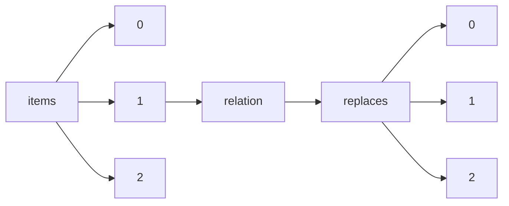

!!! warning "This document is not official Crossref documentation"
# Elements
PATH = items/array/relation/replaces/array(1)  
Occurs 1 381 times  
{ .annotate }

1. A route to an element, for example:  
   The route "items/array/relation/replaces/array" corresponds to navigating through the JSON indices as  
   ["items"][0]["relation"]["replaces"][0]  

## Asserted-by
See more information: [items/array/relation/replaces/array/asserted-by](asserted-by/index.md)  
Occurs 1 381 timess  
Unique values: 2  

| **Row** | **Value** `String` | **Count** `Int64` |
|--------:|----------------------:|---------------------:|
| **1**   | object                | 1 364                |
| **2**   | subject               | 17                   |

## Id
See more information: [items/array/relation/replaces/array/id](id/index.md)  
Occurs 1 381 timess  
Unique values: > 999  

!!! note "Due to current limitations, only the first 1,000 unique values are counted."

| **Row** | **Value** `String`           | **Count** `Int64` |
|--------:|--------------------------------:|---------------------:|
| **1**   | 10.7287/peerj.preprints.352v2   | 1                    |
| **2**   | 10.7287/peerj.preprints.1558v1  | 1                    |
| **3**   | 10.7287/peerj.preprints.2236v1  | 1                    |
| **4**   | 10.7287/peerj.preprints.3054v1  | 1                    |
| **5**   | 10.7287/peerj.preprints.26507v1 | 1                    |
| **6**   | 10.7287/peerj.preprints.27063v1 | 1                    |
| **7**   | 10.7287/peerj.preprints.207v1   | 1                    |
| **8**   | 10.7287/peerj.preprints.977v1   | 1                    |
| **9**   | 10.7287/peerj.preprints.27663v1 | 1                    |
| **10**  | 10.7287/peerj.preprints.2238v2  | 1                    |
| ... | ... | ... |

## Id-type
See more information: [items/array/relation/replaces/array/id-type](id-type/index.md)  
Occurs 1 381 timess  
Unique values: 1  

| **Row** | **Value** `String` | **Count** `Int64` |
|--------:|----------------------:|---------------------:|
| **1**   | doi                   | 1 381                |

