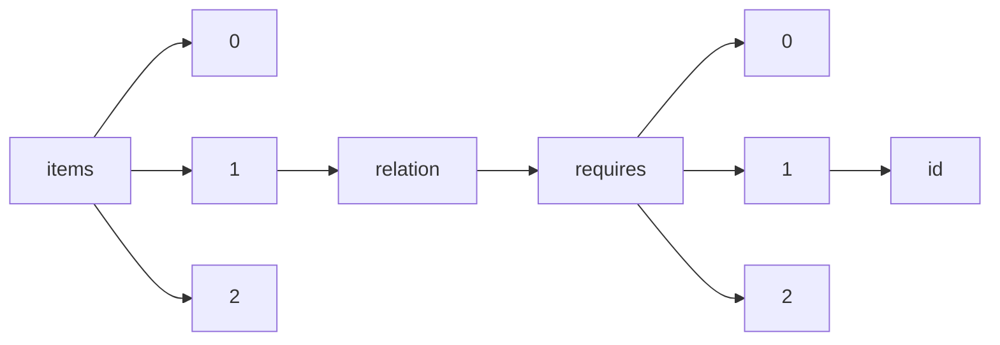

!!! warning "This document is not official Crossref documentation"
# Id
PATH = items/array/relation/requires/array/id(1)  
Occurs 2 times  
Unique values: 2  
{ .annotate }

1. A route to an element, for example:  
   The route "items/array/relation/requires/array/id" corresponds to navigating through the JSON indices as  
   ["items"][0]["relation"]["requires"][0]["id"]  

| **Row** | **Value** `String` | **Count** `Int64` |
|--------:|----------------------:|---------------------:|
| **1**   | ABC123                | 1                    |
| **2**   |                       | 1                    |

