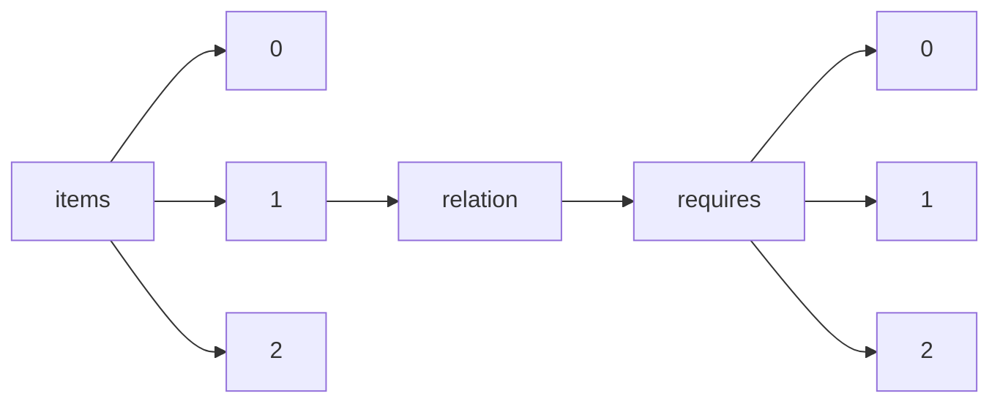

!!! warning "This document is not official Crossref documentation"
# Elements
PATH = items/array/relation/requires/array(1)  
Occurs 2 times  
{ .annotate }

1. A route to an element, for example:  
   The route "items/array/relation/requires/array" corresponds to navigating through the JSON indices as  
   ["items"][0]["relation"]["requires"][0]  

## Asserted-by
See more information: [items/array/relation/requires/array/asserted-by](asserted-by/index.md)  
Occurs 2 timess  
Unique values: 1  

| **Row** | **Value** `String` | **Count** `Int64` |
|--------:|----------------------:|---------------------:|
| **1**   | subject               | 2                    |

## Id
See more information: [items/array/relation/requires/array/id](id/index.md)  
Occurs 2 timess  
Unique values: 2  

| **Row** | **Value** `String` | **Count** `Int64` |
|--------:|----------------------:|---------------------:|
| **1**   | ABC123                | 1                    |
| **2**   |                       | 1                    |

## Id-type
See more information: [items/array/relation/requires/array/id-type](id-type/index.md)  
Occurs 2 timess  
Unique values: 1  

| **Row** | **Value** `String` | **Count** `Int64` |
|--------:|----------------------:|---------------------:|
| **1**   | other                 | 2                    |

