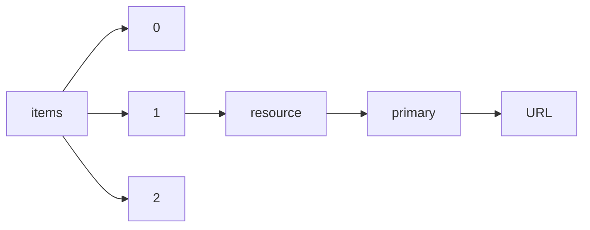

!!! warning "This document is not official Crossref documentation"
# URL
PATH = items/array/resource/primary/URL(1)  
Occurs 143 499 704 times  
Unique values: > 999  
{ .annotate }

1. A route to an element, for example:  
   The route "items/array/resource/primary/URL" corresponds to navigating through the JSON indices as  
   ["items"][0]["resource"]["primary"]["URL"]  

!!! note "Due to current limitations, only the first 1,000 unique values are counted."

| **Row** | **Value** `U{Nothing, String}`                                                                             | **Count** `Int64` |
|--------:|--------------------------------------------------------------------------------------------------------------:|---------------------:|
| **1**   | http://www.crossref.org/deleted\_DOI.html                                                                     | 180 616              |
| **2**   | https://www.elsevier.com/books-and-journals/deleted-doi                                                       | 20 630               |
| **3**   | http://www.bloomsburycollections.com/book/the-fairchild-books-dictionary-of-textiles/                         | 17 208               |
| **4**   | https://www.crossref.org/\_defunct-doi                                                                        | 5 347                |
| **5**   | http://192.16.18.219:8005/default.xqy                                                                         | 4 201                |
| **6**   | https://brill.com                                                                                             | 4 124                |
| **7**   | http://www.bloomsburycollections.com/book/the-fairchild-books-dictionary-of-interior-design/                  | 4 087                |
| **8**   | http://www.pediatricnews.com/                                                                                 | 3 883                |
| **9**   | http://www.springerlink.com/content/0013-8703/                                                                | 3 783                |
| **10**  | http://www.bloomsburycollections.com/book/the-fairchild-books-dictionary-of-fashion/                          | 2 891                |
| **11**  | http://springerlink.metapress.com/doi.mpx                                                                     | 2 774                |
| **12**  | https://link.springer.com/deleted                                                                             | 2 642                |
| **13**  | http://www.gem-a.com/publications/journal-of-gemmology.aspx                                                   | 2 537                |
| **14**  | http://www.bloomsburycollections.com/book/drugs-handbook-20122013/                                            | 1 918                |
| **15**  | https://www.crossref.org/                                                                                     | 1 720                |
| **16**  | http://journals.lww.com/                                                                                      | 1 377                |
| **17**  | http://doi.wiley.com/10.1889/1.1828693                                                                        | 1 020                |
| **18**  | https://www.bloomsburycollections.com/book/faux-amis-and-key-words-a-dictionary-guide-to-french-lang          | 953                  |
| **19**  | https://www.bloomsburycollections.com/book/scoor-oot-a-dictionary-of-scots-words-and-phrases-in-curr          | 877                  |
| **20**  | https://mathesim.degruyter.de/download/Mathematik\_Simulationen\_Download.zip                                 | 869                  |
| **21**  | http://www.pubmedcentral.nih.gov/tocrender.fcgi?journal=183&action=archive                                    | 866                  |
| **22**  | http://www.scielo.br/scielo.php?script=sci\_issues&pid=0004-2749&lng=en&nrm=iso                               | 641                  |
| **23**  | http://thebaffler.com                                                                                         | 607                  |
| **24**  | https://www.bloomsburycollections.com/about/Title-removed                                                     | 562                  |
| **25**  | http://associacaopaulistamedicina.org.br/assets/uploads/revista-spmj/5806f8c85455ba6901f539e5e9a26c2          | 535                  |
| **26**  | http://scieloteste.iec.pa.gov.br/                                                                             | 514                  |
| **27**  | https://www.pegem.net/kitabevi/index.aspx                                                                     | 514                  |
| **28**  | nothing                                                                                                       | 501                  |
| **29**  | https://editorarealize.com.br/edicao/detalhes/anais-do-encontro-de-ensino-de-biologia-da-regional-no          | 466                  |
| **30**  | http://www.improbable.com/magazine/                                                                           | 456                  |
| **31**  | http://www.hidromed.org/hm/index.php/revista-cientifica                                                       | 451                  |
| **32**  | https://onlinelibrary.wiley.com/unavailable-obooks                                                            | 391                  |
| **33**  | https://www.ufn.edu.br/eventos/maiseventos/Anaiss.aspx?id=4AnWLXmkbCE=                                        | 381                  |
| **34**  | http://fdslive.oup.com/www.oup.com/pdf/production\_in\_progress.pdf                                           | 378                  |
| **35**  | http://annonc.oxfordjournals.org/archive/                                                                     | 366                  |
| **36**  | http://www.library.arizona.edu                                                                                | 365                  |
| **37**  | http://www.tandfonline.com/doi/abs/10.1080/08843759308916157                                                  | 356                  |
| **38**  | http://www.intechopen.com/books                                                                               | 355                  |
| **39**  | http://eng.biomos.ru/conference/articles.htm                                                                  | 351                  |
| **40**  | http://choicereviews.org                                                                                      | 332                  |
| **41**  | https://www.bloomsburycollections.com/book/shakespeares-insults-a-pragmatic-dictionary/                       | 326                  |
| **42**  | https://editoraime.com.br/revistas/index.php/rems/issue/view/67                                               | 298                  |
| **43**  | http://www.bloomsburycollections.com/book/a-new-dictionary-of-the-french-revolution/                          | 295                  |
| **44**  | https://patologia-dual.com/wp-content/uploads/2021/11/patologia-dual2021\_libro-comunicaciones.pdf            | 295                  |
| **45**  | http://www.essaysonconservatism.ru/                                                                           | 292                  |
| **46**  | http://www.abed.org.br/hotsite/25-ciaed/pt/anais                                                              | 264                  |
| **47**  | http://www.cairn.info/revue-des-sciences-de-gestion.htm                                                       | 263                  |
| **48**  | http://www.annualreviews.org/page/help/deleted\_doi                                                           | 252                  |
| **49**  | http://www.nsta.org/                                                                                          | 248                  |
| **50**  | http://www.abed.org.br/hotsite/23-ciaed/pt/anais                                                              | 236                  |
| **51**  | http://www.deswater.com/home.php                                                                              | 234                  |
| **52**  | http://www.cellmolbiol.com/                                                                                   | 227                  |
| **53**  | https://patologia-dual.com/wp-content/uploads/2022/10/sepd2022-abstract\_book.pdf                             | 221                  |
| **54**  | https://www.revistaterritorios.com.br/                                                                        | 220                  |
| **55**  | https://www.jstage.jst.go.jp/static/pages/deleted/-char/ja/                                                   | 216                  |
| **56**  | https://digital-library.theiet.org/content/conferences/cp590                                                  | 216                  |
| **57**  | https://editoraime.com.br/revistas/index.php/rems/issue/view/45                                               | 214                  |
| **58**  | https://www.rfbeditora.com/catalogo                                                                           | 212                  |
| **59**  | https://www.taylorfrancis.com/books/9780203196793                                                             | 204                  |
| **60**  | https://www.patologia-dual.com/wp-content/uploads/2020/11/libro\_comunicaciones.pdf                           | 201                  |
| **61**  | https://drive.google.com/file/d/1uN9D\_vF-gdZq30zJZR1KdaD-Bl3arr\_5/view                                      | 199                  |
| **62**  | http://www.book.ru/book/919014                                                                                | 196                  |
| **63**  | https://brill.com/search?q1=9789004152397                                                                     | 195                  |
| **64**  | https://literaciacientificaeditora.com.br/catalogos/anais-do-ii-congresso-on-line-nacional-de-saude-          | 182                  |
| **65**  | http://new.guap.ru/                                                                                           | 179                  |
| **66**  | http://www.abed.org.br/hotsite/22-ciaed/pt/anais/                                                             | 179                  |
| **67**  | https://www.bloomsburycollections.com/book/shakespeare-and-national-identity-a-dictionary/                    | 172                  |
| **68**  | http://www.tcrecord.org/                                                                                      | 170                  |
| **69**  | http://www.izmiran.ru/library                                                                                 | 167                  |
| **70**  | https://www.bloomsburycollections.com/book/posthuman-glossary/                                                | 166                  |
| **71**  | http://www.afghandata.org                                                                                     | 165                  |
| **72**  | https://www.taylorfrancis.com/books/9780203194515                                                             | 165                  |
| **73**  | https://www.iberoamericana-vervuert.es/FichaLibro2.aspx?P1=204622&ISBN=9788491922827&TITULO=Mundos%2          | 164                  |
| **74**  | http://www.rbmt.org.br/details/412/pt-BR/resumos-de-trabalhos-cientificos-aprovados                           | 164                  |
| **75**  | https://brill.com/doi/10.1163/147783510X571614                                                                | 162                  |
| **76**  | http://doi.doidestek.com                                                                                      | 159                  |
| **77**  | https://paginas.uepa.br/eduepa/wp-content/uploads/2020/02/anais\_8\_sic\_2019.pdf                             | 143                  |
| **78**  | http://www.cie.co.at/publications/proceedings-conference-cie-midterm-meeting-2017-23-25-october-2017          | 142                  |
| **79**  | http://bgarf.ru/akademia/#izvestija                                                                           | 142                  |
| **80**  | http://www.abed.org.br/hotsite/26-ciaed/pt/anais/                                                             | 139                  |
| **81**  | https://editoraime.com.br/revistas/index.php/rems/issue/view/27/10                                            | 137                  |
| **82**  | https://blog.biodiversitylibrary.org/2022/10/journal-of-research-on-lepidoptera.html                          | 132                  |
| **83**  | https://www.sevenevents.com.br/livro/themes-focused-on-interdisciplinarity-and-sustainable-developme          | 131                  |
| **84**  | https://www.bjstd.org/revista/article/view/1153/1097                                                          | 130                  |
| **85**  | https://www.taylorfrancis.com/books/9781315736952                                                             | 129                  |
| **86**  | https://www.taylorfrancis.com/books/9780203416921                                                             | 129                  |
| **87**  | http://www.greenlines-institute.org/greenlines-institute/en/en\_publishing\_books.html                        | 128                  |
| **88**  | http://books.scielo.org/id/6xj59                                                                              | 128                  |
| **89**  | https://www.ams.org/clrm/047                                                                                  | 127                  |
| **90**  | https://www.ams.org/spec/009                                                                                  | 125                  |
| **91**  | https://www.sbp-journal.com/index.php/sbp/index                                                               | 124                  |
| **92**  | https://www.bloomsburycollections.com/book/an-a-z-of-feminist-theology/                                       | 121                  |
| **93**  | https://brill.com/muqj                                                                                        | 121                  |
| **94**  | https://digital-library.theiet.org/content/conferences/cp604                                                  | 112                  |
| **95**  | https://www.taylorfrancis.com/books/9780203402801                                                             | 110                  |
| **96**  | https://www.sevenevents.com.br/livro/principles-and-concepts-for-development-in-nowadays-society              | 110                  |
| **97**  | https://lib.dr.iastate.edu/rtd/                                                                               | 109                  |
| **98**  | http://journal-science.org/ru/                                                                                | 108                  |
| **99**  | http://ibjournals.com/IBJ-Plus/specialissue-PhD-programmes-1(1)s2-en.html                                     | 108                  |
| **100** | http://www.informacioncientifica.cl/Informe\_2015/graficosytablas                                             | 107                  |
| **101** | https://www.wuw.pl/product-pol-6300-Socjologia-prawa-Glowne-problemy-i-postacie-PDF.html                      | 106                  |
| **102** | https://www.wtm-verlag.de/rogerson-a-morska-j-hrsg-the-mathematics-education-of-the-future-project-p          | 106                  |
| **103** | https://bgarf.ru/obuchenie/institut-ingenernoj-pedagogiki-i-gumanitarnoj-podgotovki/#izvestija                | 105                  |
| **104** | http://dokbat.utb.cz/proceedings/                                                                             | 103                  |
| **105** | https://conhecimentolivre.org/downloads/medicina-a-ciencia-da-vida/                                           | 103                  |
| **106** | http://www.bloomsburycollections.com/book/the-anti-capitalist-dictionary-movements-histories-motivat          | 101                  |
| **107** | http://www.ams.org/mbk/053                                                                                    | 101                  |
| **108** | https://cris.maastrichtuniversity.nl/en/publications                                                          | 100                  |
| **109** | http://dstats.net/download/http://riem.facmed.unam.mx/sites/all/archivos/A6Num22/14\_L\_Posters.pdf           | 99                   |
| **110** | http://www.eurojnlofpsychotraumatol.net/index.php/ejpt/article/view/19557                                     | 99                   |
| **111** | https://brill.com/search?q1=9789004153837                                                                     | 99                   |
| **112** | https://editoraime.com.br/revistas/index.php/rema/article/view/3165/343                                       | 97                   |
| **113** | https://www.initiavia.com/diverso                                                                             | 97                   |
| **114** | https://editorarealize.com.br/edicao/detalhes/escola-em-tempos-de-conexoes                                    | 97                   |
| **115** | http://www.bloomsburycollections.com/book/shakespeare-and-animals-a-dictionary/                               | 97                   |
| **116** | http://pandora.nla.gov.au/tep/147390                                                                          | 96                   |
| **117** | http://press.um.si/index.php/ump/catalog/book/397                                                             | 93                   |
| **118** | http://naukagor.ru/en-gb/about/allissues                                                                      | 91                   |
| **119** | http://dokbat.utb.cz/wp-content/uploads/2020/01/DOKBAT\_2019\_Conference\_Proceedings.pdf                     | 91                   |
| **120** | http://clic2014.fileli.unipi.it/proceedings/Proceedings-CLICit-2014.pdf                                       | 89                   |
| **121** | https://www.taylorfrancis.com/books/9780203198476                                                             | 89                   |
| **122** | https://editoraime.com.br/revistas/index.php/rems/issue/view/40                                               | 86                   |
| **123** | https://www.chesu.ru/documents?p=c5d5d1a75fb186b5                                                             | 86                   |
| **124** | https://www.taylorfrancis.com/books/9780203306123                                                             | 85                   |
| **125** | https://msed.vse.cz/msed\_2019/sbornik/toc.html                                                               | 85                   |
| **126** | http://eht-journal.net/index.php/ehtj/article/view/11907                                                      | 85                   |
| **127** | https://aces-society.org/search.php?vol=35&no=11&type=2                                                       | 84                   |
| **128** | https://www.research-publication.com/amsj/all-issues/vol-09/iss-04                                            | 84                   |
| **129** | https://disk.yandex.by/i/zT3uZbTjB5tWvg                                                                       | 83                   |
| **130** | https://editoraime.com.br/revistas/index.php/rema/issue/view/49                                               | 83                   |
| **131** | http://www.ams.org/mbk/121                                                                                    | 83                   |
| **132** | http://192.168.0.120/index.php/jesa/article/view                                                              | 82                   |
| **133** | http://www.cie.co.at/publications/proceedings-cie-2018-topical-conference-smart-lighting-26-27-april          | 82                   |
| **134** | https://books.akademicka.pl/publishing/catalog/book/248                                                       | 82                   |
| **135** | https://ayaeditora.com.br/Livro/18491                                                                         | 82                   |
| **136** | https://lhscientificpublishing.com/Journals/JAND-Download.aspx                                                | 82                   |
| **137** | https://editoraime.com.br/revistas/index.php/rems/issue/view/53                                               | 82                   |
| **138** | https://editorarealize.com.br/edicao/detalhes/escola-em-tempos-de-conexoes-2                                  | 81                   |
| **139** | https://www.openbookpublishers.com/books/10.11647/obp.0323                                                    | 80                   |
| **140** | https://editoraime.com.br/revistas/index.php/rems/issue/view/43                                               | 80                   |
| **141** | https://vdf.ch/expanding-boundaries.html                                                                      | 80                   |
| **142** | http://www.hindawi.com/archive/                                                                               | 79                   |
| **143** | http://press.um.si/index.php/ump/catalog/book/235                                                             | 79                   |
| **144** | https://www.taylorfrancis.com/books/9780203428009                                                             | 79                   |
| **145** | https://www.taylorfrancis.com/books/9780203402511                                                             | 79                   |
| **146** | https://www.chesu.ru/documents?p=687cf2ca4fdd480c                                                             | 78                   |
| **147** | https://www.taylorfrancis.com/books/9780203450413                                                             | 78                   |
| **148** | https://www.taylorfrancis.com/books/9780203465837                                                             | 77                   |
| **149** | https://www.faesa.br/publicacoes/                                                                             | 76                   |
| **150** | https://www.ams.org/spec/005                                                                                  | 76                   |
| **151** | https://editoraime.com.br/revistas/index.php/rema/issue/view/34                                               | 75                   |
| **152** | http://ndpublisher.in/ndbooks.php                                                                             | 75                   |
| **153** | https://www.wtm-verlag.de/conference-proceedings-7/                                                           | 74                   |
| **154** | http://www.ams.org/nml/050                                                                                    | 74                   |
| **155** | http://www.jbg.inpub.solutions/artigo/342                                                                     | 74                   |
| **156** | https://www.editoracrv.com.br/produtos/detalhes/36381-crv                                                     | 73                   |
| **157** | http://waberconference.com/published-papers-waber-2019-conference/                                            | 73                   |
| **158** | https://upcolorado.com/utah-state-university-press/item/3701-explanation-points                               | 73                   |
| **159** | https://disk.yandex.by/i/I7Eipk7W\_l\_c5Q                                                                     | 72                   |
| **160** | https://www.taylorfrancis.com/books/9780203381564                                                             | 72                   |
| **161** | http://www.anatomy.org.tr/                                                                                    | 72                   |
| **162** | https://tv.theiet.org/?channel=power                                                                          | 71                   |
| **163** | http://caleidoscopio.pt/activeapp/produto/preserving-transcultural-heritage-your-way-or-my-way/               | 71                   |
| **164** | http://www.rina.org.uk/ijme.html                                                                              | 71                   |
| **165** | https://conhecimentolivre.org/ebook/ciencia-e-desenvolvimento-um-olhar-sobre-a-humanidade/                    | 70                   |
| **166** | http://www.plazayvaldes.es/colecciones/inteligencia-y-seguridad/4/                                            | 70                   |
| **167** | http://www.jbg.inpub.solutions/artigo/343                                                                     | 70                   |
| **168** | http://www.cad-conference.net/files/CAD18/CAD18-paris.html                                                    | 70                   |
| **169** | https://ime.events/ii-conbrai/anais                                                                           | 69                   |
| **170** | http://sujo.usindh.edu.pk/index.php/SURJ                                                                      | 69                   |
| **171** | https://www.rina.org.uk/past\_events.html                                                                     | 68                   |
| **172** | https://www.ams.org/dol/003                                                                                   | 68                   |
| **173** | http://www.ijammc-griet.com/publishedarticles.php?id=TWFyIC8gMjAxMw==                                         | 68                   |
| **174** | http://krepublishers.com/02-Journals/IJES/IJES-07-0-000-14-Web/IJES-07-0-000-14-Contents/IJES-07-0-0          | 68                   |
| **175** | https://editoraime.com.br/revistas/index.php/rema/issue/view/62                                               | 68                   |
| **176** | https://litgid.com/catalog/yuridicheskaya/                                                                    | 68                   |
| **177** | https://www.ams.org/spec/048                                                                                  | 67                   |
| **178** | https://www.taylorfrancis.com/books/9780203450475                                                             | 67                   |
| **179** | https://brill.com/search?q1=9789004164567                                                                     | 67                   |
| **180** | http://www.cad-conference.net/files/CAD14/CAD14-hkong.html                                                    | 66                   |
| **181** | https://www.ams.org/clrm/064                                                                                  | 66                   |
| **182** | https://www.printspublications.com/journal/thejournalofplantscienceresearch12818263520674149434               | 66                   |
| **183** | http://api.conhecimentolivre.org/ecl-api/storage/app/public/L.235-2021.pdf                                    | 65                   |
| **184** | http://press.um.si/index.php/ump/catalog/book/326                                                             | 64                   |
| **185** | https://www.peterlang.com/view/journals/pr/pr-overview.xml                                                    | 64                   |
| **186** | https://www.journalakustika.com/                                                                              | 64                   |
| **187** | https://www.atenaeditora.com.br/post-ebook/3971                                                               | 63                   |
| **188** | http://www.crossref.org/help                                                                                  | 63                   |
| **189** | http://sujo.usindh.edu.pk/index.php/surj                                                                      | 63                   |
| **190** | https://brill.com/search?q1=9789004157750                                                                     | 62                   |
| **191** | https://editorarealize.com.br/edicao/detalhes/escola-em-tempos-de-conexoes-3                                  | 62                   |
| **192** | http://ndpublisher.in/ndpjournal.php?j=JAR&tab=currentIssue                                                   | 62                   |
| **193** | http://www.ams.org/pspum/037                                                                                  | 61                   |
| **194** | https://brill.com/search?q1=9789004165717                                                                     | 61                   |
| **195** | http://www.worldaffairsjournal.org/issue-archives                                                             | 61                   |
| **196** | https://www.taylorfrancis.com/books/9780203450352                                                             | 60                   |
| **197** | http://boletines.secv.es/areas/home.php?id=54                                                                 | 60                   |
| **198** | http://ibjournals.com/IBJ-Plus/specialissue-BioResearch-1(1)s4-pdf-en.html                                    | 60                   |
| **199** | https://brill.com/search?q1=9789004162594                                                                     | 59                   |
| **200** | http://ntvp.ru/files/НТВП\_2017\_6.php                                                                        | 59                   |
| **201** | https://www.taylorfrancis.com/books/9780203863428                                                             | 59                   |
| **202** | https://www.fundarfenix.com.br/ebook/134vlljornadavolumel                                                     | 59                   |
| **203** | https://brill.com/view/journals/ba/ba-overview.xml                                                            | 59                   |
| **204** | https://www.marinha.mil.br/egn/boletim\_geocorrente                                                           | 58                   |
| **205** | http://www.jbg.inpub.solutions/publicas/jbg/arquivos/1611172231KCMC83PEU729H5GHPK50B6ZK9KWZ2A/0368-1          | 58                   |
| **206** | https://brill.com/search?q1=9789004164543                                                                     | 58                   |
| **207** | https://conhecimentolivre.org/downloads/engenharia-a-maquina-que-constroi-o-futuro/                           | 58                   |
| **208** | https://www.taylorfrancis.com/books/9780203387856                                                             | 58                   |
| **209** | http://www.cad-journal.net/files/vol\_1/Vol1Nos1-4.html                                                       | 57                   |
| **210** | https://hmgma.ru/upload/vestnik\_2\_2019\_obl.pdf                                                             | 57                   |
| **211** | https://chesu.ru/documents?p=d9e4bdc1baead45c                                                                 | 56                   |
| **212** | https://www.taylorfrancis.com/books/9780203880548                                                             | 56                   |
| **213** | https://www.chesu.ru/doc?p=ef581e090050a7ab                                                                   | 56                   |
| **214** | https://www.nordicstatistics.org/                                                                             | 56                   |
| **215** | https://www.chesu.ru/documents?p=38fbaf3a4bd7e7f2                                                             | 56                   |
| **216** | https://www.ams.org/mbk/141                                                                                   | 56                   |
| **217** | https://www.ieee.org/defunct-doi                                                                              | 56                   |
| **218** | https://editoraime.com.br/revistas/index.php/rema/issue/view/32                                               | 55                   |
| **219** | http://www.cad-conference.net/files/CAD19/CAD19-singapore.html                                                | 55                   |
| **220** | https://www.imperial.ac.uk/media/imperial-college/hamlyn-centre/public/Proceedings\_HSMR19.pdf                | 55                   |
| **221** | https://www.wtm-verlag.de/wider-view-2021                                                                     | 55                   |
| **222** | https://www.taylorfrancis.com/books/9780203830352                                                             | 55                   |
| **223** | http://www.demneuropsy.com.br/imageBank/pdf/v15s1.pdf                                                         | 55                   |
| **224** | http://books.scielo.org/id/mxmtw                                                                              | 55                   |
| **225** | http://wcsne.org/WCSNE-Proceedings/WCSNE-2015%20Proceedings.pdf                                               | 54                   |
| **226** | https://quipaeditora.com.br/primaria-saude                                                                    | 54                   |
| **227** | https://www.atenaeditora.com.br/arquivos/ebooks/i-seminario-de-lirios-desafios-da-luta-antimanicomia          | 54                   |
| **228** | http://api.conhecimentolivre.org/ecl-api/storage/app/public/L.423-2022.pdf                                    | 54                   |
| **229** | https://www.ams.org/spec/098                                                                                  | 54                   |
| **230** | https://conhecimentolivre.org/downloads/enfermagem-a-ciencia-da-vida/                                         | 53                   |
| **231** | https://brill.com/search?q1=9789004158252                                                                     | 53                   |
| **232** | https://brill.com/view/journals/rag/rag-overview.xml                                                          | 53                   |
| **233** | https://omsu.ru/science/materialy-konferentsiy/2021/Liudi\_imperii\_-\_imperiia\_liudei\_RGB.pdf              | 53                   |
| **234** | https://drive.google.com/file/d/16XxTt02aOn756Vfhi2gGsHwU6kQCua-3/view                                        | 53                   |
| **235** | https://www.hindawi.com/archive/                                                                              | 53                   |
| **236** | http://encontroamazonico.org/anais-do-evento/anais-do-evento.pdf                                              | 52                   |
| **237** | https://www.taylorfrancis.com/books/9780203880968                                                             | 52                   |
| **238** | https://www.taylorfrancis.com/books/9780203813010                                                             | 52                   |
| **239** | https://editoraime.com.br/revistas/index.php/rems/issue/view/57                                               | 52                   |
| **240** | https://elibrary.narr.digital/book/10.24053/9783739880426                                                     | 52                   |
| **241** | http://hum-ecol.ru/?page\_id=104                                                                              | 51                   |
| **242** | https://www.taylorfrancis.com/books/9780203206966                                                             | 51                   |
| **243** | http://www.ams.org/pspum/040.2                                                                                | 51                   |
| **244** | https://chesu.ru/documents?p=678999548abd939b                                                                 | 51                   |
| **245** | https://www.nchpjournals.com/                                                                                 | 51                   |
| **246** | http://www.ams.org/conm/288/                                                                                  | 51                   |
| **247** | http://ndpublisher.in/ndpjournal.php?j=JAR                                                                    | 51                   |
| **248** | http://www.ams.org/mbk/073                                                                                    | 51                   |
| **249** | https://www.taylorfrancis.com/books/9780203839713                                                             | 50                   |
| **250** | http://ijarsct.co.in/june5i.html                                                                              | 50                   |
| **251** | http://genbio2020.yolasite.com/resources/GENBIO-20%20%D0%BC%D0%B0%D0%BA%D0%B5%D1%82%20%D0%BE%D0%BA%D          | 50                   |
| **252** | http://www.ams.org/conm/131.1/                                                                                | 50                   |
| **253** | http://riem.facmed.unam.mx/node/401                                                                           | 50                   |
| **254** | http://oj.tsatu.edu.ua/index.php/visnik/issue/view/5                                                          | 50                   |
| **255** | http://www.jiasociety.org/index.php/jias/issue/view/1467                                                      | 50                   |
| **256** | http://www.ams.org/pspum/045.2                                                                                | 50                   |
| **257** | https://www.research-publication.com/amsj/all-issues/vol-09/iss-06                                            | 50                   |
| **258** | https://editoraime.com.br/revistas/index.php/rems/article/view/3163/341                                       | 49                   |
| **259** | https://www.vsavm.by/uchenye-zapiski-uo-vgavm/tekushhij-nomer/                                                | 49                   |
| **260** | http://ntvp.ru/files/NTVP\_5\_2016.php                                                                        | 49                   |
| **261** | https://www.intellectbooks.com/places-and-purposes-of-popular-music-education                                 | 49                   |
| **262** | https://www.taylorfrancis.com/books/9780203844236                                                             | 49                   |
| **263** | https://kazanveterinary.ru/wp-content/uploads/2021/06/246-945-MB.pdf                                          | 49                   |
| **264** | http://www.psiencia.org/index.php/psiencia/article/view/162/204                                               | 49                   |
| **265** | https://editoraime.com.br/revistas/index.php/rems/article/view/3164/342                                       | 49                   |
| **266** | http://ijarsct.co.in/deci4.html                                                                               | 49                   |
| **267** | http://www.cad-conference.net/files/CAD17/CAD17-okayama.html                                                  | 49                   |
| **268** | https://conhecimentolivre.org/downloads/desafios-da-psicologia-no-brasil/                                     | 48                   |
| **269** | https://www.ams.org/spec/043                                                                                  | 48                   |
| **270** | https://www.taylorfrancis.com/books/9780203879320                                                             | 48                   |
| **271** | http://ntvp.ru/files/НТВП\_4\_2017.php                                                                        | 48                   |
| **272** | http://press.um.si/index.php/ump/catalog/book/418                                                             | 48                   |
| **273** | https://kazanveterinary.ru/wp-content/uploads/2020/12/244-Том-978-МБ.pdf                                      | 47                   |
| **274** | http://press.um.si/index.php/ump/catalog/book/352                                                             | 47                   |
| **275** | https://www.ams.org/dol/010                                                                                   | 47                   |
| **276** | https://www.ams.org/spec/004                                                                                  | 47                   |
| **277** | https://lhscientificpublishing.com/Journals/JEAM-Download.aspx                                                | 47                   |
| **278** | http://www.ams.org/pspum/027.1                                                                                | 47                   |
| **279** | http://www.ams.org/hmath/027                                                                                  | 47                   |
| **280** | https://conhecimentolivre.org/downloads/ensino-pesquisa-e-extensao-no-brasil-uma-abordagem-pluralist          | 47                   |
| **281** | https://www.taylorfrancis.com/books/9780203197875                                                             | 47                   |
| **282** | http://www.inscricoes.fmb.unesp.br/index.asp?configurar=true&codEvento=10924                                  | 47                   |
| **283** | http://editorarevistas.mackenzie.br/index.php/tint/issue/archive                                              | 46                   |
| **284** | http://bbronline.com.br                                                                                       | 46                   |
| **285** | http://www.printspublications.com/journal/journalofpsychosocialresearch1350312464130386373                    | 46                   |
| **286** | https://www.atenaeditora.com.br/post-ebook/4224                                                               | 46                   |
| **287** | https://books.iorpress.org/index.php/ior/catalog/book/1                                                       | 46                   |
| **288** | http://www.ams.org/conm/180/                                                                                  | 46                   |
| **289** | http://jmb.inforang.com/                                                                                      | 46                   |
| **290** | https://www.ams.org/dol/019                                                                                   | 46                   |
| **291** | http://www.ledonline.it/snippets/index.html                                                                   | 46                   |
| **292** | https://kazanveterinary.ru/wp-content/uploads/2021/11/Том-248-746-МБ.pdf                                      | 46                   |
| **293** | http://ldhm.adsa.org/                                                                                         | 46                   |
| **294** | http://cic.cihanuniversity.edu.iq/conf/liram/docs/LIRAM17\_Proceedings.pdf                                    | 45                   |
| **295** | http://www.ams.org/conm/131.2/                                                                                | 45                   |
| **296** | https://editoraime.com.br/revistas/index.php/rems/issue/view/61                                               | 45                   |
| **297** | https://www.chesu.ru/documents?p=b36c081efa6b3208                                                             | 45                   |
| **298** | http://www.ams.org/text/031                                                                                   | 45                   |
| **299** | https://www.fundarfenix.com.br/48-direitos-fundamentais-desenvolvi                                            | 45                   |
| **300** | https://intjsh.sums.ac.ir/                                                                                    | 45                   |
| **301** | https://press.um.si/index.php/ump/catalog/book/552                                                            | 45                   |
| **302** | https://www.taylorfrancis.com/books/9780203863688                                                             | 45                   |
| **303** | https://www.taylorfrancis.com/books/9780203744857                                                             | 45                   |
| **304** | https://kazanveterinary.ru/wp-content/uploads/2020/09/Том-243-483.pdf                                         | 45                   |
| **305** | http://www.veorus.ru/upload/iblock/27a/veor\_223\_maef.pdf                                                    | 45                   |
| **306** | http://hmgma.ru/science/bulletin/Vestnik-1-11-17.pdf                                                          | 45                   |
| **307** | https://www.sevenevents.com.br/livro/eyes-on-health-sciences                                                  | 44                   |
| **308** | http://wcsne.org/WCSNE-Proceedings/WCSNE-2014%20Proceedings.pdf                                               | 44                   |
| **309** | https://www.taylorfrancis.com/books/9780203357385                                                             | 44                   |
| **310** | https://conhecimentolivre.org/ebook/ensino-pesquisa-e-extensao-uma-abordagem-pluralista/                      | 44                   |
| **311** | https://www.chesu.ru/documents?p=28fd6e2b9801376f                                                             | 44                   |
| **312** | http://www.cad-journal.net/files/vol\_2/Vol2Nos1-4.html                                                       | 44                   |
| **313** | https://revistas.unicentro.br/index.php/revista\_interfaces/issue/archive                                     | 44                   |
| **314** | http://ijmra.org/inaugural-special-issue/                                                                     | 44                   |
| **315** | https://www.ams.org/spec/030                                                                                  | 44                   |
| **316** | https://www.taylorfrancis.com/books/9780203526965                                                             | 44                   |
| **317** | https://chesu.ru/documents?p=d143801939450c0d                                                                 | 44                   |
| **318** | https://iccaua.com/page/2021-proceedings-full-papers                                                          | 44                   |
| **319** | https://www.taylorfrancis.com/books/9780203850701                                                             | 43                   |
| **320** | http://www.davidpublisher.com/index.php/Home/Journal/detail?journalid=9&jx=CBR&cont=allissues                 | 43                   |
| **321** | http://editoraime.com.br/anais-publicados/xxvii-sbm                                                           | 43                   |
| **322** | https://0618a0b3-faee-432b-b78e-e89614c1011b.filesusr.com/ugd/b9c3ab\_892e1012780e41d39a012742258e6dc         | 43                   |
| **323** | https://www.editorainvivo.com/\_files/ugd/08fcde\_60dc178022c24681a3a6211267ba82ff.pdf                        | 43                   |
| **324** | https://www.fundarfenix.com.br/ebook/84constitucionalismoemeioambiente                                        | 43                   |
| **325** | http://ttsconference.org/                                                                                     | 43                   |
| **326** | https://wac.colostate.edu/books/perspectives/wpww/                                                            | 43                   |
| **327** | http://www.usc.gal/libros/index.php?id\_product=321&controller=product                                        | 43                   |
| **328** | https://iase-web.org/Conference\_Proceedings.php?p=2021\_Statistics\_Education\_in\_the\_Era\_of\_Data\_Scien | 42                   |
| **329** | https://brill.com/ocyo                                                                                        | 42                   |
| **330** | https://www.chesu.ru/documents?p=7be54988856da9db                                                             | 42                   |
| **331** | https://www.taylorfrancis.com/books/9781315880198                                                             | 42                   |
| **332** | https://brill.com/search?q1=9789004188334                                                                     | 42                   |
| **333** | https://hamlynsymposium.org/proceedings/                                                                      | 42                   |
| **334** | http://www.ams.org/pspum/030.2                                                                                | 42                   |
| **335** | https://brill.com/search?q1=9789004167278                                                                     | 42                   |
| **336** | https://www.editorarealize.com.br/edicao/detalhes/tecnologias-e-educacao                                      | 42                   |
| **337** | http://data.uis.unesco.org/index.aspx?queryid=121                                                             | 41                   |
| **338** | https://publicacoes.even3.com.br/book/engenharia-na-amazonia-conceitos-ferramentas-e-praticas-563095          | 41                   |
| **339** | https://conhecimentolivre.org/downloads/cuidados-com-a-saude-uma-abordagem-holistica/                         | 41                   |
| **340** | http://kazanveterinary.ru/science\_innovation/scientific\_notes/                                              | 41                   |
| **341** | http://www.alaskaseagrant.org/bookstore/pubs/AK-SG-05-02.html                                                 | 41                   |
| **342** | https://editoraime.com.br/revistas/index.php/rems/issue/view/58                                               | 41                   |
| **343** | http://www.psiencia.org/index.php/psiencia/article/view/161/203                                               | 41                   |
| **344** | https://www.sevenevents.com.br/livro/coletanea-internacional-de-pesquisa-em-ciencias-da-saude-vol-02          | 41                   |
| **345** | http://www.idi-unicyt.org/wp-content/uploads/2022/02/ACTAS-DEL-VI-CONGRESO-IDI-UNICyT-doc-completo-0          | 40                   |
| **346** | https://www.wuw.pl/product-pol-7747-Between-the-Cataracts-Proceedings-of-the-11th-Conference-of-Nubi          | 40                   |
| **347** | https://lhscientificpublishing.com/Journals/DNC-Download.aspx                                                 | 40                   |
| **348** | https://poisson.com.br/livros/individuais/Ciencia\_Animal/volume2/Ciencia\_Animal\_Vol2.pdf                   | 40                   |
| **349** | https://conhecimentolivre.org/downloads/engenharia-de-producao-produtividade-e-competitividade-volum          | 40                   |
| **350** | https://conhecimentolivre.org/ebook/ensino-pesquisa-e-extensao-no-brasil-uma-abordagem-pluralista-vo          | 40                   |
| **351** | https://www.taylorfrancis.com/books/9780203361788                                                             | 39                   |
| **352** | https://dl.acm.org/citation.cfm?id=3144457&picked=prox                                                        | 39                   |
| **353** | https://upcolorado.com/university-press-of-colorado/item/3541-dialogue-with-europe-dialogue-with-the          | 39                   |
| **354** | http://ntvp.ru/files/НТВП\_2018\_4.php                                                                        | 39                   |
| **355** | https://www.ams.org/spec/056                                                                                  | 39                   |
| **356** | http://www.annsaudimed.net/                                                                                   | 39                   |
| **357** | https://loja.editoradialetica.com/loja/produto.php?loja=791959&IdProd=1244239851&iniSession=1&6079b1          | 39                   |
| **358** | http://press.um.si/index.php/ump/catalog/book/206                                                             | 39                   |
| **359** | https://www.research-publication.com/amsj/all-issues/vol-09/iss-05                                            | 39                   |
| **360** | http://www.ams.org/pspum/045.1                                                                                | 39                   |
| **361** | https://www.atenaeditora.com.br/post-ebook/2898                                                               | 39                   |
| **362** | https://cws.emu.edu.tr/en/activities/conferences?t=7th-international-conference-on-gender-studies-ge          | 39                   |
| **363** | https://www.chesu.ru/documents?p=b0e1bc7ba38d25c8                                                             | 39                   |
| **364** | http://www.ams.org/pspum/023                                                                                  | 39                   |
| **365** | http://ksu.edu.ru/files/VESTNIK\_KSU/NOMERA\_VESTNIK\_KSU/2019/Vestnik\_KSU\_2\_2019.pdf                      | 39                   |
| **366** | https://publicacoes.even3.com.br/book/reflexoes-sobre-cinema-literatura-e-outras-artes-324205                 | 38                   |
| **367** | https://0618a0b3-faee-432b-b78e-e89614c1011b.filesusr.com/ugd/b9c3ab\_81477a7d5ba34d8daab92ff0d598a48         | 38                   |
| **368** | http://www.ams.org/mbk/104                                                                                    | 38                   |
| **369** | http://urn.kb.se/resolve?urn=urn:nbn:se:norden:org:diva-5821                                                  | 38                   |
| **370** | http://www.ledonline.it/NeuropsychologicalTrends/                                                             | 38                   |
| **371** | http://www.ams.org/mbk/083                                                                                    | 38                   |
| **372** | https://pdfpk.net/pdf/feed-2/                                                                                 | 38                   |
| **373** | https://www.pimentacultural.com/livro/agendas-politicas                                                       | 38                   |
| **374** | https://ime.events/oncoclil/anais                                                                             | 38                   |
| **375** | https://journal.sciencemuseum.ac.uk/article/curating-medicine/                                                | 38                   |
| **376** | http://www.ams.org/conm/131.3/                                                                                | 38                   |
| **377** | http://sodebras.com.br/edicoes/N159.pdf                                                                       | 38                   |
| **378** | https://conhecimentolivre.org/downloads/os-caminhos-do-direito-no-brasil-desafios-e-perspectivas/             | 38                   |
| **379** | https://www.fundarfenix.com.br/sub-specie-aeternitatis-festschrift                                            | 38                   |
| **380** | http://gvpress.com/journals/IJSWPM/vol3\_2016.php                                                             | 37                   |
| **381** | https://www.research-publication.com/amsj/all-issues/vol-09/iss-03                                            | 37                   |
| **382** | https://www.nap.edu/catalog/25217                                                                             | 37                   |
| **383** | https://press.um.si/index.php/ump/catalog/book/581                                                            | 37                   |
| **384** | https://kazanveterinary.ru/wp-content/uploads/2020/06/Том-242-3.94-Мб.pdf                                     | 37                   |
| **385** | http://www.cad-conference.net/files/CAD15/CAD15-london.html                                                   | 37                   |
| **386** | https://conhecimentolivre.org/downloads/geografia-ensino-desenvolvimento-e-sustentabilidade/                  | 37                   |
| **387** | https://www.atenaeditora.com.br/arquivos/ebooks/sexualidade-e-relacoes-de-genero-3                            | 37                   |
| **388** | http://www.vniipp.ru/news/04-12-2019/sbornik\_trudov\_konferentcii\_90\_let\_04.12.2019.pdf                   | 37                   |
| **389** | https://0618a0b3-faee-432b-b78e-e89614c1011b.filesusr.com/ugd/b9c3ab\_302e1dc00687495383758c9f5a15bb4         | 37                   |
| **390** | http://www.jksnt.org/submission/proof/PDFMerger/savepdfs/                                                     | 37                   |
| **391** | https://0618a0b3-faee-432b-b78e-e89614c1011b.filesusr.com/ugd/b9c3ab\_7dc10603b42c44dd981296475650431         | 37                   |
| **392** | http://www.ams.org/pspum/038.1                                                                                | 36                   |
| **393** | https://brill.com/search?q1=9789004208582                                                                     | 36                   |
| **394** | http://books.scielo.org/id/d83gz                                                                              | 36                   |
| **395** | http://www.uab.ro/auajournal/                                                                                 | 36                   |
| **396** | https://www.taylorfrancis.com/books/9780203106075                                                             | 36                   |
| **397** | https://editorapublicar.com.br/science-e-saude-atuacao-multiprofissional-da-area-da-saude-volume-1            | 36                   |
| **398** | http://api.conhecimentolivre.org/ecl-api/storage/app/public/L.532-2022.pdf                                    | 36                   |
| **399** | http://www.rina.org.uk/ijsct.html                                                                             | 36                   |
| **400** | https://onedrive.live.com/?authkey=%21AMYgYXgeguZbOMI&cid=A67EA0773797D3EC&id=A67EA0773797D3EC%21519          | 36                   |
| **401** | https://www.taylorfrancis.com/books/9780203066911                                                             | 36                   |
| **402** | https://journals.sagepub.com/home/CMT                                                                         | 35                   |
| **403** | http://www.aquaticinvasions.net/2011/AI\_6\_supplement1.html                                                  | 35                   |
| **404** | https://www.ams.org/spec/075                                                                                  | 35                   |
| **405** | https://publications.sciences.ucf.edu/cannabis/index.php/Cannabis/article/view/130                            | 35                   |
| **406** | http://metszetek.unideb.hu/                                                                                   | 35                   |
| **407** | https://www.editorainvivo.com/\_files/ugd/08fcde\_21c35b1f22c544cc8d0a0c65c2568aa6.pdf                        | 35                   |
| **408** | https://totalbooks.com.br/cartografia/                                                                        | 35                   |
| **409** | https://editoraime.com.br/revistas/index.php/rems/issue/view/31                                               | 35                   |
| **410** | https://wiadlek.pl/wp-content/uploads/archive/2021/WLek2021112.pdf                                            | 35                   |
| **411** | https://editorapublicar.com.br/ciencias-da-saude-inovacao-pesquisa-e-demandas-populares-vol-3                 | 35                   |
| **412** | https://arpgweb.com/journal/7/special\_issue/11-2018/1/4                                                      | 35                   |
| **413** | https://www.atenaeditora.com.br/wp-content/uploads/2018/12/Qualidade-e-Pol%C3%ADticas-P%C3%BAblicas-          | 35                   |
| **414** | http://aee-intec.at/isec/Conference\_Proceedings\_ISEC%202018\_DOI.pdf                                        | 35                   |
| **415** | https://www.pegem.net/kitabevi/474654-Liderlik-kitabi.aspx                                                    | 34                   |
| **416** | http://www.ams.org/conm/143/                                                                                  | 34                   |
| **417** | http://www.2pangeo.on.br/PROCEEDINGS\_OF\_THE\_II\_PANGEO.pdf                                                 | 34                   |
| **418** | https://www.lededizioni.com/catalogo/894-geografie-storie-letterarie.html                                     | 34                   |
| **419** | https://www.taylorfrancis.com/books/9780203123294                                                             | 34                   |
| **420** | https://www.taylorfrancis.com/books/9780203836507                                                             | 34                   |
| **421** | https://www.taylorfrancis.com/books/9780203387832                                                             | 34                   |
| **422** | http://казветакадемия.рф/science\_innovation/scientific\_notes/                                               | 34                   |
| **423** | http://biosfera.swsu.ru                                                                                       | 34                   |
| **424** | https://ampllaeditora.com.br/publicacoes/4919/                                                                | 34                   |
| **425** | https://press.um.si/index.php/ump/catalog/book/503                                                            | 33                   |
| **426** | http://krepublishers.com/02-Journals/IJHG/IJHG-08-0-000-000-2008-Web/IJHG-08-0-000-000-2008-Contents          | 33                   |
| **427** | https://www.pegem.net/kitabevi/482951-Dr-Kemal-Dascioglu-na-Vefa-Kitabi-kitabi.aspx                           | 33                   |
| **428** | https://www.chesu.ru/documents?p=4d8281cb4da3d2d3                                                             | 33                   |
| **429** | http://www.cad-conference.net/files/CAD22/CAD22-beijing.html                                                  | 33                   |
| **430** | http://www.ams.org/pspum/038.2                                                                                | 33                   |
| **431** | https://www.taylorfrancis.com/books/9780203891377                                                             | 33                   |
| **432** | https://books.akademicka.pl/publishing/catalog/book/484                                                       | 33                   |
| **433** | http://www.ams.org/conm/382/                                                                                  | 33                   |
| **434** | https://www.research-publication.com/amsj/all-issues/vol-09/iss-07                                            | 33                   |
| **435** | http://kazanveterinary.ru/wp-content/uploads/2019/08/239.pdf                                                  | 33                   |
| **436** | https://editorapublicar.com.br/olhares-da-educagao-acoes-rupturas-e-conhecimento-na-construcao-de-sa          | 33                   |
| **437** | http://www.ams.org/mbk/095.2                                                                                  | 33                   |
| **438** | https://wiadlek.pl/wp-content/uploads/2020/01/WL-3-2019.pdf                                                   | 33                   |
| **439** | https://www.wuw.pl/product-pol-15671-Stosunki-miedzynarodowe-Antologia-tekstow-zrodlowych-Tom-2-Wspo          | 33                   |
| **440** | https://www.uniedusul.com.br/publicacao/pesquisa-cientifica-na-pandemia-ciencia-saude-e-reflexao-vol          | 32                   |
| **441** | https://www.taylorfrancis.com/books/9781315857572                                                             | 32                   |
| **442** | https://journal.sciencemuseum.ac.uk/article/aids-memorials/                                                   | 32                   |
| **443** | https://wac.colostate.edu/books/perspectives/wrab2011/                                                        | 32                   |
| **444** | http://www.ams.org/pspum/032.2                                                                                | 32                   |
| **445** | https://www.editorarealize.com.br/edicao/detalhes/ciencia-e-democracia-o-que-essa-relacao-depende-de          | 32                   |
| **446** | http://ksu.edu.ru/files/VESTNIK\_KSU/NOMERA\_VESTNIK\_KSU\_PiP/Vestnik\_KSU\_PiP\_3\_2019.pdf                 | 32                   |
| **447** | https://onedrive.live.com/?authkey=%21AITKnMwnaayrNyk&cid=A67EA0773797D3EC&id=A67EA0773797D3EC%21519          | 32                   |
| **448** | https://www.imperial.ac.uk/media/imperial-college/hamlyn-centre/public/Proceedings\_HSMR18.pdf                | 32                   |
| **449** | http://krepublishers.com/02-Journals/IJES/IJES-05-0-000-13-Web/IJES-05-0-000-13-Contents/IJES-05-0-0          | 32                   |
| **450** | https://publicacoes.even3.com.br/book/revista-mineira-de-epidemiologia-prevencao-e-controle-de-infec          | 32                   |
| **451** | https://editoraime.com.br/revistas/index.php/rems/issue/view/56                                               | 32                   |
| **452** | http://www.rbmt.org.br/details/328/pt-BR/resumos-de-trabalhos-cientificos-aprovados                           | 32                   |
| **453** | https://www.pimentacultural.com/livro/psicologia-escolar                                                      | 32                   |
| **454** | https://brill.com/search?q1=9789004190481                                                                     | 32                   |
| **455** | https://www.uniedusul.com.br/publicacao/pesquisa-cientifica-na-pandemia-ciencia-saude-e-reflexao-vol          | 32                   |
| **456** | https://www.editorainovar.com.br/omp/index.php/inovar/catalog/book/366                                        | 32                   |
| **457** | https://www.atenaeditora.com.br/arquivos/ebooks/historia-espaco-fecundo-para-dialogos                         | 31                   |
| **458** | https://www.atenaeditora.com.br/post-ebook/2843                                                               | 31                   |
| **459** | https://www.wuw.pl/product-pol-6521-Miasto-na-zadanie-aktywizm-polityki-miejskie-doswiadczenia-PDF.h          | 31                   |
| **460** | https://ksu.edu.ru/files/VESTNIK\_KSU/NOMERA\_VESTNIK\_KSU/2019/Vestnik\_KSU\_4\_2019.pdf                     | 31                   |
| **461** | https://www.atenaeditora.com.br/post-ebook/3857                                                               | 31                   |
| **462** | https://www.atenaeditora.com.br/wp-content/uploads/2019/03/E-book-Patologia-Doen%C3%A7as-Virais.pdf           | 31                   |
| **463** | http://pgia.ru/seminar/archive/                                                                               | 31                   |
| **464** | http://krepublishers.com/02-Journals/IJES/IJES-15-0-000-16-Web/IJES-15-0-000-16-Contents/IJES-15-0-0          | 31                   |
| **465** | http://krepublishers.com/02-Journals/JSSA/JSSA-05-0-000-14-Web/JSSA-05-0-000-14-Contents/JSSA-05-0-0          | 31                   |
| **466** | http://ampllaeditora.com.br/books/2022/01/PesquisasCienciasSaudeV1.pdf                                        | 31                   |
| **467** | http://www.cad-journal.net/files/vol\_3/Vol3Nos1-4.html                                                       | 31                   |
| **468** | http://ntvp.ru/files/NTVP\_2\_2016.php                                                                        | 31                   |
| **469** | http://www.ams.org/pspum/030.1                                                                                | 31                   |
| **470** | https://onedrive.live.com/?authkey=%21AFDcbAINlE2zRYI&cid=A67EA0773797D3EC&id=A67EA0773797D3EC%21519          | 31                   |
| **471** | https://www.intellectbooks.com/the-performing-observer                                                        | 31                   |
| **472** | https://www.taylorfrancis.com/books/9780203860229                                                             | 30                   |
| **473** | http://oj.tsatu.edu.ua/index.php/pratsi/issue/view/4                                                          | 30                   |
| **474** | http://www.archivosdemedicina.com/                                                                            | 30                   |
| **475** | https://literaciacientificaeditora.com.br/catalogos/o-cenario-pos-pandemico-no-brasil-e-no-mundo-lic          | 30                   |
| **476** | http://www.ams.org/mbk/085                                                                                    | 30                   |
| **477** | https://ebooks.marilia.unesp.br/index.php/lab\_editorial/catalog/book/260                                     | 30                   |
| **478** | https://ampllaeditora.com.br/books/2021/12/CondutasClinicasAPS.pdf                                            | 30                   |
| **479** | https://conhecimentolivre.org/downloads/engenharia-de-pesca-produtividade-e-sustentabilidade/                 | 30                   |
| **480** | https://atenaeditora.com.br/catalogo/ebook/formacao-docente-pilar-da-educacao-para-o-desenvolvimento          | 30                   |
| **481** | https://0618a0b3-faee-432b-b78e-e89614c1011b.filesusr.com/ugd/b9c3ab\_4568e7c4a1c94392a132aa59f7dc13a         | 30                   |
| **482** | http://books.scielo.org/id/3wj6h                                                                              | 30                   |
| **483** | http://rcin.org.pl/ibs/dlibra/docmetadata?id=9737&from=publication                                            | 30                   |
| **484** | http://press.um.si/index.php/ump/catalog/book/234                                                             | 30                   |
| **485** | https://www.theorsociety.com/what-we-do/events-conferences/simulation-workshop/                               | 30                   |
| **486** | http://ntvp.ru/files/НТВП\_2017\_5.php                                                                        | 30                   |
| **487** | https://publications.sciences.ucf.edu/cannabis/index.php/Cannabis/article/view/95                             | 30                   |
| **488** | http://www.boomuitgeversdenhaag.nl/home                                                                       | 30                   |
| **489** | http://www.medicalveritas.com/vol2issue2.php                                                                  | 30                   |
| **490** | https://www.atenaeditora.com.br/wp-content/uploads/2019/01/E-book-Energia-Solar-e-E%C3%B3lica.pdf             | 30                   |
| **491** | https://rgsu.net/netcat\_files/multifile/5219/14/UZ\_2\_2019\_V\_PEChAT\_.pdf                                 | 30                   |
| **492** | https://www.fundarfenix.com.br/hegel-e-a-contemporaneidade                                                    | 29                   |
| **493** | https://www.atenaeditora.com.br/wp-content/uploads/2019/01/E-book-Energia-Solar-e-Eolica-2.pdf                | 29                   |
| **494** | https://wiadlek.pl/wp-content/uploads/2020/01/WL-2-2019.pdf                                                   | 29                   |
| **495** | https://editoraime.com.br/revistas/index.php/rems/issue/view/42                                               | 29                   |
| **496** | https://brill.com/search?q1=9789004186521                                                                     | 29                   |
| **497** | https://www.intellectbooks.com/keepin-it-real                                                                 | 29                   |
| **498** | https://soar.usa.edu/phjpt/vol1/iss1/4                                                                        | 29                   |
| **499** | https://ampllaeditora.com.br/publicacoes/2983/                                                                | 29                   |
| **500** | https://secureservercdn.net/160.153.138.53/sg3.1a0.myftpupload.com/wp-content/uploads/2021/03/2013-s          | 29                   |
| **501** | https://www.atenaeditora.com.br/wp-content/uploads/2018/12/Qualidade-e-Pol%C3%ADticas-P%C3%BAblicas-          | 29                   |
| **502** | https://www.fundarfenix.com.br/59-diagn%C3%B3stico-do-tempo                                                   | 29                   |
| **503** | https://www.taylorfrancis.com/books/9780203097199                                                             | 29                   |
| **504** | http://ebooks.asmpress.org/product/thepicornaviruses                                                          | 29                   |
| **505** | https://www.atenaeditora.com.br/arquivos/ebooks/ciencias-da-saude-da-teoria-a-pratica-7                       | 29                   |
| **506** | https://editoraime.com.br/revistas/index.php/rems/issue/view/26/9                                             | 29                   |
| **507** | https://www.taylorfrancis.com/books/9780203874837                                                             | 29                   |
| **508** | https://wiadlek.pl/wp-content/uploads/2020/01/WL-4-2019.pdf                                                   | 29                   |
| **509** | http://www.jbg.inpub.solutions/publicas/jbg/arquivos/1597178440W96GH1KFWIWVSGC11WEIJ6L5XKJVDB/0368-1          | 29                   |
| **510** | http://www.duncker-humblot.de/index.php/catalog/product/view/sku/54264                                        | 29                   |
| **511** | https://www.taylorfrancis.com/books/9780203879306                                                             | 29                   |
| **512** | https://www.taylorfrancis.com/books/9780203123485                                                             | 28                   |
| **513** | http://www.adelaide.edu.au/press/titles/advocacy/                                                             | 28                   |
| **514** | https://centerslo.si/simpozij-obdobja/zborniki/obdobja-38/                                                    | 28                   |
| **515** | http://pepsic.bvsalud.org/scielo.php?script=sci\_issues&pid=1415-711X&lng=pt&nrm=iso                          | 28                   |
| **516** | https://www.atenaeditora.com.br/arquivos/ebooks/estudos-interdisciplinares-nas-ciencias-exatas-e-da-          | 28                   |
| **517** | https://www.taylorfrancis.com/books/9780203102015                                                             | 28                   |
| **518** | http://www.ams.org/pspum/040.1                                                                                | 28                   |
| **519** | https://www.taylorfrancis.com/books/9780203097267                                                             | 28                   |
| **520** | http://lib2.pushkinskijdom.ru/Media/Default/PDF/RusLiteratura/РЛ\_3\_2019.PDF                                 | 28                   |
| **521** | https://www.chesu.ru/documents?p=543aadca76f0fc28                                                             | 28                   |
| **522** | ftp://rock.geosociety.org/pub/GSAToday/gt0609.pdf                                                             | 28                   |
| **523** | https://conhecimentolivre.org/ebook/nutricao-em-foco-uma-abordagem-holistica-2/                               | 28                   |
| **524** | https://www.chesu.ru/documents?p=4b9f8438f180b1a7                                                             | 28                   |
| **525** | https://ampllaeditora.com.br/publicacoes/3951                                                                 | 28                   |
| **526** | https://elibrary.bwv-verlag.de/book/10.35998/9783830543824                                                    | 28                   |
| **527** | https://www.brazilianjournals.com.br/ebooks.php?b=3638cafa35b7314c19e8ea4d2e7a486c                            | 28                   |
| **528** | https://www.fundarfenix.com.br/ebook/136vlljornadavll                                                         | 28                   |
| **529** | https://www.research-publication.com/amsj/all-issues/vol-09/iss-08                                            | 28                   |
| **530** | http://www.ams.org/amsip/003                                                                                  | 28                   |
| **531** | https://iccaua.com/page/2022-proceedings-full-papers                                                          | 28                   |
| **532** | https://www.ams.org/spec/063                                                                                  | 28                   |
| **533** | https://conhecimentolivre.org/ebook/administracao-caminhos-para-o-desenvolvimento-sustentavel/                | 27                   |
| **534** | http://www.jbdst.inpub.solutions/artigo/366                                                                   | 27                   |
| **535** | https://secureservercdn.net/160.153.138.53/sg3.1a0.myftpupload.com/wp-content/uploads/2021/03/2013-s          | 27                   |
| **536** | https://www.chesu.ru/documents?p=e41a9cd91382ed34                                                             | 27                   |
| **537** | http://ijarsct.co.in/junei1.html                                                                              | 27                   |
| **538** | http://orel.ranepa.ru/nauka/srednerusskiy-vestnik-obshchestvennykh-nauk/srednerusskiy-vestnik-obshch          | 27                   |
| **539** | http://www.cad-conference.net/files/CAD20/CAD20-barcelona.html                                                | 27                   |
| **540** | https://wac.colostate.edu/aw/archives/v1.htm                                                                  | 27                   |
| **541** | http://krepublishers.com/02-Journals/IJHG/IJHG-13-0-000-13-Web/IJHG-13-0-000-13-Contents/IJHG-13-0-0          | 27                   |
| **542** | http://oj.tsatu.edu.ua/index.php/pratsi/issue/view/6                                                          | 27                   |
| **543** | https://www.taylorfrancis.com/books/9780203477151                                                             | 27                   |
| **544** | https://www.atenaeditora.com.br/arquivos/ebooks/estudos-interdisciplinares-nas-ciencias-exatas-e-da-          | 27                   |
| **545** | http://press.um.si/index.php/ump/catalog/book/394                                                             | 27                   |
| **546** | https://www.atenaeditora.com.br/wp-content/uploads/2018/12/Qualidade-e-Pol%C3%ADticas-7.pdf                   | 27                   |
| **547** | https://www.taylorfrancis.com/books/9780203434833                                                             | 27                   |
| **548** | https://www.taylorfrancis.com/books/9780203414675                                                             | 27                   |
| **549** | https://encontro-nacional-das-licenciaturas-ead.unimes.br/wp-content/uploads/2021/11/Anais\_TRABALHOS         | 27                   |
| **550** | https://onedrive.live.com/?authkey=%21ADcWU5A%2DuBmmSAo&cid=A67EA0773797D3EC&id=A67EA0773797D3EC%215          | 27                   |
| **551** | https://www.atenaeditora.com.br/post-ebook/3753                                                               | 27                   |
| **552** | http://journal.imm.uran.ru/sites/default/files/archive/trudy\_imm-2016-3.pdf                                  | 27                   |
| **553** | http://orel.ranepa.ru/nauka/srednerusskiy-vestnik-obshchestvennykh-nauk/tom-12-5-2017.php?sphrase\_id         | 27                   |
| **554** | https://conhecimentolivre.org/ebook/ciencias-humanas-uma-abordagem-holistica/                                 | 27                   |
| **555** | http://ijarsct.co.in/june6i.html                                                                              | 27                   |
| **556** | http://urn.kb.se/resolve?urn=urn:nbn:se:norden:org:diva-1274                                                  | 27                   |
| **557** | http://krepublishers.com/02-Journals/IJHG/IJHG-18-0-000-18-Web/IJHG-18-0-000-18-Contents/IJHG-18-0-0          | 27                   |
| **558** | http://www.jiasociety.org/index.php/jias/article/view/18720                                                   | 27                   |
| **559** | https://editoraime.com.br/revistas/index.php/rema/issue/view/50                                               | 27                   |
| **560** | https://www.sevenevents.com.br/livro/as-diversas-areas-do-desenvolvimento-e-seus-conceitos                    | 27                   |
| **561** | https://www.forumconhecimento.com.br/periodico/131/41971                                                      | 27                   |
| **562** | https://www.ucs.br/site/midia/arquivos/ebook-retratos-trajetoria.pdf                                          | 27                   |
| **563** | http://lib2.pushkinskijdom.ru/Media/Default/PDF/RusLiteratura/РЛ\_4\_2019\_correct\_correct.pdf               | 27                   |
| **564** | http://books.scielo.org/id/5jjqx                                                                              | 27                   |
| **565** | https://www.taylorfrancis.com/books/9780203114261                                                             | 26                   |
| **566** | http://xn--80aaagmddkplf1a6e1j.xn--p1ai/wp-content/uploads/2018/06/%D0%A2%D0%BE%D0%BC-234-.pdf                | 26                   |
| **567** | https://www.taylorfrancis.com/books/9780203421345                                                             | 26                   |
| **568** | https://www.reabic.net/journals/bir/2021/Issue4.aspx                                                          | 26                   |
| **569** | https://ayaeditora.com.br/Livro/22466                                                                         | 26                   |
| **570** | https://www.editoracrv.com.br/produtos/detalhes/35518-gestao-contabilbr-reflexos-na-gestao-empresari          | 26                   |
| **571** | http://wwwrus.imm.uran.ru/Publishing/default.aspx                                                             | 26                   |
| **572** | https://www.atenaeditora.com.br/arquivos/ebooks/politicas-de-envelhecimento-populacional-2                    | 26                   |
| **573** | http://ijarsct.co.in/mayi4.html                                                                               | 26                   |
| **574** | https://www.atenaeditora.com.br/wp-content/uploads/2018/12/Qualidade-e-Pol%C3%ADticas-8.pdf                   | 26                   |
| **575** | https://editorarealize.com.br/edicao/detalhes/novas-diretrizes-frente-ao-envelhecimento--diversidade          | 26                   |
| **576** | http://marmam.ru/upload/conf-documents/MMH10\_2018.pdf                                                        | 26                   |
| **577** | http://www.ams.org/conm/218/                                                                                  | 26                   |
| **578** | http://www.upcolorado.com/university-press-of-colorado/item/2681-transient-landscapes                         | 26                   |
| **579** | https://www.atenaeditora.com.br/arquivos/ebooks/ciencia-tecnologia-e-inovacao-desafio-para-um-mundo-          | 26                   |
| **580** | https://wiadlek.pl/wp-content/uploads/archive/2021/WLek2021111.pdf                                            | 26                   |
| **581** | https://www.atenaeditora.com.br/arquivos/ebooks/atencao-interdisciplinar-em-saude-3                           | 26                   |
| **582** | https://www.taylorfrancis.com/books/9780203366981                                                             | 26                   |
| **583** | http://press.um.si/index.php/ump/catalog/book/343                                                             | 26                   |
| **584** | https://www.editorasorian.com.br/                                                                             | 26                   |
| **585** | https://www.openbookpublishers.com/product/1168                                                               | 26                   |
| **586** | http://www.bio21.bas.bg/proceedings/Proceedings\_files/vol21content.htm                                       | 26                   |
| **587** | https://www.atenaeditora.com.br/arquivos/ebooks/o-brasil-dimensionado-pela-historia                           | 25                   |
| **588** | https://www.reabic.net/journals/bir/2021/Issue3.aspx                                                          | 25                   |
| **589** | http://books.scielo.org/id/nssyz                                                                              | 25                   |
| **590** | https://www.pimentacultural.com/livro/falas-percursos                                                         | 25                   |
| **591** | http://www.aquaticinvasions.net/2009/index2.html                                                              | 25                   |
| **592** | https://ampllaeditora.com.br/publicacoes/3941                                                                 | 25                   |
| **593** | https://brill.com/search?q1=9789004173613                                                                     | 25                   |
| **594** | http://oj.tsatu.edu.ua/index.php/visnik/issue/view/20                                                         | 25                   |
| **595** | https://ampllaeditora.com.br/publicacoes/3306/                                                                | 25                   |
| **596** | http://lib2.pushkinskijdom.ru/Media/Default/PDF/RusLiteratura/РЛ\_1\_2020.pdf                                 | 25                   |
| **597** | https://www.eo.kiev.ua/resources/arhivMonographs/%D0%9C%D0%BE%D0%BD%D0%BE%D0%B3%D1%80%D0%B0%D1%84%D1          | 25                   |
| **598** | http://www.ams.org/fic/015                                                                                    | 25                   |
| **599** | https://publons.com/publon/51307798                                                                           | 25                   |
| **600** | http://ntvp.ru/files/НТВП\_2018\_5.php                                                                        | 25                   |
| **601** | https://www.ams.org/spec/012                                                                                  | 25                   |
| **602** | https://www.ukras.org/wp-content/uploads/2018/10/HSMR17\_proceedings-FINAL-1-reduced.pdf                      | 25                   |
| **603** | http://www.ams.org/conm/586                                                                                   | 25                   |
| **604** | https://wac.colostate.edu/books/perspectives/genre/                                                           | 25                   |
| **605** | https://wiadlek.pl/wp-content/uploads/2020/03/WL-1-2019-popr.pdf                                              | 25                   |
| **606** | http://api.conhecimentolivre.org/ecl-api/storage/app/public/L.254-2021.pdf                                    | 25                   |
| **607** | https://www.atenaeditora.com.br/wp-content/uploads/2019/02/Demandas-e-Contextos-da-Educa%C3%A7%C3%A3          | 25                   |
| **608** | http://cic.cihanuniversity.edu.iq/conf/bios/docs/BIOS\_proceddings.pdf                                        | 25                   |
| **609** | https://poisson.com.br/livros/individuais/Fatores\_Seguranca/volume1/Fatores\_SegurancaVol1.pdf               | 25                   |
| **610** | https://finnugor.arts.unideb.hu/fud/fud28/fud28.pdf                                                           | 25                   |
| **611** | https://www.atenaeditora.com.br/post-ebook/5011                                                               | 24                   |
| **612** | https://www.taylorfrancis.com/books/9780203864708                                                             | 24                   |
| **613** | https://0618a0b3-faee-432b-b78e-e89614c1011b.filesusr.com/ugd/b9c3ab\_01e908797ef34414bd0f4f6b2fd3857         | 24                   |
| **614** | https://www.taylorfrancis.com/books/9780203803516                                                             | 24                   |
| **615** | http://ijarsct.co.in/mayi2.html                                                                               | 24                   |
| **616** | https://editorial.us.es/es/ano-24-no-49-2022                                                                  | 24                   |
| **617** | https://www.atenaeditora.com.br/arquivos/ebooks/saude-publica-e-saude-coletiva-dialogando-sobre-inte          | 24                   |
| **618** | https://vcot.info/magazine                                                                                    | 24                   |
| **619** | https://www.taylorfrancis.com/books/9780203409527                                                             | 24                   |
| **620** | https://conhecimentolivre.org/downloads/fisioterapia-principios-fundamentais/                                 | 24                   |
| **621** | https://www.atenaeditora.com.br/arquivos/ebooks/atencao-interdisciplinar-em-saude-2                           | 24                   |
| **622** | https://editoraime.com.br/revistas/index.php/rems/issue/view/65                                               | 24                   |
| **623** | https://www.atenaeditora.com.br/arquivos/ebooks/impactos-das-tecnologias-na-engenharia-civil-3                | 24                   |
| **624** | https://www.atenaeditora.com.br/arquivos/ebooks/saude-publica-e-saude-coletiva-dialogando-sobre-inte          | 24                   |
| **625** | https://just2021.pt/obra-tematica/                                                                            | 24                   |
| **626** | https://www.taylorfrancis.com/books/9780203866764                                                             | 24                   |
| **627** | https://www.editorapublicar.com.br/science-saude-ciencia-e-atualizacoes-na-area-da-saude-volume-2             | 24                   |
| **628** | https://www.pegem.net/kitabevi/139214-Ogretim-Teknolojilerinin-Temelleri-kitabi.aspx                          | 24                   |
| **629** | https://www.atenaeditora.com.br/wp-content/uploads/2019/03/Impactos-das-Tecnologias-nas-Ci%C3%AAncia          | 24                   |
| **630** | http://www.nature.com/nature\_archive.html                                                                    | 24                   |
| **631** | https://press.um.si/index.php/ump/catalog/book/679                                                            | 24                   |
| **632** | https://www.poisson.com.br/livros/serie\_educar/volume13/Educar\_vol13.pdf                                    | 24                   |
| **633** | https://drive.google.com/file/d/15-kT33pLFqtJIVgJGSo\_feU3FdHbw9Cc/view                                       | 24                   |
| **634** | http://ndpublisher.in/ndpbookpage.php?book=442                                                                | 24                   |
| **635** | https://ampllaeditora.com.br/books/2021/06/eBook-Ciencias-da-Saude-Vol-1.pdf                                  | 24                   |
| **636** | https://dspace.bcucluj.ro/handle/123456789/177099?fbclid=IwAR0\_F4U1x2sUG6Feg-NQhPy97sCF1vUlFbO\_fdL83        | 23                   |
| **637** | http://oreluniver.ru/                                                                                         | 23                   |
| **638** | http://www.ptchit.lodz.pl/en285,xx\_%282015%29.html                                                           | 23                   |
| **639** | http://feb.tsatu.edu.ua/science/scientific-publications/2-37-2018/                                            | 23                   |
| **640** | https://muse.jhu.edu/issue/43578                                                                              | 23                   |
| **641** | http://krepublishers.com/02-Journals/IJES/IJES-10-0-000-15-Web/IJES-10-0-000-15-Contents/IJES-10-0-0          | 23                   |
| **642** | https://editorapublicar.com.br/science-e-saude-atuacao-multiprofissional-na-oncologia-volume-1                | 23                   |
| **643** | http://vniirice.ru/books/sbornik\_ubileyniy\_90\_2021.pdf                                                     | 23                   |
| **644** | ftp://rock.geosociety.org/pub/GSAToday/gt0809.pdf                                                             | 23                   |
| **645** | https://publons.com/publon/27929440                                                                           | 23                   |
| **646** | http://kazanveterinary.ru/wp-content/uploads/2019/11/240-%D0%A2%D0%9E%D0%9C.pdf                               | 23                   |
| **647** | https://conhecimentolivre.org/ebook/ciencias-biologicas-e-da-terra-principios-fundamentais/                   | 23                   |
| **648** | https://www.pimentacultural.com/livro/percursos-academicos                                                    | 23                   |
| **649** | https://conhecimentolivre.org/downloads/gestao-de-custos-contribuicoes-teoricas-e-praticas/                   | 23                   |
| **650** | https://www.atenaeditora.com.br/wp-content/uploads/2019/01/E-book-Engenharias-4.pdf                           | 23                   |
| **651** | http://lib2.pushkinskijdom.ru/Media/Default/PDF/RusLiteratura/Русская%20литература\_2019\_2.PDF               | 23                   |
| **652** | https://mospharma.org/netcat\_files/userfiles/SOLO/SOLO\_2020-4.pdf                                           | 23                   |
| **653** | http://www.iccaua.com/page/iccaua2020                                                                         | 23                   |
| **654** | https://www.ams.org/spec/069                                                                                  | 23                   |
| **655** | https://bio10editora.com.br/bio10ed/catalog/view/anaiscrsaspsemavetufnt/25/75                                 | 23                   |
| **656** | https://istorex.ru/uDrive/file/1641/9a880db81bb46c55e80f9c4522c898b2/%D0%98%D1%81%D1%82%D0%BE%D1%80%          | 23                   |
| **657** | ftp://rock.geosociety.org/pub/GSAToday/gt0606.pdf                                                             | 23                   |
| **658** | http://press.um.si/index.php/ump/catalog/book/367                                                             | 23                   |
| **659** | https://www.atenaeditora.com.br/arquivos/ebooks/historia-dialogos-contemporaneos-2                            | 23                   |
| **660** | http://laboutique.edpsciences.fr/produit/818/9782759818495                                                    | 23                   |
| **661** | https://www.atenaeditora.com.br/wp-content/uploads/2019/02/e-book-Filosofia-Pol%C3%ADtica-Educa%C3%A          | 23                   |
| **662** | https://www.atenaeditora.com.br/wp-content/uploads/2019/02/E-book-Matem%C3%A1tica-Ci%C3%AAncia-e-Apl          | 23                   |
| **663** | http://urn.kb.se/resolve?urn=urn:nbn:se:norden:org:diva-5813                                                  | 23                   |
| **664** | https://www.fundarfenix.com.br/ebook/207setenariofilosofico                                                   | 23                   |
| **665** | https://www.printspublications.com/journal/journalofpsychosocialresearch1350312464130386373                   | 23                   |
| **666** | https://www.edp-open.org/books/edp-open-books/320-the-corot-legacy-book                                       | 22                   |
| **667** | https://www.atenaeditora.com.br/post-ebook/3057                                                               | 22                   |
| **668** | https://www.atenaeditora.com.br/arquivos/ebooks/atencao-interdisciplinar-em-saude-4                           | 22                   |
| **669** | http://urn.kb.se/resolve?urn=urn:nbn:se:norden:org:diva-1296                                                  | 22                   |
| **670** | https://www.chesu.ru/doc?p=bfb9cf821852545f                                                                   | 22                   |
| **671** | https://ayaeditora.com.br/Livro/15356                                                                         | 22                   |
| **672** | https://journal.sciencemuseum.ac.uk/article/from-2d-to-3d/                                                    | 22                   |
| **673** | http://www.poisson.com.br/livros/individuais/CONCIFA/VIICONCIFA/VII\_CONCIFA\_2022.pdf                        | 22                   |
| **674** | https://www.reabic.net/journals/bir/2022/Issue2.aspx                                                          | 22                   |
| **675** | http://www.ams.org/conm/259/                                                                                  | 22                   |
| **676** | https://www.peterlang.com/document/1140614                                                                    | 22                   |
| **677** | https://www.reabic.net/journals/bir/2019/Issue2.aspx                                                          | 22                   |
| **678** | http://www.poisson.com.br/livros/recursos\_hidricos/volume1/recursos\_hidricos\_em\_foco\_volume1.pdf         | 22                   |
| **679** | https://0618a0b3-faee-432b-b78e-e89614c1011b.filesusr.com/ugd/b9c3ab\_35de2412ffc84257aadba8e156d3cc0         | 22                   |
| **680** | https://disk.yandex.ru/i/MNA6h6g\_drxT4A                                                                      | 22                   |
| **681** | http://www.ams.org/conm/427/                                                                                  | 22                   |
| **682** | https://www.fundarfenix.com.br/ebook/159tangenciasdoindizivel                                                 | 22                   |
| **683** | https://www.atenaeditora.com.br/wp-content/uploads/2018/12/E-book-Pol%C3%ADticas-P%C3%BAblicas-e-o-D          | 22                   |
| **684** | https://www.taylorfrancis.com/books/9780203121108                                                             | 22                   |
| **685** | http://www.ams.org/pspum/097.2                                                                                | 22                   |
| **686** | http://dokbat.utb.cz/wp-content/uploads/DOKBAT2016.pdf                                                        | 21                   |
| **687** | http://lfu.edu.krd/conferences/icoit17/documents/ICoIT17-proceeding.pdf                                       | 21                   |
| **688** | https://www.taylorfrancis.com/books/9780203072578                                                             | 21                   |
| **689** | https://books.akademicka.pl/publishing/catalog/book/269                                                       | 21                   |
| **690** | https://www.taylorfrancis.com/books/9780203838716                                                             | 21                   |
| **691** | https://www.journalakustika.com/journal/volume-32-2/                                                          | 21                   |
| **692** | https://www.atenaeditora.com.br/wp-content/uploads/2019/02/e-book-Filosofia-Pol%C3%ADtica-Educa%C3%A          | 21                   |
| **693** | https://onedrive.live.com/?authkey=%21AEjTgnLqsiMaBeo&cid=A67EA0773797D3EC&id=A67EA0773797D3EC%21521          | 21                   |
| **694** | https://brill.com/search?q1=9789004164819                                                                     | 21                   |
| **695** | http://urn.kb.se/resolve?urn=urn:nbn:se:norden:org:diva-2064                                                  | 21                   |
| **696** | https://brill.com/search?q1=9789004177321                                                                     | 21                   |
| **697** | http://books.scielo.org/id/5hjqk                                                                              | 21                   |
| **698** | https://manpo.ru/manpo/publications/ped\_obraz/n2022\_05.pdf                                                  | 21                   |
| **699** | https://editorainovar.com.br/omp/index.php/inovar/catalog/book/209                                            | 21                   |
| **700** | https://wac.colostate.edu/books/perspectives/owi/                                                             | 21                   |
| **701** | https://www.taylorfrancis.com/books/9780203851043                                                             | 21                   |
| **702** | https://www.atenaeditora.com.br/post-ebook/2842                                                               | 21                   |
| **703** | http://sodebras.com.br/edicoes/N169.pdf                                                                       | 21                   |
| **704** | https://www.taylorfrancis.com/books/9780203837306                                                             | 21                   |
| **705** | http://ijarsct.co.in/june9i.html                                                                              | 21                   |
| **706** | https://www.ams.org/clrm/046                                                                                  | 21                   |
| **707** | https://ampllaeditora.com.br/books/2021/06/eBook-Meio-Ambiente-e-Sustentabilidade-Vol-1.pdf                   | 21                   |
| **708** | https://brill.com/search?q1=9789004139589                                                                     | 21                   |
| **709** | https://www.editoracrv.com.br/produtos/detalhes/36406-crv                                                     | 21                   |
| **710** | http://ijarsct.co.in/june1i.html                                                                              | 21                   |
| **711** | https://www.fs.usda.gov/treesearch/                                                                           | 21                   |
| **712** | http://www.lifescienceglobal.com/journals/journal-of-buffalo-science/volume-1-number-1                        | 21                   |
| **713** | https://www.atenaeditora.com.br/arquivos/ebooks/ciencias-da-saude-da-teoria-a-pratica-2                       | 21                   |
| **714** | http://ndpublisher.in/ndpjournal.php?j=IJAEB&tab=currentIssue                                                 | 21                   |
| **715** | http://esripress.esri.com/bookresources/index.cfm?event=catalog.book&id=14                                    | 21                   |
| **716** | https://www.peterlang.com/document/1137168                                                                    | 21                   |
| **717** | http://krepublishers.com/02-Journals/IJES/IJES-19-0-000-17-Web/IJES-19-0-000-17-Contents/IJES-19-0-0          | 20                   |
| **718** | http://krepublishers.com/02-Journals/JE/JE-06-0-000-15-Web/JE-06-0-000-15-Contents/JE-06-0-000-15-Co          | 20                   |
| **719** | https://revista.spmi.pt/site/                                                                                 | 20                   |
| **720** | https://journal.sciencemuseum.ac.uk/article/blanche-thornycroft/                                              | 20                   |
| **721** | https://www.sijm.it/wp-content/uploads/2021/05/ancona-2013-conference-proceeding.pdf                          | 20                   |
| **722** | https://atenaeditora.com.br/catalogo/ebook/ciencias-agrarias-estudos-sistematicos-e-pesquisas-avanca          | 20                   |
| **723** | https://journal.sciencemuseum.ac.uk/article/new-art-for-medicine/                                             | 20                   |
| **724** | https://www.wuw.pl/product-pol-6637-Wsrod-ludzi-rzeczy-i-znakow-Krzysztofowi-Pomianowi-w-darze-PDF.h          | 20                   |
| **725** | http://geotehnika.ba/Zbornici\_radova/zb\_2016.html                                                           | 20                   |
| **726** | http://www.edc-aes.ru/data/edcaes/content/user\_files/files/102.pdf                                           | 20                   |
| **727** | http://www.ams.org/chel/354                                                                                   | 20                   |
| **728** | https://conhecimentolivre.org/downloads/engenharia-de-producao-produtividade-e-competitividade-volum          | 20                   |
| **729** | https://www.taylorfrancis.com/books/9780203003930                                                             | 20                   |
| **730** | https://rhetoric.bg/                                                                                          | 20                   |
| **731** | http://books.scielo.org/id/4vjnw                                                                              | 20                   |
| **732** | http://www.bio21.bas.bg/proceedings/Proceedings\_files/vol15content.htm                                       | 20                   |
| **733** | https://0618a0b3-faee-432b-b78e-e89614c1011b.filesusr.com/ugd/b9c3ab\_30881bd560df4d109b5f841b62dbaac         | 20                   |
| **734** | http://www.edc-aes.ru/data/edcaes/content/user\_files/files/104.pdf                                           | 20                   |
| **735** | https://www.atenaeditora.com.br/post-ebook/3114                                                               | 20                   |
| **736** | https://www.atenaeditora.com.br/wp-content/uploads/2019/03/Impactos-das-Tecnologias-nas-Ci%C3%AAncia          | 20                   |
| **737** | http://www.printspublications.com/journal/thejournalofplantscienceresearch12818263520674149434                | 20                   |
| **738** | https://www.taylorfrancis.com/books/9780203387146                                                             | 20                   |
| **739** | https://ime.events/ii-conbiv/anais                                                                            | 20                   |
| **740** | https://www.atenaeditora.com.br/wp-content/uploads/2019/02/e-book-Bases-Conceituais-da-Sa%C3%BAde-2-          | 20                   |
| **741** | https://onedrive.live.com/?authkey=%21AOR6cUxZ1S3V7iU&cid=A67EA0773797D3EC&id=A67EA0773797D3EC%21520          | 20                   |
| **742** | http://www.cad-conference.net/files/CAD16/CAD16-vancouver.html                                                | 20                   |
| **743** | https://ime.events/ii-conamic/anais                                                                           | 20                   |
| **744** | https://www.atenaeditora.com.br/wp-content/uploads/2018/12/E-book-Influ%C3%AAnicas-na-Educa%C3%A7%C3          | 20                   |
| **745** | https://www.atenaeditora.com.br/wp-content/uploads/2019/03/e-book-As-Ci%C3%AAncias-Biol%C3%B3gicas-e          | 20                   |
| **746** | http://oj.tsatu.edu.ua/index.php/visnik/issue/view/19                                                         | 20                   |
| **747** | https://www.atenaeditora.com.br/post-ebook/2994                                                               | 19                   |
| **748** | https://www.editorarealize.com.br/edicao/detalhes/educacao-profissional-e-tecnologica                         | 19                   |
| **749** | https://ebook.vveditora.com/ese-escola                                                                        | 19                   |
| **750** | https://www.fundarfenix.com.br/ebook/135vllljornadavolumel                                                    | 19                   |
| **751** | http://www.ruslang.ru/doc/trudy/13.pdf                                                                        | 19                   |
| **752** | https://elibrary.ru/contents.asp?titleid=28300                                                                | 19                   |
| **753** | http://pdpu.edu.ua/doc/cult\_center/israel/sbornik.pdf                                                        | 19                   |
| **754** | http://www.ams.org/pspum/057                                                                                  | 19                   |
| **755** | http://www.hums.hr/novi/index.php?option=com\_content&view=article&id=21&itemid=21                            | 19                   |
| **756** | http://www.abpnrevista.org.br/revista/index.php/revistaabpn1/issue/archive                                    | 19                   |
| **757** | https://www.poisson.com.br/livros/serie\_educar/volume1/Educar\_vol1.pdf                                      | 19                   |
| **758** | https://www.openbookpublishers.com/product/994                                                                | 19                   |
| **759** | http://www.ams.org/conm/130/                                                                                  | 19                   |
| **760** | https://muse.jhu.edu/issue/43583                                                                              | 19                   |
| **761** | http://bornomedicaljournal.com/current/index.php/current-issue                                                | 19                   |
| **762** | http://www.ams.org/mbk/086                                                                                    | 19                   |
| **763** | https://rgsu.net/netcat\_files/multifile/5199/7/SP\_2\_2020\_V\_PEChAT\_.pdf                                  | 19                   |
| **764** | https://www.taylorfrancis.com/books/9780203011430                                                             | 19                   |
| **765** | http://krepublishers.com/02-Journals/IJES/IJES-04-0-000-12-Web/IJES-04-0-000-12-Contents/IJES-04-0-0          | 19                   |
| **766** | http://urn.kb.se/resolve?urn=urn:nbn:se:norden:org:diva-1850                                                  | 19                   |
| **767** | https://editorapublicar.com.br/educacao-e-politicas-publicas-a-escola-como-centro-formador-do-sujeit          | 19                   |
| **768** | https://www.editorarealize.com.br/edicao/detalhes/politicas-publicas-de-educacao                              | 19                   |
| **769** | https://www.jaypeedigital.com/book/9789351529552/chapter/ch40                                                 | 19                   |
| **770** | http://www.openbookpublishers.com/product/97/                                                                 | 19                   |
| **771** | http://www.sudarchrs.org.uk/resources/publications/journal-sudan-nubia/                                       | 19                   |
| **772** | http://orel.ranepa.ru/nauka/srednerusskiy-vestnik-obshchestvennykh-nauk/srednerusskiy-vestnik-obshch          | 19                   |
| **773** | https://www.editorarealize.com.br/edicao/detalhes/alfabetizacao-linguagens-e-letramentos                      | 19                   |
| **774** | http://ntvp.ru/files/NTVP\_3\_2017.php                                                                        | 19                   |
| **775** | https://ehp.niehs.nih.gov/jhp                                                                                 | 19                   |
| **776** | http://www.ams.org/hmath/043                                                                                  | 19                   |
| **777** | https://ebooks.marilia.unesp.br/index.php/lab\_editorial/catalog/book/139                                     | 18                   |
| **778** | https://www.taylorfrancis.com/books/9780203001714                                                             | 18                   |
| **779** | https://www.atenaeditora.com.br/wp-content/uploads/2019/01/E-book-Pol%C3%ADticas-P%C3%BAblicas.pdf            | 18                   |
| **780** | https://brill.com/search?q1=9789004189218                                                                     | 18                   |
| **781** | http://ijarsct.co.in/apri3.html                                                                               | 18                   |
| **782** | http://urn.kb.se/resolve?urn=urn:nbn:se:norden:org:diva-4840                                                  | 18                   |
| **783** | https://www.sevenevents.com.br/livro/essential-studies-focused-on-development-area                            | 18                   |
| **784** | https://www.atenaeditora.com.br/post-ebook/3082                                                               | 18                   |
| **785** | http://ntvp.ru/files/NTVP\_3\_2016.php                                                                        | 18                   |
| **786** | https://www.printspublications.com/journal/productivityaquarterlyjournalofthenationalproductivitycou          | 18                   |
| **787** | https://www.atenaeditora.com.br/wp-content/uploads/2019/02/e-book-Filosofia-Pol%C3%ADtica-Educa%C3%A          | 18                   |
| **788** | http://historic-journal.ru/archive/                                                                           | 18                   |
| **789** | https://www.atenaeditora.com.br/wp-content/uploads/2019/01/E-book-Cultura-Cidadania-e-Pol%C3%ADticas          | 18                   |
| **790** | http://urn.kb.se/resolve?urn=urn:nbn:se:norden:org:diva-3928                                                  | 18                   |
| **791** | https://wac.colostate.edu/books/perspectives/feminist/                                                        | 18                   |
| **792** | https://www.atenaeditora.com.br/post-ebook/3969                                                               | 18                   |
| **793** | http://urn.kb.se/resolve?urn=urn:nbn:se:norden:org:diva-2277                                                  | 18                   |
| **794** | http://urn.kb.se/resolve?urn=urn:nbn:se:norden:org:diva-2450                                                  | 18                   |
| **795** | http://www.ams.org/conm/435/                                                                                  | 18                   |
| **796** | https://www.portaldeperiodicos.idp.edu.br/direitopublico/                                                     | 18                   |
| **797** | https://www.atenaeditora.com.br/post-ebook/4065                                                               | 18                   |
| **798** | https://journal.sciencemuseum.ac.uk/article/wounded/                                                          | 18                   |
| **799** | https://www.wtm-verlag.de/kirsten-pamperien-arne-poehls-hrsg-alle-talente-wertschaetzen-grenz-und-be          | 18                   |
| **800** | https://www.rfbeditora.com/ebooks-2022/ebook-24                                                               | 18                   |
| **801** | https://www.openbookpublishers.com/product/1169                                                               | 18                   |
| **802** | https://ampllaeditora.com.br/books/2021/09/EducacaoComunicacaoVivenciasSaberes.pdf                            | 18                   |
| **803** | http://www.ams.org/conm/575/                                                                                  | 18                   |
| **804** | https://ampllaeditora.com.br/books/2021/06/CogitoErgoSUS.pdf                                                  | 18                   |
| **805** | https://www.mmscience.eu/journal/issues/december-2022/articles                                                | 18                   |
| **806** | https://www.atenaeditora.com.br/post-ebook/5008                                                               | 18                   |
| **807** | ftp://rock.geosociety.org/pub/GSAToday/gt0801.pdf                                                             | 18                   |
| **808** | http://journal.rbiu.ru/services/42/1642/                                                                      | 18                   |
| **809** | https://eventosinc.com.br/loja-produto-detalhe.php?produto=4                                                  | 18                   |
| **810** | https://www.atenaeditora.com.br/arquivos/ebooks/ensino-e-aprendizagem-como-unidade-dialetica                  | 18                   |
| **811** | https://publicacoes.even3.com.br/book/universidade-e-comunidade-compartilhando-experiencias-transfor          | 18                   |
| **812** | https://editorarealize.com.br/edicao/detalhes/e-book-vii-cieh                                                 | 18                   |
| **813** | https://ediciones.uniandes.edu.co/Paginas/DetalleLibro.aspx?lid=1254                                          | 18                   |
| **814** | https://editoraime.com.br/revistas/index.php/rems/issue/view/52                                               | 18                   |
| **815** | https://www.poisson.com.br/livros/engenharia/gestao\_inovacao/volume6/Engenharia\_Gestao\_vol6.pdf            | 18                   |
| **816** | https://insectenvironment.com/issues                                                                          | 18                   |
| **817** | https://www.jaypeedigital.com/book/9789351529569/chapter/ch44                                                 | 17                   |
| **818** | http://www.ams.org/fic/045                                                                                    | 17                   |
| **819** | http://www.reabic.net/journals/bir/2017/Issue4.aspx                                                           | 17                   |
| **820** | https://www.atenaeditora.com.br/wp-content/uploads/2019/02/e-book-Bases-Conceituais-da-Sa%C3%BAde-9-          | 17                   |
| **821** | https://www.intelsiberia.com/%D0%BD%D0%BE%D0%BC%D0%B5%D1%80-2020-4                                            | 17                   |
| **822** | https://editoraime.com.br/revistas/index.php/rems/issue/view/51                                               | 17                   |
| **823** | https://www.atenaeditora.com.br/post-ebook/3636                                                               | 17                   |
| **824** | https://lasef.org/bulletin-2018-123/                                                                          | 17                   |
| **825** | https://www.atenaeditora.com.br/wp-content/uploads/2018/12/E-book-A-L%C3%ADngua-Portuguesa-em-Dia.pd          | 17                   |
| **826** | http://www.ams.org/conm/295/                                                                                  | 17                   |
| **827** | https://plantbiology2020.ipostersessions.com/Default.aspx?s=                                                  | 17                   |
| **828** | https://publons.com/publon/40298268                                                                           | 17                   |
| **829** | https://www.atenaeditora.com.br/post-ebook/2859                                                               | 17                   |
| **830** | https://www.elibrary.ru/title\_about\_new.asp?id=33416                                                        | 17                   |
| **831** | https://www.atenaeditora.com.br/wp-content/uploads/2019/04/e-book-Educacao-e-Tecnologias-experiencia          | 17                   |
| **832** | https://centerslo.si/simpozij-obdobja/zborniki/obdobja-39/                                                    | 17                   |
| **833** | https://mospharma.org/netcat\_files/userfiles/SOLO-2\_2019.pdf                                                | 17                   |
| **834** | https://conhecimentolivre.org/downloads/engenharia-e-geotecnia-principios-fundamentais-2/                     | 17                   |
| **835** | https://ayaeditora.com.br/Livro/21228                                                                         | 17                   |
| **836** | http://www.ledonline.it/Il-Segno-le-Lettere/728-Consani-Contatto-Interlinguistico.html                        | 17                   |
| **837** | https://www.atenaeditora.com.br/wp-content/uploads/2019/03/e-book-As-Ci%C3%AAncias-Biol%C3%B3gicas-e          | 17                   |
| **838** | https://www.atenaeditora.com.br/post-ebook/2940                                                               | 17                   |
| **839** | https://sseditora.com.br/ebooks/ciencia-inovacao-e-tecnologia-na-amazonia-2/                                  | 17                   |
| **840** | https://www.atenaeditora.com.br/post-ebook/4391#4a                                                            | 17                   |
| **841** | https://www.taylorfrancis.com/books/9780203837443                                                             | 17                   |
| **842** | https://www.atenaeditora.com.br/wp-content/uploads/2018/12/E-book-A-Engenharia-de-Produ%C3%A7%C3%A3o          | 17                   |
| **843** | http://www.reabic.net/journals/bir/2016/Issue4.aspx                                                           | 17                   |
| **844** | https://www.atenaeditora.com.br/post-ebook/3758                                                               | 17                   |
| **845** | https://www.wuw.pl/product-pol-6576-O-twierdzeniach-i-hipotezach-Matematyka-wedlug-Delty-PDF.html             | 17                   |
| **846** | https://www.taylorfrancis.com/books/9780203326916                                                             | 17                   |
| **847** | https://wac.colostate.edu/books/perspectives/winks/                                                           | 17                   |
| **848** | http://www.alaskaseagrant.org/bookstore/pubs/AK-SG-02-01.html                                                 | 17                   |
| **849** | https://www.atenaeditora.com.br/post-ebook/2885                                                               | 17                   |
| **850** | http://ijarsct.co.in/Feb3.html                                                                                | 17                   |
| **851** | https://chesu.ru/documents?p=8c0c0b401eeab3a8                                                                 | 17                   |
| **852** | https://zenodo.org/record/6560175                                                                             | 17                   |
| **853** | https://www.editorarealize.com.br/edicao/detalhes/formacao-de-professores                                     | 17                   |
| **854** | https://www.reabic.net/journals/bir/2022/Issue1.aspx                                                          | 17                   |
| **855** | https://www.morressier.com/article/630fcb617e215f5e7f375d1b                                                   | 17                   |
| **856** | http://www.universityjournal.ru/econom\_14\_7\_8.htm                                                          | 17                   |
| **857** | http://medicine.unza.zm/research/journal                                                                      | 16                   |
| **858** | http://journal.rbiu.ru/services/42/1688/                                                                      | 16                   |
| **859** | https://www.taylorfrancis.com/books/9780203855607                                                             | 16                   |
| **860** | http://www.edc-aes.ru/data/edcaes/content/user\_files/files/99.pdf                                            | 16                   |
| **861** | https://wac.colostate.edu/books/tpc/design/                                                                   | 16                   |
| **862** | https://www.atenaeditora.com.br/arquivos/ebooks/letras-linguistica-e-artes-perspectivas-criticas-e-t          | 16                   |
| **863** | https://www.intelsiberia.com/about-3-2                                                                        | 16                   |
| **864** | http://www.chemijournal.com/archives/?year=2020&vol=8&issue=1&si=false                                        | 16                   |
| **865** | https://www.poisson.com.br/livros/serie\_educar/volume12/Educar\_vol12.pdf                                    | 16                   |
| **866** | https://ampllaeditora.com.br/publicacoes/5029/                                                                | 16                   |
| **867** | ftp://rock.geosociety.org/pub/GSAToday/gt0808.pdf                                                             | 16                   |
| **868** | https://litgid.com/catalog/yuridicheskaya/47202/                                                              | 16                   |
| **869** | https://brill.com/search?q1=9789004162440                                                                     | 16                   |
| **870** | https://www.ams.org/spec/023                                                                                  | 16                   |
| **871** | https://www.wtm-verlag.de/stein-m-ed-a-lifes-time-for-mathematics-education-and-problem-solving/              | 16                   |
| **872** | https://www.atenaeditora.com.br/arquivos/ebooks/inovacao-em-ciencia-e-tecnologia-de-alimentos                 | 16                   |
| **873** | http://rgsu.net/netcat\_files/multifile/5219/10/SP\_2\_2018\_V\_PEChAT\_.pdf                                  | 16                   |
| **874** | https://onedrive.live.com/?authkey=%21ACCXI9qUyiNtBjo&cid=A67EA0773797D3EC&id=A67EA0773797D3EC%21520          | 16                   |
| **875** | https://zenodo.org/record/6598336                                                                             | 16                   |
| **876** | https://publicar.claec.org/index.php/editora/catalog/book/76                                                  | 16                   |
| **877** | https://ayaeditora.com.br/Livro/19702                                                                         | 16                   |
| **878** | https://publons.com/publon/53253868                                                                           | 16                   |
| **879** | https://www.morressier.com/article/630fcb5b7e215f5e7f3755df                                                   | 16                   |
| **880** | https://onedrive.live.com/?authkey=%21AE4XlhI2eal4JDY&cid=A67EA0773797D3EC&id=A67EA0773797D3EC%21520          | 16                   |
| **881** | http://journal.rbiu.ru/services/44/1823/                                                                      | 16                   |
| **882** | https://conferencii.com/files/archive/2021-12.pdf                                                             | 16                   |
| **883** | http://www.edc-aes.ru/data/edcaes/content/user\_files/files/101.pdf                                           | 16                   |
| **884** | https://www.caister.com/transgenic                                                                            | 16                   |
| **885** | https://muse.jhu.edu/issue/43580                                                                              | 16                   |
| **886** | http://www.ams.org/pspum/027.2                                                                                | 16                   |
| **887** | https://www.atenaeditora.com.br/wp-content/uploads/2019/03/E-book-O-Conhecimento-na-Compet%C3%AAncia          | 16                   |
| **888** | http://dl.acm.org/citation.cfm?id=2792790                                                                     | 16                   |
| **889** | https://www.taylorfrancis.com/books/9780203813034                                                             | 16                   |
| **890** | https://www.revistacientificaosaber.com.br/\_files/ugd/eda3d1\_599b33edbcb242db966e30235b40c45e.pdf           | 16                   |
| **891** | http://pepsic.bvsalud.org/scielo.php?script=sci\_issues&pid=2176-4891&lng=en&nrm=is                           | 16                   |
| **892** | https://www.atenaeditora.com.br/wp-content/uploads/2019/03/E-book-Patologia-Doen%C3%A7as-Bacterianas          | 16                   |
| **893** | http://www.universityjournal.ru/tech\_14\_3\_4.htm                                                            | 16                   |
| **894** | https://storage.googleapis.com/production-hostgator-brasil-v1-0-7/157/1307157/PfQ8YCZ1/423356f625674          | 16                   |
| **895** | https://www.atenaeditora.com.br/arquivos/ebooks/meio-ambiente-sustentabilidade-e-agroecologia-6               | 16                   |
| **896** | https://wac.colostate.edu/books/perspectives/cognition/                                                       | 16                   |
| **897** | https://www.atenaeditora.com.br/arquivos/ebooks/novos-paradigmas-de-abordagem-na-medicina-atual-4             | 16                   |
| **898** | https://edition.fi/suomalaisugrilainenseura/catalog/book/11                                                   | 16                   |
| **899** | https://journal.sciencemuseum.ac.uk/article/misbehaving-bodies/                                               | 16                   |
| **900** | http://seagrant.uaf.edu/bookstore/pubs/AK-SG-10-02.html                                                       | 16                   |
| **901** | https://www.scisaude.com.br/catalogo/promocao-da-saude-da-mulher/7                                            | 16                   |
| **902** | https://www.atenaeditora.com.br/arquivos/ebooks/avancos-e-desafios-da-nutricao-3                              | 16                   |
| **903** | http://www.aquaticinvasions.net/2011/issue1.html                                                              | 15                   |
| **904** | https://www.atenaeditora.com.br/post-ebook/3820                                                               | 15                   |
| **905** | http://ntvp.ru/files/NTVP\_2\_2017.php                                                                        | 15                   |
| **906** | http://urn.kb.se/resolve?urn=urn:nbn:se:norden:org:diva-3962                                                  | 15                   |
| **907** | https://istorex.ru/uDrive/file/1298/03d448a33e3404b7dc8ab452312b389f/%D0%98%D1%81%D1%82%D0%BE%D1%80%          | 15                   |
| **908** | https://moodle.daad.de/                                                                                       | 15                   |
| **909** | https://wochenschau-verlag.de/ean/9783734413650                                                               | 15                   |
| **910** | https://publons.com/publon/34278270                                                                           | 15                   |
| **911** | http://www.ijhrmlp.org/current.issue.php                                                                      | 15                   |
| **912** | https://www.eo.kiev.ua/resources/arhivMonographs/монография%20для%20сайта%20вип.2.pdf                         | 15                   |
| **913** | https://www.jaypeedigital.com/book/9789351529552/chapter/ch39                                                 | 15                   |
| **914** | https://www.intelsiberia.com/%D0%BD%D0%BE%D0%BC%D0%B5%D1%80-2020-4-3                                          | 15                   |
| **915** | https://editoraime.com.br/revistas/index.php/rems/article/view/3162/336                                       | 15                   |
| **916** | https://arpgweb.com/journal/7/archive/04-2019/4/5                                                             | 15                   |
| **917** | https://ebrary.ifpri.org/digital/collection/p15738coll2/id/56717                                              | 15                   |
| **918** | https://ampllaeditora.com.br/publicacoes/4971/                                                                | 15                   |
| **919** | http://krepublishers.com/02-Journals/JSSA/JSSA-07-0-000-16-Web/JSSA-07-0-000-16-Contents/JSSA-07-0-0          | 15                   |
| **920** | https://editorapublicar.com.br/dialogos-em-educacao-olhares-multidisciplinares-sobre-a-aprendizagem-          | 15                   |
| **921** | https://www.pimentacultural.com/livro/residencia-pedagogica-1                                                 | 15                   |
| **922** | https://brill.com/search?q1=9789004180130                                                                     | 15                   |
| **923** | http://www.reabic.net/journals/bir/2015/Issue4.aspx                                                           | 15                   |
| **924** | https://docs.uninove.br/arte/email/img/2023/jan/A\_COMA\_XVII\_2022.pdf?\_ga=2.85335705.1214996633.16765      | 15                   |
| **925** | http://www.edc-aes.ru/data/edcaes/content/user\_files/files/93.pdf                                            | 15                   |
| **926** | https://www.atenaeditora.com.br/wp-content/uploads/2019/02/E-book-Educa%C3%A7%C3%A3o-Meio-Ambiente-e          | 15                   |
| **927** | http://urn.kb.se/resolve?urn=urn:nbn:se:norden:org:diva-390                                                   | 15                   |
| **928** | https://www.atenaeditora.com.br/post-ebook/4061                                                               | 15                   |
| **929** | https://conhecimentolivre.org/downloads/gestao-da-producao-em-foco-uma-abordagem-holistica-volume-iv          | 15                   |
| **930** | https://www.poisson.com.br/livros/saude/volume30/Saude\_vol30.pdf                                             | 15                   |
| **931** | ftp://rock.geosociety.org/pub/GSAToday/gt0702.pdf                                                             | 15                   |
| **932** | https://ampllaeditora.com.br/publicacoes/3327                                                                 | 15                   |
| **933** | https://ampllaeditora.com.br/publicacoes/3655/                                                                | 15                   |
| **934** | https://www.atenaeditora.com.br/arquivos/ebooks/alicerces-e-adversidades-das-ciencias-da-saude-no-br          | 15                   |
| **935** | https://www.openbookpublishers.com/product/840                                                                | 15                   |
| **936** | http://ijarsct.co.in/june2i.html                                                                              | 15                   |
| **937** | https://www.heritagelanguages.org/Journal.aspx                                                                | 15                   |
| **938** | https://upcolorado.com/utah-state-university-press/item/4064-transformations                                  | 15                   |
| **939** | https://wochenschau-verlag.de/ean/9783756600151                                                               | 15                   |
| **940** | http://dokbat.utb.cz/wp-content/uploads/DOKBAT2017.pdf                                                        | 15                   |
| **941** | https://ampllaeditora.com.br/publicacoes/3703/                                                                | 15                   |
| **942** | https://publons.com/publon/56248781                                                                           | 15                   |
| **943** | http://www.poisson.com.br/livros/saude/volume11/Saude\_vol11.pdf                                              | 15                   |
| **944** | http://xn--80aaagmddkplf1a6e1j.xn--p1ai/wp-content/uploads/2019/06/238.pdf                                    | 15                   |
| **945** | https://www.poisson.com.br/livros/quimica/volume3/Proc\_Quimicos\_vol3.pdf                                    | 15                   |
| **946** | https://journal.sciencemuseum.ac.uk/article/contagious-cities/                                                | 15                   |
| **947** | https://www.morressier.com/article/630fcb527e215f5e7f374bed                                                   | 15                   |
| **948** | https://publons.com/publon/54427578                                                                           | 15                   |
| **949** | http://books.scielo.org/id/7bp9j                                                                              | 15                   |
| **950** | http://rcin.org.pl/ibs/dlibra/publication?id=27023&tab=3                                                      | 15                   |
| **951** | https://www.fundarfenix.com.br/ebook/115intergeracionalvll                                                    | 15                   |
| **952** | http://wac.colostate.edu/books/atd/performing/                                                                | 15                   |
| **953** | https://wochenschau-verlag.de/ean/978373413773                                                                | 15                   |
| **954** | https://46f80a92-09d1-4d6c-92f9-361cad0d867d.filesusr.com/ugd/08fcde\_24b2bb06d3b54416a0cef8003ac1318         | 15                   |
| **955** | https://editorainovar.com.br/omp/index.php/inovar/catalog/book/210                                            | 15                   |
| **956** | https://epubs.icar.org.in/index.php/OIJR/issue/view/3598                                                      | 15                   |
| **957** | https://www.atenaeditora.com.br/wp-content/uploads/2019/04/E-book-grandes-temas-da-educa%C3%A7%C3%A3          | 15                   |
| **958** | https://www.pegem.net/kitabevi/475397-Ilkokulda-Drama-ile-Degerler-Egitimi-Uygulamalari-kitabi.aspx           | 15                   |
| **959** | http://api.conhecimentolivre.org/ecl-api/storage/app/public/L.519-2022.pdf                                    | 15                   |
| **960** | http://urn.kb.se/resolve?urn=urn:nbn:se:norden:org:diva-435                                                   | 15                   |
| **961** | http://nauka.tsatu.edu.ua/print-journals-tdatu/18-2/18-2.html                                                 | 15                   |
| **962** | https://www.wuw.pl/product-pol-6459-Kooperatyzm-spoldzielczosc-demokracja-Wybor-pism-EBOOK.html               | 14                   |
| **963** | http://sujo-old.usindh.edu.pk/index.php/SURJ                                                                  | 14                   |
| **964** | http://lib2.pushkinskijdom.ru/Media/Default/PDF/Dostoevsky/ДМИ-22.pdf                                         | 14                   |
| **965** | http://researcherslinks.com/journal-details/Pakistan-journal-of-zoology/20/online-first-articles              | 14                   |
| **966** | http://www.ams.org/gsm/138                                                                                    | 14                   |
| **967** | http://ijarsct.co.in/mari2.html                                                                               | 14                   |
| **968** | http://www.math.ualberta.ca/ami/CAMQ                                                                          | 14                   |
| **969** | http://urn.kb.se/resolve?urn=urn:nbn:se:norden:org:diva-5452                                                  | 14                   |
| **970** | http://www.upcolorado.com/utah-state-university-press/item/2698-hospitality-and-authoring                     | 14                   |
| **971** | https://www.atenaeditora.com.br/post-ebook/5027                                                               | 14                   |
| **972** | http://www.ams.org/cbmath/010.F                                                                               | 14                   |
| **973** | http://centerslo.si/simpozij-obdobja/zborniki/obdobja-36/                                                     | 14                   |
| **974** | https://actabalneologica.eu/wp-content/uploads/library/ActaBalneol2022i1.pdf                                  | 14                   |
| **975** | https://www.mashin.ru/eshop/journals/vestnik\_mashinostroeniya/2030/22/                                       | 14                   |
| **976** | https://wiadlek.pl/10-2019/                                                                                   | 14                   |
| **977** | http://www.ams.org/conm/302/                                                                                  | 14                   |
| **978** | http://krepublishers.com/02-Journals/IJES/IJES-27-0-000-19-Web/IJES-27-0-000-19-Contents/IJES-27-0-0          | 14                   |
| **979** | http://sodebras.com.br/edicoes/N168.pdf                                                                       | 14                   |
| **980** | http://www.ams.org/pspum/014                                                                                  | 14                   |
| **981** | https://wac.colostate.edu/books/perspectives/selves-societies/                                                | 14                   |
| **982** | https://atenaeditora.com.br/catalogo/ebook/formacao-docente-pilar-da-educacao-para-o-desenvolvimento          | 14                   |
| **983** | http://urn.kb.se/resolve?urn=urn:nbn:se:norden:org:diva-1242                                                  | 14                   |
| **984** | http://www.adelaide.edu.au/press/titles/fisher/                                                               | 14                   |
| **985** | https://doi.org/                                                                                              | 14                   |
| **986** | http://urn.kb.se/resolve?urn=urn:nbn:se:norden:org:diva-416                                                   | 14                   |
| **987** | http://www.ams.org/conm/327/                                                                                  | 14                   |
| **988** | https://editorapublicar.com.br/enfermagem-pesquisas-e-praticas-no-cuidado-e-assistencia-a-saude-volu          | 14                   |
| **989** | https://wac.colostate.edu/books/perspectives/social/                                                          | 14                   |
| **990** | http://baywood.com/books/tableofcontents.asp?id=TFA                                                           | 14                   |
| **991** | https://uniedusul.com.br/publicacao/grandes-temas-em-agronomia/                                               | 14                   |
| **992** | http://www.ams.org/mbk/095.1                                                                                  | 14                   |
| **993** | https://ampllaeditora.com.br/books/2021/06/eBook-Ciencias-da-Saude-Vol-2.pdf                                  | 14                   |
| **994** | http://lib2.pushkinskijdom.ru/Media/Default/PDF/RusLiteratura/rus\_lit\_4-2018.pdf                            | 14                   |
| **995** | http://www.reabic.net/journals/bir/2018/Issue1.aspx                                                           | 14                   |
| **996** | https://www.peterlang.com/document/1137101                                                                    | 14                   |
| **997** | http://www.openbookpublishers.com/product/343                                                                 | 14                   |
| **998** | http://internationalpolicybrief.org/journals/international-scientific-research-consortium-journals/i          | 14                   |
| **999** | https://onedrive.live.com/?authkey=%21APyery6O7SqWRSA&cid=A67EA0773797D3EC&id=A67EA0773797D3EC%21521          | 14                   |
| ... | ... | ... |

