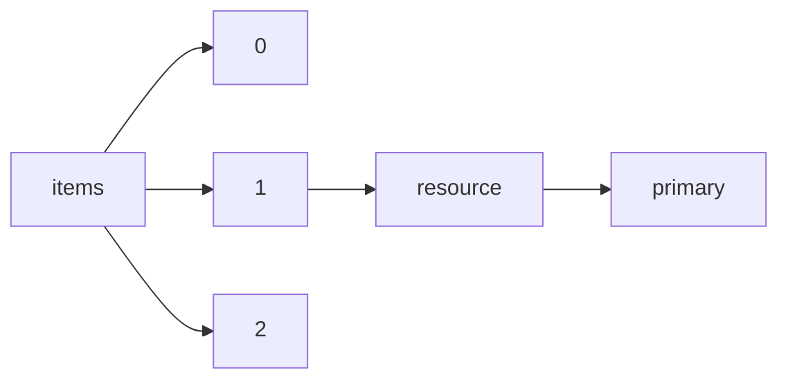

!!! warning "This document is not official Crossref documentation"
# Primary
PATH = items/array/resource/primary(1)  
Occurs 143 499 704 times  
{ .annotate }

1. A route to an element, for example:  
   The route "items/array/resource/primary" corresponds to navigating through the JSON indices as  
   ["items"][0]["resource"]["primary"]  

## URL
See more information: [items/array/resource/primary/URL](URL/index.md)  
Occurs 143 499 704 timess  
Unique values: > 999  

!!! note "Due to current limitations, only the first 1,000 unique values are counted."

| **Row** | **Value** `String`                                                                        | **Count** `Int64` |
|--------:|---------------------------------------------------------------------------------------------:|---------------------:|
| **1**   | http://www.crossref.org/deleted\_DOI.html                                                    | 180 616              |
| **2**   | https://www.elsevier.com/books-and-journals/deleted-doi                                      | 20 630               |
| **3**   | http://www.bloomsburycollections.com/book/the-fairchild-books-dictionary-of-textiles/        | 17 208               |
| **4**   | https://www.crossref.org/\_defunct-doi                                                       | 5 347                |
| **5**   | http://192.16.18.219:8005/default.xqy                                                        | 4 201                |
| **6**   | https://brill.com                                                                            | 4 124                |
| **7**   | http://www.bloomsburycollections.com/book/the-fairchild-books-dictionary-of-interior-design/ | 4 087                |
| **8**   | http://www.pediatricnews.com/                                                                | 3 883                |
| **9**   | http://www.springerlink.com/content/0013-8703/                                               | 3 783                |
| **10**  | http://www.bloomsburycollections.com/book/the-fairchild-books-dictionary-of-fashion/         | 2 891                |
| ... | ... | ... |

