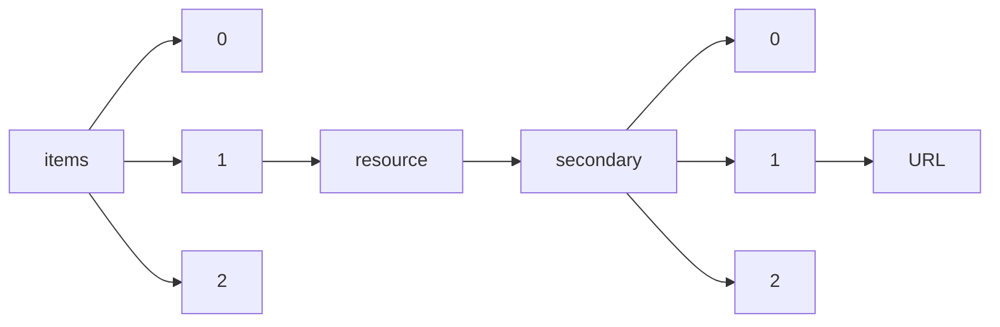

!!! warning "This document is not official Crossref documentation"
# URL
PATH = items/array/resource/secondary/array/URL(1)  
Occurs 432 867 times  
Unique values: > 999  
{ .annotate }

1. A route to an element, for example:  
   The route "items/array/resource/secondary/array/URL" corresponds to navigating through the JSON indices as  
   ["items"][0]["resource"]["secondary"][0]["URL"]  

!!! note "Due to current limitations, only the first 1,000 unique values are counted."

| **Row** | **Value** `String`                                                                                        | **Count** `Int64` |
|--------:|-------------------------------------------------------------------------------------------------------------:|---------------------:|
| **1**   | https://www.bloomsburycollections.com/book/british-colour-cinema-practices-and-theories/interview            | 20                   |
| **2**   | http://doi.wiley.com/                                                                                        | 18                   |
| **3**   | https://www.bloomsburycollections.com/book/the-great-fashion-designers-from-chanel-to-mcqueen-the-na         | 14                   |
| **4**   | http://www.acfco.or.kr/inopds/bbs\_list.php?code=pds01&nbd=pds01&dbcal=no                                    | 12                   |
| **5**   | https://www.bloomsburycollections.com/book/the-handbook-of-food-research/editorial-introduction              | 8                    |
| **6**   | https://www.bloomsburycollections.com/book/the-handbook-of-design-management/editorial-introduction          | 8                    |
| **7**   | http://www.z.cn/dp/B01HHJG25I                                                                                | 8                    |
| **8**   | https://www.bloomsburycollections.com/book/the-handbook-of-visual-culture/editorial-introduction             | 8                    |
| **9**   | https://www.amazon.com/dp/B01HHJG25I                                                                         | 8                    |
| **10**  | https://www.bloomsburyarchitecturelibrary.com/encyclopedia-chapter?docid=b-9781350138681&tocid=b-978         | 6                    |
| **11**  | https://www.bloomsburyarchitecturelibrary.com/encyclopedia-chapter?docid=b-9781350138681&tocid=b-978         | 6                    |
| **12**  | https://www.bloomsburyarchitecturelibrary.com/encyclopedia-chapter?docid=b-9781350138681&tocid=b-978         | 6                    |
| **13**  | https://www.bloomsburyarchitecturelibrary.com/encyclopedia-chapter?docid=b-9781350138681&tocid=b-978         | 6                    |
| **14**  | https://www.bloomsburyarchitecturelibrary.com/encyclopedia-chapter?docid=b-9781350138681&tocid=b-978         | 6                    |
| **15**  | https://www.bloomsburyarchitecturelibrary.com/encyclopedia-chapter?docid=b-9781350138681&tocid=b-978         | 6                    |
| **16**  | https://www.bloomsburyarchitecturelibrary.com/encyclopedia-chapter?docid=b-9781350138681&tocid=b-978         | 6                    |
| **17**  | https://www.bloomsburyarchitecturelibrary.com/encyclopedia-chapter?docid=b-9781350138681&tocid=b-978         | 6                    |
| **18**  | https://www.bloomsburyarchitecturelibrary.com/encyclopedia-chapter?docid=b-9781350138681&tocid=b-978         | 6                    |
| **19**  | https://www.bloomsburyarchitecturelibrary.com/encyclopedia-chapter?docid=b-9781350138681&tocid=b-978         | 6                    |
| **20**  | https://www.bloomsburyarchitecturelibrary.com/encyclopedia-chapter?docid=b-9781350138681&tocid=b-978         | 6                    |
| **21**  | https://www.bloomsburyarchitecturelibrary.com/encyclopedia-chapter?docid=b-9781350138681&tocid=b-978         | 6                    |
| **22**  | https://www.bloomsburyarchitecturelibrary.com/encyclopedia-chapter?docid=b-9781350138681&tocid=b-978         | 6                    |
| **23**  | https://www.bloomsburyarchitecturelibrary.com/encyclopedia-chapter?docid=b-9781350138681&tocid=b-978         | 6                    |
| **24**  | https://www.bloomsburyarchitecturelibrary.com/encyclopedia-chapter?docid=b-9781350138681&tocid=b-978         | 6                    |
| **25**  | https://www.bloomsburyarchitecturelibrary.com/encyclopedia-chapter?docid=b-9781350138681&tocid=b-978         | 6                    |
| **26**  | https://www.bloomsburyarchitecturelibrary.com/encyclopedia-chapter?docid=b-9781350138681&tocid=b-978         | 6                    |
| **27**  | https://www.bloomsburyarchitecturelibrary.com/encyclopedia-chapter?docid=b-9781350138681&tocid=b-978         | 6                    |
| **28**  | https://www.bloomsburyarchitecturelibrary.com/encyclopedia-chapter?docid=b-9781350138681&tocid=b-978         | 6                    |
| **29**  | https://www.bloomsburyarchitecturelibrary.com/encyclopedia?docid=b-9781350138681                             | 6                    |
| **30**  | https://www.bloomsburyarchitecturelibrary.com/encyclopedia-chapter?docid=b-9781350138681&tocid=b-978         | 6                    |
| **31**  | https://www.bloomsburyarchitecturelibrary.com/encyclopedia-chapter?docid=b-9781350138681&tocid=b-978         | 6                    |
| **32**  | https://www.bloomsburyarchitecturelibrary.com/encyclopedia-chapter?docid=b-9781350138681&tocid=b-978         | 6                    |
| **33**  | https://www.bloomsburyarchitecturelibrary.com/encyclopedia-chapter?docid=b-9781350138681&tocid=b-978         | 6                    |
| **34**  | https://www.bloomsburyarchitecturelibrary.com/encyclopedia-chapter?docid=b-9781350138681&tocid=b-978         | 6                    |
| **35**  | https://www.bloomsburyarchitecturelibrary.com/encyclopedia-chapter?docid=b-9781350138681&tocid=b-978         | 6                    |
| **36**  | https://www.bloomsburyarchitecturelibrary.com/encyclopedia-chapter?docid=b-9781350138681&tocid=b-978         | 6                    |
| **37**  | https://www.bloomsburyarchitecturelibrary.com/encyclopedia-chapter?docid=b-9781350138681&tocid=b-978         | 6                    |
| **38**  | https://www.bloomsburyarchitecturelibrary.com/encyclopedia-chapter?docid=b-9781350138681&tocid=b-978         | 6                    |
| **39**  | https://www.bloomsburyarchitecturelibrary.com/encyclopedia-chapter?docid=b-9781350138681&tocid=b-978         | 6                    |
| **40**  | https://www.bloomsburyarchitecturelibrary.com/encyclopedia-chapter?docid=b-9781350138681&tocid=b-978         | 6                    |
| **41**  | https://www.bloomsburycollections.com/book/the-bloomsbury-handbook-of-the-anthropology-of-sound/puls         | 6                    |
| **42**  | https://www.bloomsburycollections.com/book/global-brooklyn-designing-food-experiences-in-world-citie         | 6                    |
| **43**  | https://www.bloomsburyarchitecturelibrary.com/encyclopedia-chapter?docid=b-9781350138681&tocid=b-978         | 6                    |
| **44**  | https://www.bloomsburycollections.com/book/the-bloomsbury-handbook-of-the-anthropology-of-sound/coda         | 5                    |
| **45**  | https://www.bloomsburycollections.com/book/fashion-studies-research-methods-sites-and-practices/intr         | 4                    |
| **46**  | https://www.bloomsburycollections.com/book/in-the-studio-with-joyce-piven-theatre-games-story-theatr         | 4                    |
| **47**  | https://www.bloomsburyfashioncentral.com/products/berg-fashion-library/book/bound-to-please-a-histor         | 4                    |
| **48**  | https://www.bloomsburycollections.com/book/screen-adaptations-shakespeares-the-tempest-the-relations         | 4                    |
| **49**  | https://www.bloomsburycollections.com/book/future-indefinite-with-the-unfinished-past-conditional/pa         | 4                    |
| **50**  | https://www.bloomsburycollections.com/book/music-video-histories-aesthetics-media/introduction               | 4                    |
| **51**  | http://www.oxfordscholarship.com/view/10.1093/acprof:oso/9780199587094.001.0001/acprof-9780199587094         | 4                    |
| **52**  | https://www.bloomsburycollections.com/book/writing-design-words-and-objects/introduction                     | 4                    |
| **53**  | https://www.bloomsburycollections.com/book/play-acting-a-guide-to-theatre-workshops/introduction             | 4                    |
| **54**  | https://www.bloomsburycollections.com/book/in-place-of-a-show-what-happens-inside-theatres-when-noth         | 4                    |
| **55**  | https://www.bloomsburycollections.com/book/design-roots-culturally-significant-designs-products-and-         | 3                    |
| **56**  | https://www.bloomsburycollections.com/book/key-writings/introduction                                         | 3                    |
| **57**  | https://www.bloomsburycollections.com/book/enchanting-david-bowie-space-time-body-memory/introductio         | 3                    |
| **58**  | https://www.dramaonlinelibrary.com/encyclopedia-chapter?docid=b-9781474243353&tocid=b-9781474243353-         | 2                    |
| **59**  | http://srmo.sagepub.com/view/sage-qualitative-research-methods/d64.xml                                       | 2                    |
| **60**  | https://www.bloomsburycollections.com/book/stripes-grids-and-checks/ch6-checks-and-tartans                   | 2                    |
| **61**  | https://www.bloomsburyfoodlibrary.com/encyclopedia-chapter?docid=b-9781350042186&tocid=b-97813500421         | 2                    |
| **62**  | https://www.screenstudies.com/encyclopedia-chapter?docid=b-9781838710545&tocid=b-9781838710545-00012         | 2                    |
| **63**  | https://www.theologyandreligiononline.com/encyclopedia-chapter?docid=b-9780567673190&tocid=b-9780567         | 2                    |
| **64**  | https://www.bloomsburycollections.com/book/digital-food-from-paddock-to-platform/ch4-cooking-in-the-         | 2                    |
| **65**  | https://www.bloomsburyfoodlibrary.com/encyclopedia-chapter?docid=b-9781350044616&tocid=b-97813500446         | 2                    |
| **66**  | https://www.bloomsburycollections.com/book/a-cultural-history-of-food-in-the-renaissance-volume-3/ch         | 2                    |
| **67**  | https://www.bloomsburyfashioncentral.com/products/berg-fashion-library/book/appearance-and-power/ack         | 2                    |
| **68**  | http://srmo.sagepub.com/view/sage-quantitative-research-methods/d43.xml                                      | 2                    |
| **69**  | https://www.bloomsburycollections.com/book/100-road-movies-bfi-screen-guides/butterfly-kiss                  | 2                    |
| **70**  | https://oxfordhandbooks.com/view/10.1093/law/9780198825203.001.0001/law-9780198825203-chapter-19             | 2                    |
| **71**  | https://www.screenstudies.com/encyclopedia-chapter?docid=b-9781501343520&tocid=b-9781501343520-chapt         | 2                    |
| **72**  | https://www.bloomsburycollections.com/book/the-bloomsbury-handbook-of-popular-music-and-social-class         | 2                    |
| **73**  | https://sk.sagepub.com/reference/hdbk\_familybusiness/n28.i4241.xml                                          | 2                    |
| **74**  | https://www.bloomsburycollections.com/book/deleuze-and-cinema-the-film-concepts                              | 2                    |
| **75**  | https://www.bloomsburycollections.com/book/islamic-fashion-and-anti-fashion-new-perspectives-from-eu         | 2                    |
| **76**  | https://www.bloomsburycollections.com/book/100-british-documentaries-bfi-screen-guides/o-connell-bri         | 2                    |
| **77**  | https://www.bloomsburyfoodlibrary.com/encyclopedia-chapter?docid=b-9781350044838&tocid=b-97813500448         | 2                    |
| **78**  | http://www.pdcnet.org/oom/service?url\_ver=Z39.88-2004&rft\_val\_fmt=&rft.imuse\_id=jsce\_2014\_0034\_0001\_ | 2                    |
| **79**  | https://www.bloomsburycollections.com/book/global-denim/ch2-diverting-denim-screening-jeans-in-bolly         | 2                    |
| **80**  | https://www.bloomsburypopularmusic.com/monograph-detail?docid=b-9781501305214&tocid=b-9781501305214-         | 2                    |
| **81**  | https://www.dramaonlinelibrary.com/encyclopedia-chapter?docid=b-9781350054790&tocid=b-9781350054790-         | 2                    |
| **82**  | https://www.bloomsburypopularmusic.com/encyclopedia-chapter?docid=b-9781501330605&tocid=b-9781501330         | 2                    |
| **83**  | http://triggered.stanford.clockss.org/ServeContent?url=http%3A%2F%2Finsights.sagepub.com%2Fglycosami         | 2                    |
| **84**  | http://www.pdcnet.org/oom/service?url\_ver=Z39.88-2004&rft\_val\_fmt=&rft.imuse\_id=jsce\_2018\_0038\_0002\_ | 2                    |
| **85**  | https://www.screenstudies.com/encyclopedia?docid=b-9781501302640                                             | 2                    |
| **86**  | https://brill.com/view/title/36865                                                                           | 2                    |
| **87**  | http://www.bloomsburycollections.com/book/100-silent-films-bfi-screen-guides/the-big-swallow                 | 2                    |
| **88**  | https://www.bloomsburycollections.com/book/bond-girls-body-fashion-and-gender/ch1-bond-james-bond-ma         | 2                    |
| **89**  | https://www.bloomsburypopularmusic.com/monograph-detail?docid=b-9781501305221&tocid=b-9781501305221-         | 2                    |
| **90**  | https://www.bloomsburycollections.com/book/an-anthology-of-australian-albums-critical-engagements/ch         | 2                    |
| **91**  | https://www.becs-bloomsbury.com/encyclopedia-chapter?docid=b-9781350091269&tocid=b-9781350091269-cha         | 2                    |
| **92**  | https://www.bloomsburycollections.com/book/advertising-menswear-masculinity-and-fashion-in-the-briti         | 2                    |
| **93**  | https://www.dramaonlinelibrary.com/encyclopedia-chapter?docid=b-9781472572288&tocid=b-9781472572288-         | 2                    |
| **94**  | https://www.bloomsburydesignlibrary.com/encyclopedia-chapter?docid=b-9781474287135&tocid=b-978147428         | 2                    |
| **95**  | https://www.bloomsburycollections.com/book/an-introduction-to-medieval-jewish-philosophy/concluding-         | 2                    |
| **96**  | https://www.dramaonlinelibrary.com/encyclopedia-chapter?docid=b-9781474213202&tocid=b-9781474213202-         | 2                    |
| **97**  | https://www.bloomsburyfashioncentral.com/products/fairchild-books/book/the-interior-plan-concepts-an         | 2                    |
| **98**  | https://www.screenstudies.com/encyclopedia-chapter?docid=b-9781838710088&tocid=b-9781838710088-00294         | 2                    |
| **99**  | https://www.becs-bloomsbury.com/encyclopedia-chapter?docid=b-9781350091184&tocid=b-9781350091184-cha         | 2                    |
| **100** | https://www.bloomsburycollections.com/book/essentials-of-stage-management                                    | 2                    |
| **101** | https://www.bloomsburymedievalstudies.com/encyclopedia?docid=b-9781350049673                                 | 2                    |
| **102** | http://triggered.stanford.clockss.org/ServeContent?url=http%3A%2F%2Finsights.sagepub.com%2Fimplicati         | 2                    |
| **103** | https://www.bloomsburycollections.com/book/staging-beckett-in-ireland-and-northern-ireland/ch2-pract         | 2                    |
| **104** | https://www.bloomsburycollections.com/book/the-history-of-fashion-journalism/ch9-a-global-discourse-         | 2                    |
| **105** | https://www.dramaonlinelibrary.com/monograph-detail?docid=b-9781474223898&tocid=b-9781474223898-chap         | 2                    |
| **106** | https://www.screenstudies.com/encyclopedia-chapter?docid=b-9781838710521&tocid=b-9781838710521-00016         | 2                    |
| **107** | https://www.screenstudies.com/encyclopedia-chapter?docid=b-9781838710521&tocid=b-9781838710521-00013         | 2                    |
| **108** | https://www.screenstudies.com/encyclopedia-chapter?docid=b-9781838710712&tocid=b-9781838710712-chapt         | 2                    |
| **109** | https://www.bloomsburycollections.com/book/contemporary-indonesian-fashion-through-the-looking-glass         | 2                    |
| **110** | https://www.screenstudies.com/encyclopedia-chapter?docid=b-9781838710569&tocid=b-9781838710569-00010         | 2                    |
| **111** | https://www.bloomsburycollections.com/book/eating-and-believing-interdisciplinary-perspectives-on-ve         | 2                    |
| **112** | http://www.pdcnet.org/oom/service?url\_ver=Z39.88-2004&rft\_val\_fmt=&rft.imuse\_id=jsce\_2018\_0038\_0001\_ | 2                    |
| **113** | https://www.screenstudies.com/encyclopedia-chapter?docid=b-9781838710774&tocid=b-9781838710774-chapt         | 2                    |
| **114** | https://www.bloomsburycollections.com/book/the-bloomsbury-handbook-of-popular-music-and-social-class         | 2                    |
| **115** | https://www.dramaonlinelibrary.com/monograph-detail?docid=b-9781474275057&tocid=b-9781474275057-chap         | 2                    |
| **116** | https://www.bloomsburymedievalstudies.com/encyclopedia-chapter?docid=b-9781350078239&tocid=b-9781350         | 2                    |
| **117** | https://www.bloomsburyarchitecturelibrary.com/encyclopedia-chapter?docid=b-9781474254991&tocid=b-978         | 2                    |
| **118** | https://www.bloomsburycollections.com/book/culinary-capital/conclusion                                       | 2                    |
| **119** | https://www.bloomsburycollections.com/book/modern-asian-theatre-and-performance-1900-2000/conclusion         | 2                    |
| **120** | https://www.bloomsburycollections.com/book/the-sound-of-musicals/introduction-how-do-you-solve-a-pro         | 2                    |
| **121** | https://www.screenstudies.com/encyclopedia-chapter?docid=b-9781838710651&tocid=b-9781838710651-00003         | 2                    |
| **122** | https://www.bloomsburycollections.com/book/getting-the-joke-the-inner-workings-of-stand-up-comedy            | 2                    |
| **123** | http://muse.jhu.edu/content/crossref/journals/journal\_of\_korean\_studies/v019/19.1.lee01.html              | 2                    |
| **124** | https://www.bloomsburycollections.com/book/100-european-horror-films-bfi-screen-guides/the-blood-spa         | 2                    |
| **125** | https://www.dramaonlinelibrary.com/encyclopedia-chapter?docid=b-9781472567918&tocid=b-9781472567918-         | 2                    |
| **126** | https://www.bloomsburyfoodlibrary.com/encyclopedia-chapter?docid=b-9781350047631&tocid=b-97813500476         | 2                    |
| **127** | https://www.screenstudies.com/encyclopedia-chapter?docid=b-9781838710583&tocid=b-9781838710583-00007         | 2                    |
| **128** | https://brill.com/view/title/37072                                                                           | 2                    |
| **129** | https://www.dramaonlinelibrary.com/encyclopedia-chapter?docid=b-9781474244428&tocid=b-9781474244428-         | 2                    |
| **130** | https://www.bloomsburycollections.com/book/a-cultural-history-of-dress-and-fashion-in-the-modern-age         | 2                    |
| **131** | https://www.bloomsburycollections.com/book/the-sasanian-era-volume-volume-iii-the-idea-of-iran/ch7-r         | 2                    |
| **132** | http://triggered.stanford.clockss.org/ServeContent?url=http%3A%2F%2Finsights.sagepub.com%2Fa-new-era         | 2                    |
| **133** | https://www.dramaonlinelibrary.com/encyclopedia-chapter?docid=b-9781408166529&tocid=b-9781408166529-         | 2                    |
| **134** | https://www.dramaonlinelibrary.com/encyclopedia-chapter?docid=b-9781408179734&tocid=b-9781408179734-         | 2                    |
| **135** | https://www.bloomsburycollections.com/book/100-westerns-bfi-screen-guides/way-out-west                       | 2                    |
| **136** | https://www.bloomsburycollections.com/book/inculturation-of-the-jesus-tradition-the-impact-of-jesus-         | 2                    |
| **137** | https://www.bloomsburycollections.com/book/a-john-heskett-reader-design-history-economics/ch22-a-des         | 2                    |
| **138** | https://www.bloomsburydesignlibrary.com/encyclopedia-chapter?docid=b-9781474254991&tocid=b-978147425         | 2                    |
| **139** | https://www.dramaonlinelibrary.com/encyclopedia-chapter?docid=b-9781472517418&tocid=b-9781472517418-         | 2                    |
| **140** | https://www.screenstudies.com/encyclopedia-chapter?docid=b-9781838710613&tocid=b-9781838710613-00006         | 2                    |
| **141** | https://www.theologyandreligiononline.com/encyclopedia-chapter?docid=b-9780567691460&tocid=b-9780567         | 2                    |
| **142** | https://www.bloomsburycollections.com/book/simon-stephens-a-working-diary/simon-stephens-a-working-d         | 2                    |
| **143** | https://www.bloomsburycollections.com/book/radical-decadence-excess-in-contemporary-feminist-textile         | 2                    |
| **144** | https://www.bloomsburycollections.com/book/from-stage-to-screen-a-theatre-actors-guide-to-working-on         | 2                    |
| **145** | https://www.bloomsburycollections.com/book/the-slave-girls-of-baghdad-the-qiyan-in-the-early-abbasid         | 2                    |
| **146** | https://www.screenstudies.com/encyclopedia-chapter?docid=b-9781838710620&tocid=b-9781838710620-00007         | 2                    |
| **147** | https://www.screenstudies.com/encyclopedia-chapter?docid=b-9781838710521&tocid=b-9781838710521-00001         | 2                    |
| **148** | https://www.screenstudies.com/encyclopedia-chapter?docid=b-9781501340413&tocid=b-9781501340413-chapt         | 2                    |
| **149** | https://www.bloomsburycollections.com/book/fashion-under-fascism-beyond-the-black-shirt/ch1-introduc         | 2                    |
| **150** | https://www.bloomsburyfoodlibrary.com/encyclopedia-chapter?docid=b-9780755696147&tocid=b-97807556961         | 2                    |
| **151** | https://www.screenstudies.com/encyclopedia-chapter?docid=b-9781350150799&tocid=b-9781350150799-chapt         | 2                    |
| **152** | https://www.screenstudies.com/encyclopedia-chapter?docid=b-9781838710651&tocid=b-9781838710651-00015         | 2                    |
| **153** | https://www.bloomsburyfashioncentral.com/products/berg-fashion-library/book/folk-dress-in-europe-and         | 2                    |
| **154** | https://www.bloomsburycollections.com/book/the-medieval-christian-philosophers-an-introduction/epilo         | 2                    |
| **155** | http://www.pdcnet.org/oom/service?url\_ver=Z39.88-2004&rft\_val\_fmt=&rft.imuse\_id=jsce\_2016\_0036\_0001\_ | 2                    |
| **156** | https://www.bloomsburycollections.com/book/successful-school-leadership-international-perspectives/n         | 2                    |
| **157** | https://www.bloomsburycollections.com/book/design-as-future-making/contributor-biographies                   | 2                    |
| **158** | https://www.dramaonlinelibrary.com/encyclopedia?docid=b-9781408164303                                        | 2                    |
| **159** | http://srmo.sagepub.com/view/sage-qualitative-research-methods/d2.xml                                        | 2                    |
| **160** | http://srmo.sagepub.com/view/sage-biographical-research/n11.xml                                              | 2                    |
| **161** | https://www.bloomsburycollections.com/book/food-ethnographic-encounters/ch5-revisiting-lao-food-pain         | 2                    |
| **162** | https://www.screenstudies.com/encyclopedia-chapter?docid=b-9781838710781&tocid=b-9781838710781-chapt         | 2                    |
| **163** | https://www.bloomsburypopularmusic.com/encyclopedia-chapter?docid=b-9781501330582&tocid=b-9781501330         | 2                    |
| **164** | https://www.bloomsburycollections.com/book/cinema-beyond-territory-inflight-entertainment-and-atmosp         | 2                    |
| **165** | https://www.theologyandreligiononline.com/encyclopedia-chapter?docid=b-9780567691514&tocid=b-9780567         | 2                    |
| **166** | https://www.screenstudies.com/encyclopedia-chapter?docid=b-9781838710644&tocid=b-9781838710644-00002         | 2                    |
| **167** | https://www.bloomsburycollections.com/book/money-for-nothing-a-history-of-the-music-video-from-the-b         | 2                    |
| **168** | https://www.dramaonlinelibrary.com/encyclopedia-chapter?docid=b-9781474247368&tocid=b-9781474247368-         | 2                    |
| **169** | https://www.bloomsburypopularmusic.com/encyclopedia-chapter?docid=b-9781501330599&tocid=b-9781501330         | 2                    |
| **170** | https://www.dramaonlinelibrary.com/encyclopedia-chapter?docid=b-9781472576965&tocid=b-9781472576965-         | 2                    |
| **171** | http://www.pdcnet.org/oom/service?url\_ver=Z39.88-2004&rft\_val\_fmt=&rft.imuse\_id=jsce\_2014\_0034\_0002\_ | 2                    |
| **172** | https://www.bloomsburycollections.com/book/the-theatre-of-caryl-churchill/ch6-other-critical-perspec         | 2                    |
| **173** | https://www.bloomsburycollections.com/book/italian-cinema-from-the-silent-screen-to-the-digital-imag         | 2                    |
| **174** | https://www.screenstudies.com/encyclopedia-chapter?docid=b-9781838710538&tocid=b-9781838710538-00003         | 2                    |
| **175** | https://www.screenstudies.com/encyclopedia-chapter?docid=b-9781838710798&tocid=b-9781838710798-chapt         | 2                    |
| **176** | https://www.bloomsburycollections.com/book/clothing-and-landscape-in-victorian-england-working-class         | 2                    |
| **177** | https://www.bloomsburycollections.com/book/the-social-life-of-kimono-japanese-fashion-past-and-prese         | 2                    |
| **178** | https://www.bloomsburymedievalstudies.com/encyclopedia-chapter?docid=b-9780755694778&tocid=b-9780755         | 2                    |
| **179** | https://www.bloomsburycollections.com/book/medieval-women-and-war-female-roles-in-the-old-french-tra         | 2                    |
| **180** | https://www.bloomsburycollections.com/book/diplomacy-in-the-early-islamic-world-a-tenth-century-trea         | 2                    |
| **181** | https://www.bloomsburycollections.com/book/a-long-hard-look-at-psycho/notes                                  | 2                    |
| **182** | https://www.bloomsburycollections.com/book/english-renaissance-tragedy-ideas-of-freedom                      | 2                    |
| **183** | https://www.bloomsburycollections.com/book/lcd-soundsystems-sound-of-silver/the-ways-we-show-our-age         | 2                    |
| **184** | https://www.dramaonlinelibrary.com/encyclopedia-chapter?docid=b-9781408172360&tocid=b-9781408172360-         | 2                    |
| **185** | https://www.bloomsburycollections.com/book/encountering-ensemble/snapshot-#10                                | 2                    |
| **186** | https://www.bloomsburycollections.com/book/uniform-clothing-and-discipline-in-the-modern-world/ptFiv         | 2                    |
| **187** | https://www.screenstudies.com/encyclopedia-chapter?docid=b-9781838710583&tocid=b-9781838710583-00008         | 2                    |
| **188** | https://www.dramaonlinelibrary.com/encyclopedia-chapter?docid=b-9781472591517&tocid=b-9781472591517-         | 2                    |
| **189** | https://www.bloomsburycollections.com/book/education-and-hiv-aids-education-as-a-humanitarian-respon         | 2                    |
| **190** | https://www.bloomsburycollections.com/book/food-words-essays-in-culinary-culture/trust                       | 2                    |
| **191** | https://www.bloomsburyarchitecturelibrary.com/encyclopedia-chapter?docid=b-9781474263788&tocid=b-978         | 2                    |
| **192** | https://www.bloomsburycollections.com/book/100-animated-feature-films-bfi-screen-guides/the-lion-kin         | 2                    |
| **193** | https://www.bloomsburycollections.com/book/food-families-and-work/ch7-changing-families-changing-foo         | 2                    |
| **194** | https://brill.com/view/title/36633                                                                           | 2                    |
| **195** | https://www.screenstudies.com/encyclopedia-chapter?docid=b-9781838711009&tocid=b-9781838711009-chapt         | 2                    |
| **196** | https://www.bloomsburypopularmusic.com/monograph-detail?docid=b-9781501321160&tocid=b-9781501321160-         | 2                    |
| **197** | https://www.bloomsburycollections.com/book/shakespeare-up-close-reading-early-modern-texts/ch8-the-p         | 2                    |
| **198** | https://www.bloomsburycollections.com/book/children-as-decision-makers-in-education-sharing-experien         | 2                    |
| **199** | https://www.bloomsburyfoodlibrary.com/encyclopedia-chapter?docid=b-9781350029996&tocid=b-97813500299         | 2                    |
| **200** | https://www.screenstudies.com/encyclopedia-chapter?docid=b-9781838710804&tocid=b-9781838710804-chapt         | 2                    |
| **201** | https://www.dramaonlinelibrary.com/monograph-detail?docid=b-9781472581754&tocid=b-9781472581754-chap         | 2                    |
| **202** | https://brill.com/view/title/36979                                                                           | 2                    |
| **203** | https://www.screenstudies.com/encyclopedia-chapter?docid=b-9781501340307&tocid=b-9781501340307-00050         | 2                    |
| **204** | https://www.bloomsburymedievalstudies.com/encyclopedia-chapter?docid=b-9781350044579&tocid=b-9781350         | 2                    |
| **205** | https://www.bloomsburyfoodlibrary.com/encyclopedia-chapter?docid=b-9781350047655&tocid=b-97813500476         | 2                    |
| **206** | https://www.bloomsburycollections.com/book/working-in-american-theatre-a-brief-history-career-guide-         | 2                    |
| **207** | https://www.bloomsburyfoodlibrary.com/encyclopedia-chapter?docid=b-9781474262354&tocid=b-97814742623         | 2                    |
| **208** | http://www.pdcnet.org/oom/service?url\_ver=Z39.88-2004&rft\_val\_fmt=&rft.imuse\_id=jsce\_2012\_0032\_0002\_ | 2                    |
| **209** | http://www.pdcnet.org/oom/service?url\_ver=Z39.88-2004&rft\_val\_fmt=&rft.imuse\_id=jsce\_2014\_0034\_0001\_ | 2                    |
| **210** | https://www.bloomsburycollections.com/book/chinese-fashion-from-mao-to-now/ch1-the-post-mao-fashion-         | 2                    |
| **211** | https://www.screenstudies.com/encyclopedia-chapter?docid=b-9781838710781&tocid=b-9781838710781-chapt         | 2                    |
| **212** | https://www.bloomsburypopularmusic.com/monograph-detail?docid=b-9781501305221&tocid=b-9781501305221-         | 2                    |
| **213** | https://www.bloomsburyfashioncentral.com/products/berg-fashion-library/book/old-clothes-new-looks-se         | 2                    |
| **214** | https://www.bloomsburycollections.com/book/when-genres-collide-when-genres-collide-down-beat-rolling         | 2                    |
| **215** | https://www.bloomsburycollections.com/book/islamic-jerusalem-and-its-christians-a-history-of-toleran         | 2                    |
| **216** | https://www.bloomsburycollections.com/book/100-animated-feature-films-bfi-screen-guides/the-iron-gia         | 2                    |
| **217** | https://www.bloomsburypopularmusic.com/encyclopedia-chapter?docid=b-9781501330650&tocid=b-9781501330         | 2                    |
| **218** | https://www.dramaonlinelibrary.com/encyclopedia-chapter?docid=b-9781408175477&tocid=b-9781408175477-         | 2                    |
| **219** | https://www.dramaonlinelibrary.com/encyclopedia-chapter?docid=b-9781472577122&tocid=b-9781472577122-         | 2                    |
| **220** | https://brill.com/view/title/36676                                                                           | 2                    |
| **221** | https://www.bloomsburycollections.com/book/fashioning-socialism-clothing-politics-and-consumer-cultu         | 2                    |
| **222** | https://www.bloomsburycollections.com/book/100-british-documentaries-bfi-screen-guides/the-shadows-i         | 2                    |
| **223** | http://triggered.stanford.clockss.org/ServeContent?url=http%3A%2F%2Finsights.sagepub.com%2Fexome-seq         | 2                    |
| **224** | https://www.bloomsburycollections.com/book/faith-and-fashion-in-turkey-consumption-politics-and-isla         | 2                    |
| **225** | https://www.bloomsburycollections.com/book/steel-a-design-cultural-and-ecological-history/ch9-futuri         | 2                    |
| **226** | https://www.becs-bloomsbury.com/encyclopedia-chapter?docid=b-9781472591517&tocid=b-9781472591517-000         | 2                    |
| **227** | https://www.bloomsburyfoodlibrary.com/encyclopedia-chapter?docid=b-9781350047679&tocid=b-97813500476         | 2                    |
| **228** | https://www.dramaonlinelibrary.com/encyclopedia-chapter?docid=b-9781474279666&tocid=b-9781474279666-         | 2                    |
| **229** | https://www.screenstudies.com/encyclopedia-chapter?docid=b-9781838710545&tocid=b-9781838710545-00013         | 2                    |
| **230** | https://brill.com/view/title/37705                                                                           | 2                    |
| **231** | http://publish.kne-publishing.com/index.php/JAD/article/view/357                                             | 2                    |
| **232** | https://www.bloomsburydesignlibrary.com/encyclopedia-chapter?docid=b-9781350051201&tocid=b-978135005         | 2                    |
| **233** | https://www.bloomsburycollections.com/book/theatre-in-the-dark-shadow-gloom-and-blackout-in-contempo         | 2                    |
| **234** | https://www.bloomsburycollections.com/book/the-methuen-drama-guide-to-contemporary-south-african-the         | 2                    |
| **235** | https://www.bloomsburycollections.com/book/designing-the-french-interior-the-modern-home-and-mass-me         | 2                    |
| **236** | https://www.bloomsburycollections.com/book/a-live-one-331-3/preparatory-to-anything-else                     | 2                    |
| **237** | https://www.bloomsburycollections.com/book/on-shakespeares-sonnets-a-poets-celebration/20                    | 2                    |
| **238** | https://www.dramaonlinelibrary.com/encyclopedia-chapter?docid=b-9781408184332&tocid=b-9781408184332-         | 2                    |
| **239** | https://www.dramaonlinelibrary.com/encyclopedia?docid=b-9781472578969                                        | 2                    |
| **240** | https://www.bloomsburycollections.com/book/working-in-american-theatre-a-brief-history-career-guide-         | 2                    |
| **241** | https://www.bloomsburycollections.com/book/representing-italy-through-food/ch1-and-at-last-the-farme         | 2                    |
| **242** | https://www.bloomsburyfoodlibrary.com/encyclopedia-chapter?docid=b-9781350044579&tocid=b-97813500445         | 2                    |
| **243** | https://www.bloomsburycollections.com/book/why-stand-up-matters-how-comedians-manipulate-and-influen         | 2                    |
| **244** | https://www.bloomsburycollections.com/book/steel-a-design-cultural-and-ecological-history/ch6-techno         | 2                    |
| **245** | https://www.bloomsburycollections.com/book/fashion-crimes-dressing-for-deviance/introduction                 | 2                    |
| **246** | https://www.bloomsburycollections.com/book/the-worst-it-can-be-is-a-disaster-the-life-story-of-braha         | 2                    |
| **247** | https://muse.jhu.edu/article/618850                                                                          | 2                    |
| **248** | https://www.screenstudies.com/monograph-detail?docid=b-9781838719456&tocid=b-9781838719456-chapter9          | 2                    |
| **249** | https://www.bloomsburycollections.com/book/100-animated-feature-films-bfi-screen-guides/waltz-with-b         | 2                    |
| **250** | https://www.bloomsburyfashioncentral.com/products/berg-fashion-library/book/dress-gender-and-cultura         | 2                    |
| **251** | https://www.screenstudies.com/encyclopedia-chapter?docid=b-9781838710767&tocid=b-9781838710767-chapt         | 2                    |
| **252** | https://www.bloomsburyculturalhistory.com/encyclopedia-chapter?docid=b-9781350047655&tocid=b-9781350         | 2                    |
| **253** | https://www.screenstudies.com/encyclopedia-chapter?docid=b-9781838710767&tocid=b-9781838710767-chapt         | 2                    |
| **254** | https://www.screenstudies.com/encyclopedia-chapter?docid=b-9781838710583&tocid=b-9781838710583-00008         | 2                    |
| **255** | https://www.screenstudies.com/encyclopedia-chapter?docid=b-9781501328725&tocid=b-9781501328725-chapt         | 2                    |
| **256** | https://www.bloomsburycollections.com/book/seventies-british-cinema/ch3-the-divergence-and-mutation-         | 2                    |
| **257** | https://www.bloomsburycollections.com/book/in-place-of-a-show-what-happens-inside-theatres-when-noth         | 2                    |
| **258** | https://www.screenstudies.com/encyclopedia-chapter?docid=b-9781501302640&tocid=b-9781501302640-chapt         | 2                    |
| **259** | https://www.bloomsburycollections.com/book/inculturation-of-the-jesus-tradition-the-impact-of-jesus-         | 2                    |
| **260** | https://www.dramaonlinelibrary.com/monograph-detail?docid=b-9781408166710&tocid=b-9781408166710-chap         | 2                    |
| **261** | https://www.bloomsburyculturalhistory.com/encyclopedia-chapter?docid=b-9781350044555&tocid=b-9781350         | 2                    |
| **262** | https://www.bloomsburycollections.com/book/islamic-fashion-and-anti-fashion-new-perspectives-from-eu         | 2                    |
| **263** | https://www.bloomsburycollections.com/book/design-and-the-question-of-history/introduction                   | 2                    |
| **264** | https://www.dramaonlinelibrary.com/encyclopedia-chapter?docid=b-9781472580252&tocid=b-9781472580252-         | 2                    |
| **265** | https://www.bloomsburycollections.com/book/jia-zhangkes-hometown-trilogy-xiao-wu-platform-unknown-pl         | 2                    |
| **266** | https://www.bloomsburycollections.com/book/islam-in-the-school-curriculum-symbolic-pedagogy-and-cult         | 2                    |
| **267** | https://www.bloomsburycollections.com/book/the-sound-of-musicals/ch2-british-gaiety-musical-cinema-a         | 2                    |
| **268** | https://www.dramaonlinelibrary.com/encyclopedia?docid=b-9781472555557                                        | 2                    |
| **269** | https://www.bloomsburycollections.com/book/the-arena-concert-music-media-and-mass-entertainment/ch19         | 2                    |
| **270** | https://www.bloomsburymedievalstudies.com/encyclopedia-chapter?docid=b-9780755694778&tocid=b-9780755         | 2                    |
| **271** | https://www.bloomsburycollections.com/book/annie-hall/a-perennial-appeal                                     | 2                    |
| **272** | https://www.dramaonlinelibrary.com/encyclopedia?docid=b-9781408162811                                        | 2                    |
| **273** | http://library.seg.org/doi/abs/10.15530/urtec-2016-2461740                                                   | 2                    |
| **274** | https://www.bloomsburyfashioncentral.com/products/berg-fashion-library/book/wearing-ideology-state-s         | 2                    |
| **275** | https://www.bloomsburycollections.com/book/broadcast-your-shakespeare-continuity-and-change-across-m         | 2                    |
| **276** | http://www.bloomsburycollections.com/book/100-silent-films-bfi-screen-guides/the-marriage-circle             | 2                    |
| **277** | https://www.dramaonlinelibrary.com/encyclopedia-chapter?docid=b-9781408166529&tocid=b-9781408166529-         | 2                    |
| **278** | https://www.dramaonlinelibrary.com/encyclopedia-chapter?docid=b-9781474280402&tocid=b-9781474280402-         | 2                    |
| **279** | https://www.bloomsburycollections.com/book/ibsen-in-practice-relational-readings-of-performance-cult         | 2                    |
| **280** | https://www.bloomsburyfoodlibrary.com/encyclopedia?docid=b-9781350042193                                     | 2                    |
| **281** | https://www.bloomsburycollections.com/book/an-introduction-to-the-foundation-phase-early-years-curri         | 2                    |
| **282** | https://www.bloomsburycollections.com/book/the-theatre-guide-a-comprehensive-a-z-of-the-worlds-best-         | 2                    |
| **283** | https://www.bloomsburypopularmusic.com/encyclopedia-chapter?docid=b-9781501352331&tocid=b-9781501352         | 2                    |
| **284** | http://library.seg.org/doi/abs/10.15530/urtec-2016-2435574                                                   | 2                    |
| **285** | https://www.dramaonlinelibrary.com/monograph-detail?docid=b-9781350054714&tocid=b-9781350054714-chap         | 2                    |
| **286** | https://www.bloomsburycollections.com/book/the-designed-world-images-objects-environments/further-re         | 2                    |
| **287** | https://www.bloomsburymedievalstudies.com/encyclopedia-chapter?docid=b-9781474233156&tocid=b-9781474         | 2                    |
| **288** | https://www.screenstudies.com/encyclopedia-chapter?docid=b-9781501340437&tocid=b-9781501340437-chapt         | 2                    |
| **289** | https://www.screenstudies.com/encyclopedia-chapter?docid=b-9781838710477&tocid=b-9781838710477-00008         | 2                    |
| **290** | https://www.bloomsburycollections.com/book/new-mythologies-in-design-and-culture-reading-signs-and-s         | 2                    |
| **291** | https://www.bloomsburycollections.com/book/womens-cinema-in-contemporary-portugal/ch7-affect-and-the         | 2                    |
| **292** | https://www.screenstudies.com/encyclopedia-chapter?docid=b-9781838710477&tocid=b-9781838710477-00015         | 2                    |
| **293** | https://www.bloomsburyfoodlibrary.com/encyclopedia-chapter?docid=b-9781474229050&tocid=b-97814742290         | 2                    |
| **294** | https://www.bloomsburymedievalstudies.com/encyclopedia-chapter?docid=b-9781474207065&tocid=b-9781474         | 2                    |
| **295** | https://www.screenstudies.com/encyclopedia-chapter?docid=b-9781838710781&tocid=b-9781838710781-chapt         | 2                    |
| **296** | https://www.bloomsburycollections.com/book/beat-drama-playwrights-and-performances-of-the-howl-gener         | 2                    |
| **297** | https://www.bloomsburycollections.com/book/a-live-one-331-3/all-of-the-places-and-people-belong              | 2                    |
| **298** | https://www.dramaonlinelibrary.com/encyclopedia-chapter?docid=b-9781408184707&tocid=b-9781408184707-         | 2                    |
| **299** | http://www.pdcnet.org/oom/service?url\_ver=Z39.88-2004&rft\_val\_fmt=&rft.imuse\_id=jsce\_2016\_0036\_0001\_ | 2                    |
| **300** | https://www.bloomsburycollections.com/book/how-to-write-about-theatre-a-manual-for-critics-students-         | 2                    |
| **301** | https://www.bloomsburyculturalhistory.com/encyclopedia-chapter?docid=b-9781350044531&tocid=b-9781350         | 2                    |
| **302** | https://www.bloomsburyfoodlibrary.com/encyclopedia?docid=b-9781474234719                                     | 2                    |
| **303** | https://www.becs-bloomsbury.com/encyclopedia-chapter?docid=b-9781350091269&tocid=b-9781350091269-cha         | 2                    |
| **304** | https://brill.com/view/title/36613                                                                           | 2                    |
| **305** | https://www.bloomsburyfoodlibrary.com/encyclopedia-chapter?docid=b-9780755696147&tocid=b-97807556961         | 2                    |
| **306** | https://www.screenstudies.com/encyclopedia-chapter?docid=b-9781838710606&tocid=b-9781838710606-00007         | 2                    |
| **307** | https://www.bloomsburycollections.com/book/fashioning-horror-dressing-to-kill-on-screen-and-in-liter         | 2                    |
| **308** | https://www.bloomsburycollections.com/book/little-richard-the-birth-of-rock-n-roll/introduction              | 2                    |
| **309** | http://www.bloomsburycollections.com/book/100-american-independent-films-bfi-screen-guides/synecdoch         | 2                    |
| **310** | https://www.dramaonlinelibrary.com/monograph-detail?docid=b-9781350054714&tocid=b-9781350054714-chap         | 2                    |
| **311** | https://www.dramaonlinelibrary.com/encyclopedia-chapter?docid=b-9781408167601&tocid=b-9781408167601-         | 2                    |
| **312** | https://www.dramaonlinelibrary.com/encyclopedia?docid=b-9781472507051                                        | 2                    |
| **313** | https://www.bloomsburycollections.com/book/food-activism-agency-democracy-and-economy/ch9-the-canadi         | 2                    |
| **314** | https://www.bloomsburycollections.com/book/fashioning-bollywood-the-making-and-meaning-of-hindi-film         | 2                    |
| **315** | https://www.bloomsburypopularmusic.com/monograph-detail?docid=b-9781501305214&tocid=b-9781501305214-         | 2                    |
| **316** | https://www.bloomsburycollections.com/book/homogenic/game-we-re-playing-is-life-bjork-s-virtual-real         | 2                    |
| **317** | https://www.bloomsburycollections.com/book/the-usual-suspects/ch3-on-the-side-of-a-bus                       | 2                    |
| **318** | https://www.bloomsburyfoodlibrary.com/encyclopedia-chapter?docid=b-9780755696888&tocid=b-97807556968         | 2                    |
| **319** | https://www.bloomsburycollections.com/book/political-economy-of-adult-learning-systems-comparative-s         | 2                    |
| **320** | https://www.dramaonlinelibrary.com/monograph-detail?docid=b-9781474294867&tocid=b-9781474294867-chap         | 2                    |
| **321** | https://www.dramaonlinelibrary.com/encyclopedia-chapter?docid=b-9781408166390&tocid=b-9781408166390-         | 2                    |
| **322** | https://www.dramaonlinelibrary.com/encyclopedia-chapter?docid=b-9781408169605&tocid=b-9781408169605-         | 2                    |
| **323** | https://www.bloomsburycollections.com/book/food-power-and-agency/ch6-what-diet-can-do-running-and-ea         | 2                    |
| **324** | https://www.bloomsburycollections.com/book/wr-mysteries-of-the-organism/ch2-chronicle-of-an-exiled-s         | 2                    |
| **325** | https://brill.com/view/title/37520                                                                           | 2                    |
| **326** | https://www.screenstudies.com/encyclopedia-chapter?docid=b-9781838710590&tocid=b-9781838710590-00003         | 2                    |
| **327** | https://www.bloomsburycollections.com/book/language-education-in-the-school-curriculum-issues-of-acc         | 2                    |
| **328** | http://www.bloomsburycollections.com/book/100-film-musicals-bfi-screen-guides/love-me-tonight                | 2                    |
| **329** | https://www.bloomsburyarchitecturelibrary.com/encyclopedia-chapter?docid=b-9781474263788&tocid=b-978         | 2                    |
| **330** | https://www.bloomsburyarchitecturelibrary.com/encyclopedia?docid=b-9781474263788                             | 2                    |
| **331** | http://srmo.sagepub.com/view/sage-internet-research-methods/n64.xml                                          | 2                    |
| **332** | https://www.screenstudies.com/monograph-detail?docid=b-9781838712396&tocid=b-9781838712396-chapter6          | 2                    |
| **333** | https://www.bloomsburyculturalhistory.com/encyclopedia-chapter?docid=b-9781474206402&tocid=b-9781474         | 2                    |
| **334** | https://www.bloomsburycollections.com/book/inside-the-music-of-brian-wilson-the-songs-sounds-and-inf         | 2                    |
| **335** | https://www.screenstudies.com/encyclopedia-chapter?docid=b-9781838710088&tocid=b-9781838710088-00078         | 2                    |
| **336** | https://www.bloomsburyfoodlibrary.com/encyclopedia-chapter?docid=b-9781350042223&tocid=b-97813500422         | 2                    |
| **337** | https://www.bloomsburyculturalhistory.com/encyclopedia-chapter?docid=b-9781350044562&tocid=b-9781350         | 2                    |
| **338** | https://www.bloomsburycollections.com/book/shakespeare-and-the-language-of-translation-revised-editi         | 2                    |
| **339** | https://www.bloomsburycollections.com/book/the-theological-and-ecological-vision-of-laudato-si-every         | 2                    |
| **340** | https://www.bloomsburycollections.com/book/food-families-and-work/ch3-who-does-the-foodwork-in-worki         | 2                    |
| **341** | https://www.bloomsburycollections.com/book/grey-gardens/introduction                                         | 2                    |
| **342** | https://www.bloomsburycollections.com/book/mickey-rourke/list-of-illustrations                               | 2                    |
| **343** | https://www.becs-bloomsbury.com/encyclopedia?docid=b-9781472591517                                           | 2                    |
| **344** | https://www.bloomsburydesignlibrary.com/encyclopedia-chapter?docid=b-9781350051201&tocid=b-978135005         | 2                    |
| **345** | https://www.dramaonlinelibrary.com/encyclopedia-chapter?docid=b-9781472503275&tocid=b-9781472503275-         | 2                    |
| **346** | https://www.dramaonlinelibrary.com/encyclopedia-chapter?docid=b-9781408172360&tocid=b-9781408172360-         | 2                    |
| **347** | https://brill.com/view/title/37179                                                                           | 2                    |
| **348** | https://www.screenstudies.com/encyclopedia-chapter?docid=b-9781501340246&tocid=b-9781501340246-chapt         | 2                    |
| **349** | http://srmo.sagepub.com/view/sage-qualitative-research-methods/d41.xml                                       | 2                    |
| **350** | https://www.bloomsburycollections.com/book/theatre-of-real-people-diverse-encounters-at-berlins-hebb         | 2                    |
| **351** | https://www.screenstudies.com/encyclopedia-chapter?docid=b-9781838710514&tocid=b-9781838710514-00002         | 2                    |
| **352** | http://triggered.stanford.clockss.org/ServeContent?url=http%3A%2F%2Finsights.sagepub.com%2Fpresent-a         | 2                    |
| **353** | https://www.screenstudies.com/encyclopedia-chapter?docid=b-9781838710781&tocid=b-9781838710781-chapt         | 2                    |
| **354** | https://www.screenstudies.com/monograph-detail?docid=b-9781838713058&tocid=b-9781838713058-0000087           | 2                    |
| **355** | https://www.bloomsburycollections.com/book/colors-in-fashion/ch11-tainted-love-oscar-wilde-s-toxic-g         | 2                    |
| **356** | https://www.bloomsburycollections.com/book/the-ages-of-faith-popular-religion-in-late-medieval-engla         | 2                    |
| **357** | https://www.dramaonlinelibrary.com/encyclopedia?docid=b-9781408167601                                        | 2                    |
| **358** | https://www.screenstudies.com/encyclopedia-chapter?docid=b-9781501307119&tocid=b-9781501307119-chapt         | 2                    |
| **359** | https://www.bloomsburycollections.com/book/modern-asian-design/ch8-the-design-professional                   | 2                    |
| **360** | http://muse.jhu.edu/content/crossref/journals/journal\_of\_korean\_studies/v014/14.1.hatcher.html            | 2                    |
| **361** | https://www.bloomsburycollections.com/book/schooling-for-social-change-the-rise-and-impact-of-human-         | 2                    |
| **362** | https://brill.com/view/title/37665                                                                           | 2                    |
| **363** | https://www.bloomsburypopularmusic.com/monograph-detail?docid=b-9781501305214&tocid=b-9781501305214-         | 2                    |
| **364** | https://www.bloomsburycollections.com/book/encountering-things-design-and-theories-of-things/ch8-dis         | 2                    |
| **365** | https://www.bloomsburycollections.com/book/globalization-and-internationalization-in-higher-educatio         | 2                    |
| **366** | https://www.screenstudies.com/encyclopedia-chapter?docid=b-9781501350764&tocid=b-9781501350764-00000         | 2                    |
| **367** | https://www.dramaonlinelibrary.com/encyclopedia-chapter?docid=b-9781408175156&tocid=b-9781408175156-         | 2                    |
| **368** | https://www.bloomsburycollections.com/book/the-bloomsbury-handbook-of-global-education-and-learning/         | 2                    |
| **369** | https://www.dramaonlinelibrary.com/monograph-detail?docid=b-9781408166727&tocid=b-9781408166727-0001         | 2                    |
| **370** | https://www.bloomsburycollections.com/book/service-learning-and-educating-in-challenging-contexts-in         | 2                    |
| **371** | https://www.bloomsburycollections.com/book/the-handbook-of-design-management/ch7-into-a-changing-wor         | 2                    |
| **372** | https://brill.com/view/title/36602                                                                           | 2                    |
| **373** | https://www.bloomsburycollections.com/book/musical-theatre-song-a-comprehensive-course-in-selection-         | 2                    |
| **374** | https://www.bloomsburymedievalstudies.com/encyclopedia-chapter?docid=b-9781350138322&tocid=b-9781350         | 2                    |
| **375** | https://www.bloomsburycollections.com/book/100-westerns-bfi-screen-guides/ride-the-high-country              | 2                    |
| **376** | https://www.bloomsburycollections.com/book/fashion-curating-critical-practice-in-the-museum-and-beyo         | 2                    |
| **377** | https://www.bloomsburycollections.com/book/wine-and-culture-vineyard-to-glass/contributors                   | 2                    |
| **378** | https://www.bloomsburycollections.com/book/fashion-curating-critical-practice-in-the-museum-and-beyo         | 2                    |
| **379** | https://www.bloomsburycollections.com/book/identity-motivation-and-multilingual-education-in-asian-c         | 2                    |
| **380** | https://brill.com/view/title/36735                                                                           | 2                    |
| **381** | https://www.bloomsburycollections.com/book/contemporary-adaptations-of-greek-tragedy-auteurship-and-         | 2                    |
| **382** | https://www.screenstudies.com/encyclopedia-chapter?docid=b-9781838710590&tocid=b-9781838710590-00009         | 2                    |
| **383** | https://www.bloomsburymedievalstudies.com/encyclopedia-chapter?docid=b-9780755694778&tocid=b-9780755         | 2                    |
| **384** | https://www.bloomsburycollections.com/book/jia-zhangkes-hometown-trilogy-xiao-wu-platform-unknown-pl         | 2                    |
| **385** | https://www.dramaonlinelibrary.com/encyclopedia?docid=b-9781472570413                                        | 2                    |
| **386** | https://www.bloomsburycollections.com/book/ratcatcher/ch2-plot                                               | 2                    |
| **387** | https://www.dramaonlinelibrary.com/monograph-detail?docid=b-9781474230230&tocid=b-9781474230230-part         | 2                    |
| **388** | https://www.bloomsburycollections.com/book/the-art-of-rehearsal-conversations-with-contemporary-thea         | 2                    |
| **389** | https://www.screenstudies.com/encyclopedia-chapter?docid=b-9781838710644&tocid=b-9781838710644-00001         | 2                    |
| **390** | https://www.bloomsburycollections.com/book/technology-as-magic-the-triumph-of-the-irrational/ch2-dra         | 2                    |
| **391** | https://www.bloomsburyfoodlibrary.com/encyclopedia?docid=b-9781350044555                                     | 2                    |
| **392** | https://www.bloomsburyfoodlibrary.com/encyclopedia-chapter?docid=b-9781501336133&tocid=b-97815013361         | 2                    |
| **393** | https://www.bloomsburycollections.com/book/popkiss-the-life-and-afterlife-of-sarah-records/ch11-i-am         | 2                    |
| **394** | https://www.screenstudies.com/encyclopedia-chapter?docid=b-9781501340437&tocid=b-9781501340437-chapt         | 2                    |
| **395** | https://www.bloomsburycollections.com/book/fashioning-japanese-subcultures/ch6-akihabara-and-ikebuku         | 2                    |
| **396** | https://www.bloomsburycollections.com/book/the-projection-of-britain-a-history-of-the-gpo-film-unit/         | 2                    |
| **397** | https://www.bloomsburycollections.com/book/physical-expression-on-stage-and-screen-using-the-alexand         | 2                    |
| **398** | http://muse.jhu.edu/content/crossref/journals/journal\_of\_korean\_studies/v013/13.1.hoffmann.html           | 2                    |
| **399** | https://www.bloomsburycollections.com/book/la-nuit-americaine-day-for-night/ch3-genesis-of-the-film          | 2                    |
| **400** | https://www.screenstudies.com/encyclopedia-chapter?docid=b-9781350061705&tocid=b-9781350061705-chapt         | 2                    |
| **401** | https://www.bloomsburypopularmusic.com/encyclopedia-chapter?docid=b-9781501311413&tocid=b-9781501311         | 2                    |
| **402** | https://www.bloomsburycollections.com/book/teen-film-a-critical-introduction                                 | 2                    |
| **403** | https://www.bloomsburycollections.com/book/design-and-the-creation-of-value/a-note-on-john-heskett-s         | 2                    |
| **404** | https://www.screenstudies.com/encyclopedia?docid=b-9781838710644                                             | 2                    |
| **405** | https://www.bloomsburycollections.com/book/food-studies-an-introduction-to-research-methods/ch6-quan         | 2                    |
| **406** | https://www.screenstudies.com/encyclopedia-chapter?docid=b-9781838710590&tocid=b-9781838710590-00011         | 2                    |
| **407** | https://www.bloomsburyculturalhistory.com/encyclopedia-chapter?docid=b-9781474263788&tocid=b-9781474         | 2                    |
| **408** | https://brill.com/view/title/37333                                                                           | 2                    |
| **409** | https://brill.com/view/title/37785                                                                           | 2                    |
| **410** | https://www.bloomsburycollections.com/book/screen-adaptations-shakespeares-the-tempest-the-relations         | 2                    |
| **411** | https://www.bloomsburycollections.com/book/performance-and-community-commentary-and-case-studies/ch1         | 2                    |
| **412** | https://brill.com/view/title/37858                                                                           | 2                    |
| **413** | https://www.bloomsburypopularmusic.com/encyclopedia-chapter?docid=b-9781501316326&tocid=b-9781501316         | 2                    |
| **414** | https://www.screenstudies.com/encyclopedia-chapter?docid=b-9781838710545&tocid=b-9781838710545-00020         | 2                    |
| **415** | http://www.pdcnet.org/oom/service?url\_ver=Z39.88-2004&rft\_val\_fmt=&rft.imuse\_id=jsce\_2018\_0038\_0001\_ | 2                    |
| **416** | https://www.bloomsburycollections.com/book/practice-based-design-research/ch19-grokking-the-swamp-ad         | 2                    |
| **417** | https://www.bloomsburycollections.com/book/food-and-identity-in-the-caribbean/introduction-understan         | 2                    |
| **418** | https://www.dramaonlinelibrary.com/encyclopedia-chapter?docid=b-9781408182727&tocid=b-9781408182727-         | 2                    |
| **419** | https://www.bloomsburycollections.com/book/the-art-of-rehearsal-conversations-with-contemporary-thea         | 2                    |
| **420** | https://www.bloomsburyculturalhistory.com/encyclopedia-chapter?docid=b-9781350049673&tocid=b-9781350         | 2                    |
| **421** | https://www.bloomsburycollections.com/book/100-animated-feature-films-bfi-screen-guides/laputa-castl         | 2                    |
| **422** | https://www.bloomsburycollections.com/book/the-trendmakers-behind-the-scenes-of-the-global-fashion-i         | 2                    |
| **423** | https://www.bloomsburycollections.com/book/the-handbook-of-food-and-anthropology/ch2-muslim-foodways         | 2                    |
| **424** | https://brill.com/view/title/37231                                                                           | 2                    |
| **425** | https://www.bloomsburyfoodlibrary.com/encyclopedia-chapter?docid=b-9780755697045&tocid=b-97807556970         | 2                    |
| **426** | https://www.bloomsburycollections.com/book/language-education-in-the-school-curriculum-issues-of-acc         | 2                    |
| **427** | https://www.bloomsburyfoodlibrary.com/encyclopedia-chapter?docid=b-9781350044913&tocid=b-97813500449         | 2                    |
| **428** | https://www.bloomsburycollections.com/book/victorian-theatricals-from-menageries-to-melodrama/chrono         | 2                    |
| **429** | https://www.bloomsburycollections.com/book/a-cultural-history-of-dress-and-fashion-in-antiquity-volu         | 2                    |
| **430** | https://www.screenstudies.com/encyclopedia-chapter?docid=b-9781501340307&tocid=b-9781501340307-00005         | 2                    |
| **431** | https://www.bloomsburycollections.com/book/brecht-on-film-and-radio/introduction                             | 2                    |
| **432** | https://brill.com/view/title/36567                                                                           | 2                    |
| **433** | https://www.bloomsburycollections.com/book/a-cultural-history-of-food-in-the-age-of-empire-volume-5/         | 2                    |
| **434** | https://www.screenstudies.com/encyclopedia-chapter?docid=b-9781838710651&tocid=b-9781838710651-00009         | 2                    |
| **435** | https://www.screenstudies.com/encyclopedia-chapter?docid=b-9781838710743&tocid=b-9781838710743-chapt         | 2                    |
| **436** | https://www.bloomsburycollections.com/book/100-science-fiction-films-bfi-screen-guides/silent-runnin         | 2                    |
| **437** | https://www.bloomsburycollections.com/book/film-moments-criticism-history-theory/the-visitor-s-disca         | 2                    |
| **438** | http://www.bloomsburycollections.com/book/100-documentary-films-bfi-screen-guides/paris-is-burning           | 2                    |
| **439** | https://www.bloomsburycollections.com/book/pictorial-embroidery-in-england-a-critical-history-of-nee         | 2                    |
| **440** | https://www.bloomsburycollections.com/book/the-arden-guide-to-renaissance-drama-an-introduction-with         | 2                    |
| **441** | https://www.bloomsburycollections.com/book/essentials-of-stage-management/ch8-stage-properties               | 2                    |
| **442** | https://www.bloomsburyfoodlibrary.com/encyclopedia-chapter?docid=b-9781350044616&tocid=b-97813500446         | 2                    |
| **443** | https://brill.com/view/title/36634                                                                           | 2                    |
| **444** | http://triggered.stanford.clockss.org/ServeContent?url=http%3A%2F%2Finsights.sagepub.com%2Fsynthesis         | 2                    |
| **445** | https://www.dramaonlinelibrary.com/monograph-detail?docid=b-9781408167854&tocid=b-9781408167854-chap         | 2                    |
| **446** | https://www.dramaonlinelibrary.com/encyclopedia-chapter?docid=b-9781350054776&tocid=b-9781350054776-         | 2                    |
| **447** | https://www.bloomsburycollections.com/book/100-bollywood-films-bfi-screen-guides/awaara                      | 2                    |
| **448** | https://www.dramaonlinelibrary.com/encyclopedia-chapter?docid=b-9781408167656&tocid=b-9781408167656-         | 2                    |
| **449** | https://www.bloomsburycollections.com/book/high-noon/notes                                                   | 2                    |
| **450** | https://www.dramaonlinelibrary.com/monograph-detail?docid=b-9781474233255&tocid=b-9781474233255-chap         | 2                    |
| **451** | https://www.screenstudies.com/encyclopedia-chapter?docid=b-9781838710767&tocid=b-9781838710767-chapt         | 2                    |
| **452** | https://brill.com/view/title/36846                                                                           | 2                    |
| **453** | https://www.bloomsburymedievalstudies.com/encyclopedia-chapter?docid=b-9780755698240&tocid=b-9780755         | 2                    |
| **454** | http://www.pdcnet.org/oom/service?url\_ver=Z39.88-2004&rft\_val\_fmt=&rft.imuse\_id=jsce\_2014\_0034\_0002\_ | 2                    |
| **455** | https://www.bloomsburycollections.com/book/replay-classic-modern-drama-reimagined/ch11-thornton-wild         | 2                    |
| **456** | https://www.bloomsburycollections.com/book/fashioning-london-clothing-and-the-modern-metropolis/ch6-         | 2                    |
| **457** | https://www.bloomsburycollections.com/book/hits-and-misses-crafting-top-40-singles-1963-1971/introdu         | 2                    |
| **458** | https://www.bloomsburycollections.com/book/100-science-fiction-films-bfi-screen-guides/the-tunnel-tr         | 2                    |
| **459** | https://www.bloomsburycollections.com/book/the-politics-of-food/ch1-the-politics-of-food                     | 2                    |
| **460** | http://www.pdcnet.org/oom/service?url\_ver=Z39.88-2004&rft\_val\_fmt=&rft.imuse\_id=jsce\_2014\_0034\_0002\_ | 2                    |
| **461** | https://www.bloomsburycollections.com/book/100-animated-feature-films-bfi-screen-guides/allegro-non-         | 2                    |
| **462** | https://brill.com/view/title/37421                                                                           | 2                    |
| **463** | https://www.bloomsburydesignlibrary.com/encyclopedia-chapter?docid=b-9781847883681&tocid=b-978184788         | 2                    |
| **464** | https://www.bloomsburycollections.com/book/joans-book-the-autobiography-of-joan-littlewood/ch41-a-sc         | 2                    |
| **465** | http://srmo.sagepub.com/view/sage-internet-research-methods/n21.xml                                          | 2                    |
| **466** | https://www.dramaonlinelibrary.com/encyclopedia-chapter?docid=b-9781408169605&tocid=b-9781408169605-         | 2                    |
| **467** | https://www.bloomsburycollections.com/book/shakespeare-and-the-language-of-translation-revised-editi         | 2                    |
| **468** | https://www.bloomsburymedievalstudies.com/encyclopedia-chapter?docid=b-9780755693719&tocid=b-9780755         | 2                    |
| **469** | https://www.dramaonlinelibrary.com/encyclopedia?docid=b-9781474266888                                        | 2                    |
| **470** | https://www.bloomsburycollections.com/book/the-sasanian-era-volume-volume-iii-the-idea-of-iran/ch5-i         | 2                    |
| **471** | https://www.bloomsburycollections.com/book/chinese-fashion-from-mao-to-now/epilogue                          | 2                    |
| **472** | https://www.dramaonlinelibrary.com/encyclopedia?docid=b-9781472580252                                        | 2                    |
| **473** | https://www.bloomsburycollections.com/book/practice-based-design-research/ch17-from-paratexts-to-pri         | 2                    |
| **474** | https://www.bloomsburyfoodlibrary.com/encyclopedia-chapter?docid=b-9781350042254&tocid=b-97813500422         | 2                    |
| **475** | https://www.screenstudies.com/encyclopedia-chapter?docid=b-9781838710781&tocid=b-9781838710781-chapt         | 2                    |
| **476** | https://www.bloomsburypopularmusic.com/encyclopedia-chapter?docid=b-9781501336669&tocid=b-9781501336         | 2                    |
| **477** | https://www.dramaonlinelibrary.com/encyclopedia-chapter?docid=b-9781472526090&tocid=b-9781472526090-         | 2                    |
| **478** | https://www.bloomsburycollections.com/book/musical-theatre-song-a-comprehensive-course-in-selection-         | 2                    |
| **479** | https://www.bloomsburycollections.com/book/food-and-urbanism-the-convivial-city-and-a-sustainable-fu         | 2                    |
| **480** | https://www.bloomsburycollections.com/book/schools-for-the-future-europe-values-and-change-beyond-li         | 2                    |
| **481** | http://www.bloomsburycollections.com/book/100-documentary-films-bfi-screen-guides/primate                    | 2                    |
| **482** | http://library.seg.org/doi/abs/10.15530/urtec-2016-2435484                                                   | 2                    |
| **483** | https://www.bloomsburymedievalstudies.com/encyclopedia-chapter?docid=b-9780755696734&tocid=b-9780755         | 2                    |
| **484** | https://www.bloomsburycollections.com/book/100-road-movies-bfi-screen-guides/the-adventures-of-prisc         | 2                    |
| **485** | https://www.bloomsburycollections.com/book/graphic-design-in-urban-environments/ch5-pattern                  | 2                    |
| **486** | https://www.bloomsburycollections.com/book/fashion-and-materiality-cultural-practices-in-global-cont         | 2                    |
| **487** | https://www.dramaonlinelibrary.com/monograph-detail?docid=b-9781474294867&tocid=b-9781474294867-chap         | 2                    |
| **488** | https://www.bloomsburyfoodlibrary.com/encyclopedia-chapter?docid=b-9780755697045&tocid=b-97807556970         | 2                    |
| **489** | https://www.bloomsburycollections.com/book/in-place-of-a-show-what-happens-inside-theatres-when-noth         | 2                    |
| **490** | https://www.dramaonlinelibrary.com/encyclopedia-chapter?docid=b-9781408167168&tocid=b-9781408167168-         | 2                    |
| **491** | https://www.bloomsburycollections.com/book/japanese-fashion-cultures-dress-and-gender-in-contemporar         | 2                    |
| **492** | https://www.bloomsburycollections.com/book/ten-ways-of-thinking-about-samuel-beckett-the-falsetto-of         | 2                    |
| **493** | https://www.bloomsburycollections.com/book/yoko-kannos-cowboy-bebop-soundtrack/ch1-the-work-which-be         | 2                    |
| **494** | https://www.screenstudies.com/encyclopedia-chapter?docid=b-9781838710606&tocid=b-9781838710606-00010         | 2                    |
| **495** | https://www.bloomsburycollections.com/book/edith-craig-and-the-theatres-of-art/ch4-chapter-four-the-         | 2                    |
| **496** | https://www.screenstudies.com/encyclopedia-chapter?docid=b-9781838710606&tocid=b-9781838710606-00000         | 2                    |
| **497** | https://www.bloomsburycollections.com/book/rise-up-broadway-and-american-society-from-angels-in-amer         | 2                    |
| **498** | http://www.pdcnet.org/oom/service?url\_ver=Z39.88-2004&rft\_val\_fmt=&rft.imuse\_id=jsce\_2017\_0037\_0002\_ | 2                    |
| **499** | https://www.bloomsburycollections.com/book/encountering-things-design-and-theories-of-things                 | 2                    |
| **500** | https://www.screenstudies.com/encyclopedia-chapter?docid=b-9781838710477&tocid=b-9781838710477-00004         | 2                    |
| **501** | https://www.bloomsburycollections.com/book/designing-disability-symbols-space-and-society                    | 2                    |
| **502** | https://www.bloomsburycollections.com/book/dante-the-poet-the-political-thinker-the-man/ch16-dante-t         | 2                    |
| **503** | https://www.bloomsburyarchitecturelibrary.com/encyclopedia-chapter?docid=b-9781474255110&tocid=b-978         | 2                    |
| **504** | https://www.bloomsburycollections.com/book/commensality-from-everyday-food-to-feast/ch7-methodologic         | 2                    |
| **505** | https://www.bloomsburycollections.com/book/the-grierson-effect-tracing-documentarys-international-mo         | 2                    |
| **506** | https://www.dramaonlinelibrary.com/encyclopedia-chapter?docid=b-9781474243353&tocid=b-9781474243353-         | 2                    |
| **507** | https://www.bloomsburycollections.com/book/sabu/ch1-starring-sabu                                            | 2                    |
| **508** | https://www.bloomsburycollections.com/book/background-noise-perspectives-on-sound-art/global-strings         | 2                    |
| **509** | https://www.screenstudies.com/encyclopedia-chapter?docid=b-9781838710590&tocid=b-9781838710590-00010         | 2                    |
| **510** | https://www.dramaonlinelibrary.com/encyclopedia-chapter?docid=b-9781408166819&tocid=b-9781408166819-         | 2                    |
| **511** | https://www.bloomsburycollections.com/book/money-for-nothing-a-history-of-the-music-video-from-the-b         | 2                    |
| **512** | https://www.bloomsburycollections.com/book/design-and-national-identity/ptOne-primordialism-nations-         | 2                    |
| **513** | https://www.dramaonlinelibrary.com/encyclopedia-chapter?docid=b-9781472539397&tocid=b-9781472539397-         | 2                    |
| **514** | https://www.bloomsburycollections.com/book/becoming-carole-lombard-stardom-comedy-and-legacy/ch6-if-         | 2                    |
| **515** | http://library.seg.org/doi/abs/10.15530/urtec-2016-2459970                                                   | 2                    |
| **516** | https://www.bloomsburycollections.com/book/steppenwolf-theatre-company-of-chicago-in-their-own-words         | 2                    |
| **517** | https://www.bloomsburycollections.com/book/popular-music-and-automobiles/ch7-ich-will-spass-ich-geb-         | 2                    |
| **518** | https://www.bloomsburycollections.com/book/food-drink-and-identity-cooking-eating-and-drinking-in-eu         | 2                    |
| **519** | https://www.bloomsburycollections.com/book/the-handbook-of-visual-culture/ch17-seeing-things-apprehe         | 2                    |
| **520** | https://www.dramaonlinelibrary.com/encyclopedia-chapter?docid=b-9781472568144&tocid=b-9781472568144-         | 2                    |
| **521** | https://www.bloomsburycollections.com/book/directing-amateur-theatre-women-directors-on-directing-by         | 2                    |
| **522** | https://www.bloomsburycollections.com/book/fashion-under-fascism-beyond-the-black-shirt/ch4-dress-st         | 2                    |
| **523** | https://www.bloomsburyfoodlibrary.com/encyclopedia-chapter?docid=b-9781474298407&tocid=b-97814742984         | 2                    |
| **524** | https://www.bloomsburycollections.com/book/the-theatre-of-caryl-churchill/notes-and-references               | 2                    |
| **525** | http://www.bloomsburycollections.com/book/100-silent-films-bfi-screen-guides/la-mariee-du-chateau-ma         | 2                    |
| **526** | https://www.bloomsburycollections.com/book/eating-out-in-europe-picnics-gourmet-dining-and-snacks-si         | 2                    |
| **527** | https://www.bloomsburycollections.com/book/the-methuen-drama-guide-to-contemporary-irish-playwrights         | 2                    |
| **528** | https://www.bloomsburyfoodlibrary.com/encyclopedia-chapter?docid=b-9780755697045&tocid=b-97807556970         | 2                    |
| **529** | https://www.bloomsburycollections.com/book/islamic-fashion-and-anti-fashion-new-perspectives-from-eu         | 2                    |
| **530** | https://www.bloomsburycollections.com/book/food-and-femininity/ch5-the-do-diet                               | 2                    |
| **531** | https://brill.com/view/title/36652                                                                           | 2                    |
| **532** | http://library.seg.org/doi/abs/10.15530/urtec-2016-2442435                                                   | 2                    |
| **533** | https://www.bloomsburyculturalhistory.com/encyclopedia-chapter?docid=b-9781474206396&tocid=b-9781474         | 2                    |
| **534** | https://www.bloomsburyfashioncentral.com/products/berg-fashion-library/book/undressing-religion-comm         | 2                    |
| **535** | https://www.bloomsburycollections.com/book/theatre-performance-and-cognition-languages-bodies-and-ec         | 2                    |
| **536** | https://www.bloomsburycollections.com/book/the-actor-and-his-body-fourth-edition/ch4-tuning-and-resi         | 2                    |
| **537** | https://www.bloomsburycollections.com/book/100-westerns-bfi-screen-guides/the-man-who-shot-liberty-v         | 2                    |
| **538** | https://www.bloomsburyfoodlibrary.com/encyclopedia-chapter?docid=b-9781350042117&tocid=b-97813500421         | 2                    |
| **539** | https://www.dramaonlinelibrary.com/encyclopedia-chapter?docid=b-9781474284745&tocid=b-9781474284745-         | 2                    |
| **540** | https://www.screenstudies.com/encyclopedia-chapter?docid=b-9781501340529&tocid=b-9781501340529-chapt         | 2                    |
| **541** | https://www.bloomsburycollections.com/book/international-perspectives-on-higher-education-challengin         | 2                    |
| **542** | https://www.bloomsburycollections.com/book/directing-amateur-theatre-women-directors-on-directing-by         | 2                    |
| **543** | https://www.bloomsburycollections.com/book/beat-drama-playwrights-and-performances-of-the-howl-gener         | 2                    |
| **544** | https://www.bloomsburymedievalstudies.com/encyclopedia-chapter?docid=b-9781350044579&tocid=b-9781350         | 2                    |
| **545** | https://www.bloomsburycollections.com/book/fashioning-japanese-subcultures/conclusion-the-future-of-         | 2                    |
| **546** | https://www.bloomsburycollections.com/book/jesus-and-the-politics-of-interpretation/ch1-who-do-they-         | 2                    |
| **547** | https://www.screenstudies.com/encyclopedia-chapter?docid=b-9781501342233&tocid=b-9781501342233-00936         | 2                    |
| **548** | https://www.bloomsburypopularmusic.com/monograph-detail?docid=b-9781501305283&tocid=b-9781501305283-         | 2                    |
| **549** | https://ieeexplore.ieee.org/document/9543732                                                                 | 2                    |
| **550** | https://www.bloomsburycollections.com/book/the-worst-it-can-be-is-a-disaster-the-life-story-of-braha         | 2                    |
| **551** | https://www.bloomsburycollections.com/book/getting-the-joke-the-inner-workings-of-stand-up-comedy/ch         | 2                    |
| **552** | https://www.bloomsburyculturalhistory.com/encyclopedia?docid=b-9781474207294                                 | 2                    |
| **553** | http://library.seg.org/doi/abs/10.15530/urtec-2016-2461207                                                   | 2                    |
| **554** | https://www.dramaonlinelibrary.com/encyclopedia-chapter?docid=b-9781350071964&tocid=b-9781350071964-         | 2                    |
| **555** | https://www.screenstudies.com/encyclopedia-chapter?docid=b-9781838710521&tocid=b-9781838710521-00001         | 2                    |
| **556** | https://www.bloomsburycollections.com/book/vegetarianism-a-guide-for-the-perplexed/ch5-the-ecofemini         | 2                    |
| **557** | https://www.dramaonlinelibrary.com/encyclopedia-chapter?docid=b-9781408182727&tocid=b-9781408182727-         | 2                    |
| **558** | https://www.becs-bloomsbury.com/encyclopedia-chapter?docid=b-9781350091290&tocid=b-9781350091290-000         | 2                    |
| **559** | http://library.seg.org/doi/abs/10.15530/urtec-2016-2458362                                                   | 2                    |
| **560** | https://www.bloomsburycollections.com/book/john-gielgud-matinee-idol-to-movie-star/ch26-back-in-the-         | 2                    |
| **561** | https://www.bloomsburycollections.com/book/100-westerns-bfi-screen-guides/heller-in-pink-tights              | 2                    |
| **562** | http://triggered.stanford.clockss.org/ServeContent?url=http%3A%2F%2Finsights.sagepub.com%2Falirocuma         | 2                    |
| **563** | https://www.bloomsburycollections.com/book/the-bloomsbury-handbook-of-popular-music-and-social-class         | 2                    |
| **564** | https://www.bloomsburymedievalstudies.com/encyclopedia-chapter?docid=b-9781474232029&tocid=b-9781474         | 2                    |
| **565** | https://www.screenstudies.com/encyclopedia-chapter?docid=b-9781838710545&tocid=b-9781838710545-00010         | 2                    |
| **566** | https://www.bloomsburycollections.com/book/the-theatre-guide-a-comprehensive-a-z-of-the-worlds-best-         | 2                    |
| **567** | https://www.bloomsburyculturalhistory.com/encyclopedia-chapter?docid=b-9781350044555&tocid=b-9781350         | 2                    |
| **568** | https://www.bloomsburycollections.com/book/a-directors-guide-to-stanislavskys-active-analysis-includ         | 2                    |
| **569** | https://www.dramaonlinelibrary.com/encyclopedia-chapter?docid=b-9781408172360&tocid=b-9781408172360-         | 2                    |
| **570** | https://www.bloomsburyfashioncentral.com/products/berg-fashion-library/book/through-the-wardrobe-wom         | 2                    |
| **571** | https://www.bloomsburycollections.com/book/fashion-on-television-identity-and-celebrity-culture/bibl         | 2                    |
| **572** | https://www.screenstudies.com/monograph-detail?docid=b-9781838712204&tocid=b-9781838712204-0000416           | 2                    |
| **573** | https://www.bloomsburycollections.com/book/background-noise-perspectives-on-sound-art/ch4-rhythms-of         | 2                    |
| **574** | https://www.bloomsburymedievalstudies.com/encyclopedia-chapter?docid=b-9780755694174&tocid=b-9780755         | 2                    |
| **575** | http://www.bloomsburycollections.com/book/100-documentary-films-bfi-screen-guides/woodstock                  | 2                    |
| **576** | https://www.bloomsburycollections.com/book/fashion-and-museums-theory-and-practice/ch3-contemporary-         | 2                    |
| **577** | https://www.bloomsburycollections.com/book/singing-on-stage-an-actors-guide/ch11-acting-through-song         | 2                    |
| **578** | https://www.dramaonlinelibrary.com/monograph-detail?docid=b-9781408167854&tocid=b-9781408167854-chap         | 2                    |
| **579** | https://www.bloomsburycollections.com/book/100-anime-bfi-screen-guides/bubblegum-crisis-baburugamu-k         | 2                    |
| **580** | https://www.bloomsburycollections.com/book/children-as-decision-makers-in-education-sharing-experien         | 2                    |
| **581** | https://www.bloomsburycollections.com/book/advertising-menswear-masculinity-and-fashion-in-the-briti         | 2                    |
| **582** | http://triggered.stanford.clockss.org/ServeContent?url=http%3A%2F%2Finsights.sagepub.com%2Ftherapeut         | 2                    |
| **583** | https://www.bloomsburycollections.com/book/joans-book-the-autobiography-of-joan-littlewood/ch47-two-         | 2                    |
| **584** | https://www.dramaonlinelibrary.com/encyclopedia-chapter?docid=b-9781408185667&tocid=b-9781408185667-         | 2                    |
| **585** | https://www.dramaonlinelibrary.com/encyclopedia-chapter?docid=b-9781408184332&tocid=b-9781408184332-         | 2                    |
| **586** | https://www.screenstudies.com/encyclopedia-chapter?docid=b-9781838710712&tocid=b-9781838710712-chapt         | 2                    |
| **587** | https://www.screenstudies.com/encyclopedia-chapter?docid=b-9781501349232&tocid=b-9781501349232-chapt         | 2                    |
| **588** | https://www.bloomsburycollections.com/book/background-noise-perspectives-on-sound-art/ch5-minimalist         | 2                    |
| **589** | https://www.bloomsburyarchitecturelibrary.com/encyclopedia-chapter?docid=b-9781350009615&tocid=b-978         | 2                    |
| **590** | https://www.bloomsburycollections.com/book/double-act-a-life-of-tom-stoppard/ch14-broadway-to-brazil         | 2                    |
| **591** | https://www.bloomsburycollections.com/book/the-islamic-byzantine-frontier-interaction-and-exchange-a         | 2                    |
| **592** | https://www.bloomsburycollections.com/book/fashioning-horror-dressing-to-kill-on-screen-and-in-liter         | 2                    |
| **593** | https://www.bloomsburycollections.com/book/fashioning-japanese-subcultures/acknowledgements                  | 2                    |
| **594** | https://brill.com/view/title/37997                                                                           | 2                    |
| **595** | https://www.bloomsburyappliedvisualarts.com/encyclopedia?docid=b-9781350090293                               | 2                    |
| **596** | https://www.bloomsburycollections.com/book/an-introduction-to-the-foundation-phase-early-years-curri         | 2                    |
| **597** | https://www.bloomsburypopularmusic.com/monograph-detail?docid=b-9781501321306&tocid=b-9781501321306-         | 2                    |
| **598** | https://www.bloomsburypopularmusic.com/encyclopedia-chapter?docid=b-9781501314919&tocid=b-9781501314         | 2                    |
| **599** | https://www.bloomsburycollections.com/book/a-cultural-history-of-money-in-the-medieval-age-volume-2          | 2                    |
| **600** | https://www.bloomsburycollections.com/book/the-hidden-plot-notes-on-theatre-and-the-state/people-sat         | 2                    |
| **601** | https://www.bloomsburycollections.com/book/the-designed-world-images-objects-environments                    | 2                    |
| **602** | https://www.bloomsburycollections.com/book/the-practice-of-musical-improvisation-dialogues-with-cont         | 2                    |
| **603** | https://www.bloomsburyfoodlibrary.com/encyclopedia-chapter?docid=b-9781350042339&tocid=b-97813500423         | 2                    |
| **604** | https://www.bloomsburyculturalhistory.com/encyclopedia-chapter?docid=b-9781474206396&tocid=b-9781474         | 2                    |
| **605** | https://www.bloomsburycollections.com/book/bite-me-food-in-popular-culture/afterword-a-plea-for-plea         | 2                    |
| **606** | https://www.bloomsburyculturalhistory.com/encyclopedia-chapter?docid=b-9781474206396&tocid=b-9781474         | 2                    |
| **607** | https://www.bloomsburycollections.com/book/paris-capital-of-fashion/ch4-paris-and-a-tale-of-italian-         | 2                    |
| **608** | https://www.screenstudies.com/encyclopedia-chapter?docid=b-9781501351051&tocid=b-9781501351051-00005         | 2                    |
| **609** | https://www.bloomsburycollections.com/book/fashion-film-art-and-advertising-in-the-digital-age               | 2                    |
| **610** | https://www.bloomsburymedievalstudies.com/encyclopedia?docid=b-9780755698325                                 | 2                    |
| **611** | https://www.screenstudies.com/monograph?docid=b-9781838719111                                                | 2                    |
| **612** | https://www.bloomsburycollections.com/book/african-dress-fashion-agency-performance/plates                   | 2                    |
| **613** | https://www.screenstudies.com/encyclopedia-chapter?docid=b-9781501340307&tocid=b-9781501340307-00000         | 2                    |
| **614** | https://brill.com/view/title/37543                                                                           | 2                    |
| **615** | https://www.bloomsburyfashioncentral.com/products/berg-fashion-library/book/the-latin-american-fashi         | 2                    |
| **616** | https://www.screenstudies.com/encyclopedia-chapter?docid=b-9781501340468&tocid=b-9781501340468-chapt         | 2                    |
| **617** | http://library.seg.org/doi/abs/10.15530/urtec-2016-2429922                                                   | 2                    |
| **618** | http://muse.jhu.edu/content/crossref/journals/journal\_of\_korean\_studies/v012/12.1.yu.html                 | 2                    |
| **619** | https://www.bloomsburycollections.com/book/the-bloomsbury-handbook-of-music-production/ch6-how-does-         | 2                    |
| **620** | https://www.bloomsburycollections.com/book/food-words-essays-in-culinary-culture/artisan                     | 2                    |
| **621** | https://www.bloomsburycollections.com/book/social-and-political-theatre-in-21st-century-britain-stag         | 2                    |
| **622** | https://www.bloomsburycollections.com/book/the-handbook-of-food-research                                     | 2                    |
| **623** | https://www.dramaonlinelibrary.com/encyclopedia-chapter?docid=b-9781408176689&tocid=b-9781408176689-         | 2                    |
| **624** | https://brill.com/view/title/37370                                                                           | 2                    |
| **625** | https://www.screenstudies.com/encyclopedia-chapter?docid=b-9781838710781&tocid=b-9781838710781-chapt         | 2                    |
| **626** | https://www.bloomsburycollections.com/book/writing-food-history-a-global-perspective                         | 2                    |
| **627** | https://www.bloomsburycollections.com/book/design-and-creativity-policy-management-and-practice/ch5-         | 2                    |
| **628** | https://www.dramaonlinelibrary.com/encyclopedia-chapter?docid=b-9781350054820&tocid=b-9781350054820-         | 2                    |
| **629** | https://www.dramaonlinelibrary.com/monograph-detail?docid=b-9781408174944&tocid=b-9781408174944-chap         | 2                    |
| **630** | https://www.bloomsburycollections.com/book/diplomacy-in-the-early-islamic-world-a-tenth-century-trea         | 2                    |
| **631** | https://www.bloomsburycollections.com/book/100-british-documentaries-bfi-screen-guides/today-we-live         | 2                    |
| **632** | https://www.dramaonlinelibrary.com/encyclopedia-chapter?docid=b-9781472591821&tocid=b-9781472591821-         | 2                    |
| **633** | https://brill.com/view/title/36651                                                                           | 2                    |
| **634** | https://www.screenstudies.com/monograph-detail?docid=b-9781838712402&tocid=b-9781838712402-chapter2          | 2                    |
| **635** | https://www.bloomsburycollections.com/book/100-animated-feature-films-bfi-screen-guides/mind-game            | 2                    |
| **636** | https://www.bloomsburycollections.com/book/the-methuen-drama-guide-to-contemporary-irish-playwrights         | 2                    |
| **637** | http://library.seg.org/doi/abs/10.15530/urtec-2016-2448089                                                   | 2                    |
| **638** | https://www.bloomsburyfoodlibrary.com/encyclopedia-chapter?docid=b-9781350025677&tocid=b-97813500256         | 2                    |
| **639** | http://www.bloomsburycollections.com/book/100-film-musicals-bfi-screen-guides/a-hard-day-s-night             | 2                    |
| **640** | https://www.screenstudies.com/encyclopedia-chapter?docid=b-9781350103375&tocid=b-9781350103375-chapt         | 2                    |
| **641** | https://www.dramaonlinelibrary.com/encyclopedia-chapter?docid=b-9781472588210&tocid=b-9781472588210-         | 2                    |
| **642** | https://www.bloomsburycollections.com/book/a-history-of-experimental-film-and-video-from-the-canonic         | 2                    |
| **643** | https://www.bloomsburypopularmusic.com/monograph-detail?docid=b-9781501325953&tocid=b-9781501325953-         | 2                    |
| **644** | https://www.bloomsburycollections.com/book/luxury-indian-fashion-a-social-critique/ch1-neo-feudal-or         | 2                    |
| **645** | https://www.bloomsburycollections.com/book/remembrance-of-repasts-an-anthropology-of-food-and-memory         | 2                    |
| **646** | https://www.bloomsburycollections.com/book/replay-classic-modern-drama-reimagined/ch8-august-strindb         | 2                    |
| **647** | https://www.bloomsburycollections.com/book/food-families-and-work                                            | 2                    |
| **648** | https://www.bloomsburycollections.com/book/of-victorians-and-vegetarians-the-vegetarian-movement-in-         | 2                    |
| **649** | https://www.bloomsburycollections.com/book/stage-combat-arts-an-integrated-approach-to-acting-voice-         | 2                    |
| **650** | https://www.bloomsburycollections.com/book/modernism-in-scandinavia-art-architecture-and-design/ch5-         | 2                    |
| **651** | https://www.dramaonlinelibrary.com/encyclopedia-chapter?docid=b-9781408185667&tocid=b-9781408185667-         | 2                    |
| **652** | https://www.screenstudies.com/encyclopedia-chapter?docid=b-9781838710583&tocid=b-9781838710583-00013         | 2                    |
| **653** | https://www.screenstudies.com/encyclopedia?docid=b-9781838710071                                             | 2                    |
| **654** | https://www.bloomsburycollections.com/book/contemporary-indonesian-fashion-through-the-looking-glass         | 2                    |
| **655** | https://www.dramaonlinelibrary.com/encyclopedia-chapter?docid=b-9781408183045&tocid=b-9781408183045-         | 2                    |
| **656** | https://www.bloomsburycollections.com/book/100-animated-feature-films-bfi-screen-guides/le-roman-de-         | 2                    |
| **657** | https://www.bloomsburycollections.com/book/food-and-urbanism-the-convivial-city-and-a-sustainable-fu         | 2                    |
| **658** | https://www.becs-bloomsbury.com/encyclopedia-chapter?docid=b-9781472591517&tocid=b-9781472591517-000         | 2                    |
| **659** | https://www.bloomsburyfoodlibrary.com/encyclopedia-chapter?docid=b-9781350042193&tocid=b-97813500421         | 2                    |
| **660** | https://www.bloomsburyculturalhistory.com/encyclopedia-chapter?docid=b-9781350044579&tocid=b-9781350         | 2                    |
| **661** | https://www.bloomsburycollections.com/book/shakespeare-and-the-language-of-translation-revised-editi         | 2                    |
| **662** | https://www.bloomsburycollections.com/book/musical-theatre-auditions-and-casting-a-performers-guide-         | 2                    |
| **663** | http://muse.jhu.edu/content/crossref/journals/journal\_of\_korean\_studies/v010/10.1.yecies.html             | 2                    |
| **664** | https://www.bloomsburyculturalhistory.com/encyclopedia-chapter?docid=b-9781350044548&tocid=b-9781350         | 2                    |
| **665** | https://www.bloomsburycollections.com/book/brazilian-food-race-class-and-identity-in-regional-cuisin         | 2                    |
| **666** | https://www.bloomsburycollections.com/book/the-swimsuit-fashion-from-poolside-to-catwalk/ch7-branded         | 2                    |
| **667** | https://www.dramaonlinelibrary.com/encyclopedia-chapter?docid=b-9781408183281&tocid=b-9781408183281-         | 2                    |
| **668** | https://www.bloomsburycollections.com/book/the-great-fashion-designers-from-chanel-to-mcqueen-the-na         | 2                    |
| **669** | https://www.dramaonlinelibrary.com/encyclopedia-chapter?docid=b-9781408184332&tocid=b-9781408184332-         | 2                    |
| **670** | https://www.bloomsburycollections.com/book/shakespeare-up-close-reading-early-modern-texts/ch2-the-s         | 2                    |
| **671** | https://www.bloomsburycollections.com/book/victorian-theatricals-from-menageries-to-melodrama/ch15-t         | 2                    |
| **672** | https://www.dramaonlinelibrary.com/encyclopedia-chapter?docid=b-9781474292030&tocid=b-9781474292030-         | 2                    |
| **673** | https://www.dramaonlinelibrary.com/encyclopedia-chapter?docid=b-9781350055087&tocid=b-9781350055087-         | 2                    |
| **674** | https://www.bloomsburycollections.com/book/jesus-mark-and-q-the-teaching-of-jesus-and-its-earliest-r         | 2                    |
| **675** | https://brill.com/view/title/36811                                                                           | 2                    |
| **676** | https://brill.com/view/title/37402                                                                           | 2                    |
| **677** | https://www.dramaonlinelibrary.com/encyclopedia?docid=b-9781350054745                                        | 2                    |
| **678** | https://www.dramaonlinelibrary.com/monograph-detail?docid=b-9781474233255&tocid=b-9781474233255-chap         | 2                    |
| **679** | https://www.bloomsburycollections.com/book/joe-hisaishis-soundtrack-for-my-neighbor-totoro/introduct         | 2                    |
| **680** | https://www.bloomsburymedievalstudies.com/encyclopedia-chapter?docid=b-9780755693368&tocid=b-9780755         | 2                    |
| **681** | https://www.bloomsburyculturalhistory.com/encyclopedia-chapter?docid=b-9781474208161&tocid=b-9781474         | 2                    |
| **682** | https://www.dramaonlinelibrary.com/encyclopedia-chapter?docid=b-9781472567918&tocid=b-9781472567918-         | 2                    |
| **683** | https://www.bloomsburycollections.com/book/the-sound-of-musicals/ch1-from-homosocial-to-heterosexual         | 2                    |
| **684** | https://www.bloomsburypopularmusic.com/monograph-detail?docid=b-9781501305160&tocid=b-9781501305160-         | 2                    |
| **685** | https://www.screenstudies.com/encyclopedia-chapter?docid=b-9781838710477&tocid=b-9781838710477-00020         | 2                    |
| **686** | https://www.bloomsburypopularmusic.com/encyclopedia-chapter?docid=b-9781501322051&tocid=b-9781501322         | 2                    |
| **687** | https://www.bloomsburycollections.com/book/the-actors-survival-guide-how-to-make-your-way-in-hollywo         | 2                    |
| **688** | https://www.bloomsburycollections.com/book/hymns-to-the-silence-inside-the-words-and-music-of-van-mo         | 2                    |
| **689** | https://www.bloomsburycollections.com/book/dress-history-new-directions-in-theory-and-practice/ch4-t         | 2                    |
| **690** | https://www.bloomsburycollections.com/book/advertising-menswear-masculinity-and-fashion-in-the-briti         | 2                    |
| **691** | https://www.bloomsburycollections.com/book/documenting-performance-the-context-and-processes-of-digi         | 2                    |
| **692** | https://www.dramaonlinelibrary.com/encyclopedia?docid=b-9781474271417                                        | 2                    |
| **693** | https://www.bloomsburycollections.com/book/the-artificial-body-in-fashion-and-art-marionettes-models         | 2                    |
| **694** | http://srmo.sagepub.com/view/british-social-attitudes-the-18th-report/SAGE.xml                               | 2                    |
| **695** | https://www.bloomsburypopularmusic.com/encyclopedia?docid=b-9781501330537                                    | 2                    |
| **696** | https://www.screenstudies.com/encyclopedia-chapter?docid=b-9781838710606&tocid=b-9781838710606-00011         | 2                    |
| **697** | https://www.dramaonlinelibrary.com/encyclopedia-chapter?docid=b-9781472577122&tocid=b-9781472577122-         | 2                    |
| **698** | https://www.bloomsburycollections.com/book/the-swimsuit-fashion-from-poolside-to-catwalk/ch2-testing         | 2                    |
| **699** | https://www.bloomsburycollections.com/book/gilda/ch3-rita-hayworth-as-gilda                                  | 2                    |
| **700** | https://www.bloomsburycollections.com/book/food-and-urbanism-the-convivial-city-and-a-sustainable-fu         | 2                    |
| **701** | https://www.bloomsburycollections.com/book/transglobal-sounds-music-youth-and-migration/ch3-more-tha         | 2                    |
| **702** | https://www.bloomsburycollections.com/book/design-anthropology-object-cultures-in-transition/ch9-fun         | 2                    |
| **703** | https://www.screenstudies.com/monograph-detail?docid=b-9781838713331&tocid=b-9781838713331-chapter4          | 2                    |
| **704** | https://www.dramaonlinelibrary.com/encyclopedia-chapter?docid=b-9781780937618&tocid=b-9781780937618-         | 2                    |
| **705** | https://www.bloomsburycollections.com/book/in-place-of-a-show-what-happens-inside-theatres-when-noth         | 2                    |
| **706** | https://www.bloomsburymedievalstudies.com/encyclopedia?docid=b-9781350049628                                 | 2                    |
| **707** | https://www.dramaonlinelibrary.com/encyclopedia-chapter?docid=b-9781472588210&tocid=b-9781472588210-         | 2                    |
| **708** | https://www.bloomsburycollections.com/book/hymns-to-the-silence-inside-the-words-and-music-of-van-mo         | 2                    |
| **709** | https://www.bloomsburycollections.com/book/a-cultural-history-of-the-emotions-in-the-late-medieval-r         | 2                    |
| **710** | https://www.bloomsburyculturalhistory.com/encyclopedia-chapter?docid=b-9781474206402&tocid=b-9781474         | 2                    |
| **711** | https://www.bloomsburycollections.com/book/stephen-poliakoff-on-stage-and-screen/ch3-developing-a-dr         | 2                    |
| **712** | https://www.bloomsburycollections.com/book/the-ages-of-faith-popular-religion-in-late-medieval-engla         | 2                    |
| **713** | https://www.bloomsburycollections.com/book/experimental-cinema-in-the-digital-age/ch5-kurt-kren-1975         | 2                    |
| **714** | http://triggered.stanford.clockss.org/ServeContent?url=http%3A%2F%2Finsights.sagepub.com%2Fnuclear-f         | 2                    |
| **715** | https://www.bloomsburycollections.com/book/staging-beckett-in-great-britain/ch9-the-tree-has-four-or         | 2                    |
| **716** | https://www.bloomsburyfoodlibrary.com/encyclopedia-chapter?docid=b-9781350047662&tocid=b-97813500476         | 2                    |
| **717** | https://www.dramaonlinelibrary.com/encyclopedia-chapter?docid=b-9781408169605&tocid=b-9781408169605-         | 2                    |
| **718** | http://muse.jhu.edu/content/crossref/journals/journal\_of\_korean\_studies/v012/12.1.kim.html                | 2                    |
| **719** | https://www.bloomsburydesignlibrary.com/encyclopedia-chapter?docid=b-9781474293938&tocid=b-978147429         | 2                    |
| **720** | https://www.bloomsburypopularmusic.com/monograph-detail?docid=b-9781501321382&tocid=b-9781501321382-         | 2                    |
| **721** | https://www.bloomsburycollections.com/book/british-theatre-companies-1995-2014-welfare-state-interna         | 2                    |
| **722** | https://www.bloomsburycollections.com/book/yoko-kannos-cowboy-bebop-soundtrack/ch4-jupiter-jazz              | 2                    |
| **723** | https://www.bloomsburycollections.com/book/the-sports-shoe-a-history-from-field-to-fashion/list-of-i         | 2                    |
| **724** | https://www.bloomsburycollections.com/book/women-who-kill-gender-and-sexuality-in-film-and-series-of         | 2                    |
| **725** | https://www.bloomsburycollections.com/book/scenography-expanded-an-introduction-to-contemporary-perf         | 2                    |
| **726** | https://www.bloomsburycollections.com/book/100-science-fiction-films-bfi-screen-guides/plan-9-from-o         | 2                    |
| **727** | https://www.screenstudies.com/encyclopedia-chapter?docid=b-9781838710613&tocid=b-9781838710613-00011         | 2                    |
| **728** | https://www.bloomsburycollections.com/book/100-animated-feature-films-bfi-screen-guides/lilo-and-sti         | 2                    |
| **729** | https://www.bloomsburycollections.com/book/women-making-shakespeare-text-reception-performance/ch31-         | 2                    |
| **730** | https://www.screenstudies.com/encyclopedia-chapter?docid=b-9781838710774&tocid=b-9781838710774-chapt         | 2                    |
| **731** | https://www.bloomsburycollections.com/book/hamlet-language-and-writing                                       | 2                    |
| **732** | https://www.screenstudies.com/encyclopedia-chapter?docid=b-9781838710651&tocid=b-9781838710651-00017         | 2                    |
| **733** | https://www.bloomsburycollections.com/book/womens-cinema-in-contemporary-portugal                            | 2                    |
| **734** | https://www.dramaonlinelibrary.com/encyclopedia?docid=b-9781474243353                                        | 2                    |
| **735** | https://www.dramaonlinelibrary.com/encyclopedia-chapter?docid=b-9781408179734&tocid=b-9781408179734-         | 2                    |
| **736** | https://www.screenstudies.com/encyclopedia-chapter?docid=b-9781838711085&tocid=b-9781838711085-chapt         | 2                    |
| **737** | https://www.screenstudies.com/encyclopedia-chapter?docid=b-9781838710590&tocid=b-9781838710590-00007         | 2                    |
| **738** | https://www.bloomsburyculturalhistory.com/encyclopedia-chapter?docid=b-9781350044562&tocid=b-9781350         | 2                    |
| **739** | https://www.bloomsburyfoodlibrary.com/encyclopedia-chapter?docid=b-9781474234719&tocid=b-97814742347         | 2                    |
| **740** | https://www.bloomsburycollections.com/book/italian-cinema-from-the-silent-screen-to-the-digital-imag         | 2                    |
| **741** | https://www.bloomsburyfashioncentral.com/products/berg-fashion-library/book/fashion-classics-from-ca         | 2                    |
| **742** | https://www.dramaonlinelibrary.com/monograph-detail?docid=b-9781472570123&tocid=b-9781472570123-chap         | 2                    |
| **743** | https://www.bloomsburypopularmusic.com/encyclopedia-chapter?docid=b-9781501313943&tocid=b-9781501313         | 2                    |
| **744** | https://www.bloomsburycollections.com/book/theatre-and-cognitive-neuroscience/ch4-body-and-corporeit         | 2                    |
| **745** | https://www.screenstudies.com/encyclopedia-chapter?docid=b-9781838710620&tocid=b-9781838710620-00008         | 2                    |
| **746** | https://www.dramaonlinelibrary.com/encyclopedia-chapter?docid=b-9781350053465&tocid=b-9781350053465-         | 2                    |
| **747** | https://www.bloomsburyfoodlibrary.com/encyclopedia-chapter?docid=b-9781350042261&tocid=b-97813500422         | 2                    |
| **748** | https://www.dramaonlinelibrary.com/encyclopedia-chapter?docid=b-9781472532367&tocid=b-9781472532367-         | 2                    |
| **749** | https://www.screenstudies.com/encyclopedia-chapter?docid=b-9781501349751&tocid=b-9781501349751-chapt         | 2                    |
| **750** | http://www.bloomsburycollections.com/book/100-documentary-films-bfi-screen-guides/the-hour-of-the-fu         | 2                    |
| **751** | https://www.screenstudies.com/encyclopedia-chapter?docid=b-9781838710477&tocid=b-9781838710477-00018         | 2                    |
| **752** | https://www.bloomsburypopularmusic.com/monograph-detail?docid=b-9781501321160&tocid=b-9781501321160-         | 2                    |
| **753** | https://www.bloomsburypopularmusic.com/encyclopedia-chapter?docid=b-9781501313943&tocid=b-9781501313         | 2                    |
| **754** | https://www.bloomsburycollections.com/book/theatre-criticism-changing-landscapes/ch7-what-german-the         | 2                    |
| **755** | http://www.bloomsburycollections.com/book/100-american-independent-films-bfi-screen-guides/boyz-n-th         | 2                    |
| **756** | http://www.bloomsburycollections.com/book/100-documentary-films-bfi-screen-guides/handsworth-songs           | 2                    |
| **757** | https://www.bloomsburypopularmusic.com/encyclopedia-chapter?docid=b-9781501319051&tocid=b-9781501319         | 2                    |
| **758** | https://www.bloomsburycollections.com/book/the-worst-it-can-be-is-a-disaster-the-life-story-of-braha         | 2                    |
| **759** | http://tle.geoscienceworld.org/cgi/doi/10.1190/1.3525362                                                     | 2                    |
| **760** | https://www.dramaonlinelibrary.com/encyclopedia-chapter?docid=b-9781408175156&tocid=b-9781408175156-         | 2                    |
| **761** | https://www.bloomsburycollections.com/book/made-in-italy-rethinking-a-century-of-italian-design/ch3-         | 2                    |
| **762** | https://www.bloomsburycollections.com/book/the-theatre-of-david-henry-hwang/ch1-the-trilogy-of-chine         | 2                    |
| **763** | https://brill.com/view/title/37663                                                                           | 2                    |
| **764** | https://www.bloomsburycollections.com/book/100-bollywood-films-bfi-screen-guides/karz                        | 2                    |
| **765** | https://www.bloomsburycollections.com/book/the-bloomsbury-handbook-of-popular-music-and-social-class         | 2                    |
| **766** | http://library.seg.org/doi/abs/10.15530/urtec-2016-2461732                                                   | 2                    |
| **767** | https://brill.com/view/title/37374                                                                           | 2                    |
| **768** | https://www.bloomsburycollections.com/book/a-cultural-history-of-dress-and-fashion-in-the-age-of-emp         | 2                    |
| **769** | https://www.screenstudies.com/encyclopedia-chapter?docid=b-9781838710538&tocid=b-9781838710538-00008         | 2                    |
| **770** | https://www.dramaonlinelibrary.com/encyclopedia-chapter?docid=b-9781350071964&tocid=b-9781350071964-         | 2                    |
| **771** | https://www.bloomsburymedievalstudies.com/encyclopedia-chapter?docid=b-9780755694778&tocid=b-9780755         | 2                    |
| **772** | https://www.bloomsburycollections.com/book/edward-bond-the-playwright-speaks/ch3-language-is-an-octo         | 2                    |
| **773** | https://www.screenstudies.com/encyclopedia-chapter?docid=b-9781501340376&tocid=b-9781501340376-chapt         | 2                    |
| **774** | https://www.bloomsburypopularmusic.com/encyclopedia-chapter?docid=b-9781501334054&tocid=b-9781501334         | 2                    |
| **775** | https://www.bloomsburycollections.com/book/the-methuen-drama-guide-to-contemporary-irish-playwrights         | 2                    |
| **776** | https://www.bloomsburyfoodlibrary.com/encyclopedia-chapter?docid=b-9781350044913&tocid=b-97813500449         | 2                    |
| **777** | https://www.bloomsburyfoodlibrary.com/encyclopedia-chapter?docid=b-9781474296250&tocid=b-97814742962         | 2                    |
| **778** | https://www.bloomsburycollections.com/book/the-art-of-the-artistic-director-conversations-with-leadi         | 2                    |
| **779** | https://www.bloomsburycollections.com/book/the-superhero-costume-identity-and-disguise-in-fact-and-f         | 2                    |
| **780** | https://www.bloomsburycollections.com/book/fashioning-horror-dressing-to-kill-on-screen-and-in-liter         | 2                    |
| **781** | https://www.bloomsburycollections.com/book/fashion-and-celebrity-culture/ch6-sex-and-the-city-from-s         | 2                    |
| **782** | https://www.screenstudies.com/encyclopedia-chapter?docid=b-9781838710477&tocid=b-9781838710477-00005         | 2                    |
| **783** | https://www.screenstudies.com/encyclopedia-chapter?docid=b-9781501340420&tocid=b-9781501340420-chapt         | 2                    |
| **784** | https://www.screenstudies.com/encyclopedia-chapter?docid=b-9781838710606&tocid=b-9781838710606-00002         | 2                    |
| **785** | https://www.bloomsburycollections.com/book/the-worst-it-can-be-is-a-disaster-the-life-story-of-braha         | 2                    |
| **786** | http://www.pdcnet.org/oom/service?url\_ver=Z39.88-2004&rft\_val\_fmt=&rft.imuse\_id=jsce\_2016\_0036\_0001\_ | 2                    |
| **787** | https://www.dramaonlinelibrary.com/monograph-detail?docid=b-9781350053458&tocid=b-9781350053458-chap         | 2                    |
| **788** | https://www.bloomsburyfoodlibrary.com/encyclopedia-chapter?docid=b-9781350044586&tocid=b-97813500445         | 2                    |
| **789** | https://www.bloomsburycollections.com/book/writing-battles-new-perspectives-on-warfare-and-memory-in         | 2                    |
| **790** | https://www.bloomsburycollections.com/book/central-and-eastern-europe-in-the-middle-ages-a-cultural-         | 2                    |
| **791** | https://www.screenstudies.com/encyclopedia-chapter?docid=b-9781838710712&tocid=b-9781838710712-chapt         | 2                    |
| **792** | https://www.bloomsburycollections.com/book/meyerhold-a-revolution-in-theatre                                 | 2                    |
| **793** | http://srmo.sagepub.com/view/sage-biographical-research/n68.xml                                              | 2                    |
| **794** | https://www.becs-bloomsbury.com/encyclopedia-chapter?docid=b-9781350091337&tocid=b-9781350091337-par         | 2                    |
| **795** | https://www.screenstudies.com/encyclopedia-chapter?docid=b-9781838710613&tocid=b-9781838710613-00013         | 2                    |
| **796** | https://www.bloomsburydesignlibrary.com/encyclopedia-chapter?docid=b-9781350051201&tocid=b-978135005         | 2                    |
| **797** | https://www.dramaonlinelibrary.com/encyclopedia-chapter?docid=b-9781408165980&tocid=b-9781408165980-         | 2                    |
| **798** | https://www.bloomsburycollections.com/book/hollywood-in-the-new-millennium/references-and-further-re         | 2                    |
| **799** | https://www.dramaonlinelibrary.com/encyclopedia-chapter?docid=b-9781472587916&tocid=b-9781472587916-         | 2                    |
| **800** | https://www.bloomsburyfashioncentral.com/products/berg-fashion-library/book/the-culture-of-sewing-ge         | 2                    |
| **801** | https://www.dramaonlinelibrary.com/monograph-detail?docid=b-9781474230230&tocid=b-9781474230230-chap         | 2                    |
| **802** | http://library.seg.org/doi/abs/10.15530/urtec-2016-2441597                                                   | 2                    |
| **803** | https://www.screenstudies.com/encyclopedia-chapter?docid=b-9781838710606&tocid=b-9781838710606-00009         | 2                    |
| **804** | https://www.dramaonlinelibrary.com/monograph-detail?docid=b-9781408166727&tocid=b-9781408166727-chap         | 2                    |
| **805** | http://www.bloomsburycollections.com/book/100-silent-films-bfi-screen-guides/the-white-slave-trade-d         | 2                    |
| **806** | https://www.bloomsburycollections.com/book/african-dress-fashion-agency-performance/ch5-fashioning-p         | 2                    |
| **807** | https://www.bloomsburycollections.com/book/rewriting-the-nation/bibliography                                 | 2                    |
| **808** | https://www.bloomsburycollections.com/book/mastering-the-shakespeare-audition-a-quick-guide-to-perfo         | 2                    |
| **809** | https://brill.com/view/title/37598                                                                           | 2                    |
| **810** | https://www.bloomsburycollections.com/book/rise-up-broadway-and-american-society-from-angels-in-amer         | 2                    |
| **811** | https://www.bloomsburycollections.com/book/alien-woman-the-making-of-lt-ellen-ripley                         | 2                    |
| **812** | https://www.screenstudies.com/encyclopedia-chapter?docid=b-9781838710729&tocid=b-9781838710729-chapt         | 2                    |
| **813** | http://www.bloomsburycollections.com/book/100-silent-films-bfi-screen-guides/gosta-berlings-saga             | 2                    |
| **814** | https://www.bloomsburycollections.com/book/the-arden-guide-to-renaissance-drama-an-introduction-with         | 2                    |
| **815** | https://www.bloomsburyfoodlibrary.com/encyclopedia-chapter?docid=b-9781350042261&tocid=b-97813500422         | 2                    |
| **816** | https://www.screenstudies.com/encyclopedia-chapter?docid=b-9781838710583&tocid=b-9781838710583-00011         | 2                    |
| **817** | https://www.screenstudies.com/encyclopedia-chapter?docid=b-9781838710583&tocid=b-9781838710583-00007         | 2                    |
| **818** | https://www.bloomsburycollections.com/book/the-dramatic-text-workbook-and-video-practical-tools-for-         | 2                    |
| **819** | https://www.screenstudies.com/encyclopedia-chapter?docid=b-9781501347672&tocid=b-9781501347672-chapt         | 2                    |
| **820** | https://www.bloomsburyfoodlibrary.com/encyclopedia-chapter?docid=b-9781350042278&tocid=b-97813500422         | 2                    |
| **821** | http://www.bloomsburycollections.com/book/100-cult-films-bfi-screen-guides/the-texas-chainsaw-massac         | 2                    |
| **822** | https://www.dramaonlinelibrary.com/encyclopedia?docid=b-9781474239059                                        | 2                    |
| **823** | https://www.bloomsburyfoodlibrary.com/encyclopedia-chapter?docid=b-9780755697045&tocid=b-97807556970         | 2                    |
| **824** | https://www.dramaonlinelibrary.com/encyclopedia-chapter?docid=b-9781408172360&tocid=b-9781408172360-         | 2                    |
| **825** | https://www.bloomsburycollections.com/book/women-who-kill-gender-and-sexuality-in-film-and-series-of         | 2                    |
| **826** | https://www.bloomsburycollections.com/book/100-anime-bfi-screen-guides/pompoko-heisei-tanuki-gassen-         | 2                    |
| **827** | https://www.dramaonlinelibrary.com/monograph-detail?docid=b-9781408167854&tocid=b-9781408167854-chap         | 2                    |
| **828** | https://www.bloomsburycollections.com/book/costing-for-the-fashion-industry-second-edition/ch11-budg         | 2                    |
| **829** | https://brill.com/view/title/37326                                                                           | 2                    |
| **830** | https://www.bloomsburycollections.com/book/lcd-soundsystems-sound-of-silver/i-was-there                      | 2                    |
| **831** | https://www.bloomsburycollections.com/book/stripes-grids-and-checks                                          | 2                    |
| **832** | https://brill.com/view/title/36585                                                                           | 2                    |
| **833** | https://www.bloomsburycollections.com/book/street-style-an-ethnography-of-fashion-blogging                   | 2                    |
| **834** | https://www.screenstudies.com/encyclopedia-chapter?docid=b-9781838710651&tocid=b-9781838710651-00004         | 2                    |
| **835** | https://www.dramaonlinelibrary.com/encyclopedia-chapter?docid=b-9781472572288&tocid=b-9781472572288-         | 2                    |
| **836** | https://brill.com/view/title/38031                                                                           | 2                    |
| **837** | https://www.bloomsburycollections.com/book/international-perspectives-on-higher-education-challengin         | 2                    |
| **838** | https://www.bloomsburycollections.com/book/100-road-movies-bfi-screen-guides/y-tu-mama-tambien               | 2                    |
| **839** | https://www.dramaonlinelibrary.com/encyclopedia-chapter?docid=b-9781408185285&tocid=b-9781408185285-         | 2                    |
| **840** | https://www.bloomsburycollections.com/book/british-theatre-companies-1965-1979-cast-the-people-show-         | 2                    |
| **841** | https://www.screenstudies.com/encyclopedia-chapter?docid=b-9781838710514&tocid=b-9781838710514-00016         | 2                    |
| **842** | https://www.screenstudies.com/encyclopedia-chapter?docid=b-9781838710613&tocid=b-9781838710613-00006         | 2                    |
| **843** | https://www.bloomsburycollections.com/book/encountering-ensemble/snapshot-#11                                | 2                    |
| **844** | https://www.screenstudies.com/encyclopedia-chapter?docid=b-9781838710569&tocid=b-9781838710569-00006         | 2                    |
| **845** | https://www.bloomsburycollections.com/book/food-and-architecture-at-the-table/ch3-sweetness-and-tast         | 2                    |
| **846** | https://www.bloomsburycollections.com/book/theatre-in-education-in-britain-origins-development-and-i         | 2                    |
| **847** | https://www.screenstudies.com/encyclopedia-chapter?docid=b-9781838710798&tocid=b-9781838710798-chapt         | 2                    |
| **848** | https://www.bloomsburycollections.com/book/mastering-the-shakespeare-audition-a-quick-guide-to-perfo         | 2                    |
| **849** | https://www.dramaonlinelibrary.com/encyclopedia-chapter?docid=b-9781408164303&tocid=b-9781408164303-         | 2                    |
| **850** | http://www.pdcnet.org/oom/service?url\_ver=Z39.88-2004&rft\_val\_fmt=&rft.imuse\_id=jsce\_2016\_0036\_0002\_ | 2                    |
| **851** | https://www.bloomsburycollections.com/book/100-anime-bfi-screen-guides/kiki-s-delivery-service-majo-         | 2                    |
| **852** | https://www.screenstudies.com/encyclopedia-chapter?docid=b-9781838710712&tocid=b-9781838710712-00038         | 2                    |
| **853** | https://www.bloomsburyfoodlibrary.com/encyclopedia-chapter?docid=b-9781350042278&tocid=b-97813500422         | 2                    |
| **854** | https://www.screenstudies.com/encyclopedia-chapter?docid=b-9781838710538&tocid=b-9781838710538-00013         | 2                    |
| **855** | https://www.bloomsburycollections.com/book/fashioning-identity-status-ambivalence-in-contemporary-fa         | 2                    |
| **856** | https://www.bloomsburycollections.com/book/play-acting-a-guide-to-theatre-workshops/chFive-theatrica         | 2                    |
| **857** | https://www.bloomsburycollections.com/book/the-great-fashion-designers-from-chanel-to-mcqueen-the-na         | 2                    |
| **858** | https://www.screenstudies.com/encyclopedia-chapter?docid=b-9781838710583&tocid=b-9781838710583-00014         | 2                    |
| **859** | https://www.bloomsburycollections.com/book/women-making-shakespeare-text-reception-performance/ch22-         | 2                    |
| **860** | https://www.bloomsburypopularmusic.com/encyclopedia-chapter?docid=b-9781501316326&tocid=b-9781501316         | 2                    |
| **861** | https://www.screenstudies.com/encyclopedia-chapter?docid=b-9781838710521&tocid=b-9781838710521-00007         | 2                    |
| **862** | https://www.dramaonlinelibrary.com/monograph?docid=b-9781350053458                                           | 2                    |
| **863** | https://www.bloomsburycollections.com/book/a-long-hard-look-at-psycho/a-long-hard-look-at-psycho             | 2                    |
| **864** | https://www.bloomsburycollections.com/book/fashionable-childhood-children-in-advertising/ch1-histori         | 2                    |
| **865** | https://www.bloomsburymedievalstudies.com/encyclopedia-chapter?docid=b-9780755699926&tocid=b-9780755         | 2                    |
| **866** | https://www.bloomsburycollections.com/book/the-clash-takes-on-the-world-transnational-perspectives-o         | 2                    |
| **867** | https://www.bloomsburymedievalstudies.com/encyclopedia-chapter?docid=b-9780755698240&tocid=b-9780755         | 2                    |
| **868** | https://www.bloomsburycollections.com/book/early-islamic-iran-volume-v-the-idea-of-iran/ch10-the-ide         | 2                    |
| **869** | https://www.bloomsburyfoodlibrary.com/encyclopedia-chapter?docid=b-9781350044579&tocid=b-97813500445         | 2                    |
| **870** | https://www.bloomsburycollections.com/book/100-british-documentaries-bfi-screen-guides/drinking-for-         | 2                    |
| **871** | http://www.bloomsburycollections.com/book/100-film-musicals-bfi-screen-guides/chicago                        | 2                    |
| **872** | https://www.bloomsburycollections.com/book/japanese-fashion-designers-the-work-and-influence-of-isse         | 2                    |
| **873** | https://www.bloomsburycollections.com/book/from-stage-to-screen-a-theatre-actors-guide-to-working-on         | 2                    |
| **874** | https://www.dramaonlinelibrary.com/encyclopedia-chapter?docid=b-9781408179734&tocid=b-9781408179734-         | 2                    |
| **875** | https://brill.com/view/title/36942                                                                           | 2                    |
| **876** | https://www.bloomsburypopularmusic.com/encyclopedia-chapter?docid=b-9781501330643&tocid=b-9781501330         | 2                    |
| **877** | https://www.bloomsburyfashioncentral.com/products/berg-fashion-library/book/alternative-femininities         | 2                    |
| **878** | https://www.bloomsburycollections.com/book/the-designed-world-images-objects-environments/ch19-softe         | 2                    |
| **879** | https://www.dramaonlinelibrary.com/encyclopedia-chapter?docid=b-9781472567918&tocid=b-9781472567918-         | 2                    |
| **880** | https://www.bloomsburycollections.com/book/early-islamic-iran-volume-v-the-idea-of-iran/ch3-arts-of-         | 2                    |
| **881** | https://www.dramaonlinelibrary.com/encyclopedia-chapter?docid=b-9781472522993&tocid=b-9781472522993-         | 2                    |
| **882** | https://www.dramaonlinelibrary.com/encyclopedia-chapter?docid=b-9781408175422&tocid=b-9781408175422-         | 2                    |
| **883** | https://www.screenstudies.com/encyclopedia?docid=b-9781788318952                                             | 2                    |
| **884** | https://www.bloomsburycollections.com/book/fashion-and-materiality-cultural-practices-in-global-cont         | 2                    |
| **885** | https://www.screenstudies.com/encyclopedia-chapter?docid=b-9781838710583&tocid=b-9781838710583-00002         | 2                    |
| **886** | https://www.bloomsburycollections.com/book/100-road-movies-bfi-screen-guides/bonnie-and-clyde                | 2                    |
| **887** | http://srmo.sagepub.com/view/sage-biographical-research/n71.xml                                              | 2                    |
| **888** | https://www.dramaonlinelibrary.com/encyclopedia-chapter?docid=b-9781474220446&tocid=b-9781474220446-         | 2                    |
| **889** | https://www.bloomsburycollections.com/book/100-westerns-bfi-screen-guides/the-tall-t                         | 2                    |
| **890** | http://www.bloomsburycollections.com/book/100-american-independent-films-bfi-screen-guides/detour            | 2                    |
| **891** | https://www.screenstudies.com/encyclopedia-chapter?docid=b-9781838710613&tocid=b-9781838710613-00014         | 2                    |
| **892** | https://www.dramaonlinelibrary.com/monograph-detail?docid=b-9781474275057&tocid=b-9781474275057-chap         | 2                    |
| **893** | https://www.dramaonlinelibrary.com/encyclopedia-chapter?docid=b-9781408175422&tocid=b-9781408175422-         | 2                    |
| **894** | https://www.bloomsburycollections.com/book/jacking-in-to-the-matrix-franchise-cultural-reception-and         | 2                    |
| **895** | https://www.bloomsburydesignlibrary.com/encyclopedia-chapter?docid=b-9781474240536&tocid=b-978147424         | 2                    |
| **896** | https://www.dramaonlinelibrary.com/encyclopedia-chapter?docid=b-9781472506658&tocid=b-9781472506658-         | 2                    |
| **897** | https://www.bloomsburydesignlibrary.com/encyclopedia-chapter?docid=b-9781350077027&tocid=b-978135007         | 2                    |
| **898** | https://www.bloomsburycollections.com/book/encountering-ensemble/snapshot-#16                                | 2                    |
| **899** | https://www.bloomsburycollections.com/book/long-and-winding-roads-the-evolving-artistry-of-the-beatl         | 2                    |
| **900** | https://www.bloomsburycollections.com/book/uniform-clothing-and-discipline-in-the-modern-world/ptTwo         | 2                    |
| **901** | https://www.dramaonlinelibrary.com/encyclopedia?docid=b-9781408183281                                        | 2                    |
| **902** | https://www.bloomsburycollections.com/book/the-methuen-drama-guide-to-contemporary-american-playwrig         | 2                    |
| **903** | https://www.screenstudies.com/encyclopedia-chapter?docid=b-9781838710699&tocid=b-9781838710699-chapt         | 2                    |
| **904** | https://www.screenstudies.com/encyclopedia-chapter?docid=b-9781838710743&tocid=b-9781838710743-chapt         | 2                    |
| **905** | https://www.bloomsburycollections.com/book/jesus-and-the-politics-of-interpretation/introduction             | 2                    |
| **906** | https://www.bloomsburycollections.com/book/acts-of-undressing-politics-eroticism-and-discarded-cloth         | 2                    |
| **907** | https://www.dramaonlinelibrary.com/encyclopedia-chapter?docid=b-9781472591562&tocid=b-9781472591562-         | 2                    |
| **908** | https://www.bloomsburycollections.com/book/mickey-rourke/ch3-fighter                                         | 2                    |
| **909** | https://www.bloomsburyfoodlibrary.com/encyclopedia-chapter?docid=b-9781474262354&tocid=b-97814742623         | 2                    |
| **910** | https://muse.jhu.edu/article/618856                                                                          | 2                    |
| **911** | https://www.bloomsburycollections.com/book/the-methuen-drama-guide-to-contemporary-south-african-the         | 2                    |
| **912** | https://www.bloomsburypopularmusic.com/encyclopedia-chapter?docid=b-9781501311413&tocid=b-9781501311         | 2                    |
| **913** | http://library.seg.org/doi/abs/10.15530/urtec-2016-2455905                                                   | 2                    |
| **914** | https://www.screenstudies.com/encyclopedia-chapter?docid=b-9781838710583&tocid=b-9781838710583-00016         | 2                    |
| **915** | https://www.dramaonlinelibrary.com/encyclopedia-chapter?docid=b-9781408166444&tocid=b-9781408166444-         | 2                    |
| **916** | http://www.pdcnet.org/oom/service?url\_ver=Z39.88-2004&rft\_val\_fmt=&rft.imuse\_id=jsce\_2018\_0038\_0001\_ | 2                    |
| **917** | https://www.bloomsburycollections.com/book/costumes-for-the-stage-a-complete-handbook-for-every-kind         | 2                    |
| **918** | https://www.dramaonlinelibrary.com/encyclopedia-chapter?docid=b-9781474240451&tocid=b-9781474240451-         | 2                    |
| **919** | https://www.bloomsburycollections.com/book/granville-barker-on-theatre-selected-essays/ch9-repertory         | 2                    |
| **920** | https://www.bloomsburycollections.com/book/design-and-the-creation-of-value/ch3-austrian-theory              | 2                    |
| **921** | https://www.screenstudies.com/monograph-detail?docid=b-9781838712457&tocid=b-9781838712457-chapter5          | 2                    |
| **922** | https://www.bloomsburycollections.com/book/the-cinema-of-stanley-kubrick-third-edition/ch4-the-killi         | 2                    |
| **923** | http://srmo.sagepub.com/view/sage-qualitative-research-methods/d18.xml                                       | 2                    |
| **924** | https://www.bloomsburycollections.com/book/a-guide-to-greek-theatre-and-drama/aeschylus                      | 2                    |
| **925** | https://www.bloomsburycollections.com/book/global-denim/ch5-brazilian-jeans-materiality-body-and-sed         | 2                    |
| **926** | https://www.bloomsburycollections.com/book/a-directors-guide-to-the-art-of-stand-up/afterword-the-en         | 2                    |
| **927** | https://brill.com/view/title/37841                                                                           | 2                    |
| **928** | http://library.seg.org/doi/abs/10.15530/urtec-2016-2460806                                                   | 2                    |
| **929** | https://brill.com/view/title/36579                                                                           | 2                    |
| **930** | http://srmo.sagepub.com/view/sage-biographical-research/n32.xml                                              | 2                    |
| **931** | https://www.screenstudies.com/encyclopedia-chapter?docid=b-9781501349751&tocid=b-9781501349751-intro         | 2                    |
| **932** | http://www.bloomsburycollections.com/book/100-american-independent-films-bfi-screen-guides/juno              | 2                    |
| **933** | https://www.screenstudies.com/encyclopedia-chapter?docid=b-9781501351044&tocid=b-9781501351044-chapt         | 2                    |
| **934** | https://www.bloomsburycollections.com/book/production-sound-mixing-the-art-and-craft-of-sound-record         | 2                    |
| **935** | https://www.theologyandreligiononline.com/encyclopedia-chapter?docid=b-9780567682185&tocid=b-9780567         | 2                    |
| **936** | https://www.bloomsburycollections.com/book/the-right-stuff/credits                                           | 2                    |
| **937** | https://www.screenstudies.com/encyclopedia-chapter?docid=b-9781838710705&tocid=b-9781838710705-00000         | 2                    |
| **938** | https://www.dramaonlinelibrary.com/monograph-detail?docid=b-9781408166215&tocid=b-9781408166215-chap         | 2                    |
| **939** | https://www.dramaonlinelibrary.com/monograph-detail?docid=b-9781350016965&tocid=b-9781350016965-chap         | 2                    |
| **940** | https://www.screenstudies.com/encyclopedia-chapter?docid=b-9781501340253&tocid=b-9781501340253-00000         | 2                    |
| **941** | https://www.dramaonlinelibrary.com/encyclopedia-chapter?docid=b-9781408165980&tocid=b-9781408165980-         | 2                    |
| **942** | https://www.bloomsburycollections.com/book/the-directors-cut-picturing-hollywood-in-the-21st-century         | 2                    |
| **943** | http://muse.jhu.edu/content/crossref/journals/journal\_of\_korean\_studies/v012/12.1.chung.html              | 2                    |
| **944** | https://www.screenstudies.com/encyclopedia-chapter?docid=b-9781838710712&tocid=b-9781838710712-chapt         | 2                    |
| **945** | https://www.bloomsburycollections.com/book/directing-amateur-theatre-women-directors-on-directing-by         | 2                    |
| **946** | http://www.pdcnet.org/oom/service?url\_ver=Z39.88-2004&rft\_val\_fmt=&rft.imuse\_id=jsce\_2014\_0034\_0001\_ | 2                    |
| **947** | https://www.bloomsburyfashioncentral.com/products/berg-fashion-library/book/hinterland-warriors-and-         | 2                    |
| **948** | http://www.bloomsburycollections.com/book/100-silent-films-bfi-screen-guides/l-inferno                       | 2                    |
| **949** | https://www.bloomsburycollections.com/book/clothing-and-landscape-in-victorian-england-working-class         | 2                    |
| **950** | https://www.bloomsburycollections.com/book/fashionable-art/ch4-exoticism-at-the-brink-contemporary-c         | 2                    |
| **951** | https://www.bloomsburypopularmusic.com/encyclopedia-chapter?docid=b-9781501314186&tocid=b-9781501314         | 2                    |
| **952** | https://www.bloomsburycollections.com/book/shakespeares-universality-heres-fine-revolution                   | 2                    |
| **953** | https://www.bloomsburycollections.com/book/the-life-and-death-of-colonel-blimp/a-love-of-flags               | 2                    |
| **954** | https://www.bloomsburycollections.com/book/uniform-clothing-and-discipline-in-the-modern-world/ch2-t         | 2                    |
| **955** | https://www.screenstudies.com/encyclopedia-chapter?docid=b-9781838710514&tocid=b-9781838710514-00005         | 2                    |
| **956** | https://www.bloomsburymedievalstudies.com/encyclopedia-chapter?docid=b-9781350150416&tocid=b-9781350         | 2                    |
| **957** | https://www.screenstudies.com/encyclopedia-chapter?docid=b-9781838710781&tocid=b-9781838710781-00032         | 2                    |
| **958** | https://www.bloomsburymedievalstudies.com/encyclopedia-chapter?docid=b-9781838602291&tocid=b-9781838         | 2                    |
| **959** | http://www.pdcnet.org/oom/service?url\_ver=Z39.88-2004&rft\_val\_fmt=&rft.imuse\_id=jsce\_2018\_0038\_0001\_ | 2                    |
| **960** | https://www.screenstudies.com/monograph?docid=b-9781838712402                                                | 2                    |
| **961** | http://triggered.stanford.clockss.org/ServeContent?url=http%3A%2F%2Finsights.sagepub.com%2Fa-case-of         | 2                    |
| **962** | https://www.dramaonlinelibrary.com/encyclopedia-chapter?docid=b-9781408183045&tocid=b-9781408183045-         | 2                    |
| **963** | https://www.dramaonlinelibrary.com/encyclopedia-chapter?docid=b-9781472568144&tocid=b-9781472568144-         | 2                    |
| **964** | https://www.bloomsburycollections.com/book/the-thought-of-stanley-cavell-and-cinema-turning-anew-to-         | 2                    |
| **965** | https://www.bloomsburycollections.com/book/a-history-of-spanish-film-cinema-and-society-1910-2010/ch         | 2                    |
| **966** | https://www.dramaonlinelibrary.com/encyclopedia-chapter?docid=b-9781408164099&tocid=b-9781408164099-         | 2                    |
| **967** | https://www.screenstudies.com/encyclopedia-chapter?docid=b-9781838710798&tocid=b-9781838710798-00030         | 2                    |
| **968** | https://www.bloomsburycollections.com/book/practice-based-design-research                                    | 2                    |
| **969** | https://www.bloomsburycollections.com/book/stephen-joseph-theatre-pioneer-and-provocateur                    | 2                    |
| **970** | https://www.bloomsburycollections.com/book/the-art-of-the-artistic-director-conversations-with-leadi         | 2                    |
| **971** | https://www.bloomsburyfoodlibrary.com/encyclopedia-chapter?docid=b-9781474298773&tocid=b-97814742987         | 2                    |
| **972** | https://www.bloomsburycollections.com/book/100-westerns-bfi-screen-guides/butch-cassidy-and-the-sund         | 2                    |
| **973** | https://www.bloomsburycollections.com/book/screen-adaptations-shakespeares-king-lear-the-relationshi         | 2                    |
| **974** | https://www.bloomsburypopularmusic.com/monograph-detail?docid=b-9781501323041&tocid=b-9781501323041-         | 2                    |
| **975** | https://www.bloomsburyfashioncentral.com/products/berg-fashion-library/book/ballroom-culture-and-cos         | 2                    |
| **976** | https://www.dramaonlinelibrary.com/encyclopedia-chapter?docid=b-9781474295147&tocid=b-9781474295147-         | 2                    |
| **977** | http://www.bloomsburycollections.com/book/100-cult-films-bfi-screen-guides/hellraiser                        | 2                    |
| **978** | https://www.bloomsburycollections.com/book/food-masculinities-and-home-interdisciplinary-perspective         | 2                    |
| **979** | http://www.bloomsburycollections.com/book/100-cult-films-bfi-screen-guides/superstar-the-karen-carpe         | 2                    |
| **980** | https://www.bloomsburycollections.com/book/rhythm-in-acting-and-performance-embodied-approaches-and-         | 2                    |
| **981** | http://www.bloomsburycollections.com/book/100-cult-films-bfi-screen-guides/thundercrack                      | 2                    |
| **982** | https://www.screenstudies.com/encyclopedia-chapter?docid=b-9781838710613&tocid=b-9781838710613-00004         | 2                    |
| **983** | https://www.screenstudies.com/encyclopedia-chapter?docid=b-9781838710071&tocid=b-9781838710071-chapt         | 2                    |
| **984** | https://www.bloomsburycollections.com/book/british-progressive-pop-1970-1980                                 | 2                    |
| **985** | https://www.bloomsburycollections.com/book/fashion-and-everyday-life-london-and-new-york/ch7-showing         | 2                    |
| **986** | https://pubs.geoscienceworld.org/books/book/1770/chapter/107670004/measuring-hydraulic-conductivity-         | 2                    |
| **987** | https://www.dramaonlinelibrary.com/encyclopedia-chapter?docid=b-9781474244428&tocid=b-9781474244428-         | 2                    |
| **988** | https://www.bloomsburycollections.com/book/indian-fashion-tradition-innovation-style/ch3-contemporar         | 2                    |
| **989** | https://www.bloomsburycollections.com/book/100-road-movies-bfi-screen-guides/leningrad-cowboys-go-am         | 2                    |
| **990** | http://triggered.stanford.clockss.org/ServeContent?url=http%3A%2F%2Finsights.sagepub.com%2Frecent-ad         | 2                    |
| **991** | https://www.bloomsburyfashioncentral.com/products/berg-fashion-library/book/the-culture-of-sewing-ge         | 2                    |
| **992** | https://www.screenstudies.com/encyclopedia-chapter?docid=b-9781501349195&tocid=b-9781501349195-chapt         | 2                    |
| **993** | https://www.screenstudies.com/monograph-detail?docid=b-9781838712488&tocid=b-9781838712488-chapter6          | 2                    |
| **994** | https://www.bloomsburyfashioncentral.com/products/berg-fashion-library/book/fashion-classics-from-ca         | 2                    |
| **995** | https://www.dramaonlinelibrary.com/encyclopedia-chapter?docid=b-9781350054813&tocid=b-9781350054813-         | 2                    |
| **996** | http://www.bloomsburycollections.com/book/100-film-musicals-bfi-screen-guides/pas-sur-la-bouche              | 2                    |
| **997** | http://library.seg.org/doi/abs/10.15530/urtec-2016-2460508                                                   | 2                    |
| **998** | https://brill.com/view/title/37846                                                                           | 2                    |
| **999** | https://www.bloomsburycollections.com/book/film-moments-criticism-history-theory/the-end-of-summer-c         | 2                    |
| ... | ... | ... |

