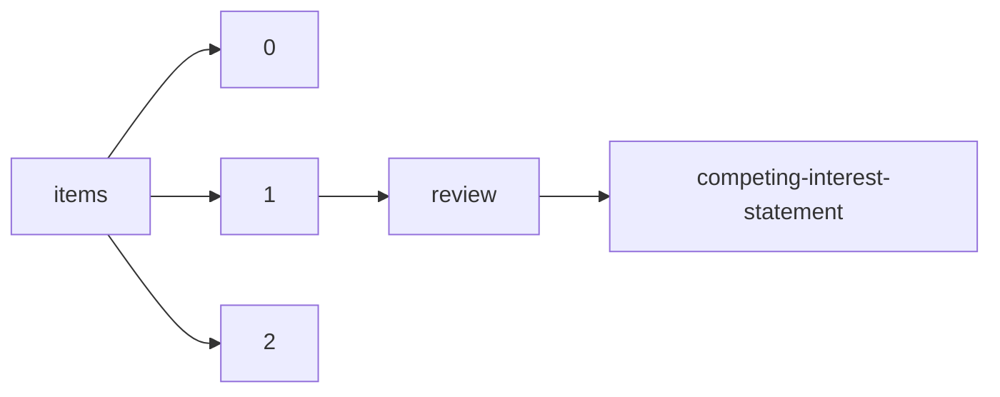

!!! warning "This document is not official Crossref documentation"
# Competing-interest-statement
PATH = items/array/review/competing-interest-statement(1)  
Occurs 933 times  
Unique values: 91  
{ .annotate }

1. A route to an element, for example:  
   The route "items/array/review/competing-interest-statement" corresponds to navigating through the JSON indices as  
   ["items"][0]["review"]["competing-interest-statement"]  

!!! note "Due to current limitations, strings longer than 1,000 characters are truncated, which may lead to inaccurate calculations."

| **Row** | **Value** `String`                                                                                  | **Count** `Int64` |
|--------:|-------------------------------------------------------------------------------------------------------:|---------------------:|
| **1**   | Conflict of interest: None declared.                                                                   | 334                  |
| **2**   | Reviewer declares none.                                                                                | 292                  |
| **3**   | Reviewer declares none                                                                                 | 68                   |
| **4**   | No competing interests were declared                                                                   | 66                   |
| **5**   | There were no competing interests                                                                      | 22                   |
| **6**   | There were no competing\n\t\t\t\tinterests                                                             | 12                   |
| **7**   | I have no competing interests with the author                                                          | 12                   |
| **8**   | none.                                                                                                  | 7                    |
| **9**   | None.                                                                                                  | 7                    |
| **10**  | There were no competing\n        interests                                                             | 6                    |
| **11**  | “Reviewer declares none”                                                                               | 5                    |
| **12**  | No conflict of interest.                                                                               | 4                    |
| **13**  | opicional                                                                                              | 4                    |
| **14**  | This reviewer has no conflict of interest.                                                             | 4                    |
| **15**  | The recommender in charge of the evaluation of the article and the reviewers declared that they have   | 4                    |
| **16**  | I have no conflict of interest.                                                                        | 3                    |
| **17**  | None                                                                                                   | 2                    |
| **18**  | Reviewer declares none. no conflict.                                                                   | 2                    |
| **19**  | I have no competing interests to declare                                                               | 2                    |
| **20**  | reviewer declares none                                                                                 | 2                    |
| **21**  | no                                                                                                     | 2                    |
| **22**  | no conflict of interest.                                                                               | 2                    |
| **23**  | Dr Barwell:\nClinical Research network Division 3 Clinical lead for the East Midlands\nAdvisor to Astr | 2                    |
| **24**  | Reviewer dedclares none.                                                                               | 2                    |
| **25**  | Reviwer declares none.                                                                                 | 1                    |
| **26**  | I have no competing interests.                                                                         | 1                    |
| **27**  | "Reviewer declares none".                                                                              | 1                    |
| **28**  | No conflict of interests.                                                                              | 1                    |
| **29**  | Dr. Charles Y. Lin is employed by Kronos Bio, is a consultant for Jnana Therapeutics and is a shareh   | 1                    |
| **30**  | This reviewer has no conflict interest respect to this author, this manuscript since this reviewer d   | 1                    |
| **31**  | This is the competing interest statement!                                                              | 1                    |
| **32**  | Lead author is co-PI on a project I have funded to build a database on oyster diseases through the G   | 1                    |
| **33**  | The reviewer shares a secondary affiliation with one of the co-authors of the manuscript.              | 1                    |
| **34**  | I have no conflict of interest with these authors or manuscript.                                       | 1                    |
| **35**  | I have no financial interests that can be interpreted to be a conflict of interest.                    | 1                    |
| **36**  | Nil                                                                                                    | 1                    |
| **37**  | no competing interest                                                                                  | 1                    |
| **38**  | This reviewer declare no conflict of interest.                                                         | 1                    |
| **39**  | The reviewers reported no Conflict of Interest                                                         | 1                    |
| **40**  | Reviewer declared none.                                                                                | 1                    |
| **41**  | I do no have competing interests                                                                       | 1                    |
| **42**  | none                                                                                                   | 1                    |
| **43**  | the reviewer declares no conflict of interest                                                          | 1                    |
| **44**  | Reviewer has written paper with author on the use of N ‐methyliminodiacetic acid boronate esters in    | 1                    |
| **45**  | Reviewer delcares none.                                                                                | 1                    |
| **46**  | I have no conflicts of interest to declare.                                                            | 1                    |
| **47**  | No conflict.                                                                                           | 1                    |
| **48**  | Hereby it is declared that I have no conflict of interest in relation to this manuscript. Dr. Seyed    | 1                    |
| **49**  | Reviewer declares none Dear Editor, My recommendation about the manuscript is Minor Revision. I appr   | 1                    |
| **50**  | NA.                                                                                                    | 1                    |
| **51**  | The paper is accept and publishable in Experimental Results                                            | 1                    |
| **52**  | I declare that there are no conflict of intrests                                                       | 1                    |
| **53**  | I declare no competing interest                                                                        | 1                    |
| **54**  | Конфликт интересов не задекларирован                                                                   | 1                    |
| **55**  | The authors had contacted me (as I knew them from the grant that funded this - had gone to their inc   | 1                    |
| **56**  | The Laura and John Arnold Foundation funds the RIAT Support Center, which supports my salary.          | 1                    |
| **57**  | NONE                                                                                                   | 1                    |
| **58**  | Nothing to declare.                                                                                    | 1                    |
| **59**  | Reviewer declares no conflicts of interest.                                                            | 1                    |
| **60**  | The reviewer has collaborated with the authors on other projects.                                      | 1                    |
| **61**  | Rewiever declares none                                                                                 | 1                    |
| **62**  | I participate in a large oyster research group (\~25 scientists) which includes Dr. LaPeyre. I do not  | 1                    |
| **63**  | No Conflicts of Interest.                                                                              | 1                    |
| **64**  | Conflict of interest: Yes: The corresponding author is head of an international expert group of whic   | 1                    |
| **65**  | The reviewer declares no COI, but needs to emphasize that their name appears in the acknowledgements   | 1                    |
| **66**  | reviewer declares none.                                                                                | 1                    |
| **67**  | “Reviewer declares none”.                                                                              | 1                    |
| **68**  | no.                                                                                                    | 1                    |
| **69**  | Reviewers declare none.                                                                                | 1                    |
| **70**  | This paper does not provide clear guidelines on how the research will proceed. The author did not gi   | 1                    |
| **71**  | No conflict                                                                                            | 1                    |
| **72**  | PW is an associate editor at the Journal of Medical Internet Research and is on the editorial adviso   | 1                    |
| **73**  | Dr. Kelly and I both serve on the North American Arabidopsis Steering Committee.                       | 1                    |
| **74**  | My salary is supported by the Laura and John Arnold Foundation now called Arnold Ventures.             | 1                    |
| **75**  | Reviewer declared none                                                                                 | 1                    |
| **76**  | I have no competing interests in relation to this article.                                             | 1                    |
| **77**  | I am currently the study coordinator of a study that includes Richard Byng as a co-investigator alon   | 1                    |
| **78**  | PW is employed by Wicks Digital Health Ltd, which has received funding from Ada Health, AstraZeneca,   | 1                    |
| **79**  | I have no competing interests to report.                                                               | 1                    |
| **80**  | I have no conflict of interests,.                                                                      | 1                    |
| **81**  | No                                                                                                     | 1                    |
| **82**  | I have recently published a similar article. I do not know if it is a conflict of interest.Dear Edit   | 1                    |
| **83**  | Reviewer declares non.                                                                                 | 1                    |
| **84**  | I receive scholarly stipends from Sao Paulo Research Foundation (grant #21/08540-0).                   | 1                    |
| **85**  | I have no conflict of interests                                                                        | 1                    |
| **86**  | I declare no conflict of interest with this manuscript.                                                | 1                    |
| **87**  | The reviewer declares that there is no conflict of interest with the evaluated work.                   | 1                    |
| **88**  | I have no competing interests with this article.                                                       | 1                    |
| **89**  | I confirm that I have no conflicts of interest to declare.                                             | 1                    |
| **90**  | Reviewer declares limited scientific exchange (unrelated to the current manuscript) with the corresp   | 1                    |
| **91**  | I have no conflicts of interest.                                                                       | 1                    |

