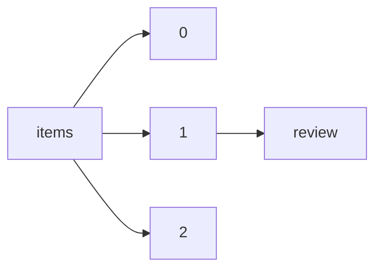

!!! warning "This document is not official Crossref documentation"
# Review
PATH = items/array/review(1)  
Occurs 340 964 times  
{ .annotate }

1. A route to an element, for example:  
   The route "items/array/review" corresponds to navigating through the JSON indices as  
   ["items"][0]["review"]  

## Competing-interest-statement
See more information: [items/array/review/competing-interest-statement](competing-interest-statement/index.md)  
Occurs 933 timess  
Unique values: 91  

!!! note "Due to current limitations, strings longer than 1,000 characters are truncated, which may lead to inaccurate calculations."

| **Row** | **Value** `String`                         | **Count** `Int64` |
|--------:|----------------------------------------------:|---------------------:|
| **1**   | Conflict of interest: None declared.          | 334                  |
| **2**   | Reviewer declares none.                       | 292                  |
| **3**   | Reviewer declares none                        | 68                   |
| **4**   | No competing interests were declared          | 66                   |
| **5**   | There were no competing interests             | 22                   |
| **6**   | There were no competing\n\t\t\t\tinterests    | 12                   |
| **7**   | I have no competing interests with the author | 12                   |
| **8**   | none.                                         | 7                    |
| **9**   | None.                                         | 7                    |
| **10**  | There were no competing\n        interests    | 6                    |
| ... | ... | ... |

## Language
See more information: [items/array/review/language](language/index.md)  
Occurs 80 176 timess  
Unique values: 1  

| **Row** | **Value** `String` | **Count** `Int64` |
|--------:|----------------------:|---------------------:|
| **1**   | en                    | 80 176               |

## Recommendation
See more information: [items/array/review/recommendation](recommendation/index.md)  
Occurs 38 093 timess  
Unique values: 4  

| **Row** | **Value** `String` | **Count** `Int64` |
|--------:|----------------------:|---------------------:|
| **1**   | minor-revision        | 17 290               |
| **2**   | major-revision        | 15 458               |
| **3**   | accept                | 2 713                |
| **4**   | reject                | 2 632                |

## Revision-round
See more information: [items/array/review/revision-round](revision-round/index.md)  
Occurs 228 402 timess  
Unique values: 17  

| **Row** | **Value** `String` | **Count** `Int64` |
|--------:|----------------------:|---------------------:|
| **1**   | 2                     | 90 627               |
| **2**   | 1                     | 88 708               |
| **3**   | 3                     | 31 213               |
| **4**   | 4                     | 9 417                |
| **5**   | 5                     | 3 497                |
| **6**   | 0                     | 2 665                |
| **7**   | 6                     | 1 397                |
| **8**   | 7                     | 575                  |
| **9**   | 8                     | 190                  |
| **10**  | 9                     | 73                   |
| ... | ... | ... |

## Running-number
See more information: [items/array/review/running-number](running-number/index.md)  
Occurs 267 375 timess  
Unique values: 235  

| **Row** | **Value** `String` | **Count** `Int64` |
|--------:|----------------------:|---------------------:|
| **1**   | E1V1                  | 26 849               |
| **2**   | E1V2                  | 25 225               |
| **3**   | PR1V1                 | 21 754               |
| **4**   | A1V2                  | 19 220               |
| **5**   | RC1                   | 16 384               |
| **6**   | RC2                   | 15 990               |
| **7**   | AC1                   | 15 446               |
| **8**   | PR2V1                 | 14 173               |
| **9**   | AC2                   | 12 872               |
| **10**  | E1V3                  | 10 324               |
| ... | ... | ... |

## Stage
See more information: [items/array/review/stage](stage/index.md)  
Occurs 339 008 timess  
Unique values: 2  

| **Row** | **Value** `String` | **Count** `Int64` |
|--------:|----------------------:|---------------------:|
| **1**   | pre-publication       | 338 088              |
| **2**   | post-publication      | 920                  |

## Type
See more information: [items/array/review/type](type/index.md)  
Occurs 297 160 timess  
Unique values: 5  

| **Row** | **Value** `String` | **Count** `Int64` |
|--------:|----------------------:|---------------------:|
| **1**   | referee-report        | 133 353              |
| **2**   | editor-report         | 81 635               |
| **3**   | author-comment        | 78 424               |
| **4**   | community-comment     | 3 411                |
| **5**   | aggregate             | 337                  |

