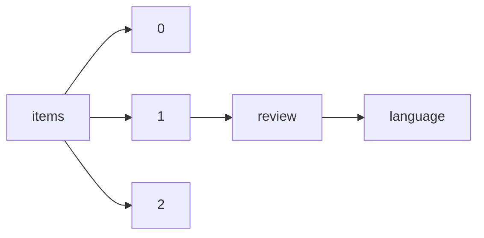

!!! warning "This document is not official Crossref documentation"
# Language
PATH = items/array/review/language(1)  
Occurs 80 176 times  
Unique values: 1  
{ .annotate }

1. A route to an element, for example:  
   The route "items/array/review/language" corresponds to navigating through the JSON indices as  
   ["items"][0]["review"]["language"]  

| **Row** | **Value** `String` | **Count** `Int64` |
|--------:|----------------------:|---------------------:|
| **1**   | en                    | 80 176               |

