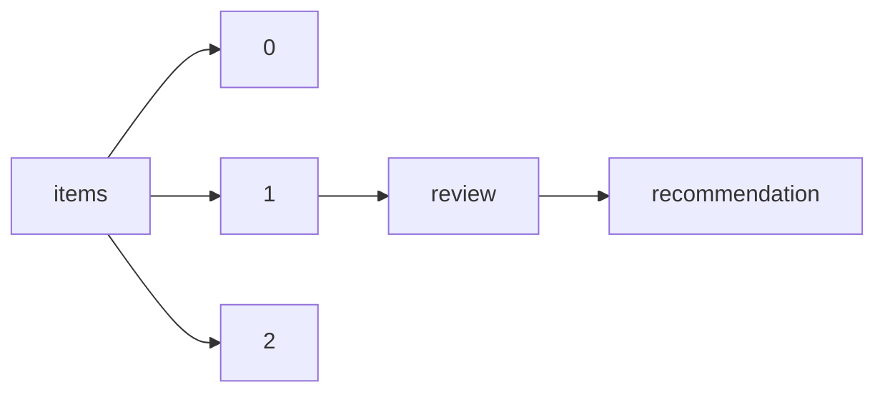

!!! warning "This document is not official Crossref documentation"
# Recommendation
PATH = items/array/review/recommendation(1)  
Occurs 38 093 times  
Unique values: 4  
{ .annotate }

1. A route to an element, for example:  
   The route "items/array/review/recommendation" corresponds to navigating through the JSON indices as  
   ["items"][0]["review"]["recommendation"]  

| **Row** | **Value** `String` | **Count** `Int64` |
|--------:|----------------------:|---------------------:|
| **1**   | minor-revision        | 17 290               |
| **2**   | major-revision        | 15 458               |
| **3**   | accept                | 2 713                |
| **4**   | reject                | 2 632                |

