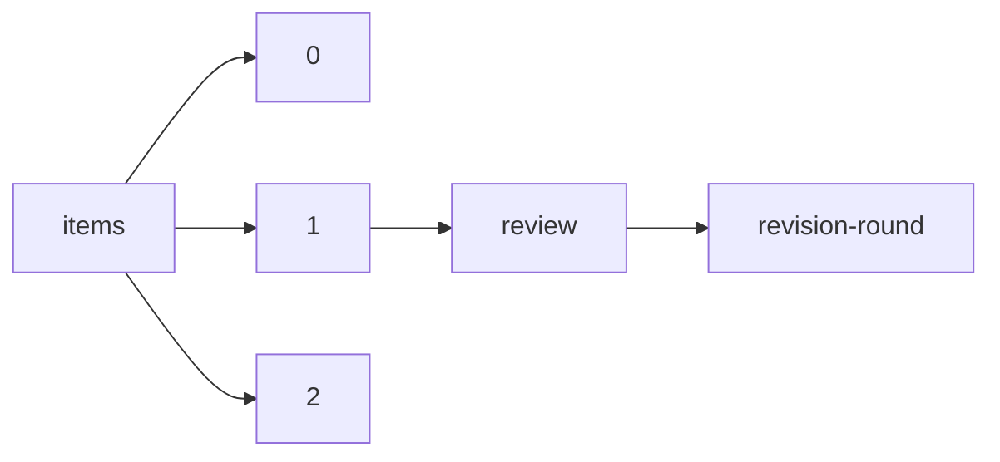

!!! warning "This document is not official Crossref documentation"
# Revision-round
PATH = items/array/review/revision-round(1)  
Occurs 228 402 times  
Unique values: 17  
{ .annotate }

1. A route to an element, for example:  
   The route "items/array/review/revision-round" corresponds to navigating through the JSON indices as  
   ["items"][0]["review"]["revision-round"]  

| **Row** | **Value** `String` | **Count** `Int64` |
|--------:|----------------------:|---------------------:|
| **1**   | 2                     | 90 627               |
| **2**   | 1                     | 88 708               |
| **3**   | 3                     | 31 213               |
| **4**   | 4                     | 9 417                |
| **5**   | 5                     | 3 497                |
| **6**   | 0                     | 2 665                |
| **7**   | 6                     | 1 397                |
| **8**   | 7                     | 575                  |
| **9**   | 8                     | 190                  |
| **10**  | 9                     | 73                   |
| **11**  | 10                    | 18                   |
| **12**  | 11                    | 13                   |
| **13**  | 15                    | 3                    |
| **14**  | 14                    | 3                    |
| **15**  | 13                    | 1                    |
| **16**  | 16                    | 1                    |
| **17**  | 17                    | 1                    |

