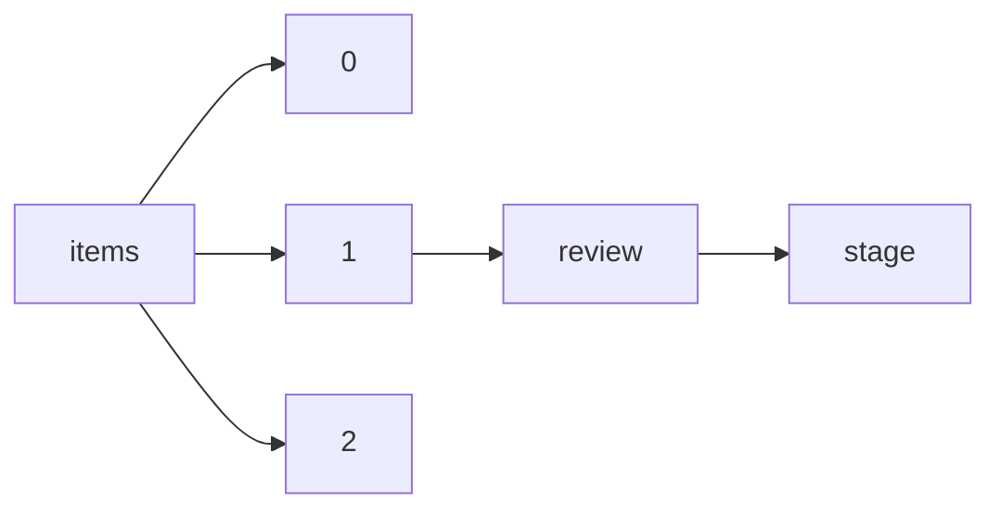

!!! warning "This document is not official Crossref documentation"
# Stage
PATH = items/array/review/stage(1)  
Occurs 339 008 times  
Unique values: 2  
{ .annotate }

1. A route to an element, for example:  
   The route "items/array/review/stage" corresponds to navigating through the JSON indices as  
   ["items"][0]["review"]["stage"]  

| **Row** | **Value** `String` | **Count** `Int64` |
|--------:|----------------------:|---------------------:|
| **1**   | pre-publication       | 338 088              |
| **2**   | post-publication      | 920                  |

