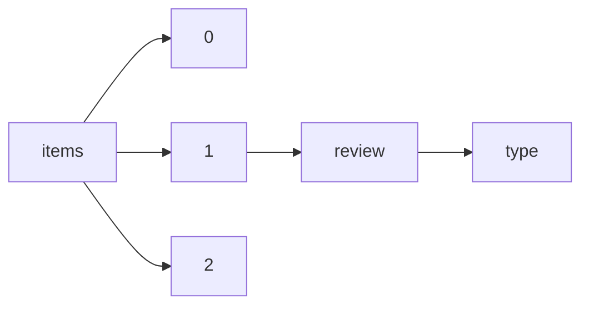

!!! warning "This document is not official Crossref documentation"
# Type
PATH = items/array/review/type(1)  
Occurs 297 160 times  
Unique values: 5  
{ .annotate }

1. A route to an element, for example:  
   The route "items/array/review/type" corresponds to navigating through the JSON indices as  
   ["items"][0]["review"]["type"]  

| **Row** | **Value** `String` | **Count** `Int64` |
|--------:|----------------------:|---------------------:|
| **1**   | referee-report        | 133 353              |
| **2**   | editor-report         | 81 635               |
| **3**   | author-comment        | 78 424               |
| **4**   | community-comment     | 3 411                |
| **5**   | aggregate             | 337                  |

