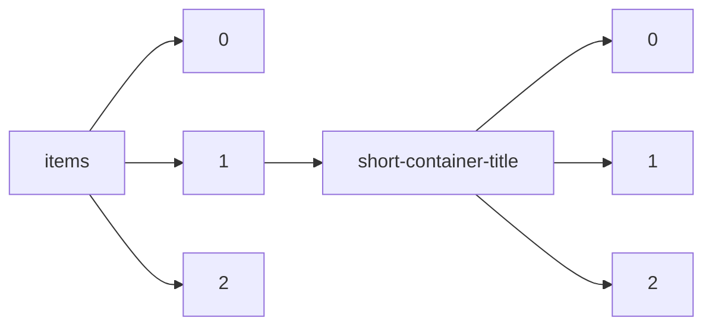

!!! warning "This document is not official Crossref documentation"
# Elements
PATH = items/array/short-container-title/array(1)  
Occurs 92 766 227 times  
Unique values: > 999  
{ .annotate }

1. A route to an element, for example:  
   The route "items/array/short-container-title/array" corresponds to navigating through the JSON indices as  
   ["items"][0]["short-container-title"][0]  

!!! note "Due to current limitations, only the first 1,000 unique values are counted."

| **Row** | **Value** `String`                                                                                | **Count** `Int64` |
|--------:|-----------------------------------------------------------------------------------------------------:|---------------------:|
| **1**   | SSRN Journal                                                                                         | 665 339              |
| **2**   | ChemInform                                                                                           | 486 256              |
| **3**   | The Lancet                                                                                           | 464 938              |
| **4**   | BMJ                                                                                                  | 429 472              |
| **5**   | Nature                                                                                               | 427 219              |
| **6**   | Science                                                                                              | 366 892              |
| **7**   | Chemischer Informationsdienst                                                                        | 305 941              |
| **8**   | JAMA                                                                                                 | 293 343              |
| **9**   | PLoS ONE                                                                                             | 277 899              |
| **10**  | Reactions Weekly                                                                                     | 220 984              |
| **11**  | Phys. Rev. B                                                                                         | 207 423              |
| **12**  | J. Am. Chem. Soc.                                                                                    | 203 225              |
| **13**  | Journal of Biological Chemistry                                                                      | 199 289              |
| **14**  | Choice Reviews Online                                                                                | 195 181              |
| **15**  | Sci Am                                                                                               | 184 431              |
| **16**  | Sci Rep                                                                                              | 176 348              |
| **17**  | J. Phys.: Conf. Ser.                                                                                 | 175 663              |
| **18**  | Chem. Eng. News Archive                                                                              | 160 226              |
| **19**  | Proc. Natl. Acad. Sci. U.S.A.                                                                        | 154 699              |
| **20**  | Medical Journal of Australia                                                                         | 144 670              |
| **21**  | AMR                                                                                                  | 144 251              |
| **22**  | The Journal of the Acoustical Society of America                                                     | 141 020              |
| **23**  | Journal of Applied Physics                                                                           | 136 777              |
| **24**  | Phys. Rev. Lett.                                                                                     | 131 981              |
| **25**  | JCO                                                                                                  | 131 190              |
| **26**  | Appl. Phys. Lett.                                                                                    | 127 495              |
| **27**  | Gastroenterology                                                                                     | 126 912              |
| **28**  | The Journal of Chemical Physics                                                                      | 126 624              |
| **29**  | Anal. Chem.                                                                                          | 123 950              |
| **30**  | Journal of Urology                                                                                   | 121 159              |
| **31**  | ApJ                                                                                                  | 119 588              |
| **32**  | N Engl J Med                                                                                         | 115 710              |
| **33**  | AMM                                                                                                  | 108 490              |
| **34**  | Phys. Rev. D                                                                                         | 102 218              |
| **35**  | Journal of the American College of Cardiology                                                        | 98 779               |
| **36**  | Tetrahedron Letters                                                                                  | 98 482               |
| **37**  | IOP Conf. Ser.: Earth Environ. Sci.                                                                  | 92 184               |
| **38**  | FASEB j.                                                                                             | 91 391               |
| **39**  | IOP Conf. Ser.: Mater. Sci. Eng.                                                                     | 89 671               |
| **40**  | Nursing Standard                                                                                     | 89 611               |
| **41**  | Biochemical and Biophysical Research Communications                                                  | 88 995               |
| **42**  | J. Org. Chem.                                                                                        | 86 784               |
| **43**  | J. Geophys. Res.                                                                                     | 86 340               |
| **44**  | Phys. Rev. A                                                                                         | 85 541               |
| **45**  | Meet. Abstr.                                                                                         | 83 159               |
| **46**  | American Journal of Obstetrics and Gynecology                                                        | 82 646               |
| **47**  | Angew. Chem.                                                                                         | 80 935               |
| **48**  | CABI Compendium                                                                                      | 79 014               |
| **49**  | Dtsch med Wochenschr                                                                                 | 77 398               |
| **50**  | Jpn. J. Appl. Phys.                                                                                  | 74 108               |
| **51**  | Acta Hortic.                                                                                         | 70 667               |
| **52**  | Journal of Alloys and Compounds                                                                      | 67 648               |
| **53**  | International Journal of Radiation Oncology\*Biology\*Physics                                        | 67 317               |
| **54**  | MRS Proc.                                                                                            | 66 246               |
| **55**  | IJMS                                                                                                 | 65 632               |
| **56**  | RSC Adv.                                                                                             | 65 510               |
| **57**  | IFAC Proceedings Volumes                                                                             | 65 266               |
| **58**  | Biophysical Journal                                                                                  | 64 809               |
| **59**  | Plastic and Reconstructive Surgery                                                                   | 64 584               |
| **60**  | Chem. Commun.                                                                                        | 64 260               |
| **61**  | The Boston Medical and Surgical Journal                                                              | 63 595               |
| **62**  | Phys. Rev. E                                                                                         | 62 341               |
| **63**  | Inorg. Chem.                                                                                         | 61 825               |
| **64**  | Chest                                                                                                | 61 784               |
| **65**  | Biochemistry                                                                                         | 60 525               |
| **66**  | Sustainability                                                                                       | 60 385               |
| **67**  | Circulation                                                                                          | 59 607               |
| **68**  | MSF                                                                                                  | 58 834               |
| **69**  | The American Journal of the Medical Sciences                                                         | 57 596               |
| **70**  | Science of The Total Environment                                                                     | 57 506               |
| **71**  | Brain Research                                                                                       | 57 309               |
| **72**  | Value in Health                                                                                      | 57 087               |
| **73**  | IEEE Access                                                                                          | 56 547               |
| **74**  | The American Historical Review                                                                       | 56 334               |
| **75**  | Chemical Physics Letters                                                                             | 56 332               |
| **76**  | Journal of Chromatography A                                                                          | 54 839               |
| **77**  | AJN, American Journal of Nursing                                                                     | 53 952               |
| **78**  | Z. Anal. Chem.                                                                                       | 53 907               |
| **79**  | IJERPH                                                                                               | 53 881               |
| **80**  | Applied Surface Science                                                                              | 53 703               |
| **81**  | Ann Intern Med                                                                                       | 52 503               |
| **82**  | Physics Letters B                                                                                    | 52 170               |
| **83**  | J. Phys. Chem.                                                                                       | 51 250               |
| **84**  | JSMET                                                                                                | 51 194               |
| **85**  | Opt. Express                                                                                         | 50 898               |
| **86**  | Inpharma Weekly                                                                                      | 50 566               |
| **87**  | Radiology                                                                                            | 50 563               |
| **88**  | Journal of the Franklin Institute                                                                    | 50 138               |
| **89**  | Astr. Nachr.; AN                                                                                     | 49 900               |
| **90**  | International Journal of Rock Mechanics and Mining Sciences &amp; Geomechanics Abstracts             | 49 829               |
| **91**  | CrossRef Listing of Deleted DOIs                                                                     | 49 613               |
| **92**  | Angew. Chem. Int. Ed.                                                                                | 48 780               |
| **93**  | Appl. Opt.                                                                                           | 48 105               |
| **94**  | Langmuir                                                                                             | 47 968               |
| **95**  | Tetrahedron                                                                                          | 47 678               |
| **96**  | Fertility and Sterility                                                                              | 47 518               |
| **97**  | Phys. Rev.                                                                                           | 47 118               |
| **98**  | Nuclear Instruments and Methods in Physics Research Section A: Accelerators, Spectrometers, Detector | 46 499               |
| **99**  | ApJL                                                                                                 | 45 998               |
| **100** | J. Agric. Food Chem.                                                                                 | 45 965               |
| **101** | Nippon Hoshasen Gijutsu Gakkai Zasshi                                                                | 45 736               |
| **102** | Jpn. J. Radiol. Technol.                                                                             | 45 736               |
| **103** | J. Appl. Polym. Sci.                                                                                 | 45 683               |
| **104** | Journal of Education                                                                                 | 45 660               |
| **105** | KEM                                                                                                  | 45 595               |
| **106** | Environ. Sci. Technol.                                                                               | 45 523               |
| **107** | J. Phys. Chem. C                                                                                     | 45 351               |
| **108** | Southern Medical Journal                                                                             | 44 993               |
| **109** | Arch. Pharm. Pharm. Med. Chem.                                                                       | 44 976               |
| **110** | J. Electrochem. Soc.                                                                                 | 44 875               |
| **111** | J. Chem. Educ.                                                                                       | 44 777               |
| **112** | Fuel and Energy Abstracts                                                                            | 44 073               |
| **113** | Neurology                                                                                            | 43 870               |
| **114** | Nat Commun                                                                                           | 43 847               |
| **115** | Bulletin                                                                                             | 43 665               |
| **116** | Experimental Biology and Medicine                                                                    | 43 548               |
| **117** | J Bacteriol                                                                                          | 43 255               |
| **118** | Sensors                                                                                              | 43 242               |
| **119** | The American Journal of Cardiology                                                                   | 43 151               |
| **120** | J Virol                                                                                              | 43 032               |
| **121** | Journal of Allergy and Clinical Immunology                                                           | 42 488               |
| **122** | New Scientist                                                                                        | 41 787               |
| **123** | Medicine &amp; Science in Sports &amp; Exercise                                                      | 41 617               |
| **124** | Phys. Chem. Chem. Phys.                                                                              | 41 319               |
| **125** | ACS Appl. Mater. Interfaces                                                                          | 40 975               |
| **126** | Journal of the American Academy of Dermatology                                                       | 40 931               |
| **127** | Chemischer Informationsdienst. Organische Chemie                                                     | 40 371               |
| **128** | J. Phys. Chem. B                                                                                     | 40 325               |
| **129** | Annals of Oncology                                                                                   | 39 751               |
| **130** | The American Mathematical Monthly                                                                    | 39 338               |
| **131** | Thin Solid Films                                                                                     | 39 300               |
| **132** | Electrochimica Acta                                                                                  | 39 205               |
| **133** | Acta Cryst E                                                                                         | 39 122               |
| **134** | Acta Crystallogr Sect E                                                                              | 39 114               |
| **135** | Acta Crystallogr E                                                                                   | 39 000               |
| **136** | CMR                                                                                                  | 38 990               |
| **137** | Acta Cryst Sect E                                                                                    | 38 978               |
| **138** | The Annals of Thoracic Surgery                                                                       | 38 770               |
| **139** | Vacuum                                                                                               | 38 591               |
| **140** | Macromolecules                                                                                       | 38 555               |
| **141** | Chemosphere                                                                                          | 38 340               |
| **142** | Acta Crystallogr Sect E Struct Rep Online                                                            | 38 218               |
| **143** | Acta Crystallogr E Struct Rep Online                                                                 | 37 993               |
| **144** | Journal of Hepatology                                                                                | 37 897               |
| **145** | Veterinary Record                                                                                    | 37 860               |
| **146** | Molecules                                                                                            | 37 838               |
| **147** | Gastrointestinal Endoscopy                                                                           | 37 660               |
| **148** | Review of Scientific Instruments                                                                     | 37 428               |
| **149** | Applied Sciences                                                                                     | 37 263               |
| **150** | Pediatr Res                                                                                          | 36 639               |
| **151** | Zootaxa                                                                                              | 36 493               |
| **152** | AJP                                                                                                  | 36 491               |
| **153** | A&amp;A                                                                                              | 36 362               |
| **154** | Proceedings of the Royal Society of Medicine                                                         | 36 320               |
| **155** | Physics Letters A                                                                                    | 36 059               |
| **156** | Radiotherapy and Oncology                                                                            | 36 032               |
| **157** | IEEE Trans. Magn.                                                                                    | 35 612               |
| **158** | Eng Hist Rev                                                                                         | 35 067               |
| **159** | Journal of Magnetism and Magnetic Materials                                                          | 34 852               |
| **160** | American Journal of Ophthalmology                                                                    | 34 651               |
| **161** | The Journal of Nervous and Mental Disease                                                            | 34 269               |
| **162** | Cancer                                                                                               | 34 087               |
| **163** | Electron. Lett.                                                                                      | 33 621               |
| **164** | Klin Wochenschr                                                                                      | 33 541               |
| **165** | Materials Science and Engineering: A                                                                 | 33 501               |
| **166** | The Journal of Pediatrics                                                                            | 33 231               |
| **167** | International Journal of Hydrogen Energy                                                             | 33 086               |
| **168** | BCSJ                                                                                                 | 33 018               |
| **169** | Org. Lett.                                                                                           | 32 659               |
| **170** | Ann NY Acad Sci                                                                                      | 32 589               |
| **171** | Med. Phys.                                                                                           | 32 404               |
| **172** | Phys. Rev. C                                                                                         | 32 152               |
| **173** | American Heart Journal                                                                               | 31 658               |
| **174** | Critical Care Medicine                                                                               | 31 352               |
| **175** | The American Journal of Nursing                                                                      | 31 238               |
| **176** | Naturwissenschaften                                                                                  | 31 208               |
| **177** | Chem. Eur. J.                                                                                        | 31 164               |
| **178** | Am Polit Sci Rev                                                                                     | 31 064               |
| **179** | The Musical Times                                                                                    | 31 050               |
| **180** | Journal of Organometallic Chemistry                                                                  | 30 998               |
| **181** | Solid State Communications                                                                           | 30 956               |
| **182** | Journal of Colloid and Interface Science                                                             | 30 762               |
| **183** | Energies                                                                                             | 30 660               |
| **184** | The Journal of the American Dental Association                                                       | 30 512               |
| **185** | Acta Cryst A                                                                                         | 30 484               |
| **186** | Acta Crystallogr Sect A                                                                              | 30 481               |
| **187** | Acta Crystallogr A                                                                                   | 30 481               |
| **188** | Acta Cryst Sect A                                                                                    | 30 479               |
| **189** | Inpharma                                                                                             | 30 474               |
| **190** | Ber. Dtsch. Chem. Ges.                                                                               | 30 423               |
| **191** | Physics Today                                                                                        | 30 100               |
| **192** | J. Phys. Soc. Jpn.                                                                                   | 29 839               |
| **193** | The ANNALS of the American Academy of Political and Social Science                                   | 29 836               |
| **194** | Mon. Wea. Rev.                                                                                       | 29 826               |
| **195** | Procedia - Social and Behavioral Sciences                                                            | 29 669               |
| **196** | Russ Chem Bull                                                                                       | 29 063               |
| **197** | European Journal of Cancer                                                                           | 29 015               |
| **198** | Analytica Chimica Acta                                                                               | 28 994               |
| **199** | Geophys. Res. Lett.                                                                                  | 28 977               |
| **200** | Jpn. j. urol                                                                                         | 28 884               |
| **201** | Br Dent J                                                                                            | 28 824               |
| **202** | Endocrinology                                                                                        | 28 657               |
| **203** | Acta Phys. Sin.                                                                                      | 28 605               |
| **204** | Journal of Molecular Biology                                                                         | 28 562               |
| **205** | Science News                                                                                         | 28 452               |
| **206** | Ind. Eng. Chem. Res.                                                                                 | 28 402               |
| **207** | American Journal of Gastroenterology                                                                 | 28 354               |
| **208** | The Quarterly Review of Biology                                                                      | 28 287               |
| **209** | Procedia Engineering                                                                                 | 28 260               |
| **210** | Acta Cryst E Struct Rep Online                                                                       | 28 066               |
| **211** | Acta Cryst Sect E Struct Rep Online                                                                  | 28 065               |
| **212** | E3S Web Conf.                                                                                        | 28 060               |
| **213** | Acta Crystallogr A Found Crystallogr                                                                 | 28 015               |
| **214** | Food Chemistry                                                                                       | 28 011               |
| **215** | European Journal of Pharmacology                                                                     | 27 964               |
| **216** | The Journal of Thoracic and Cardiovascular Surgery                                                   | 27 954               |
| **217** | J. Phys. Chem. A                                                                                     | 27 865               |
| **218** | Japanese Journal of Pharmacology                                                                     | 27 661               |
| **219** | European Neuropsychopharmacology                                                                     | 27 606               |
| **220** | Journal of Dairy Science                                                                             | 27 572               |
| **221** | Ind. Eng. Chem.                                                                                      | 27 562               |
| **222** | Alzheimer's &amp;amp; Dementia                                                                       | 27 505               |
| **223** | Materials Letters                                                                                    | 27 503               |
| **224** | J. Phys.: Condens. Matter                                                                            | 27 500               |
| **225** | Transplantation                                                                                      | 27 440               |
| **226** | Archives of Biochemistry and Biophysics                                                              | 27 423               |
| **227** | The Class. Rev.                                                                                      | 27 411               |
| **228** | Urology                                                                                              | 27 377               |
| **229** | Surface Science                                                                                      | 27 334               |
| **230** | Acta Crystallogr Sect A Found Crystallogr                                                            | 27 218               |
| **231** | Opt. Lett.                                                                                           | 27 207               |
| **232** | Chemical Engineering Journal                                                                         | 27 170               |
| **233** | Materials Today: Proceedings                                                                         | 27 123               |
| **234** | The American Journal of Surgery                                                                      | 26 869               |
| **235** | Neuroscience Letters                                                                                 | 26 785               |
| **236** | Journal of Molecular Structure                                                                       | 26 643               |
| **237** | Analyst                                                                                              | 26 566               |
| **238** | Ceramics International                                                                               | 26 564               |
| **239** | European Urology Supplements                                                                         | 26 535               |
| **240** | Physica B: Condensed Matter                                                                          | 26 469               |
| **241** | Proceedings                                                                                          | 26 338               |
| **242** | Ann Rheum Dis                                                                                        | 26 148               |
| **243** | J. Neurosci.                                                                                         | 26 098               |
| **244** | Arch Intern Med                                                                                      | 26 079               |
| **245** | Experientia                                                                                          | 26 044               |
| **246** | Journal of Crystal Growth                                                                            | 25 934               |
| **247** | International Journal of Cardiology                                                                  | 25 614               |
| **248** | J. Chem. Soc., Chem. Commun.                                                                         | 25 601               |
| **249** | Journal of the American Dietetic Association                                                         | 25 553               |
| **250** | Appl Environ Microbiol                                                                               | 25 459               |
| **251** | Fortschr Röntgenstr                                                                                  | 25 434               |
| **252** | J. Chem. Soc.                                                                                        | 25 380               |
| **253** | Materials                                                                                            | 25 272               |
| **254** | Environ Sci Pollut Res                                                                               | 25 257               |
| **255** | Nuclear Physics A                                                                                    | 25 240               |
| **256** | Chin. Sci. Bull.                                                                                     | 25 069               |
| **257** | Journal of Cleaner Production                                                                        | 25 048               |
| **258** | Journal of Pediatric Surgery                                                                         | 24 973               |
| **259** | American Journal of Roentgenology                                                                    | 24 927               |
| **260** | The Modern Language Review                                                                           | 24 891               |
| **261** | Z. Angew. Chem.                                                                                      | 24 852               |
| **262** | Journal of Investigative Dermatology                                                                 | 24 717               |
| **263** | Front. Psychol.                                                                                      | 24 413               |
| **264** | Fresenius, Zeitschrift f. anal. Chemie                                                               | 24 307               |
| **265** | Anesthesia &amp; Analgesia                                                                           | 24 284               |
| **266** | Stroke                                                                                               | 24 055               |
| **267** | Nuclear Instruments and Methods in Physics Research Section B: Beam Interactions with Materials and  | 24 041               |
| **268** | Agricultural and Biological Chemistry                                                                | 23 987               |
| **269** | Oncotarget                                                                                           | 23 858               |
| **270** | Journal of the Neurological Sciences                                                                 | 23 812               |
| **271** | Journal of Vision                                                                                    | 23 785               |
| **272** | Arch Dermatol                                                                                        | 23 616               |
| **273** | Journal of Applied Physiology                                                                        | 23 588               |
| **274** | The London, Edinburgh, and Dublin Philosophical Magazine and Journal of Science                      | 23 567               |
| **275** | IJCA                                                                                                 | 23 505               |
| **276** | Phytochemistry                                                                                       | 23 500               |
| **277** | Math. Gaz.                                                                                           | 23 291               |
| **278** | Review &amp; Expositor                                                                               | 23 242               |
| **279** | American Anthropologist                                                                              | 23 114               |
| **280** | American Journal of Physiology-Legacy Content                                                        | 22 939               |
| **281** | Annals of Surgery                                                                                    | 22 923               |
| **282** | Eur J Biochem                                                                                        | 22 789               |
| **283** | Polymer                                                                                              | 22 727               |
| **284** | Bioorganic &amp; Medicinal Chemistry Letters                                                         | 22 700               |
| **285** | Annals of Emergency Medicine                                                                         | 22 668               |
| **286** | The Geographical Journal                                                                             | 22 624               |
| **287** | PS                                                                                                   | 22 491               |
| **288** | Optics Communications                                                                                | 22 482               |
| **289** | Robomech                                                                                             | 22 388               |
| **290** | IJAR                                                                                                 | 22 377               |
| **291** | Analytical Biochemistry                                                                              | 22 089               |
| **292** | J. Mater. Chem. A                                                                                    | 21 939               |
| **293** | Chem. Pharm. Bull.                                                                                   | 21 877               |
| **294** | CHEMICAL &amp; PHARMACEUTICAL BULLETIN                                                               | 21 876               |
| **295** | MATEC Web Conf.                                                                                      | 21 713               |
| **296** | Annals and Magazine of Natural History                                                               | 21 689               |
| **297** | IEEE Trans. Nucl. Sci.                                                                               | 21 674               |
| **298** | J. Med. Chem.                                                                                        | 21 648               |
| **299** | J. Clin. Invest.                                                                                     | 21 616               |
| **300** | Atherosclerosis                                                                                      | 21 606               |
| **301** | Journal of Power Sources                                                                             | 21 598               |
| **302** | J. High Energ. Phys.                                                                                 | 21 419               |
| **303** | phys. stat. sol. (b)                                                                                 | 21 416               |
| **304** | Life Sciences                                                                                        | 21 383               |
| **305** | BJR                                                                                                  | 21 346               |
| **306** | Arch Pediatr Adolesc Med                                                                             | 21 290               |
| **307** | Journal - American Water Works Association                                                           | 21 270               |
| **308** | Bull Exp Biol Med                                                                                    | 21 267               |
| **309** | American Journal of Sociology                                                                        | 21 190               |
| **310** | J. Chem. Technol. Biotechnol.                                                                        | 21 109               |
| **311** | AMPROC                                                                                               | 21 086               |
| **312** | ECS Trans.                                                                                           | 21 044               |
| **313** | Psychol Rep                                                                                          | 20 978               |
| **314** | Journal of Vascular Surgery                                                                          | 20 915               |
| **315** | Virology                                                                                             | 20 784               |
| **316** | Front. Immunol.                                                                                      | 20 780               |
| **317** | Int.J.Curr.Microbiol.App.Sci                                                                         | 20 757               |
| **318** | Geol. Mag.                                                                                           | 20 722               |
| **319** | AIAA Journal                                                                                         | 20 694               |
| **320** | The Journal of Clinical Endocrinology &amp; Metabolism                                               | 20 692               |
| **321** | Procedia Computer Science                                                                            | 20 687               |
| **322** | Nuclear Physics B                                                                                    | 20 674               |
| **323** | Speculum                                                                                             | 20 425               |
| **324** | EJEA                                                                                                 | 20 366               |
| **325** | The Auk                                                                                              | 20 343               |
| **326** | Microelectronics Reliability                                                                         | 20 305               |
| **327** | Fuel                                                                                                 | 20 292               |
| **328** | Poultry Science                                                                                      | 20 070               |
| **329** | J. Phys. D: Appl. Phys.                                                                              | 20 066               |
| **330** | Monthly Notices of the Royal Astronomical Society                                                    | 20 063               |
| **331** | The American Journal of Medicine                                                                     | 19 979               |
| **332** | BMJ Open                                                                                             | 19 979               |
| **333** | Antimicrob Agents Chemother                                                                          | 19 812               |
| **334** | Can. J. Chem.                                                                                        | 19 781               |
| **335** | Electr. Eng.                                                                                         | 19 637               |
| **336** | Front. Microbiol.                                                                                    | 19 595               |
| **337** | The Journal of American History                                                                      | 19 487               |
| **338** | Chem. Ber.                                                                                           | 19 477               |
| **339** | Am. j. int. law                                                                                      | 19 422               |
| **340** | Nanoscale                                                                                            | 19 357               |
| **341** | Transplantation Proceedings                                                                          | 19 301               |
| **342** | Harvard Law Review                                                                                   | 19 282               |
| **343** | Transactions of AIJ                                                                                  | 19 249               |
| **344** | The Journal of the Society of Chemical Industry, Japan                                               | 19 094               |
| **345** | Theology                                                                                             | 19 064               |
| **346** | Biochemical Pharmacology                                                                             | 19 025               |
| **347** | Percept Mot Skills                                                                                   | 18 950               |
| **348** | RSD                                                                                                  | 18 942               |
| **349** | Planta Med                                                                                           | 18 868               |
| **350** | Postgraduate Medicine                                                                                | 18 861               |
| **351** | J. ment. sci                                                                                         | 18 842               |
| **352** | Arch Surg                                                                                            | 18 793               |
| **353** | Sensors and Actuators B: Chemical                                                                    | 18 781               |
| **354** | La Revue de Médecine Interne                                                                         | 18 771               |
| **355** | J. Phys. A: Math. Gen.                                                                               | 18 700               |
| **356** | Br J Psychiatry                                                                                      | 18 662               |
| **357** | Infect Immun                                                                                         | 18 621               |
| **358** | J Clin Microbiol                                                                                     | 18 602               |
| **359** | Dalton Trans.                                                                                        | 18 554               |
| **360** | IFAC-PapersOnLine                                                                                    | 18 540               |
| **361** | Construction and Building Materials                                                                  | 18 515               |
| **362** | The Proceedings of the Annual Convention of the JPA                                                  | 18 507               |
| **363** | Vaccine                                                                                              | 18 428               |
| **364** | The Journal of Nutrition                                                                             | 18 425               |
| **365** | Proc. Amer. Math. Soc.                                                                               | 18 367               |
| **366** | Microsc Microanal                                                                                    | 18 325               |
| **367** | Public Health                                                                                        | 18 299               |
| **368** | J. Prakt. Chem.                                                                                      | 18 236               |
| **369** | Energy Procedia                                                                                      | 18 118               |
| **370** | Chem. Lett.                                                                                          | 18 098               |
| **371** | Nucl Acids Res                                                                                       | 18 089               |
| **372** | The Science News-Letter                                                                              | 18 086               |
| **373** | Am J Public Health Nations Health                                                                    | 18 085               |
| **374** | Angew. Chem. Int. Ed. Engl.                                                                          | 18 018               |
| **375** | Am J Public Health                                                                                   | 17 978               |
| **376** | Archives of Otolaryngology - Head and Neck Surgery                                                   | 17 896               |
| **377** | Journal of Molecular and Cellular Cardiology                                                         | 17 870               |
| **378** | J Mater Sci                                                                                          | 17 810               |
| **379** | Energy                                                                                               | 17 773               |
| **380** | Journal of Sound and Vibration                                                                       | 17 724               |
| **381** | Journal of Hazardous Materials                                                                       | 17 697               |
| **382** | International Journal of Heat and Mass Transfer                                                      | 17 691               |
| **383** | Synfacts                                                                                             | 17 647               |
| **384** | Plant Physiol.                                                                                       | 17 643               |
| **385** | Symp. - Int. Astron. Union                                                                           | 17 575               |
| **386** | The American Journal of Clinical Nutrition                                                           | 17 355               |
| **387** | Journal of the American Statistical Association                                                      | 17 270               |
| **388** | Toxicology Letters                                                                                   | 17 242               |
| **389** | Contemporary Sociology                                                                               | 17 228               |
| **390** | Agronomy Journal                                                                                     | 17 217               |
| **391** | J of Asian Stud                                                                                      | 17 215               |
| **392** | Br J Dermatol                                                                                        | 17 211               |
| **393** | Social Forces                                                                                        | 17 117               |
| **394** | Mycologia                                                                                            | 17 041               |
| **395** | Archives of Disease in Childhood                                                                     | 17 034               |
| **396** | The English Journal                                                                                  | 16 695               |
| **397** | Australian Vet J                                                                                     | 16 648               |
| **398** | proc water environ fed                                                                               | 16 620               |
| **399** | Experimental Cell Research                                                                           | 16 590               |
| **400** | The Expository Times                                                                                 | 16 586               |
| **401** | Journal of Mathematical Analysis and Applications                                                    | 16 557               |
| **402** | Journal of Infectious Diseases                                                                       | 16 533               |
| **403** | Michigan Law Review                                                                                  | 16 434               |
| **404** | Otolaryngol.--head neck surg.                                                                        | 16 405               |
| **405** | Schweiz Ärzteztg                                                                                     | 16 379               |
| **406** | Meas Tech                                                                                            | 16 365               |
| **407** | Clinical Orthopaedics and Related Research                                                           | 16 192               |
| **408** | Eos Trans. AGU                                                                                       | 16 179               |
| **409** | Journal of Non-Crystalline Solids                                                                    | 16 129               |
| **410** | Journal of Geography (Chigaku Zasshi)                                                                | 16 084               |
| **411** | The American Naturalist                                                                              | 15 960               |
| **412** | Bull Med Suisses                                                                                     | 15 944               |
| **413** | Bull. Amer. Math. Soc.                                                                               | 15 934               |
| **414** | Z. Anorg. Allg. Chem.                                                                                | 15 925               |
| **415** | The Yale Law Journal                                                                                 | 15 818               |
| **416** | Collect. Czech. Chem. Commun.                                                                        | 15 789               |
| **417** | Annales                                                                                              | 15 781               |
| **418** | J. Chem. Soc., Dalton Trans.                                                                         | 15 730               |
| **419** | Ann. Phys.                                                                                           | 15 719               |
| **420** | Clinica Chimica Acta                                                                                 | 15 696               |
| **421** | J. Comp. Neurol.                                                                                     | 15 578               |
| **422** | Transactions of the Royal Society of Tropical Medicine and Hygiene                                   | 15 507               |
| **423** | Acta Crystallogr Sect C Cryst Struct Commun                                                          | 15 476               |
| **424** | Acta Crystallogr Sect C                                                                              | 15 461               |
| **425** | Acta Crystallogr C Cryst Struct Commun                                                               | 15 461               |
| **426** | Acta Cryst C                                                                                         | 15 452               |
| **427** | Acta Chem. Scand.                                                                                    | 15 441               |
| **428** | American Journal of Physics                                                                          | 15 409               |
| **429** | Acta Crystallogr C                                                                                   | 15 392               |
| **430** | Acta Cryst Sect C                                                                                    | 15 381               |
| **431** | The Journal of Trauma: Injury, Infection, and Critical Care                                          | 15 370               |
| **432** | J American Ceramic Society                                                                           | 15 274               |
| **433** | Physica A: Statistical Mechanics and its Applications                                                | 15 226               |
| **434** | J Food Science                                                                                       | 15 169               |
| **435** | J. Opt. Soc. Am.                                                                                     | 15 150               |
| **436** | The Laryngoscope                                                                                     | 15 122               |
| **437** | Hepatology                                                                                           | 15 105               |
| **438** | Biophysics                                                                                           | 15 087               |
| **439** | Seibutsu Butsuri                                                                                     | 15 087               |
| **440** | The Journal of Higher Education                                                                      | 15 083               |
| **441** | J. Chem. Soc., Perkin Trans. 1                                                                       | 14 998               |
| **442** | Archives of Ophthalmology                                                                            | 14 951               |
| **443** | Journal of Pharmaceutical Sciences                                                                   | 14 915               |
| **444** | J. Phys. Colloques                                                                                   | 14 883               |
| **445** | Physica C: Superconductivity                                                                         | 14 818               |
| **446** | Academic Medicine                                                                                    | 14 763               |
| **447** | Obstetrical &amp; Gynecological Survey                                                               | 14 723               |
| **448** | Journal of Neurology, Neurosurgery &amp; Psychiatry                                                  | 14 667               |
| **449** | WJG                                                                                                  | 14 641               |
| **450** | Journal of Nuclear Materials                                                                         | 14 595               |
| **451** | Can Entomol                                                                                          | 14 586               |
| **452** | Journal of Mathematical Physics                                                                      | 14 585               |
| **453** | BJOG:An international journal of O&amp;G                                                             | 14 518               |
| **454** | French Studies                                                                                       | 14 496               |
| **455** | Chemie Ingenieur Technik                                                                             | 14 475               |
| **456** | The Economic Journal                                                                                 | 14 474               |
| **457** | Ann Otol Rhinol Laryngol                                                                             | 14 466               |
| **458** | JCM                                                                                                  | 14 466               |
| **459** | Remote Sensing                                                                                       | 14 464               |
| **460** | Nippon Jibiinkoka Gakkai Kaiho                                                                       | 14 406               |
| **461** | International Journal of Biological Macromolecules                                                   | 14 366               |
| **462** | Trans.JSME C                                                                                         | 14 364               |
| **463** | Transactions of the Japan Society of Mechanical Engeneers,Series C                                   | 14 354               |
| **464** | Trans.JSME, C                                                                                        | 14 351               |
| **465** | Trans.JSME Ser.C                                                                                     | 14 351               |
| **466** | Trans.JSME, Ser.C                                                                                    | 14 351               |
| **467** | Trans.JSME(C)                                                                                        | 14 351               |
| **468** | Transactions of the Japan Society of Mechanical Engineers. C                                         | 14 336               |
| **469** | Transactions of the Japan Society of Mechanical Engineers Series C                                   | 14 322               |
| **470** | Bioresource Technology                                                                               | 14 299               |
| **471** | British Journal of Ophthalmology                                                                     | 14 279               |
| **472** | Journal of Clinical Pathology                                                                        | 14 243               |
| **473** | Heart                                                                                                | 14 226               |
| **474** | J. Jpn. Soc. Intern. Med.                                                                            | 14 219               |
| **475** | J. Jpn. Soc. Intern. Med                                                                             | 14 219               |
| **476** | J Am Oil Chem Soc                                                                                    | 14 127               |
| **477** | Z. angew. Math. Mech.                                                                                | 14 119               |
| **478** | Biological Psychiatry                                                                                | 14 112               |
| **479** | Proc. R. Soc. Lond. A                                                                                | 14 072               |
| **480** | Crop Sci.                                                                                            | 14 072               |
| **481** | J SMPTE                                                                                              | 14 049               |
| **482** | Nuclear Instruments and Methods                                                                      | 14 014               |
| **483** | HETEROCYCLES                                                                                         | 14 013               |
| **484** | Phys. Stat. Sol. (a)                                                                                 | 14 003               |
| **485** | HortSci                                                                                              | 13 965               |
| **486** | Inorganica Chimica Acta                                                                              | 13 964               |
| **487** | Isis                                                                                                 | 13 913               |
| **488** | BioMed Research International                                                                        | 13 796               |
| **489** | Trans.JSME Ser.B                                                                                     | 13 788               |
| **490** | Trans.JSME, Ser.B                                                                                    | 13 788               |
| **491** | Transactions of the Japan Society of Mechanical Engineers. B                                         | 13 788               |
| **492** | Trans.JSME(B)                                                                                        | 13 788               |
| **493** | Transactions of the Japan Society of Mechanical Engeneers,Series B                                   | 13 788               |
| **494** | Trans.JSME B                                                                                         | 13 788               |
| **495** | Trans.JSME, B                                                                                        | 13 788               |
| **496** | Transactions of the Japan Society of Mechanical Engineers Series B                                   | 13 779               |
| **497** | Journal of the American Oriental Society                                                             | 13 706               |
| **498** | Acta Paediatrica                                                                                     | 13 697               |
| **499** | VR                                                                                                   | 13 656               |
| **500** | PASP                                                                                                 | 13 648               |
| **501** | IEEE Trans. Microwave Theory Techn.                                                                  | 13 646               |
| **502** | International Journal of Gynecology &amp; Obstetrics                                                 | 13 643               |
| **503** | Front. Plant Sci.                                                                                    | 13 632               |
| **504** | Z Gastroenterol                                                                                      | 13 613               |
| **505** | J Neurochem                                                                                          | 13 601               |
| **506** | Nursing                                                                                              | 13 566               |
| **507** | Gene                                                                                                 | 13 565               |
| **508** | The Journal of Parasitology                                                                          | 13 552               |
| **509** | British Journal of Anaesthesia                                                                       | 13 509               |
| **510** | Okayama Igakkai Zasshi (Journal of Okayama Medical Association)                                      | 13 448               |
| **511** | Z. Physik                                                                                            | 13 400               |
| **512** | C&amp;EN Global Enterp                                                                               | 13 299               |
| **513** | MMW - Fortschritte der Medizin                                                                       | 13 288               |
| **514** | Gut                                                                                                  | 13 217               |
| **515** | Hoppe-Seyler´s Zeitschrift für physiologische Chemie                                                 | 13 158               |
| **516** | Bulletin de la Société Botanique de France                                                           | 13 151               |
| **517** | Proc. annu. meet. Electron Microsc. Soc. Am.                                                         | 13 136               |
| **518** | Polymer Science U.S.S.R.                                                                             | 13 133               |
| **519** | jibs                                                                                                 | 13 085               |
| **520** | Electroencephalography and Clinical Neurophysiology                                                  | 13 070               |
| **521** | Columbia Law Review                                                                                  | 13 070               |
| **522** | Phys. Bull.                                                                                          | 13 068               |
| **523** | Oral Surgery, Oral Medicine, Oral Pathology                                                          | 13 064               |
| **524** | Survey of Anesthesiology                                                                             | 13 062               |
| **525** | J Dent Res                                                                                           | 13 053               |
| **526** | The Journal of Bone &amp; Joint Surgery                                                              | 12 968               |
| **527** | Nutrients                                                                                            | 12 963               |
| **528** | Practica Otologica                                                                                   | 12 949               |
| **529** | Molecular Therapy                                                                                    | 12 921               |
| **530** | The Journal of Prosthetic Dentistry                                                                  | 12 919               |
| **531** | Kidney International                                                                                 | 12 846               |
| **532** | YAKUGAKU ZASSHI                                                                                      | 12 804               |
| **533** | Optometry and Vision Science                                                                         | 12 774               |
| **534** | Am J Clin Pathol                                                                                     | 12 636               |
| **535** | Bulletin of the School of Oriental and African Studies                                               | 12 632               |
| **536** | Developmental Biology                                                                                | 12 612               |
| **537** | Biochimica et Biophysica Acta (BBA) - Biomembranes                                                   | 12 596               |
| **538** | Mind                                                                                                 | 12 596               |
| **539** | J. Phys. C: Solid State Phys.                                                                        | 12 592               |
| **540** | Publ. Mod. Lang. Assoc. Am.                                                                          | 12 586               |
| **541** | Slavic rev.                                                                                          | 12 515               |
| **542** | Phys. Today                                                                                          | 12 493               |
| **543** | Phys. World                                                                                          | 12 489               |
| **544** | Ultrasound Obstet Gynecol                                                                            | 12 444               |
| **545** | Materials and Corrosion                                                                              | 12 380               |
| **546** | American Journal of Physiology-Heart and Circulatory Physiology                                      | 12 367               |
| **547** | Acta Oto-Laryngologica                                                                               | 12 363               |
| **548** | The Journal of Heart and Lung Transplantation                                                        | 12 346               |
| **549** | Journal of Molecular Liquids                                                                         | 12 328               |
| **550** | Proc. IEEE                                                                                           | 12 278               |
| **551** | Journal of the Iron and Steel Institute of Japan                                                     | 12 220               |
| **552** | Tetsu-to-Hagane                                                                                      | 12 220               |
| **553** | Modern Language Notes                                                                                | 12 197               |
| **554** | IJRASET                                                                                              | 12 184               |
| **555** | Cancers                                                                                              | 12 167               |
| **556** | J. Laryngol. Otol.                                                                                   | 12 155               |
| **557** | IEEE J. Quantum Electron.                                                                            | 12 151               |
| **558** | Gynecol Obstet Invest                                                                                | 12 139               |
| **559** | AORN Journal                                                                                         | 12 118               |
| **560** | Dermatology                                                                                          | 12 117               |
| **561** | JoVE                                                                                                 | 12 115               |
| **562** | Reactions                                                                                            | 12 086               |
| **563** | Ophthalmologica                                                                                      | 12 072               |
| **564** | Journal of Visual Impairment &amp; Blindness                                                         | 12 028               |
| **565** | Botanical Gazette                                                                                    | 12 025               |
| **566** | MT                                                                                                   | 11 992               |
| **567** | Journal of Political Economy                                                                         | 11 988               |
| **568** | J Mater Sci: Mater Electron                                                                          | 11 972               |
| **569** | The Journal of Urology                                                                               | 11 964               |
| **570** | Journal of Surgical Research                                                                         | 11 961               |
| **571** | Journal of the agricultural chemical society of Japan                                                | 11 960               |
| **572** | Political Science Quarterly                                                                          | 11 943               |
| **573** | Copeia                                                                                               | 11 936               |
| **574** | Music and Letters                                                                                    | 11 869               |
| **575** | Surface and Coatings Technology                                                                      | 11 792               |
| **576** | Anat. Rec.                                                                                           | 11 782               |
| **577** | Journal of Catalysis                                                                                 | 11 742               |
| **578** | Soil Science Society of America Journal                                                              | 11 666               |
| **579** | J.Soc.Brew.Japan                                                                                     | 11 555               |
| **580** | Br J Cancer                                                                                          | 11 533               |
| **581** | Journal of Vacuum Science &amp; Technology A: Vacuum, Surfaces, and Films                            | 11 531               |
| **582** | Journal of Marketing                                                                                 | 11 460               |
| **583** | IEEE Trans. Electron Devices                                                                         | 11 415               |
| **584** | The Modern Language Journal                                                                          | 11 370               |
| **585** | Proceedings of the Human Factors and Ergonomics Society Annual Meeting                               | 11 338               |
| **586** | Man                                                                                                  | 11 311               |
| **587** | Anaesthesia                                                                                          | 11 280               |
| **588** | Social Service Review                                                                                | 11 280               |
| **589** | The Journal of Modern History                                                                        | 11 272               |
| **590** | Trans. Amer. Math. Soc.                                                                              | 11 271               |
| **591** | Am J Gastroenterol                                                                                   | 11 270               |
| **592** | BJD                                                                                                  | 11 270               |
| **593** | Spine                                                                                                | 11 263               |
| **594** | The Journal of Religion                                                                              | 11 196               |
| **595** | ISEE Conference Abstracts                                                                            | 11 192               |
| **596** | Gynecologic Oncology                                                                                 | 11 165               |
| **597** | J. Vac. Sci. Technol. B                                                                              | 11 113               |
| **598** | Hispania                                                                                             | 11 080               |
| **599** | Z Lebensm Unters Forch                                                                               | 11 043               |
| **600** | J. Chem. Soc., Perkin Trans. 2                                                                       | 11 014               |
| **601** | J Kyushu Dent Soc                                                                                    | 11 012               |
| **602** | Journal of Inorganic and Nuclear Chemistry                                                           | 11 004               |
| **603** | Thorax                                                                                               | 10 946               |
| **604** | Ann. Phys. Chem.                                                                                     | 10 854               |
| **605** | Notes                                                                                                | 10 845               |
| **606** | Int. J. Cancer                                                                                       | 10 813               |
| **607** | European Journal of Anaesthesiology                                                                  | 10 732               |
| **608** | Antiquity                                                                                            | 10 724               |
| **609** | Adv. Mater.                                                                                          | 10 669               |
| **610** | Physics of Plasmas                                                                                   | 10 636               |
| **611** | Eur. psychiatr.                                                                                      | 10 613               |
| **612** | PN                                                                                                   | 10 611               |
| **613** | Evolution                                                                                            | 10 608               |
| **614** | Journal of Thoracic Oncology                                                                         | 10 558               |
| **615** | BUNSEKI KAGAKU                                                                                       | 10 553               |
| **616** | Bunseki kagaku                                                                                       | 10 549               |
| **617** | Arch Ophthalmol                                                                                      | 10 543               |
| **618** | International Astronomical Union Colloquium                                                          | 10 538               |
| **619** | Journal of Hypertension                                                                              | 10 537               |
| **620** | Recl. Trav. Chim. Pays-Bas                                                                           | 10 499               |
| **621** | American Sociological Review                                                                         | 10 498               |
| **622** | Ber. dtsch. Chem. Ges. A/B                                                                           | 10 477               |
| **623** | Journal of Vascular and Interventional Radiology                                                     | 10 474               |
| **624** | J Theol Studies                                                                                      | 10 434               |
| **625** | Geochimica et Cosmochimica Acta                                                                      | 10 427               |
| **626** | IJITEE                                                                                               | 10 420               |
| **627** | NIPPON KAGAKU KAISHI                                                                                 | 10 408               |
| **628** | Arthritis &amp; Rheumatism                                                                           | 10 375               |
| **629** | Metal Finishing                                                                                      | 10 362               |
| **630** | Chemical Engineering Science                                                                         | 10 353               |
| **631** | American Journal of Botany                                                                           | 10 307               |
| **632** | Water                                                                                                | 10 270               |
| **633** | Synthetic Metals                                                                                     | 10 235               |
| **634** | Phys. Bl.                                                                                            | 10 210               |
| **635** | Acta Crystallogr Sect B                                                                              | 10 205               |
| **636** | Acta Cryst Sect B                                                                                    | 10 205               |
| **637** | Am. J. Med. Genet.                                                                                   | 10 205               |
| **638** | Acta Crystallogr B                                                                                   | 10 199               |
| **639** | Acta Cryst B                                                                                         | 10 195               |
| **640** | Metal Powder Report                                                                                  | 10 180               |
| **641** | ACS Omega                                                                                            | 10 178               |
| **642** | European Journal of Cancer Supplements                                                               | 10 151               |
| **643** | J. Pathol.                                                                                           | 9 975                |
| **644** | Church Hist                                                                                          | 9 818                |
| **645** | J. Illum. Engng. Inst. Jpn.                                                                          | 9 747                |
| **646** | Journal of the Illuminating Engineering Institute of Japan                                           | 9 747                |
| **647** | Orthopedics &amp; Traumatology                                                                       | 9 733                |
| **648** | Fr Stud                                                                                              | 9 707                |
| **649** | Phys. Scr.                                                                                           | 9 677                |
| **650** | Pacific Affairs                                                                                      | 9 629                |
| **651** | Physiol Plant                                                                                        | 9 607                |
| **652** | Soil Science                                                                                         | 9 591                |
| **653** | IEEE Trans. Antennas Propagat.                                                                       | 9 577                |
| **654** | Carbohydrate Research                                                                                | 9 573                |
| **655** | Ferroelectrics                                                                                       | 9 569                |
| **656** | Organometallics                                                                                      | 9 559                |
| **657** | IEEE Trans. Automat. Contr.                                                                          | 9 543                |
| **658** | Front. Oncol.                                                                                        | 9 533                |
| **659** | Thermochimica Acta                                                                                   | 9 532                |
| **660** | Nuovo Cim                                                                                            | 9 526                |
| **661** | Internal Medicine News                                                                               | 9 500                |
| **662** | Polymers                                                                                             | 9 470                |
| **663** | Trans. Faraday Soc.                                                                                  | 9 443                |
| **664** | American Journal of Archaeology                                                                      | 9 424                |
| **665** | The School Review                                                                                    | 9 402                |
| **666** | Music Educators Journal                                                                              | 9 383                |
| **667** | HCA                                                                                                  | 9 306                |
| **668** | American Psychologist                                                                                | 9 284                |
| **669** | Rev. Int. Croix-Rouge Bull. Int. Soc. Croix-Rouge                                                    | 9 246                |
| **670** | The Physics Teacher                                                                                  | 9 232                |
| **671** | Journal of Neurophysiology                                                                           | 9 214                |
| **672** | Tidsskriftet                                                                                         | 9 190                |
| **673** | AIChE J.                                                                                             | 9 149                |
| **674** | Pharmacology Biochemistry and Behavior                                                               | 9 128                |
| **675** | The Hispanic American Historical Review                                                              | 9 051                |
| **676** | The Journal of Bone and Joint Surgery. British volume                                                | 9 044                |
| **677** | HPB                                                                                                  | 9 020                |
| **678** | J. Japan Inst. Metals and Materials                                                                  | 8 937                |
| **679** | J. Japan Inst. Metals                                                                                | 8 937                |
| **680** | J.Japan Inst.Metals                                                                                  | 8 937                |
| **681** | Journal of the Japan Institute of Metals                                                             | 8 937                |
| **682** | Journal of Molecular Spectroscopy                                                                    | 8 915                |
| **683** | Journal of Physics and Chemistry of Solids                                                           | 8 895                |
| **684** | Synthesis                                                                                            | 8 888                |
| **685** | J. Eco. History                                                                                      | 8 879                |
| **686** | Royal United Services Institution. Journal                                                           | 8 866                |
| **687** | Nahrung                                                                                              | 8 848                |
| **688** | Can. J. Phys.                                                                                        | 8 824                |
| **689** | IEEE Trans. Appl. Supercond.                                                                         | 8 743                |
| **690** | The Journal of the American Pharmaceutical Association (1912)                                        | 8 693                |
| **691** | Journal of Algebra                                                                                   | 8 566                |
| **692** | The Journal of Geology                                                                               | 8 562                |
| **693** | Br J Haematol                                                                                        | 8 556                |
| **694** | Mayo Clinic Proceedings                                                                              | 8 502                |
| **695** | Molecular and Cellular Biology                                                                       | 8 501                |
| **696** | Berichte der Deutschen Botanischen Gesellschaft                                                      | 8 499                |
| **697** | Clinical Radiology                                                                                   | 8 492                |
| **698** | The Journal of Southern History                                                                      | 8 480                |
| **699** | Japan Journal of Physical Education, Health and Sport Sciences                                       | 8 459                |
| **700** | Japan J. Phys. Educ. Hlth. Sport Sci.                                                                | 8 459                |
| **701** | J. Chim. Phys.                                                                                       | 8 428                |
| **702** | Reproduction                                                                                         | 8 408                |
| **703** | Can. J. Zool.                                                                                        | 8 391                |
| **704** | Aquaculture                                                                                          | 8 376                |
| **705** | J R Soc Med                                                                                          | 8 353                |
| **706** | New J. Chem.                                                                                         | 8 315                |
| **707** | Deutsche Zeitschrift f. Chirurgie                                                                    | 8 278                |
| **708** | Arch NeurPsych                                                                                       | 8 210                |
| **709** | Hypertension                                                                                         | 8 209                |
| **710** | Acta Crystallogr Sect B Struct Crystallogr Cryst Chem                                                | 8 188                |
| **711** | Toxicology and Applied Pharmacology                                                                  | 8 186                |
| **712** | IEEE Spectr.                                                                                         | 8 177                |
| **713** | The FASEB Journal                                                                                    | 8 172                |
| **714** | IJRTE                                                                                                | 8 163                |
| **715** | J Appl Spectrosc                                                                                     | 8 155                |
| **716** | The Journal of Wildlife Management                                                                   | 8 133                |
| **717** | Carbon                                                                                               | 8 116                |
| **718** | Family Practice News                                                                                 | 8 102                |
| **719** | Chinese Phys. B                                                                                      | 8 101                |
| **720** | Anesthesiology                                                                                       | 8 022                |
| **721** | Language                                                                                             | 8 002                |
| **722** | Math. Ann.                                                                                           | 7 993                |
| **723** | Review of English Studies                                                                            | 7 971                |
| **724** | Ann Applied Biology                                                                                  | 7 961                |
| **725** | Biochimica et Biophysica Acta (BBA) - General Subjects                                               | 7 934                |
| **726** | Journal of Steroid Biochemistry                                                                      | 7 905                |
| **727** | European Heart Journal                                                                               | 7 895                |
| **728** | Surface Science Letters                                                                              | 7 889                |
| **729** | The Economic History Review                                                                          | 7 887                |
| **730** | Theological Studies                                                                                  | 7 839                |
| **731** | Mar. Ecol. Prog. Ser.                                                                                | 7 839                |
| **732** | J. Fluid Mech.                                                                                       | 7 822                |
| **733** | Transportation Research Record                                                                       | 7 810                |
| **734** | Chem Heterocycl Compd                                                                                | 7 787                |
| **735** | Can. J. Bot.                                                                                         | 7 784                |
| **736** | JRAS                                                                                                 | 7 704                |
| **737** | Minutes of the Proceedings of the Institution of Civil Engineers                                     | 7 692                |
| **738** | J.R. Asiat. Soc. G.B. Irel.                                                                          | 7 692                |
| **739** | J Histochem Cytochem.                                                                                | 7 676                |
| **740** | Marine Pollution Bulletin                                                                            | 7 636                |
| **741** | J. Chem. Soc., Trans.                                                                                | 7 630                |
| **742** | Acta Psychiatr Scand                                                                                 | 7 615                |
| **743** | History: Reviews of New Books                                                                        | 7 606                |
| **744** | NIPPON SUISAN GAKKAISHI                                                                              | 7 587                |
| **745** | Astrophys Space Sci                                                                                  | 7 583                |
| **746** | J. Hell. Stud.                                                                                       | 7 506                |
| **747** | The German Quarterly                                                                                 | 7 493                |
| **748** | The Philosophical Review                                                                             | 7 486                |
| **749** | Clinical Neurophysiology                                                                             | 7 484                |
| **750** | bsef                                                                                                 | 7 449                |
| **751** | Phys. Fluids                                                                                         | 7 432                |
| **752** | Transactions of the Society of Mechanical Engineers Japan                                            | 7 355                |
| **753** | New Blackfriars                                                                                      | 7 338                |
| **754** | Journal of Biblical Literature                                                                       | 7 308                |
| **755** | Proc. IRE                                                                                            | 7 280                |
| **756** | Can. J. Microbiol.                                                                                   | 7 274                |
| **757** | Justus Liebigs Ann. Chem.                                                                            | 7 266                |
| **758** | Theology Today                                                                                       | 7 246                |
| **759** | Journal of Mammalogy                                                                                 | 7 225                |
| **760** | J. Sci. Instrum.                                                                                     | 7 222                |
| **761** | APT                                                                                                  | 7 219                |
| **762** | Nachr. Chem. Tech. Lab.                                                                              | 7 216                |
| **763** | crai                                                                                                 | 7 215                |
| **764** | Nippon kagaku zassi                                                                                  | 7 180                |
| **765** | Nippon Kagaku Zasshi                                                                                 | 7 180                |
| **766** | The Elementary School Journal                                                                        | 7 142                |
| **767** | Sen-i Gakkaishi                                                                                      | 7 127                |
| **768** | Sen'i Gakkaishi                                                                                      | 7 127                |
| **769** | FIBER                                                                                                | 7 127                |
| **770** | Soviet Physics Journal                                                                               | 7 118                |
| **771** | Alzheimer's &amp; Dementia                                                                           | 7 114                |
| **772** | Journal of Biomechanics                                                                              | 7 078                |
| **773** | Wear                                                                                                 | 7 068                |
| **774** | Microw. Opt. Technol. Lett.                                                                          | 7 034                |
| **775** | The Annals of Iowa                                                                                   | 7 029                |
| **776** | Hydrobiologia                                                                                        | 7 003                |
| **777** | Molecular Physics                                                                                    | 6 922                |
| **778** | Met Sci Heat Treat                                                                                   | 6 907                |
| **779** | Chinese Phys. Lett.                                                                                  | 6 870                |
| **780** | RevNeurol                                                                                            | 6 855                |
| **781** | ILR Review                                                                                           | 6 800                |
| **782** | AUDIOLOGY JAPAN                                                                                      | 6 786                |
| **783** | Journal of Chromatographic Science                                                                   | 6 784                |
| **784** | J. Agric. Sci.                                                                                       | 6 771                |
| **785** | American Journal of Kidney Diseases                                                                  | 6 729                |
| **786** | Pharmacoecon. Outcomes News                                                                          | 6 677                |
| **787** | Journal of the Less Common Metals                                                                    | 6 676                |
| **788** | Biochimica et Biophysica Acta                                                                        | 6 662                |
| **789** | Bulletin of Hispanic Studies                                                                         | 6 642                |
| **790** | Acta Radiologica                                                                                     | 6 634                |
| **791** | IJSR                                                                                                 | 6 628                |
| **792** | Phil. Trans. R. Soc.                                                                                 | 6 601                |
| **793** | Biotechnol. Bioeng.                                                                                  | 6 597                |
| **794** | Journal of Geography                                                                                 | 6 586                |
| **795** | Proceedings of the Institution of Mechanical Engineers                                               | 6 563                |
| **796** | Journal of the Operational Research Society                                                          | 6 542                |
| **797** | Water Research                                                                                       | 6 524                |
| **798** | Journal of the American Academy of Child &amp; Adolescent Psychiatry                                 | 6 516                |
| **799** | Journal of Dental Education                                                                          | 6 496                |
| **800** | Journal of Food Protection                                                                           | 6 492                |
| **801** | Journal de Radiologie                                                                                | 6 485                |
| **802** | College English                                                                                      | 6 462                |
| **803** | Teachers College Record                                                                              | 6 457                |
| **804** | T. Am. Soc. Civ. Eng.                                                                                | 6 450                |
| **805** | Water Resour. Res.                                                                                   | 6 443                |
| **806** | J. Eccles. Hist.                                                                                     | 6 441                |
| **807** | Case Reports                                                                                         | 6 434                |
| **808** | Progress of Theoretical Physics                                                                      | 6 389                |
| **809** | Czech J Phys                                                                                         | 6 386                |
| **810** | Experimental Neurology                                                                               | 6 384                |
| **811** | AAAI                                                                                                 | 6 366                |
| **812** | The Journal of Social Psychology                                                                     | 6 345                |
| **813** | Jpn. J. Oral Maxillofac. Surg.                                                                       | 6 331                |
| **814** | Nachr. Chem. Tech.                                                                                   | 6 312                |
| **815** | Mitt. Mus. Nat.kd. Berl., Dtsch entomol.                                                             | 6 305                |
| **816** | Journal of Solid State Chemistry                                                                     | 6 266                |
| **817** | Rev. Int. Croix-Rouge                                                                                | 6 247                |
| **818** | Environmental Health Perspectives                                                                    | 6 199                |
| **819** | The Library Quarterly                                                                                | 6 195                |
| **820** | Journal of Oral and Maxillofacial Surgery                                                            | 6 192                |
| **821** | BioScience                                                                                           | 6 190                |
| **822** | Comparative Biochemistry and Physiology Part B: Comparative Biochemistry                             | 6 125                |
| **823** | Pacing Clin Electro                                                                                  | 6 115                |
| **824** | Journal of Pediatric Orthopaedics                                                                    | 6 094                |
| **825** | Economica                                                                                            | 6 082                |
| **826** | Helv. Chim. Acta                                                                                     | 6 078                |
| **827** | Nuclear Science and Engineering                                                                      | 5 997                |
| **828** | Journal of the London Mathematical Society                                                           | 5 997                |
| **829** | Heart, Lung and Circulation                                                                          | 5 976                |
| **830** | The American Surgeon                                                                                 | 5 962                |
| **831** | SIGPLAN Not.                                                                                         | 5 925                |
| **832** | Z. Chem.                                                                                             | 5 895                |
| **833** | Ophthalmology                                                                                        | 5 865                |
| **834** | Nat Biotechnol                                                                                       | 5 806                |
| **835** | Proc. R. Soc. Lond.                                                                                  | 5 805                |
| **836** | Southern Economic Journal                                                                            | 5 803                |
| **837** | Tohoku J. Exp. Med.                                                                                  | 5 762                |
| **838** | Scripta Theologica                                                                                   | 5 740                |
| **839** | Fette, Seifen, Anstrichm.                                                                            | 5 730                |
| **840** | Cell                                                                                                 | 5 721                |
| **841** | The Gerontologist                                                                                    | 5 648                |
| **842** | C.L.J.                                                                                               | 5 642                |
| **843** | CRL                                                                                                  | 5 633                |
| **844** | Planta                                                                                               | 5 584                |
| **845** | T. SICE                                                                                              | 5 583                |
| **846** | Modern Philology                                                                                     | 5 564                |
| **847** | MAB                                                                                                  | 5 541                |
| **848** | Biomedical Safety &amp; Standards                                                                    | 5 526                |
| **849** | Kobunshi                                                                                             | 5 495                |
| **850** | Appl Microbiol                                                                                       | 5 471                |
| **851** | Philosophy                                                                                           | 5 455                |
| **852** | Bull. Entomol. Res.                                                                                  | 5 445                |
| **853** | Photochem Photobiol                                                                                  | 5 443                |
| **854** | Solid-State Electronics                                                                              | 5 328                |
| **855** | Deep Sea Research Part B. Oceanographic Literature Review                                            | 5 328                |
| **856** | The Educational Forum                                                                                | 5 305                |
| **857** | Textile Research Journal                                                                             | 5 275                |
| **858** | Clinical Nuclear Medicine                                                                            | 5 256                |
| **859** | J. Phys. IV France                                                                                   | 5 211                |
| **860** | PlantwisePlus Knowledge Bank                                                                         | 5 207                |
| **861** | Acta Obstet Gynecol Scand                                                                            | 5 203                |
| **862** | Acta Crystallogr B Struct Sci                                                                        | 5 183                |
| **863** | J Am Acad Relig                                                                                      | 5 172                |
| **864** | EPJ Web Conf.                                                                                        | 5 150                |
| **865** | Psychol. Med.                                                                                        | 5 140                |
| **866** | Kolloid-Zeitschrift                                                                                  | 5 128                |
| **867** | Hospital Practice                                                                                    | 5 110                |
| **868** | The Physician and Sportsmedicine                                                                     | 5 004                |
| **869** | Quarterly Journal of Speech                                                                          | 4 947                |
| **870** | Am J Respir Crit Care Med                                                                            | 4 939                |
| **871** | Journal of General Microbiology                                                                      | 4 939                |
| **872** | Management Science                                                                                   | 4 936                |
| **873** | Am. J. Phys. Anthropol.                                                                              | 4 897                |
| **874** | PharmacoEcon Outcomes News                                                                           | 4 855                |
| **875** | J. Chem. Soc., Faraday Trans. 1                                                                      | 4 854                |
| **876** | Bulletin of the Center for Children's Books                                                          | 4 842                |
| **877** | Lung Cancer                                                                                          | 4 814                |
| **878** | Surgical Clinics of North America                                                                    | 4 778                |
| **879** | Biometrika                                                                                           | 4 769                |
| **880** | ZOFI                                                                                                 | 4 759                |
| **881** | J. Polym. Sci. A Polym. Chem.                                                                        | 4 757                |
| **882** | Oncogene                                                                                             | 4 757                |
| **883** | J. Morphol.                                                                                          | 4 752                |
| **884** | The American Journal of Psychology                                                                   | 4 746                |
| **885** | Toxicon                                                                                              | 4 730                |
| **886** | Can. J. Plant Sci.                                                                                   | 4 720                |
| **887** | The Philosophical Magazine                                                                           | 4 713                |
| **888** | Proc. Phys. Soc.                                                                                     | 4 689                |
| **889** | The journal of the Japanese Practical Surgeon Society                                                | 4 687                |
| **890** | Proceedings of the Institution of Civil Engineers                                                    | 4 633                |
| **891** | Journal of Electroanalytical Chemistry and Interfacial Electrochemistry                              | 4 631                |
| **892** | Math. Proc. Camb. Phil. Soc.                                                                         | 4 622                |
| **893** | Limnol. Oceanogr.                                                                                    | 4 590                |
| **894** | Chem Nat Compd                                                                                       | 4 563                |
| **895** | Archiv für das Eisenhüttenwesen                                                                      | 4 559                |
| **896** | J. Mater. Res.                                                                                       | 4 545                |
| **897** | Journal of Nutrition Education                                                                       | 4 523                |
| **898** | American Journal of Science                                                                          | 4 486                |
| **899** | Nuov Cim A                                                                                           | 4 483                |
| **900** | Proceedings of the Zoological Society of London                                                      | 4 462                |
| **901** | Tidende                                                                                              | 4 450                |
| **902** | Western American Literature                                                                          | 4 449                |
| **903** | Proceedings of the Geologists' Association                                                           | 4 443                |
| **904** | Bulletin of the Entomological Society of America                                                     | 4 420                |
| **905** | J. Struct. Div.                                                                                      | 4 414                |
| **906** | Tectonophysics                                                                                       | 4 397                |
| **907** | Rev Pol                                                                                              | 4 383                |
| **908** | Shokubutsugaku Zasshi                                                                                | 4 379                |
| **909** | QJGS                                                                                                 | 4 375                |
| **910** | AK                                                                                                   | 4 374                |
| **911** | Index on Censorship                                                                                  | 4 358                |
| **912** | Protoplasma                                                                                          | 4 352                |
| **913** | Journal of the Fuel Society of Japan                                                                 | 4 339                |
| **914** | J. R. Aeronaut. Soc.                                                                                 | 4 324                |
| **915** | International Journal of Control                                                                     | 4 311                |
| **916** | Natural Product Communications                                                                       | 4 209                |
| **917** | J Phytopathol                                                                                        | 4 197                |
| **918** | Psychopharmacology                                                                                   | 4 161                |
| **919** | J Struct Chem                                                                                        | 4 142                |
| **920** | Cryst. Res. Technol.                                                                                 | 4 136                |
| **921** | Appl Spectrosc                                                                                       | 4 123                |
| **922** | Jpn Circ J                                                                                           | 4 117                |
| **923** | Journal of Clinical Endocrinology &amp; Metabolism                                                   | 4 101                |
| **924** | Nucl. Fusion                                                                                         | 4 098                |
| **925** | NeuroImage                                                                                           | 4 059                |
| **926** | Atherosclerosis Supplements                                                                          | 4 057                |
| **927** | The Mariner's Mirror                                                                                 | 4 052                |
| **928** | Neurobiology of Aging                                                                                | 4 046                |
| **929** | Clinical Nutrition                                                                                   | 4 046                |
| **930** | The Clearing House: A Journal of Educational Strategies, Issues and Ideas                            | 4 032                |
| **931** | Int J Dermatol                                                                                       | 4 014                |
| **932** | Br J Nutr                                                                                            | 3 977                |
| **933** | Operations Research                                                                                  | 3 916                |
| **934** | Prod. Eng. UK                                                                                        | 3 904                |
| **935** | NeuroReport                                                                                          | 3 902                |
| **936** | Sangyo Igaku                                                                                         | 3 859                |
| **937** | abstractairanica                                                                                     | 3 802                |
| **938** | Neurosurgery                                                                                         | 3 787                |
| **939** | J. Chem. Soc. D                                                                                      | 3 785                |
| **940** | IBM J. Res. &amp; Dev.                                                                               | 3 724                |
| **941** | Philos. of Sci.                                                                                      | 3 718                |
| **942** | Chem Petrol Eng                                                                                      | 3 702                |
| **943** | Far Eastern Survey                                                                                   | 3 695                |
| **944** | Journal of Comparative Pathology and Therapeutics                                                    | 3 689                |
| **945** | J. Glaciol.                                                                                          | 3 680                |
| **946** | Angew. Makromol. Chemie                                                                              | 3 657                |
| **947** | Sociology                                                                                            | 3 650                |
| **948** | Can. J. Chem. Eng.                                                                                   | 3 624                |
| **949** | MRS Bull.                                                                                            | 3 614                |
| **950** | J. Biomed. Mater. Res.                                                                               | 3 614                |
| **951** | Clinical and Experimental Optometry                                                                  | 3 610                |
| **952** | IETE Journal of Research                                                                             | 3 609                |
| **953** | Rev. For. Fr.                                                                                        | 3 603                |
| **954** | Communications in Soil Science and Plant Analysis                                                    | 3 601                |
| **955** | Occupational and Environmental Medicine                                                              | 3 570                |
| **956** | Journal of Near Eastern Studies                                                                      | 3 536                |
| **957** | Appalachian Heritage                                                                                 | 3 528                |
| **958** | Nachr. Chem.                                                                                         | 3 527                |
| **959** | Brain                                                                                                | 3 508                |
| **960** | Atmospheric Environment (1967)                                                                       | 3 494                |
| **961** | American Journal of Physiology-Cell Physiology                                                       | 3 482                |
| **962** | Metabolism                                                                                           | 3 477                |
| **963** | Clin Pharmacol Ther                                                                                  | 3 459                |
| **964** | Journal of Social History                                                                            | 3 435                |
| **965** | Geographical Review                                                                                  | 3 426                |
| **966** | Archiv f. experiment. Pathol. u. Pharmakol                                                           | 3 389                |
| **967** | Polym. Eng. Sci.                                                                                     | 3 386                |
| **968** | Synlett                                                                                              | 3 379                |
| **969** | Bull. Environ. Contam. Toxicol.                                                                      | 3 369                |
| **970** | Časopis Pěst. Mat. Fys.                                                                              | 3 367                |
| **971** | Missiology                                                                                           | 3 347                |
| **972** | The Progressive Fish-Culturist                                                                       | 3 324                |
| **973** | The Journal of the American Dental Association (1922)                                                | 3 298                |
| **974** | Physiotherapy                                                                                        | 3 285                |
| **975** | American Journal of Physiology-Renal Physiology                                                      | 3 270                |
| **976** | Q.J.R. Meteorol. Soc.                                                                                | 3 258                |
| **977** | Scand J Immunol                                                                                      | 3 224                |
| **978** | Powder Metall Met Ceram                                                                              | 3 175                |
| **979** | At Energy                                                                                            | 3 167                |
| **980** | The Dublin Journal of Medical Science                                                                | 3 152                |
| **981** | Chem. Commun. (London)                                                                               | 3 148                |
| **982** | Film Quarterly                                                                                       | 3 144                |
| **983** | Cells Tissues Organs                                                                                 | 3 060                |
| **984** | Psychosomatics                                                                                       | 2 991                |
| **985** | Modern Drama                                                                                         | 2 979                |
| **986** | JJS                                                                                                  | 2 901                |
| **987** | Canadian Journal of History                                                                          | 2 900                |
| **988** | Comparative Education Review                                                                         | 2 889                |
| **989** | Anaesth Intensive Care                                                                               | 2 837                |
| **990** | The Iowa Review                                                                                      | 2 802                |
| **991** | Z. Ges. Exp. Med.                                                                                    | 2 797                |
| **992** | Prog. Theor. Phys.                                                                                   | 2 710                |
| **993** | J. Forensic Sci.                                                                                     | 2 568                |
| **994** | Nursing Research                                                                                     | 2 550                |
| **995** | Modern Language Review                                                                               | 2 492                |
| **996** | Endocrine Practice                                                                                   | 2 389                |
| **997** | Albion                                                                                               | 2 389                |
| **998** | Indiana Univ. Math. J.                                                                               | 2 351                |
| **999** | J. Fish. Res. Bd. Can.                                                                               | 2 325                |
| ... | ... | ... |

