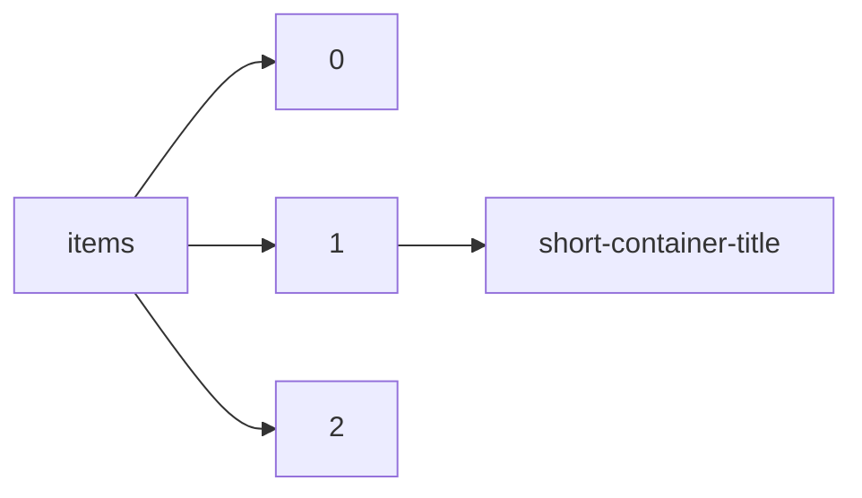

!!! warning "This document is not official Crossref documentation"
# Short-container-title
PATH = items/array/short-container-title(1)  
Occurs 90 054 566 times  
{ .annotate }

1. A route to an element, for example:  
   The route "items/array/short-container-title" corresponds to navigating through the JSON indices as  
   ["items"][0]["short-container-title"]  

## Properties of Array
See information about elements: [items/array/short-container-title/array](array/index.md)  
Distribution of lengths:  

| **Row** | **Length** `Any` | **Count** `Int64` |
|--------:|--------------------:|---------------------:|
| **1**   | 1                   | 88 872 310           |
| **2**   | 2                   | 701 079              |
| **3**   | 3                   | 146 169              |
| **4**   | 4                   | 90 954               |
| **5**   | 5                   | 48 687               |
| **6**   | 6                   | 89 131               |
| **7**   | 7                   | 13 326               |
| **8**   | 8                   | 34 699               |
| **9**   | 9                   | 41 769               |
| **10**  | 10                  | 16 442               |

