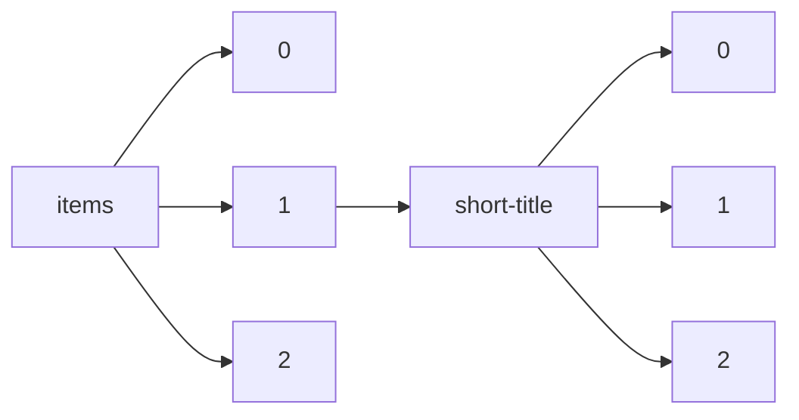

!!! warning "This document is not official Crossref documentation"
# Elements
PATH = items/array/short-title/array(1)  
Occurs 45 172 times  
Unique values: > 999  
{ .annotate }

1. A route to an element, for example:  
   The route "items/array/short-title/array" corresponds to navigating through the JSON indices as  
   ["items"][0]["short-title"][0]  

!!! note "Due to current limitations, only the first 1,000 unique values are counted."

| **Row** | **Value** `String`                                                    | **Count** `Int64` |
|--------:|-------------------------------------------------------------------------:|---------------------:|
| **1**   | wmc                                                                      | 1 552                |
| **2**   | ecancer                                                                  | 334                  |
| **3**   | TNCR                                                                     | 249                  |
| **4**   | JPES                                                                     | 234                  |
| **5**   | Fit Per J                                                                | 158                  |
| **6**   | Re3                                                                      | 103                  |
| **7**   | SDTE                                                                     | 101                  |
| **8**   | J Case Rep Images Surg                                                   | 87                   |
| **9**   | TDSE                                                                     | 80                   |
| **10**  | Geologyof                                                                | 70                   |
| **11**  | Preliminar                                                               | 70                   |
| **12**  | Edorium Open                                                             | 69                   |
| **13**  | FLR                                                                      | 55                   |
| **14**  | Edorium J Surg                                                           | 53                   |
| **15**  | Journ of Gemm                                                            | 50                   |
| **16**  | archmed                                                                  | 50                   |
| **17**  | J Case Rep Images Pathol                                                 | 48                   |
| **18**  | Nature Precedings                                                        | 38                   |
| **19**  | J.DEGRADE.MIN. LAND MANAGE.                                              | 37                   |
| **20**  | ijccc                                                                    | 37                   |
| **21**  | SAL 2016                                                                 | 35                   |
| **22**  | HGE                                                                      | 35                   |
| **23**  | SAL 2012                                                                 | 35                   |
| **24**  | int arab j antimic agents                                                | 34                   |
| **25**  | J Case Rep Images Dent                                                   | 34                   |
| **26**  | MZ                                                                       | 32                   |
| **27**  | J.Degrade.Min.Land Manage.                                               | 31                   |
| **28**  | j neuro neurosci                                                         | 30                   |
| **29**  | Enhancemen                                                               | 29                   |
| **30**  | Hir. pozvonoč.                                                           | 28                   |
| **31**  | CMJ                                                                      | 26                   |
| **32**  | GZ                                                                       | 26                   |
| **33**  | Edorium J Public Health                                                  | 26                   |
| **34**  | e-STA                                                                    | 25                   |
| **35**  | Edorium J Cell Biol                                                      | 24                   |
| **36**  | Trans Biomed                                                             | 23                   |
| **37**  | KKUJ.GS.                                                                 | 23                   |
| **38**  | Edorium J Anat Embryo                                                    | 23                   |
| **39**  | J Case Rep Images Opthalmol                                              | 21                   |
| **40**  | SAL 2018                                                                 | 21                   |
| **41**  | Edorium J Gynecol Obstet                                                 | 21                   |
| **42**  | Rev.latinoam.cienc.soc.niñez juv                                         | 20                   |
| **43**  | SAL 2020                                                                 | 20                   |
| **44**  | J Case Rep Images Orthop Rheum                                           | 20                   |
| **45**  | JLIV                                                                     | 18                   |
| **46**  | Edorium J Cardiothorac Vasc Surg                                         | 17                   |
| **47**  | J. biomed. sci.                                                          | 17                   |
| **48**  | A-JKP                                                                    | 16                   |
| **49**  | SALMAG                                                                   | 15                   |
| **50**  | BDICE                                                                    | 15                   |
| **51**  | JSIE                                                                     | 15                   |
| **52**  | newsline                                                                 | 15                   |
| **53**  | JES                                                                      | 15                   |
| **54**  | MFJ                                                                      | 15                   |
| **55**  | North Amer Fungi                                                         | 15                   |
| **56**  | RNC                                                                      | 14                   |
| **57**  | Novosti Khirurgii                                                        | 14                   |
| **58**  | ISP                                                                      | 14                   |
| **59**  | IJRBAT                                                                   | 14                   |
| **60**  | Edorium J Neurol                                                         | 14                   |
| **61**  | PI                                                                       | 14                   |
| **62**  | Passagens Rev Int Hist Pol Cult Jur                                      | 14                   |
| **63**  | R. Fac. Dir. UFU                                                         | 14                   |
| **64**  | LaMS                                                                     | 13                   |
| **65**  | Reactome                                                                 | 13                   |
| **66**  | Edorium J Psychol                                                        | 13                   |
| **67**  | J-Inst                                                                   | 13                   |
| **68**  | Edorium J Orthop                                                         | 13                   |
| **69**  | CALICO Journal                                                           | 13                   |
| **70**  | Edorium J Radiol                                                         | 13                   |
| **71**  | Permafrost                                                               | 13                   |
| **72**  | EM                                                                       | 12                   |
| **73**  | Edorium J Gastroenterol                                                  | 12                   |
| **74**  | pjchm                                                                    | 12                   |
| **75**  | J Water Technol Treat Methods                                            | 12                   |
| **76**  | Sabuco                                                                   | 12                   |
| **77**  | Edorium J Anes                                                           | 12                   |
| **78**  | SAL 2011                                                                 | 12                   |
| **79**  | PA                                                                       | 11                   |
| **80**  | JHS                                                                      | 11                   |
| **81**  | CS                                                                       | 11                   |
| **82**  | J bras doenças sex transm                                                | 11                   |
| **83**  | Edorium J Infect Dis                                                     | 11                   |
| **84**  | JSS                                                                      | 10                   |
| **85**  | CE                                                                       | 10                   |
| **86**  | SAJIC                                                                    | 10                   |
| **87**  | JEE                                                                      | 10                   |
| **88**  | DM                                                                       | 10                   |
| **89**  | Edorium J Cardiol                                                        | 10                   |
| **90**  | NTvT                                                                     | 10                   |
| **91**  | jtd                                                                      | 10                   |
| **92**  | IJAR                                                                     | 10                   |
| **93**  | Northwest                                                                | 10                   |
| **94**  | «Современная высшая школа: инновационный аспект»                         | 10                   |
| **95**  | DFYT                                                                     | 10                   |
| **96**  | J Proteomics Bioinform                                                   | 9                    |
| **97**  | JCP                                                                      | 9                    |
| **98**  | AP                                                                       | 9                    |
| **99**  | JEM                                                                      | 9                    |
| **100** | IJSS                                                                     | 9                    |
| **101** | JBIR                                                                     | 9                    |
| **102** | Therya                                                                   | 9                    |
| **103** | Geological                                                               | 9                    |
| **104** | IJPR                                                                     | 9                    |
| **105** | J. Elem.                                                                 | 9                    |
| **106** | J Clin Anal Med                                                          | 9                    |
| **107** | SAL 2013                                                                 | 9                    |
| **108** | Edorium J Microbiol                                                      | 9                    |
| **109** | J. Geophys. Res.                                                         | 8                    |
| **110** | JTD                                                                      | 8                    |
| **111** | JSE                                                                      | 8                    |
| **112** | Edorium J Cancer                                                         | 8                    |
| **113** | E&amp;S                                                                  | 8                    |
| **114** | Int J Cardiol Cardiovasc Med                                             | 8                    |
| **115** | JBA                                                                      | 8                    |
| **116** | Video J Clin Res                                                         | 8                    |
| **117** | J Case Rep Images Infect Dis                                             | 8                    |
| **118** | ZB                                                                       | 8                    |
| **119** | JST                                                                      | 8                    |
| **120** | Med Pr                                                                   | 8                    |
| **121** | J Turk Acad Dermatol                                                     | 8                    |
| **122** | EA                                                                       | 8                    |
| **123** | JSM                                                                      | 8                    |
| **124** | PE                                                                       | 8                    |
| **125** | JIEM                                                                     | 8                    |
| **126** | SS                                                                       | 7                    |
| **127** | JME                                                                      | 7                    |
| **128** | Int. J. Agr. Life. Sci                                                   | 7                    |
| **129** | ISQ                                                                      | 7                    |
| **130** | JOIS                                                                     | 7                    |
| **131** | PS                                                                       | 7                    |
| **132** | JAP                                                                      | 7                    |
| **133** | JPS                                                                      | 7                    |
| **134** | CM                                                                       | 7                    |
| **135** | JSSI                                                                     | 7                    |
| **136** | Int J Surg Proced                                                        | 7                    |
| **137** | Kimberlite                                                               | 7                    |
| **138** | Regionalistica                                                           | 7                    |
| **139** | J.Degrad. Min. Land Manage.                                              | 7                    |
| **140** | IJSR                                                                     | 6                    |
| **141** | AI                                                                       | 6                    |
| **142** | JED                                                                      | 6                    |
| **143** | JP                                                                       | 6                    |
| **144** | JGP                                                                      | 6                    |
| **145** | JM                                                                       | 6                    |
| **146** | Psic., Saúde &amp; Doenças                                               | 6                    |
| **147** | JA                                                                       | 6                    |
| **148** | Asian J. Chem.                                                           | 6                    |
| **149** | JPE                                                                      | 6                    |
| **150** | ER                                                                       | 6                    |
| **151** | ALAN                                                                     | 6                    |
| **152** | AE                                                                       | 6                    |
| **153** | -                                                                        | 6                    |
| **154** | Criticalm                                                                | 6                    |
| **155** | IJEE                                                                     | 6                    |
| **156** | RP                                                                       | 6                    |
| **157** | Aeromagnet                                                               | 6                    |
| **158** | Ponte                                                                    | 6                    |
| **159** | arch clin microb                                                         | 6                    |
| **160** | Edorium J Otolaryngol                                                    | 6                    |
| **161** | AB                                                                       | 6                    |
| **162** | Edorium J Pathol                                                         | 6                    |
| **163** | JS                                                                       | 6                    |
| **164** | SI                                                                       | 5                    |
| **165** | JMP                                                                      | 5                    |
| **166** | MMJ                                                                      | 5                    |
| **167** | IJCMS                                                                    | 5                    |
| **168** | J Bras Doenças Sex Transm                                                | 5                    |
| **169** | Arch. med.                                                               | 5                    |
| **170** | Biosci. J.                                                               | 5                    |
| **171** | BSK                                                                      | 5                    |
| **172** | HP                                                                       | 5                    |
| **173** | International Journal of Agricultural and Life Sciences                  | 5                    |
| **174** | ME                                                                       | 5                    |
| **175** | REA                                                                      | 5                    |
| **176** | JIS                                                                      | 5                    |
| **177** | GLOBAL MANAGEMENT REVIEW                                                 | 5                    |
| **178** | SP                                                                       | 5                    |
| **179** | RC                                                                       | 5                    |
| **180** | J Case Rep Images Uro                                                    | 5                    |
| **181** | RF                                                                       | 5                    |
| **182** | RCE                                                                      | 5                    |
| **183** | J Case Rep Images Pediatr                                                | 5                    |
| **184** | Airborneg                                                                | 5                    |
| **185** | RBUS                                                                     | 5                    |
| **186** | J. Exp. Zool.                                                            | 5                    |
| **187** | ACT                                                                      | 5                    |
| **188** | RAR                                                                      | 5                    |
| **189** | EntomoBrasilis                                                           | 5                    |
| **190** | ch                                                                       | 5                    |
| **191** | Biolife                                                                  | 5                    |
| **192** | int arab j antimic ag                                                    | 5                    |
| **193** | AS                                                                       | 5                    |
| **194** | Cell. Mol. Biol.                                                         | 5                    |
| **195** | Novterm                                                                  | 4                    |
| **196** | JCR                                                                      | 4                    |
| **197** | MG                                                                       | 4                    |
| **198** | PCS                                                                      | 4                    |
| **199** | BK                                                                       | 4                    |
| **200** | IT                                                                       | 4                    |
| **201** | SlaveProv                                                                | 4                    |
| **202** | RICUM                                                                    | 4                    |
| **203** | REDIS                                                                    | 4                    |
| **204** | AMJ                                                                      | 4                    |
| **205** | jst                                                                      | 4                    |
| **206** | VoR                                                                      | 4                    |
| **207** | Cases J                                                                  | 4                    |
| **208** | rastmd                                                                   | 4                    |
| **209** | Mar Biotechnol                                                           | 4                    |
| **210** | AIJ                                                                      | 4                    |
| **211** | J Diabetes Obes                                                          | 4                    |
| **212** | VJS                                                                      | 4                    |
| **213** | CCT                                                                      | 4                    |
| **214** | Rev Cient Odontol (Lima)                                                 | 4                    |
| **215** | Chest Heart J. J.                                                        | 4                    |
| **216** | JEES                                                                     | 4                    |
| **217** | SPP                                                                      | 4                    |
| **218** | sin                                                                      | 4                    |
| **219** | VIT                                                                      | 4                    |
| **220** | IJALS                                                                    | 4                    |
| **221** | RR                                                                       | 4                    |
| **222** | JAS                                                                      | 4                    |
| **223** | AA                                                                       | 4                    |
| **224** | J Case Rep Images Urol                                                   | 4                    |
| **225** | WormBook                                                                 | 4                    |
| **226** | EL                                                                       | 4                    |
| **227** | BMJ                                                                      | 4                    |
| **228** | Edorium J Pediatr                                                        | 4                    |
| **229** | IJP                                                                      | 4                    |
| **230** | SM                                                                       | 4                    |
| **231** | JPM                                                                      | 4                    |
| **232** | IJOG                                                                     | 4                    |
| **233** | JPP                                                                      | 4                    |
| **234** | J Dents Dent Med                                                         | 4                    |
| **235** | JIP                                                                      | 4                    |
| **236** | MS                                                                       | 4                    |
| **237** | ALL                                                                      | 4                    |
| **238** | IJM                                                                      | 4                    |
| **239** | SR                                                                       | 4                    |
| **240** | JIIP                                                                     | 4                    |
| **241** | IS                                                                       | 4                    |
| **242** | JML                                                                      | 4                    |
| **243** | JHP                                                                      | 4                    |
| **244** | IJMA                                                                     | 4                    |
| **245** | IJME                                                                     | 4                    |
| **246** | LV                                                                       | 4                    |
| **247** | JAT                                                                      | 4                    |
| **248** | T                                                                        | 4                    |
| **249** | Nurs Midwifery Stud                                                      | 4                    |
| **250** | Insights                                                                 | 4                    |
| **251** | JE                                                                       | 4                    |
| **252** | Ann med clin Oncol                                                       | 4                    |
| **253** |                                                                          | 4                    |
| **254** | J Pet Environ Biotechnol                                                 | 3                    |
| **255** | RESI                                                                     | 3                    |
| **256** | IJBEM                                                                    | 3                    |
| **257** | MMag                                                                     | 3                    |
| **258** | JESO                                                                     | 3                    |
| **259** | sajie                                                                    | 3                    |
| **260** | World J Surg                                                             | 3                    |
| **261** | JJP                                                                      | 3                    |
| **262** | Int J Cerebrovasc Dis Stroke                                             | 3                    |
| **263** | JSAS                                                                     | 3                    |
| **264** | JAMB                                                                     | 3                    |
| **265** | Assayresu                                                                | 3                    |
| **266** | CSO                                                                      | 3                    |
| **267** | agr                                                                      | 3                    |
| **268** | Humanitas                                                                | 3                    |
| **269** | RCC                                                                      | 3                    |
| **270** | IJCER                                                                    | 3                    |
| **271** | uu                                                                       | 3                    |
| **272** | jpa                                                                      | 3                    |
| **273** | JMR                                                                      | 3                    |
| **274** | IL                                                                       | 3                    |
| **275** | JICE                                                                     | 3                    |
| **276** | IJIES                                                                    | 3                    |
| **277** | AJES                                                                     | 3                    |
| **278** | Head Neck                                                                | 3                    |
| **279** | JEd                                                                      | 3                    |
| **280** | JSEM                                                                     | 3                    |
| **281** | IJED                                                                     | 3                    |
| **282** | SG                                                                       | 3                    |
| **283** | BJES                                                                     | 3                    |
| **284** | DD                                                                       | 3                    |
| **285** | EJ                                                                       | 3                    |
| **286** | JLS                                                                      | 3                    |
| **287** | JAFF                                                                     | 3                    |
| **288** | Acta Cryst B                                                             | 3                    |
| **289** | Edorium J Biochem                                                        | 3                    |
| **290** | IJPS                                                                     | 3                    |
| **291** | Pan Ar Ang J                                                             | 3                    |
| **292** | Arc Can Res Med                                                          | 3                    |
| **293** | MJM                                                                      | 3                    |
| **294** | J Aquac Res Development                                                  | 3                    |
| **295** | VUBmetrastis                                                             | 3                    |
| **296** | RFSA                                                                     | 3                    |
| **297** | Financial Sciences                                                       | 3                    |
| **298** | DG                                                                       | 3                    |
| **299** | Biology                                                                  | 3                    |
| **300** | psychology                                                               | 3                    |
| **301** | ACP                                                                      | 3                    |
| **302** | IJDM                                                                     | 3                    |
| **303** | AN                                                                       | 3                    |
| **304** | WS                                                                       | 3                    |
| **305** | JEMS                                                                     | 3                    |
| **306** | NOVYE ISSLEDOVANIA                                                       | 3                    |
| **307** | IJPE                                                                     | 3                    |
| **308** | Petroleum                                                                | 3                    |
| **309** | Geophysica                                                               | 3                    |
| **310** | PV                                                                       | 3                    |
| **311** | Vitam Miner                                                              | 3                    |
| **312** | AD                                                                       | 3                    |
| **313** | IJPES                                                                    | 3                    |
| **314** | IJMSR                                                                    | 3                    |
| **315** | MR                                                                       | 3                    |
| **316** | IJDAR                                                                    | 3                    |
| **317** | JOWS                                                                     | 3                    |
| **318** | CP                                                                       | 3                    |
| **319** | RMM                                                                      | 3                    |
| **320** | Int J Infect                                                             | 3                    |
| **321** | REP                                                                      | 3                    |
| **322** | Surg Endosc                                                              | 3                    |
| **323** | Edorium J Matern Child Health                                            | 3                    |
| **324** | Inventory                                                                | 3                    |
| **325** | IP                                                                       | 3                    |
| **326** | JPR                                                                      | 3                    |
| **327** | DT                                                                       | 3                    |
| **328** | SAS                                                                      | 3                    |
| **329** | jpm                                                                      | 3                    |
| **330** | ASJ                                                                      | 3                    |
| **331** | JESR                                                                     | 3                    |
| **332** | IJLE                                                                     | 3                    |
| **333** | LC                                                                       | 3                    |
| **334** | SW                                                                       | 3                    |
| **335** | es                                                                       | 3                    |
| **336** | vjph                                                                     | 3                    |
| **337** | HORIZONS                                                                 | 3                    |
| **338** | Psychology Research                                                      | 3                    |
| **339** | Libyan Dent J                                                            | 3                    |
| **340** | IJCT                                                                     | 3                    |
| **341** | epra                                                                     | 3                    |
| **342** | Nonprofit Management Leadership                                          | 3                    |
| **343** | Dataset Papers in Geosciences                                            | 2                    |
| **344** | IJELAL                                                                   | 2                    |
| **345** | JOMR                                                                     | 2                    |
| **346** | Advances in Urology                                                      | 2                    |
| **347** | MTO                                                                      | 2                    |
| **348** | J Synchrotron Rad                                                        | 2                    |
| **349** | Arch                                                                     | 2                    |
| **350** | JPRI                                                                     | 2                    |
| **351** | UOCHJLL                                                                  | 2                    |
| **352** | International Journal of Medicinal Chemistry                             | 2                    |
| **353** | JIMS                                                                     | 2                    |
| **354** | Advances in Optical Technologies                                         | 2                    |
| **355** | Fam.ter.                                                                 | 2                    |
| **356** | VJ                                                                       | 2                    |
| **357** | J Bacteriol Parasitol                                                    | 2                    |
| **358** | GST                                                                      | 2                    |
| **359** | Int. J. Bilin. Mult. Teach. Eng.                                         | 2                    |
| **360** | Case Reports in Medicine                                                 | 2                    |
| **361** | J Mol Biomark Diagn                                                      | 2                    |
| **362** | CB                                                                       | 2                    |
| **363** | ajps                                                                     | 2                    |
| **364** | EJSS                                                                     | 2                    |
| **365** | asir                                                                     | 2                    |
| **366** | IJCSAI                                                                   | 2                    |
| **367** | Polymer Crystallization                                                  | 2                    |
| **368** | Insights Biomed                                                          | 2                    |
| **369** | HKJSS                                                                    | 2                    |
| **370** | MWNP                                                                     | 2                    |
| **371** | EyeOnPsiChi                                                              | 2                    |
| **372** | MJDE                                                                     | 2                    |
| **373** | IJRE                                                                     | 2                    |
| **374** | J Oceanogr Mar Res                                                       | 2                    |
| **375** | ISRN Toxicology                                                          | 2                    |
| **376** | IJSMS                                                                    | 2                    |
| **377** | IJTE                                                                     | 2                    |
| **378** | amr                                                                      | 2                    |
| **379** | SPC                                                                      | 2                    |
| **380** | TIS                                                                      | 2                    |
| **381** | ETFIV                                                                    | 2                    |
| **382** | JCMCR                                                                    | 2                    |
| **383** | hayef                                                                    | 2                    |
| **384** | OArtsJ                                                                   | 2                    |
| **385** | J. Operational Meteor.                                                   | 2                    |
| **386** | IJG                                                                      | 2                    |
| **387** | Al-Basit                                                                 | 2                    |
| **388** | JCHS                                                                     | 2                    |
| **389** | JTC                                                                      | 2                    |
| **390** | SPE                                                                      | 2                    |
| **391** | Pathology Research International                                         | 2                    |
| **392** | Arch Pathol Clin Res                                                     | 2                    |
| **393** | IJDR                                                                     | 2                    |
| **394** | Cardiology Research and Practice                                         | 2                    |
| **395** | Avicenna J Environ Health Eng                                            | 2                    |
| **396** | JNHC                                                                     | 2                    |
| **397** | AJEB                                                                     | 2                    |
| **398** | Tekh. Diagnost. i Nerazrush. Kontrol                                     | 2                    |
| **399** | QD                                                                       | 2                    |
| **400** | EEENG                                                                    | 2                    |
| **401** | J Perina Clin Pediatr                                                    | 2                    |
| **402** | ESP                                                                      | 2                    |
| **403** | J. Med. Med. Sci.                                                        | 2                    |
| **404** | NK                                                                       | 2                    |
| **405** | Pacific Medical Journal                                                  | 2                    |
| **406** | BU                                                                       | 2                    |
| **407** | didaktika                                                                | 2                    |
| **408** | mls                                                                      | 2                    |
| **409** | International Journal of Navigation and Observation                      | 2                    |
| **410** | Journal of Signal Transduction                                           | 2                    |
| **411** | rh                                                                       | 2                    |
| **412** | Pediatric Infect Dis                                                     | 2                    |
| **413** | CPC                                                                      | 2                    |
| **414** | basjvet                                                                  | 2                    |
| **415** | IJMLC                                                                    | 2                    |
| **416** | IJCEA                                                                    | 2                    |
| **417** | IJNPT                                                                    | 2                    |
| **418** | LS                                                                       | 2                    |
| **419** | J Infect Dis Preve Med                                                   | 2                    |
| **420** | International Journal of Inflammation                                    | 2                    |
| **421** | ISRN Critical Care                                                       | 2                    |
| **422** | JoC                                                                      | 2                    |
| **423** | J. Chem. Soc., Dalton Trans.                                             | 2                    |
| **424** | MineralSh                                                                | 2                    |
| **425** | RCJ                                                                      | 2                    |
| **426** | RJPP                                                                     | 2                    |
| **427** | JLIS                                                                     | 2                    |
| **428** | RBP                                                                      | 2                    |
| **429** | OBM HG                                                                   | 2                    |
| **430** | J Anesth Clin Res                                                        | 2                    |
| **431** | BSJ                                                                      | 2                    |
| **432** | J Otol Rhinol                                                            | 2                    |
| **433** | si                                                                       | 2                    |
| **434** | jbe                                                                      | 2                    |
| **435** | ISRN Radiology                                                           | 2                    |
| **436** | CF                                                                       | 2                    |
| **437** | as                                                                       | 2                    |
| **438** | Acupunct Med                                                             | 2                    |
| **439** | UJ                                                                       | 2                    |
| **440** | JTOS                                                                     | 2                    |
| **441** | J Synchrotron Radiat                                                     | 2                    |
| **442** | ISRN Robotics                                                            | 2                    |
| **443** | Exploratio                                                               | 2                    |
| **444** | JBS                                                                      | 2                    |
| **445** | VER                                                                      | 2                    |
| **446** | Atlantis                                                                 | 2                    |
| **447** | Geologyan                                                                | 2                    |
| **448** | Rehabilitation Research and Practice                                     | 2                    |
| **449** | ISRN Biomaterials                                                        | 2                    |
| **450** | AJMRPE                                                                   | 2                    |
| **451** | IJRA                                                                     | 2                    |
| **452** | Golddepos                                                                | 2                    |
| **453** | aap                                                                      | 2                    |
| **454** | SpainConf                                                                | 2                    |
| **455** | IBJ                                                                      | 2                    |
| **456** | JAID                                                                     | 2                    |
| **457** | EC                                                                       | 2                    |
| **458** | ISJMEF                                                                   | 2                    |
| **459** | J Antivir Antiretrovir                                                   | 2                    |
| **460** | AH                                                                       | 2                    |
| **461** | LRIP                                                                     | 2                    |
| **462** | JIBE                                                                     | 2                    |
| **463** | Bull World Health Org                                                    | 2                    |
| **464** | IJET                                                                     | 2                    |
| **465** | TG                                                                       | 2                    |
| **466** | jamal                                                                    | 2                    |
| **467** | Insight                                                                  | 2                    |
| **468** | J Remote Sens GIS                                                        | 2                    |
| **469** | Edorium J Med                                                            | 2                    |
| **470** | Korean Journal of Family Welfare                                         | 2                    |
| **471** | Forestist                                                                | 2                    |
| **472** | GXP                                                                      | 2                    |
| **473** | CMR                                                                      | 2                    |
| **474** | TQ                                                                       | 2                    |
| **475** | JMB                                                                      | 2                    |
| **476** | IOJES                                                                    | 2                    |
| **477** | Advances in Operations Research                                          | 2                    |
| **478** | JAM                                                                      | 2                    |
| **479** | jour                                                                     | 2                    |
| **480** | JPEER                                                                    | 2                    |
| **481** | PP                                                                       | 2                    |
| **482** | IJMM                                                                     | 2                    |
| **483** | Medicine                                                                 | 2                    |
| **484** | JoMS                                                                     | 2                    |
| **485** | J Sleep Disord Ther                                                      | 2                    |
| **486** | CST                                                                      | 2                    |
| **487** | MBI                                                                      | 2                    |
| **488** | racs                                                                     | 2                    |
| **489** | PPD                                                                      | 2                    |
| **490** | Sci. J. Crop Sci.                                                        | 2                    |
| **491** | JBD                                                                      | 2                    |
| **492** | IJCWPM                                                                   | 2                    |
| **493** | RVM                                                                      | 2                    |
| **494** | IJODR                                                                    | 2                    |
| **495** | JLR                                                                      | 2                    |
| **496** | OPTO                                                                     | 2                    |
| **497** | Politix                                                                  | 2                    |
| **498** | Dataset Papers in Chemistry                                              | 2                    |
| **499** | Ethnobot. Res. App.                                                      | 2                    |
| **500** | West Indian Med J                                                        | 2                    |
| **501** | AMR                                                                      | 2                    |
| **502** | SJMS                                                                     | 2                    |
| **503** | jmi                                                                      | 2                    |
| **504** | International Journal of Oceanography                                    | 2                    |
| **505** | Jentashapir J Health Res                                                 | 2                    |
| **506** | Jundishapur J Chronic Dis Care                                           | 2                    |
| **507** | JPTCP                                                                    | 2                    |
| **508** | JPCR                                                                     | 2                    |
| **509** | JDOB                                                                     | 2                    |
| **510** | SCTP                                                                     | 2                    |
| **511** | fem                                                                      | 2                    |
| **512** | EPS                                                                      | 2                    |
| **513** | NSE                                                                      | 2                    |
| **514** | an J Health Educ Health Promot                                           | 2                    |
| **515** | IJFCC                                                                    | 2                    |
| **516** | CADESTE                                                                  | 2                    |
| **517** | Biomark J                                                                | 2                    |
| **518** | Arch Trauma Res                                                          | 2                    |
| **519** | JCCR                                                                     | 2                    |
| **520** | JTA                                                                      | 2                    |
| **521** | supremasi                                                                | 2                    |
| **522** | LO                                                                       | 2                    |
| **523** | IJMDE                                                                    | 2                    |
| **524** | Passagens. Rev Int Hist Pol Cult Jur                                     | 2                    |
| **525** | IJWG                                                                     | 2                    |
| **526** | ITI                                                                      | 2                    |
| **527** | Econ.Polit/Chile                                                         | 2                    |
| **528** | J Anal Bioanal Tech                                                      | 2                    |
| **529** | IJSER                                                                    | 2                    |
| **530** | ITE                                                                      | 2                    |
| **531** | Arthritis                                                                | 2                    |
| **532** | Dataset Papers in Nanotechnology                                         | 2                    |
| **533** | RPF                                                                      | 2                    |
| **534** | for                                                                      | 2                    |
| **535** | KJHSS                                                                    | 2                    |
| **536** | JABB                                                                     | 2                    |
| **537** | JRS                                                                      | 2                    |
| **538** | Cumieira                                                                 | 2                    |
| **539** | JPI                                                                      | 2                    |
| **540** | jbi                                                                      | 2                    |
| **541** | MM                                                                       | 2                    |
| **542** | Bulletin of Agrarian Science                                             | 2                    |
| **543** | SOJI                                                                     | 2                    |
| **544** | ijsr                                                                     | 2                    |
| **545** | CR                                                                       | 2                    |
| **546** | Hydrocarbo                                                               | 2                    |
| **547** | JIK                                                                      | 2                    |
| **548** | Journal of Catalysts                                                     | 2                    |
| **549** | IJRDPL                                                                   | 2                    |
| **550** | IRJBS                                                                    | 2                    |
| **551** | KK                                                                       | 2                    |
| **552** | JVI                                                                      | 2                    |
| **553** | J INFORM SYSTEMS ENG                                                     | 2                    |
| **554** | JCSR                                                                     | 2                    |
| **555** | CTT                                                                      | 2                    |
| **556** | Int J Vet Sci                                                            | 2                    |
| **557** | JSI                                                                      | 2                    |
| **558** | JDS                                                                      | 2                    |
| **559** | JPED                                                                     | 2                    |
| **560** | JEAS                                                                     | 2                    |
| **561** | Arch Clin Exp Orthop                                                     | 2                    |
| **562** | JOD                                                                      | 2                    |
| **563** | ČL                                                                       | 2                    |
| **564** | Cuad. teol.                                                              | 2                    |
| **565** | ES                                                                       | 2                    |
| **566** | IJFGCN                                                                   | 2                    |
| **567** | CBAB                                                                     | 2                    |
| **568** | IJAST                                                                    | 2                    |
| **569** | IJKEM                                                                    | 2                    |
| **570** | JMPP                                                                     | 2                    |
| **571** | Int J Community Med Public Health                                        | 2                    |
| **572** | JOACE                                                                    | 2                    |
| **573** | HSS                                                                      | 2                    |
| **574** | Dermatoz                                                                 | 2                    |
| **575** | CMP                                                                      | 2                    |
| **576** | Salmand                                                                  | 2                    |
| **577** | JCST                                                                     | 2                    |
| **578** | Int Arch Vasc Med                                                        | 2                    |
| **579** | Egypt. J. Exp. Biol. (Bot.)                                              | 2                    |
| **580** | MedEdPublish                                                             | 2                    |
| **581** | Geochemica                                                               | 2                    |
| **582** | GJET                                                                     | 2                    |
| **583** | ajtm                                                                     | 2                    |
| **584** | Rev. SORBI                                                               | 2                    |
| **585** | JBE                                                                      | 2                    |
| **586** | Glob Clin Transl Res                                                     | 2                    |
| **587** | IJAMS                                                                    | 2                    |
| **588** | Reporton                                                                 | 2                    |
| **589** | ANS                                                                      | 2                    |
| **590** | JCH                                                                      | 2                    |
| **591** | JHE                                                                      | 2                    |
| **592** | AFR                                                                      | 2                    |
| **593** | JAE                                                                      | 2                    |
| **594** | IJAER                                                                    | 2                    |
| **595** | JMSR                                                                     | 2                    |
| **596** | International Journal of Agricultural and Life Sciences- IJALS (2017)    | 2                    |
| **597** | CJ                                                                       | 2                    |
| **598** | CCP                                                                      | 2                    |
| **599** | JJRS                                                                     | 2                    |
| **600** | CCS                                                                      | 2                    |
| **601** | CER                                                                      | 2                    |
| **602** | Pegmatite                                                                | 2                    |
| **603** | JIM                                                                      | 2                    |
| **604** | HJ                                                                       | 2                    |
| **605** | TUS                                                                      | 2                    |
| **606** | ijll                                                                     | 2                    |
| **607** | ji                                                                       | 2                    |
| **608** | ISRN Biomathematics                                                      | 2                    |
| **609** | Edorium J Ophthalmol                                                     | 2                    |
| **610** | DSC                                                                      | 2                    |
| **611** | IDR                                                                      | 2                    |
| **612** | JAES                                                                     | 2                    |
| **613** | JCLS                                                                     | 2                    |
| **614** | eej                                                                      | 2                    |
| **615** | IJIED                                                                    | 2                    |
| **616** | SJPM                                                                     | 2                    |
| **617** | jnps                                                                     | 2                    |
| **618** | RAJAR                                                                    | 2                    |
| **619** | ref                                                                      | 2                    |
| **620** | IJC                                                                      | 2                    |
| **621** | JTP                                                                      | 2                    |
| **622** | Journal of Pathogens                                                     | 2                    |
| **623** | EJPAD                                                                    | 2                    |
| **624** | OJC                                                                      | 2                    |
| **625** | Avicenna J Dent Res                                                      | 2                    |
| **626** | HCS                                                                      | 2                    |
| **627** | NZJP                                                                     | 2                    |
| **628** | HC                                                                       | 2                    |
| **629** | JC                                                                       | 2                    |
| **630** | SJS                                                                      | 2                    |
| **631** | REI                                                                      | 2                    |
| **632** | JAR                                                                      | 2                    |
| **633** | J. polym. sci., C Polym. symp.                                           | 2                    |
| **634** | HPB Surgery                                                              | 2                    |
| **635** | RBCS                                                                     | 2                    |
| **636** | jpr                                                                      | 2                    |
| **637** | JLT                                                                      | 2                    |
| **638** | Acta Cryst Sect B                                                        | 2                    |
| **639** | JDP                                                                      | 2                    |
| **640** | UNNCRNSS                                                                 | 2                    |
| **641** | IJES                                                                     | 2                    |
| **642** | JSSA                                                                     | 2                    |
| **643** | Geosci. Data J.                                                          | 2                    |
| **644** | JBR                                                                      | 2                    |
| **645** | Gynecol Obstet                                                           | 2                    |
| **646** | IJT                                                                      | 2                    |
| **647** | STURII                                                                   | 2                    |
| **648** | ASHE-ERIC High. Edu. Rept.                                               | 2                    |
| **649** | TMJ                                                                      | 2                    |
| **650** | PH                                                                       | 2                    |
| **651** | IJAPM                                                                    | 2                    |
| **652** | keperawatan                                                              | 2                    |
| **653** | Aging Med Healthc                                                        | 2                    |
| **654** | IJMF                                                                     | 2                    |
| **655** | JLL                                                                      | 2                    |
| **656** | IJPM                                                                     | 2                    |
| **657** | WP                                                                       | 2                    |
| **658** | CAIS                                                                     | 2                    |
| **659** | MP                                                                       | 2                    |
| **660** | J Comput Sci Syst Biol                                                   | 2                    |
| **661** | RJTCS                                                                    | 2                    |
| **662** | Acta Crystallogr B Struct Sci Cryst Eng Mater                            | 2                    |
| **663** | J. Chem. Soc., Perkin Trans. 1                                           | 2                    |
| **664** | OMJ                                                                      | 2                    |
| **665** | JSTA                                                                     | 2                    |
| **666** | AJPS                                                                     | 2                    |
| **667** | SMEP                                                                     | 2                    |
| **668** | Geochemist                                                               | 2                    |
| **669** | AIDS Research and Treatment                                              | 2                    |
| **670** | J Preg Child Health                                                      | 2                    |
| **671** | SOJAPM                                                                   | 2                    |
| **672** | Acta Crystallogr Sect B Struct Sci Cryst Eng Mater                       | 2                    |
| **673** | JAREM                                                                    | 2                    |
| **674** | JEMIS                                                                    | 2                    |
| **675** | Ulcers                                                                   | 2                    |
| **676** | Geol Cro                                                                 | 2                    |
| **677** | RJPS                                                                     | 2                    |
| **678** | Contemporary Logistics                                                   | 2                    |
| **679** | Surficial                                                                | 2                    |
| **680** | Razavi Int J Med                                                         | 2                    |
| **681** | Pesq. Flor. Bras.                                                        | 2                    |
| **682** | ISRN Molecular Imaging                                                   | 2                    |
| **683** | Teknika                                                                  | 2                    |
| **684** | FC                                                                       | 2                    |
| **685** | J Emerg Rare Dis                                                         | 2                    |
| **686** | JI                                                                       | 2                    |
| **687** | JSA                                                                      | 2                    |
| **688** | JSHD                                                                     | 2                    |
| **689** | J Med Sci Res                                                            | 2                    |
| **690** | JAIS                                                                     | 2                    |
| **691** | JEP                                                                      | 2                    |
| **692** | IJAM                                                                     | 2                    |
| **693** | jms                                                                      | 2                    |
| **694** | SD                                                                       | 2                    |
| **695** | Edu.                                                                     | 2                    |
| **696** | CES                                                                      | 2                    |
| **697** | IJPT                                                                     | 2                    |
| **698** | Autoimmune Diseases                                                      | 2                    |
| **699** | ISRN Inorganic Chemistry                                                 | 2                    |
| **700** | Emergency Medicine International                                         | 2                    |
| **701** | AT                                                                       | 2                    |
| **702** | BER                                                                      | 2                    |
| **703** | NHC                                                                      | 2                    |
| **704** | e-cucba                                                                  | 2                    |
| **705** | IJNR                                                                     | 2                    |
| **706** | AnArcView                                                                | 2                    |
| **707** | J. Pediatr. Acad.                                                        | 2                    |
| **708** | AR                                                                       | 2                    |
| **709** | EJHSS                                                                    | 2                    |
| **710** | JAC                                                                      | 2                    |
| **711** | Health Technol Assess                                                    | 2                    |
| **712** | International Journal of Plant Genomics                                  | 2                    |
| **713** | ACC                                                                      | 2                    |
| **714** | RED                                                                      | 2                    |
| **715** | AJAP                                                                     | 2                    |
| **716** | DRL                                                                      | 2                    |
| **717** | CEI                                                                      | 2                    |
| **718** | Adv Edu Res                                                              | 2                    |
| **719** | IJPSR                                                                    | 2                    |
| **720** | mabs                                                                     | 2                    |
| **721** | CSS                                                                      | 2                    |
| **722** | J Def Manag                                                              | 2                    |
| **723** | IJMS                                                                     | 2                    |
| **724** | JIMA                                                                     | 2                    |
| **725** | npa                                                                      | 2                    |
| **726** | International Journal of Evolutionary Biology                            | 2                    |
| **727** | JRME                                                                     | 2                    |
| **728** | APJCRI                                                                   | 2                    |
| **729** | Niche                                                                    | 2                    |
| **730** | jsts                                                                     | 2                    |
| **731** | Cult. Hist. Digit. J.                                                    | 2                    |
| **732** | J Biocatal Biotransformation                                             | 2                    |
| **733** | PHF                                                                      | 2                    |
| **734** | Acta Crystallogr Sect B                                                  | 2                    |
| **735** | RICE                                                                     | 2                    |
| **736** | RCAP                                                                     | 2                    |
| **737** | JEN                                                                      | 2                    |
| **738** | IJPA                                                                     | 2                    |
| **739** | International Journal of Telemedicine and Applications                   | 2                    |
| **740** | IJECS                                                                    | 2                    |
| **741** | Revista Ehquidad                                                         | 2                    |
| **742** | MK                                                                       | 2                    |
| **743** | LAW RES INST CHUNGBUK NATL UNIV                                          | 2                    |
| **744** | DO                                                                       | 2                    |
| **745** | Biodiversitas                                                            | 2                    |
| **746** | AJA                                                                      | 2                    |
| **747** | Int J Sch Cogn Psychol                                                   | 2                    |
| **748** | IJELS                                                                    | 2                    |
| **749** | ja                                                                       | 2                    |
| **750** | BJI                                                                      | 2                    |
| **751** | TM                                                                       | 2                    |
| **752** | RECIMUNDO                                                                | 2                    |
| **753** | Int J Biopharm Sci                                                       | 2                    |
| **754** | CDR                                                                      | 2                    |
| **755** | RBPS                                                                     | 2                    |
| **756** | CRIO                                                                     | 2                    |
| **757** | CMS                                                                      | 2                    |
| **758** | ERIES Journal                                                            | 2                    |
| **759** | Anuário IGEO-UFRJ                                                        | 2                    |
| **760** | JMT                                                                      | 2                    |
| **761** | JTAE                                                                     | 2                    |
| **762** | DGGS                                                                     | 2                    |
| **763** | CyS                                                                      | 2                    |
| **764** | JSR                                                                      | 2                    |
| **765** | Libyan J Pharm &amp; Clin Pharmacol                                      | 2                    |
| **766** | EMJ                                                                      | 2                    |
| **767** | Journal of Osteoporosis                                                  | 2                    |
| **768** | The Turn                                                                 | 2                    |
| **769** | Int J School Health                                                      | 2                    |
| **770** | Int J Foot Ankle                                                         | 2                    |
| **771** | IA                                                                       | 2                    |
| **772** | ROR                                                                      | 2                    |
| **773** | Abbr.                                                                    | 2                    |
| **774** | IJFPS                                                                    | 2                    |
| **775** | J Clin Res Bioeth                                                        | 2                    |
| **776** | SC                                                                       | 2                    |
| **777** | Acta Crystallogr B                                                       | 2                    |
| **778** | MIJ                                                                      | 2                    |
| **779** | MJPS                                                                     | 2                    |
| **780** | BIJDM                                                                    | 2                    |
| **781** | TP                                                                       | 2                    |
| **782** | J Adv Dairy Res                                                          | 2                    |
| **783** | LB                                                                       | 2                    |
| **784** | JTE                                                                      | 2                    |
| **785** | JLM                                                                      | 2                    |
| **786** | WOC                                                                      | 2                    |
| **787** | itbj.sci.                                                                | 2                    |
| **788** | Research in Sport Education and Sciences                                 | 2                    |
| **789** | Middle East J Rehabil Health Stud                                        | 2                    |
| **790** | BSTD                                                                     | 2                    |
| **791** | LP                                                                       | 2                    |
| **792** | NP                                                                       | 2                    |
| **793** | Sportlogia                                                               | 2                    |
| **794** | AJNR                                                                     | 2                    |
| **795** | FSU                                                                      | 2                    |
| **796** | COS                                                                      | 2                    |
| **797** | AM                                                                       | 2                    |
| **798** | Edorium J Gastrointest Surg                                              | 2                    |
| **799** | Tftr                                                                     | 2                    |
| **800** | j. nanotechnol. inf.                                                     | 2                    |
| **801** | UUSC                                                                     | 2                    |
| **802** | JGER                                                                     | 2                    |
| **803** | JRST                                                                     | 2                    |
| **804** | JCA                                                                      | 2                    |
| **805** | basrv                                                                    | 2                    |
| **806** | JNPR                                                                     | 2                    |
| **807** | JH                                                                       | 2                    |
| **808** | IJCIR                                                                    | 2                    |
| **809** | jap                                                                      | 2                    |
| **810** | Food Nutr OA                                                             | 2                    |
| **811** | REE                                                                      | 2                    |
| **812** | Am. J. Med. Genet.                                                       | 2                    |
| **813** | JSP                                                                      | 2                    |
| **814** | AJACT                                                                    | 2                    |
| **815** | J Orthod Craniofac Res                                                   | 2                    |
| **816** | Libyan J Surg                                                            | 2                    |
| **817** | AEM                                                                      | 2                    |
| **818** | CMM                                                                      | 2                    |
| **819** | UBSRAS                                                                   | 2                    |
| **820** | Glob J Rare Dis                                                          | 2                    |
| **821** | Molecular Biology International                                          | 2                    |
| **822** | EAPJMRM                                                                  | 2                    |
| **823** | CA                                                                       | 2                    |
| **824** | PsiChiJournal                                                            | 2                    |
| **825** | VA                                                                       | 2                    |
| **826** | SA                                                                       | 2                    |
| **827** | Adv Pediatr Neonatol care                                                | 2                    |
| **828** | PL                                                                       | 2                    |
| **829** | PR                                                                       | 2                    |
| **830** | J Cell Signa                                                             | 2                    |
| **831** | EDU                                                                      | 2                    |
| **832** | WMC                                                                      | 2                    |
| **833** | CISC                                                                     | 2                    |
| **834** | Autism Open Access                                                       | 2                    |
| **835** | J. Chem. Soc., Perkin Trans. 2                                           | 2                    |
| **836** | APysCeram                                                                | 2                    |
| **837** | Journal of Engineering                                                   | 2                    |
| **838** | JMC                                                                      | 2                    |
| **839** | test                                                                     | 2                    |
| **840** | DOBCR                                                                    | 2                    |
| **841** | NWTKimber                                                                | 2                    |
| **842** | Ka'a'geeT                                                                | 2                    |
| **843** | MODEL                                                                    | 2                    |
| **844** | OTR                                                                      | 2                    |
| **845** | Limnol. Oceanogr.                                                        | 2                    |
| **846** | cm                                                                       | 2                    |
| **847** | AJICE                                                                    | 2                    |
| **848** | JOE                                                                      | 2                    |
| **849** | Scien. Iuris                                                             | 2                    |
| **850** | Titivillus                                                               | 2                    |
| **851** | CHEM                                                                     | 2                    |
| **852** | JABs                                                                     | 1                    |
| **853** | psy                                                                      | 1                    |
| **854** | Eur Polit Sci                                                            | 1                    |
| **855** | Rev. Cient. CRO-RJ (Online)                                              | 1                    |
| **856** | Chem Record                                                              | 1                    |
| **857** | J. Publ. Aff.                                                            | 1                    |
| **858** | J. Bioshell                                                              | 1                    |
| **859** | Journal Liaison Academia and Society                                     | 1                    |
| **860** | Am J Psychoanal                                                          | 1                    |
| **861** | MSW                                                                      | 1                    |
| **862** | MJVS                                                                     | 1                    |
| **863** | Revista Logos                                                            | 1                    |
| **864** | ETI                                                                      | 1                    |
| **865** | INTURI                                                                   | 1                    |
| **866** | res42                                                                    | 1                    |
| **867** | IJNMN                                                                    | 1                    |
| **868** | J. Kor. Grassl. Forage. Sci.                                             | 1                    |
| **869** | SNVMKSPUS:P(L)                                                           | 1                    |
| **870** | sciencemeans                                                             | 1                    |
| **871** | rha                                                                      | 1                    |
| **872** | West Indian J. Immunol                                                   | 1                    |
| **873** | Reto                                                                     | 1                    |
| **874** | JIAFE                                                                    | 1                    |
| **875** | BAPI                                                                     | 1                    |
| **876** | NATURE AND SCIENCE                                                       | 1                    |
| **877** | JHRT                                                                     | 1                    |
| **878** | A&amp;E                                                                  | 1                    |
| **879** | Historical-Philological Journal                                          | 1                    |
| **880** | Les cahiers internationaux de psychologie sociale                        | 1                    |
| **881** | Korean Soc Stud Vocat Edu                                                | 1                    |
| **882** | AFJPS                                                                    | 1                    |
| **883** | J Clin Exp Nephrol                                                       | 1                    |
| **884** | BECH                                                                     | 1                    |
| **885** | E&amp;R                                                                  | 1                    |
| **886** | LHEP                                                                     | 1                    |
| **887** | Green Chem.                                                              | 1                    |
| **888** | Geol. USP, Sér. cient.                                                   | 1                    |
| **889** | JournEEL                                                                 | 1                    |
| **890** | Open J Pulm Respir Med                                                   | 1                    |
| **891** | Int. J. Rotat. Mach.                                                     | 1                    |
| **892** | Ann Noninvasive Electrocardiol                                           | 1                    |
| **893** | IPSI TIR                                                                 | 1                    |
| **894** | CSW                                                                      | 1                    |
| **895** | RDAHAYL                                                                  | 1                    |
| **896** | INAQUE                                                                   | 1                    |
| **897** | dankooklawriview                                                         | 1                    |
| **898** | HID                                                                      | 1                    |
| **899** | S&amp;P                                                                  | 1                    |
| **900** | Int. J. Immunol. Res.                                                    | 1                    |
| **901** | il                                                                       | 1                    |
| **902** | Jurlisa                                                                  | 1                    |
| **903** | Enferm Nefrol                                                            | 1                    |
| **904** | JBN                                                                      | 1                    |
| **905** | Asian Journal of Contemporary Education                                  | 1                    |
| **906** | Centre of Linguocultural Research Balcanica. Proceedings of Round Tables | 1                    |
| **907** | IEEE Electr. Insul. Mag.                                                 | 1                    |
| **908** | ijpt                                                                     | 1                    |
| **909** | RIJED                                                                    | 1                    |
| **910** | J GRAPH-HOC                                                              | 1                    |
| **911** | Advances in Radiology                                                    | 1                    |
| **912** | Savannah Vet J                                                           | 1                    |
| **913** | OJ                                                                       | 1                    |
| **914** | RJPDFT                                                                   | 1                    |
| **915** | Case Reports in Ophthalmological Medicine                                | 1                    |
| **916** | tc                                                                       | 1                    |
| **917** | TAJDID J. Pemikir. Keislam. dan Kemanus.                                 | 1                    |
| **918** | cia                                                                      | 1                    |
| **919** | Ilha R. Antropologia                                                     | 1                    |
| **920** | Evid Based Dent                                                          | 1                    |
| **921** | statera                                                                  | 1                    |
| **922** | koreanjournaloffolkstudies                                               | 1                    |
| **923** | JADCR                                                                    | 1                    |
| **924** | Plant Direct                                                             | 1                    |
| **925** | jda                                                                      | 1                    |
| **926** | Opuscula Math.                                                           | 1                    |
| **927** | JDB                                                                      | 1                    |
| **928** | ReInA                                                                    | 1                    |
| **929** | Acta Biol Malays                                                         | 1                    |
| **930** | KJJ                                                                      | 1                    |
| **931** | Palaeontol electron                                                      | 1                    |
| **932** | journalofadvancedengineeringandtechnology                                | 1                    |
| **933** | JUR                                                                      | 1                    |
| **934** | JGIASS                                                                   | 1                    |
| **935** | iaat                                                                     | 1                    |
| **936** | RCJS-IURJ                                                                | 1                    |
| **937** | Journal of Sports Medicine                                               | 1                    |
| **938** | SJR                                                                      | 1                    |
| **939** | Int J Sports Exerc Med                                                   | 1                    |
| **940** | CTTUCTN                                                                  | 1                    |
| **941** | Future Oriented Youth Soc                                                | 1                    |
| **942** | J Catal Chem Eng Adv                                                     | 1                    |
| **943** | epes                                                                     | 1                    |
| **944** | CSROA                                                                    | 1                    |
| **945** | TASK                                                                     | 1                    |
| **946** | IEEE Power Electron. Lett.                                               | 1                    |
| **947** | Advances in Electronics                                                  | 1                    |
| **948** | JCISS                                                                    | 1                    |
| **949** | ETCS                                                                     | 1                    |
| **950** | GKDA Derg                                                                | 1                    |
| **951** | Arq Cien do Esp                                                          | 1                    |
| **952** | jjnpp                                                                    | 1                    |
| **953** | IHM                                                                      | 1                    |
| **954** | Onco Tum Res                                                             | 1                    |
| **955** | genesandcancer                                                           | 1                    |
| **956** | nzcomjnl                                                                 | 1                    |
| **957** | Int. J. Circ. Theor. Appl.                                               | 1                    |
| **958** | Dig Sys                                                                  | 1                    |
| **959** | Chin. J. Chem.                                                           | 1                    |
| **960** | Médium                                                                   | 1                    |
| **961** | Int Polit Rev                                                            | 1                    |
| **962** | AWEJ                                                                     | 1                    |
| **963** | F1000 Med Rep                                                            | 1                    |
| **964** | dharmaBakti                                                              | 1                    |
| **965** | JCV                                                                      | 1                    |
| **966** | Res Clin Dermatol                                                        | 1                    |
| **967** | Limnology and Oceanography: Bulletin                                     | 1                    |
| **968** | J. Odor Indoor Environ.                                                  | 1                    |
| **969** | Horizonte                                                                | 1                    |
| **970** | J. Mater. Chem. A                                                        | 1                    |
| **971** | Tr. of Ac.                                                               | 1                    |
| **972** | Journal de gestion et d'économie médicales                               | 1                    |
| **973** | Mitra J. Pemberdaya. Masy.                                               | 1                    |
| **974** | Actes de la recherche en sciences sociales                               | 1                    |
| **975** | ridc                                                                     | 1                    |
| **976** | kanun                                                                    | 1                    |
| **977** | ijber                                                                    | 1                    |
| **978** | NEJCS                                                                    | 1                    |
| **979** | Korean soc. Med. Crop. Sci.                                              | 1                    |
| **980** | ACompilat                                                                | 1                    |
| **981** | Revista de Educomunicação Ambiental                                      | 1                    |
| **982** | J of Anal Tech                                                           | 1                    |
| **983** | APIC                                                                     | 1                    |
| **984** | IJASMT                                                                   | 1                    |
| **985** | Literacy : Jurnal Ilmiah Sosial                                          | 1                    |
| **986** | JEPE                                                                     | 1                    |
| **987** | JAEMCR                                                                   | 1                    |
| **988** | Neuropsychiatry (London)                                                 | 1                    |
| **989** | Journal of Sensors                                                       | 1                    |
| **990** | J. Ris. Biol. Apl.                                                       | 1                    |
| **991** | bistek                                                                   | 1                    |
| **992** | Rev. géogr. alp.                                                         | 1                    |
| **993** | jfa                                                                      | 1                    |
| **994** | PedActa                                                                  | 1                    |
| **995** | Revue d'histoire des sciences                                            | 1                    |
| **996** | IJIPEM                                                                   | 1                    |
| **997** | dps                                                                      | 1                    |
| **998** | Worl Res J of Card                                                       | 1                    |
| **999** | AGS                                                                      | 1                    |
| ... | ... | ... |

