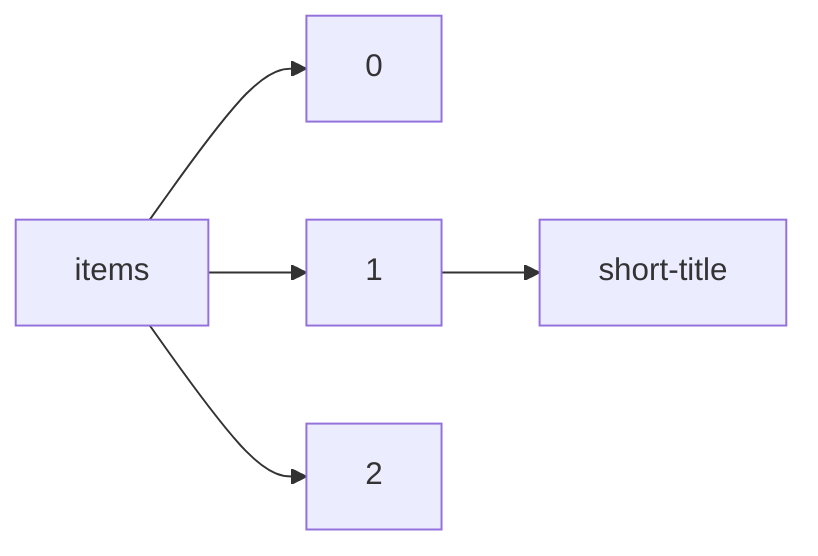

!!! warning "This document is not official Crossref documentation"
# Short-title
PATH = items/array/short-title(1)  
Occurs 45 007 times  
{ .annotate }

1. A route to an element, for example:  
   The route "items/array/short-title" corresponds to navigating through the JSON indices as  
   ["items"][0]["short-title"]  

## Properties of Array
See information about elements: [items/array/short-title/array](array/index.md)  
Distribution of lengths:  

| **Row** | **Length** `Any` | **Count** `Int64` |
|--------:|--------------------:|---------------------:|
| **1**   | 1                   | 44 957               |
| **2**   | 2                   | 23                   |
| **3**   | 3                   | 4                    |
| **4**   | 4                   | 5                    |
| **5**   | 5                   | 1                    |
| **6**   | 6                   | 8                    |
| **7**   | 7                   | 2                    |
| **8**   | 10                  | 7                    |

