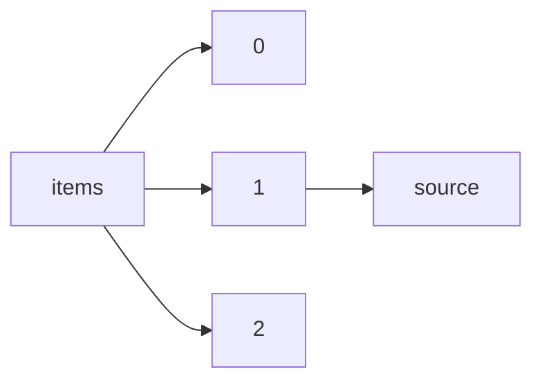

!!! warning "This document is not official Crossref documentation"
# Source
PATH = items/array/source(1)  
Occurs 143 500 239 times  
Unique values: 1  
{ .annotate }

1. A route to an element, for example:  
   The route "items/array/source" corresponds to navigating through the JSON indices as  
   ["items"][0]["source"]  

| **Row** | **Value** `String` | **Count** `Int64` |
|--------:|----------------------:|---------------------:|
| **1**   | Crossref              | 143 500 239          |

