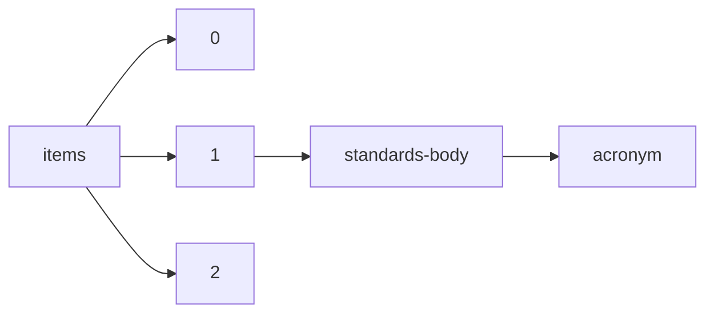

!!! warning "This document is not official Crossref documentation"
# Acronym
PATH = items/array/standards-body/acronym(1)  
Occurs 365 607 times  
Unique values: 20  
{ .annotate }

1. A route to an element, for example:  
   The route "items/array/standards-body/acronym" corresponds to navigating through the JSON indices as  
   ["items"][0]["standards-body"]["acronym"]  

| **Row** | **Value** `String` | **Count** `Int64` |
|--------:|----------------------:|---------------------:|
| **1**   | BSI                   | 150 820              |
| **2**   | ASTM                  | 96 612               |
| **3**   | DIN                   | 48 307               |
| **4**   | SAE                   | 43 663               |
| **5**   | USP                   | 17 657               |
| **6**   | IEEE                  | 5 364                |
| **7**   | AWWA                  | 1 352                |
| **8**   | RCC                   | 1 307                |
| **9**   | CIE                   | 307                  |
| **10**  | IVOA                  | 86                   |
| **11**  | NISO                  | 74                   |
| **12**  | ISO                   | 19                   |
| **13**  | ASME                  | 17                   |
| **14**  | Beilstein-Institut    | 14                   |
| **15**  | MSC                   | 2                    |
| **16**  | CRABC                 | 2                    |
| **17**  | JAM                   | 1                    |
| **18**  | CRS                   | 1                    |
| **19**  | ABEC Brasil           | 1                    |
| **20**  |                       | 1                    |

