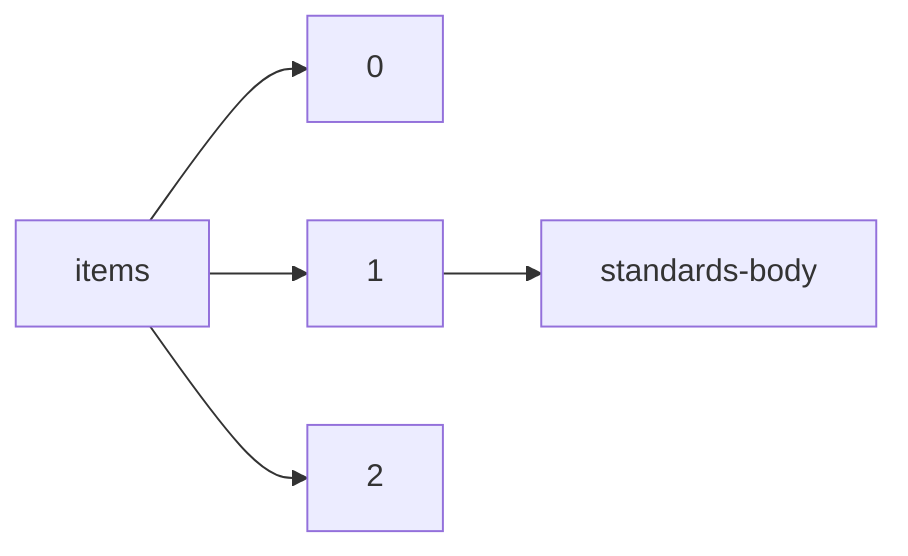

!!! warning "This document is not official Crossref documentation"
# Standards-body
PATH = items/array/standards-body(1)  
Occurs 365 607 times  
{ .annotate }

1. A route to an element, for example:  
   The route "items/array/standards-body" corresponds to navigating through the JSON indices as  
   ["items"][0]["standards-body"]  

## Acronym
See more information: [items/array/standards-body/acronym](acronym/index.md)  
Occurs 365 607 timess  
Unique values: 20  

| **Row** | **Value** `String` | **Count** `Int64` |
|--------:|----------------------:|---------------------:|
| **1**   | BSI                   | 150 820              |
| **2**   | ASTM                  | 96 612               |
| **3**   | DIN                   | 48 307               |
| **4**   | SAE                   | 43 663               |
| **5**   | USP                   | 17 657               |
| **6**   | IEEE                  | 5 364                |
| **7**   | AWWA                  | 1 352                |
| **8**   | RCC                   | 1 307                |
| **9**   | CIE                   | 307                  |
| **10**  | IVOA                  | 86                   |
| ... | ... | ... |

## Name
See more information: [items/array/standards-body/name](name/index.md)  
Occurs 365 607 timess  
Unique values: 502  

| **Row** | **Value** `String`                                    | **Count** `Int64` |
|--------:|---------------------------------------------------------:|---------------------:|
| **1**   | BSI British Standards                                    | 150 820              |
| **2**   | ASTM International                                       | 96 612               |
| **3**   | DIN Deutsches Institut für Normung e. V.                 | 48 304               |
| **4**   | SAE International                                        | 43 663               |
| **5**   | United States Pharmacopeial Convention                   | 17 657               |
| **6**   | American Water Works Association                         | 1 352                |
| **7**   | RSNA Case Collection                                     | 1 307                |
| **8**   | LAN/MAN Standards Committee of the IEEE Computer Society | 443                  |
| **9**   | IEEE                                                     | 353                  |
| **10**  | International Commission on Illumination                 | 307                  |
| ... | ... | ... |

