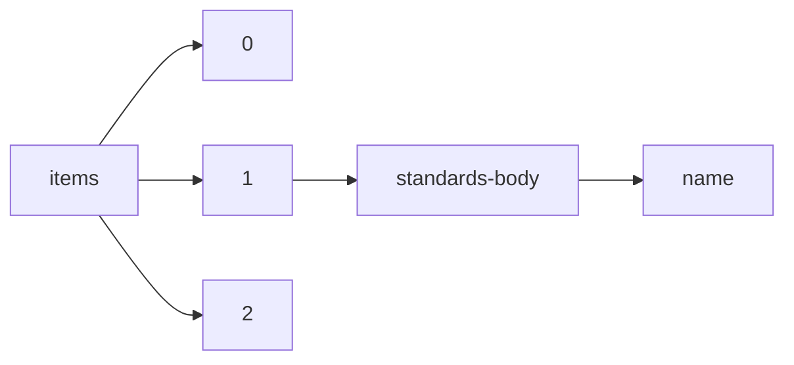

!!! warning "This document is not official Crossref documentation"
# Name
PATH = items/array/standards-body/name(1)  
Occurs 365 607 times  
Unique values: 502  
{ .annotate }

1. A route to an element, for example:  
   The route "items/array/standards-body/name" corresponds to navigating through the JSON indices as  
   ["items"][0]["standards-body"]["name"]  

| **Row** | **Value** `String`                                                                                | **Count** `Int64` |
|--------:|-----------------------------------------------------------------------------------------------------:|---------------------:|
| **1**   | BSI British Standards                                                                                | 150 820              |
| **2**   | ASTM International                                                                                   | 96 612               |
| **3**   | DIN Deutsches Institut für Normung e. V.                                                             | 48 304               |
| **4**   | SAE International                                                                                    | 43 663               |
| **5**   | United States Pharmacopeial Convention                                                               | 17 657               |
| **6**   | American Water Works Association                                                                     | 1 352                |
| **7**   | RSNA Case Collection                                                                                 | 1 307                |
| **8**   | LAN/MAN Standards Committee of the IEEE Computer Society                                             | 443                  |
| **9**   | IEEE                                                                                                 | 353                  |
| **10**  | International Commission on Illumination                                                             | 307                  |
| **11**  | 32NF - Technology Committee on Network and Facilities Infrastructure                                 | 224                  |
| **12**  | 20F - Technology Committee on Film                                                                   | 221                  |
| **13**  | Transformers of the IEEE Power and Energy Society                                                    | 183                  |
| **14**  | 10E - Technology Committee on Essence                                                                | 164                  |
| **15**  | Software &amp; Systems Engineering Standards Committee of the IEEE Computer Society                  | 161                  |
| **16**  | Switchgear of the IEEE Power and Energy Society                                                      | 152                  |
| **17**  | 24TB - Technology Committee on Television and Broadband Media                                        | 150                  |
| **18**  | IEEE-SASB Coordinating Committees                                                                    | 127                  |
| **19**  | 31FS - Technology Committee on File Formats and Systems                                              | 104                  |
| **20**  | Transmission and Distribution of the IEEE Power and Energy Society                                   | 89                   |
| **21**  | Nuclear Power Engineering of the IEEE Power and Energy Society                                       | 87                   |
| **22**  | International Virtual Observatory Alliance                                                           | 86                   |
| **23**  | 21DC - Technology Committee on Digital Cinema                                                        | 84                   |
| **24**  | National Information Standards Organization                                                          | 74                   |
| **25**  | Petroleum &amp; Chemical Industry of the IEEE Industry Applications Society                          | 71                   |
| **26**  | Switchgear Committee of the IEEE Power Engineering Society                                           | 69                   |
| **27**  | Design Automation of the IEEE Computer Society                                                       | 66                   |
| **28**  | 34CS - Technology Committee on Media Systems, Control and Services                                   | 65                   |
| **29**  | Substations of the IEEE Power and Energy Society                                                     | 65                   |
| **30**  | Microprocessor Standards Committee of the IEEE Computer Society                                      | 60                   |
| **31**  | Insulated Conductors of the IEEE Power and Energy Society                                            | 53                   |
| **32**  | Transformers Committee of the IEEE Power Engineering Society                                         | 50                   |
| **33**  | IEEE 11073 Standards Committee of the IEEE Engineering in Medicine and Biology Society               | 49                   |
| **34**  | Electric Machinery of the IEEE Power and Energy Society                                              | 45                   |
| **35**  | Transformers of the IEEE Power &amp; Energy Society                                                  | 45                   |
| **36**  | 30MR - Technology Committee on Metadata and Registries                                               | 43                   |
| **37**  | 35PM - Technology Committee on Media Packaging and Interchange                                       | 41                   |
| **38**  | Intelligent Transportation Systems of the IEEE Vehicular Technology Society                          | 40                   |
| **39**  | Surge Protective Devices/Low Voltage of the IEEE Power and Energy Society                            | 39                   |
| **40**  | Transmission and Distribution Committee of the IEEE Power Engineering Society                        | 39                   |
| **41**  | Power System Relaying and Control of the IEEE Power and Energy Society                               | 38                   |
| **42**  | Portable Applications of the IEEE Computer Society                                                   | 38                   |
| **43**  | Energy Development &amp; Power Generation of the IEEE Power and Energy Society                       | 38                   |
| **44**  | Nuclear Power Engineering Committee of the IEEE Power Engineering Society                            | 35                   |
| **45**  | Rail Transportation Standards Committee of the IEEE Vehicular Technology Society                     | 33                   |
| **46**  | Nuclear Power Engineering of the IEEE Power &amp; Energy Society                                     | 32                   |
| **47**  | Test Technology of the IEEE Computer Society                                                         | 32                   |
| **48**  | Gyro Accelerometer Panel of the IEEE Aerospace and Electronic Systems Society                        | 32                   |
| **49**  | Energy Storage &amp; Stationary Battery Committee of the IEEE Power and Energy Society               | 32                   |
| **50**  | National Committee on Radiation Instrumentation                                                      | 32                   |
| **51**  | Accredited Standards Committee on Electromagnetic Compatibility                                      | 30                   |
| **52**  | Transmission and Distribution of the IEEE Power &amp; Energy Society                                 | 29                   |
| **53**  | IEEE Power and Energy Society                                                                        | 26                   |
| **54**  | Power System Relaying of the IEEE Power and Energy Society                                           | 26                   |
| **55**  | Insulated Conductors Committee of the IEEE Power Engineering Society                                 | 25                   |
| **56**  | Power System Relaying of the IEEE Power &amp; Energy Society                                         | 24                   |
| **57**  | Standards Activities Board of the IEEE Computer Society                                              | 24                   |
| **58**  | Standards Development Committee of the IEEE Electromagnetic Compatibility Society                    | 23                   |
| **59**  | National Committee on Radiation Instrumentation, N42                                                 | 23                   |
| **60**  | Power Systems Engineering of the IEEE Industry Applications Society                                  | 23                   |
| **61**  | IEEE 11073TM Standards Committee of the IEEE Engineering in Medicine and Biology Society             | 23                   |
| **62**  | Portable Applications Standards Committee of the IEEE Computer Society                               | 22                   |
| **63**  | Insulated Conductors of the IEEE Power &amp; Energy Society                                          | 22                   |
| **64**  | Surge Protective Devices/High Voltage of the IEEE Power and Energy Society                           | 22                   |
| **65**  | Substations of the IEEE Power &amp; Energy Society                                                   | 21                   |
| **66**  | TC9 - Sensor Technology of the IEEE Instrumentation and Measurement Society                          | 20                   |
| **67**  | Corporate Advisory Group of the IEEE SA Board of Governors                                           | 20                   |
| **68**  | Learning Technology of the IEEE Computer Society                                                     | 20                   |
| **69**  | International Organization for Standardization                                                       | 19                   |
| **70**  | Power System Relaying Committee of the IEEE Power Engineering Society                                | 18                   |
| **71**  | Radiation Instrumentation of the Accredited Standards Committee N42                                  | 17                   |
| **72**  | American Society of Mechanical Engineers                                                             | 17                   |
| **73**  | Power Generation Committee of the IEEE Power Engineering Society                                     | 16                   |
| **74**  | Substations Committee of the IEEE Power Engineering Society                                          | 16                   |
| **75**  | Technical Committee on Computer Communications of the IEEE Computer Society                          | 16                   |
| **76**  | Bus Architecture Standards Committee of the IEEE Computer Society                                    | 15                   |
| **77**  | Dynamic Spectrum Access Networks Standards Committee of the IEEE Communications Society              | 15                   |
| **78**  | SCC20 - Test and Diagnosis for Electronic Systems                                                    | 14                   |
| **79**  | Standards Development Board of the IEEE Communications Society                                       | 14                   |
| **80**  | Surge Protective Devices Committee of the IEEE Power Engineering Society                             | 14                   |
| **81**  | Technical Books Coordinating Committee of the IEEE Industry Applications Society                     | 14                   |
| **82**  | Surge-Protective Devices Committee of the IEEE Power Engineering Society                             | 14                   |
| **83**  | Corporate Advisory Group of the IEEE-SA Board of Governors                                           | 14                   |
| **84**  | N/A                                                                                                  | 14                   |
| **85**  | Beilstein-Institut                                                                                   | 14                   |
| **86**  | Power Line Communications of the IEEE Communications Society                                         | 13                   |
| **87**  | Switchgear of the IEEE Power &amp; Energy Society                                                    | 13                   |
| **88**  | Power System Instrumentation and Measurements of the IEEE Power and Energy Society                   | 12                   |
| **89**  | Energy Development &amp; Power Generation of the IEEE Power &amp; Energy Society                     | 12                   |
| **90**  | Power System Communications of the IEEE Power &amp; Energy Society                                   | 12                   |
| **91**  | Petroleum and Chemical Industry of the IEEE Industry Applications Society                            | 12                   |
| **92**  | Standards Committee on Electromagnetic Compatibility, C63                                            | 12                   |
| **93**  | Microprocessor and Microcomputer Standards Subcommittee of the IEEE Computer Society                 | 12                   |
| **94**  | Cybersecurity and Privacy Standards Committee of the IEEE Computer Society                           | 11                   |
| **95**  | Power System Communications of the IEEE Power and Energy Society                                     | 11                   |
| **96**  | TC10 - Waveform Generation Measurement and Analysis of the IEEE Instrumentation and Measurement Soci | 11                   |
| **97**  | Standards Committee of the IEEE Engineering in Medicine and Biology Society                          | 11                   |
| **98**  | Industrial &amp; Commercial Power Systems Standards Development Committee of the IEEE Industry Appli | 11                   |
| **99**  | LAN MAN Standards Committee of the IEEE Computer Society                                             | 10                   |
| **100** | Energy Development and Power Generation Committee of the IEEE Power Engineering Society              | 10                   |
| **101** | Stationary Batteries Committee of the IEEE Power and Energy Society                                  | 10                   |
| **102** | 32NF &#x2014; Technology Committee on Network and Facilities Infrastructure                          | 10                   |
| **103** | Electric Machinery Committee of the IEEE Power Engineering Society                                   | 10                   |
| **104** | 25CSS - Technology Committee on Cinema Sound Systems                                                 | 10                   |
| **105** | Transmission Systems Committee of the IEEE Communications Society                                    | 9                    |
| **106** | Standards Coordinating Committee of the IEEE Computer Society                                        | 9                    |
| **107** | Petroleum and Chemical Industry Committee of the IEEE Industry Applications Society                  | 9                    |
| **108** | IEEE Broadcast Technology Society                                                                    | 9                    |
| **109** | Standards Committee of the IEEE Power Electronics Society                                            | 9                    |
| **110** | Software Engineering Standards Committee of the IEEE Computer Society                                | 9                    |
| **111** | Stationary Batteries Committee of the IEEE Power &amp; Energy Society                                | 9                    |
| **112** | Rotating Machinery Committee of the IEEE Power Engineering Society                                   | 9                    |
| **113** | Simulation Interoperability Stds Organization/Stds Activity Committee of the IEEE Computer Society   | 9                    |
| **114** | Surge Protective Devices/Low Voltage of the IEEE Power &amp; Energy Society                          | 8                    |
| **115** | Design Automation Standards Committee of the IEEE Computer Society                                   | 8                    |
| **116** | Microprocessor and Microcomputer Standards Committee of the IEEE Computer Society                    | 8                    |
| **117** | National Electrical Safety Code                                                                      | 8                    |
| **118** | Nuclear Instruments and Detectors of the IEEE Nuclear and Plasma Sciences Society                    | 7                    |
| **119** | IEEE Microwave Theory and Techniques Society                                                         | 7                    |
| **120** | Nuclear Instruments and Detectors Committee of the IEEE Nuclear and Plasma Sciences Society          | 7                    |
| **121** | Radar Systems Panel of the IEEE Aerospace and Electronic Systems Society                             | 7                    |
| **122** | Standards Committee of the IEEE Dielectrics and Electrical Insulation Society                        | 7                    |
| **123** | Data Compression Standards Committee of the IEEE Computer Society                                    | 7                    |
| **124** | Edge, Fog, Cloud Communications with IOT and Big Data Standards Committee of the IEEE Communications | 6                    |
| **125** | Rail Transit Vehicle Interface Standards Committee of the IEEE Vehicular Technology Society          | 6                    |
| **126** | Cement Industry of the IEEE Industry Applications Society                                            | 6                    |
| **127** | IEEE Reliability of the IEEE Reliability Society                                                     | 6                    |
| **128** | Instrumentation and Detectors Committee of the IEEE Nuclear and Plasma Sciences Society              | 6                    |
| **129** | Access and Core Networks Standards Committee of the IEEE Communications Society                      | 6                    |
| **130** | Simulation Interoperability Stds Organization/Stds Activities Committee of the IEEE Computer Society | 6                    |
| **131** | Blockchain Standards Committee of the IEEE Consumer Technology Society                               | 6                    |
| **132** | Antennas and Propagation Standards Committee of the IEEE Antennas and Propagation Society            | 6                    |
| **133** | IEEE Computer Society                                                                                | 5                    |
| **134** | IEEE Magnetics Society                                                                               | 5                    |
| **135** | Wave Propagation Standards Committee of the IEEE Antennas and Propagation Society                    | 5                    |
| **136** | Software Engineering Standards Subcommittee of the Technical Committee on Software Engineering of th | 5                    |
| **137** | Test Technology Standards Committee of the IEEE Computer Society                                     | 5                    |
| **138** | 34CS -                                                                                               | 5                    |
| **139** | Electric Machinery of the IEEE Power &amp; Energy Society                                            | 5                    |
| **140** | TC4 - High Frequency Measurement of the IEEE Instrumentation and Measurement Society                 | 4                    |
| **141** | Transmission Access &amp; Optical Systems of the IEEE Communications Society                         | 4                    |
| **142** | 32NF - full name of committee 32NF                                                                   | 4                    |
| **143** | Antennas of the IEEE Antennas and Propagation Society                                                | 4                    |
| **144** | SCC31 - Automatic Meter Reading and Energy Management                                                | 4                    |
| **145** | Gyro and Accelerometer Panel of the IEEE Aerospace and Electronic Systems Society                    | 4                    |
| **146** | IEEE Communications Society                                                                          | 4                    |
| **147** | IEEE Standards Coordinating Committee 20                                                             | 4                    |
| **148** | Artificial Intelligence Standards Committee of the IEEE Computer Society                             | 4                    |
| **149** | Technical Committee on Microprocessors and Microcomputers of the IEEE Computer Society               | 4                    |
| **150** | Standards Coordinating Committee 20, ATLAS                                                           | 4                    |
| **151** | Virtualized and Software Defined Networks, and Services Standards Committee of the IEEE Communicatio | 4                    |
| **152** | Petroleum and Chemical Industry Committee of the Industry Applications Society                       | 4                    |
| **153** | 31FS -                                                                                               | 4                    |
| **154** | Cement Industry Committee of the IEEE Industry Applications Society                                  | 4                    |
| **155** | IEEE Nuclear and Plasma Sciences Society                                                             | 4                    |
| **156** | Transmission Systems of the IEEE Communications Society                                              | 4                    |
| **157** | Power Systems Protection of the IEEE Industry Applications Society                                   | 4                    |
| **158** | National Electrical Manufacturers Association                                                        | 4                    |
| **159** | Standing Committee for Standards of the IEEE Robotics and Automation Society                         | 4                    |
| **160** | Surge Protective Devices/High Voltage of the IEEE Power &amp; Energy Society                         | 4                    |
| **161** | Power System Communications Committee of the IEEE Power Engineering Society                          | 4                    |
| **162** | IEEE Standards Committee                                                                             | 4                    |
| **163** | Switchgear Committee of the IEEE Power & Energy Society                                              | 3                    |
| **164** | Environmental Assessment of Standards Committee of the IEEE Computer Society                         | 3                    |
| **165** | 10E                                                                                                  | 3                    |
| **166** | IEEE Standards Coordinating Committee 28                                                             | 3                    |
| **167** | Standards Committee of the IEEE Photonics Society                                                    | 3                    |
| **168** | Power System Instrumentation and Measurements Committee of the IEEE Power Engineering Society        | 3                    |
| **169** | Industrial Power Converter of the IEEE Industry Applications Society                                 | 3                    |
| **170** | Storage Systems Standards Committee of the IEEE Computer Society                                     | 3                    |
| **171** | Blockchain and Distributed Ledgers of the IEEE Computer Society                                      | 3                    |
| **172** | Green ICT Standards Committee of the IEEE Communications Society                                     | 3                    |
| **173** | SCC21 - Fuel Cells, Photovoltaics, Dispersed Generation, and Energy Storage                          | 3                    |
| **174** | IEEE Ultrasonics, Ferroelectrics and Frequency Control of the IEEE Ultrasonics, Ferroelectrics and F | 3                    |
| **175** | Audio and Visual Techniques of the IEEE Broadcast Technology Society                                 | 3                    |
| **176** | IEEE Electromagnetic Compatibility Society                                                           | 3                    |
| **177** | Transformer Committee of the IEEE Power Engineering Society                                          | 3                    |
| **178** | Medical Information Bus Committee of the IEEE Engineering in Medicine and Biology Society            | 3                    |
| **179** | Information Assurance of the IEEE Computer Society                                                   | 3                    |
| **180** | IEEE Electron Devices Society                                                                        | 3                    |
| **181** | Standards Committee of the IEEE Electromagnetic Compatibility Society                                | 3                    |
| **182** | DIN Deutsches Institut für Normung e.V.                                                              | 3                    |
| **183** | Power System Instrumentation and Measurements of the IEEE Power &amp; Energy Society                 | 3                    |
| **184** | Design Automation Standards Committee of IEEE Computer Society                                       | 3                    |
| **185** | LAN/MAN Standards Committee of the IEEE Computer Society and the IEEE Microwave Theory and Technique | 3                    |
| **186** | Storage Systems of the IEEE Computer Society                                                         | 3                    |
| **187** | Industrial Electronics Society Standards Committee of the IEEE Industrial Electronics Society        | 3                    |
| **188** | SCC14 - Quantities, Units, and Letter Symbols                                                        | 3                    |
| **189** | Software Engineering Standards Subcommittee of the Software Engineering Technical Committee of the I | 2                    |
| **190** | IEEE Education Society                                                                               | 2                    |
| **191** | Test Technology Technical Council of the IEEE Computer Society                                       | 2                    |
| **192** | LAN/MAN Committee of the IEEE Computer Society                                                       | 2                    |
| **193** | IEEE Circuits and Systems Society                                                                    | 2                    |
| **194** | Power Relaying Committee of the IEEE Power Engineering Society                                       | 2                    |
| **195** | Technical Committee on Software Engineering of the IEEE Computer Society                             | 2                    |
| **196** | Power Systems Relaying Committee of the IEEE Power Engineering Society                               | 2                    |
| **197** | Traction Power Systems Standards Committee of the IEEE Vehicular Technology Society                  | 2                    |
| **198** | Portable Application Standards Committee of the IEEE Computer Society and the Open Group             | 2                    |
| **199** | Software Engineering Technical Committee of the IEEE Computer Society                                | 2                    |
| **200** | The Power Generating Committee of the IEEE Power Engineering Society                                 | 2                    |
| **201** | Standards Committee of the IEEE Consumer Technology Society                                          | 2                    |
| **202** | 31FS &#x2014; Technology Committee on File Formats and Systems                                       | 2                    |
| **203** | IEEE Power System Relaying Committee of the Power Engineering Society                                | 2                    |
| **204** | Technical Books Coordinating Committee                                                               | 2                    |
| **205** | Cloud Computing Standards Committee of the IEEE Computer Society                                     | 2                    |
| **206** | IEEE Switchgear Committee of the Power & Energy Society                                              | 2                    |
| **207** | Energy Systems of the IEEE Industry Applications Society                                             | 2                    |
| **208** | IEEE Standards Coordinating Committee 21                                                             | 2                    |
| **209** | Propagation of the IEEE Antennas and Propagation Society                                             | 2                    |
| **210** | Standards Committee of the IEEE Computational Intelligence Society                                   | 2                    |
| **211** | Electric Machinery Committee of the IEEE Power & Energy Society                                      | 2                    |
| **212** | Nuclear Instruments and Detectors of the Nuclear and Plasma Sciences Society                         | 2                    |
| **213** | Electric Machines of the IEEE Industry Applications Society                                          | 2                    |
| **214** | Joint Subcommittee of American National Standards Committees N13 and N42                             | 2                    |
| **215** | Waveguide Standards Committee of the IEEE Microwave Theory and Techniques Society                    | 2                    |
| **216** | IEEE Standards Coordinating Committee 21, Photovoltaics                                              | 2                    |
| **217** | Software Engineering Subcommittee of the Technical Committee on Software Engineering of the IEEE Com | 2                    |
| **218** | IEEE SCC 20 Committee of the IEEE Standards Board                                                    | 2                    |
| **219** | Information Assurance Committee of the IEEE Computer Society                                         | 2                    |
| **220** | The TEDL Subcommittee of Standards Coordinating Committee 20                                         | 2                    |
| **221** | Radio Transmitters Committee                                                                         | 2                    |
| **222** | Automated Instrumentation Technical Committee of the IEEE Instrumentation and Measurement Society    | 2                    |
| **223** | CrossRef                                                                                             | 2                    |
| **224** | Mike's Standards Consortium                                                                          | 2                    |
| **225** | Standards Committee of the IEEE Electron Devices Society                                             | 2                    |
| **226** | Ultrawideband Radar Committee of the IEEE Aerospace and Electronic Systems Society                   | 2                    |
| **227** | 30MR -                                                                                               | 2                    |
| **228** | Standards Committee of the IEEE Communications Society                                               | 2                    |
| **229** | Design Automation of IEEE Computer Society                                                           | 2                    |
| **230** | Mobile Communication Networks Standards Committee of the IEEE Communications Society                 | 2                    |
| **231** | Analytic Methods for Power Systems of the IEEE Power and Energy Society                              | 2                    |
| **232** | Power System Analysis, Computing, and Economics Committee of the IEEE Power and Energy Society       | 2                    |
| **233** | IEEE Standards Coordinating Committee 14                                                             | 2                    |
| **234** | Smart Manufacturing Standards Committee of the IEEE Computer Society                                 | 2                    |
| **235** | Electronics Transformer Technical Committee of the IEEE Power Electronics Society                    | 2                    |
| **236** | Power Systems Communications Committee of the IEEE Power Engineering Society                         | 2                    |
| **237** | IEEE Standards Coordinating Committee 21 Photovoltaics                                               | 2                    |
| **238** | TC8 - Automated Test Systems and Instrumentation of the IEEE Instrumentation and Measurement Society | 2                    |
| **239** | IEEE 11073 Standard Committee                                                                        | 2                    |
| **240** | Flight Vehicle Systems Committee of the IEEE Aerospace and Electronics Systems Society               | 2                    |
| **241** | 33TS -                                                                                               | 2                    |
| **242** | International Electrotechnical Commission Technical Committee 66                                     | 2                    |
| **243** | Transmission and Distribution Committee of the of the IEEE Power Engineering Society                 | 2                    |
| **244** | Blockchain Standards Committee of the IEEE Consumer Electronics Society                              | 2                    |
| **245** | Electronics Transformer Technical Committee of the IEEE Magnetics Society                            | 2                    |
| **246** | Technical Committee on Microcomputers and Microprocessors of the IEEE Computer Society               | 2                    |
| **247** | IEEE Instrumentation and Measurement Society                                                         | 2                    |
| **248** | Electronics Transformer Technical Committee of the lEEE Power Electronics Society                    | 2                    |
| **249** | Standards Committee of the IEEE Consumer Electronics Society                                         | 2                    |
| **250** | IEEE Power Generation Committee of the IEEE Power Engineering Society                                | 2                    |
| **251** | Digital Finance and Economy Standards Committee of the IEEE Consumer Technology Society              | 2                    |
| **252** | Video Techniques Committee                                                                           | 2                    |
| **253** | Local and Metropolitan Area Networks of IEEE Computer Society                                        | 2                    |
| **254** | Radio Receivers Committee                                                                            | 2                    |
| **255** | SCC39 - International Committee on Electromagnetic Safety                                            | 2                    |
| **256** | IEEE Standards Coordinating Committee 29 on Stationary Batteries                                     | 2                    |
| **257** | Software Engineering Standards Subcommittee of the Technical Committee on SoftwareEngineering of the | 2                    |
| **258** | Industrial &amp; Commercial Power Systems of the IEEE Industry Applications Society                  | 2                    |
| **259** | IEEE Standards Coordinating Committee 31 on Automatic Meter Reading and Energy Management            | 2                    |
| **260** | IEEE Standards Coordinating Committee 11                                                             | 2                    |
| **261** | IEEE-SASB                                                                                            | 2                    |
| **262** | Emerging Technology Standards Committee of the IEEE Consumer Technology Society                      | 2                    |
| **263** | IEEE Standards Coordinating Committee 20 on Test and Diagnosis for Electronic Systems                | 2                    |
| **264** | Learning Technology Standards Committee of the IEEE Computer Society                                 | 2                    |
| **265** | IEEE Standards Coordinating Committee 28, on Non-Ionizing Radiation Hazards                          | 1                    |
| **266** | Atomic Industrial Forum, Inc. Institute of Electrical and Electronics Engineers, Inc.                | 1                    |
| **267** | Technical Committee on High Frequency Frequency IEEE Instrumentation and Measurements Society        | 1                    |
| **268** | IEEE Standards Coordinating Committee on Dispersed Storage and Generation (SCC 23)                   | 1                    |
| **269** | Nuclear Power Engineering Committee ofthe IEEE Power Engineering Society                             | 1                    |
| **270** | Open Robotics                                                                                        | 1                    |
| **271** | American Society of Mechanical Engineers and IEEE                                                    | 1                    |
| **272** | Standards Committee of the IEEE Geoscience and Remote Sensing Society                                | 1                    |
| **273** | Outdoor Service Environmental committee of the lEEE Dielectrics and Electrical Insulation Society    | 1                    |
| **274** | IEEE Standards Coordinating Committee 21 on Fuel Cells, Photovoltaics, Dispersed Generation, and Ene | 1                    |
| **275** | Strategic and Emerging Standards Committee of the IEEE SA Board of Governors                         | 1                    |
| **276** | Digital Computer Definitions Subcommittee of the Electronic Computers Committee                      | 1                    |
| **277** | IEEE Standards Coordinating Committee 27 (SCC27) on Time and Frequency                               | 1                    |
| **278** | Power System Engineering Committee and the Rotating Machinery Committee of the IEEE Power Engineerin | 1                    |
| **279** | SCC04 - Electrical Insulation                                                                        | 1                    |
| **280** | IEEE 11073TM Standards Committee of the IEEE Engineering in Medicine and Biology Society  | 1                    |
| **281** | IEEE Standards Committee of the IEEE Quantum Electronics and Applications Society                    | 1                    |
| **282** | Industrial Drives Committee of the IEEE Industry Applications Society                                | 1                    |
| **283** | Fire Hazard Assessment Technical Committee of the IEEE Dielectrics and Electrical Insulation Society | 1                    |
| **284** | Voltage Endurance of the IEEE Dielectrics and Electrical Insulation Society                          | 1                    |
| **285** | National Electrical Safety Code of the Accredited Standards Committee C2                             | 1                    |
| **286** | Power System RelayCommittee of the IEEE Power Engineering Society                                    | 1                    |
| **287** | Software and Systems Engineering Standards Committee of the IEEE Computer Society                    | 1                    |
| **288** | SAW Devices Subcommittee of the IEEE Ultrasonics, Ferroelectrics, and Frequency Control Society      | 1                    |
| **289** | Bus Architecture Standards Committee of the lEEE Computer Society                                    | 1                    |
| **290** | Technical Committee on Oceanic Engineering and Technology of IEEE Computer Society                   | 1                    |
| **291** | Energy Development and Power Committee of the IEEE Power Engineering Society                         | 1                    |
| **292** | Technical Committee on Sensor Technology of the IEEE Instrument and Measurement Society              | 1                    |
| **293** | G-2.1 Audio Video Techniques Committee of the IEEE Broadcast Technology Society                      | 1                    |
| **294** | American Nuclear Society Standards Committee and Nuclear Power Engineering Committee of IEEE Power E | 1                    |
| **295** | Transmission and Distribution Committee of the IEEE PowerEngineeringsociety                          | 1                    |
| **296** | Transformers Committee of the Secretariat Institute of Elec National Electri                         | 1                    |
| **297** | IEEE Standards Coordinating Committee 20 on Test and Diagnosis for Electric Systems                  | 1                    |
| **298** | Accredited Standards Committee on Electromagnetic Compatibility, C63                                 | 1                    |
| **299** | IEEE Industry Applications Society                                                                   | 1                    |
| **300** | Group on Sonics and Ultrasonics of the IEEE Ultrasonics, Ferroelectrics and Frequency Control Societ | 1                    |
| **301** | Magnetic Transducers Committee of the IEEE Magnetics Group                                           | 1                    |
| **302** | Industrial Automation &amp; Control of the IEEE Industry Applications Society                        | 1                    |
| **303** | Power System Engineering Committee of the Power Engineering Society                                  | 1                    |
| **304** | Voltage Endurance Technical Committee of the IEEE Dielectrics and Electrical Insulation Society      | 1                    |
| **305** | Standards Association Standards Board of the IEEE-SASB Coordinating Committees                       | 1                    |
| **306** | Standards Committee on Radio Frequency Radiation Hazards, C95                                        | 1                    |
| **307** | Transmission and Distribution Committee of the IEEE Power Electronics Society                        | 1                    |
| **308** | Synchronous Machinery Subcommittee of the Electric Machinery Collection of the IEEE Power Engineerin | 1                    |
| **309** | Space Systems Panel of the IEEE Aerospace and Electronic Systems Society                             | 1                    |
| **310** | IRE Solid-state Devices Committee                                                                    | 1                    |
| **311** | Energy Development and Power Generating Committee of the Power Engineering Society                   | 1                    |
| **312** | Systems Operations Subcommittee of the IEEE Power Engineering Society                                | 1                    |
| **313** | IEEE Aerospace and Electronics System Group                                                          | 1                    |
| **314** | TC9 - Sensor Technology of IEEE Instrumentation and Measurement Society                              | 1                    |
| **315** | Electronics Transformer Technical Committee of the IEEE Power Engineering Society                    | 1                    |
| **316** | Standards Committee of the IEEE Electrical Insulation Society                                        | 1                    |
| **317** | Technical Counsel of the IEEE Power Engineering Society                                              | 1                    |
| **318** | International Committee on Electromagnetic Safety of the IEEE SA Board of Governors                  | 1                    |
| **319** | Standards Coordinating Committee on Quantities, Units, and Letter Symbols (SCC14)                    | 1                    |
| **320** | Audio-Video Techniques Committee of the IEEE Broadcast Technology Society                            | 1                    |
| **321** | the Switching Committee of the IEEE Communications Society                                           | 1                    |
| **322** | Stationary Batteries Committee of the IEEE Power & Energy Society                                    | 1                    |
| **323** | TC41 - Traffic Enforcement Technologies of the IEEE Instrumentation and Measurement Society          | 1                    |
| **324** | Nuclear Power Engineering Committee of the of the IEEE Power Engineering Society                     | 1                    |
| **325** | Software Engineering Standards committee of IEEE Computer Society                                    | 1                    |
| **326** | TC5 - Connectors in Measurements of the IEEE Instrumentation and Measurement Society                 | 1                    |
| **327** | IEEE Standards Coordinating Committee 32 on Intelligent Transportation Systems                       | 1                    |
| **328** | Switchgear Committee of the IEEE Power Group                                                         | 1                    |
| **329** | Special Purpose Cable Subcommittee of the Insulated Conductors Committee of the of the IEEE Power En | 1                    |
| **330** | Land Transportation of IEEE Vehicular Technology Society                                             | 1                    |
| **331** | Prepared by the Gyro and Accelerometer Panel of the IEEE Aerospace and Electronic Systems Society    | 1                    |
| **332** | Technical Committee on Operating Systems and Application Environments of the IEEE Computer Society   | 1                    |
| **333** | IEEE Standards Coordinating Committee 11 on Graphic Symbols and Designations                         | 1                    |
| **334** | Standards Development Committee of the Electromagnetic Compatibility Society                         | 1                    |
| **335** | AIEE Committee on Air Transportation                                                                 | 1                    |
| **336** | Software Engineering Standards Subcommittee of the IEEE Power Engineering Society                    | 1                    |
| **337** | Electromagnetic Compatibility Society Standards Committee of the IEEE Electromagnetic Compatibility  | 1                    |
| **338** | The Substation Committee of the IEEE Power Engineering Society                                       | 1                    |
| **339** | IEEE Solid-state Devices Committee                                                                   | 1                    |
| **340** | Capacitor Subcommittee of the IEEE Transmission and Distribution Committee                           | 1                    |
| **341** | Substation Committee of the IEEE Power Engineering Society                                           | 1                    |
| **342** | Design Automation Standards Subcommittee of the IEEE Computer Society                                | 1                    |
| **343** | Environmental Assessment Standards Committee of the IEEE Computer Society                            | 1                    |
| **344** | IEEE Electromagnetic Compatibility Group                                                             | 1                    |
| **345** | IEEE Standards Coordinating Committee 32                                                             | 1                    |
| **346** | IEEE Reliability Standards Committee of the IEEE Reliability Society                                 | 1                    |
| **347** | ABEC Brasil                                                                                          | 1                    |
| **348** | IEEE Transformers Committee                                                                          | 1                    |
| **349** | TC45 - Radiation and Nuclear Instrumentation and Systems of the IEEE Instrumentation and Measurement | 1                    |
| **350** | Accessories Subcommittee of the Insulated Conductors Committee of the IEEE Power Engineering Society | 1                    |
| **351** | Standard Coordination Committee on Planar Transmission Lines of the IEEE Microwave Theory and Techni | 1                    |
| **352** | IEEE 11073TM Standard Committee of the IEEE Engineering in Medicine and Biology Society              | 1                    |
| **353** | Standards Activities committee of the Ultrasonics Ferroelectrics society                             | 1                    |
| **354** | LAN MAN Standards Committee (LMSC) of the IEEE Computer Society                                      | 1                    |
| **355** | Surge Protective Devices Committee of the IEEE Power and Energy Society                              | 1                    |
| **356** | IEEE Power System Relaying Committee of the IEEE Power & Energy Society                              | 1                    |
| **357** | Nanotechnology Council Standards Committee of the IEEE Nanotechnology Council                        | 1                    |
| **358** | Standards Development Committee of the IEEE Electromagnetic Compatibility                            | 1                    |
| **359** | RF Techniques of the IEEE Broadcast Technology Society                                               | 1                    |
| **360** | Static Power Converter Committee and Industrial Drives Committee of the IEEE Industry Applications S | 1                    |
| **361** | NEMA Power Switchgear Assemblies, Low- and Medium-Voltage Power Circuit Breaker, Medium-Voltage Load | 1                    |
| **362** | Standards committee of the electromagnetic Compatibility Society                                     | 1                    |
| **363** | Instnunentation and Measurement Group of the lEEE Power Engineering Society                          | 1                    |
| **364** | Power system Engineering Committee ofthe IEEEPowerEngineering society                                | 1                    |
| **365** | Distributed Interactive Simulation Committee of the IEEE Computer Society                            | 1                    |
| **366** | Medical Information Bus Committee of the Engineering in Medicine and Biology Society                 | 1                    |
| **367** | IEEE Transmission and Distribution Committee and IEEE Substations Committee of the IEEE Power Engine | 1                    |
| **368** | Standards Committee of the IEEE Nanotechnology Council                                               | 1                    |
| **369** | Tests and Measurements Subcommittee of Insulated Conductors Committee                                | 1                    |
| **370** | 34CS &#x2014; Technology Committee on Media Systems, Control and Services                            | 1                    |
| **371** | IEEE 1073 Committee of the IEEE Engineering in Medicine and Biology Society                          | 1                    |
| **372** | Motor Vehicle Event Data Recorder (MVEDR) Committee of the IEEE Vehicular Technology Society         | 1                    |
| **373** | IEEE Standards Coordinating Committee 31                                                             | 1                    |
| **374** | Transmission and Distribution Committee of the Power Engineering Society                             | 1                    |
| **375** | Software Engineering Technical Subcommittee of the IEEE Computer Society                             | 1                    |
| **376** | Gyro and Accelerometer Panel of the IEEE Aerospace and Electronics Systems Society                   | 1                    |
| **377** | Standards Technical Committee of the IEEE Electromagnetic Compatability Society                      | 1                    |
| **378** | Audio and Visual Techniques Committee of the IEEE Broadcast Technology Society                       | 1                    |
| **379** | Electronic Transformers of the IEEE Magnetics Society                                                | 1                    |
| **380** | Microelectromechanical Systems (MEMS) Standards Development Committee of the IEEE Electron Devices S | 1                    |
| **381** | Nuclear Power Engineering Committee ofthe IEEX Power Engineering Society                             | 1                    |
| **382** | Industrial Drives of the IEEE Industry Applications Society                                          | 1                    |
| **383** | Medical Information Bus (MIB) Committee of the IEEE Engineering in Medicine and Biology Society      | 1                    |
| **384** | Electrical Power/Energy Systems Panel of the IEEE Aerospace and Electronic Systems Society           | 1                    |
| **385** | Performance Characteristics Subcommittee of the Transformers Committee of the IEEE Power Engineering | 1                    |
| **386** | Switchgear Committee                                                                                 | 1                    |
| **387** | Accredited Standards Committee on Rotating Electrical Machinery                                      | 1                    |
| **388** | Committee on Facsimile                                                                               | 1                    |
| **389** | Subcommittee on Ultrasound in Medicine of the Standards Activities Committee of the IEEE Ultrasonics | 1                    |
| **390** | 27C - Technology Committee on Cinema                                                                 | 1                    |
| **391** | IEEE Standards Coordinating Committee for Letter and Graphic Symbols                                 | 1                    |
| **392** | Transmission and Distribution Subcommittee of the IEEE Power Engineering Society                     | 1                    |
| **393** | Institute of Electrical and Electronics Engineers                                                    | 1                    |
| **394** | LAN/MAN Standards Committee of the IEEE omputer Society                                              | 1                    |
| **395** | IEEE Standards Coordinating Committee 29on Stationary Batteries                                      | 1                    |
| **396** | Power System Engineering and Electric Machinery Committees of the IEEE Power Engineering Society     | 1                    |
| **397** | Power Systems Engineering Committee of the Industry Applications Society                             | 1                    |
| **398** | Surge Protective Devices Committee of the of the IEEE Power Engineering Society                      | 1                    |
| **399** | Multifactor Stress Committee ofthe IEEE Dielectrics and Electrical Insulation Society                | 1                    |
| **400** | IEEE Insulated Conductors Committee of the Power Engineering Society                                 | 1                    |
| **401** | Transmission and Distribution Committee, of the IEEE Power Engineering society                       | 1                    |
| **402** | Accredited Standards Committee on Power Switchgear                                                   | 1                    |
| **403** | IEEE Standards Coordinating Committee 27 on Time and Frequency                                       | 1                    |
| **404** | Techuical Committee on Microcomputers and Microproceimors oft the Computer Society                   | 1                    |
| **405** | IEEE Nuclear and Plasma Sciences Society of the IEEE Nuclear and Plasma Sciences Society             | 1                    |
| **406** | Switchgear Committeeof the IEEE Power Engheenng Society                                              | 1                    |
| **407** | LAN/MAN Standards Committee                                                                          | 1                    |
| **408** | Simulation Interoperability Standards Committee of the IEEE Computer Society                         | 1                    |
| **409** | Petroleum and Chemical Industry Committee on IEEE Industry Applications Society                      | 1                    |
| **410** | IEEE Rail Transit Vehicle Interface Standards Committee of the IEEE Vehicular Technology Society     | 1                    |
| **411** | American National Standards Committee C76 on Apparatus Bushing Standardization                       | 1                    |
| **412** | Radiation Effects of the IEEE Dielectrics and Electrical Insulation Society                          | 1                    |
| **413** | Standards Coordinating Committee No 4 on Thermal Rating of the IEEE Standards Committee              | 1                    |
| **414** | lEEE Standards Coordinating Committee 23                                                             | 1                    |
| **415** | IEEE Standards Coordinating Committee 23, Dispersed Storage and Generation                           | 1                    |
| **416** | Operating Systems and Application Environments of the IEEE Computer Society                          | 1                    |
| **417** | Standards Committee of the IEEE Systems, Man, and Cybernetics Society                                | 1                    |
| **418** | CAS Standards Committee of IEEE Circuits and Systems Society                                         | 1                    |
| **419** | Software Engineering Technical Committee of the of the IEEE Computer Society                         | 1                    |
| **420** | Static Power Converter Committee of the IEEE Industry Applications Society                           | 1                    |
| **421** | Transmission Systems and Access Committee of the IEEE Communications Society                         | 1                    |
| **422** | Software Engineering StandardsCommittee of the IEEE Computer Society                                 | 1                    |
| **423** | IEEE Standards Coordinating Committee 14 on Quantities and Units                                     | 1                    |
| **424** | Stationary Batteries Committee of the IEEE Power Engineering Society                                 | 1                    |
| **425** | Standards Coordinating Committee 4 on Thermal Rating of the IEEE Electrical Insulation Society       | 1                    |
| **426** | IEEE Switchgear Committee of the IEEE Power & Energy Society                                         | 1                    |
| **427** | Portable Applications Standards Committee                                                            | 1                    |
| **428** | Power Communications Committee of the IEEE Power Engineering Society                                 | 1                    |
| **429** | Substation Committee of the Power Engineering Society                                                | 1                    |
| **430** | Microprocessor and Microcomputer Standards Subcommittee of the of the IEEE Computer Society          | 1                    |
| **431** | Land Transportation of the IEEE Vehicular Technology Society                                         | 1                    |
| **432** | Electronics Transformers Technical Committee of the IEEE Power Electronics Society                   | 1                    |
| **433** | TC39 Measurements in Power Systems of the IEEE Instrumentation and Measurement Society               | 1                    |
| **434** | Substation Committee and Transmission and Distribution Committee of the IEEE Power Engineering Socie | 1                    |
| **435** | Energy Development and Power Generation Committee of the of the IEEE Power Engineering Society       | 1                    |
| **436** | Standards Coordinating Committee 23                                                                  | 1                    |
| **437** | Induction and Dielectric Heating Subcommittee of the Committee on Electric Heating                   | 1                    |
| **438** | IEEE Standards Coordinating Committee 4,Thermal Rating                                               | 1                    |
| **439** | Power Systems Engineering Committee of the IEEE Power Engineering Society                            | 1                    |
| **440** | Subcommittee on Photovoltaic Energy Storage Systems of the IEEE Standards Coordinating Committee on  | 1                    |
| **441** | Guidance &amp; Control Systems Panel of the IEEE Aerospace and Electronic Systems Society            | 1                    |
| **442** | Switchgear Committeeof the IEEE Power EngkwmgSociety                                                 | 1                    |
| **443** | Stationary Battery Committee of the IEEE Power Engineering Society                                   | 1                    |
| **444** | American National Standards Committee N 42 on Radiation Instrumentation                              | 1                    |
| **445** | IEEE Standards Coordinating Committee 14 on Quantities, Units, and Letter Symbols                    | 1                    |
| **446** | Distributed Generation, Energy Storage and Interoperability Standards Committee of the IEEE SA Board | 1                    |
| **447** | ATLAS 771 Subcommittee of the IEEE Standards Coordinating Committee 20                               | 1                    |
| **448** | Design Automation Technical Committee of the IEEE Computer Society                                   | 1                    |
| **449** | Waveguide Standards Committee of the E Microwave Theory and Techniques Society                       | 1                    |
| **450** | Standards Committee of the Electromagnetic Compatibility Society                                     | 1                    |
| **451** | Electronics Transformers Committee of the IEEE Parts, Materials, and Packaging Group                 | 1                    |
| **452** | IEEE Standards Coordinating Committee 21 (SCC 21) on Fuel Cells, Photovotaics, Dispersed Generation, | 1                    |
| **453** | Industrial Power Converter                                                                           | 1                    |
| **454** | Technical Committee on Sensor Technology (TC-9) of the IEEE Instrumentation and Measurement Society  | 1                    |
| **455** | Portable Application Standards Committee of the IEEE Computer Society                                | 1                    |
| **456** | Insulation Subcommittee of the Rotating Machinery Committee                                          | 1                    |
| **457** | Standards Committee on Power Switchgear, C37                                                         | 1                    |
| **458** | Standards Committee of the IEEE Education Society                                                    | 1                    |
| **459** | IEEE Standards Coordinating Committee 4, Thermal Rating                                              | 1                    |
| **460** | IEEE Standards Coordinating Committee on Letter and Graphic Symbols                                  | 1                    |
| **461** | American National Standards Committee on Equipment and Materials for Medical Radiation Applications  | 1                    |
| **462** | Standard Technical Committee of the IEEE ctmn Devices Society                                        | 1                    |
| **463** | the American National Standards Committee on Radiation Instrumentation                               | 1                    |
| **464** | the Transmission Systems Committee of the IEEE Communications Society                                | 1                    |
| **465** | Power System Communications Committee of the IEEE Power & Energy Society                             | 1                    |
| **466** | Software Engineering Technical Committee of the Computer Society                                     | 1                    |
| **467** | Surge Protective Devices Committee of the IEEE Power & Energy Society                                | 1                    |
| **468** | IEEE SA Board of Governors                                                                           | 1                    |
| **469** | Switchgear Committee of the of the IEEE Power Engineering Society                                    | 1                    |
| **470** | Crossref Standards                                                                                   | 1                    |
| **471** | Substations committee of the IEEE Power Engineering Society                                          | 1                    |
| **472** | Power System Engineering Committee of the IEEE Power Engineering Society                             | 1                    |
| **473** | Standards Committee of the IEEE Computer Society                                                     | 1                    |
| **474** | Latchup Committee of the IEEE Electron Devices Society                                               | 1                    |
| **475** | American National Standards Committee N42 on Radiation Instrumentation                               | 1                    |
| **476** | Gyro and Accelerometer Panel of the IEEE Aerospace Electronics System Society                        | 1                    |
| **477** | Storage Standards Committee of the IEEE Computer Society                                             | 1                    |
| **478** | Smart Buildings, Loads and Customer Systems of the IEEE Power and Energy Society                     | 1                    |
| **479** | Standards Committee of the IEEE Ultrasonics, Ferroelectrics, and Frequency Control Society           | 1                    |
| **480** | Microprocessors and Microcomputers Committee of the IEEE Computer Society                            | 1                    |
| **481** | IEEE Transmission Systems Committee of the IEEE Communications Society                               | 1                    |
| **482** | Excitation Systems Subcommittee of the Power Generation Committee of the IEEE Power Engineering Soci | 1                    |
| **483** | Microprocessors and Microcomputers Standards Committee of the IEEE Computer Society                  | 1                    |
| **484** | Insulated Conductors of IEEE Power & Energy Society                                                  | 1                    |
| **485** | IEEE Antennas and Propagation Society                                                                | 1                    |
| **486** | Outdoor Service Environment Committee of the IEEE Dielectrics and Electrical Insulation Society      | 1                    |
| **487** | Standards Coordination and Liaison Committee of the IEEE Communications Society                      | 1                    |
| **488** | National Committee on RadiationInstrumentation, N42                                                  | 1                    |
| **489** | IEEE Standards Coordinating Committee 27                                                             | 1                    |
| **490** | Journal of Aesthetic Medicine                                                                        | 1                    |
| **491** | Electric Machines Committee of the Industry Applications Society                                     | 1                    |
| **492** | Insulating Conductors Committee of the Power Engineering Society                                     | 1                    |
| **493** | Standards Committee of the IEEE Microwave Theory and Techniques Society                              | 1                    |
| **494** | IEEE Power Systems Relaying Committee of the IEEE Power Engineering Society                          | 1                    |
| **495** | Design Automation Technical Committee of the IEEE Computer Society and IEEE Standards Coordinating C | 1                    |
| **496** | Petroleum and Chemical Industry Committee of the IEEE Industrial Applications Society                | 1                    |
| **497** | IEEE Standards Coordinating Committee 21 on Photovoltaics                                            | 1                    |
| **498** | Industrial and Commercial Power Systems Committee of the IEEE Industry Applications Society          | 1                    |
| **499** | Statistical Technical Committee of the IEEE Dielectrics and Electrical Insulation Society            | 1                    |
| **500** | IEEE Standards Coordinating Committee 28 on Non-Ionizing Radiation Hazards                           | 1                    |
| **501** | Software Engineering Committee of the IEEE Power Engineering Society                                 | 1                    |
| **502** | Power Systems Instrumentation and Measurement Committee of the IEEE Power Engineering Society        | 1                    |

